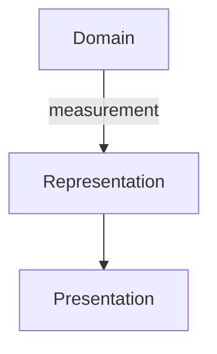

# Mermaid

[Catalogue](README.md) · Category: **Diagram notation** · Research: **2026-09-10**

## Purpose and abstraction level

Diagrams in Markdown/web: flow, sequence, class, state and other perspectives. Accessible presentation of selected model portions.

## Model mechanisms

Identity: local node IDs. Relations: diagram-specific arrows. Contracts: textual explanation, not validation. Viewpoints: each diagram text is a selection. Extension: configuration/integration; parsing/rendering adds no SDP semantics.

## Strengths and limitations — our assessment

**Strength:** Owners can read diagrams alongside review text; useful output for generated bounded viewpoints.

**Limitation:** Separate diagrams may drift apart. Successful parsing says little about architecture; host Mermaid versions constrain syntax.

## History, change and transitions

Git stores text. Sequence-oriented diagram types do not describe model history; define transition identity/responsibility separately.

## Illustrative example

Partial view, not the complete proposed MVP1 layering. The example has not been parser/runtime tested.

## Tools, maintenance and terms

Documentation/repository available; MIT, not archived. Pin renderer versions for reproducible builds.

## Primary sources

All sources checked on 2026-09-10; see the catalogue methodology for evidence and licensing limits. Translation does not refresh these dated findings.

- [Mermaid introduksjon](https://mermaid.js.org/intro/)
- [Official repository; metadata checked through GitHub API](https://github.com/mermaid-js/mermaid)
