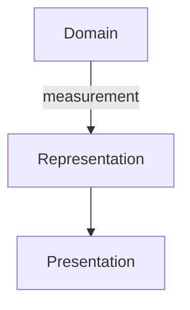

# Mermaid

[Katalog](README.md) · Kategori: **Diagramnotasjon** · Research: **2026-09-10**

## Formål og abstraksjonsnivå

Diagrammer i Markdown/web: flyt, sekvenser, klasser, tilstander og andre perspektiver. Nyttig som lett tilgjengelig presentasjon av et utsnitt.

## Modellmekanismer

Identitet: lokale node-ID-er. Relasjoner: diagramavhengige piler. Contracts: tekstlig forklaring, ikke kontraktsvalidering. Viewpoints: hver diagramtekst er et utsnitt. Utvidelse: konfigurasjon og integrasjoner; parser/rendering gir ikke SDP-semantikk.

## Styrker og begrensninger — vår vurdering

**Styrke:** Eieren kan lese diagramskisser sammen med reviewtekst. Godt format for genererte, avgrensede viewpoints.

**Begrensning:** Separate diagrammer kan drive fra hverandre. En grønn parser sier lite om arkitekturen, og vertens Mermaid-versjon begrenser syntaksen.

## Historikk, endring og transitions

Git lagrer teksten. Diagramtyper for forløp beskriver ikke modellens historikk; transition-identitet og ansvar må defineres separat.

## Illustrativt eksempel

Kun illustrativt utsnitt; ikke den komplette foreslåtte MVP1-lagdelingen. Eksemplet er ikke parser-/runtime-testet.

## Verktøy, vedlikehold og vilkår

Dokumentasjon og repository er tilgjengelige; MIT, ikke arkivert. Pinn renderer-versjonen ved reproducerbare builds.

## Primærkilder

Alle kilder kontrollert 2026-09-10; se katalogens metode for evidens- og lisensbegrensninger.

- [Mermaid introduksjon](https://mermaid.js.org/intro/)
- [Offisielt repository; metadata kontrollert via GitHub API](https://github.com/mermaid-js/mermaid)
