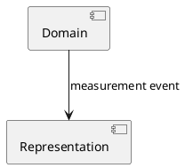

# PlantUML

[Catalogue](README.md) · Category: **Diagram notation** · Research: **2026-09-10**

## Purpose and abstraction level

Text-to-UML-like diagrams and other diagram families; useful for sequences and small structural documentation views.

## Model mechanisms

Identity: diagram-local aliases. Relations: drawn connections. Contracts: illustrated, not enforced. Viewpoints: separate diagrams/includes, not automatically one semantic model. Extension: preprocessing, macros and libraries; machine rendering.

## Strengths and limitations — our assessment

**Strength:** Easy Git review and many diagram types; possible SDP-Analyzer output format.

**Limitation:** Renderable drawings prove neither allowed dependencies nor consistency between diagrams. Not a replacement for a UML metamodel.

## History, change and transitions

Git provides text diffs. Before/after responsibility moves can be drawn, but identity/transition rules must come from another model.

## Illustrative example

Drawing; its arrow is not a verified event contract. The example has not been parser/runtime tested.

## Tools, maintenance and terms

Project/documentation available. Metadata lists LGPL-3.0; PlantUML offers different distributions, so check the selected artifact/integration terms.

## Primary sources

All sources checked on 2026-09-10; see the catalogue methodology for evidence and licensing limits. Translation does not refresh these dated findings.

- [Primary documentation](https://plantuml.com/)
- [Official repository; metadata checked through GitHub API](https://github.com/plantuml/plantuml)
