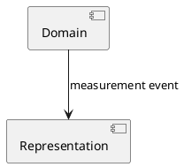

# PlantUML

[Katalog](README.md) · Kategori: **Diagramnotasjon** · Research: **2026-09-10**

## Formål og abstraksjonsnivå

Tekst til UML-lignende diagrammer og flere andre diagramfamilier. Velegnet til sekvensbilder og små strukturutsnitt i dokumentasjon.

## Modellmekanismer

Identitet: diagramlokale aliaser. Relasjoner: tegnede forbindelser. Contracts: illustreres, ikke håndheves. Viewpoints: separate diagrammer/includes, ikke automatisk én semantisk modelbase. Utvidelse: preprocessing, macros og biblioteker; maskinell rendering.

## Styrker og begrensninger — vår vurdering

**Styrke:** Lav terskel for review i Git og mange diagramtyper. Kan være et outputformat fra SDP-Analyzer.

**Begrensning:** En renderbar tegning beviser verken lovlige dependencies eller samsvar mellom flere diagrammer. Ikke erstatning for en UML-metamodel.

## Historikk, endring og transitions

Tekstdiff via Git. Før/etter og ansvarsflytting kan tegnes, men identitetskobling og overgangsregler må komme fra en annen modell.

## Illustrativt eksempel

Illustrativ tegning; pilen er ikke et verifisert event-contract. Eksemplet er ikke parser-/runtime-testet.

## Verktøy, vedlikehold og vilkår

Prosjekt og dokumentasjon er tilgjengelige. Repositorymetadata oppgir LGPL-3.0; PlantUML tilbyr ulike distribusjoner, så vilkår må kontrolleres for valgt artefakt og eventuelle integrasjoner.

## Primærkilder

Alle kilder kontrollert 2026-09-10; se katalogens metode for evidens- og lisensbegrensninger.

- [Offisiell dokumentasjon](https://plantuml.com/)
- [Offisielt repository; metadata kontrollert via GitHub API](https://github.com/plantuml/plantuml)
