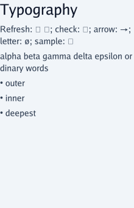
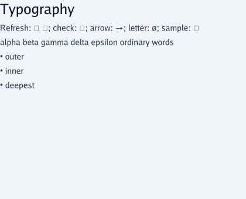

# XFMD gap study evidence — XGS1–XGS3

Date: 2026-09-29. Candidate: `a274265f9e3333291edc9da3db9047c8add7c37f`.
Method: same-agent source inspection, isolated CLI probes, selected Go tests and
visual export inspection. **No independent review or native GUI acceptance.**

## Provenance

[Source manifest](evidence/source-manifest.json) pins selected producer files,
the external gap report, baseline, probe harness and inspected XFMD sources.
The external HEAD is `41fa4948c5377edd792ba3f503e6b92b0fd4717a`; its report is
untracked and identified by SHA256, not that commit. Its declared SDP baseline
is `3b4cff695ecab36a0e897052e3f096bbeb9f3ea0`. The study uses the later candidate
above and reproduces behavior rather than assuming equivalent capabilities.

Report SHA256 remained
`6bb59190e2a35ccd8034137009e2fbf044c3793680eab2fbf24ea754ba169f6b`.
External path: `SDP/02--Requirements/XFMD-Modeling/Gaps.md` in
`/home/warloc/git/xfmd-sdl-navigation` (external checkout, not a required local dependency).

Tracked Go modules were extracted with `git archive` into `/tmp/xgs1-study/source`.
No untracked `SDL/go/sourceinput` or Node work entered the build. Builds used
Go 1.27.1, local cached dependencies and `-mod=readonly`; no dependency updates.
Go's initial VCS stamping failed in the archive, so subsequent builds/tests used
`-buildvcs=false`. This affects build metadata, not parser behavior.

## Executed checks

| Evidence | Actual result | Limit |
| --- | --- | --- |
| [External 21-case harness](evidence/run_external_probes.py), [results](evidence/probe-results.json) | 21/21 expected exits/diagnostics matched, including negative cases | Rejecting an invented widget proves its spelling is unsupported, not that it is the required future syntax |
| [Five supplemental fixtures/results](evidence/extra/results.json) | Local reuse accepted; component-import syntax rejected; HTML/image SVG rejected; sequence fence exported as explicit Mermaid placeholder | No real sequence diagram renderer invoked; ref remains a domain reference |
| [Test summary](evidence/test-summary.json) | 10 packages pass; 34 top-level tests/fuzz seed entrypoints pass, 1 renderer test skipped. Including nested subtest/fuzz-seed pass events: SDL 173, SDUI 27 | No fuzz campaign, race run, full repository suite, real renderer or native GUI run |
| [Glyph probe](evidence/glyph_probe.go), [result](evidence/glyph-results.json) | Four sampled symbols map to glyph zero without render error; ordinary words split; list depth absent | Bounded sample and embedded Go Regular, not a universal Unicode diagnosis |
| [220-wide SVG](evidence/typography-220.svg), [420-wide SVG](evidence/typography-420.svg) | Both rasterized with rsvg-convert and visually inspected; missing glyph boxes and flat lists at both widths; split ordinary word at 220 | Static exports, not actual Fyne/FOX behavior |
| Binding/runtime source and tests | Existing typed bridge and UI-state protections confirmed by tests named below | Current result path is text into an input; no generic collection or XFMD C++ binding proved |
| Selected XFMD source inspection | Save before read and URI validation before cancellation confirmed | No XFMD test run, no inferred whole-workflow coverage |

Initial test runs lacked archived fixtures: SDL `TestArchitectureModel` could
not find SDUI/design/architecture.design; SDUI `TestSourceASTParity` and
`TestConcept1Geometry` could not find examples. Tracked SDUI/design, examples and
evidence were then added from the **same commit**, and only the affected parser/
layout packages rerun. All passed. Both initial and corrected JSON logs are
retained; the summary uses the corrected result for rerun packages.

- [SDL initial](evidence/sdl-tests.jsonl) / [parser rerun](evidence/sdl-retest.jsonl).
- [SDUI initial](evidence/sdui-tests.jsonl) / [parser/layout rerun](evidence/sdui-retest.jsonl).
- `TestConfiguredRenderer` skipped because SDUI_MMDR was not configured. This
  study makes no claim that a real external renderer passed.

The important passing behavior checks include SDL `TestInvalidBindingPlansInstallNothing`,
`TestEchoButtonAndInput`, `TestSimulatedEditAptCell`, `TestTypedCallsAndRegistration`,
`TestInvalidResultAndPanicConsumed`, `TestReloadWaitsAndPreservesState`; SDUI
`TestEventsAndAtomicUpdates`, `TestDraftConflictAndCommit`,
`TestReloadIdentityDraftFocusAndRevocation`, `TestChangedBindingDoesNotReuseHandler`
and Markdown `TestProfileAndResources`.

## Reproduction

Run from the repository root; use a fresh temporary directory. Set `goexe` to a
compatible installed Go binary. The sample matches this session's toolchain.
Python only orchestrates subprocesses; there is no Python SDL/SDUI parser.

```sh
study_tmp=$(mktemp -d /tmp/xfmd-gap-study.XXXXXX)
repo_root=$PWD
candidate=a274265f9e3333291edc9da3db9047c8add7c37f
goexe=/home/warloc/.local/share/sdp-toolchains/go1.27.1/go/bin/go
mkdir -p "$study_tmp/source" "$study_tmp/bin" "$study_tmp/probes"
git archive "$candidate" SDL/go SDUI/go SDUI/examples SDUI/design SDUI/evidence |
  tar -x -C "$study_tmp/source"
export GOMAXPROCS=2 GOCACHE="$study_tmp/go-cache" GOWORK=off GOTOOLCHAIN=local
"$goexe" -C "$study_tmp/source/SDL/go" build -buildvcs=false -p 2 -mod=readonly -o "$study_tmp/bin/sdl" ./cmd/sdl
"$goexe" -C "$study_tmp/source/SDUI/go" build -buildvcs=false -p 2 -mod=readonly -o "$study_tmp/bin/sdui" ./cmd/sdui
cp SDP/02--Requirements/XFMD-Gaps/evidence/run_external_probes.py "$study_tmp/probes/run_probes.py"
python3 "$study_tmp/probes/run_probes.py" --sdl "$study_tmp/bin/sdl" --sdui "$study_tmp/bin/sdui" --producer-commit "$candidate"
"$goexe" -C "$study_tmp/source/SDL/go" test -buildvcs=false -p 2 -mod=readonly -count=1 -json ./parser ./runtime ./bridge ./reload > "$study_tmp/sdl-tests.jsonl"
"$goexe" -C "$study_tmp/source/SDUI/go" test -buildvcs=false -p 2 -mod=readonly -count=1 -json ./parser ./runtime ./reload ./layout ./markdown ./codegen > "$study_tmp/sdui-tests.jsonl"
"$goexe" -C "$study_tmp/source/SDUI/go" run -buildvcs=false -mod=readonly "$repo_root/SDP/02--Requirements/XFMD-Gaps/evidence/glyph_probe.go"
for width in 220 420; do
  "$study_tmp/bin/sdui" SDP/02--Requirements/XFMD-Gaps/evidence/typography.sdui --format svg --entry page --width "$width" --height 340 -o "$study_tmp/typography-$width.svg"
  rsvg-convert "$study_tmp/typography-$width.svg" -o "$study_tmp/typography-$width.png"
done
```

The external harness is retained byte-for-byte from XFMD XM-M2 for reproducible
cross-project comparison; its source hash is in the manifest. It writes beside
itself, so run the temporary copy. Raw binary hashes and original command paths
are retained in probe-results.json; temporary paths need not match on replay.
Supplemental commands/exit codes are in extra/results.json. Reuse those fixtures
with the new binary path and the same `--entry page` and format.

## Inspected exports





The supported arrow and letter are controls for the missing-glyph sample.
Successful SVG serialization clearly does not establish correct text fidelity.

## Study closeout checks

XGS2 provides one disposition for all 14 language/UI IDs and all six XFMD-local
IDs. XGS3 maps each to an existing owner or two new SDUI cards and a proposed
milestone/acceptance sequence. No language or product implementation changed.
Current governing profiles remain unchanged because this is a recommendation.

Management replay, Toolkit repository validation, local Markdown links, source
hashes and whitespace checks passed; counts and limits are recorded in
[StudyPlan.md](StudyPlan.md#closeout-verification). The retained artifact bytes are
pinned in [artifact-hashes.json](evidence/artifact-hashes.json). Evidence describes actual
execution; it does not confer owner acceptance. Git writes were unavailable during study execution. The owner subsequently
restored access and requested the recovery commit described in StudyPlan.md.
