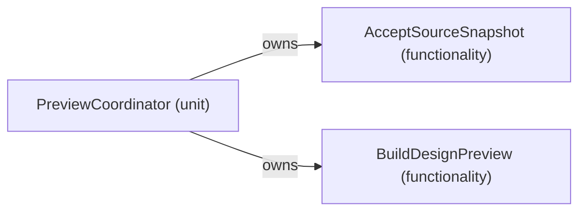
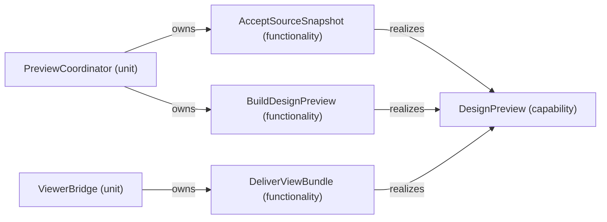
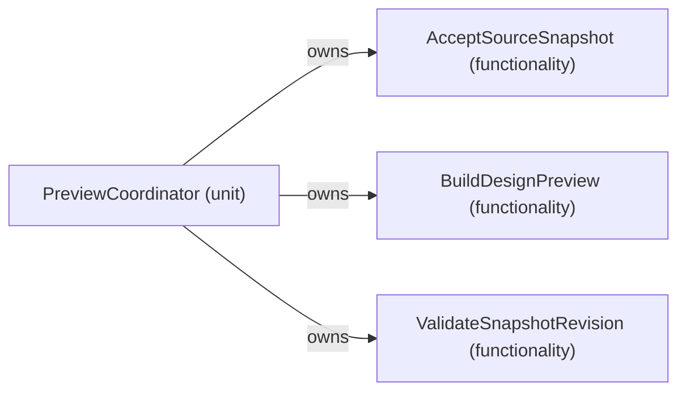
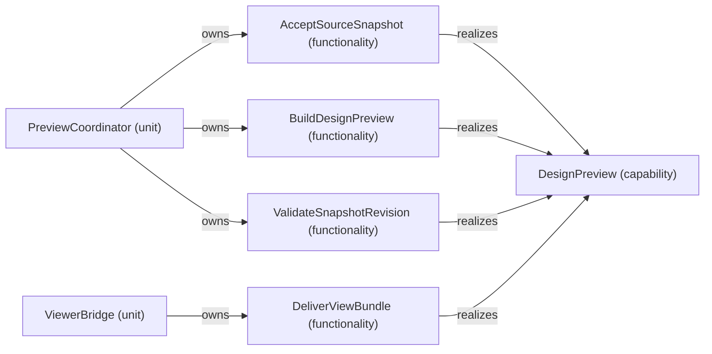
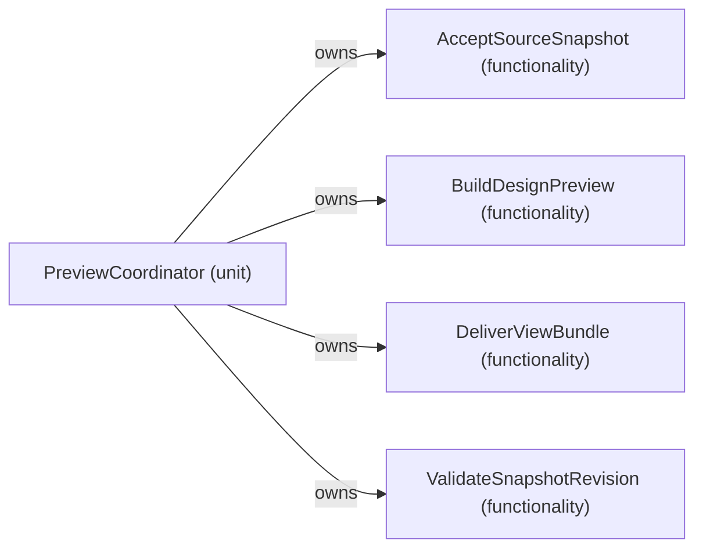
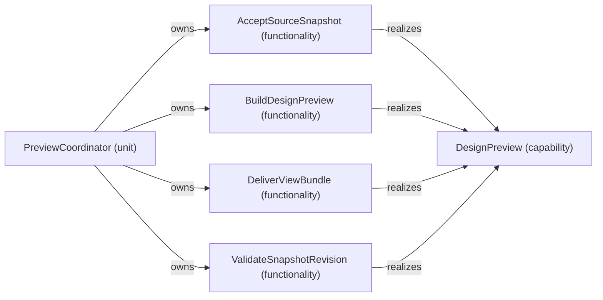

# BP1 model extracts — generated research evidence

Generated by probe.py through the existing Go SDL parser and viewpoint tool.

Target and drift inputs are study proposals, not adopted system design.

# current: PreviewCoordinator

# VP03 — Responsibilities and capabilities across the architecture

Revision: `44adae9604a5f555c3ac4e00eb77c5cc2a28da2979ed7e84d3e411252a0b9a35`.

owns, realizes and provides. Capability is not Feature.

Selection: `{"viewpoint":"VP03","focus":"PreviewCoordinator","direction":"both","depth":1,"diagram":"VP03-DesignPreview"}`.

## Contributions to capability: DesignPreview

Source facts: f0057, f0058.

# current: SdpToolProcess

# VP03 — Responsibilities and capabilities across the architecture

Revision: `44adae9604a5f555c3ac4e00eb77c5cc2a28da2979ed7e84d3e411252a0b9a35`.

owns, realizes and provides. Capability is not Feature.

Selection: `{"viewpoint":"VP03","focus":"SdpToolProcess","direction":"both","depth":2,"diagram":"VP03-DesignPreview"}`.

## Contributions to capability: DesignPreview

Source facts: f0002, f0005, f0018, f0057, f0058, f0103.

# target: PreviewCoordinator

# VP03 — Responsibilities and capabilities across the architecture

Revision: `f5f88b57d67fd722bcf54c8ded0f46f905f749b5052780ed0f36706b0b3db8bf`.

owns, realizes and provides. Capability is not Feature.

Selection: `{"viewpoint":"VP03","focus":"PreviewCoordinator","direction":"both","depth":1,"diagram":"VP03-DesignPreview"}`.

## Contributions to capability: DesignPreview

Source facts: f0057, f0058, f0059.

# target: SdpToolProcess

# VP03 — Responsibilities and capabilities across the architecture

Revision: `f5f88b57d67fd722bcf54c8ded0f46f905f749b5052780ed0f36706b0b3db8bf`.

owns, realizes and provides. Capability is not Feature.

Selection: `{"viewpoint":"VP03","focus":"SdpToolProcess","direction":"both","depth":2,"diagram":"VP03-DesignPreview"}`.

## Contributions to capability: DesignPreview

Source facts: f0002, f0005, f0018, f0057, f0058, f0059, f0106, f0108.

# ownership-drift: PreviewCoordinator

# VP03 — Responsibilities and capabilities across the architecture

Revision: `f901db263c917301d5366f604006a5388b4d95b9e390580942c2fbd43f11f557`.

owns, realizes and provides. Capability is not Feature.

Selection: `{"viewpoint":"VP03","focus":"PreviewCoordinator","direction":"both","depth":1,"diagram":"VP03-DesignPreview"}`.

## Contributions to capability: DesignPreview

Source facts: f0057, f0058, f0059, f0060.

# ownership-drift: SdpToolProcess

# VP03 — Responsibilities and capabilities across the architecture

Revision: `f901db263c917301d5366f604006a5388b4d95b9e390580942c2fbd43f11f557`.

owns, realizes and provides. Capability is not Feature.

Selection: `{"viewpoint":"VP03","focus":"SdpToolProcess","direction":"both","depth":2,"diagram":"VP03-DesignPreview"}`.

## Contributions to capability: DesignPreview

Source facts: f0002, f0005, f0018, f0057, f0058, f0059, f0060, f0107.

