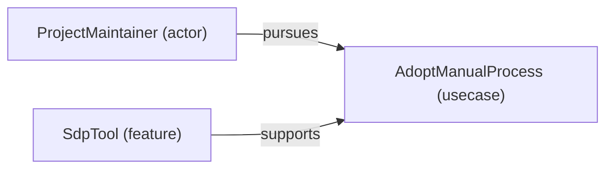
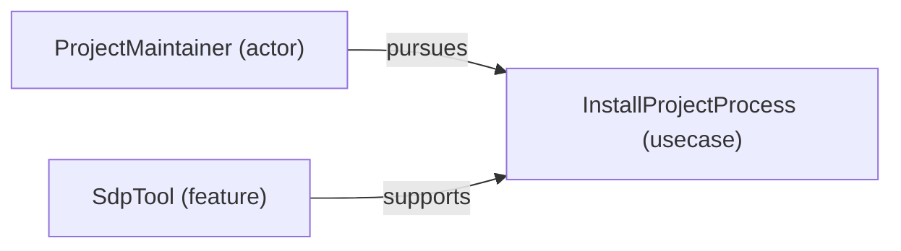
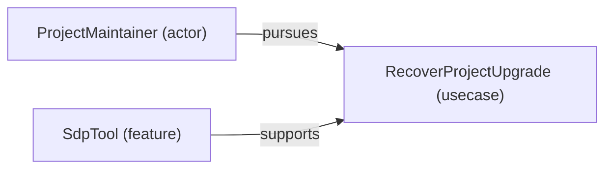

# VP01 — Use cases and traceability

Revision: `c05cf8fcba4a1c7abb985b1a3814bf9690759dfa74d12cdf58d20a9c46d96330`.

pursues, supports and contributes-to; modeled scope without an invented System boundary.

Selection: `{"viewpoint":"VP01","focus":"ProjectMaintainer","relations":["pursues","supports"],"direction":"both","depth":2}`.

## Use case: AdoptManualProcess

Source facts: f0435, f0506.

## Use case: InstallProjectProcess

Source facts: f0436, f0509.

## Use case: RecoverProjectUpgrade

Source facts: f0437, f0511.

## Use case: UpgradeProjectProcess

Source facts: f0438, f0513.

