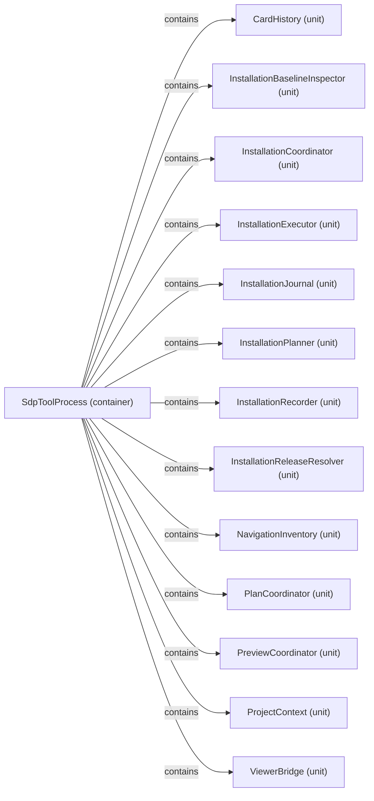

# VP02 — Architecture and logical decomposition

Revision: `c05cf8fcba4a1c7abb985b1a3814bf9690759dfa74d12cdf58d20a9c46d96330`.

Container/Unit and contains; library structure is not deployment allocation.

Selection: `{"viewpoint":"VP02","direction":"both","depth":2,"diagram":"VP02-SdpToolProcess"}`.

## Logical decomposition: SdpToolProcess

Source facts: f0526, f0527, f0528, f0529, f0530, f0531, f0532, f0533, f0534, f0535, f0536, f0537, f0538.

