# VP07 — Features across the architecture

Revision: `dddd841c13f7b842c7f5e404aeb6ac2abc599ef1c382f54c21548aef53006417`.

contributes-to, owns and explicit allocated-to per mode. Unspecified allocation is reported as a gap.

Selection: `{"viewpoint":"VP07","direction":"both","depth":2,"diagram":"VP07-SdpTool-InstallationPlanning"}`.

## Feature: SdpTool — mode InstallationPlanning

```mermaid
flowchart LR
    n_AcceptSourceSnapshot["AcceptSourceSnapshot (functionality)"]
    n_ApplyInstallationPlan["ApplyInstallationPlan (functionality)"]
    n_BuildDesignPreview["BuildDesignPreview (functionality)"]
    n_BuildInstallationPlan["BuildInstallationPlan (functionality)"]
    n_CardHistory["CardHistory (unit)"]
    n_CoordinateInstallation["CoordinateInstallation (functionality)"]
    n_DeliverViewBundle["DeliverViewBundle (functionality)"]
    n_DescribeNavigationTree["DescribeNavigationTree (functionality)"]
    n_GhSdpLauncher["GhSdpLauncher (unit)"]
    n_GhSdpProcess["GhSdpProcess (container)"]
    n_InspectInstallationBaseline["InspectInstallationBaseline (functionality)"]
    n_InstallationBaselineInspector["InstallationBaselineInspector (unit)"]
    n_InstallationCoordinator["InstallationCoordinator (unit)"]
    n_InstallationExecutor["InstallationExecutor (unit)"]
    n_InstallationJournal["InstallationJournal (unit)"]
    n_InstallationPlanner["InstallationPlanner (unit)"]
    n_InstallationRecorder["InstallationRecorder (unit)"]
    n_InstallationReleaseResolver["InstallationReleaseResolver (unit)"]
    n_InvokeInstallationCommand["InvokeInstallationCommand (functionality)"]
    n_NavigationInventory["NavigationInventory (unit)"]
    n_PersistInstallationJournal["PersistInstallationJournal (functionality)"]
    n_PlanCoordinator["PlanCoordinator (unit)"]
    n_PreviewCoordinator["PreviewCoordinator (unit)"]
    n_ProjectContext["ProjectContext (unit)"]
    n_ProposeImplementationSlices["ProposeImplementationSlices (functionality)"]
    n_PublishInstalledProcessFacts["PublishInstalledProcessFacts (functionality)"]
    n_ResolveCardHistory["ResolveCardHistory (functionality)"]
    n_ResolveInstallationRelease["ResolveInstallationRelease (functionality)"]
    n_ResolveProjectContext["ResolveProjectContext (functionality)"]
    n_ResumeInstallationOperation["ResumeInstallationOperation (functionality)"]
    n_RetrieveSdpToolBinary["RetrieveSdpToolBinary (functionality)"]
    n_SdpTool["SdpTool (feature)"]
    n_SdpToolProcess["SdpToolProcess (container)"]
    n_ValidateAdoptionBaseline["ValidateAdoptionBaseline (functionality)"]
    n_ValidateImplementationPlan["ValidateImplementationPlan (functionality)"]
    n_ViewerBridge["ViewerBridge (unit)"]
    n_AcceptSourceSnapshot -->|contributes-to| n_SdpTool
    n_ApplyInstallationPlan -->|contributes-to| n_SdpTool
    n_BuildDesignPreview -->|contributes-to| n_SdpTool
    n_BuildInstallationPlan -->|allocated-to| n_SdpToolProcess
    n_BuildInstallationPlan -->|contributes-to| n_SdpTool
    n_CardHistory -->|owns| n_ResolveCardHistory
    n_CoordinateInstallation -->|allocated-to| n_SdpToolProcess
    n_CoordinateInstallation -->|contributes-to| n_SdpTool
    n_DeliverViewBundle -->|contributes-to| n_SdpTool
    n_DescribeNavigationTree -->|contributes-to| n_SdpTool
    n_GhSdpLauncher -->|owns| n_InvokeInstallationCommand
    n_GhSdpLauncher -->|owns| n_RetrieveSdpToolBinary
    n_InspectInstallationBaseline -->|allocated-to| n_SdpToolProcess
    n_InspectInstallationBaseline -->|contributes-to| n_SdpTool
    n_InstallationBaselineInspector -->|owns| n_InspectInstallationBaseline
    n_InstallationBaselineInspector -->|owns| n_ValidateAdoptionBaseline
    n_InstallationCoordinator -->|owns| n_CoordinateInstallation
    n_InstallationExecutor -->|owns| n_ApplyInstallationPlan
    n_InstallationExecutor -->|owns| n_ResumeInstallationOperation
    n_InstallationJournal -->|owns| n_PersistInstallationJournal
    n_InstallationPlanner -->|owns| n_BuildInstallationPlan
    n_InstallationRecorder -->|owns| n_PublishInstalledProcessFacts
    n_InstallationReleaseResolver -->|owns| n_ResolveInstallationRelease
    n_InvokeInstallationCommand -->|allocated-to| n_GhSdpProcess
    n_InvokeInstallationCommand -->|contributes-to| n_SdpTool
    n_NavigationInventory -->|owns| n_DescribeNavigationTree
    n_PersistInstallationJournal -->|contributes-to| n_SdpTool
    n_PlanCoordinator -->|owns| n_ProposeImplementationSlices
    n_PlanCoordinator -->|owns| n_ValidateImplementationPlan
    n_PreviewCoordinator -->|owns| n_AcceptSourceSnapshot
    n_PreviewCoordinator -->|owns| n_BuildDesignPreview
    n_ProjectContext -->|owns| n_ResolveProjectContext
    n_ProposeImplementationSlices -->|contributes-to| n_SdpTool
    n_PublishInstalledProcessFacts -->|contributes-to| n_SdpTool
    n_ResolveCardHistory -->|contributes-to| n_SdpTool
    n_ResolveInstallationRelease -->|allocated-to| n_SdpToolProcess
    n_ResolveInstallationRelease -->|contributes-to| n_SdpTool
    n_ResolveProjectContext -->|contributes-to| n_SdpTool
    n_ResumeInstallationOperation -->|contributes-to| n_SdpTool
    n_RetrieveSdpToolBinary -->|contributes-to| n_SdpTool
    n_ValidateAdoptionBaseline -->|allocated-to| n_SdpToolProcess
    n_ValidateAdoptionBaseline -->|contributes-to| n_SdpTool
    n_ValidateImplementationPlan -->|contributes-to| n_SdpTool
    n_ViewerBridge -->|owns| n_DeliverViewBundle
```

Source facts: f0001, f0004, f0019, f0021, f0022, f0026, f0038, f0040, f0050, f0054, f0090, f0091, f0116, f0117, f0230, f0231, f0234, f0266, f0267, f0281, f0319, f0333, f0350, f0377, f0379, f0391, f0400, f0411, f0412, f0422, f0423, f0428, f0441, f0445, f0474, f0476, f0477, f0485, f0488, f0499, f0550, f0551, f0554, f0557.

Model gap UNSPECIFIED_ALLOCATION: Container allocation is unspecified for contributions to SdpTool. (AcceptSourceSnapshot; mode=ClientBootstrap).

Model gap UNSPECIFIED_ALLOCATION: Container allocation is unspecified for contributions to SdpTool. (ApplyInstallationPlan; mode=ClientBootstrap).

Model gap UNSPECIFIED_ALLOCATION: Container allocation is unspecified for contributions to SdpTool. (BuildDesignPreview; mode=ClientBootstrap).

Model gap UNSPECIFIED_ALLOCATION: Container allocation is unspecified for contributions to SdpTool. (BuildInstallationPlan; mode=ClientBootstrap).

Model gap UNSPECIFIED_ALLOCATION: Container allocation is unspecified for contributions to SdpTool. (CoordinateInstallation; mode=ClientBootstrap).

Model gap UNSPECIFIED_ALLOCATION: Container allocation is unspecified for contributions to SdpTool. (DeliverViewBundle; mode=ClientBootstrap).

Model gap UNSPECIFIED_ALLOCATION: Container allocation is unspecified for contributions to SdpTool. (DescribeNavigationTree; mode=ClientBootstrap).

Model gap UNSPECIFIED_ALLOCATION: Container allocation is unspecified for contributions to SdpTool. (InspectInstallationBaseline; mode=ClientBootstrap).

Model gap UNSPECIFIED_ALLOCATION: Container allocation is unspecified for contributions to SdpTool. (InvokeInstallationCommand; mode=ClientBootstrap).

Model gap UNSPECIFIED_ALLOCATION: Container allocation is unspecified for contributions to SdpTool. (PersistInstallationJournal; mode=ClientBootstrap).

Model gap UNSPECIFIED_ALLOCATION: Container allocation is unspecified for contributions to SdpTool. (ProposeImplementationSlices; mode=ClientBootstrap).

Model gap UNSPECIFIED_ALLOCATION: Container allocation is unspecified for contributions to SdpTool. (PublishInstalledProcessFacts; mode=ClientBootstrap).

Model gap UNSPECIFIED_ALLOCATION: Container allocation is unspecified for contributions to SdpTool. (ResolveCardHistory; mode=ClientBootstrap).

Model gap UNSPECIFIED_ALLOCATION: Container allocation is unspecified for contributions to SdpTool. (ResolveInstallationRelease; mode=ClientBootstrap).

Model gap UNSPECIFIED_ALLOCATION: Container allocation is unspecified for contributions to SdpTool. (ResolveProjectContext; mode=ClientBootstrap).

Model gap UNSPECIFIED_ALLOCATION: Container allocation is unspecified for contributions to SdpTool. (ResumeInstallationOperation; mode=ClientBootstrap).

Model gap UNSPECIFIED_ALLOCATION: Container allocation is unspecified for contributions to SdpTool. (ValidateAdoptionBaseline; mode=ClientBootstrap).

Model gap UNSPECIFIED_ALLOCATION: Container allocation is unspecified for contributions to SdpTool. (ValidateImplementationPlan; mode=ClientBootstrap).

Model gap UNSPECIFIED_ALLOCATION: Container allocation is unspecified for contributions to SdpTool. (AcceptSourceSnapshot; mode=HistoryInspection).

Model gap UNSPECIFIED_ALLOCATION: Container allocation is unspecified for contributions to SdpTool. (ApplyInstallationPlan; mode=HistoryInspection).

Model gap UNSPECIFIED_ALLOCATION: Container allocation is unspecified for contributions to SdpTool. (BuildDesignPreview; mode=HistoryInspection).

Model gap UNSPECIFIED_ALLOCATION: Container allocation is unspecified for contributions to SdpTool. (BuildInstallationPlan; mode=HistoryInspection).

Model gap UNSPECIFIED_ALLOCATION: Container allocation is unspecified for contributions to SdpTool. (CoordinateInstallation; mode=HistoryInspection).

Model gap UNSPECIFIED_ALLOCATION: Container allocation is unspecified for contributions to SdpTool. (DeliverViewBundle; mode=HistoryInspection).

Model gap UNSPECIFIED_ALLOCATION: Container allocation is unspecified for contributions to SdpTool. (DescribeNavigationTree; mode=HistoryInspection).

Model gap UNSPECIFIED_ALLOCATION: Container allocation is unspecified for contributions to SdpTool. (InspectInstallationBaseline; mode=HistoryInspection).

Model gap UNSPECIFIED_ALLOCATION: Container allocation is unspecified for contributions to SdpTool. (InvokeInstallationCommand; mode=HistoryInspection).

Model gap UNSPECIFIED_ALLOCATION: Container allocation is unspecified for contributions to SdpTool. (PersistInstallationJournal; mode=HistoryInspection).

Model gap UNSPECIFIED_ALLOCATION: Container allocation is unspecified for contributions to SdpTool. (ProposeImplementationSlices; mode=HistoryInspection).

Model gap UNSPECIFIED_ALLOCATION: Container allocation is unspecified for contributions to SdpTool. (PublishInstalledProcessFacts; mode=HistoryInspection).

Model gap UNSPECIFIED_ALLOCATION: Container allocation is unspecified for contributions to SdpTool. (ResolveInstallationRelease; mode=HistoryInspection).

Model gap UNSPECIFIED_ALLOCATION: Container allocation is unspecified for contributions to SdpTool. (ResolveProjectContext; mode=HistoryInspection).

Model gap UNSPECIFIED_ALLOCATION: Container allocation is unspecified for contributions to SdpTool. (ResumeInstallationOperation; mode=HistoryInspection).

Model gap UNSPECIFIED_ALLOCATION: Container allocation is unspecified for contributions to SdpTool. (RetrieveSdpToolBinary; mode=HistoryInspection).

Model gap UNSPECIFIED_ALLOCATION: Container allocation is unspecified for contributions to SdpTool. (ValidateAdoptionBaseline; mode=HistoryInspection).

Model gap UNSPECIFIED_ALLOCATION: Container allocation is unspecified for contributions to SdpTool. (ValidateImplementationPlan; mode=HistoryInspection).

Model gap UNSPECIFIED_ALLOCATION: Container allocation is unspecified for contributions to SdpTool. (AcceptSourceSnapshot; mode=InstallationExecution).

Model gap UNSPECIFIED_ALLOCATION: Container allocation is unspecified for contributions to SdpTool. (BuildDesignPreview; mode=InstallationExecution).

Model gap UNSPECIFIED_ALLOCATION: Container allocation is unspecified for contributions to SdpTool. (BuildInstallationPlan; mode=InstallationExecution).

Model gap UNSPECIFIED_ALLOCATION: Container allocation is unspecified for contributions to SdpTool. (DeliverViewBundle; mode=InstallationExecution).

Model gap UNSPECIFIED_ALLOCATION: Container allocation is unspecified for contributions to SdpTool. (DescribeNavigationTree; mode=InstallationExecution).

Model gap UNSPECIFIED_ALLOCATION: Container allocation is unspecified for contributions to SdpTool. (InspectInstallationBaseline; mode=InstallationExecution).

Model gap UNSPECIFIED_ALLOCATION: Container allocation is unspecified for contributions to SdpTool. (ProposeImplementationSlices; mode=InstallationExecution).

Model gap UNSPECIFIED_ALLOCATION: Container allocation is unspecified for contributions to SdpTool. (ResolveCardHistory; mode=InstallationExecution).

Model gap UNSPECIFIED_ALLOCATION: Container allocation is unspecified for contributions to SdpTool. (ResolveInstallationRelease; mode=InstallationExecution).

Model gap UNSPECIFIED_ALLOCATION: Container allocation is unspecified for contributions to SdpTool. (ResolveProjectContext; mode=InstallationExecution).

Model gap UNSPECIFIED_ALLOCATION: Container allocation is unspecified for contributions to SdpTool. (ResumeInstallationOperation; mode=InstallationExecution).

Model gap UNSPECIFIED_ALLOCATION: Container allocation is unspecified for contributions to SdpTool. (RetrieveSdpToolBinary; mode=InstallationExecution).

Model gap UNSPECIFIED_ALLOCATION: Container allocation is unspecified for contributions to SdpTool. (ValidateAdoptionBaseline; mode=InstallationExecution).

Model gap UNSPECIFIED_ALLOCATION: Container allocation is unspecified for contributions to SdpTool. (ValidateImplementationPlan; mode=InstallationExecution).

Model gap UNSPECIFIED_ALLOCATION: Container allocation is unspecified for contributions to SdpTool. (AcceptSourceSnapshot; mode=InstallationPlanning).

Model gap UNSPECIFIED_ALLOCATION: Container allocation is unspecified for contributions to SdpTool. (ApplyInstallationPlan; mode=InstallationPlanning).

Model gap UNSPECIFIED_ALLOCATION: Container allocation is unspecified for contributions to SdpTool. (BuildDesignPreview; mode=InstallationPlanning).

Model gap UNSPECIFIED_ALLOCATION: Container allocation is unspecified for contributions to SdpTool. (DeliverViewBundle; mode=InstallationPlanning).

Model gap UNSPECIFIED_ALLOCATION: Container allocation is unspecified for contributions to SdpTool. (DescribeNavigationTree; mode=InstallationPlanning).

Model gap UNSPECIFIED_ALLOCATION: Container allocation is unspecified for contributions to SdpTool. (PersistInstallationJournal; mode=InstallationPlanning).

Model gap UNSPECIFIED_ALLOCATION: Container allocation is unspecified for contributions to SdpTool. (ProposeImplementationSlices; mode=InstallationPlanning).

Model gap UNSPECIFIED_ALLOCATION: Container allocation is unspecified for contributions to SdpTool. (PublishInstalledProcessFacts; mode=InstallationPlanning).

Model gap UNSPECIFIED_ALLOCATION: Container allocation is unspecified for contributions to SdpTool. (ResolveCardHistory; mode=InstallationPlanning).

Model gap UNSPECIFIED_ALLOCATION: Container allocation is unspecified for contributions to SdpTool. (ResolveProjectContext; mode=InstallationPlanning).

Model gap UNSPECIFIED_ALLOCATION: Container allocation is unspecified for contributions to SdpTool. (ResumeInstallationOperation; mode=InstallationPlanning).

Model gap UNSPECIFIED_ALLOCATION: Container allocation is unspecified for contributions to SdpTool. (RetrieveSdpToolBinary; mode=InstallationPlanning).

Model gap UNSPECIFIED_ALLOCATION: Container allocation is unspecified for contributions to SdpTool. (ValidateImplementationPlan; mode=InstallationPlanning).

Model gap UNSPECIFIED_ALLOCATION: Container allocation is unspecified for contributions to SdpTool. (AcceptSourceSnapshot; mode=InstallationRecoveryMode).

Model gap UNSPECIFIED_ALLOCATION: Container allocation is unspecified for contributions to SdpTool. (ApplyInstallationPlan; mode=InstallationRecoveryMode).

Model gap UNSPECIFIED_ALLOCATION: Container allocation is unspecified for contributions to SdpTool. (BuildDesignPreview; mode=InstallationRecoveryMode).

Model gap UNSPECIFIED_ALLOCATION: Container allocation is unspecified for contributions to SdpTool. (BuildInstallationPlan; mode=InstallationRecoveryMode).

Model gap UNSPECIFIED_ALLOCATION: Container allocation is unspecified for contributions to SdpTool. (DeliverViewBundle; mode=InstallationRecoveryMode).

Model gap UNSPECIFIED_ALLOCATION: Container allocation is unspecified for contributions to SdpTool. (DescribeNavigationTree; mode=InstallationRecoveryMode).

Model gap UNSPECIFIED_ALLOCATION: Container allocation is unspecified for contributions to SdpTool. (InspectInstallationBaseline; mode=InstallationRecoveryMode).

Model gap UNSPECIFIED_ALLOCATION: Container allocation is unspecified for contributions to SdpTool. (ProposeImplementationSlices; mode=InstallationRecoveryMode).

Model gap UNSPECIFIED_ALLOCATION: Container allocation is unspecified for contributions to SdpTool. (ResolveCardHistory; mode=InstallationRecoveryMode).

Model gap UNSPECIFIED_ALLOCATION: Container allocation is unspecified for contributions to SdpTool. (ResolveInstallationRelease; mode=InstallationRecoveryMode).

Model gap UNSPECIFIED_ALLOCATION: Container allocation is unspecified for contributions to SdpTool. (ResolveProjectContext; mode=InstallationRecoveryMode).

Model gap UNSPECIFIED_ALLOCATION: Container allocation is unspecified for contributions to SdpTool. (RetrieveSdpToolBinary; mode=InstallationRecoveryMode).

Model gap UNSPECIFIED_ALLOCATION: Container allocation is unspecified for contributions to SdpTool. (ValidateAdoptionBaseline; mode=InstallationRecoveryMode).

Model gap UNSPECIFIED_ALLOCATION: Container allocation is unspecified for contributions to SdpTool. (ValidateImplementationPlan; mode=InstallationRecoveryMode).

Model gap UNSPECIFIED_ALLOCATION: Container allocation is unspecified for contributions to SdpTool. (AcceptSourceSnapshot; mode=ProcessPlanning).

Model gap UNSPECIFIED_ALLOCATION: Container allocation is unspecified for contributions to SdpTool. (ApplyInstallationPlan; mode=ProcessPlanning).

Model gap UNSPECIFIED_ALLOCATION: Container allocation is unspecified for contributions to SdpTool. (BuildDesignPreview; mode=ProcessPlanning).

Model gap UNSPECIFIED_ALLOCATION: Container allocation is unspecified for contributions to SdpTool. (BuildInstallationPlan; mode=ProcessPlanning).

Model gap UNSPECIFIED_ALLOCATION: Container allocation is unspecified for contributions to SdpTool. (CoordinateInstallation; mode=ProcessPlanning).

Model gap UNSPECIFIED_ALLOCATION: Container allocation is unspecified for contributions to SdpTool. (DeliverViewBundle; mode=ProcessPlanning).

Model gap UNSPECIFIED_ALLOCATION: Container allocation is unspecified for contributions to SdpTool. (DescribeNavigationTree; mode=ProcessPlanning).

Model gap UNSPECIFIED_ALLOCATION: Container allocation is unspecified for contributions to SdpTool. (InspectInstallationBaseline; mode=ProcessPlanning).

Model gap UNSPECIFIED_ALLOCATION: Container allocation is unspecified for contributions to SdpTool. (InvokeInstallationCommand; mode=ProcessPlanning).

Model gap UNSPECIFIED_ALLOCATION: Container allocation is unspecified for contributions to SdpTool. (PersistInstallationJournal; mode=ProcessPlanning).

Model gap UNSPECIFIED_ALLOCATION: Container allocation is unspecified for contributions to SdpTool. (PublishInstalledProcessFacts; mode=ProcessPlanning).

Model gap UNSPECIFIED_ALLOCATION: Container allocation is unspecified for contributions to SdpTool. (ResolveCardHistory; mode=ProcessPlanning).

Model gap UNSPECIFIED_ALLOCATION: Container allocation is unspecified for contributions to SdpTool. (ResolveInstallationRelease; mode=ProcessPlanning).

Model gap UNSPECIFIED_ALLOCATION: Container allocation is unspecified for contributions to SdpTool. (ResolveProjectContext; mode=ProcessPlanning).

Model gap UNSPECIFIED_ALLOCATION: Container allocation is unspecified for contributions to SdpTool. (ResumeInstallationOperation; mode=ProcessPlanning).

Model gap UNSPECIFIED_ALLOCATION: Container allocation is unspecified for contributions to SdpTool. (RetrieveSdpToolBinary; mode=ProcessPlanning).

Model gap UNSPECIFIED_ALLOCATION: Container allocation is unspecified for contributions to SdpTool. (ValidateAdoptionBaseline; mode=ProcessPlanning).

Model gap UNSPECIFIED_ALLOCATION: Container allocation is unspecified for contributions to SdpTool. (AcceptSourceSnapshot; mode=ProjectBrowsing).

Model gap UNSPECIFIED_ALLOCATION: Container allocation is unspecified for contributions to SdpTool. (ApplyInstallationPlan; mode=ProjectBrowsing).

Model gap UNSPECIFIED_ALLOCATION: Container allocation is unspecified for contributions to SdpTool. (BuildDesignPreview; mode=ProjectBrowsing).

Model gap UNSPECIFIED_ALLOCATION: Container allocation is unspecified for contributions to SdpTool. (BuildInstallationPlan; mode=ProjectBrowsing).

Model gap UNSPECIFIED_ALLOCATION: Container allocation is unspecified for contributions to SdpTool. (CoordinateInstallation; mode=ProjectBrowsing).

Model gap UNSPECIFIED_ALLOCATION: Container allocation is unspecified for contributions to SdpTool. (InspectInstallationBaseline; mode=ProjectBrowsing).

Model gap UNSPECIFIED_ALLOCATION: Container allocation is unspecified for contributions to SdpTool. (InvokeInstallationCommand; mode=ProjectBrowsing).

Model gap UNSPECIFIED_ALLOCATION: Container allocation is unspecified for contributions to SdpTool. (PersistInstallationJournal; mode=ProjectBrowsing).

Model gap UNSPECIFIED_ALLOCATION: Container allocation is unspecified for contributions to SdpTool. (ProposeImplementationSlices; mode=ProjectBrowsing).

Model gap UNSPECIFIED_ALLOCATION: Container allocation is unspecified for contributions to SdpTool. (PublishInstalledProcessFacts; mode=ProjectBrowsing).

Model gap UNSPECIFIED_ALLOCATION: Container allocation is unspecified for contributions to SdpTool. (ResolveCardHistory; mode=ProjectBrowsing).

Model gap UNSPECIFIED_ALLOCATION: Container allocation is unspecified for contributions to SdpTool. (ResolveInstallationRelease; mode=ProjectBrowsing).

Model gap UNSPECIFIED_ALLOCATION: Container allocation is unspecified for contributions to SdpTool. (ResumeInstallationOperation; mode=ProjectBrowsing).

Model gap UNSPECIFIED_ALLOCATION: Container allocation is unspecified for contributions to SdpTool. (RetrieveSdpToolBinary; mode=ProjectBrowsing).

Model gap UNSPECIFIED_ALLOCATION: Container allocation is unspecified for contributions to SdpTool. (ValidateAdoptionBaseline; mode=ProjectBrowsing).

Model gap UNSPECIFIED_ALLOCATION: Container allocation is unspecified for contributions to SdpTool. (ValidateImplementationPlan; mode=ProjectBrowsing).

Model gap UNSPECIFIED_ALLOCATION: Container allocation is unspecified for contributions to SdpTool. (ApplyInstallationPlan; mode=StandalonePreview).

Model gap UNSPECIFIED_ALLOCATION: Container allocation is unspecified for contributions to SdpTool. (BuildInstallationPlan; mode=StandalonePreview).

Model gap UNSPECIFIED_ALLOCATION: Container allocation is unspecified for contributions to SdpTool. (CoordinateInstallation; mode=StandalonePreview).

Model gap UNSPECIFIED_ALLOCATION: Container allocation is unspecified for contributions to SdpTool. (DescribeNavigationTree; mode=StandalonePreview).

Model gap UNSPECIFIED_ALLOCATION: Container allocation is unspecified for contributions to SdpTool. (InspectInstallationBaseline; mode=StandalonePreview).

Model gap UNSPECIFIED_ALLOCATION: Container allocation is unspecified for contributions to SdpTool. (InvokeInstallationCommand; mode=StandalonePreview).

Model gap UNSPECIFIED_ALLOCATION: Container allocation is unspecified for contributions to SdpTool. (PersistInstallationJournal; mode=StandalonePreview).

Model gap UNSPECIFIED_ALLOCATION: Container allocation is unspecified for contributions to SdpTool. (ProposeImplementationSlices; mode=StandalonePreview).

Model gap UNSPECIFIED_ALLOCATION: Container allocation is unspecified for contributions to SdpTool. (PublishInstalledProcessFacts; mode=StandalonePreview).

Model gap UNSPECIFIED_ALLOCATION: Container allocation is unspecified for contributions to SdpTool. (ResolveCardHistory; mode=StandalonePreview).

Model gap UNSPECIFIED_ALLOCATION: Container allocation is unspecified for contributions to SdpTool. (ResolveInstallationRelease; mode=StandalonePreview).

Model gap UNSPECIFIED_ALLOCATION: Container allocation is unspecified for contributions to SdpTool. (ResolveProjectContext; mode=StandalonePreview).

Model gap UNSPECIFIED_ALLOCATION: Container allocation is unspecified for contributions to SdpTool. (ResumeInstallationOperation; mode=StandalonePreview).

Model gap UNSPECIFIED_ALLOCATION: Container allocation is unspecified for contributions to SdpTool. (RetrieveSdpToolBinary; mode=StandalonePreview).

Model gap UNSPECIFIED_ALLOCATION: Container allocation is unspecified for contributions to SdpTool. (ValidateAdoptionBaseline; mode=StandalonePreview).

Model gap UNSPECIFIED_ALLOCATION: Container allocation is unspecified for contributions to SdpTool. (ValidateImplementationPlan; mode=StandalonePreview).

