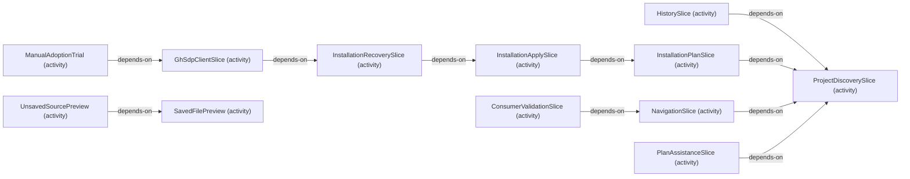

# VP06 — Activities and delivery plan

Revision: `7cb1cdf04b9bb1b9779aa570f9fdbeedc313873a8838d94908e7e6118829e936`.

refines, addresses, delivers and depends-on; status is an explicit source claim.

Selection: `{"viewpoint":"VP06","direction":"both","depth":2,"diagram":"VP06-dependencies"}`.

## Explicit activity dependencies

Source facts: f0034, f0085, f0108, f0226, f0314, f0346, f0384, f0394, f0406, f0547.

