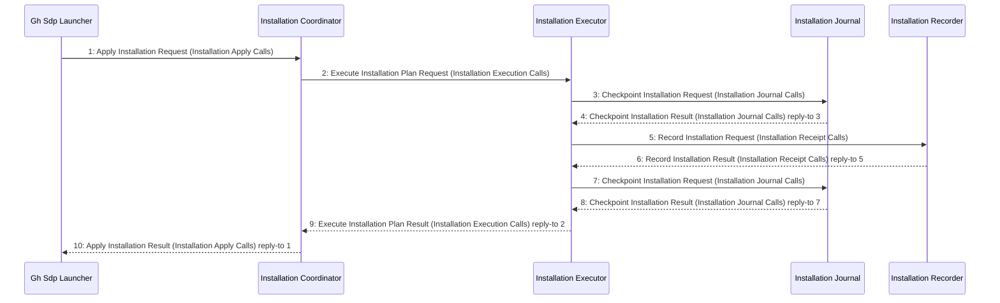

# VP08 — Channel contracts and sequences

Revision: `c05cf8fcba4a1c7abb985b1a3814bf9690759dfa74d12cdf58d20a9c46d96330`.

Explicit scenario steps validated against permits, participation, mode and request/result correlation.

Selection: `{"viewpoint":"VP08","direction":"both","depth":2,"diagram":"VP08-InstallationApplied"}`.

## Scenario: InstallationApplied — mode InstallationExecution

Source facts: f0009, f0010, f0011, f0012, f0013, f0028, f0029, f0030, f0031, f0032, f0064, f0065, f0066, f0067, f0068, f0093, f0094, f0203, f0204, f0205, f0206, f0207, f0208, f0209, f0210, f0211, f0212, f0213, f0214, f0215, f0216, f0217, f0220, f0221, f0237, f0239, f0240, f0241, f0260, f0262, f0263, f0268, f0269, f0270, f0272, f0274, f0276, f0282, f0284, f0286, f0288, f0289, f0327, f0329, f0330, f0334, f0336, f0447, f0448, f0449, f0450, f0451.

## Derived MessageSet

| Channel | Mode | Datagram | Sender | Receiver | Source IDs |
| --- | --- | --- | --- | --- | --- |
| BaselineInspectionCalls | InstallationPlanning | InspectBaselineRequest | InstallationCoordinator | InstallationBaselineInspector | f0014, f0016, f0112, f0232, f0236 |
| BaselineInspectionCalls | InstallationPlanning | InspectBaselineResult | InstallationBaselineInspector | InstallationCoordinator | f0014, f0017, f0115, f0233, f0235 |
| InstallationApplyCalls | InstallationExecution | ApplyInstallationRejected | InstallationCoordinator | GhSdpLauncher | f0008, f0092, f0217, f0219, f0238 |
| InstallationApplyCalls | InstallationExecution | ApplyInstallationRequest | GhSdpLauncher | InstallationCoordinator | f0010, f0094, f0217, f0220, f0237 |
| InstallationApplyCalls | InstallationExecution | ApplyInstallationResult | InstallationCoordinator | GhSdpLauncher | f0013, f0093, f0217, f0221, f0239 |
| InstallationExecutionCalls | InstallationExecution | ExecuteInstallationPlanRequest | InstallationCoordinator | InstallationExecutor | f0065, f0241, f0260, f0262, f0268 |
| InstallationExecutionCalls | InstallationExecution | ExecuteInstallationPlanResult | InstallationExecutor | InstallationCoordinator | f0068, f0240, f0260, f0263, f0269 |
| InstallationJournalCalls | InstallationExecution | CheckpointInstallationRequest | InstallationExecutor | InstallationJournal | f0029, f0272, f0282, f0286, f0288 |
| InstallationJournalCalls | InstallationExecution | CheckpointInstallationResult | InstallationJournal | InstallationExecutor | f0032, f0270, f0284, f0286, f0289 |
| InstallationJournalCalls | InstallationRecoveryMode | CheckpointInstallationRequest | InstallationExecutor | InstallationJournal | f0029, f0273, f0283, f0286, f0288 |
| InstallationJournalCalls | InstallationRecoveryMode | CheckpointInstallationResult | InstallationJournal | InstallationExecutor | f0032, f0271, f0285, f0286, f0289 |
| InstallationPlanCalls | InstallationPlanning | CreateInstallationPlanRequest | InstallationCoordinator | InstallationPlanner | f0043, f0243, f0291, f0293, f0320 |
| InstallationPlanCalls | InstallationPlanning | CreateInstallationPlanResult | InstallationPlanner | InstallationCoordinator | f0046, f0242, f0291, f0294, f0321 |
| InstallationPlanningCalls | InstallationPlanning | PlanInstallationRejected | InstallationCoordinator | GhSdpLauncher | f0095, f0245, f0322, f0324, f0415 |
| InstallationPlanningCalls | InstallationPlanning | PlanInstallationRequest | GhSdpLauncher | InstallationCoordinator | f0097, f0244, f0322, f0325, f0417 |
| InstallationPlanningCalls | InstallationPlanning | PlanInstallationResult | InstallationCoordinator | GhSdpLauncher | f0096, f0246, f0322, f0326, f0420 |
| InstallationReceiptCalls | InstallationExecution | RecordInstallationRequest | InstallationExecutor | InstallationRecorder | f0276, f0327, f0329, f0334, f0448 |
| InstallationReceiptCalls | InstallationExecution | RecordInstallationResult | InstallationRecorder | InstallationExecutor | f0274, f0327, f0330, f0336, f0451 |
| InstallationReceiptCalls | InstallationRecoveryMode | RecordInstallationRequest | InstallationExecutor | InstallationRecorder | f0277, f0327, f0329, f0335, f0448 |
| InstallationReceiptCalls | InstallationRecoveryMode | RecordInstallationResult | InstallationRecorder | InstallationExecutor | f0275, f0327, f0330, f0337, f0451 |
| InstallationRecoveryCalls | InstallationRecoveryMode | RecoverInstallationRequest | InstallationCoordinator | InstallationExecutor | f0248, f0278, f0339, f0341, f0453 |
| InstallationRecoveryCalls | InstallationRecoveryMode | RecoverInstallationResult | InstallationExecutor | InstallationCoordinator | f0247, f0279, f0339, f0342, f0456 |
| InstallationResumeCalls | InstallationRecoveryMode | ResumeInstallationRejected | InstallationCoordinator | GhSdpLauncher | f0098, f0250, f0355, f0357, f0492 |
| InstallationResumeCalls | InstallationRecoveryMode | ResumeInstallationRequest | GhSdpLauncher | InstallationCoordinator | f0100, f0249, f0355, f0358, f0494 |
| InstallationResumeCalls | InstallationRecoveryMode | ResumeInstallationResult | InstallationCoordinator | GhSdpLauncher | f0099, f0251, f0355, f0359, f0497 |
| ReleaseArtifactCalls | InstallationPlanning | FetchProcessArtifactRequest | InstallationReleaseResolver | ReleaseArtifactService | f0070, f0352, f0457, f0459, f0462 |
| ReleaseArtifactCalls | InstallationPlanning | FetchProcessArtifactResult | ReleaseArtifactService | InstallationReleaseResolver | f0073, f0351, f0457, f0460, f0463 |
| ReleaseResolutionCalls | InstallationPlanning | ResolveProcessReleaseRequest | InstallationCoordinator | InstallationReleaseResolver | f0253, f0353, f0469, f0471, f0480 |
| ReleaseResolutionCalls | InstallationPlanning | ResolveProcessReleaseResult | InstallationReleaseResolver | InstallationCoordinator | f0252, f0354, f0469, f0472, f0483 |
| SdpToolBootstrapCalls | ClientBootstrap | FetchSdpToolRejected | ReleaseArtifactService | GhSdpLauncher | f0076, f0101, f0465, f0515, f0517 |
| SdpToolBootstrapCalls | ClientBootstrap | FetchSdpToolRequest | GhSdpLauncher | ReleaseArtifactService | f0078, f0103, f0464, f0515, f0518 |
| SdpToolBootstrapCalls | ClientBootstrap | FetchSdpToolResult | ReleaseArtifactService | GhSdpLauncher | f0081, f0102, f0466, f0515, f0519 |

