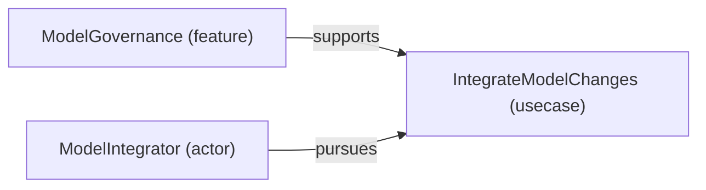

# Use case: IntegrateModelChanges

[Viewpoint](index.md) · [Navigator](../../navigator.md)

Revision: `ddeddf6050239ebbde41bf0a74d149bd3a98948983e4c83e16d8fdae81f2d707`.

## Use case: IntegrateModelChanges

Source facts: fa024785a01f4965d9623edcb9c356c0ada52bf2fe6f58ee76db097136a9571eb, fe2a9640a86a935571ebefd6a1e6e566546173a86153d6a8f3fb67caeb363f8c9.

