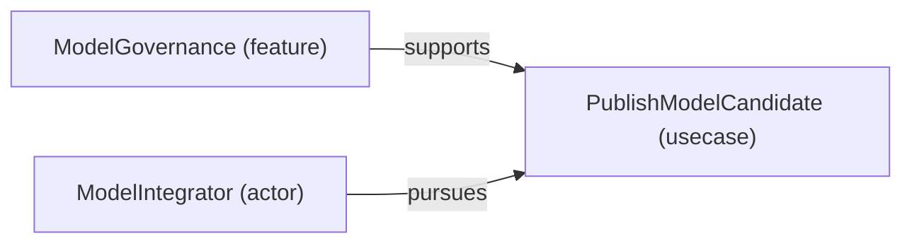

# Use case: PublishModelCandidate

[Viewpoint](index.md) · [Navigator](../../navigator.md)

Revision: `a4844c717e9ef27849ddda5efe01a27664359a07b910568f89ad3e6c73c99ae6`.

## Use case: PublishModelCandidate

Source facts: fc3268b2f440a25030d7071bb999d7665e3e85ffb08968c5fd90d1603452faf3f, fcab23cc1a3c90d55d838015af6304af7b16f82915ff27542a12acd8d9364a47c.

