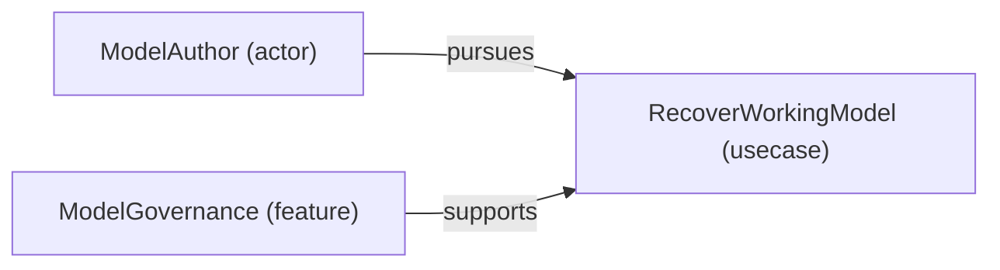

# Use case: RecoverWorkingModel

[Viewpoint](index.md) · [Navigator](../../navigator.md)

Revision: `a4844c717e9ef27849ddda5efe01a27664359a07b910568f89ad3e6c73c99ae6`.

## Use case: RecoverWorkingModel

Source facts: fcd16a82dcba1f700134516608b86213c6239b6e86ec9428cfb41bb8ec0906aca, fe0147bb88c974ff571abdc7a521c2c7e65b50488c6b3619b7db2bccd5af02ac4.

