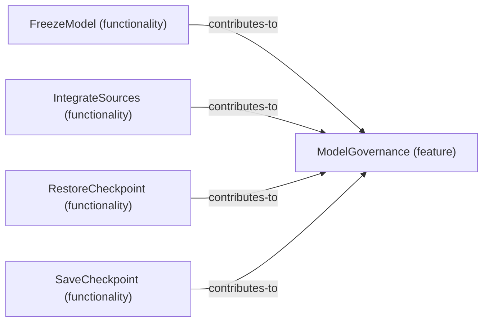

# Functionality contributions to Feature: ModelGovernance

[Viewpoint](index.md) · [Navigator](../../navigator.md)

Revision: `a4844c717e9ef27849ddda5efe01a27664359a07b910568f89ad3e6c73c99ae6`.

## Functionality contributions to Feature: ModelGovernance

Source facts: f11c7f37f4b76f8501b8ed2df95b148ccaf8a1282589209a6bcfd3bf2ef1c1b6c, feae3d2190f35f78e3fac4624a773a3bd4d5dd7d276f9f954eb7bee40197f2626, ff5d2a2bcbdec9d991b194219129b83d31d136b87c336618f54a73578c7949698, fff4741702ccb973680b49c0be936f858bd44d30e801591f5910ce60326231b96.

