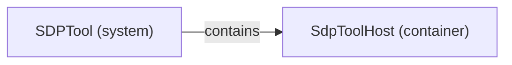

# Logical decomposition: SDPTool

[Viewpoint](index.md) · [Navigator](../../navigator.md)

Revision: `a4844c717e9ef27849ddda5efe01a27664359a07b910568f89ad3e6c73c99ae6`.

## Logical decomposition: SDPTool

Source facts: ff6392d40f4992ed36f406a7d276923815d52743da7ed6483b8714d0d2d7b6b61.

