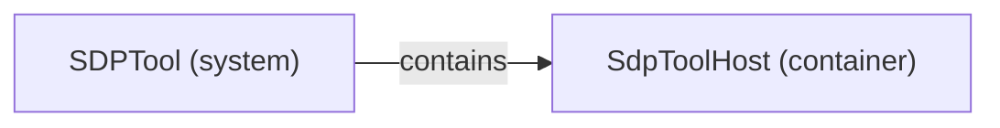

# Logical decomposition: SDPTool

[Viewpoint](index.md) · [Navigator](../../navigator.md)

Revision: `ddeddf6050239ebbde41bf0a74d149bd3a98948983e4c83e16d8fdae81f2d707`.

## Logical decomposition: SDPTool

Source facts: ff6392d40f4992ed36f406a7d276923815d52743da7ed6483b8714d0d2d7b6b61.

