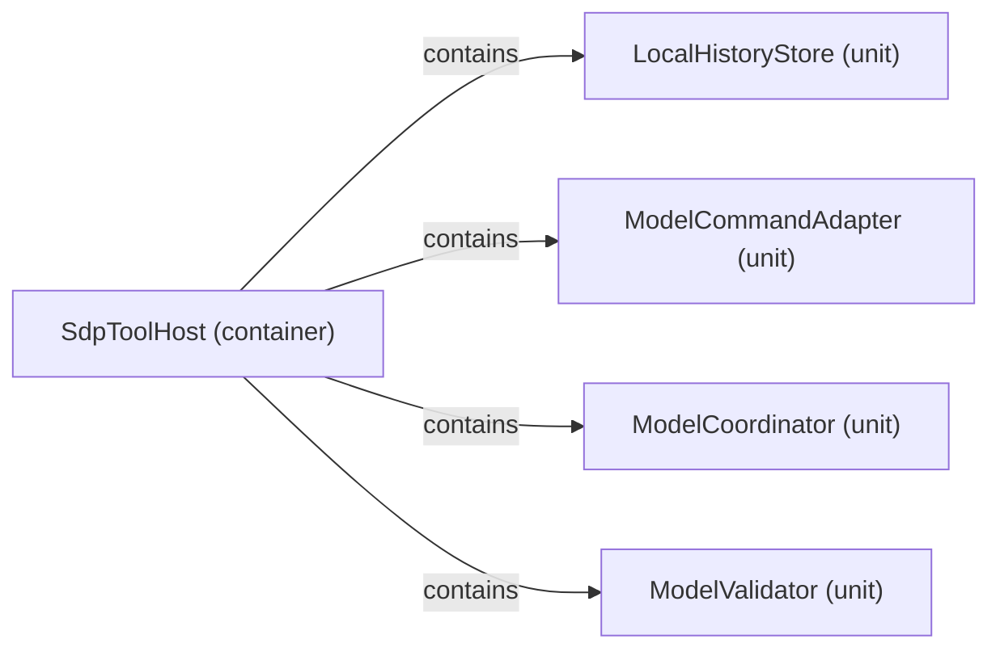

# Logical decomposition: SdpToolHost

[Viewpoint](index.md) · [Navigator](../../navigator.md)

Revision: `ddeddf6050239ebbde41bf0a74d149bd3a98948983e4c83e16d8fdae81f2d707`.

## Logical decomposition: SdpToolHost

Source facts: f5eeb7518593672612e29c8bc4c456b26a01f1337b0aee7e694b26de3da0f6795, fccd422b34ea49e941229b368103bb393a37e10f8ae1b5f6ea4eb7ba05f14550c, fe3251841f34b8ae18553220c9d9367cdd8bd6fae5ba8aa3aafd80fbc9c7d7bc4, fe67998c78a81d247dc6aae6f000a833d359c7514986b87e50006535a076c8881.

