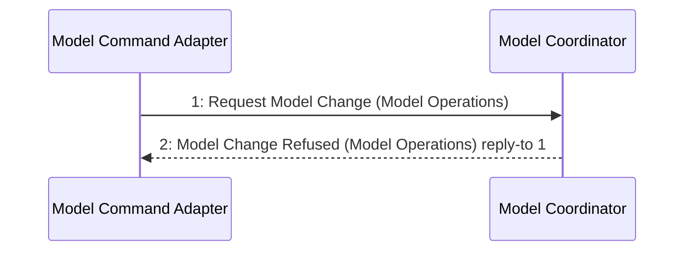

# Scenario: RejectStaleModelChange — mode ModelEditing

[Viewpoint](index.md) · [Navigator](../../navigator.md)

Revision: `a4844c717e9ef27849ddda5efe01a27664359a07b910568f89ad3e6c73c99ae6`.

## Scenario: RejectStaleModelChange — mode ModelEditing

Source facts: f0f097ff6e76c388b1ba0bd6a5456ce5ad518895cfe426866bb805b64c5e62b1f, f180798f519b29a3beccc356e74304d2f64dadbea3634b1d80ac204db40bbc794, f189a7cf5723fd0838e988c1c862db39a6b1d9b910dbde44f0b952a351f6bbb83, f1d62ef1bf7cd116de1b05e51581ac2ecf0233780e8eca7f3843eb8398fbb5b52, f32fa47ddea9582fa6bd3ffae1cff47233e747bd79ca7b22d0be3c72b6ec66548, f359c15d28aa9dd771ec69ac9e8a3fd9317931d1c4a9708a7bc09085105c7cb91, f3b24a65b9a1aab492877b6c2d126e06ec4ba8334f40d805800213e75dd8afad1, f56b4fc46ebd6d142e1b05e046dbf5d791bcb419958b9305383869c99619632f6, f5c4c6e7fd517ea9a5da31901ad3dd48de628fdee0e929bf7fe74bb4da13e899b, f6ba015e57387acae03d6f08fe0c5d1678811936997fb454bddf4f90d2460835f, f7d40c3a3a8dcb5f3903e1ba111acdec6588118d8a175b64e4301d5293d0a14da, f8709f91b32bfd58f11d2f1bc0faa8492527615469708856d306030f492d054fb, fdf82a111b71a746f6bb7e3150079861962859b86df658c60173b2aff00c3504e, fe6a5444122dab0959f0765dd5dadb4903538882fb6b809c531f26b5a17790004, feebda698bf3fdce5ba263880da99dc691e3bdb4f1ef156177ea30e4227eb48ef, fef5d29092e55a95ab9432118e149dafb08e62d75d409b298d4e02bc68538163d, ff028ab7115ca60b8873c0594cdd69217a42384665b8c7031e8cffa737c6f23d9, ff1ed6ce9a02cfb72a17ed9c78a19982a44ca4f9b2a7050f7c943ea46e0a8adc0.

