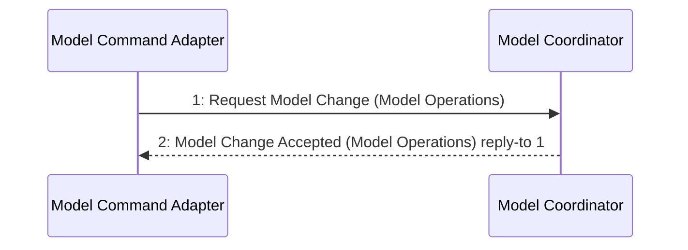

# Scenario: SaveModelCheckpoint — mode ModelEditing

[Viewpoint](index.md) · [Navigator](../../navigator.md)

Revision: `ddeddf6050239ebbde41bf0a74d149bd3a98948983e4c83e16d8fdae81f2d707`.

## Scenario: SaveModelCheckpoint — mode ModelEditing

Source facts: f10b4620ce074b23725ca6281bdf3665c10982af15afa52e77b25c9a212fcc9ed, f180798f519b29a3beccc356e74304d2f64dadbea3634b1d80ac204db40bbc794, f1d62ef1bf7cd116de1b05e51581ac2ecf0233780e8eca7f3843eb8398fbb5b52, f2e1caa154fbdb18a3ddc5cbb6cf257b13c8bfd8c85bf831ecac718e8fde9195a, f359c15d28aa9dd771ec69ac9e8a3fd9317931d1c4a9708a7bc09085105c7cb91, f3b24a65b9a1aab492877b6c2d126e06ec4ba8334f40d805800213e75dd8afad1, f5b64393f9f0a981496920beb60d85f42a6db8ae2bad2f4e97507343e5e49b90f, f78831350cfcee50be79fe4508d1e86157df9e94caad8ba13b37bfd0e76e83a21, f7d40c3a3a8dcb5f3903e1ba111acdec6588118d8a175b64e4301d5293d0a14da, f853e845e0389da58240cf30f35226c6e933d1508e74a47292075ee9d540c4d05, f8fb83d53452fd723fb26c2b99e36e64903eda23576454e5a78fdd488e0fed4ed, f9a370d8df6475de7eebcaa7ec646c1511cbafdcabd997770af8a982484f8626f, fb0c7aff767d5432aa2bd00f1ce0d261173c01a08c03cfbfa68cd193b960d7c11, fdafaad3bea854b0c6ef30d41ac9d3bff0d3d3370909b5840ae0fc1a26703c6c7, fe18ef94cac20e293dceaba162af72221217b1851075c68d2fa31c20e7350362a, fe774d1c7618d94b2bb627011b35413562d6de39d9bb73fc4a87e79ee28ce9d52, fe89c5cb41c395a842396715ed75c73f9f0c0d89aba606185028dab47119e7f03, fef5d29092e55a95ab9432118e149dafb08e62d75d409b298d4e02bc68538163d.

