# SDUI composition — ` Main `

Source composition maps, not live UI or measured geometry. The overview shows regions and ordered rows; nested containers have their own detail maps below. Hidden and reused instances remain visible here. The text prototype follows visibility rules.

### ` Main `

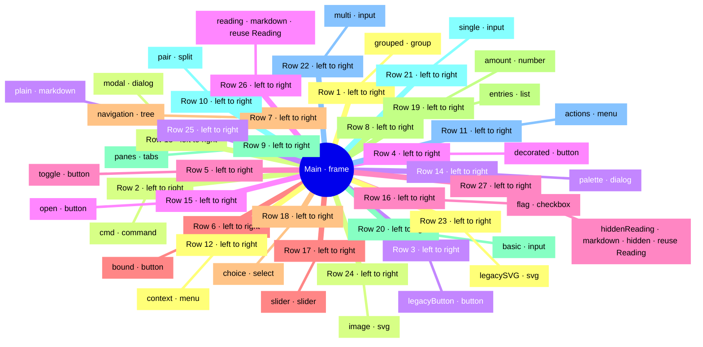

### ` Main/grouped `

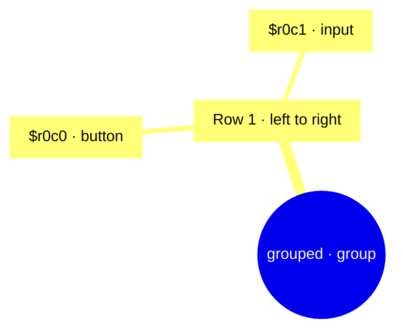

### ` Main/panes `

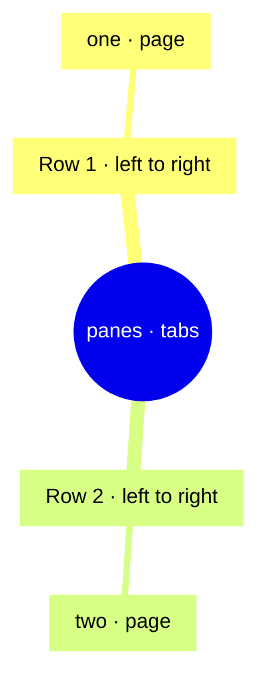

### ` Main/panes/one `

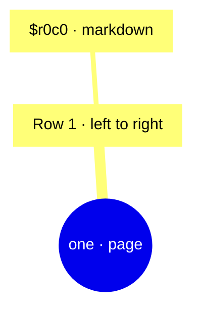

### ` Main/panes/two `

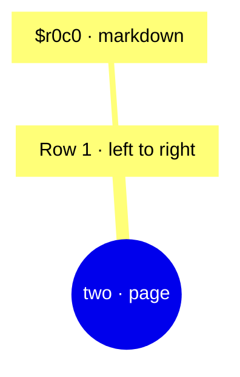

### ` Main/pair `

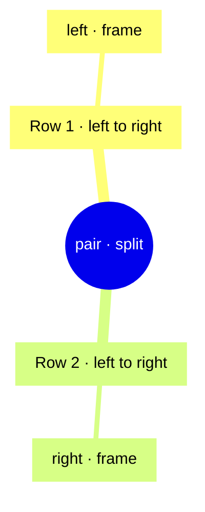

### ` Main/pair/left `

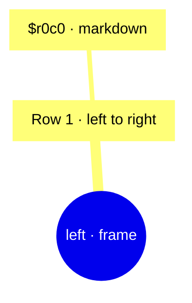

### ` Main/pair/right `

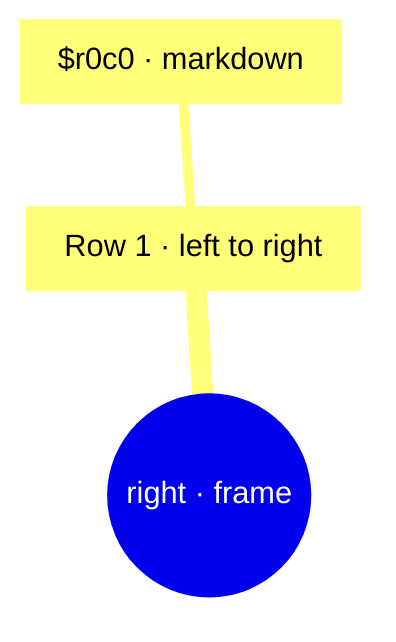

### ` Main/actions `

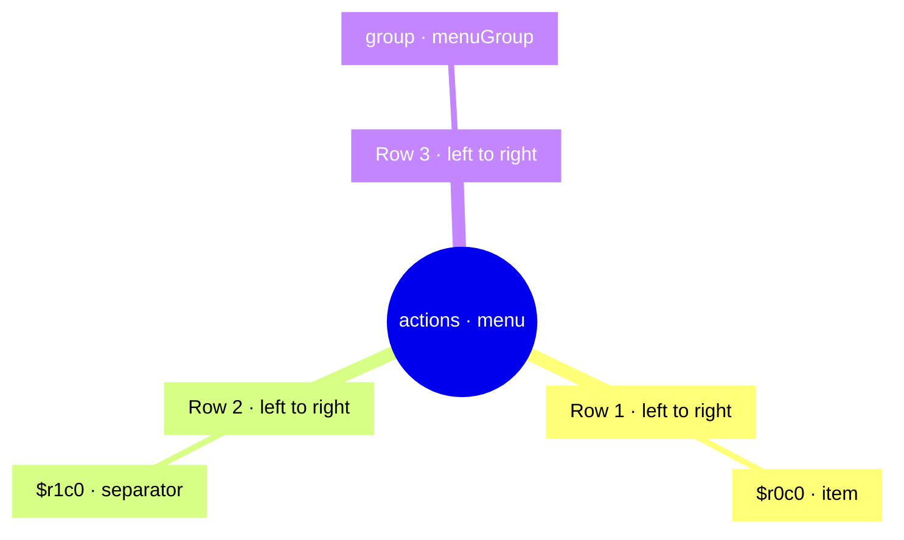

### ` Main/actions/group `

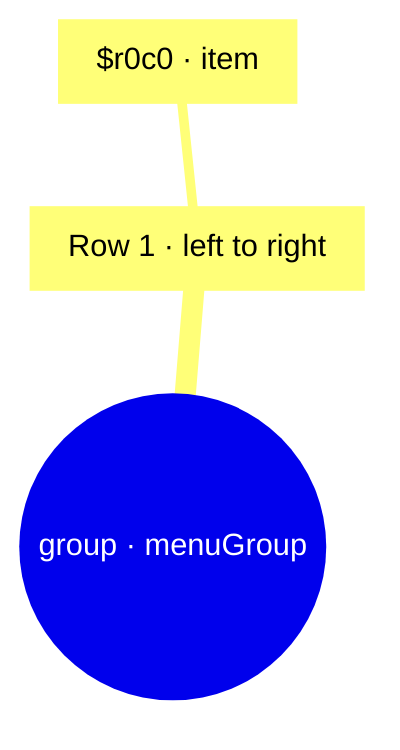

### ` Main/context `

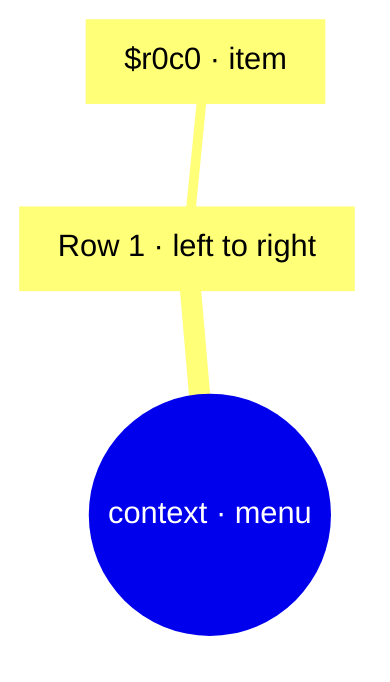

### ` Main/modal `

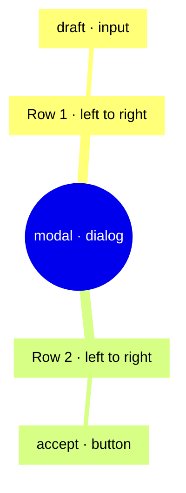

### ` Main/palette `

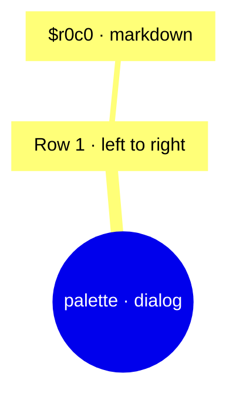

## Source and bindings

Source links select exact UTF-8 byte spans from this revision. Reused instances link their declaration and use sites. Layout includes effective overrides; symbolic callbacks are not executed.

| Instance | Declaration / source | Reuse sites | Layout and bindings |
| --- | --- | --- | --- |
| ` Main ` | ` Main ` [L5:6](sdui-source://167/1647) |  | ` {"overflow-y":"scroll"} ` ` {} ` |
| ` Main/grouped ` | `  ` [L6:2](sdui-source://170/214) |  | ` {} ` ` {} ` |
| ` Main/grouped/$r0c0 ` | `  ` [L6:11](sdui-source://179/196) |  | ` {} ` ` {"label":{"kind":"string","value":"Grouped","span":{"start":186,"end":195,"line":6,"column":18}}} ` |
| ` Main/grouped/$r0c1 ` | `  ` [L6:29](sdui-source://197/213) |  | ` {} ` ` {"text":{"kind":"string","value":"Grouped","span":{"start":203,"end":212,"line":6,"column":35}}} ` |
| ` Main/cmd ` | `  ` [L7:2](sdui-source://217/260) |  | ` {} ` ` {"$scope":{"kind":"string","value":"Main","span":{"start":217,"end":260,"line":7,"column":2}},"callback":{"module":"app","object":"Run","member":"invoke","span":{"start":244,"end":259,"line":7,"column":29}},"label":{"kind":"string","value":"Run","span":{"start":229,"end":234,"line":7,"column":14}}} ` |
| ` Main/legacyButton ` | `  ` [L8:2](sdui-source://263/317) |  | ` {} ` ` {"callback":{"module":"app","object":"Run","member":"invoke","span":{"start":301,"end":316,"line":8,"column":40}},"label":{"kind":"string","value":"Legacy","span":{"start":283,"end":291,"line":8,"column":22}}} ` |
| ` Main/decorated ` | `  ` [L9:2](sdui-source://320/387) |  | ` {} ` ` {"icon":{"kind":"string","value":"document","span":{"start":354,"end":364,"line":9,"column":36}},"label":{"kind":"string","value":"Decorated","span":{"start":337,"end":348,"line":9,"column":19}},"tooltip":{"kind":"string","value":"Information","span":{"start":373,"end":386,"line":9,"column":55}}} ` |
| ` Main/toggle ` | `  ` [L10:2](sdui-source://390/425) |  | ` {} ` ` {"$scope":{"kind":"string","value":"Main","span":{"start":390,"end":425,"line":10,"column":2}},"label":{"kind":"string","value":"Toggle","span":{"start":404,"end":412,"line":10,"column":16}},"toggle":{"kind":"boolean","value":true,"span":{"start":420,"end":424,"line":10,"column":32}}} ` |
| ` Main/bound ` | `  ` [L11:2](sdui-source://428/455) |  | ` {} ` ` {"$scope":{"kind":"string","value":"Main","span":{"start":428,"end":455,"line":11,"column":2}},"command":{"kind":"string","value":"cmd","span":{"start":449,"end":454,"line":11,"column":23}}} ` |
| ` Main/navigation ` | `  ` [L12:2](sdui-source://458/512) |  | ` {} ` ` {"callback":{"module":"app","object":"Run","member":"invoke","span":{"start":496,"end":511,"line":12,"column":40}},"label":{"kind":"string","value":"Navigation","span":{"start":474,"end":486,"line":12,"column":18}}} ` |
| ` Main/entries ` | `  ` [L13:2](sdui-source://515/538) |  | ` {} ` ` {"label":{"kind":"string","value":"Entries","span":{"start":528,"end":537,"line":13,"column":15}}} ` |
| ` Main/panes ` | `  ` [L14:2](sdui-source://541/612) |  | ` {} ` ` {"label":{"kind":"string","value":"Pages","span":{"start":552,"end":559,"line":14,"column":13}}} ` |
| ` Main/panes/one ` | `  ` [L14:22](sdui-source://561/585) |  | ` {} ` ` {"label":{"kind":"string","value":"One","span":{"start":570,"end":575,"line":14,"column":31}}} ` |
| ` Main/panes/one/$r0c0 ` | `  ` [L14:38](sdui-source://577/584) |  | ` {} ` ` {} ` |
| ` Main/panes/two ` | `  ` [L14:47](sdui-source://586/611) |  | ` {} ` ` {"label":{"kind":"string","value":"Two","span":{"start":595,"end":600,"line":14,"column":56}}} ` |
| ` Main/panes/two/$r0c0 ` | `  ` [L14:63](sdui-source://602/610) |  | ` {} ` ` {} ` |
| ` Main/pair ` | `  ` [L15:2](sdui-source://615/670) |  | ` {} ` ` {"axis":{"kind":"string","value":"horizontal","span":{"start":626,"end":638,"line":15,"column":13}},"collapsible":{"kind":"boolean","value":true,"span":{"start":615,"end":670,"line":15,"column":2}},"minFirst":{"kind":"number","value":0,"span":{"start":615,"end":670,"line":15,"column":2}},"minSecond":{"kind":"number","value":0,"span":{"start":615,"end":670,"line":15,"column":2}},"proportion":{"kind":"number","value":0.5,"span":{"start":615,"end":670,"line":15,"column":2}}} ` |
| ` Main/pair/left ` | `  ` [L15:27](sdui-source://640/653) |  | ` {} ` ` {} ` |
| ` Main/pair/left/$r0c0 ` | `  ` [L15:33](sdui-source://646/652) |  | ` {} ` ` {} ` |
| ` Main/pair/right ` | `  ` [L15:41](sdui-source://654/669) |  | ` {} ` ` {} ` |
| ` Main/pair/right/$r0c0 ` | `  ` [L15:48](sdui-source://661/668) |  | ` {} ` ` {} ` |
| ` Main/actions ` | `  ` [L16:2](sdui-source://673/774) |  | ` {} ` ` {"$scope":{"kind":"string","value":"Main","span":{"start":673,"end":774,"line":16,"column":2}},"label":{"kind":"string","value":"Actions","span":{"start":686,"end":695,"line":16,"column":15}}} ` |
| ` Main/actions/$r0c0 ` | `  ` [L16:26](sdui-source://697/716) |  | ` {} ` ` {"$scope":{"kind":"string","value":"Main","span":{"start":697,"end":716,"line":16,"column":26}},"command":{"kind":"string","value":"cmd","span":{"start":710,"end":715,"line":16,"column":39}}} ` |
| ` Main/actions/$r1c0 ` | `  ` [L16:46](sdui-source://717/728) |  | ` {} ` ` {} ` |
| ` Main/actions/group ` | `  ` [L16:58](sdui-source://729/773) |  | ` {} ` ` {"label":{"kind":"string","value":"More","span":{"start":745,"end":751,"line":16,"column":74}}} ` |
| ` Main/actions/group/$r0c0 ` | `  ` [L16:82](sdui-source://753/772) |  | ` {} ` ` {"$scope":{"kind":"string","value":"Main","span":{"start":753,"end":772,"line":16,"column":82}},"command":{"kind":"string","value":"cmd","span":{"start":766,"end":771,"line":16,"column":95}}} ` |
| ` Main/context ` | `  ` [L17:2](sdui-source://777/858) |  | ` {} ` ` {"$scope":{"kind":"string","value":"Main","span":{"start":777,"end":858,"line":17,"column":2}},"label":{"kind":"string","value":"Context","span":{"start":790,"end":799,"line":17,"column":15}},"mode":{"kind":"string","value":"context","span":{"start":805,"end":814,"line":17,"column":30}},"target":{"kind":"string","value":"legacyButton","span":{"start":822,"end":836,"line":17,"column":47}}} ` |
| ` Main/context/$r0c0 ` | `  ` [L17:63](sdui-source://838/857) |  | ` {} ` ` {"$scope":{"kind":"string","value":"Main","span":{"start":838,"end":857,"line":17,"column":63}},"command":{"kind":"string","value":"cmd","span":{"start":851,"end":856,"line":17,"column":76}}} ` |
| ` Main/modal ` | `  ` [L18:2](sdui-source://861/940) |  | ` {} ` ` {"$scope":{"kind":"string","value":"Main","span":{"start":861,"end":940,"line":18,"column":2}},"label":{"kind":"string","value":"Modal","span":{"start":874,"end":881,"line":18,"column":15}}} ` |
| ` Main/modal/draft ` | `  ` [L18:24](sdui-source://883/903) |  | ` {} ` ` {"text":{"kind":"string","value":"Draft","span":{"start":895,"end":902,"line":18,"column":36}}} ` |
| ` Main/modal/accept ` | `  ` [L18:45](sdui-source://904/939) |  | ` {} ` ` {"$scope":{"kind":"string","value":"Main","span":{"start":904,"end":939,"line":18,"column":45}},"effect":{"kind":"string","value":"accept","span":{"start":930,"end":938,"line":18,"column":71}},"label":{"kind":"string","value":"OK","span":{"start":918,"end":922,"line":18,"column":59}}} ` |
| ` Main/palette ` | `  ` [L19:2](sdui-source://943/992) |  | ` {} ` ` {"$scope":{"kind":"string","value":"Main","span":{"start":943,"end":992,"line":19,"column":2}},"label":{"kind":"string","value":"Palette","span":{"start":958,"end":967,"line":19,"column":17}},"modal":{"kind":"boolean","value":false,"span":{"start":974,"end":979,"line":19,"column":33}}} ` |
| ` Main/palette/$r0c0 ` | `  ` [L19:40](sdui-source://981/991) |  | ` {} ` ` {} ` |
| ` Main/open ` | `  ` [L20:2](sdui-source://995/1043) |  | ` {} ` ` {"$scope":{"kind":"string","value":"Main","span":{"start":995,"end":1043,"line":20,"column":2}},"effect":{"kind":"string","value":"open","span":{"start":1021,"end":1027,"line":20,"column":28}},"label":{"kind":"string","value":"Open","span":{"start":1007,"end":1013,"line":20,"column":14}},"target":{"kind":"string","value":"modal","span":{"start":1035,"end":1042,"line":20,"column":42}}} ` |
| ` Main/flag ` | `  ` [L21:2](sdui-source://1046/1081) |  | ` {} ` ` {"label":{"kind":"string","value":"Enabled","span":{"start":1060,"end":1069,"line":21,"column":16}},"value":{"kind":"boolean","value":true,"span":{"start":1076,"end":1080,"line":21,"column":32}}} ` |
| ` Main/slider ` | `  ` [L22:2](sdui-source://1084/1134) |  | ` {} ` ` {"label":{"kind":"string","value":"Scale","span":{"start":1098,"end":1105,"line":22,"column":16}},"max":{"kind":"number-lexeme","value":"10","span":{"start":1116,"end":1118,"line":22,"column":34}},"min":{"kind":"number-lexeme","value":"0","span":{"start":1110,"end":1111,"line":22,"column":28}},"step":{"kind":"number-lexeme","value":"1","span":{"start":1124,"end":1125,"line":22,"column":42}},"value":{"kind":"number-lexeme","value":"5","span":{"start":1132,"end":1133,"line":22,"column":50}}} ` |
| ` Main/choice ` | `  ` [L23:2](sdui-source://1137/1174) |  | ` {} ` ` {"label":{"kind":"string","value":"Choice","span":{"start":1151,"end":1159,"line":23,"column":16}},"required":{"kind":"boolean","value":true,"span":{"start":1169,"end":1173,"line":23,"column":34}}} ` |
| ` Main/amount ` | `  ` [L24:2](sdui-source://1177/1234) |  | ` {} ` ` {"label":{"kind":"string","value":"Amount","span":{"start":1191,"end":1199,"line":24,"column":16}},"max":{"kind":"number-lexeme","value":"10","span":{"start":1212,"end":1214,"line":24,"column":37}},"min":{"kind":"number-lexeme","value":"-10","span":{"start":1204,"end":1207,"line":24,"column":29}},"step":{"kind":"number-lexeme","value":"0.5","span":{"start":1220,"end":1223,"line":24,"column":45}},"value":{"kind":"number-lexeme","value":"1.5","span":{"start":1230,"end":1233,"line":24,"column":55}}} ` |
| ` Main/basic ` | `  ` [L25:2](sdui-source://1237/1275) |  | ` {} ` ` {"text":{"kind":"string","value":"Basic","span":{"start":1249,"end":1256,"line":25,"column":14}},"value":{"kind":"string","value":"Unchanged","span":{"start":1263,"end":1274,"line":25,"column":28}}} ` |
| ` Main/single ` | `  ` [L26:2](sdui-source://1278/1330) |  | ` {} ` ` {"placeholder":{"kind":"string","value":"","span":{"start":1312,"end":1314,"line":26,"column":36}},"required":{"kind":"boolean","value":false,"span":{"start":1324,"end":1329,"line":26,"column":48}},"text":{"kind":"string","value":"Single","span":{"start":1291,"end":1299,"line":26,"column":15}}} ` |
| ` Main/multi ` | `  ` [L27:2](sdui-source://1333/1400) |  | ` {} ` ` {"multiline":{"kind":"boolean","value":true,"span":{"start":1363,"end":1367,"line":27,"column":32}},"readOnly":{"kind":"boolean","value":false,"span":{"start":1377,"end":1382,"line":27,"column":46}},"text":{"kind":"string","value":"Notes","span":{"start":1345,"end":1352,"line":27,"column":14}},"value":{"kind":"string","value":"å\n🙂","span":{"start":1389,"end":1399,"line":27,"column":58}}} ` |
| ` Main/legacySVG ` | `  ` [L28:2](sdui-source://1403/1452) |  | ` {} ` ` {"label":{"kind":"string","value":"Legacy image","span":{"start":1437,"end":1451,"line":28,"column":36}},"source":{"module":"art","object":"Old","member":"draw","span":{"start":1417,"end":1430,"line":28,"column":16}}} ` |
| ` Main/image ` | `  ` [L29:2](sdui-source://1455/1541) |  | ` {} ` ` {"description":{"kind":"string","value":"Figure","span":{"start":1514,"end":1522,"line":29,"column":61}},"fallback":{"kind":"string","value":"reject","span":{"start":1532,"end":1540,"line":29,"column":79}},"label":{"kind":"string","value":"Caption","span":{"start":1492,"end":1501,"line":29,"column":39}},"source":{"module":"art","object":"Figure","member":"resource","span":{"start":1465,"end":1485,"line":29,"column":12}}} ` |
| ` Main/plain ` | `  ` [L30:2](sdui-source://1544/1567) |  | ` {} ` ` {} ` |
| ` Main/reading ` | ` Reading ` [L4:9](sdui-source://78/160) | ` Reading ` [L31:2](sdui-source://1570/1585) | ` {} ` ` {"description":{"kind":"string","value":"Reading document","span":{"start":124,"end":142,"line":4,"column":55}},"fallback":{"kind":"string","value":"label","span":{"start":152,"end":159,"line":4,"column":83}},"text":{"kind":"string","value":"# Reading\nPlain prose","span":{"start":87,"end":111,"line":4,"column":18}}} ` |
| ` Main/hiddenReading ` | ` Reading ` [L4:9](sdui-source://78/160) | ` Reading ` [L32:2](sdui-source://1588/1625) | ` {"visible":false} ` ` {"description":{"kind":"string","value":"Reading document","span":{"start":124,"end":142,"line":4,"column":55}},"fallback":{"kind":"string","value":"label","span":{"start":152,"end":159,"line":4,"column":83}},"text":{"kind":"string","value":"# Reading\nPlain prose","span":{"start":87,"end":111,"line":4,"column":18}}} ` |
| ` module app ` | [L2:1](sdui-source://10/34) | — | ` unopened.sdl ` |
| ` module art ` | [L3:1](sdui-source://35/69) | — | ` unopened-resources.sdl ` |
| ` Main/basic ` | [L34:1](sdui-source://1649/1679) | — | ` connection: app.Run (not executed) ` |

---

# SDUI — ` Main `

Static GUI dump. Buttons and fields are text labels; no callbacks execute.

## Layout overview

Row/column structure in terminal cells. Heights follow content; this is not measured GUI geometry.

```text
SDUI GUI dump | Main | 160 columns | structural preview
Static command | Main/cmd | not live state | label=Run | callback=app.Run.@invoke (not executed) | definition instance=Main | source=7:2
Static button | Main/decorated | not live state | label=Decorated | tooltip=Information | legacy Activate | symbolic icon=document (not loaded) | source=9:2
Static button | Main/toggle | not live state | label=Toggle | toggle=true | definition instance=Main | source=10:2
Static button | Main/bound | not live state | command=cmd | definition instance=Main | source=11:2
Static tabs | Main/panes | label=Pages | initial selection=first eligible page (not live state) | source=14:2
Static page | Main/panes/one | label=One | source=14:22
Static page | Main/panes/two | label=Two | source=14:47
Static split | Main/pair | axis=horizontal | proportion=0.5 | minFirst=0 | minSecond=0 | collapsible=true | source=15:2
Static menu | Main/actions | not live state | label=Actions | popup/context capture not simulated | definition instance=Main | source=16:2
Static item | Main/actions/$r0c0 | not live state | command=cmd | definition instance=Main | source=16:26
Static separator | Main/actions/$r1c0 | not live state | source=16:46
Static menuGroup | Main/actions/group | not live state | label=More | source=16:58
Static item | Main/actions/group/$r0c0 | not live state | command=cmd | definition instance=Main | source=16:82
Static menu | Main/context | not live state | label=Context | mode=context | target=legacyButton | popup/context capture not simulated | definition instance=Mai
n | source=17:2
Static item | Main/context/$r0c0 | not live state | command=cmd | definition instance=Main | source=17:63
Static dialog | Main/modal | not live state | label=Modal | initially closed; opening/Accept/Cancel/Close not simulated | definition instance=Main | source=18:2
Static button | Main/modal/accept | not live state | label=OK | effect=accept | definition instance=Main | source=18:45
Static dialog | Main/palette | not live state | label=Palette | modal=false | initially closed; opening/Accept/Cancel/Close not simulated | definition instance=
Main | source=19:2
Static button | Main/open | not live state | label=Open | target=modal | effect=open | definition instance=Main | source=20:2
Static checkbox | Main/flag | label=Enabled | source initial values; not live state | value=true | readOnly=false (default) | no source Commit binding; local ac
ceptance requires runtime adapter | source=21:2
Static slider | Main/slider | label=Scale | source initial values; not live state | min=0 | max=10 | step=1 | value=5 | readOnly=false (default) | no source Com
mit binding; local acceptance requires runtime adapter | source=22:2
Static select | Main/choice | label=Choice | source initial values; not live state | required=true | readOnly=false (default) | value=empty option ID (default) 
| choice options not supplied; IDs are not labels | no source Commit binding; local acceptance requires runtime adapter | source=23:2
Static number | Main/amount | label=Amount | source initial values; not live state | min=-10 | max=10 | step=0.5 | value=1.5 | readOnly=false (default) | no sou
rce Commit binding; local acceptance requires runtime adapter | source=24:2
Static input | Main/single | text="Single" | value="" | source initial text; not live state | multiline=false (default) | readOnly=false (default) | required=fa
lse | placeholder="" | no source Commit binding; local acceptance requires runtime adapter | source=26:2
Static input | Main/multi | text="Notes" | value="å\n🙂" | source initial text; not live state | multiline=true | readOnly=false | required=false (default) | pl
aceholder="Notes" (text fallback) | no source Commit binding; local acceptance requires runtime adapter | source=27:2
Static SVG preview | Main/image | source=art.Figure.@resource | description="Figure" | fallback="reject" | resources not supplied; source intent only | label="C
aption" | source=29:2
Static Markdown preview | Main/reading | text="# Reading\nPlain prose" | description="Reading document" | fallback="label" | resources not supplied; source inte
nt only | source=4:9
Static Markdown preview | Main/hiddenReading | text="# Reading\nPlain prose" | description="Reading document" | fallback="label" | resources not supplied; sourc
e intent only | visible=false | source=4:9

[ Grouped ]                                                                      Grouped: []
[Static command | Main/cmd | not live state | label=Run | callback=app.Run.@invoke (not executed) | definition instance=Main | source=7:2]
[ Legacy ]
[Static button | Main/decorated | not live state | label=Decorated | tooltip=Information | legacy Activate | symbolic icon=document (not loaded) | source=9:2]
[Static button | Main/toggle | not live state | label=Toggle | toggle=true | definition instance=Main | source=10:2]
[Static button | Main/bound | not live state | command=cmd | definition instance=Main | source=11:2]
[Static tree: Navigation | Main/navigation | provider data not supplied]
[Static list: Entries | Main/entries | provider data not supplied]
First
Second
Left
Right
[Static item | Main/actions/$r0c0 | not live state | command=cmd | definition instance=Main | source=16:26]
[Static separator | Main/actions/$r1c0 | not live state | source=16:46]
[Static item | Main/actions/group/$r0c0 | not live state | command=cmd | definition instance=Main | source=16:82]
[Static item | Main/context/$r0c0 | not live state | command=cmd | definition instance=Main | source=17:63]
Draft: []
[Static button | Main/modal/accept | not live state | label=OK | effect=accept | definition instance=Main | source=18:45]
Nonmodal
[Static button | Main/open | not live state | label=Open | target=modal | effect=open | definition instance=Main | source=20:2]
[Static checkbox | Main/flag | label=Enabled | source initial values; not live state | value=true | readOnly=false (default) | no source Commit binding; local a
cceptance requires runtime adapter | source=21:2]
[Static slider | Main/slider | label=Scale | source initial values; not live state | min=0 | max=10 | step=1 | value=5 | readOnly=false (default) | no source Co
mmit binding; local acceptance requires runtime adapter | source=22:2]
[Static select | Main/choice | label=Choice | source initial values; not live state | required=true | readOnly=false (default) | value=empty option ID (default)
 | choice options not supplied; IDs are not labels | no source Commit binding; local acceptance requires runtime adapter | source=23:2]
[Static number | Main/amount | label=Amount | source initial values; not live state | min=-10 | max=10 | step=0.5 | value=1.5 | readOnly=false (default) | no so
urce Commit binding; local acceptance requires runtime adapter | source=24:2]
Basic: [Unchanged]
[Static input | Main/single | text="Single" | value="" | source initial text; not live state | multiline=false (default) | readOnly=false (default) | required=f
alse | placeholder="" | no source Commit binding; local acceptance requires runtime adapter | source=26:2]
[Static input | Main/multi | text="Notes" | value="å\n🙂" | source initial text; not live state | multiline=true | readOnly=false | required=false (default) | p
laceholder="Notes" (text fallback) | no source Commit binding; local acceptance requires runtime adapter | source=27:2]
[SVG plassholder: Legacy image]
[Static SVG preview | Main/image | source=art.Figure.@resource | description="Figure" | fallback="reject" | resources not supplied; source intent only | label="
Caption" | source=29:2]
Legacy Markdown
[Static Markdown preview | Main/reading | text="# Reading\nPlain prose" | description="Reading document" | fallback="label" | resources not supplied; source int
ent only | source=4:9]
```

## Content

Markdown is rendered as content. Nested blockquotes represent groups and frames. Horizontal siblings appear in reading order here; the overview shows placement. Mermaid diagrams are omitted.

> **Frame:** ` Main `
>
> **Row 1 · 1 component from left to right**
>
> > **Group:** ` Main/grouped `
> >
> > **Row 1 · 2 components from left to right**
> >
> > **Button:** ` Grouped `
> >
> > ---
> >
> > **Input:** ` Grouped ` — `  `
> >
> > ---
> >
>
> ---
>
> **Row 2 · 1 component from left to right**
>
> **Declaration:** ` Static command | Main/cmd | not live state | label=Run | callback=app.Run.@invoke (not executed) | definition instance=Main | source=7:2 `
>
> ---
>
> **Row 3 · 1 component from left to right**
>
> **Button:** ` Legacy `
>
> ---
>
> **Row 4 · 1 component from left to right**
>
> **Declaration:** ` Static button | Main/decorated | not live state | label=Decorated | tooltip=Information | legacy Activate | symbolic icon=document (not loaded) | source=9:2 `
>
> ---
>
> **Row 5 · 1 component from left to right**
>
> **Declaration:** ` Static button | Main/toggle | not live state | label=Toggle | toggle=true | definition instance=Main | source=10:2 `
>
> ---
>
> **Row 6 · 1 component from left to right**
>
> **Declaration:** ` Static button | Main/bound | not live state | command=cmd | definition instance=Main | source=11:2 `
>
> ---
>
> **Row 7 · 1 component from left to right**
>
> **Static tree:** ` Navigation ` — ` Main/navigation `; provider data not supplied. Activate callback: ` app.Run.@invoke ` (not executed).
>
> ---
>
> **Row 8 · 1 component from left to right**
>
> **Static list:** ` Entries ` — ` Main/entries `; provider data not supplied.
>
> ---
>
> **Row 9 · 1 component from left to right**
>
> > **Pane declaration:** ` Static tabs | Main/panes | label=Pages | initial selection=first eligible page (not live state) | source=14:2 `
> >
> > **Row 1 · 1 component from left to right**
> >
> > > **Pane declaration:** ` Static page | Main/panes/one | label=One | source=14:22 `
> > >
> > > > First
> > >
> > > ---
> > >
> >
> > ---
> >
> > **Row 2 · 1 component from left to right**
> >
> > > **Pane declaration:** ` Static page | Main/panes/two | label=Two | source=14:47 `
> > >
> > > > Second
> > >
> > > ---
> > >
> >
> > ---
> >
>
> ---
>
> **Row 10 · 1 component from left to right**
>
> > **Pane declaration:** ` Static split | Main/pair | axis=horizontal | proportion=0.5 | minFirst=0 | minSecond=0 | collapsible=true | source=15:2 `
> >
> > **Row 1 · 1 component from left to right**
> >
> > > **Frame:** ` Main/pair/left `
> > >
> > > > Left
> > >
> > > ---
> > >
> >
> > ---
> >
> > **Row 2 · 1 component from left to right**
> >
> > > **Frame:** ` Main/pair/right `
> > >
> > > > Right
> > >
> > > ---
> > >
> >
> > ---
> >
>
> ---
>
> **Row 11 · 1 component from left to right**
>
> > **Declaration:** ` Static menu | Main/actions | not live state | label=Actions | popup/context capture not simulated | definition instance=Main | source=16:2 `
> >
> > **Row 1 · 1 component from left to right**
> >
> > **Declaration:** ` Static item | Main/actions/$r0c0 | not live state | command=cmd | definition instance=Main | source=16:26 `
> >
> > ---
> >
> > **Row 2 · 1 component from left to right**
> >
> > **Declaration:** ` Static separator | Main/actions/$r1c0 | not live state | source=16:46 `
> >
> > ---
> >
> > **Row 3 · 1 component from left to right**
> >
> > > **Declaration:** ` Static menuGroup | Main/actions/group | not live state | label=More | source=16:58 `
> > >
> > > **Declaration:** ` Static item | Main/actions/group/$r0c0 | not live state | command=cmd | definition instance=Main | source=16:82 `
> > >
> > > ---
> > >
> >
> > ---
> >
>
> ---
>
> **Row 12 · 1 component from left to right**
>
> > **Declaration:** ` Static menu | Main/context | not live state | label=Context | mode=context | target=legacyButton | popup/context capture not simulated | definition instance=Main | source=17:2 `
> >
> > **Declaration:** ` Static item | Main/context/$r0c0 | not live state | command=cmd | definition instance=Main | source=17:63 `
> >
> > ---
> >
>
> ---
>
> **Row 13 · 1 component from left to right**
>
> > **Declaration:** ` Static dialog | Main/modal | not live state | label=Modal | initially closed; opening/Accept/Cancel/Close not simulated | definition instance=Main | source=18:2 `
> >
> > **Row 1 · 1 component from left to right**
> >
> > **Input:** ` Draft ` — `  `
> >
> > ---
> >
> > **Row 2 · 1 component from left to right**
> >
> > **Declaration:** ` Static button | Main/modal/accept | not live state | label=OK | effect=accept | definition instance=Main | source=18:45 `
> >
> > ---
> >
>
> ---
>
> **Row 14 · 1 component from left to right**
>
> > **Declaration:** ` Static dialog | Main/palette | not live state | label=Palette | modal=false | initially closed; opening/Accept/Cancel/Close not simulated | definition instance=Main | source=19:2 `
> >
> > > Nonmodal
> >
> > ---
> >
>
> ---
>
> **Row 15 · 1 component from left to right**
>
> **Declaration:** ` Static button | Main/open | not live state | label=Open | target=modal | effect=open | definition instance=Main | source=20:2 `
>
> ---
>
> **Row 16 · 1 component from left to right**
>
> **Declaration:** ` Static checkbox | Main/flag | label=Enabled | source initial values; not live state | value=true | readOnly=false (default) | no source Commit binding; local acceptance requires runtime adapter | source=21:2 `
>
> ---
>
> **Row 17 · 1 component from left to right**
>
> **Declaration:** ` Static slider | Main/slider | label=Scale | source initial values; not live state | min=0 | max=10 | step=1 | value=5 | readOnly=false (default) | no source Commit binding; local acceptance requires runtime adapter | source=22:2 `
>
> ---
>
> **Row 18 · 1 component from left to right**
>
> **Declaration:** ` Static select | Main/choice | label=Choice | source initial values; not live state | required=true | readOnly=false (default) | value=empty option ID (default) | choice options not supplied; IDs are not labels | no source Commit binding; local acceptance requires runtime adapter | source=23:2 `
>
> ---
>
> **Row 19 · 1 component from left to right**
>
> **Declaration:** ` Static number | Main/amount | label=Amount | source initial values; not live state | min=-10 | max=10 | step=0.5 | value=1.5 | readOnly=false (default) | no source Commit binding; local acceptance requires runtime adapter | source=24:2 `
>
> ---
>
> **Row 20 · 1 component from left to right**
>
> **Input:** ` Basic ` — ` Unchanged `
>
> ---
>
> **Row 21 · 1 component from left to right**
>
> **Declaration:** ` Static input | Main/single | text="Single" | value="" | source initial text; not live state | multiline=false (default) | readOnly=false (default) | required=false | placeholder="" | no source Commit binding; local acceptance requires runtime adapter | source=26:2 `
>
> ---
>
> **Row 22 · 1 component from left to right**
>
> **Declaration:** ` Static input | Main/multi | text="Notes" | value="å\n🙂" | source initial text; not live state | multiline=true | readOnly=false | required=false (default) | placeholder="Notes" (text fallback) | no source Commit binding; local acceptance requires runtime adapter | source=27:2 `
>
> ---
>
> **Row 23 · 1 component from left to right**
>
> **SVG placeholder:** ` Legacy image `
>
> ---
>
> **Row 24 · 1 component from left to right**
>
> **Declaration:** ` Static SVG preview | Main/image | source=art.Figure.@resource | description="Figure" | fallback="reject" | resources not supplied; source intent only | label="Caption" | source=29:2 `
>
> ---
>
> **Row 25 · 1 component from left to right**
>
> > Legacy Markdown
>
> ---
>
> **Row 26 · 1 component from left to right**
>
> **Declaration:** ` Static Markdown preview | Main/reading | text="# Reading\nPlain prose" | description="Reading document" | fallback="label" | resources not supplied; source intent only | source=4:9 `
>
> ---
>
