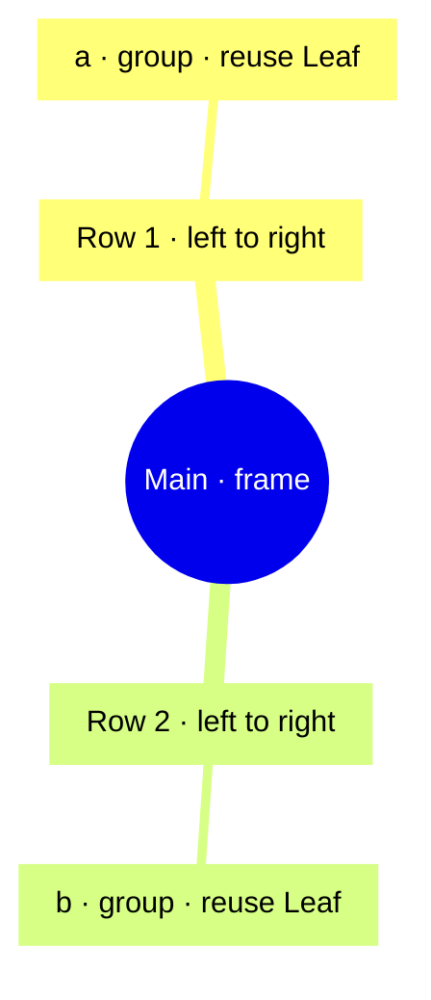
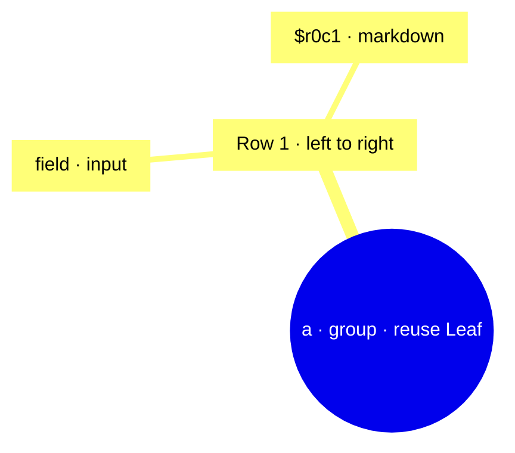

# SDUI composition — ` Main `

Source composition maps, not live UI or measured geometry. The overview shows regions and ordered rows; nested containers have their own detail maps below. Hidden and reused instances remain visible here. The text prototype follows visibility rules.

### ` Main `



### ` Main/a `



### ` Main/b `


## Source and bindings

Source links select exact UTF-8 byte spans from this revision. Reused instances link their declaration and use sites. Layout includes effective overrides; symbolic callbacks are not executed.

| Instance | Declaration / source | Reuse sites | Layout and bindings |
| --- | --- | --- | --- |
| ` Main ` | ` Main ` [L1:64](sdui-source://69/84) |  | ` {} ` ` {} ` |
| ` Main/a ` | ` Leaf ` [L1:16](sdui-source://15/62) | ` Leaf ` [L1:65](sdui-source://70/76) | ` {} ` ` {} ` |
| ` Main/a/field ` | `  ` [L1:17](sdui-source://16/50) |  | ` {} ` ` {"text":{"kind":"string","value":"Blå","span":{"start":28,"end":34,"line":1,"column":29}},"value":{"kind":"string","value":"å🙂","span":{"start":41,"end":49,"line":1,"column":41}}} ` |
| ` Main/a/$r0c1 ` | `  ` [L1:47](sdui-source://51/61) |  | ` {} ` ` {} ` |
| ` Main/b ` | ` Leaf ` [L1:16](sdui-source://15/62) | ` Leaf ` [L1:72](sdui-source://77/83) | ` {} ` ` {} ` |
| ` Main/b/field ` | `  ` [L1:17](sdui-source://16/50) |  | ` {} ` ` {"text":{"kind":"string","value":"Blå","span":{"start":28,"end":34,"line":1,"column":29}},"value":{"kind":"string","value":"å🙂","span":{"start":41,"end":49,"line":1,"column":41}}} ` |
| ` Main/b/$r0c1 ` | `  ` [L1:47](sdui-source://51/61) |  | ` {} ` ` {} ` |

---

# SDUI — ` Main `

Static GUI dump. Buttons and fields are text labels; no callbacks execute.

## Layout overview

Row/column structure in terminal cells. Heights follow content; this is not measured GUI geometry.

```text
SDUI GUI dump | Main | 160 columns | structural preview
Blå: [å🙂]                                                                       π prose
Blå: [å🙂]                                                                       π prose
```

## Content

Markdown is rendered as content. Nested blockquotes represent groups and frames. Horizontal siblings appear in reading order here; the overview shows placement. Mermaid diagrams are omitted.

> **Frame:** ` Main `
>
> **Row 1 · 1 component from left to right**
>
> > **Group:** ` Main/a `
> >
> > **Row 1 · 2 components from left to right**
> >
> > **Input:** ` Blå ` — ` å🙂 `
> >
> > ---
> >
> > > π prose
> >
> > ---
> >
>
> ---
>
> **Row 2 · 1 component from left to right**
>
> > **Group:** ` Main/b `
> >
> > **Row 1 · 2 components from left to right**
> >
> > **Input:** ` Blå ` — ` å🙂 `
> >
> > ---
> >
> > > π prose
> >
> > ---
> >
>
> ---
>
