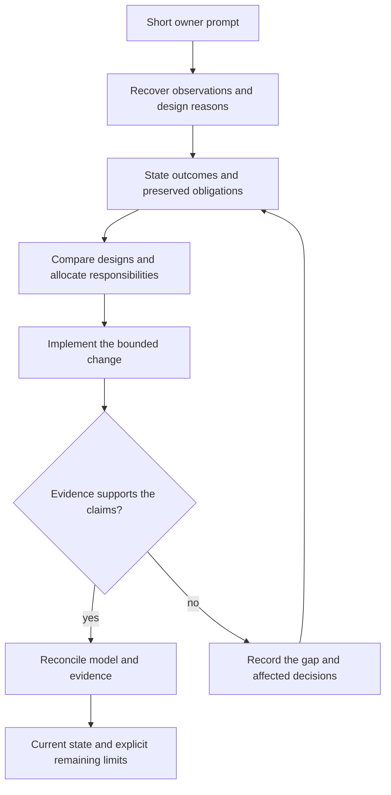

# System Development Process

Date: 2026-09-18  
Status: candidate process for the new SDP concept.

## 1. Purpose

Enable an owner to describe a goal or symptom briefly while the engineering
process recovers the context needed to make a compatible, maintainable change.
The owner should not have to enumerate every architectural invariant or predict
every possible misunderstanding.

SDP organizes reasoning and evidence across abstraction levels. SDL gives the
system descriptions precise identities and relationships. Neither a filled-out
template nor a syntactically valid model proves that the solution is appropriate.

Retain useful principles from earlier SDP: repository-grounded authority, bounded
work, horizontal design with vertical delivery, explicit decisions and truthful
verification. Do not require every historical role, form or tool as part of this
new concept before its usefulness is demonstrated.

## 2. Working cycle

| Step | Engineering question | Durable result |
|---|---|---|
| Understand | What is observed, wanted and affected? | Owner intent, observations and scope; assumptions explicitly separate. |
| Recover context | What already explains or constrains this behavior? | Relevant requirements, design reasons, current model and source/evidence links. |
| Frame the obligation | What must be true for the change to succeed? | Testable outcomes, preserved obligations and candidate derived requirements. |
| Explore | Which alternatives satisfy the need within the system? | Compared designs, consequences, rejected alternatives and remaining uncertainty. |
| Refine and allocate | How does the chosen behavior map onto responsibilities and boundaries? | Functional model linked to Containers, layers, Units, data and interactions. |
| Realize | What implementation or executable binding supplies each contribution? | Bounded change with model/source/test links and explicit unimplemented parts. |
| Verify | What evidence distinguishes success from merely compiling? | Scenario, contract, implementation and user-visible evidence as applicable. |
| Reconcile | What did implementation teach us, and what is now authoritative? | Updated model, decisions, gaps and an accurate handoff/current-state view. |

This is an iterative cycle. A detailed discovery can require revisiting an earlier
obligation. It must not silently turn an implementation convenience into a new
product requirement, nor keep an invalid high-level design artificially frozen.

Different parts of a system can be at different maturity levels. Implement a
bounded vertical scenario through the affected levels; do not require a complete
design of every subsystem before useful work can begin.

The main path below follows a bounded change. The feedback path reopens the
affected obligation or design when verification exposes a problem.



## 3. Handling short prompts

### Phase boundaries and progressive detail

Requirements describe required outcomes, behavior and constraints without choosing
an architecture merely for convenience. Architecture allocates logical/runtime
responsibilities and identifies their connections. Design refines the horizontal
layers, contracts, Functions and state behavior. Implementation binds that design
to source code and resolves legitimate implementation details.

At architecture level, a Channel needs its purpose, endpoints and relevant
interaction/quality assumptions; its exact payload fields and wire representation
can wait for detailed design. Deferring the contract must not hide a feasibility,
authority, timing or availability assumption that determines the architecture.

Feasibility feedback can travel upward. It must be explicit when a discovered
constraint changes requirements or architecture; phases are not a license to
silently revise the goal from below.

At the end of design, every in-scope requirement should have a justified
realization, compatible contracts, requirement-relevant Functions/behavior and
a verification approach. Shared quality/constraint requirements may map to
architecture, deployment or resource budgets rather than one Function.
Unresolved gaps and contradictions prevent claiming complete design coverage.

This is stronger than merely linking each requirement to a box. It is still
different from proving the future code satisfies it: implementation tests,
measurements and integration evidence remain necessary. Model every Function
needed to explain those obligations, not every eventual source-language helper.

### From a symptom to a bounded task

For “the lower buttons are inaccessible,” the first output is a small problem
interpretation, not an immediate scrollbar patch:

- Preserve the owner's observation and identify the affected view/workflow.
- Inspect the actual behavior and viewport, plus the layout decisions that explain it.
- Trace the controls to their purpose and the responsible layers.
- Determine whether excess content, allocation, sizing or a missing interaction
  violates the intended layout.
- Compare an appropriate correction against preserved obligations.
- Verify at the real viewport and workflow, not only through a passing build.

This is a method illustration. It does not assert that this checkpoint freshly
inspected or established any particular Concept1 layout requirement.

A compact engineering intake record should name: observed symptom, intended
outcome, known invariants with sources, affected model identities, material
uncertainties and the evidence that will show success. Existing records should
be referenced, not copied into a new essay for every request.

Ask the owner about a genuine product choice or missing observation only when
needed. The process should perform context recovery and routine design work;
it should not transfer that work back to the owner as a questionnaire.

## 4. Requirements discovered during design

Some necessary obligations are uncovered only during realization. For example:
two projections used together must refer to a compatible source revision.

Record such a discovery as:

| Field | Purpose |
|---|---|
| Trigger/evidence | The concrete failure, scenario or conflict that exposed it. |
| Derived obligation | What must hold, with an observable acceptance condition. |
| Rationale | Why it is necessary for an existing goal or invariant. |
| Affected scope | Features, capabilities, contracts, Units and implementations. |
| Alternatives | Other ways to satisfy the need, where material. |
| Disposition | Candidate, adopted within existing authority, deferred or rejected. |
| Verification | How the obligation will be checked and at which revision. |

A requirement states an obligation; a design decision chooses a way to meet it.
“Keep paired projections consistent” does not automatically require a SQL
transaction, an extra service or a global lock.

An agent may surface and propose the obligation. Adoption follows the authority
appropriate to its impact: ordinary implementation refinement differs from a
new user-visible policy or changed architecture promise. The record must say
which occurred, without inventing owner approval.

This illustrative requirement view links an obligation to a proposed design
contribution and a test specification. The Mermaid risk field is an example
classification. A `verifies` edge does not claim the test has run or passed.

```mermaid
requirementDiagram
    functionalRequirement ImportPreservesActive {
        id: CP1-APT-R04
        text: "Import does not change the active APT selection"
        risk: medium
        verifymethod: test
    }
    element ImportContract {
        type: candidate design contract
        docref: checkpoint APT witness
    }
    element ActiveSelectionCheck {
        type: proposed test specification
        docref: checkpoint APT acceptance cases
    }
    ImportContract - satisfies -> ImportPreservesActive
    ActiveSelectionCheck - verifies -> ImportPreservesActive
```

## 5. Responsibility and review

Someone performing the work must cover these responsibilities: intent recovery,
architectural assessment, implementation, verification and critical review.
This does not mandate a separate agent or meeting for every responsibility.

Review the framing as well as the diff: a flawless implementation of the wrong
local fix is still a failure. Verification should challenge preserved invariants,
invalid/stale/concurrent paths and the claims actually made.

For high-impact work, independent review is valuable or may be required by the
active project contract. This checkpoint does not replace existing project
authorization or safety constraints.

## 6. Current model, rationale and evidence

Keep three connected but distinct records:

- **Current model:** what the selected design says now.
- **Decision history:** why it says that, alternatives and superseded choices.
- **Evidence:** what has actually been observed, implemented or verified.

A generated current-state index should resolve stable identities to those records.
A decision left only in an issue comment is not reliably usable until it has a
durable disposition and affected model links. Referencing the comment preserves
provenance; the canonical decision record captures its engineering consequence.

Change impact works in both directions: owner intent down to realization, and
implementation discoveries back to affected obligations. Completeness reports
must distinguish missing links from known unimplemented behavior.

## 7. Delivery and maintenance

A bounded work item states the intended result, affected model region, preserved
obligations, files/bindings and acceptance evidence. Its granularity need not match
one Feature or one Container.

After changes, reconcile model, implementation and tests together. Preserve
revision-specific evidence; a test for a previous implementation is not evidence
for the new one. Record unresolved risks and gaps explicitly.

Release/deployment remains an engineering stage requiring compatibility,
configuration, operational behavior and actual publication evidence. This new
process concept does not prescribe a replacement versioning/installation system
yet. Existing projects continue following their installed rules until migrated.

## 8. Measuring whether this process helps

Evaluate the process on real changes:

- Can an unfamiliar engineer find the relevant design reason without reconstructing chat?
- Can a short symptom be traced to the right responsibility and acceptance scenario?
- Do proposed changes expose affected contracts before code is modified?
- Are newly discovered obligations captured without excessive paperwork?
- Do diagrams, source bindings and tests identify the same model revision?
- Can optional/unknown behavior remain explicit without blocking unrelated work?

The measure is better decisions and preserved behavior, not document count.
