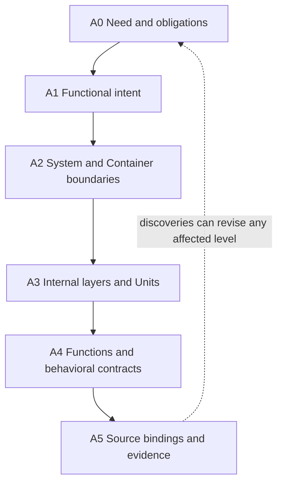
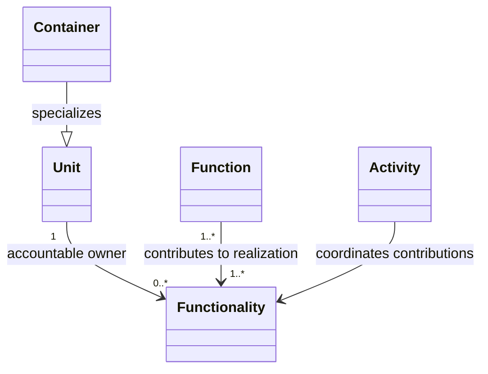
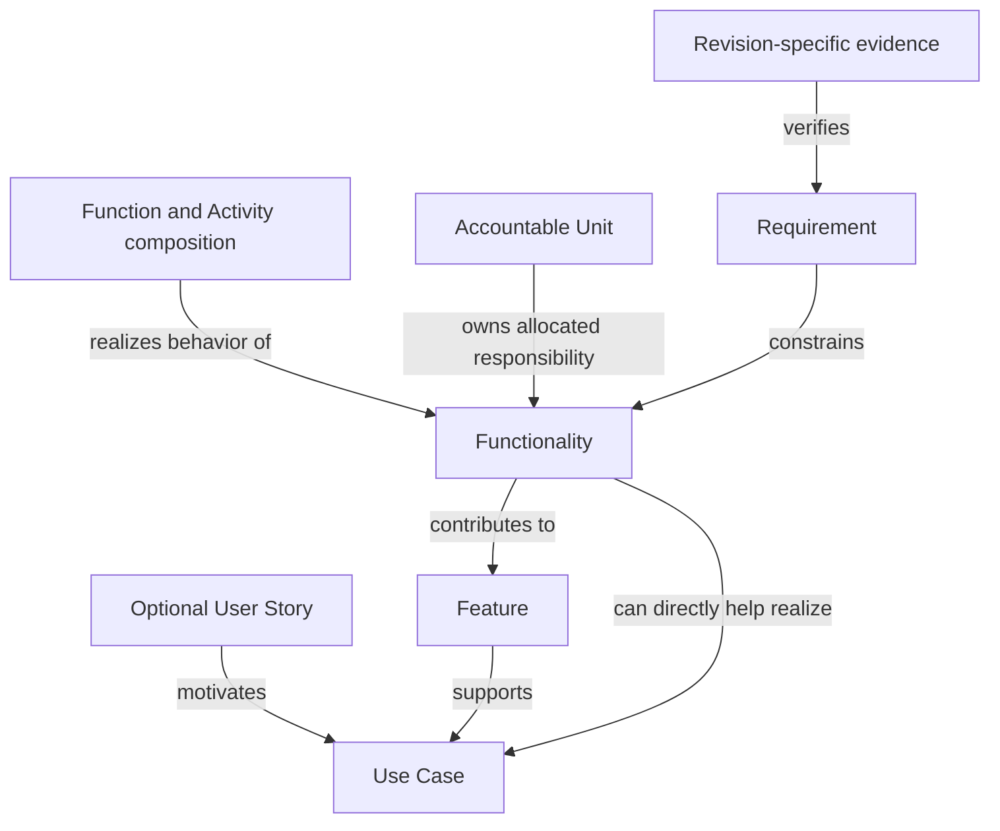
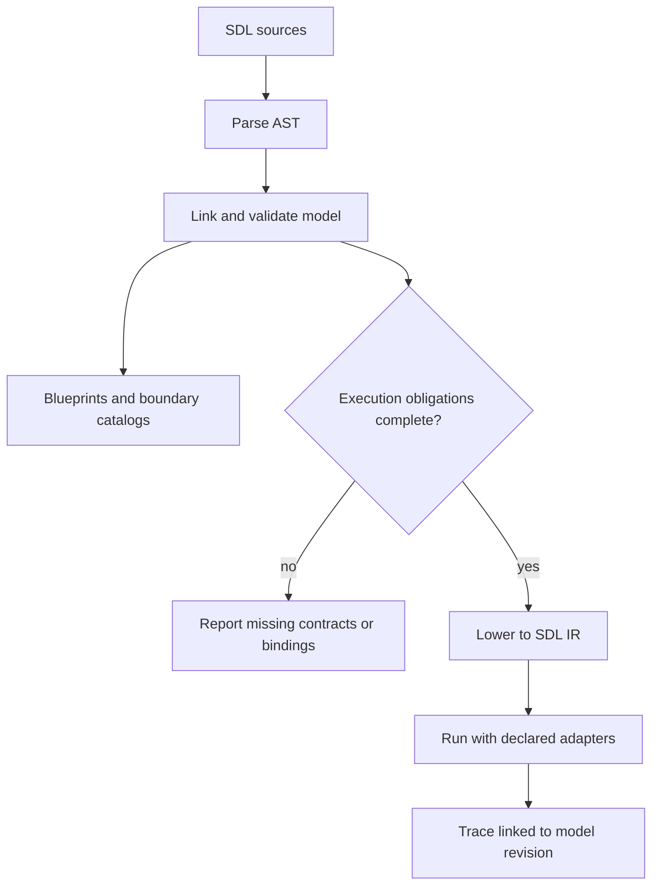
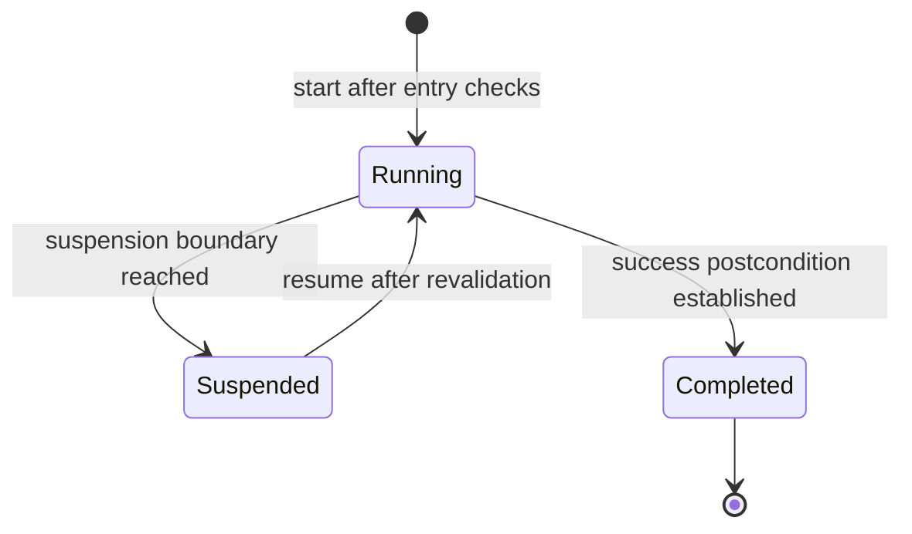
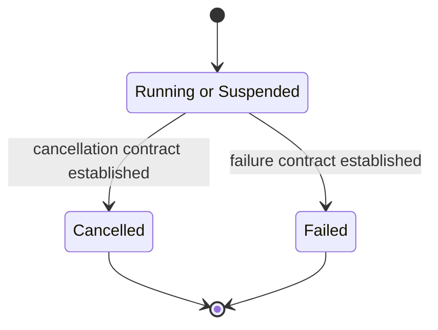

# SDL model and abstraction levels

Date: 2026-09-18  
Status: conceptual checkpoint, revised 2026-09-18 after the owner's APT example.
Proposed profiles and Functionality/Function semantics; no grammar adoption.

## 1. One connected model, several views

SDL should describe intent, requirements, structure, behavior, data, decisions
and realization with stable identities and typed relationships. Some descriptions
can be incomplete while still useful. A selected execution profile needs enough
detail to execute its transitive dependencies.

Do not equate abstraction levels with file folders or runtime layers.
Requirements and invariants can constrain several levels. A scenario may have
progressively detailed realizations; it does not become a different user goal
merely because its implementation is opened for inspection.

## 2. Proposed abstraction levels

These A0–A5 labels organize this checkpoint; they are not new SDL keywords.

The downward path adds realization detail while preserving obligations. It does
not prescribe a one-pass workflow or turn abstraction levels into runtime layers.



| Level | Main question | Main concepts | Completion concern |
|---|---|---|---|
| A0 — Need and obligations | What must actors achieve, and what must hold? | Optional User Story, Actor, Use Case, Requirement, acceptance Scenario, Constraint, rationale. | Observable outcomes, scope and source of obligations. |
| A1 — Functional intent | What behavior/abilities deliver those outcomes? | Feature, Functionality candidate, Capability, abstract Activity, State/conditions. | Behavioral contracts without premature deployment choices. |
| A2 — System architecture | Which boundaries collaborate to realize it? | System, Container, external participant, Interface, Channel, allocation. | Responsibilities, dependency/failure boundaries and contracted flows. |
| A3 — Container architecture | How is responsibility separated internally? | Horizontal Layer, internal Unit, exposed interfaces, internal Channels, data/control allocation. | Layer rules, state authority and permitted crossings. |
| A4 — Detailed design | How does each contribution behave? | Unit, Activity/Step, Function candidate, Dataset, Value, Command, transitions and effects. | Identity, lifecycle, algorithms, validity and concurrency semantics. |
| A5 — Realization and evidence | What executes it, and what proves the claims? | Source binding, adapter, execution IR, test, observed trace, deployment configuration. | Reproducible realization with bounded claims. |

Data contracts may be introduced at A1 if externally observable semantics require
them, then refined lower down. This is not a ban on thinking about feasibility
early. It prevents implementation choices from silently redefining intent.

## 3. Working vocabulary

| Concept | Meaning at this checkpoint |
|---|---|
| User Story | Optional short actor/need/value statement motivating one or more Use Cases or Features. It is not a mandatory root for every obligation. |
| Use Case | An actor's goal and meaningful interaction with the system. |
| Requirement | A sourced, assessable obligation or constraint. |
| Feature | A durable product behavior supporting one or more Use Cases. |
| Functionality | **Current candidate:** a cohesive behavioral responsibility supporting Features/capabilities, bounded to one Container when allocated and realized under one accountable Unit. Allocation may remain unspecified during early intent work. |
| Function | **New candidate:** a named design-level operation with inputs/results, preconditions and specified state/effects; contributes to realizing a Functionality and is later bound to code/IR. |
| Capability | An ability under stated conditions, with scope/exposure; can be desired or identified from composed realization. |
| Activity | Behavior over time with entry conditions, progress, lifecycle and outcome contracts; may repeat and coordinate several responsibilities. Distinguish its definition from each execution instance. See Section 9 for the candidate refinement. |
| Scenario | A selected path/example with entry conditions and outcomes; evidence of a run is a Trace. |
| Unit | A bounded responsibility with accountable state/behavior. |
| Container | An application/runtime boundary; not every Library or logical Unit. |
| Layer | An architectural separation of responsibilities, not automatically a process or namespace. |
| Interface | What collaborators may rely on at a boundary. |
| Channel | Contracted interaction between endpoints; internal/external scope does not itself choose transport or scheduling. |
| Dataset / Datagram / Value | Logical data source, transferable family and owned runtime state; see the data document. |
| Command / ControlSet | Invocable operation and a candidate grouping of exposed Commands. |
| State / Event / Transition | Situation, occurrence and change relation; none is a synonym for Functionality. |
| Contract | Typed shape plus meaning, conditions, identity, failure and compatibility obligations as applicable. |

A command's invocation is an occurrence; its implementation may call several
operations. A Functionality describes a responsibility, not “an event inside a
Container.” A source function is an implementation symbol, not automatically
a Functionality or Capability.

## 4. Feature, Functionality and Function: revised candidate

### 4.1 Preserve locality; defer allocation rather than invent architecture

The current `design-core 0.1` definition requires one immediate Unit owner for
each Functionality. The earlier study confines its responsibility to one
Container where allocation is known. The owner's latest APT example supports
retaining that meaning.

The initial checkpoint suggested broadening Functionality so a realization could
span Containers. That recommendation is now **reconsidered**, not silently adopted.
A better current candidate separates two questions:

- What behavioral responsibility is required?
- Which Container/Unit will own its realization?

An early model can leave allocation unresolved without claiming that one completed
Functionality has several Container owners. This is a proposed incomplete-intent
profile, not permission to omit the owner in the implemented core. Once architecture
and design allocate it, require one accountable Unit and a Container-local scope.
It can use collaborators' contracts; their responsibilities remain separately owned.

If a provisional contribution cannot remain local, decompose it into local
Functionalities and describe the collaboration through a Feature/Activity
realization. Do not stretch one owner's authority across Containers.

Candidate APT distinction:

| Concept | Example |
|---|---|
| Feature | Bucking uses price-matrix information importable from supported Classic and selected newer StanForD sources. |
| Functionality | Import and validate an APT definition under the responsible domain Unit. |
| Other supporting Functionalities | Manage active definitions; expose coherent matrices; compute and present bucking alternatives. |
| Functions within import realization | Identify source format; decode the selected format; validate semantic fields; construct the domain draft; commit an accepted draft revision. |

The Feature can span import, planning and UI responsibilities. “Import APT” is
one cohesive contribution and can support other Features too. Exact supported
newer-standard/version semantics remain an open contract; similar names do not
prove equivalent quantities or economics.

### 4.2 Function is a selected design operation

This candidate type view illustrates allocation and reuse in a completed design.
Ownership is shown as an association, without inventing a shared memory lifetime.
The Function relationship is many-to-many; the diagram does not require C++ classes.



Recommend `Function` for a meaningful operation in detailed design, distinct
from Functionality, Command, Activity and source-language function.

- Functionality is the behavioral responsibility and its contract.
- Functions provide the selected operations realizing it.
- An Activity/flow specifies sequencing, branches, waits and composition.
- A Command is an invocation contract; it may invoke an Activity or Functions.
- A source function is an implementation symbol, which may realize all or part
  of a modeled Function.

A Functionality can be realized by one or more Functions, with composition
needed to satisfy its contract. Several Functionalities can use one Function.
Reusable definitions and their runtime instances need explicit bindings.
No one-to-one requirement links a Function to a C++ function.

A modeled Function may bind to several source symbols; a source symbol can also
implement several modeled operations through an explicit mapping. Helpers,
accessors and compiler-generated functions need not all appear in SDL.

Model the functions necessary to explain requirement-relevant behavior: boundary
validation, decision logic, authoritative mutations, synchronization, error
handling and promised quality behavior. The objective is sufficient explanatory
coverage, not the largest possible Function inventory.

Do not create competing `function`, `operation` and `handler` keywords with
the same meaning. Function is the current candidate name; existing source
“handler” descriptions can remain explanatory roles. Keyword/type adoption
requires positive/negative examples and grammar changes later.

### 4.3 Preconditions, outcomes and permitted state effects

The earlier scenario study already discussed entry conditions, guards,
postconditions and preservation through composition. It did not implement a
complete Functionality contract language. Recommend applying these concepts to
both Functionality and Function, at their respective granularity.

A contract should state:

- Inputs/results and identified state context.
- Preconditions for valid invocation, including necessary authority/resources.
- Success and alternative/error outcomes with corresponding postconditions.
- Invariants and the state/effects allowed to change.
- Relevant timing, revision, concurrency and completion obligations.

A Function **may** change state; it need not do so. Conceptually:

```text
(input, state_before) -> (outcome, result, state_after, declared_effects)
```

This is explanatory notation, not an implemented SDL expression.
A pure calculation can leave state unchanged. A read operation can produce a
result without mutation. A command may commit a change; an external effect may
require separately observed completion. Arbitrary I/O is not smuggled into the
word “Function.”

State is the relevant owned situation, including Values, Dataset revisions and
lifecycle where needed. It is not necessarily one global simultaneous snapshot.
An Event is an occurrence; a Transition describes a before/after change under
conditions. Neither is the Function definition.

Frame obligations state what remains unchanged. For import, accepted draft data
may change while active APT and unrelated machine state remain unchanged.
Failure may permit diagnostic updates while preserving domain data; “no state
changes” would overstate that guarantee.

Do not define success preconditions so narrowly that invalid files fall outside
the documented behavior. Separate admission conditions from validation outcomes:
a permitted import request can receive an unsupported/malformed/conflicting-input
result with explicit postconditions.

Postconditions of one step must establish the next step's needed inputs/state.
Concurrency may invalidate that relationship before the next operation runs,
so identity/revision checks or another explicit coordination rule remain necessary.

### 4.4 Maturity and migration

Feature, Functionality and Function form connected abstractions, not compulsory
one-to-many containment trees. The language must support shared realization and
traceable obligations without duplicating authority.

The 109 exercise Functionalities were written before Function was proposed.
Review them individually: some are cohesive Functionalities, while some may become
Functions within a realization. Do not rename them all mechanically, change the
core's one-owner rule by prose, or assert that every declared Function is code-bound.

Capability retains a separate meaning: an ability under conditions at a scope or
boundary. A composition of Functions does not prove a Capability unless its
contracts, dependencies and evidence establish the promised ability.

## 5. Relationships across levels

The following are semantic relationship proposals, not accepted SDL sentences.

| Relationship | Direction / purpose | What it does not prove |
|---|---|---|
| Supports | Feature → Use Case | That every use-case outcome is covered. |
| Constrains | Requirement/Invariant → affected model facts | Implementation compliance. |
| Contributes | Functionality → Feature/Capability | Complete composed behavior. |
| Realization contribution | Function/Activity composition → Functionality | That a collection of operation names satisfies the contract. |
| Refines | Detailed Activity → abstract Activity | Preservation without compatible guards/outcomes and evidence. |
| Realizes | Design realization → functional obligation | Source correctness or runtime success. |
| Allocates | Realization contribution → accountable Unit | A new Feature owner or implicit deployment. |
| Binds | Detailed operation/adapter → source symbol or IR body | Verified behavior without evidence. |
| Verifies | Evidence → identified obligation and revision | Future revisions or untested scenarios. |

Exact keywords/signatures must be consolidated before grammar adoption. They
are named meanings for discussion, not aliases that a permissive parser accepts.

This relation view separates contribution from ownership. The links illustrate
possible relationships, not mandatory one-to-one cardinalities. The Unit owner
is resolved when allocation is complete; a simple Use Case need not have a Feature
intermediary.



Many-to-many links are essential: a Feature uses several contributions; a shared
contribution supports several Features. Structural containment and behavioral
refinement form different graphs. A lower-level refactor can preserve a Feature
while changing allocation; a changed observable outcome must revise its obligation.

Every refinement should preserve relevant preconditions, allowed outcomes,
invariants, identities and quality limits. A hidden extra side effect or a newly
required service is a contract change, not harmless detail.

## 6. Level-specific language profiles

Recommend one vocabulary/type system with profile-specific authoring and
completion rules, rather than independent dialects.

| Profile | Primary declarations | References and limits |
|---|---|---|
| Intent | Use cases, requirements, Features, abstract behavior/abilities | May link to a lower-level realization without embedding source symbols as the need itself. |
| Architecture | Containers, Units, layers, interfaces, Channels, allocations | Refers upward to functional obligations and downward to contracts. |
| Detailed design | Functions, Values, data/control contracts, Activities/Steps and lifecycle | Refers to owned boundaries and higher-level obligations; no invented deployment facts. |
| Execution binding | Source/IR/adapter bindings, runtime policies and evidence | Cannot supply a changed product meaning by implementation defaults. |

Early intent may identify a Functionality with pending allocation; the completed
design profile must resolve its accountable owner. It must not require premature
Container declarations merely to record a need.

These are candidate profile names, not implemented headers. A profile can restrict
which objects are declared locally while allowing typed cross-profile references.
Names do not change meaning by profile or folder. One fact has one canonical
semantic representation; optional type annotations do not create dialects.

Validate separately: syntax and type correctness; consistency of linked views;
completeness for the intended design question; completeness for a selected
execution target. An incomplete A1 design is not invalid simply because it does
not yet choose a renderer library.

## 7. Compiler and generated views

The proposed pipeline is source → AST → linked model → validations, then selected
outputs such as blueprints, boundary contracts, generated MessageSets or execution
IR. Each output retains source identities and revision mappings.

MessageSet is now intended to be derived from family/control contracts and
participant permissions, not hand-maintained source. Lowering must preserve
variant, direction, reply and mode restrictions.

An executable IR requires the needed state, initial conditions, predicates,
operations, scheduling and effects. Contracts or explicit bindings can supply
that detail. Neither a name nor an English obligation is an executable algorithm.
A runnable slice may use declared doubles; the evidence must identify them.

The existing structural parser and MVP1 corpus remain separate experimental
baselines. No new profile, relation, data type or behavior is implemented here.

This target pipeline distinguishes structural outputs from runnable behavior.
An execution gap is reported rather than supplied by an invented implementation.



## 8. Stories, Use Cases, Features and requirements

Use relationships rather than a mandatory hierarchy:

- A User Story can motivate several Use Cases and Features.
- A Use Case can exist without a User Story.
- A Feature may support several Use Cases; a Use Case may need several Features.
- One or more Functionalities can realize a simple Use Case without fabricating
  an intermediate Feature solely to satisfy a schema.
- A Requirement can constrain several Features, Functionalities or design facts.
  Quality/system obligations need not be forced into a particular User Story.

Requirements remain explicit obligations with identities. A Feature or
Functionality is a realization responsibility, not a substitute for its
requirements. A coverage edge records the intended contribution; completeness
and evidence must be assessed separately.

“User requirement,” “system requirement” and “functional requirement” are not
three successive levels of one classification. For this checkpoint, separate:

| Axis | Candidate distinctions |
|---|---|
| Perspective/scope | User/stakeholder outcome; system obligation; allocated component obligation. |
| Nature | Functional behavior; quality property; constraint/interface obligation. |

A system requirement can be functional. A user requirement can concern response
time or comprehensibility. A shared timing or compatibility obligation may
constrain many Functionalities. Do not use these categories to erase cross-cutting
requirements or imply that quality is someone else's responsibility.

Example chain: an operator needs imported matrices to be usable; the system must
accept explicitly supported formats and preserve their defined meaning; import
Functionality and its Functions implement the required interpretation; contract
fixtures and behavior tests provide evidence back to the original obligations.
The exact relation keywords and classification schema remain proposals.

## 9. Activity, State and sustained work

The owner's timber-harvesting example exposes a gap in this checkpoint: Activity
needs to describe sustained work, repetition, interruption and completion, not
only a short sequence of calls. The following refines the discussion model;
the core grammar still declares Activity without executable lifecycle semantics.

### 9.1 Behavior over time and state at a point in that behavior

Activity and State answer different questions rather than occupying two fixed
abstraction levels. Activity describes what is being carried out over time; State
describes the relevant situation at a point in that behavior. Both can be abstract
or detailed. An abstract harvesting State might include progress and the current
work item; a detailed State can include revisions, pending requests and local
ownership. Neither implies an instantaneous snapshot of every Container.

Distinguish an **Activity definition** from an **Activity instance**: the reusable
behavior versus a particular execution with identity, context, progress and
lifecycle. A **Mode** states an operating context; selecting a harvesting Mode
does not itself establish that a harvesting Activity has started or progressed.
A **Scenario** selects a meaningful path through one or more Activities; a
**Trace** records evidence of an actual run. These are semantic distinctions,
not new accepted SDL keywords or a second name for each concept.

### 9.2 State change and repetition

The owner's proposed Activity criterion is meaningful modeled state change
during a normal iteration or execution. Recommend expressing it as a progress
obligation on the relevant execution segment, rather than requiring final state
to differ from initial state in every view.

A cycle can go from Ready through Processing back to Ready and still perform
meaningful work. Its progress may be visible in a completed work item or accepted
result even when its control-state label is unchanged. Conversely, an artificial
Running-to-Completed flag must not be the sole justification that useful work
occurred. Identify the domain or workflow progress that matters to the obligation.

A waiting interval need not change state to remain part of an Activity. An
interruption before the first useful step or a rejected start is not a successful
iteration and must not be forced to fabricate progress. For a sustained Activity,
define iteration completion, permitted waiting and the conditions under which
progress is expected; do not promise termination without environmental assumptions.

Whether SDL should prohibit every Activity that is wholly observational remains
open. It is a proposed language restriction, not a fact established by drawing a
lifecycle. Functions can remain read-only or pure under the existing candidate.

### 9.3 Suspension, continuation and terminal outcomes

Use suspension for temporary interruption, and completion for successfully
finished work. An interrupt is a trigger whose policy may suspend, cancel or fail
the Activity; the word alone cannot guarantee resumability. Starting another
Activity need not finish the first: their coexistence and resource rules decide.

| Operation / outcome | Candidate meaning |
|---|---|
| Start | Create a new instance after checking entry conditions and establishing its initial context. |
| Suspend | Reach a declared suspension boundary; preserve sufficient continuation context and record remaining in-flight effects. |
| Resume | Continue the same instance after checking current conditions, context and resource validity. |
| Complete | Establish the successful postcondition and close the instance to continuation. |
| Cancel / fail | Establish the corresponding terminal outcome, including retained partial results and cleanup or compensation obligations. |
| Start again | Create a new instance under current entry conditions; do not resume a completed instance or reset unrelated domain data. |

These two lifecycle views omit intermediate suspension/cleanup states. Those
must be added where stopping is asynchronous or effects remain in flight.
Completed, Cancelled and Failed have distinct postconditions. A final marker
closes this instance; a fresh start creates another instance. The first view
shows continuation and success; the second isolates cancellation and failure.



In the second view, OpenInstance is an abstraction over Running or Suspended,
not a new lifecycle state. Its initial marker establishes the scope of this
partial view; it does not replace the Activity's start contract.



Resumption preserves workflow identity and accepted progress, not a frozen world.
Source sessions, data revisions, authority and resources may change while the
Activity is suspended. Define what to revalidate, retain, reacquire or reject.
Do not replay already committed effects merely to return to a previous control
location. Process-restart recovery additionally needs explicit persistence and
reconciliation semantics; resumability does not imply durability.

### 9.4 Minimum Activity contract and traceability

| Contract part | Required design question |
|---|---|
| Scope and identity | What goal, instance, work context and state owners are involved? |
| Entry and trigger | What must hold, and what actually starts the work? A true precondition is not an automatic invocation. |
| Iteration and progress | What constitutes one meaningful cycle, and what progress must it produce under stated assumptions? |
| Invariants and permitted effects | What must hold throughout, and which state may or must not change? |
| Suspension and resumption | Where can work pause, what continuation is retained, and what conditions permit resumption? |
| Outcome postconditions | What must hold after success, cancellation, failure and any other declared outcome? |
| Coordination | Which concurrent Activities, resources and in-flight interactions affect validity? |
| Refinement and evidence | Which local responsibilities realize the steps, and which traces/tests check the obligations at a revision? |

The same predicates may serve different roles: a suspension postcondition can
establish part of a later resume precondition, but current conditions still need
checking. Whole-Activity completion and one iteration's completion are separate
contract boundaries.

An Activity provides the temporal organization of behavior; Feature describes
the supported product behavior; Functionality supplies local responsibilities;
Functions realize selected operations. Activity can span Containers and refine
into detailed Activities without changing the locality of Functionality.
Requirements constrain these views; they are not replaced by an Activity name.

Recommended evidence checks both allowed changes and preserved facts, including
pause before/after commitment, context changes during suspension, repeated resume
requests, no duplicate accepted effects, and a fresh start after completion.
