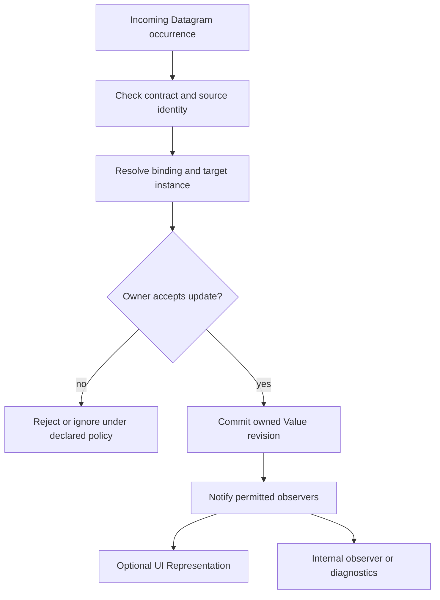
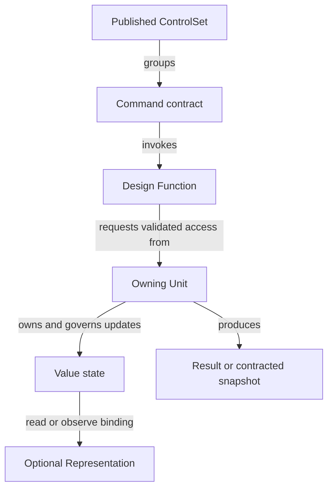
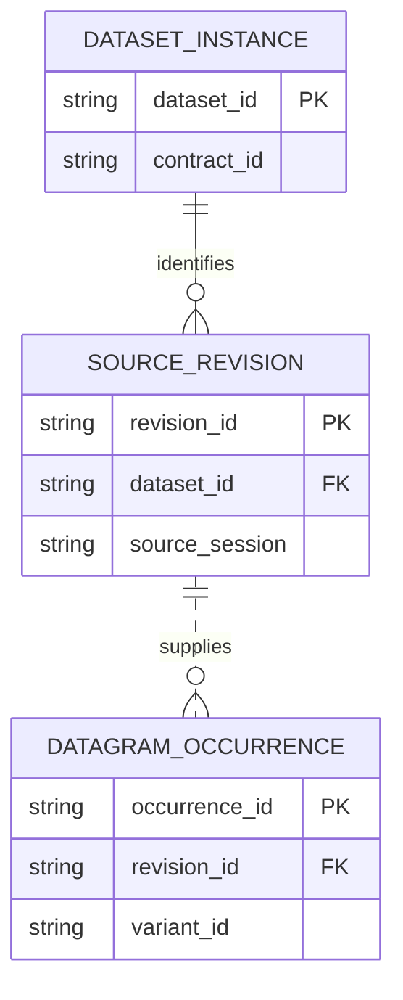
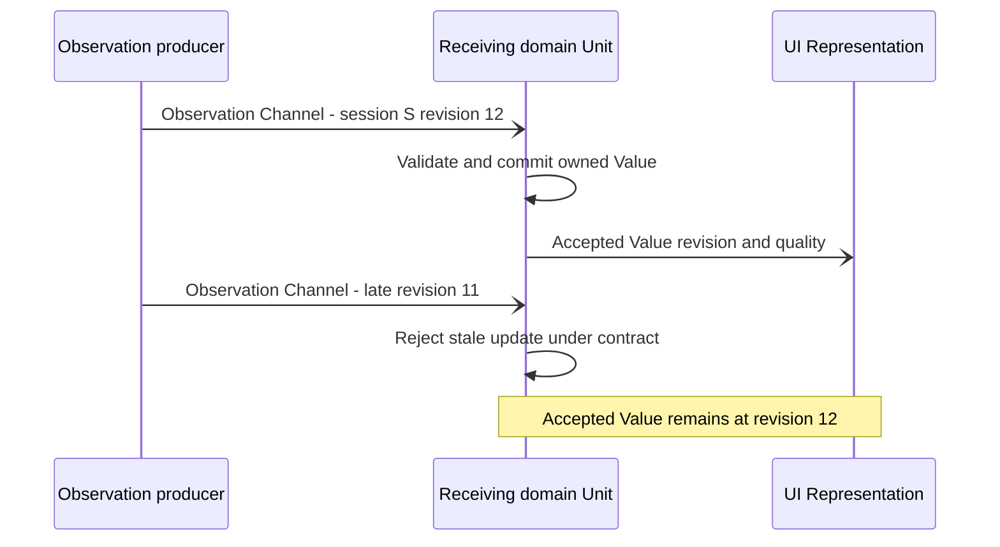
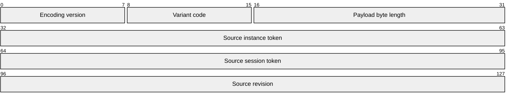

# Values, data and control

**Owner clarification, 2026-09-22:** Database is the general abstraction for where
persistent data can be retrieved on demand; it does not require SQL. A transient
cache alone is not a Database. Exact retention, availability, access and ownership
remain contract details. See [current viewpoint/status update](08-SDL-Viewpoints-and-Implementation-Status.md).
This clarifies the earlier retained-data wording below without claiming parser support.

Date: 2026-09-18  
Status: revised candidate model. Value placement and ControlSet membership are
being discussed, not retroactively adopted into the language.

## 1. Recommendation under discussion

Keep ControlSet focused on Commands. Treat Value as owned state that may be
internal, bound to an incoming Datagram, exposed through a projection, or observed
by a UI Representation.

This responds to the owner's concern about two authoritative copies. The earlier
Commands-and-Values ControlSet remains an evaluated alternative. The owner has
not declared this new recommendation final.

## 2. Distinguish the identities

| Concept | Role |
|---|---|
| Value definition | Named typed state with meaning, owner, lifetime, validity and permitted writers. |
| Value instance | That state in an identified runtime context, such as a machine session or stem. |
| Dataset | Logical data model/source grouping relevant data; it may be transient or retained. |
| Dataset entry | Identified internal item governed by that Dataset's contract. |
| Datagram family | Contracted transfer variants linked to a Dataset origin. |
| Datagram occurrence | One received/sent value with variant, provenance and correlation metadata. |
| Binding/routing rule | Selects relevant occurrences and maps their fields into owned state under validation rules. |
| Representation | UI-specific semantic object exposing a Value/projection and applicable interaction/quality behavior. |

A Value is not one incoming packet. Its lifetime can span many updates, and one
packet can update several Values. Several source variants may contribute to one
derived Value. A binding therefore needs more than “this Datagram name.”

Dataset membership or Value binding must not introduce another independent
authoritative copy. Exact Value-to-Dataset syntax is still open: it should state
whether the Value is a field access, owned state backed by a Dataset, or an
explicitly derived/cached projection. An internal counter need not be forced into
a public Dataset merely to exist.

## 3. Where Values live

A Unit owns the Value where its meaning, lifecycle and updates are decided.

- Machine-domain measurement truth belongs to the responsible machine-domain Unit.
- A UI-domain Unit may maintain a received projection of that truth, with source
  identity/revision and freshness. It does not become the remote authority.
- A UI Representation exposes that value or a declared view of it to UI mechanisms.
- Pure UI state, such as selection or an unsubmitted local edit, can legitimately
  belong to a UI Unit without a remote domain Value.
- An internal algorithm counter can stay in its owning Unit and have no Datagram
  or Representation at all.

“Domain” exists at different boundaries: Machine's domain authority and UI's
domain projection are not the same owner. Distinguish authority over a local
projection's bookkeeping from authority over the machine fact being projected.

Representation can wrap or bind a Value directly if that respects ownership and
the declared layer contract. A dedicated domain forwarding object is not mandatory
for every internal UI Value. Conversely, exposing a Representation does not move
arbitrary domain state into the generic UI library.

## 4. Receiving and routing

A candidate receive path is:

1. Validate Channel/participant and Datagram contract/version/variant.
2. Resolve source Dataset instance plus entity/session/revision identity.
3. Select the declared binding and apply type/unit/quality checks.
4. Let the responsible handler/reducer accept or reject the update.
5. Update the owned Value or coherent group of Values.
6. Notify permitted observers, including a Representation when one exists.

Routing is responsibility of a receiving Unit; a Channel does not magically
assign every matching field to a global variable. The binding must address:

- Target instance selection and creation/disposal.
- Missing, invalid, stale, duplicate and out-of-order values.
- Unit conversion and aggregation rules, where any are intended.
- Atomic grouping when several Values must represent one coherent snapshot.
- Authority, concurrency, source reset and lifetime.
- Unmatched variant/binding behavior and observability of rejection.

A source family/type alone cannot identify a specific Value instance when there
are multiple machines or stems. Equal Value names also do not imply shared state.

The receive flow below shows a domain projection with an optional UI observer.
Updating that projection does not transfer authority over the source fact.

## 5. Normal variable use with explicit semantics

The owner wants Values to be convenient in implementation, similar to ordinary
variables. A future binding can provide typed accessors, wrappers or generated
properties. It must preserve model semantics such as read-only state, validation,
revision changes and observation.

Do not require logging or network traffic on every local read. Do not permit a
convenient assignment to bypass the declared writer or remotely mutate another
Unit. Storage, synchronization and notification remain explicit implementation
bindings.

A diagnostic “list values” Command can inspect an explicit registry of modeled
Values and write to stdout through the console adapter. It does not enumerate
every compiler temporary or expose every private field by default. Specify scope,
identities, units, quality, snapshot consistency, access and bounded output.
The Command can be internal-only; external publication is a separate decision.

This retains the useful HEOS/HSX idea without equating Value registration with
public exposure or adopting their ABI/storage mechanisms.

## 6. Commands and ControlSets

Candidate distinction:

- **Command:** named invocable contract, potentially internal, with arguments,
  results, preconditions, effects, errors and lifecycle.
- **ControlSet:** a selected external/inter-layer command surface, under a common
  contract. A Command can exist without belonging to a published ControlSet.

ControlSet does not own domain Values. A query Command may return a Value snapshot
or a Datagram variant; that does not make the underlying Value a ControlSet member.
A mutation Command asks the owning Unit to validate and commit a change.
Its acceptance, committed effect and delivered result remain different events.

A Command is not every source function. Private helper functions can remain
implementation details. A registered internal Command exists when a designed
invocation/discovery contract is useful, such as diagnostics.

The proposed SDL Function adds another explicit distinction: it is a selected
design operation that helps realize a Functionality. A Command can invoke such
Functions, but a Function need not be registered or externally callable. Neither
term requires a one-to-one mapping to source-language functions.

In this candidate relation view, a ControlSet groups invocations; state remains
owned by a Unit. Internal Commands need not belong to a published ControlSet.

The no-Values interpretation still needs comparison against the earlier combined
surface. Do not keep both as equivalent canonical spellings if one is selected.
Migration must preserve read/observe/write access that a former Value member
represented; it cannot silently remove or expand public behavior.

## 7. Data access and connections retained from earlier work

Dataset-backed Datagrams and Command interactions can cross a contracted Channel.
Generated MessageSets enumerate allowed traffic per endpoint/role/mode. The
earlier source MessageSets have not yet been migrated.

Recommend one logical Channel concept across Containers and declared layer
boundaries. Internal execution may use calls or immutable references while
preserving the contract. This is still a naming/profile recommendation, not an
adopted rule that every local variable needs a message.

Database means an addressable retained data base with declared query/change
operations. Files and remote parameter access can realize it. Explicitly distinguish
access capability, retention across sessions/restarts and current availability.
A live-only source does not acquire query/replay merely because a receiver caches
the latest update. Full CRUD is optional and must match supported operations.

For P1000, physical protocol meaning and persistent/readable/writable regions
still need evidence. The new vocabulary authorizes no physical output or ownership
migration away from the existing Machine/Target split.

## 8. Pending language questions

Do not freeze grammar until these cases are worked:

1. A purely internal Value and internal diagnostic Command.
2. A Datagram-backed domain Value and two Representations observing it.
3. Multiple fields updated atomically, followed by a stale/duplicate message.
4. A UI-local draft changing before any domain mutation is accepted.
5. A read-only published observation plus a separate revision-checked Command.
6. Disposing one Representation while another still observes the same Value.

These will determine whether Value, binding and command exposure need new noun
types or can be expressed with existing contracts and realization facts.

## 9. Datagram identity, delivery and encoding views

This ER view is a candidate single-source publication example: each occurrence
refers to one source revision, and a revision can produce many occurrences.
It does not require persistent storage, a relational database, or a universal
single-source rule for derived publications. Composite provenance needs its own
contract. The identities below describe instances, not the global SDL metamodel.

The sequence view describes one delivery scenario over a Channel. The Channel
is named in messages, not introduced as an implicit processing thread. Delivery
and local acceptance are distinct; the second occurrence does not update the Value.
The transport path is abstracted here, without prescribing new direct connections
between deployed MVP1 Containers.

A packet view becomes useful after a concrete encoding is chosen. The following
is a deliberately invented 128-bit header sketch to exercise the diagram type,
not an adopted SDL transport, P1000 packet, StanForD record or complete contract.
It assigns sample widths only; byte order, identifier namespaces, payload schema,
presence semantics and version negotiation would still need a decision. Logical
Datagram contracts must remain usable with other encodings.

