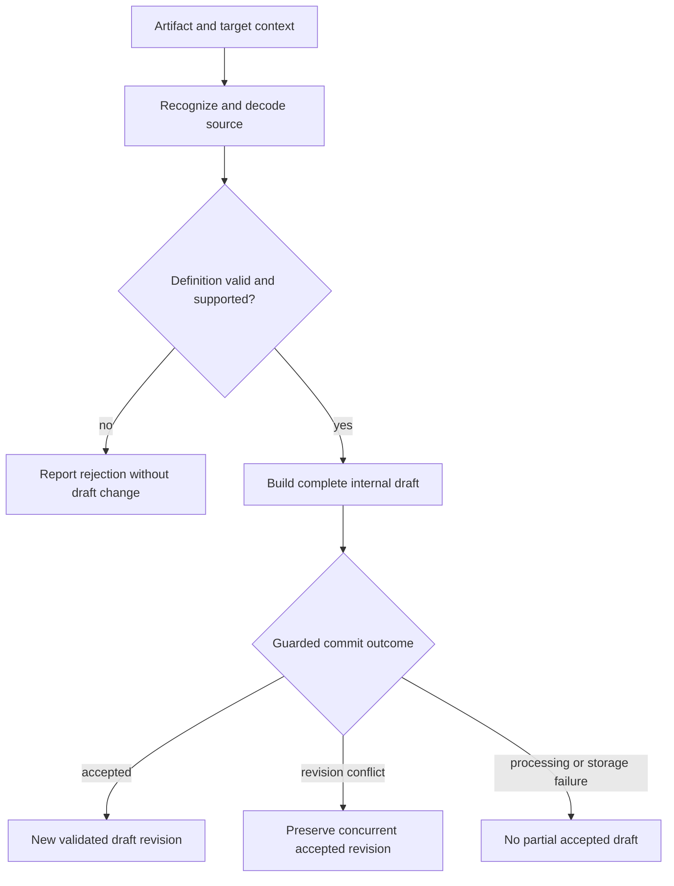
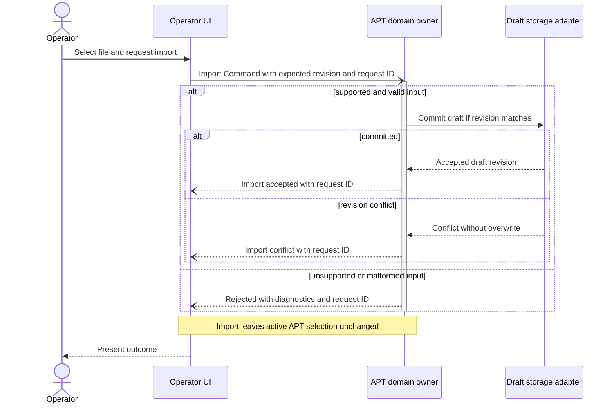
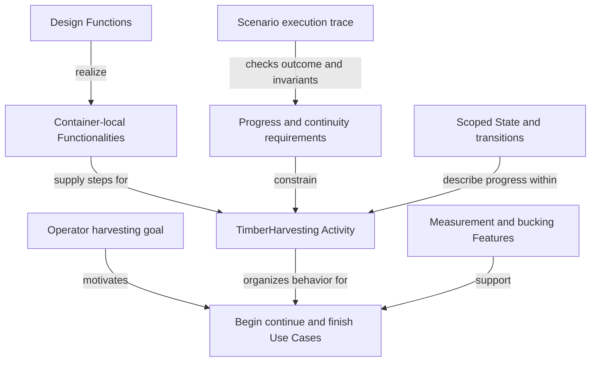

# Worked realization and change impact

Date: 2026-09-18  
Status: candidate checkpoint witness; no executable SDL conformance or completed
implementation is claimed.

## 1. Purpose and identity

Follow one behavior through all abstraction levels without replacing the user
goal with the names of code helpers. The example uses the selected MVP1 UI
direction and preserves Machine-domain measurement authority.

The CP1 identifiers below are local example identities, not registered project
Requirements or proof that the proposed Functionality revision has been adopted.
Relationship descriptions are model proposals, not accepted SDL source syntax.

## 2. A0: need and acceptance obligations

**CP1-UC-01 — Inspect a measurement:** the operator can read a measurement and
understand whether it is current enough for the intended decision.

Candidate obligations:

| ID | Obligation | Reason |
|---|---|---|
| CP1-R-01 | Displayed measurement meaning and unit are unambiguous. | A number alone is insufficient for interpretation. |
| CP1-R-02 | Stale, missing and valid zero remain distinguishable. | Disconnect or absence must not fabricate a measurement. |
| CP1-R-03 | Multiple views of the same semantic measurement agree on identity and accepted revision. | Different layouts must not imply different underlying facts. |
| CP1-R-04 | Replacing a Presentation preserves the live domain subscription and shared semantic state. | Presentation configuration should not reset the observed system. |

These illustrate how existing concerns become explicit obligations. They are not
newly accepted changes to product behavior or fresh observations of the running UI.

## 3. A1: functional intent

**CP1-FEAT-01 — Inspect live measurements** supports the Use Case.

As provisional functional contributions whose allocation is still pending:

- **CP1-FUNC-01:** maintain coherent measurement knowledge.
- **CP1-FUNC-02:** expose measurement currentness and availability.
- **CP1-FUNC-03:** present the same measurement in several compatible views.

They are stated before prescribing a process, renderer toolkit or transport.
The revised candidate keeps each allocated Functionality Container-local:
CP1-FUNC-01 maps to Machine's authoritative domain responsibility; CP1-FUNC-02
to operator-side quality/availability projection; CP1-FUNC-03 to UI presentation
responsibility. If finer study exposes a crossing, split the contributions and
retain their composed Feature realization. Early naming does not authorize
several independent owners of one completed Functionality.
Their combined realization can establish the capability to supply an interpretable
current measurement under stated input/availability conditions.

An abstract Scenario says: an observation becomes available; the system accepts
it under its contract; the operator sees the value and its quality. A disconnect
changes its currentness without inventing zero. That description does not yet
claim which Units perform the steps.

## 4. A2: system realization

Allocate concrete contributions while preserving the existing MVP1 split:

| Contribution | Candidate realization |
|---|---|
| Supply evidence-backed machine facts | MachineService handles decoded/calibrated domain observations from its Target boundary. |
| Adapt observations to an operator client | BuckingWeb maintains the Machine path independently of Bucking availability. |
| Maintain operator-side received knowledge | BuckingUI's domain projection accepts the contracted observation. |
| Present knowledge | UI runtime/presentation/renderer responsibilities, under the selected separation. |

SIM/PGW Target records and Machine semantic observations are different contracts.
Calling both “Datagram” does not move decoding/calibration into a transport gateway.
A simulated input remains distinguished from real machine evidence.

At this level identify source Dataset/family contracts, Channels and participant
roles. Schema and implementation details can be linked rather than flattened
into the Feature definition.

## 5. A3–A4: UI layers, Value and bindings

A candidate detailed allocation is:

| Element | Role and ownership |
|---|---|
| Measurement Datagram family | Public observation variants with source/session/revision identity, quantity and quality. |
| OperatorUiDomain | Owns acceptance of the operator-side projection and its local lifecycle. |
| CurrentLength Value | Typed domain projection, keyed by machine/stem context; accepted revision and quality retained. |
| Length Representation | UI semantic binding to CurrentLength; does not acquire remote measurement authority. |
| Composition | References the Representation in the active context. |
| Presentation | Selects valid views, binding layout and formatting. |
| Renderer | Materializes views and supplies actual display observations/intents. |

The Layer boundary contract governs domain-to-Representation access. It can
realize a read/observe binding without duplicating the authoritative local Value.
If deployment requires a transported copy, describe it explicitly as a projection
with identity/currentness rules. Do not pretend a network copy is the same object.

The concrete handling sequence refines the abstract observation step:

1. Validate envelope, known variant and participant permissions.
2. Resolve source session, entity and target Value instance.
3. Reject incompatible units/shape or stale sequence under the agreed policy.
4. Commit the accepted local Value/quality revision through its owning handler.
5. Notify its Representation and permitted diagnostic observers.
6. Materialize updates using the current Composition/Presentation.
7. Distinguish publication from actual rendered observation.

The model needs bindings for those operations before they execute. Merely naming
the sequence does not generate the decoder, converter or rendering implementation.

The data path and UI configuration meet at presentation. The Composition arrows
describe bindings and context, not an additional owner of measurement state.

```mermaid
flowchart TD
    Source[Machine observation] --> Receive[UI domain validates and accepts]
    Receive --> Value[CurrentLength projection]
    Value -->|observed through| Rep[Length Representation]
    Comp[Composition] -->|selects and binds| Rep
    Comp -->|supplies context| Pres[Presentation]
    Rep -->|value and quality| Pres
    Pres -->|view and updates| Render[Renderer]
    Render --> Display[Actual displayed observation]
```

## 6. Internal Values and Commands without UI or network exposure

Suppose the receiving handler tracks a bounded diagnostic counter of rejected
stale updates. It can be an internal Value owned by the receiving Unit, with
no incoming Datagram binding and no Representation.

An internal ListValues Command can enumerate registered Values in that context,
including CurrentLength and the diagnostic counter, and write a contracted
snapshot to stdout through the console adapter. Its existence does not create
a public ControlSet or expose all memory.

If later published for a diagnostic client, that is an explicit exposure change
with scope/access/output contracts. A ControlSet can list the Command while the
Values stay owned in their respective Units.

## 7. Scenario outcomes that must remain distinct

| Trigger/path | Required design distinction |
|---|---|
| Valid new observation | Accepted Value revision and UI notification. |
| Same occurrence delivered twice | Duplicate handling under the contract, not an extra measurement. |
| Old source revision arrives late | Does not overwrite current accepted state. |
| Source session resets | Re-establish identity/baseline; do not compare unrelated revision domains as one counter. |
| Invalid unit or payload | Explicit rejection/diagnostic; no fabricated optional absence. |
| Disconnect | Currentness changes; retained value is labeled according to policy. |
| Presentation replaced | Shared Value/Representation and subscription survive where required. |
| Renderer fails after publication | Published state and displayed state differ; no implied domain rollback. |
| One of two views is disposed | The other retains its valid shared binding. |
| Value-list snapshot races with an update | The declared snapshot/coherence policy determines the result. |

These are acceptance cases to implement later, not results of executed tests.

## 8. A5: binding and evidence

Existing UI store/session/command mechanisms are partial reuse evidence, not a
complete implementation of this new Value model. The previous
[exercise bindings](../../../experiments/mvp1_sdl/SDL/MVP1/Governance/Bindings.design)
identify inspected mechanisms and missing realization.

A complete binding would identify the model operation, source repository/revision
and symbol, relevant adapter/runtime contract, and evidence for the preserved
obligations. A generated IR handler would require the same traceability.

Separate evidence layers:

- Structural validation: identities, relation types and allocated responsibility.
- Contract tests: variant/instance/revision/units and invalid input.
- Behavioral runs: stale/duplicate/disconnect and presentation races.
- Real renderer observations: actual viewport/content/currentness behavior.
- Implementation bindings: exact code realizing the tested model revision.

A headless witness does not prove actual pixels or layout, and a source function
with a suggestive name does not prove the abstract responsibility.

## 9. Change-impact exercise

Consider changing how length is represented in the public observation contract.
Before implementation, trace the affected graph:

| Direction | Questions |
|---|---|
| Up to intent | Do the quantity, precision or user interpretation change? Which acceptance obligations remain invariant? |
| Across the boundary | Which family variants, consumers and contract versions are affected? |
| Into local state | Does the binding convert units once, select the correct instance and retain provenance? |
| Into UI | Do Representation semantics and Presentation formatting agree? Are two views still consistent? |
| Into diagnostics | Do exported/listed Values include the correct units and revision? |
| Down to realization | Which decoder, projection, handler and renderer bindings need changes or evidence? |

An unchanged Feature can retain identity while its realization changes. A changed
product meaning must be recorded as such. Source impact is only as complete as
the maintained bindings; static links cannot prove absence of unmodeled callers.

When this exercise exposes a missing obligation, record its reason and disposition
in SDP, then link it into SDL. Do not add arbitrary new product requirements merely
to make one implementation easier.

## 10. APT witness: Feature, Functionality and Function

This second witness tests the owner's APT example. All CP1-APT identities and
allocations below are discussion candidates, not additions to approved MVP1
requirements. “Newer StanForD” does not select an exact version, schema or supported
subset; those must be established before claiming format compatibility.

An optional User Story is: as an operator, I want to use supplied price matrices
from either supported format so that bucking can use the intended price basis.
Relevant Use Cases include importing a definition, selecting a usable price basis
and calculating bucking alternatives. These Use Cases remain meaningful without
the Story and can participate in other Features.

| Concept | Example | Boundary |
|---|---|---|
| Feature | Bucking using price matrices loadable from supported Classic and newer StanForD formats. | Observable system ability requiring several collaborating responsibilities. |
| Functionality | Import an APT definition into a validated internal draft. | One accountable local responsibility; does not itself activate that draft or calculate a bucking solution. |
| Function | RecognizeSourceFormat, DecodeSource, ValidateDefinition, BuildDraft, CommitDraft. | Selected design operations whose composition realizes import; not prescribed C++ signatures. |

The requirement discussion can identify the import responsibility before assigning
its owner. A candidate design allocation is the AptDomain Unit within the Bucking
Container. An upload UI and a transport adapter participate in the end-to-end Use
Case but have their own local responsibilities. Their existence does not give the
import Functionality several owners.

### 10.1 Contract before code

The import contract identifies the input artifact and supported-format policy,
request context, target draft identity and expected revision. Admission conditions
include a valid target context and any declared access/resource constraints.
Malformed content is an outcome to handle, not a precondition that excludes an
important failure path from the design.

| Outcome | Required postcondition / permitted effects |
|---|---|
| Accepted | A complete validated draft revision is committed with source identity, format lineage and defined presence semantics for absent fields. |
| Unsupported or malformed source | No partial domain draft is committed; the previous accepted draft remains intact. A diagnostic/result may be produced. |
| Revision conflict | A concurrent accepted revision is not overwritten; report conflict under the chosen retry policy. |
| Storage or processing failure | No partially accepted draft is exposed; define cleanup and diagnostic effects explicitly. |

For every outcome, importing alone leaves the active APT selection and machine
operating state unchanged. This is a frame condition: it describes what this
operation is not permitted to change, while allowing declared diagnostic updates.
If another actor can change active selection concurrently, the guarantee concerns
effects attributable to import, not an assertion that the entire system freezes.

RecognizeSourceFormat can compute without mutating domain state. DecodeSource and
BuildDraft can produce intermediate results. ValidateDefinition establishes the
conditions required for acceptance. CommitDraft performs the guarded state change.
The design must check the expected revision at commitment, not merely on entry.
Alternative decompositions remain possible if they preserve these obligations.

The Functionality owns the overall behavioral contract; each Function has the
input/result, conditions and effects needed to justify its contribution. An
Activity describes sequencing, branching and failure handling. Matching the names
or counting Functions does not establish that the composed behavior is correct.

This flow expands the import Functionality into selected Functions and outcomes.
The commitment gate includes the revision check and atomic acceptance: a failed
commit must not expose a partial draft. Active APT selection is outside this flow.

### 10.2 Traceable acceptance and design completion

This interaction view complements the internal import flow. Command/reply paths
are logical contracted interactions, not a new deployment topology. The revision
check belongs to atomic commitment; a prior read alone cannot prevent overwrite.
The activation marker is a sequence notation for processing, unrelated to APT
activation.

Storage/processing failure remains a required outcome in Section 10.1; this
selected sequence does not claim to cover every path.

| Example requirement | Design responsibility | Future verification obligation |
|---|---|---|
| CP1-APT-R01: accept both explicitly supported source formats | Import contract, format recognition and decoding | Fixtures for each selected version/subset; the newer-format corpus is still to be identified. |
| CP1-APT-R02: preserve price-matrix meaning | Validation and normalization contracts | Check units, axes, identity and absence semantics against independent expected values. |
| CP1-APT-R03: reject invalid input without partial acceptance | Failure branches and commitment boundary | Malformed and incomplete inputs leave the accepted draft intact. |
| CP1-APT-R04: import does not activate | Frame condition and separate activation responsibility | Active selection is unchanged by successful and failed import. |
| CP1-APT-R05: do not overwrite concurrent accepted work | Revision guard and conflict outcome | Interleaved requests expose a conflict rather than lose an accepted revision. |

These are proposed verification cases, not executed tests. The Feature additionally
requires a justified path from an accepted definition through explicit selection
to the matrix consumed by the bucking calculation. Import coverage alone cannot
establish Feature coverage.

At design completion, each in-scope requirement needs a defensible realization,
compatible contracts, relevant normal/alternative paths and a verification method.
Unresolved version choices and behavioral gaps remain visible blockers for the
affected claims. Quality constraints may require architectural analysis as well
as Function contracts. Implementation evidence must later demonstrate that the
code preserves this design; design review does not prove future code compliance.

## 11. Sustained Activity witness: timber harvesting

**TimberHarvesting** means the owner's forestry activity “logging,” not diagnostic
log recording. This is an abstract software-model witness, not a definition of
machine control, an assertion about P1000 behavior or an executable operating plan.
Its proposed lifecycle follows [the Activity discussion](02-SDL-Model-and-Abstraction-Levels.md).

One instance can cover repeated work on timber within an identified work context.
A candidate iteration boundary is accepting the result for one work item; the
exact product boundary remains to be decided. Completion of that iteration does
not automatically complete the sustained Activity.

| Concern | Candidate harvesting interpretation |
|---|---|
| User intent | Carry out harvesting while retaining coherent progress and an interpretable view of the current work. |
| Use Cases | Begin work, inspect current work, interrupt and continue work, finish the activity. These are illustrative, not newly approved requirements. |
| Features used | Live measurement inspection, price-based bucking and progress visibility as applicable to the chosen scope. |
| Relevant State | Activity instance/lifecycle, work context, current work item, accepted results, source identities and revisions. |
| Iteration progress | An accepted work result under its contract; returning to Ready is not equivalent to doing no work. |
| Suspension | Preserve accepted progress and a declared continuation point; identify pending results and effects. |
| Resume | Check that the retained work context still matches current knowledge; continue the same instance or report why continuation is unavailable. |
| Completion | Reconcile outstanding work under the selected policy and establish the finish postcondition; retain accepted results. |
| New start | Establish a new instance and initial workflow conditions while preserving domain records that outlive the previous instance. |

This is a relationship view, not a call graph or mandatory hierarchy. The Activity
coordinates behavior using local responsibilities; it does not take ownership of
all their state. Other Use Cases and Activities may reuse those responsibilities.

Work at least these paths before promoting the lifecycle into general grammar:

1. Several successful iterations, each preserving earlier accepted results.
2. Interruption before the first completed iteration, without fabricated progress.
3. Suspension after a request whose result is still outstanding; reconcile its
   eventual outcome before retrying an effect.
4. Resume with unchanged context, and a repeated resume request that must not
   create a second execution of the same continuation.
5. Resume after source/session or work-context change; explicitly reject or
   reconcile according to a reviewed policy rather than restoring stale facts.
6. Completion followed by a fresh start with a new identity and retained history.
7. An unrelated Activity starts; its compatibility/resource contract determines
   whether harvesting continues, suspends or terminates.

No cases above have been executed. Open product decisions include the precise
iteration boundary, permitted interruption points, handling of partial work and
authority to request continuation. A UI resume operation cannot by itself
authorize physical machine resumption.
