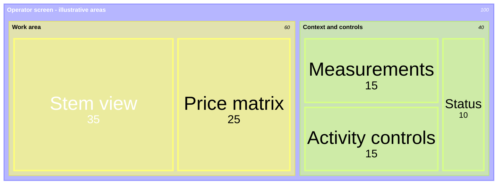
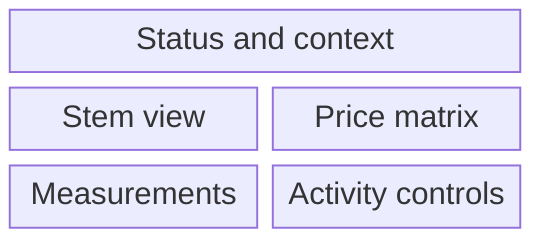
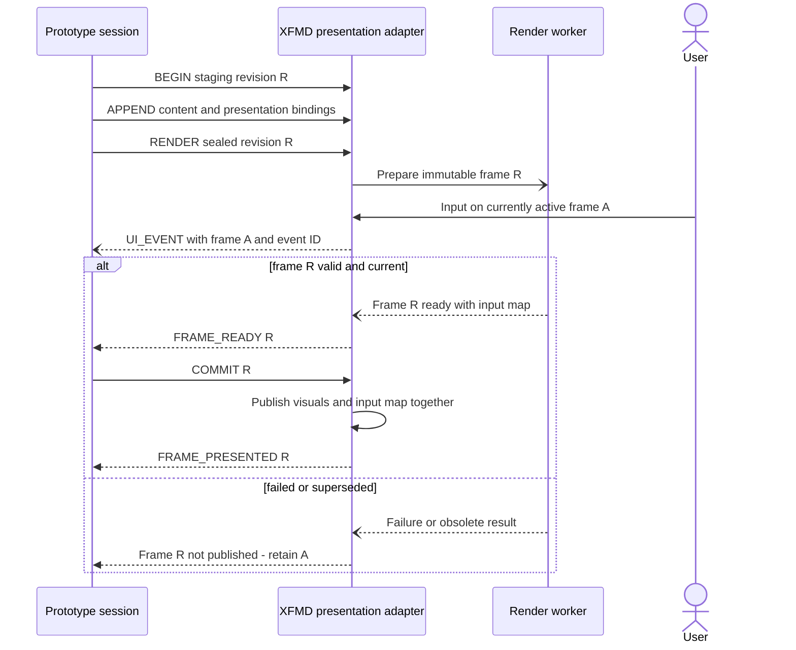

# Interactive SDL prototype and renderer study

**Avløst implementasjonsretning 2026-09-21:** Go/Fyne og selvstendig SVG-eksport
er første løp, se [tillegg 07](07-SDUI-0.2-and-Go-Direction.md). XFMD-/renderer-
studien nedenfor er historisk grunnlag, ikke et aktivt integrasjonsoppdrag.

Date: 2026-09-18  
Status: owner-proposed direction and candidate design, not an implemented runtime,
accepted protocol, new Mermaid dialect or adopted MVP1 layout.

## 1. Purpose and inspected support

Make a bounded design scenario visible and interactive before every part of the
system is implemented. A sequencer supplies declared simulated behavior, an SDL
execution slice owns modeled state, and a renderer exposes the proposed user
interaction. Gradually replace simulated contributions with real implementations
under the same boundary contracts.

The inspected XFMD checkout is `4e21e99`. Its
[coverage matrix](../../../../xfmd/mermaid_coverage.md) documents 23 diagram families
through bounded syntax profiles. The accompanying gallery is actually named
[mermaid_evicence.md](../../../../xfmd/mermaid_evicence.md). Both were read, together
with the sequence and semantic authoring guides. Their claims distinguish parser,
model, layout, preview and vector PDF support from full Mermaid compatibility.
They do not describe interactive widgets, nested diagrams inside treemap leaves
or a remote presentation protocol as implemented features.

Checkpoint examples use supported subsets of flowchart, sequence, state, class,
requirement, ER, packet, block and treemap. Rendering checks establish presentation
compatibility only; they do not execute the depicted system or validate SDL semantics.

Authoring verification, 2026-09-18: all 22 Mermaid blocks in the seven checkpoint
Markdown files produced SVG scenes through the existing XFMD build using
`DiagramServices::interpreter` and `DiagramServices::prepare`. New diagram types
were rasterized from those SVGs for visual inspection. The combined Activity
state graph exposed a non-orthogonal-edge layout error; two smaller lifecycle
views render while retaining the prose contracts. This is not a fresh GUI/PDF
acceptance run. The four inspected renderer documents have fingerprints in the
additive renderer-source section of [source-index.json](source-index.json).

## 2. Treemap is a useful sketch, not a widget host

Standard Mermaid treemap describes a hierarchy of labelled rectangles whose
areas represent weights. Its documented node syntax supplies parent labels and
weighted leaves; it does not supply a child Mermaid document or interactive
widget body. Consequently, arbitrary diagrams cannot simply be placed inside
treemap cells using standard syntax. [Mermaid treemap documentation](https://mermaid.js.org/syntax/treemap.html).

A custom renderer could compose independently rendered diagrams and controls
inside allocated regions. That is an additional presentation contract and
implementation, not an existing treemap capability. Keep that extension explicitly
named and versioned rather than silently changing the meaning of `treemap-beta`.

This example explores a possible hierarchy and rough area budget for an operator
screen. Weights are invented relative proportions, not pixels, measured usage,
approved BoxUI geometry or runtime Values. A changing measurement must not
accidentally resize its control by becoming a treemap weight.

For a coarse positional sketch, a block diagram expresses explicit columns and
spans more directly. This alternative is also illustrative; XFMD's current block
profile has no nested blocks, and neither diagram defines min/max sizing, focus,
input handling or responsive behavior.

Before declaring an MVP1 layout, inspect the actual BOX/BoxUI contracts and
viewport obligations. The existing [MVP1 design reconciliation](../../../docs/process/MVP1-Design-Evolution-and-SDP-Skills.md)
is the local source used here; this study does not claim a fresh inspection of
the current MVP1 implementation. Preserve its separation of schema, live values,
command lifecycle and stable view identity.

## 3. A presentation tree with reusable widgets

Recommend a small SDL Presentation profile describing a tree of layout regions
and widget instances. One canonical tree can produce a static documentation
view, an XFMD prototype and eventually a production-renderer binding. Mermaid
is one possible diagram content type and generated view of the model.

| Part | Minimum declared information |
|---|---|
| Layout region | Stable identity, children, row/column/grid or other policy, sizing constraints, spacing, clipping and overflow behavior. |
| Widget definition | Kind/version, value and event types, rendering states, interaction semantics, accessibility role and sizing requirements. |
| Widget instance | Stable identity, definition reference, local interaction state and explicit bindings. |
| Value binding | Representation/projection identity, instance context, units, validity and currentness. |
| Command binding | Typed intent, argument mapping, availability and result/error presentation. |
| Diagram content | Referenced Mermaid source/model revision, allocated bounds, scaling and clipping rules. |

Start with a read-only value, a button, an input field and a diagram pane. A button
emits intent; it does not mutate remote state. A text input owns an unsubmitted
edit until its explicit commit policy emits an intent. Repainting must preserve
focus, selection, caret and draft text for retained widget identities.

Keep the selected UI responsibilities: domain state supplies Representations;
Composition selects shared instances and context; Presentation specifies views
and bindings; Renderer materializes them and returns typed input. A widget library
must not acquire Ponsse domain ownership merely because the prototype is convenient.
Diagram pixels alone cannot provide text editing, keyboard navigation or semantic
hit testing: those require renderer/widget support or an integrated control layer.

No concrete `sdl-ui` syntax is adopted here. First work the tree, bindings and
positive/negative cases; then define a versioned profile or schema with one
canonical meaning for each fact.

## 4. Sequence files and a partial interpreter

A Mermaid sequence diagram documents interactions; it does not execute them.
A proposed `sequence_file` is an executable scenario description referencing
SDL identities and contracts. Its exact name, serialization and grammar remain
open. Generating a Mermaid view from it can avoid hand-maintained duplicate flows.

Separate three roles, even if a first prototype hosts them in one process:

- **Scenario driver:** supplies external stimuli and waits for declared events.
- **Simulated participant:** implements a named missing contribution under a
  boundary contract, with explicit state and alternative outcomes.
- **Oracle:** checks independently specified requirements and observed outcomes.

Do not let a script that draws “success” also serve as the sole proof of success.
Record which Functions, Channels and adapters are interpreted, native, simulated
or missing. A partial execution slice may proceed with declared doubles, but
unbound behavior must not silently succeed.

The execution contract needs initial state/fixtures, typed send/receive, input
matching, guards, state transitions, assertions, bounded waiting, timeouts and
outcome handling. Use a controlled clock and record scheduling choices for replay.
An expectation cannot assume an arbitrary delay establishes completion. Activity
suspend/resume and fresh-start identity follow the [Activity contract](02-SDL-Model-and-Abstraction-Levels.md#9-activity-state-and-sustained-work).

One feature can have several scenario files sharing fixtures and participant
models. Avoid duplicating a slightly different mock Container for every Feature;
shared behavior must preserve one contract as scenarios accumulate.

## 5. Proposed renderer connection and staged publication

The owner's shadow-buffer idea fits a renderer adapter. It needs separate
**staging content**, **prepared frame** and **active frame** states, so incomplete
input or failed rendering never replaces the current presentation.

TCP is a possible transport. It supplies a byte stream, so the application still
needs explicit message framing, version negotiation, size limits and incomplete
message handling. The first local prototype can use framed messages over loopback
or an in-process adapter; no port or wire encoding is selected here. Markdown is
a payload type, not a source of transport commands.

| Proposed operation | Contract intent |
|---|---|
| BEGIN / CLEAR staging | Create or reset a named staging transaction; do not clear the active display. |
| APPEND / SET content | Add bounded Markdown and referenced presentation data with ordering and transaction identity. |
| RENDER | Seal an immutable content revision and prepare layout, visuals, input regions and bindings for an identified viewport. |
| FRAME_READY / RENDER_FAILED | Report readiness or an explicit error for that exact revision; keep the old active frame on failure. |
| COMMIT frame | Validate session/revision and atomically publish the prepared frame with its input map and bindings. |
| FRAME_PRESENTED | Acknowledge the frame actually accepted for display, separately from successful parsing or preparation. |
| UI_EVENT | Return widget identity, typed event/value, event ID, session and the active frame/binding revision that produced it. |
| ABORT / RESYNC | Discard an obsolete transaction or establish an explicit session baseline. |

These operation names are explanatory protocol candidates, not implemented
commands or SDL keywords. An application frame swap is not a claim of synchronized
physical display scan-out. Viewport changes can invalidate a prepared layout and
must trigger revalidation or another render before publication.

Input is correlated with the frame visible when captured, not whichever frame
is newest when delivered. A replaced widget or changed binding needs an explicit
reject/reconcile policy. Preserve command identity across timeout and reconnect;
do not silently replay a non-idempotent action or treat a missing reply as failure.

Use bounded queues and a declared backpressure policy. Replaceable presentation
updates may be coalesced; user Commands and required results must not disappear
under that policy. Schema replacement should be occasional: live value updates
should preserve retained controls and narrow subscriptions where possible.
Clear-staging and frame-swap must not reset the interpreter's domain state.

The connection is a renderer port, not a substitute for every domain Channel.
Keep explicit authority for incoming events and stream sessions. The first pilot
uses synthetic/offline inputs only; no machine or serial-output adapter is implied.

## 6. First bounded vertical prototype

Choose the Activity suspension witness, with synthetic measurement updates:

1. Render an Activity status, a measurement Value, a work-context input field and
   Suspend/Resume controls, all with stable identities.
2. A shared simulated participant publishes a contracted observation; the real
   projection/binding path updates the display.
3. Suspend preserves the same Activity instance and accepted progress.
4. Change source context during suspension and attempt Resume; exercise the
   declared rejection/reconciliation path instead of unconditionally reporting success.
5. Prepare a new presentation while receiving input on the old frame. Check event
   attribution, retained input draft/focus, and atomic publication.
6. Exercise invalid input, stale/duplicate messages, render failure, disconnect
   and restart with explicit outcomes and reproducible traces.

Build in increments: static layout/widget contract; in-process interactive slice;
scenario replay and assertions; then staged stream transport if separation helps.
This allows testing the UI and behavior contracts before adding network lifecycle
complexity. Each increment needs a usable end-to-end witness.

## 7. What early verification can establish

| Evidence | Supported claim | Remaining limitation |
|---|---|---|
| Mermaid rendering | A supported diagram is readable in the selected XFMD path. | No executed domain behavior. |
| Scripted demonstration | A designed interaction can be presented and explored. | A scripted success is not independent requirement verification. |
| Contracted simulation plus assertions | The modeled slice meets checked obligations under declared fixtures, doubles and schedules. | Unimplemented behavior and untested interleavings remain open. |
| Interactive renderer witness | Controls, viewport behavior and event bindings work in the prototype renderer. | Production-toolkit behavior, timing and deployment remain unverified. |
| Real implementation under the same contracts | Additional implementation evidence for the tested revision. | Physical machine suitability and broad correctness are separate claims. |

Every result should identify requirement/scenario, model revision, binding versions,
initial fixtures, simulated participants, input/clock trace, assertions and gaps.
The prototype should expose missing contracts and awkward interactions early;
it must also show what was simulated so persuasive visuals do not hide missing design.

## 8. Next decisions

Resolve the widget/schema boundary and one scenario before expanding the general
SDL grammar. Compare reuse of existing BOX/BoxUI contracts with a small generic
prototype adapter. Decide which widget state survives schema replacement, the
minimal executable scenario operations, and how input/result identity is retained.

Then define and test the staged publication protocol against failed, superseded
and resized frames. Embedding a rendered diagram in a widget region can be an
ordinary content capability; it need not require arbitrary Mermaid-in-Mermaid
syntax. A treemap may remain an optional layout experiment once its limitations
are explicit, rather than becoming the only layout engine.

No XFMD source, network listener, SDL interpreter or production UI is changed by
this study. It extends the existing [executable IR direction](../../../SDL/docs/studies/SDL-Executable-IR-and-Runtime-Study.md)
and preserves the [selected MVP1 UI responsibilities](../../../SDL/docs/studies/MVP1-Design-Language-Example.md).
