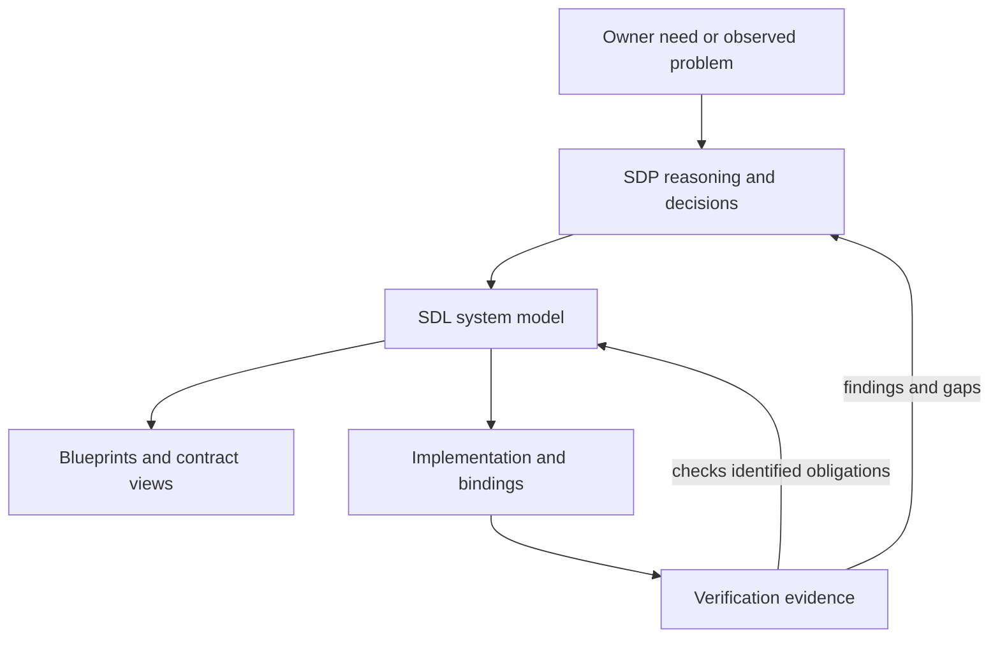

# Checkpoint #1 — SDP, SystemDesignLanguage and SDUI

**Location/status after R1, 2026-09-24:** a dated shared SDP/SDL/SDUI snapshot.
Use the [current documentation map](../../../docs/README.md) or
[SDL profiles](../../../SDL/docs/README.md) for active entry points. Addendum 11 is
this series' latest implementation snapshot. Older sections retain earlier status
and broader candidates. Source-index preserves original paths/fingerprints;
[R1 migration map](../../Maintenance/R1/Migration-map.json) records moves, not new
verification of historical claims.

**Implementation snapshot:** [11 — Go, runtime and navigation](11-Go-Implementation-and-Navigation.md)
collects delivered G phases, cleanup and actual tests. [10 — navigation](10-SDL-Viewpoint-Navigation.md),
[09 — generated Go design](09-SDL-Generated-Go-Design-Review.md),
[08 — viewpoints](08-SDL-Viewpoints-and-Implementation-Status.md) and
[07 — Go direction](07-SDUI-0.2-and-Go-Direction.md) retain design/V-phase foundations.
Documents 01–06 retain the September 18 discussion. Implementation of bounded profiles
does not adopt the broader candidate rules.

Active Go profiles: SDL design-core 0.5, action-core 0.1, class-core 0.1 and SDUI 0.2.
[SDUI code](../../../SDUI/go/README.md) · [SDL code](../../../SDL/go/README.md).
G1–G6 are delivered; Go exports models, viewpoints and selected UI/state. Retired
Python entry points are removed. Original checkpoint: 2026-09-18; updated 2026-09-22.

Status: consolidated discussion checkpoint, not an approved language release.

This checkpoint brings the system-wide view back into focus after the detailed
Container, Channel and data-contract exercises. **SDP** is the working name
**System Development Process** for the new concept; **SDL** is now named
**SystemDesignLanguage**, used to describe the system across abstraction levels.
“System Description Language” below records the earlier working name.

The existing Toolkit still implements Standard Document Procedure. This checkpoint
does not rename or migrate its manifests, skills, lifecycle rules or consuming
projects. It also does not promote every idea in the conversation into a decision.

## Read in this order

| Document | Purpose and boundary |
|---|---|
| [01 — System Development Process](01-System-Development-Process.md) | How a short owner prompt becomes studied intent, layered design, implementation and evidence; how discoveries change the model. |
| [02 — SDL model and abstraction levels](02-SDL-Model-and-Abstraction-Levels.md) | Shared vocabulary, Functionality/Function candidates, Activity lifecycle, State and behavioral contracts. |
| [03 — Values, data and control](03-Values-Data-and-Control.md) | Value ownership/routing, Dataset/Datagram/Database, ControlSet alternatives and UI Representation boundaries. |
| [04 — Worked realization and change impact](04-Worked-Realization-and-Change-Impact.md) | Measurement flow, APT import and a sustained timber-harvesting Activity, linked to state, obligations and realization. |
| [05 — Decisions, sources and next work](05-Decisions-Sources-and-Next-Work.md) | Authority/status register, reconciliation with older studies, tool limits and bounded next experiments. |
| [06 — Interactive prototype and renderer study](06-Interactive-Prototype-and-Renderer-Study.md) | Treemap versus UI layout, widget contracts, scenario sequencing and a proposed staged renderer connection. |
| [07 — SDUI 0.2 and Go direction](07-SDUI-0.2-and-Go-Direction.md) | Current implementation status, selected Go/Fyne direction, reload boundaries and next deliverables. |
| [08 — SDL viewpoints and implementation status](08-SDL-Viewpoints-and-Implementation-Status.md) | Viewpoint catalogue, generated views, gaps against checkpoint #1 and persistent Database meaning. |
| [09 — Generated Go design review](09-SDL-Generated-Go-Design-Review.md) | V2–V4 delivery, generated G1–G5 plan, verification and remaining design boundaries. |
| [10 — Viewpoint navigation](10-SDL-Viewpoint-Navigation.md) | Planned G6 navigator/overview, A0–A5, notation, on-demand projection and XFMD panel/IPC handoff. |
| [11 — Go implementation](11-Go-Implementation-and-Navigation.md) | Implemented profiles, G1–G6 evidence, native navigation and explicit limits. |
| [Source fingerprint index](source-index.json) | Content hashes of the local source documents used for consolidation; provenance, not implementation proof. |

## The whole picture

SDP describes the engineering work: understand the need, state obligations,
develop and compare designs, bind implementations, gather evidence and maintain
the result. SDL describes the connected system facts produced by that work.
A generated diagram, catalog or report is a view of those facts.

These diagrams are manually authored explanatory views of this discussion
checkpoint, not compiler-generated or executable SDL. Arrow labels describe the
relation in each view; an unlabelled arrow follows that view's stated flow.
Candidate concepts retain their candidate status when drawn. Diagrams now use
XFMD's documented flowchart, sequence, state, class, requirement, ER, packet,
block and treemap profiles, without HTML or custom styles. Their support and
prototype boundaries are recorded in [the renderer study](06-Interactive-Prototype-and-Renderer-Study.md).

There are two different axes:

- **Abstraction levels:** need → functional intent → system architecture →
  Container internals → Unit behavior → implementation/execution binding.
- **Horizontal software layers:** for example Domain, Representation, Composition,
  Presentation and Renderer inside a chosen architecture.

A more detailed description is not necessarily a different runtime layer. A
Feature can span many Containers; a Container can realize many Features. The
design is a graph of linked obligations and realizations, not one folder tree.

## Interpretation rules

| Label | Meaning here |
|---|---|
| Established direction | Explicit prior owner selection or repeatedly accepted intent; detailed grammar can still be unfinished. |
| Existing implementation | A bounded artifact exists, with its actual scope stated. |
| Candidate | A recommendation or owner exploration needing evaluation; not an adopted rule. |
| Open | A material choice or missing semantic detail. |
| Historical | Earlier reasoning or a baseline whose meaning must not be silently reinterpreted. |

Use this checkpoint as the current **discussion entry point**. Use
[the language definition](../../../SDL/docs/studies/Design-Language-Definition.md) and
[parser documentation](../../../experiments/design_core/README.md) to determine what
the implemented core actually accepts. A checkpoint recommendation cannot change
a parser type or satisfy a missing executable contract.

The ControlSet-without-Values direction and Function/Functionality refinements
are **candidates**. The latest APT example favors retaining Container-local
Functionality while deferring allocation in early intent work, and introduces
Function for selected detailed-design operations. This reconsiders the initial
checkpoint's broader cross-Container Functionality recommendation. The older
ControlSet-with-Values proposal and core ownership rules remain comparison and
implementation evidence, not parallel canonical dialects.

## What this checkpoint does not claim

The 66-file MVP1 exercise provides broad responsibility/requirement coverage.
Its recorded audit does not establish executable completeness or design correctness.
The small structural parser does not support the complete exercise or this
checkpoint vocabulary. No compiler/interpreter, product migration, installed
skill change, hardware action or new accepted MVP1 architecture is created here.

Checkpoint numbers identify consolidation snapshots, not language versions,
releases, Sprints or abstraction levels. Corrections should identify their reason;
a subsequent checkpoint can record a new coherent position rather than silently
rewrite the historical meaning of this one.
