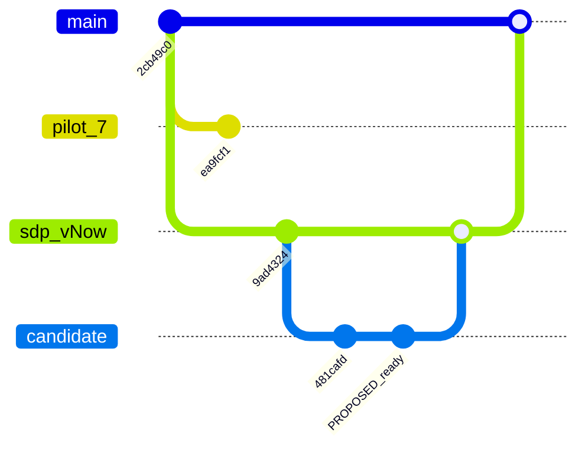

# Merge preparation — observed repository state

Snapshot candidate: 481cafdc0279d2b28781ccaef08112de3312818c. This inventory precedes the planning commit and any future readiness fixes. Refresh it before selecting the merge candidate.

## Observed ancestry and proposed integration

The graph condenses the observed history to its relevant endpoints. Intermediate
commits and phase branches are omitted; each line between observed commits means
ancestry, not necessarily a direct parent relationship. The PROPOSED_ready node
and the two merge circles following it are placeholders, not existing commits
or completed verification. XFMD supplies synthetic labels such as __merge0 for
merge nodes; these are diagram identifiers, not Git commit hashes.

The block uses XFMD's supported Git graph subset: a plain gitGraph header,
explicit commit IDs, branches, checkouts and bare merges. The branch aliases
sdp_vNow and pilot_7 avoid unsupported hyphens. The old tag is documented in the
table because this viewer does not support tag attributes or init directives.



| Graph element | Meaning |
| --- | --- |
| main / old at 2cb49c0 | Observed main and the preserved archive tag |
| sdp_vNow at 9ad4324 | Alias for the observed sdp-vNow staging target, before any proposed merge |
| candidate at 481cafd | Initial combined stack; the subsequent planning and readiness work will extend it on sdp/maintenance-mp1-main-integration |
| pilot_7 at ea9fcf1 | Abbreviation for codex/issue-7-provisional-vnext-pilot; 34 unique commits remain separate in the recommended route, pending owner scope disposition |
| PROPOSED_ready | Placeholder for the final reviewed candidate including planning and readiness fixes; not a claim that a single commit delivers them all |
| Final merge circle on sdp_vNow (proposed) | MP1-I-M1: merge the verified candidate into sdp-vNow |
| Final merge circle on main (proposed) | MP1-I-M2: merge the verified staging result into main |

The proposed route uses merge commits deliberately, even though the observed
ancestry permits fast-forwarding. Rendering this graph changes no Git references.
It illustrates the [MergePlan](MergePlan.md); it is not output emitted by
merge-tree. The pilot exclusion remains a recommendation, and readiness checks
and owner merge authorization remain outstanding.

## Branch coverage

Fifty origin references were inspected: 49 branches and the origin/HEAD symbolic
alias (displayed as origin below and in the raw snapshot). Of those branches, 48
are ancestors of the candidate. Only the provisional Issue #7 pilot has unique
commits outside it. Ancestry proves commit inclusion, not feature acceptance.

| Branch | Snapshot commit | Commits absent from candidate |
| --- | --- | --- |
| origin | 2cb49c021456 | 0 |
| origin/agent/sdp-release-versioning | e05f74ddf8fb | 0 |
| origin/codex/issue-5-sdp-usage-study | 0783ffbfd0fe | 0 |
| origin/codex/issue-7-provisional-vnext-pilot | ea9fcf1cdd31 | 34 |
| origin/codex/sdp-install-contract-v1 | d611b8bf72ae | 0 |
| origin/feature/sdp-toolkit-and-skills | 373ef5900834 | 0 |
| origin/main | 2cb49c021456 | 0 |
| origin/research/issue-10-system-design-languages | 3becdb152410 | 0 |
| origin/sdl-sdui/phase-baseline | 73aaf5d39c23 | 0 |
| origin/sdl-sdui/phase-g5-codegen | 32fadca62ebf | 0 |
| origin/sdl/phase-g4-runtime | d5430f014b21 | 0 |
| origin/sdl/phase-g6-navigation | 1d526774a0c9 | 0 |
| origin/sdl/phase-g6-navigation-design | 5887c7f07554 | 0 |
| origin/sdl/phase-g7-launch | d03eb7872d5f | 0 |
| origin/sdl/phase-v1-viewpoints | 25c85e6f8657 | 0 |
| origin/sdl/phase-v2-data-contracts | e9b1421df74d | 0 |
| origin/sdl/phase-v3-channels | 13409833a008 | 0 |
| origin/sdl/phase-v4-integrated-design | 5bcc495b7f3f | 0 |
| origin/sdp-vNow | 9ad432407004 | 0 |
| origin/sdp/maintenance-pl1-typed-plans | 481cafdc0279 | 0 |
| origin/sdp/phase-iu1-profile-build | 89981fdb8698 | 0 |
| origin/sdp/phase-iu2-safe-upgrades | 8e36a5d2ebca | 0 |
| origin/sdp/phase-iu3-consumer-validation | 28bf156a02e1 | 0 |
| origin/sdp/phase-k1-kanban | bb3728ced4f1 | 0 |
| origin/sdp/phase-k2-readable-metadata | 321e19325896 | 0 |
| origin/sdp/phase-k3-card-lineage | 431e47ee38bc | 0 |
| origin/sdp/phase-k4-card-history | 1713778c78a2 | 0 |
| origin/sdp/phase-k5-card-state | 0c73cb59c6a5 | 0 |
| origin/sdp/phase-k6-terminal-links | afd9edbc14b6 | 0 |
| origin/sdp/phase-k7-owner-review | 29d582811fce | 0 |
| origin/sdp/phase-k8-backlog-consolidation | 94eb05267f9b | 0 |
| origin/sdp/phase-l1-english-documentation | 32f6ae586bbc | 0 |
| origin/sdp/phase-p0-saved-design-preview | 4cdcc88ae292 | 0 |
| origin/sdp/phase-pm1-project-management | 8d85b394c820 | 0 |
| origin/sdp/phase-pm2-sdptool-sprint-planning | 1ed9d54845e7 | 0 |
| origin/sdp/phase-pm3-skills-scrum | aabb359559ea | 0 |
| origin/sdp/phase-pm4-installer-maintenance-planning | 33182ac5de67 | 0 |
| origin/sdp/phase-r1-repository-organization | f722dc2fe133 | 0 |
| origin/sdp/phase-r2-document-consolidation | 918fa46b0740 | 0 |
| origin/sdp/phase-r3-profile-and-authority | 84089ae22d81 | 0 |
| origin/sdp/phase-sk1-skills-activation | 6cf74e058695 | 0 |
| origin/sdp/phase-t0-sdptool-foundation | fbd434aa40be | 0 |
| origin/sdp/phase-t1-discovery-contract | 173ac7f31f33 | 0 |
| origin/sdp/phase-t2-project-context | a2e5c2b4321c | 0 |
| origin/sdp/phase-t3-navigation-services | f7d1947c05e3 | 0 |
| origin/sdp/phase-t4-consumer-contract-review | c4aed0994423 | 0 |
| origin/sdp/phase-tf1-sdptool-feature-design | 1a3f5e88364e | 0 |
| origin/sdui/phase-g1-frontend | ca5aa9154bbd | 0 |
| origin/sdui/phase-g2-presentation | 6a4d9687cb3c | 0 |
| origin/sdui/phase-g3-runtime | d29a48f91ab7 | 0 |

## Open PR coverage

PRs #12–#34 and draft #4 have heads contained in the candidate. They are overlapping reviews of one stack, not separate code deliveries to merge serially. Draft #8 is the exception. Preserve phase branches. PR closure/retargeting has not been performed.

## CI observations

Run [36169301165](https://github.com/Hans-Einar/SDP/actions/runs/36169301165) ended with three failed jobs on the PL1 candidate.

| Job | Observed failure | Ownership |
| --- | --- | --- |
| contracts | Full Toolkit validator fails on the known 38 Traceability compatibility/reciprocity findings | KB-SDP-011 |
| installer (Windows) | PowerShell fixture suite passed; portable conformance fails: empty-default reference outcome differs from committed authority | KB-SDP-030 |
| process-profile-linux | 19 integration tests ran; planning_profile_upgrade errors because git show 28bf156 cannot resolve the historical artifact in the checkout; matrix step was not reached | KB-SDP-030 |

No new platform-wide pass is claimed. The Linux error is a CI fixture/history provisioning issue, not evidence that migration semantics passed there. The Windows expected-outcome mismatch needs an actual structured diff; do not infer its cause or regenerate authority blindly.

## Merge inspection

`git merge-tree --write-tree origin/main HEAD` computes the merged file tree and
writes Git objects, returning a tree object ID on success. It creates no commit,
moves no branch and changes neither the index nor the working directory. A tree
describes files and directories; commit parent relationships supply the ancestry
shown in a gitGraph. See the [Git command documentation](https://git-scm.com/docs/git-merge-tree)
and [Mermaid gitGraph syntax](https://mermaid.js.org/syntax/gitgraph.html).

At the recorded snapshot, HEAD was 481cafd. The command succeeded with tree
be023b6183644471e4b9bce5ca63e4b4b2f59462, exactly that candidate's tree: main
has no unique commits relative to it. Reproduce that specific inspection with
pinned inputs rather than today's moving HEAD:

```sh
git merge-tree --write-tree 2cb49c02145621b099c47d05786716598e414e75 481cafdc0279d2b28781ccaef08112de3312818c
git rev-parse '481cafdc0279d2b28781ccaef08112de3312818c^{tree}'
```

Both commands return the same tree ID. This establishes the snapshot's content
result, not the final tree after future fixes or its readiness for integration.
No branch/worktree merge was performed.

A separate merge-tree probe of the Issue #7 pilot reported conflicts, including directory relocations of review/verification records. Its 34 unique commits change 418 files (19,721 additions, three removals) from its merge base. Its own README declares provisional/experimental/pilot-only status. Do not silently promote those contracts into the adopted process.

## Archive and authority

The owner requested an old tag. Annotated tag old was created and pushed; its tag object is bf420cceb773210757376d0813415bf09ee8bdba and it peels to main snapshot 2cb49c02145621b099c47d05786716598e414e75. It is an archive marker, not a version release. Main remains unchanged.

GitHub reports main unprotected and merge commits enabled; branch deletion on merge is disabled. Those repository settings are observations, not permission to bypass review or failed checks. No GitHub review approval was present on #34 at observation time; prior independent agent review remains separately recorded.

The unrelated untracked SDL/go/sourceinput draft remains untouched and outside the committed candidate. Its inclusion would require its own reviewable delivery.
