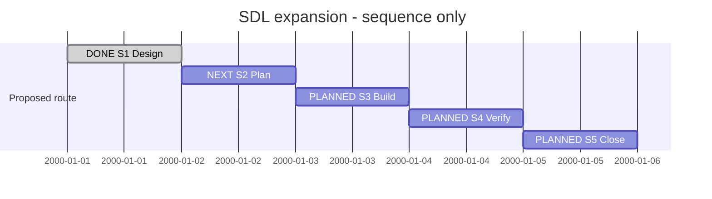

# Session 0001 — SDL expansion

**Manual roadmap pilot**, created from the owner's 2026-09-30 Session proposal.
S1 is now authorized below; this does not retroactively place prior work in a Session.
[KB-SDP-042](../KanBan/backlog/%23042--Proposal--Goal-oriented-sessions-and-roadmaps.md)
owns the provisional format; [guide](README.md) defines its limits.

| Field | Value |
| --- | --- |
| Session reference | SESSION-SDP-0001 (provisional) |
| Status | active |
| Primary delivery card | KB-SDL-005 |
| Snapshot date | 2026-09-30 |
| Current execution step | None — S1 delivered; awaiting S2 selection |
| Proposed next step | S2 — create the ImplementationPlan from SSD1 |
| Execution authority | Owner selected S1 on 2026-09-30; product implementation remains a later step |

## Goal

Make an SDL System readable across explicit source files while retaining one
validated model, original-source diagnostics and model-derived navigation.
Demonstrate the result on a bounded real model and preserve independent model
checking. Completion requires source-set and consumer evidence, not just syntax.

Excluded: all experimental MVP1 language features, rich SDUI parity, a new FOX
adapter, XFMD application changes, release/merge without their own authorization.
The separate text-fidelity and routine/client work can continue independently.

## Affected cards

Snapshot captured 2026-09-30; lifecycle and CardState agree for these rows.

| Card | Role | Initial state | Planned final disposition | Current snapshot | Actual final disposition |
| --- | --- | --- | --- | --- | --- |
| [KB-SDL-005](../KanBan/active/%23005--SDL--Change--System-and-source-sets.md) | Primary delivery | backlog | completed after language/input/consumer acceptance | active / ready | Pending |
| [KB-SDP-020](../KanBan/backlog/%23020--Change--Shared-design-source-organization.md) | Related migration, separately selected | backlog | Determine after supported source-set design; do not promise entire migration | backlog | Pending |
| [KB-SDP-041](../KanBan/completed/%23041--Study--XFMD-driven-SDL-and-SDUI-gaps.md) | Completed input, not reopened | completed | Retain completed | completed | Already completed before this pilot |

Other language extension cards stay outside this bounded goal unless a recorded
route change adds them. A Session is not a promise to empty the backlog.

## Plan register

| Ref | Plan type and document | Document readiness | Canonical lifecycle | Role / dependency |
| --- | --- | --- | --- | --- |
| P0 | [PLAN-SDP-0009, RequirementPlan/study](../02--Requirements/XFMD-Gaps/StudyPlan.md) | completed | completed | Prior input; not performed during this Session |
| P1 | [PLAN-SDP-0010, DesignPlan](../04--Design/SDL/SourceSets/Plan.md) | completed | completed | System identity, source membership, resolution and consumer contract |
| P2 | ImplementationPlan — not yet created | planned | Not registered | Depends on selected P1 design |
| P3 | VerificationPlan — not yet created; may instead use explicit verification milestones in P2 | planned | Not registered | Candidate and consumer acceptance; avoid a redundant wrapper |

No mandatory separate ArchitecturePlan: create one only if the selected design
changes a material system boundary beyond the established architecture.

## Session roadmap

**Sequence-only Gantt mockup.** The dates below are synthetic placement slots,
not working-day estimates, deadlines or authorization. S1 design is delivered; S2 is next.
The step table below owns the current proposal. No init directive is used.

| State | Step | Work / plan | Prerequisites | Authorization | Completion evidence |
| --- | --- | --- | --- | --- | --- |
| completed | S1 | P1: design System and explicit source sets; reuse completed study | KB-SDL-005 and source/projection constraints | Owner selected S1 | [SSD1 contract, fixture, acceptance and evidence](../04--Design/SDL/SourceSets/Plan.md) |
| next | S2 | P2: plan runnable increments and checks | Selected S1 result | Unselected | Phases/milestones, explicit branch/commit policy and acceptance |
| planned | S3 | P2: implement Go frontend/input resolution and producer consumers | S2 and execution authorization | Unselected | Cross-file identity, diagnostics, deterministic model/revision and existing behavior verified |
| planned | S4 | P3 or P2 verification: check a real model through navigation/generation | S3 candidate | Unselected | Missing/duplicate/cyclic input cases, original spans, stale revision and actual consumer evidence; required independent review |
| planned | S5 | Record goal outcome and KB020 migration disposition | S4 evidence | Unselected | KB005 disposition, explicit remaining model migrations and successor; no implied release |

## Route changes and decisions

| Date / source | Previous route | Change and reason | Authority | Affected steps |
| --- | --- | --- | --- | --- |
| 2026-09-30 owner request | Next steps distributed across chat and cards | Propose one persistent goal/roadmap/turn record | Owner proposed Session concept; this is a document pilot | S1–S5 |
| 2026-09-30 pilot preparation | No time estimates selected | Use synthetic sequence slots; keep execution unselected | Agent recommendation, not an approved schedule | S1–S5 |
| 2026-09-30 next-step request | S1 proposed | Execute and deliver PLAN-SDP-0010; S2 becomes next | Owner selected S1; implementation remains subsequent | S1–S2 |

## Turn journal

This pilot starts now. Prior chat history is not reconstructed as a verified
transcript. The completed study is linked as an input above.

### T001 — 2026-09-30, propose Sessions

- Capture mode: manual; exact current owner prompt retained in
  [the proposal card](../KanBan/backlog/%23042--Proposal--Goal-oriented-sessions-and-roadmaps.md#source-prompt).
- Host thread/turn/item IDs: unavailable to this document writer.
- Category: process proposal and planning; no language implementation.
- Procedure used: existing SDP entrypoint and Planning guidance, agent-reported.
  Formal routine-run ID/version: not available; no governance engine claimed.
- Skills loaded: sdp, sdp-planning, openai-docs; agent-reported reads.
- Work: registered KB042, drafted guide/template and this roadmap, linked existing
  routine/client work, checked current app-server documentation.
- Assistant work summary (not a captured final chat message): Session connects a
  durable goal to cards, plans, next steps, decisions and turn history. App-server
  is a suitable future client capture point; MCP supplies explicit SDP operations.
  Existing plan/card authority remains intact; rich SDUI parity stays excluded.
- Next: review/adopt the small Session format through KB042, or select S1 for SDL
  delivery. Process tooling need not block language design. Neither is executing.

## Closeout

S1 completed under PLAN-SDP-0010. S2 ImplementationPlan is next; product
implementation and full Session goal acceptance remain pending.

## Pilot checks — 2026-09-30

Management validation: 52 cards, 24 management records, 398 events; passed.
Toolkit validation, local link checks and git diff --check passed. Historical
ledger bytes remain unchanged. The Gantt source was rendered with local
mermaid-rs-renderer/target/release-fast/mmdr, rasterized and visually inspected.
Short labels avoid row overlap. This renderer displayed synthetic calendar dates
rather than the requested Slot axis labels; they are explicitly not a schedule.
No native XFMD inspection, automatic projection or transcript capture is claimed.

Current session permissions again make .git read-only. Drafts are saved locally;
no commit or push was attempted. Unrelated sourceinput/Node files were preserved.

### XFMD compatibility correction — 2026-09-30

Owner reported `Unsupported Mermaid statement: axisFormat Slot %d`. Source
inspection locates that diagnostic in XFMD's Mermaid semantic parser, whose
Gantt planning profile accepts dateFormat YYYY-MM-DD but neither axisFormat nor
todayMarker. Both directives were removed from this example. The earlier
standalone mmdr rendering was not XFMD-path acceptance: it rendered without
applying the requested axis labels. No XFMD code changed or native GUI acceptance
claimed. The remaining dates still represent synthetic sequence slots.

### Git recovery and external handoff — 2026-09-30

The owner restored write access and authorized commits. The earlier read-only
note describes the pilot's initial execution, not the current permission state.
External KB-XFMD-020 now owns the Mermaid compatibility follow-up; its registration
is recorded in KB-SDP-042. This housekeeping does not start SDL design or make
the Session format an adopted management profile.

### T002–T004 — manual follow-up index, 2026-09-30

These are manually summarized work intervals, not recovered app-server IDs or
verbatim final-response capture. They refine the Session pilot; S1 remains next.

| Local turn | Owner request | Handling and outcome | Procedure / evidence |
| --- | --- | --- | --- |
| T002 | Report unsupported axisFormat in the Gantt and identify the rejecting component | Inspected XFMD semantic parser; removed axisFormat/todayMarker from the local example; standalone renderer check was insufficient | Existing source inspection and card update guidance, agent-reported; compatibility correction above |
| T003 | Register a broader XFMD card covering missing Mermaid constructs and explain parsing ownership | Prepared full compatibility draft while external writes were unavailable; documented parser/model/layout boundary and pending registration | SDP capture guidance, agent-reported; external handoff pointer |
| T004 | Restore write access, commit pending work and register XFMD card | Registered external KB-XFMD-020 and validated both boards; SDP documentation commit selected. XFMD commit handling separated because earlier modeling work shares its uncommitted ledger | SDP entrypoint and existing Git policy, agent-reported; no routine engine or automatic transcript capture |

Exact visible owner prompt for T004:

> ok you are back in yolo mode so you can do git commits and also add the kb cards in xfmd

No step is marked completed merely because this housekeeping turn ends.

### T005 — manual handoff index, 2026-09-30

Owner asked to leave external KB-XFMD-020 staged for the XFMD agent's next commit.
The card alone was staged; no XFMD commit was created. Shared index/history changes
remain with that agent. This is a manual summary, not recovered host turn metadata.

### T006 — 2026-09-30, execute S1

- Exact submitted owner prompt: “ok. continue on next step in our session plan”
- Category: execute the next bounded design step. Capture mode: manual.
- Skills loaded: sdp, sdp-planning, sdp-architect, sdp-traceability; agent-reported.
  Existing plan/document workflow used; no automated routine engine is claimed.
- Host thread/turn/item IDs: unavailable to this document writer.
- Work: activate KB-SDL-005, create and execute PLAN-SDP-0010 on the design phase
  branch, inspect parser and consumers, deliver contract/fixture/26 acceptance
  cases, verify baseline behavior and record original-source/revision requirements.
- Assistant work summary, not a captured final chat message: S1 design is complete.
  A three-file fixture retains all 57 baseline declarations/statements. The current
  parser correctly rejects proposed 0.6; no implementation is claimed. One closed
  System is the recommended first increment. Public linking remains explicit
  later card scope. Authoritative models and unrelated work remain unchanged.
- Next: S2 ImplementationPlan. KB-SDL-005 is ready at the handoff; it is not complete.

### S1 route disposition

The first implementation increment excludes cross-System imports/exports. This
keeps source assembly bounded while preserving the historical obligation in the
card. S2 must plan that later scope or explicitly split it before card closure.
KB-SDP-020 remains backlog until a supported pilot and consumer evidence exist.
This is the design recommendation delivered under owner-authorized S1, not a
claim of published syntax or owner acceptance of the eventual implementation.
