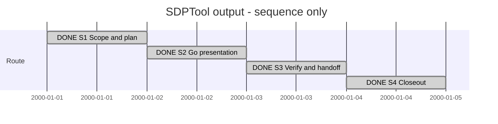

# Session 0002 — Portable SDPTool output

## Session roadmap

Latest recorded local turn: **T006 — remove navigation.json authority**.
**Presentation goal completed; S1–S4 are complete.**
Recommended separately selected next work: KB046, source discovery and
multi-system navigation. It is registered in backlog, not started.

**Sequence only.** Dates are synthetic placement slots, not measured turns,
deadlines or elapsed time. This manual table is authoritative for the projection;
no event-driven timeline or automatic transcript capture is claimed.

| State | Step | Work / plan milestone | Prerequisites | Authority | Evidence / outcome |
| --- | --- | --- | --- | --- | --- |
| completed | S1 | P1 scope, design and registration | Owner output proposal and Bash clarification | Owner request | KB045, PLAN-SDP-0013; Session created late with explicit provenance |
| completed | S2 | P1 OP1-M1: Go registry, human tree, explicit JSON | S1 | Same requested implementation | Root-module tests pass; machine consumers explicitly request JSON |
| completed | S3 | P1 OP2-M1: compatibility, review and documentation | S2 | Same bounded implementation | Bootstrap old/new probe tests and SDL model check pass; independent review approved after two repairs; presentation package cross-compiles for Windows/macOS |
| completed | S4 | P1 OP2-M1: record evidence, commits and handoff | S3 | Existing milestone commit/phase push authorization | OP1 61bca4c; OP2 commit contains final evidence. No merge, release or live installation |

| Field | Value |
| --- | --- |
| Session reference | SESSION-SDP-0002 (manual convention) |
| Status | completed |
| Primary card | [KB-SDP-045](../KanBan/completed/%23045--Change--Portable-SDPTool-presentation.md) |
| Snapshot date | 2026-10-01 |
| Current step | None |
| Proposed next step | Separate KB046 plan, if selected |
| Execution authority | Owner request for default readable Go output and explicit --json |

## Goal

Make SDPTool directly usable by people and machine clients: readable navigation
and command output by default, structured JSON on explicit request, and portable
compiled-in adapters instead of a Bash filter. Preserve core operations and data
schemas. Record the compatibility and rollout requirements honestly.

Exclude dynamic plugin loading, native XFMD changes, actual gh-sdp publication,
release/merge and live project upgrades. A published client update is a follow-up,
not evidence delivered by changing this checkout's shared bootstrap.

## Affected cards

Snapshot at late Session registration; initial states below are observed states,
not invented states at the unrecorded beginning of the conversation.

| Card | Role | Initial lifecycle / CardState | Planned final disposition | Current snapshot | Actual final disposition |
| --- | --- | --- | --- | --- | --- |
| [KB045](../KanBan/completed/%23045--Change--Portable-SDPTool-presentation.md) | Primary delivery | active / in-progress | completed after implementation/review evidence | completed | completed |
| [KB044](../KanBan/active/%23044--Change--Sessions-and-repeatable-release-preparation.md) | Release preparation context | active / gate-review | Retain concrete preparation review; update version/consumer handoff | active / gate-review | Pending owner publication disposition; outside this delivery |
| [KB046](../KanBan/backlog/%23046--Change--Source-discovery-and-multiple-system-navigation.md) | Discovered successor | backlog at T003 registration | Separate discovery delivery if selected | backlog | Pending, outside presentation delivery |
| [KB042](../KanBan/backlog/%23042--Proposal--Goal-oriented-sessions-and-roadmaps.md) | Manual Session format and future automation | backlog | Retain automation scope in backlog | backlog | Outside delivery |

## Plan register

| Ref | Plan type and document | Document readiness | Canonical lifecycle | Dependencies | Outcome / evidence |
| --- | --- | --- | --- | --- | --- |
| P1 | [PLAN-SDP-0013 — ImplementationPlan](../05--Implementation/SDPTool/Output/Plan.md) | completed | completed | Owner output contract; existing result schemas | OP1/OP2 evidence and independent review recorded in P1 |
| P0 | [MAINT-SDP-0011 — MaintenancePlan](../Maintenance/RL1/Plan.md) | completed | completed | Prior release preparation, not reopened | Historical evidence remains valid for its candidate; new output scope changes release proposal |

## Route changes and decisions

| Date / turn | Previous route | Change and reason | Authority | Affected steps/cards |
| --- | --- | --- | --- | --- |
| 2026-09-30 / T001 | JSON by default; shell prototype for tree display | Go output adapter with explicit machine mode | Owner proposal and clarification | S1–S3, KB045 |
| 2026-09-30 / T001 | Additive release preparation proposed 1.1.0 | Proposed combined 2.0.0 because default stdout is a public breaking change | Existing version contract applied to requested change; publication not authorized here | S3, KB044 |
| 2026-09-30 / T002 | Card and plan existed without Session | Restore missing overview and record late capture explicitly | Owner correction | All steps; no new implementation scope |
| 2026-10-01 / T003 | Output rendering in scope | Record source discovery and multi-system tree gap separately as KB046 | Owner symptom report; no discovery implementation selected | S3–S4, KB046 |

## Turn journal

### T001 — output work before Session registration (retrospective)

- Capture mode: manually reconstructed work summary plus explicitly identified
  observed quotations. This is not a complete host transcript.
- Host thread/turn/item IDs and exact start/end times: unavailable.
- Request category: capability/change implementation; routine ID/version/run:
  unavailable. No enforced routine engine is claimed.
- Skills loaded (agent-reported): sdp, sdp-change-analysis, sdp-architect,
  sdp-planning, sdp-worker, sdp-versioning; sdp-reviewer loaded for review guidance.
- Steps touched: S1, S2 and initial S3. This work was interrupted by the owner
  correction below before an assistant final response.

Owner intent summary: default readable SDPTool output, opt-in --json, modular
routing from structured results, raw JSON fallback if no adapter is available.
The owner supplied a successful `gh sdp tree | json-tree.sh` printout as the visual
reference. Its project, node ordering, labels, statuses and Unicode branches are
used in the renderer tests; the full terminal transcript is not copied here.

Verbatim observed owner clarification (Norwegian source quotation):

> jeg avbrøt deg i det jeg skulle vise deg printout.  dette kan jo ikke håndteres av et bash script for vi vil at koden skal være platformuavhengig. dette var bsare et hack

Work summary, not a final assistant response: inspected CLI, result schemas,
installation output, bootstrap and machine-consumer tests; created KB045 and
P1 on sdp/sdptool/output-presentation from 2b1d652. Implemented Go adapters,
readable tree, explicit JSON flags, Markdown export envelope and local consumer
updates. Added the OutputPresentation unit to the existing SDL model. Root Go
module and bootstrap tests pass; SDL model check is valid. One earlier test still
expected implicit JSON and was updated to explicitly request the preserved
machine contract. Independent review, platform checks and commits were pending.

Process gap: a Session should have been registered alongside the selected plan.
This file records that omission; it does not claim contemporaneous capture.

### T002 — owner restores Session tracking (current steering turn)

- Capture mode: exact observed prompt and commentary; subsequent work is a manual
  summary. Local T002 is a separate journal entry requested by the owner; host
  turn identity is unknown and may be shared with ongoing execution.
- Request category: process correction within the existing authorized work.
- Routine ID/version/run: unavailable; manual Session guide applied.
- Skills: existing SDP/planning context reused; no new capability selected.

Verbatim owner prompt (Norwegian source quotation):

> vi skulle ha logget alt dette i en ny session

Verbatim assistant commentary, not a final response:

> Ja, du har rett. Jeg opprettet kort og implementasjonsplan, men glemte Session-dokumentet. Jeg oppretter en ny Session nå og knytter planen, kortet og arbeidet så langt til den. Etterregistrert historikk merkes tydelig, og den nye meldingen din blir en egen turn i loggen.

Work in progress: created this Session with roadmap first, initial/current/final
card snapshots, plan register, route changes, retrospective provenance and turn
journal. Linked it from the card and plan. Continue S3–S4 under the original scope.
Assistant final response: none occurred before the next steering message.
The Session/plan links and ledger update were committed in OP1-M1 (61bca4c).
Independent review identified a missed machine invocation in the ecosystem
verification script and an installation argument-error regression. Both were
fixed and independently rechecked. The reviewer corrected its own initial claim
about the old malformed-flag output stream; P1 preserves that correction.

### T003 — existing source files absent from navigation

- Capture mode: exact question excerpt below; terminal output summarized explicitly.
- Host turn/item IDs and exact timestamps: unavailable. Local date: 2026-10-01.
- Request category: explain reported discovery behavior and analyze capability gap.
- Routine ID/version/run: unavailable; existing SDP change-analysis workflow reused.
- Steps touched: S3 diagnosis and S4 successor registration. No discovery implementation.

Verbatim owner question excerpt (Norwegian source quotation):

> vil den nye versjonen av sdptool nå oppdage og forstå SDP/SDL/ med både single og multiple systems?  det ser ikke ut som hverken  discover eller tree finner SDL og SDUI kode i xfmd

The accompanying terminal printout showed published installation 1.0.0, empty
models/sdui registration arrays, source files under SDP/SDL/XFMD and absent SDL/
SDUI tree tabs. This paragraph summarizes that supplied output, not a full copy.

Read-only findings: discovery derives capabilities from navigation.json; directory
presence is not an input. Tree selects one registered SDL model. Unreleased 0.6
supports one System per composed source graph, not a merged multi-System graph.
XFMD's README identifies XfmdDesktop.design/Desktop.sdui as current sources and
the two Navigation files as historical fixtures, which rules out blind promotion
of all matching file extensions.

Experiment: copied XFMD sources into /tmp/sdp-xfmd-registration-geax5d3s and
registered only the current inputs there. Discover declares SDL/SDUI and tree
returns 2454 nodes: SDL validated, SDUI available, with multiple SDUI frame entries.
The live project is unchanged. These temporary files are supplementary evidence;
canonical observations and scope are captured in
[KB046](../KanBan/backlog/%23046--Change--Source-discovery-and-multiple-system-navigation.md).

Assistant work summary, not an exact final response: explained the registration
boundary, distinguished single-System composition from multiple registered models,
and registered discovery/aggregate navigation as separate backlog work. The
presentation implementation is complete, not expanded into discovery by this turn.
Final assistant response is not yet available to this manual writer.

### T004 — owner requests a manual registration command

- Capture: exact observed prompt; proposed response summarized, not claimed sent.
- Local date: 2026-10-01; host IDs/timestamps unknown.
- Category: usage guidance following the discovery diagnosis, no new execution scope.
- Existing SDP analysis context reused; no enforced routine run claimed.

Verbatim owner prompt (Norwegian source quotation):

> ok hvordan skal de registeres? når de kompileres? gir du meg kommando så kan jeg prøve manuelt

Prepared guidance: registration is currently explicit navigation.json configuration,
not compiler output; no register command exists. Supply an atomic jq update with
backup, retaining unrelated fields and other model IDs. Register current XFMD
0.5 SDL input as xfmd, SDUI 0.2 Desktop.sdui as desktop, and select defaultModel xfmd.
The jq transformation was tested into /tmp/xfmd-proposed-navigation.json without
changing the live file. Existing published 1.0.0 commands still default to JSON;
future presentation clients must add --json when piping to jq. The owner performs
the actual project edit and trial; no success for that trial is claimed here.
This follow-up does not reopen the completed presentation implementation.

### T005 — automatic discovery instead of manual registration

- Local date: 2026-10-01. Capture: exact owner prompt below; work summary is not a
  captured final response. Host IDs and exact turn times are unavailable.
- Category: architecture refinement of successor KB046; sdp, change-analysis and
  architect skills loaded/reused. No routine engine/run is claimed.
- The completed presentation goal is unchanged. KB046 remains backlog; no new
  implementation Session or plan has started.

Verbatim owner prompt (Norwegian source quotation):

> ja, jeg tenker jo egentlig at dette burde skje på automatikk. vi burde ikke huske å måtte kjøre en registreringskommando. hva er det egentlig navigation.json brukes til? det virker egentlig som det bare er en "indexering" for navigering? egentlig synes jeg gh sdp . discover burde produsere navigation filen. jeg forstår fordelen med at vi kan ha en ide, en source og en profile som blant annet viser versjonen av språket som design filer og sdui filer er laget med. men jeg synes at det burde kunne skje programatisk ved at man enten parser design filene og inspiserer AST og søker med "ordliste" fra forskjellige versjoner av språket og så kan man si complies_with: "design-core/0.5" hvis man ikke finner noe bruk av ord fra design-core/0.6 for eksempel? eller blir det for enkelt?  jeg er i hvertfall sterkt imot filer som "tilfeldigvis ligger et sted" som vi må passe på å editere, enten med en kommando eller manuelt. men en discover kan jo gjøre det hvis den kan gjøre det automatisk

Findings/recommendation: current navigation.json combines project recognition and
bindings with the source inventory. Make the inventory derived and refreshable,
recover real project facts from existing authoritative locations, and let tree/
select reuse discovery automatically. Source headers already select language
profiles; parsing/semantic validation establish validity. A keyword dictionary
cannot establish cross-version compatibility. Retain the distinction between
current and historical but syntactically valid files; do not invent source
annotations as implemented syntax. Updated KB046 holds these requirements,
recommendations and remaining migration/authority decisions.

No discovery code or live XFMD configuration changed. Final response is not yet
available for exact capture by this manual writer.

### T006 — source files and directories are the navigation authority

- Local date: 2026-10-01. Capture: exact owner response paragraph below, with the
  preceding quotation of T005 assistant wording summarized here. Host IDs and
  timestamps are unknown. Final response is not yet available for exact capture.
- Category: owner correction to KB046 architecture direction. Existing SDP
  change-analysis/architect context reused; no enforced routine run claimed.
- The owner quoted the assistant's claim that current/historical XFMD files
  required a convention before navigation could work, then replied:

Verbatim owner response paragraph (Norwegian source quotation):

> ja det er dette som er hele poenget mitt og som egentlig gjør at jeg vil vi skal fjerne hele navigation.json. jeg forstår egentlig ikke hvorfor den er der i utgangspunktet. all navigering bør og skal uansett skje ut ifra kilde filer og kataloger og ikke noe ekstra filer som blir utdatert 5 min etterpå

Correction recorded in KB046: remove navigation.json as a required authority,
not regenerate another compulsory navigation file. Show actual source files and
folders, with semantic structure from their parsed declarations and relations.
Desktop and Navigation sources can both be browsable without inferring which is
current. Root selection and semantic validation do not justify suppressing files
from navigation. No replacement registry or required current/historical annotation.

Implementation remains unstarted; this refines the successor card, not completed
presentation PLAN-SDP-0013. No product code, live registration or XFMD source was
changed. The previous generated-file recommendation is explicitly superseded.

## Closeout

Goal delivered: platform-independent Go presentation, explicit machine JSON,
registry fallback, tested tree and consumer migration within this repository.
OP1 commit is 61bca4c; OP2 commit contains remaining repairs and this closeout.
P1 links root/bootstrap tests, 18-model ecosystem verification, a test-signed real
child install, cross-compilation and independent review. KB045 is completed.
KB044 remains gate-review for the preparation package and later publication
selection, including new client gates. KB042 remains backlog for capture automation.

KB046 starts in backlog and remains backlog: its proposed final outcome is a
separately selected discovery/navigation delivery, with no final disposition yet.
It is a discovered successor, not unfinished presentation scope. No new Session
or execution plan for that successor is selected by this closeout.

Published SDP remains 1.0.0. The installed gh-sdp command has not been changed and
release 2.0.0 is only a recommendation for the combined breaking change.
