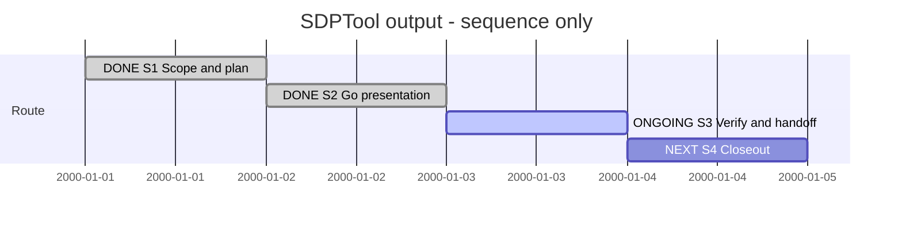

# Session 0002 — Portable SDPTool output

## Session roadmap

Latest recorded local turn: **T002 — restore Session tracking**.
Current work: **S3 verification and consumer handoff**. Next: S4 closeout.

**Sequence only.** Dates are synthetic placement slots, not measured turns,
deadlines or elapsed time. This manual table is authoritative for the projection;
no event-driven timeline or automatic transcript capture is claimed.

| State | Step | Work / plan milestone | Prerequisites | Authority | Evidence / outcome |
| --- | --- | --- | --- | --- | --- |
| completed | S1 | P1 scope, design and registration | Owner output proposal and Bash clarification | Owner request | KB045, PLAN-SDP-0013; Session created late with explicit provenance |
| completed | S2 | P1 OP1-M1: Go registry, human tree, explicit JSON | S1 | Same requested implementation | Root-module tests pass; machine consumers explicitly request JSON |
| on-going | S3 | P1 OP2-M1: compatibility, review and documentation | S2 | Same bounded implementation | Bootstrap old/new probe tests and SDL model check pass; independent review and platform checks pending |
| next | S4 | P1 OP2-M1: record evidence, commits and handoff | S3 | Existing milestone commit/phase push authorization | No merge, release, installation or XFMD application changes |

| Field | Value |
| --- | --- |
| Session reference | SESSION-SDP-0002 (manual convention) |
| Status | active |
| Primary card | [KB-SDP-045](../KanBan/active/%23045--Change--Portable-SDPTool-presentation.md) |
| Snapshot date | 2026-09-30 |
| Current step | S3 |
| Proposed next step | S4 after review findings and checks are resolved |
| Execution authority | Owner request for default readable Go output and explicit --json |

## Goal

Make SDPTool directly usable by people and machine clients: readable navigation
and command output by default, structured JSON on explicit request, and portable
compiled-in adapters instead of a Bash filter. Preserve core operations and data
schemas. Record the compatibility and rollout requirements honestly.

Exclude dynamic plugin loading, native XFMD changes, actual gh-sdp publication,
release/merge and live project upgrades. A published client update is a follow-up,
not evidence delivered by changing this checkout's shared bootstrap.

## Affected cards

Snapshot at late Session registration; initial states below are observed states,
not invented states at the unrecorded beginning of the conversation.

| Card | Role | Initial lifecycle / CardState | Planned final disposition | Current snapshot | Actual final disposition |
| --- | --- | --- | --- | --- | --- |
| [KB045](../KanBan/active/%23045--Change--Portable-SDPTool-presentation.md) | Primary delivery | active / in-progress | completed after implementation/review evidence | active / in-progress | Pending |
| [KB044](../KanBan/active/%23044--Change--Sessions-and-repeatable-release-preparation.md) | Release preparation context | active / gate-review | Retain concrete preparation review; update version/consumer handoff | active / gate-review | Pending owner publication disposition; outside this delivery |
| [KB042](../KanBan/backlog/%23042--Proposal--Goal-oriented-sessions-and-roadmaps.md) | Manual Session format and future automation | backlog | Retain automation scope in backlog | backlog | Outside delivery |

## Plan register

| Ref | Plan type and document | Document readiness | Canonical lifecycle | Dependencies | Outcome / evidence |
| --- | --- | --- | --- | --- | --- |
| P1 | [PLAN-SDP-0013 — ImplementationPlan](../05--Implementation/SDPTool/Output/Plan.md) | on-going | active | Owner output contract; existing result schemas | OP1 implemented/tested; OP2 verification and handoff continue |
| P0 | [MAINT-SDP-0011 — MaintenancePlan](../Maintenance/RL1/Plan.md) | completed | completed | Prior release preparation, not reopened | Historical evidence remains valid for its candidate; new output scope changes release proposal |

## Route changes and decisions

| Date / turn | Previous route | Change and reason | Authority | Affected steps/cards |
| --- | --- | --- | --- | --- |
| 2026-09-30 / T001 | JSON by default; shell prototype for tree display | Go output adapter with explicit machine mode | Owner proposal and clarification | S1–S3, KB045 |
| 2026-09-30 / T001 | Additive release preparation proposed 1.1.0 | Proposed combined 2.0.0 because default stdout is a public breaking change | Existing version contract applied to requested change; publication not authorized here | S3, KB044 |
| 2026-09-30 / T002 | Card and plan existed without Session | Restore missing overview and record late capture explicitly | Owner correction | All steps; no new implementation scope |

## Turn journal

### T001 — output work before Session registration (retrospective)

- Capture mode: manually reconstructed work summary plus explicitly identified
  observed quotations. This is not a complete host transcript.
- Host thread/turn/item IDs and exact start/end times: unavailable.
- Request category: capability/change implementation; routine ID/version/run:
  unavailable. No enforced routine engine is claimed.
- Skills loaded (agent-reported): sdp, sdp-change-analysis, sdp-architect,
  sdp-planning, sdp-worker, sdp-versioning; sdp-reviewer loaded for review guidance.
- Steps touched: S1, S2 and initial S3. This work was interrupted by the owner
  correction below before an assistant final response.

Owner intent summary: default readable SDPTool output, opt-in --json, modular
routing from structured results, raw JSON fallback if no adapter is available.
The owner supplied a successful `gh sdp tree | json-tree.sh` printout as the visual
reference. Its project, node ordering, labels, statuses and Unicode branches are
used in the renderer tests; the full terminal transcript is not copied here.

Verbatim observed owner clarification (Norwegian source quotation):

> jeg avbrøt deg i det jeg skulle vise deg printout.  dette kan jo ikke håndteres av et bash script for vi vil at koden skal være platformuavhengig. dette var bsare et hack

Work summary, not a final assistant response: inspected CLI, result schemas,
installation output, bootstrap and machine-consumer tests; created KB045 and
P1 on sdp/sdptool/output-presentation from 2b1d652. Implemented Go adapters,
readable tree, explicit JSON flags, Markdown export envelope and local consumer
updates. Added the OutputPresentation unit to the existing SDL model. Root Go
module and bootstrap tests pass; SDL model check is valid. One earlier test still
expected implicit JSON and was updated to explicitly request the preserved
machine contract. Independent review, platform checks and commits were pending.

Process gap: a Session should have been registered alongside the selected plan.
This file records that omission; it does not claim contemporaneous capture.

### T002 — owner restores Session tracking (current steering turn)

- Capture mode: exact observed prompt and commentary; subsequent work is a manual
  summary. Local T002 is a separate journal entry requested by the owner; host
  turn identity is unknown and may be shared with ongoing execution.
- Request category: process correction within the existing authorized work.
- Routine ID/version/run: unavailable; manual Session guide applied.
- Skills: existing SDP/planning context reused; no new capability selected.

Verbatim owner prompt (Norwegian source quotation):

> vi skulle ha logget alt dette i en ny session

Verbatim assistant commentary, not a final response:

> Ja, du har rett. Jeg opprettet kort og implementasjonsplan, men glemte Session-dokumentet. Jeg oppretter en ny Session nå og knytter planen, kortet og arbeidet så langt til den. Etterregistrert historikk merkes tydelig, og den nye meldingen din blir en egen turn i loggen.

Work in progress: created this Session with roadmap first, initial/current/final
card snapshots, plan register, route changes, retrospective provenance and turn
journal. Linked it from the card and plan. Continue S3–S4 under the original scope.
Assistant final response: not yet available for exact capture.

## Closeout

Pending S3–S4. Published SDP remains 1.0.0. No claim that the user's installed
`gh sdp tree` has changed or that release 2.0.0 exists.
