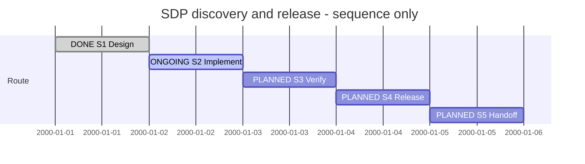

# Session 0003 — Source-owned SDP discovery and release

## Session roadmap

Current local turn: **T001 — implement and release**. Current step: S2.
Sequence-only chart: synthetic slots, not elapsed time or deadlines.

| State | Step | Work / plan | Prerequisite | Authority | Evidence |
| --- | --- | --- | --- | --- | --- |
| completed | S1 | P1 DS1 design/registration | KB046 owner decisions | Owner T001 | Plan created |
| on-going | S2 | P1 DS1/DS2 implementation and client | S1 | Owner T001 | Pending |
| planned | S3 | P1 DS3 regression, real sources, review | S2 | Owner T001 | Pending |
| planned | S4 | P1 DS4 SDP and gh-sdp publication | S3 gates | Owner T001 | Pending |
| planned | S5 | P1 DS5 reconciliation/manual upgrade | S4 public verification | Owner T001 | Pending |

| Field | Value |
| --- | --- |
| Session reference | SESSION-SDP-0003 |
| Status | active |
| Primary card | KB-SDP-046 |
| Snapshot date | 2026-10-01 |
| Current step | S2 |
| Execution authority | Owner requests plans, implementation and release in one turn |

## Goal

Browse SDP files and source-derived semantic navigation without registration;
publish paired SDP/gh-sdp releases so the owner can manually upgrade XFMD.
No native XFMD application/watch implementation or live XFMD upgrade here.

## Affected cards

| Card | Role | Initial lifecycle / CardState | Planned final | Current | Actual final |
| --- | --- | --- | --- | --- | --- |
| [KB046](../KanBan/active/%23046--Change--Source-discovery-and-multiple-system-navigation.md) | Primary | backlog / backlog | completed | active / in-progress | Pending |
| [KB044](../KanBan/active/%23044--Change--Sessions-and-repeatable-release-preparation.md) | Included release | active / gate-review | completed on verified publication | active / in-progress | Pending |
| [KB045](../KanBan/completed/%23045--Change--Portable-SDPTool-presentation.md) | Completed output input | completed | unchanged | completed | Already completed |
| KB-SDP-017 | Broader SDPTool feature context | active | unchanged broader scope | active | Outside bounded closure |

## Plan register

| Ref | Plan | Readiness | Canonical state | Dependency/outcome |
| --- | --- | --- | --- | --- |
| P1 | [PLAN-SDP-0014 ImplementationPlan](../05--Implementation/SDPTool/Discovery/Plan.md) | on-going | active | Discovery, integration, verification and release |
| P0 | [MAINT-SDP-0011 release preparation](../Maintenance/RL1/Plan.md) | completed | completed | Historical inputs, not reopened |
| Client | gh-sdp SPS-007, external repository | planning | External records | Immutable bootstrap, package and client release; root coordinates |

## Route decisions

Carry KB046 selected direction forward unchanged: no navigation sidecar; discovery
is finite/read-only and viewer owns its buffer and watcher. Product schema becomes
sdptool/0.2 for the changed discovery boundary. Product/client versions differ.
Release from reviewed working branches; no implicit main merge or user-project install.

## Turn journal

### T001 — 2026-10-01

Capture: exact observed prompt; work summaries are manually maintained. Host
thread/turn IDs and timings unknown. Category: implementation plus authorized release.
Skills: SDP entry, planning, architecture/change analysis (prior decisions reused),
worker/master, versioning, release, verifier/reviewer as applicable. No routine
engine execution claimed. gh-sdp's installed Master explicitly requires delegation;
client implementation/review is delegated within that repository.

Verbatim owner prompt (Norwegian source quotation):

> ok. skal vi stare en ny session nå, eller skal vi utvide session 2? det er helt ok å lage en ny siden session 2 står som goal accheived. så da kan du lage en session 3 og få inn disse endringene med discover og evt andre relaterte kb kort. da kan du jobbe deg igjennom planer og implementering av dette i en turn og så må vi få endt opp med å released en ny versjon av SDP så jeg kan gjøre en gh sdp . upgrade  i xfmd katalogen.  men først må vel en gh extension sdp upgrade gjøres

Work: checked Git/release state, selected P1, activated KB046/044 and prepared the
client assignment. Existing unrelated untracked files are preserved. Publication
and final response remain pending; evidence links are added as work completes.

## Closeout

Pending. Actual extension-update command is `gh extension upgrade sdp`; project
upgrade is a separate SDPTool preview/apply workflow. Owner performs live XFMD work.

DS1-M1 update: source-owned discovery and snapshot implemented. Root/bootstrap
tests pass; actual XFMD sources are found read-only without registration. Installer,
docs, independent review and release gates follow under S2–S4.

DS2/DS3-M1 update: installer/docs/client preparation integrated, all local test
gates and independent product review pass. Six disposable predecessor upgrade
cases preserve project content and repeat without actions. DS4 exact production
package, CI and publication are now in progress.
