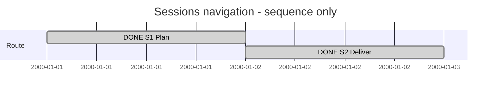

# Session 0004 — Browse Sessions

## Session roadmap

T001: implement Sessions discovery. Sequence only; synthetic slots, not timing.

| State | Step | Work | Evidence |
| --- | --- | --- | --- |
| completed | S1 | Analyze and select bounded plan | PLAN-SDP-0015 |
| completed | S2 | Implement, verify and commit SN1-M1 | Plan evidence |

| Field | Value |
| --- | --- |
| Session reference | SESSION-SDP-0004 |
| Status | completed |
| Primary card | KB-SDP-047 |
| Current step | None |

## Goal and scope

Discover and browse the actual Sessions directory. Preserve Session0003's closed
release and source-owned navigation. No Session engine or publication in this turn.

## Affected cards

| Card | Initial | Planned final | Current | Actual final |
| --- | --- | --- | --- | --- |
| [KB047](../KanBan/completed/%23047--Change--Discover-and-browse-Sessions.md) | New request | completed | completed | completed |

## Plan register

| Plan | Readiness | Canonical state |
| --- | --- | --- |
| [PLAN-SDP-0015](../05--Implementation/SDPTool/Sessions/Plan.md) | completed | completed |

## Turn journal

T001, 2026-10-01. Exact observed owner prompt (Norwegian source quotation):

> vi må få sdptool discover til å oppdage sessions også så vi kan browse de

Loaded skills: SDP, change analysis, planning and Worker. Manual record; no routine
engine execution, host turn IDs or automatic transcript capture claimed.
Analysis: generic files exist; dedicated Sessions navigation/capability is missing.
Final work summary (manual, not a captured final response): SN1-M1 adds Sessions
capability/navigation, content-aware refresh and typed open targets. Full Go suite,
focused race tests, compiled real-repository navigation and validators pass.
KB047 and the plan are completed. Implementation will be committed/pushed;
publication and native XFMD remain separate work, not claimed delivered here.
