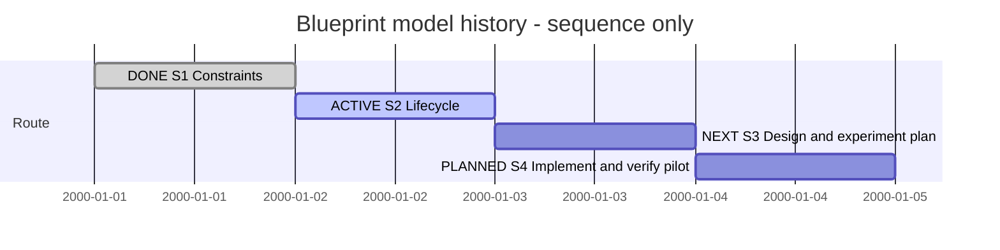

# Session 0005 — Blueprint model history

## Session roadmap

Latest recorded turn: T003. Earlier discussion is reconstructed below, not a
complete transcript. Sequence only; synthetic dates do not measure elapsed time.

| State | Step | Work | Authority / evidence |
| --- | --- | --- | --- |
| completed | S1 | Recover standalone history requirements | KB048; no Git/export prerequisite |
| on-going | S2 | Refine snapshots, merging, blueprints and command ownership | Owner discussion; KB048 recommendations and corrections |
| next | S3 | Select/revise bounded design and experiment plan | BP2 remains planned; implementation not selected |
| planned | S4 | Implement and verify an agreed pilot | Requires selected scope/plan; no backend delivered |

| Field | Value |
| --- | --- |
| Session reference | SESSION-SDP-0005 |
| Status | active |
| Primary card | KB-SDP-048 |
| Snapshot date | 2026-10-02 |
| Current step | S2 |
| Proposed next step | S3 after settling the minimal lifecycle and tool boundary |
| Execution authority | Owner authorizes discussion and immediate Session-instruction correction; model-store implementation remains unselected |

## Goal

Define a practical SDL/SDUI history and blueprint workflow independent of project
Git, whose immutable records survive transport through parent Git merges. Preserve
reviewed targets and distinguish model acceptance from implementation evidence.

## Affected cards

| Card | Role | Initial state | Planned final | Current | Actual final |
| --- | --- | --- | --- | --- | --- |
| [KB048](../KanBan/backlog/%23048--Proposal--Versioned-design-reviews-and-blueprint-diffs.md) | Primary | backlog at late registration | Bounded design with explicit implementation handoff | backlog | Pending |
| [KB004](../KanBan/backlog/%23004--Proposal--Design-traceability.md) | Context: evidence mappings | backlog | Not disposed by this discussion | backlog | Pending |

## Plan register

| Plan | Document readiness | Canonical lifecycle | Outcome |
| --- | --- | --- | --- |
| [BP2 / PLAN-SDP-0001](../04--Design/SDPTool/Blueprints/Plan.md) | ready, requires revision if selected | planned | Existing blueprint contract successor; not activated here |
| [MAINT-SDP-0014](../Maintenance/SC1/Plan.md) | completed | completed | Immediate Session-governance correction |

## Route changes and decisions

| Date / entry | Change | Authority / consequence |
| --- | --- | --- |
| 2026-10-02 / retrospective | Reject export/bundle dependency and project-Git prerequisite; investigate full snapshots | Owner constraint; earlier Git recommendation not adopted |
| 2026-10-02 / T001 | Mutable WORK, immutable history, base/parent identities | Design recommendation; no implementation |
| 2026-10-02 / T002 | Consider four workflow roles and same-file/candidate merging | Owner proposal; release cannot receive changes |
| 2026-10-02 / T003 | Optional PROPOSAL; default WORK -> CANDIDATE -> RELEASE; preliminary WORK blueprint without locking | Owner correction supersedes mandatory-freeze recommendation |
| 2026-10-02 / T003 | No UUID in WORK names; four-character suffix for PROPOSAL/CANDIDATE; full identity in YAML | Owner naming requirement; collision handling still required |

## Turn journal

All entries are manually summarized. Host turn IDs and precise timestamps are
unknown. Local T numbers are journal entries, not recovered host turn numbers.
No automatic routine engine or exact transcript capture is claimed.

### Retrospective context — before T001

The owner sought separate design history portable with parent Git and rejected
remembered bundle exports. SVN/Fossil raw-store merging did not satisfy parallel
history requirements. The assistant proposed project Git, then the owner clarified
that blueprints must work without Git/commits. Earlier analysis and bounded Git
storage-only probe are recorded in KB048; they do not prove a model-store backend.
Skills reported in earlier work: SDP change analysis and Architect. Missing original
Session upkeep is acknowledged, not retroactively represented as timely recording.

### T001 — Full snapshots and local checkout

Owner input summary: propose release directories, multiple WORK copies and local
file checkout/commit/pull. Assistant outcome summary: immutable revision identities,
optional local locks, conservative merging and explicit conflicting release labels.
Updated KB048/Study and event274. No model-store implementation. Session was omitted.

### T002 — Snapshot lifecycle and same-file merging

Owner input summary: UUID and SHA in YAML, browsable directories, WORK/PROPOSAL/
CANDIDATE/RELEASE, one integrator, and whether PROPOSAL is needed. Assistant outcome
summary: recommend frozen proposals/candidates and new identity after every merge;
record canonical hashing and three-way merge limits. Updated event275 and committed
analysis as c768564. Skills: SDP/Architect (agent-reported). Session still omitted.

### T003 — Correct Session upkeep, preview and naming; inventory tools

Owner input summary: immediately require Session updates in AGENTS and project
governance skill; allow preliminary WORK blueprints without locking; remove UUID
from WORK names and shorten proposal/candidate suffixes; default directly to
CANDIDATE; explain current SDL commands and SDPTool delegation.

No separate skill named
project_governance was found in the canonical collection or local skills search.
Updated the shared sdp entrypoint instead of adding a competing governance skill.

Request categories: process maintenance, architecture refinement, capability
inventory. Skills loaded/reused: sdp, sdp-architect, sdp-change-analysis,
sdp-planning and skill-creator; provenance is agent-reported, routine run ID unknown.

Work summary (not a captured final response): created this late-registered Session;
made per-turn upkeep explicit in AGENTS, sdp skill and Session guide; reconciled
skill patch metadata in the install inventory. Recorded latest owner corrections
in KB048/Study. Inspected SDL command entrypoints and SDPTool imports; standalone
SDL commands exist but SDPTool is not a universal plugin router. Snapshot/blueprint
commands are proposed only. Maintenance validation is recorded in SC1.

Next: refine S2 tool ownership and minimum command contract, then select S3. No
backend implementation, published release or consuming-project upgrade is claimed.

Additional owner steering in T003: identified SDL/go/cmd as the command location.
Confirmed: these are standalone Go program entrypoints; shared packages implement
the behavior and SDPTool imports several directly. This does not imply every
SDPTool operation has a separate standalone executable.

## Closeout

Open. Model history/blueprint goal is not achieved. The immediate Session upkeep
correction is complete separately from the feature discussion.
