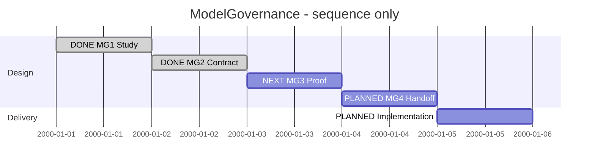

# Session 0006 — ModelGovernance

## Session roadmap

Latest recorded turn T002. Next: MG3-M1 bounded filesystem proof. Synthetic sequence
only; dates below are slots, not scheduling estimates or measured durations.

| State | Step | Work | Evidence / prerequisite |
| --- | --- | --- | --- |
| completed | S1 | Consolidate study and separate feature | MG1-M1, KB049/KB050 split |
| completed | S2 | Define minimal schema, operations and supported SDL design | MG2-M1; initial Design.md ready for refinement |
| next | S3 | Exercise filesystem/recovery/merge proof | MG3-M1, after MG2 |
| planned | S4 | Write bounded ImplementationPlan | MG4-M1, informed by proof |
| planned | S5 | Implement and verify vertical slices | Successor plan not yet authored; no delivery claimed |

| Field | Value |
| --- | --- |
| Session reference | SESSION-SDP-0006 |
| Status | active |
| Primary card | KB-SDP-049 |
| Snapshot date | 2026-10-03 |
| Current step | S2 delivered |
| Proposed next step | S3 / MG3-M1 |
| Execution authority | Owner requests new feature, active card, study and design preparation |

## Goal and scope

Deliver bounded SDL/SDUI model governance: mutable WORK, local commit/whole-state
recovery, integration, immutable candidate/release and metadata lineage retention.
Independent of project Git. Semantic blueprint generation is a separate feature;
ModelGovernance provides source views/identities for it. No full VCS or selective
undo across branches. Model design, implementation and acceptance remain distinct.

## Affected cards

| Card | Role | Initial | Planned final | Current | Actual final |
| --- | --- | --- | --- | --- | --- |
| [KB049](../KanBan/active/%23049--Change--Model-governance.md) | Primary | New, active/in-progress | completed after verified delivery | active/in-progress | Pending |
| [KB050](../KanBan/backlog/%23050--Proposal--Semantic-blueprints.md) | Separate consumer | backlog | Outside this Session | backlog | Pending |
| [KB048](../KanBan/superseded/%23048--Proposal--Versioned-design-reviews-and-blueprint-diffs.md) | Historical source | backlog before split | superseded | superseded | Scope transferred |

## Plan register

| Plan | Readiness | Canonical lifecycle | Outcome |
| --- | --- | --- | --- |
| [PLAN-SDP-0016](../04--Design/SDPTool/ModelGovernance/Plan.md) | on-going | active | Study, detailed contract, proof and implementation handoff |
| Successor ImplementationPlan | planned, not created | Not registered | Production vertical slices after design/proof |

## Design documents

- [Study](../04--Design/SDPTool/ModelGovernance/Study.md): decision summary and rejected alternatives.
- [Design](../04--Design/SDPTool/ModelGovernance/Design.md): initial behavior, storage and ownership contract.
- [Session0005](session-%230005--Blueprint_model_history.md): earlier discussion and explicit handoff.

## Route changes and decisions

2026-10-03 T001: separate ModelGovernance from Blueprints, with formal KB split.
Use current branch and milestone commits. Preserve untracked work from other scopes.
Detailed product command/schema choices remain design work, not automatic acceptance.

## Turn journal

### T001 — Establish ModelGovernance

Capture: manual summary; host IDs/timing unknown; no automatic routine enforcement.
Owner input: create new session and active card, study and design under
SDP/04--Design/SDPTool/ModelGovernance; separate semantic Blueprints.
Skills loaded/reused: sdp, sdp-planning, sdp-architect (agent-reported).

Work summary, not a captured final response: created Study.md, Design.md and active
PLAN-SDP-0016. Split KB048 into KB049 (active/in-progress) and KB050 (backlog), retaining
all historical discussion and links. Session0005 closes by transfer; this Session
starts delivery planning. MG1-M1 complete; no product implementation. Management,
Toolkit and whitespace checks validate document consistency only.

Next: MG2-M1 fixes the minimal YAML/commit format, rollback and merge transaction
rules, discovery boundary and supported SDL model. Then prove the risky operations
in temporary directories and prepare implementation slices.

### T002 — Contract and composed SDL model

Owner prompt: "ok fortsett". Manual journal; host/routine IDs unknown.
Skills reused: sdp, Architect, Planning. Delivered MG2-M1 Contract.md with explicit
storage, command, recovery, promotion and preview limits. Authored four-file SDL
concern entry without touching the concurrent routine System.design. Canonicalized
with the frontend; check passes with no warnings and static VP01/VP02/VP08 generate
9 diagrams. See Evidence.md for exact revision, commands and parser corrections.
These are design/structural results, not implemented transaction behavior.

Concurrent Session0007/KB038/management records existed and changed during this
turn. Preserve those edits; this milestone stages only its own ledger append and
artifacts. Next MG3 tests the risky storage assumptions before MG4 handoff.

## Closeout

Open. Feature is not implemented. No merge to main, release or XFMD change performed.
