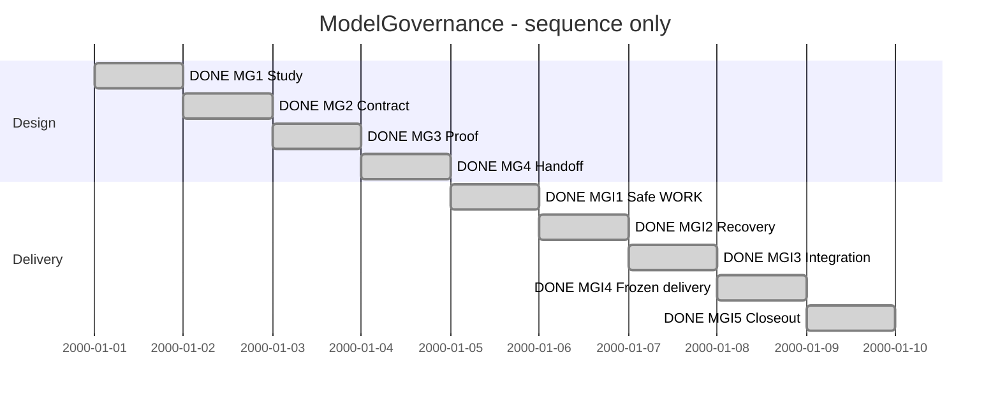

# Session 0006 — ModelGovernance

## Session roadmap

Latest recorded turn T005. All five implementation phases completed under PLAN-SDP-0019. Synthetic sequence
only; dates below are slots, not scheduling estimates or measured durations.

| State | Step | Work | Evidence / prerequisite |
| --- | --- | --- | --- |
| completed | S1 | Consolidate study and separate feature | MG1-M1, KB049/KB050 split |
| completed | S2 | Define minimal schema, operations and supported SDL design | MG2-M1; initial Design.md ready for refinement |
| completed | S3 | Exercise filesystem/recovery/merge proof | MG3-M1, after MG2 |
| completed | S4 | Write bounded ImplementationPlan | MG4-M1, informed by proof |
| completed | S5 | Safe WORK creation | PLAN-SDP-0019 MGI1-M1; delivered |
| completed | S6 | Commit and whole-state recovery | MGI2-M1 after MGI1 |
| completed | S7 | Integrate WORK sources | MGI3-M1 after MGI2 |
| completed | S8 | Candidate/release lifecycle | MGI4-M1/M2 after MGI3 |
| completed | S9 | Discovery, full journey and independent review | MGI5-M1/M2 after MGI4 |

| Field | Value |
| --- | --- |
| Session reference | SESSION-SDP-0006 |
| Status | goal achieved |
| Primary card | KB-SDP-049 |
| Snapshot date | 2026-10-05 |
| Current step | S9 delivered |
| Proposed next step | Owner selects next feature or release preparation |
| Execution authority | Owner authorized all five implementation phases |

## Goal and scope

Deliver bounded SDL/SDUI model governance: mutable WORK, local commit/whole-state
recovery, integration, immutable candidate/release and metadata lineage retention.
Independent of project Git. Semantic blueprint generation is a separate feature;
ModelGovernance provides source views/identities for it. No full VCS or selective
undo across branches. Model design, implementation and acceptance remain distinct.

## Affected cards

| Card | Role | Initial | Planned final | Current | Actual final |
| --- | --- | --- | --- | --- | --- |
| [KB049](../KanBan/completed/%23049--Change--Model-governance.md) | Primary | New, active/in-progress | completed after verified delivery | completed | completed |
| [KB050](../KanBan/backlog/%23050--Proposal--Semantic-blueprints.md) | Separate consumer | backlog | Outside this Session | backlog | Pending |
| [KB048](../KanBan/superseded/%23048--Proposal--Versioned-design-reviews-and-blueprint-diffs.md) | Historical source | backlog before split | superseded | superseded | Scope transferred |

## Plan register

| Plan | Readiness | Canonical lifecycle | Outcome |
| --- | --- | --- | --- |
| [PLAN-SDP-0016](../04--Design/SDPTool/ModelGovernance/Plan.md) | completed | completed | Study, detailed contract, proof and implementation handoff |
| [PLAN-SDP-0019](../05--Implementation/SDPTool/ModelGovernance/Plan.md) | completed | completed | All five production phases; evidence and independent review recorded |

## Design documents

- [Study](../04--Design/SDPTool/ModelGovernance/Study.md): decision summary and rejected alternatives.
- [Design](../04--Design/SDPTool/ModelGovernance/Design.md): initial behavior, storage and ownership contract.
- [Session0005](session-%230005--Blueprint_model_history.md): earlier discussion and explicit handoff.

## Route changes and decisions

2026-10-03 T001: separate ModelGovernance from Blueprints, with formal KB split.
Use current branch and milestone commits. Preserve untracked work from other scopes.
Detailed product command/schema choices remain design work, not automatic acceptance.

## Turn journal

### T001 — Establish ModelGovernance

Capture: manual summary; host IDs/timing unknown; no automatic routine enforcement.
Owner input: create new session and active card, study and design under
SDP/04--Design/SDPTool/ModelGovernance; separate semantic Blueprints.
Skills loaded/reused: sdp, sdp-planning, sdp-architect (agent-reported).

Work summary, not a captured final response: created Study.md, Design.md and active
PLAN-SDP-0016. Split KB048 into KB049 (active/in-progress) and KB050 (backlog), retaining
all historical discussion and links. Session0005 closes by transfer; this Session
starts delivery planning. MG1-M1 complete; no product implementation. Management,
Toolkit and whitespace checks validate document consistency only.

Next: MG2-M1 fixes the minimal YAML/commit format, rollback and merge transaction
rules, discovery boundary and supported SDL model. Then prove the risky operations
in temporary directories and prepare implementation slices.

### T002 — Contract and composed SDL model

Owner prompt: "ok fortsett". Manual journal; host/routine IDs unknown.
Skills reused: sdp, Architect, Planning. Delivered MG2-M1 Contract.md with explicit
storage, command, recovery, promotion and preview limits. Authored four-file SDL
concern entry without touching the concurrent routine System.design. Canonicalized
with the frontend; check passes with no warnings and static VP01/VP02/VP08 generate
9 diagrams. See Evidence.md for exact revision, commands and parser corrections.
These are design/structural results, not implemented transaction behavior.

Concurrent Session0007/KB038/management records existed and changed during this
turn. Preserve those edits; this milestone stages only its own ledger append and
artifacts. Next MG3 tests the risky storage assumptions before MG4 handoff.
Staged whitespace checking additionally found generator-produced trailing blank
lines in Markdown; evidence records this limitation, and outputs remain unedited.

### T003 — WORK-local filesystem proof

Owner prompt: "ok fortsett". Manual work summary; host/run IDs unknown.
Loaded/reused sdp, Worker and Verifier. Implemented a standalone Go design probe
under experiments/model_governance, not SDPTool product commands. All 13 top-level
tests passed with race instrumentation (five merge subcases), plus vet. Tests compare
reconstructed file contents, preserve dirty checkpoints, force a child process to
exit before head publication, reject corruption and strip restore payloads at
promotion. One test compares Git's standalone three-file merge primitive; no project
Git repository needed. Presence check distinguishes a missing empty file from a
retained empty file. Proof.md and raw result/hash files bound the evidence.

No independent review, full schema, general crash safety, concurrent-writer safety,
release conflict resolution or application acceptance claimed. Next MG4 converts
these remaining obligations into implementation milestones and acceptance tests.

### T004 — MG4 implementation handoff

Owner prompt: "ok fortsett med mg4". Manual work summary; host/run IDs unknown.
Skill reused: sdp-planning with SDP/architecture context. Created PLAN-SDP-0019:
five phases, seven milestone deliveries, per-milestone commits on one implementation
branch, acceptance tests for every recorded MG3 gap, explicit review and platform
limits. No mandatory Git binary or manual source-registration file. Full blueprint
analysis and publication remain excluded. Checked actual CLI/discovery routing to
identify compatibility and concurrent ProjectGovernance integration boundaries.

MG4-M1 delivered; PLAN-SDP-0016 completed. KB049 becomes active/ready, successor plan
planned. Management/Toolkit validators and diff checks pass. No product execution or
new runtime tests claimed. Roadmap expanded S5-S9 from the authored plan, not invented
dates. Next MGI1-M1 safe WORK vertical slice. Session stays active for that goal.

### T005 — Execute all five implementation phases

Owner requests all phases overnight. Skills: sdp/master/worker/verifier/planning;
manual journal, no host IDs or automated routine claim. Implementation authorized;
main merge/release remain outside scope.

MGI1-M1: WORK creation/status and strict metadata foundation implemented, with staged area-locked publication. SDL/SDUI validation and recovery library scaffolding included but later CLI operations not yet exposed. Full SDPTool test suite passes.

MGI2-M1: Commit/history/whole-state restore and explicit recover resume/abort CLI implemented. Race tests pass, including child-process interruption at prepared/backup/installed boundaries, dirty preservation, corrupt payload and external edit refusal. Backups retained; physical power-loss and non-Linux mutation not claimed.

MGI3-M1: Native bounded Go three-way merge, combined WORK creation, persistent conflict inventory and resolved commits implemented. Tests cover disjoint and overlapping same-file edits, unrelated bases, dirty inputs, repeat integration without extra events, three archive generations and whole-state rollback. No external Git merge dependency.

MGI4-M1: Frozen candidate/proposal CLI now validates real SDL source graphs and SDUI using existing parsers, preserves metadata lineage and drops undo payloads. Model tests pass. Independent review found dirty-capture identity and file/directory restore defects; regression fixes and stricter domain validation are included, with final re-review pending.

MGI4-M2: Release promotion requires candidate validation and explicit model-only or verified evidence attribution. Default WORK resolves the unique accepted head; stale and competing releases fail closed. Model tests pass including actual two-clone Git transport. Review fixes add abort of unjournaled staging and base64 conflict values with bounded YAML round-trip validation before publication.

MGI5-M1: Artifact-aware discovery exposes kind, UUID and preliminary role, prunes only owned histories and transaction staging, and preserves ordinary projects. Read-only snapshot returns captured bytes/digest without a commit. Full SDPTool tests pass, including compiled no-Git CLI lifecycle with real SDL/SDUI validation and copied-area inspection. Provenance now includes local author/acceptor attribution, original names and merge/restore references.

MGI5-M2: Integrated candidate fd7033b passes SDPTool race suite and vet, SDL parser/sourcegraph and SDUI parser tests, compiled CLI lifecycle, and Windows amd64/macOS arm64 cross-builds. Independent fresh-context review approves bounded Linux implementation after regression fixes. Child-process recovery covers dirty restore at six boundaries. Canonical SDL activity is implemented and nine viewpoint diagrams were regenerated; product release/main merge remain excluded.

T005 work summary (manual, not a captured final response): all milestones delivered.
Independent review identified and verified fixes for dirty capture IDs, file/directory
restore, unreadable binary conflicts and unrecorded staging recovery. Source-derived
viewpoints rebuilt after marking delivery implemented. Backlog review retains KB050
for semantic blueprints; no scope transfer into this implementation.

## Closeout

Goal achieved for bounded ModelGovernance. All steps S1–S9 completed; KB049
completed, KB048 superseded, KB050 retained in backlog as separate scope.
See the ImplementationPlan Evidence.md and Review.md. No main merge, product
release, installer migration or XFMD change performed. Further feature/release
work requires its own selected plan.
