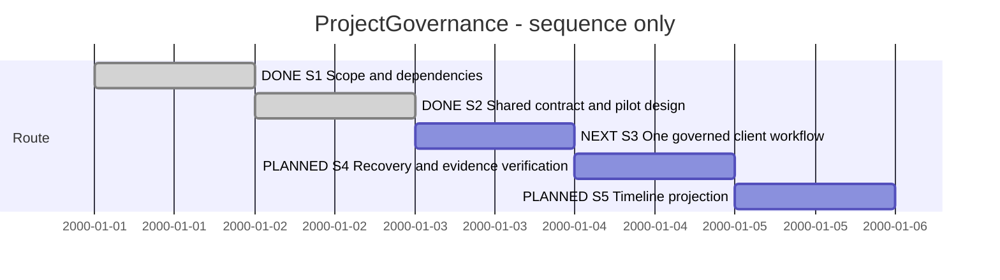

# Session 0007 — ProjectGovernance

## Session roadmap

Latest recorded turn: T002 — PGD1 design delivered. Next: S3, the bounded PGI1-M1
core increment under planned PLAN-SDP-0018. The design is complete; implementation
has not started and the participating capabilities are not complete.
Sequence only; synthetic dates represent order, not estimates or elapsed time.

| State | Step | Work | Prerequisite / authority | Outcome / evidence |
| --- | --- | --- | --- | --- |
| completed | S1 | Recover skills, studies, card dependencies and ownership | Owner request, 2026-10-03 | Assessment below; RGS2 reused |
| completed | S2 | Design the smallest common routing, run, Session and client contract | Owner continuation, T002 | [PGD1 / PLAN-SDP-0017](../04--Design/SDPTool/ProjectGovernance/Plan.md), contract, acceptance cases and protocol inspection |
| next | S3 | Deliver one end-to-end workflow through SDPTool and the Codex client | S2 complete; [PLAN-SDP-0018](../05--Implementation/SDPTool/ProjectGovernance/Plan.md) planned | Start with PGI1-M1; no client or routine engine delivered here |
| planned | S4 | Verify interruption, resume, scope change and evidence disposition | S3 candidate | Evidence required before wider use |
| planned | S5 | Project recorded activity into the KB043 timeline | Reliable S3/S4 capture and selected rendering scope | Full timeline remains deferred |

| Field | Value |
| --- | --- |
| Session reference | SESSION-SDP-0007 |
| Status | active |
| Primary card | [KB-SDP-038](../KanBan/backlog/%23038--Proposal--Codex-app-server-development-client.md) |
| Snapshot date | 2026-10-03 |
| Current step | S2 completed; S3 next |
| Proposed next step | S3 / PGI1-M1: runnable core and CLI fixture |
| Execution authority | Owner continuation in T002 selected the proposed S2 design and implementation handoff; PGD1 complete, PGI remains planned |

## Goal and ownership

Owner definition, summarized from the current prompt: ProjectGovernance covers
method, methodology and tools that keep collaboration between the owner and Codex
agents organized. KB036, KB037, KB038, KB042 and KB043 belong to this workstream.
Retain the existing ProjectGovernance ecosystem; its name does not require one
monolithic binary or a second process tree.

The owner reports another agent is handling ModelGovernance. That workstream owns
model artifacts, identities, checkpoints, merge and promotion, as described in its
[current design](../04--Design/SDPTool/ModelGovernance/Design.md) and
[Session 0006](session-%230006--Model_governance.md). ProjectGovernance owns work
selection, collaboration, routine applicability, work progress and disposition.
It references model identities and evidence when relevant; a successful model
operation does not automatically complete an assignment or establish owner approval.
No ModelGovernance files or contracts are changed by this turn.

## Affected cards

Snapshot: 2026-10-03. Planning/recommendation does not activate implementation cards.
No card is merged, split or closed merely to group this workstream.

| Card | Role | Initial lifecycle / CardState | Planned outcome in this route | Current snapshot | Actual final |
| --- | --- | --- | --- | --- | --- |
| [KB038](../KanBan/backlog/%23038--Proposal--Codex-app-server-development-client.md) | Primary client and execution integration | backlog / backlog | One usable governed workflow | backlog / backlog | Pending |
| [KB036](../KanBan/backlog/%23036--Proposal--Request-routines-and-process-control.md) | Request classification and routine selection | backlog / backlog | Small shared entry contract exercised by pilot | backlog / backlog | Pending; broader coverage retained |
| [KB037](../KanBan/backlog/%23037--Proposal--Observable-routine-state-machine.md) | Durable run state, transitions and observation | backlog / backlog | Minimum run/recovery core | backlog / backlog | Pending; full observer retained |
| [KB042](../KanBan/backlog/%23042--Proposal--Goal-oriented-sessions-and-roadmaps.md) | Session identity, roadmap and turn history | backlog / backlog | Capture/correlation beyond existing manual format | backlog / backlog | Pending |
| [KB043](../KanBan/backlog/%23043--Proposal--Event-derived-session-timelines.md) | Derived timeline | backlog / backlog | Later projection of observed events | backlog / backlog | Pending |

## Plan register

| Ref | Plan / record | Document readiness | Canonical lifecycle | Role |
| --- | --- | --- | --- | --- |
| P0 | [PLAN-SDP-0007](../02--Requirements/RoutineGovernance/StudyPlan.md) | completed | completed | Reused RGS2 study; not reopened |
| P1 | [PLAN-SDP-0017](../04--Design/SDPTool/ProjectGovernance/Plan.md) | completed | completed | S2 contract, inspection and implementation handoff |
| P2 | [PLAN-SDP-0018](../05--Implementation/SDPTool/ProjectGovernance/Plan.md) | ready | planned | PGI1–PGI5 bounded runnable increments; not started |

## Dependency assessment and recommended first delivery

T001 assessment retained below. T002 delivers the shared design and handoff linked
in the plan register; remaining runtime acceptance belongs to PGI.

Reuse the completed [RGS2 synthesis](../02--Requirements/RoutineGovernance/Synthesis.md).
KB036 should precede client behavior at the contract level, but finishing all of
KB036 before starting KB038 is unnecessary. Machine-supported routing benefits
from the client-owned submission boundary in KB038; durable transition validation
belongs to KB037's SDPTool core. These responsibilities are complementary.

1. Define a minimum KB036 contract: classify an incoming request, reuse applicable
   work and authorization, select a versioned routine, and expose missing coverage.
   Reassess steering inputs that change scope. A status question should remain easy.
2. Define the KB037/KB042 identities and ownership together: project/checkout,
   Session/step, request, routine version/run, assignment/attempt, candidate and
   evidence, mapped to Codex thread/turn/item IDs. Pin state transitions, revision
   checks, retry handling and interruption/reconciliation. Keep ProjectManagement
   lifecycle and Traceability evidence authoritative; no rival history store.
3. Exercise that contract through a minimal KB038 client and the shared SDPTool
   core, using an adapter boundary for agent operations. Start with one controller,
   a simple status view, and one bounded Maintenance workflow. Preserve existing
   role responsibilities; choose and test actual delegation/context behavior in
   the pilot. This discussion does not request spawning agents now.
4. Capture real turn/item/activity identity and timestamps from the beginning, with
   explicit unknowns, then build KB043's richer timeline after reliable capture.
   Do not infer elapsed activity or routine compliance from a message or file alone.

First workflow acceptance proposal: owner request -> visible routing/work coverage
-> bounded assignment -> actual execution observations -> evidence/review disposition
-> durable Session result. Include a status-only request, a scope-changing input,
an interrupted/resumed attempt, repeated delivery, and stale candidate evidence.
Codex completion, tool success, independent review and owner acceptance stay distinct.

The manual Session format is already adopted; Session discovery/browsing also has
existing implementation and tests in SDPTool. These are starting assets, not proof
of an automated Session recorder or routine engine. Full KB040 KanBanTUI, KB020
source migration, KB050 semantic blueprints and ModelGovernance completion are not
prerequisites for this proposed pilot. Use explicit task/context/evidence references
first; integrate richer model references through the other workstream's contract.
KB014 distribution/versioning becomes relevant to broader installation, rather
than blocking an isolated local pilot.

## Route changes and decisions

| Date / turn | Change | Authority and consequence |
| --- | --- | --- |
| 2026-10-03 / T001 | Start ProjectGovernance assessment from KB038; group KB036/037/042/043 | Owner direction; preserve separate card responsibility |
| 2026-10-03 / T001 | Retain ModelGovernance as a separately progressing workstream | Owner reports another agent; inspect its contract without edits |
| 2026-10-03 / T001 | Minimum shared contract first, then one client workflow; richer timeline later | Agent recommendation, not an approved full implementation sequence |

| 2026-10-03 / T002 | Owner continues S2; PGD1 delivers contract and planned PGI handoff | Observed owner continuation; implementation not started |

## Turn journal

### T001 — 2026-10-03: scope, skills and dependencies

- Capture mode: manual owner-input and work summaries. Host thread/turn/item IDs
  and exact prompt timing are unknown. Local T001 is not a host identifier.
- Owner input summary: read AGENTS and SDP skills, prepare for backlog work,
  prioritize KB038, assess whether KB036 should precede it and where KB042/043
  belong. Define ProjectGovernance as methodology/tooling for owner-agent
  collaboration; another agent owns ModelGovernance.
- Category: orientation, dependency analysis and architecture/planning discussion.
- Skills loaded (agent-reported): sdp 1.1.1, sdp-change-analysis 1.0.0,
  sdp-architect 2.0.0, sdp-planning 1.0.0, sdp-traceability 2.0.0, and OpenAI Docs
  (no skill version declared). Shared workflow, authority source map and planning
  contract read. No routine-run ID or runtime-enforcement evidence exists.
- Skills authority: root Skills is maintained; .agents/skills provides discovery;
  historical SDP/History skills are not the active collection.
- Steps touched: S1 completed; S2 named next. Reused existing studies and inspected
  relevant cards, ecosystem boundaries, ModelGovernance design and Session tests.
- External evidence: [official app-server documentation](https://learn.chatgpt.com/docs/app-server),
  accessed 2026-10-03, documents thread/turn/item operations and version-specific
  schema generation. This supports the proposed capture boundary. It does not
  verify the locally installed protocol, account access or the proposed pilot.
- Work summary, not a captured final response: recommend a small KB036/037/042
  contract feeding the KB038 pilot, retaining KB043 as a later projection. Record
  owner-defined ProjectGovernance scope and independent ModelGovernance ownership.
- Validation: `python3 SDP/ProjectManagement/validate.py` passed after the card
  update and EVT-KB-SDP-000286: 61 cards, 35 management records, four lineage
  operations and 474 events. `git diff --check` passed. Product code/tests are unchanged.
- Remaining work: S2 must settle concrete operation/storage contracts, supported
  Codex compatibility and the bounded implementation sequence. No new model turn,
  account configuration, application implementation, merge or release performed.

### T002 — 2026-10-03: shared design and bounded implementation handoff

- Capture mode: manual journal; host thread/turn/item identifiers and exact prompt
  time unknown. Exact owner input: “ok fortsett” (verbatim Norwegian quotation).
- Category: continuation of selected S2 planning/design. Reused SDP 1.1.1,
  planning 1.0.0, architect 2.0.0, change-analysis 1.0.0, traceability 2.0.0 and
  OpenAI Docs instructions already loaded in T001; read relevant plan template,
  schemas, code and current records. Agent-reported routine use; no runtime run ID.
- S2 outcome: PLAN-SDP-0017 delivered Design.md, 18 mapped acceptance scenarios,
  offline codex-cli 0.160.0 default-schema inspection (314 files) and the planned
  PLAN-SDP-0018 handoff. Its first milestone is a bounded core/CLI fixture; later
  phases cover adapters, owner workflow, evidence reconciliation and integrated review.
- Decisions/recommendations: shared SDPTool Go core; one local controller and simple
  terminal interface; private durable operational state referencing canonical project
  records; checked recoverable document publication; actual native child/reviewer
  provenance required. These are design choices for the pilot, not observed runtime.
- KB038 was active/in-progress during PGD1 and returned to backlog after design
  delivery, now linked to the planned implementation. KB036/037/042/043 remain
  backlog with reciprocal design/Session references and preserved broader scope.
- The other agent committed ModelGovernance MG2 during this turn. Its files and
  committed ledger bytes were preserved. Only this workstream's unpublished KanBan
  event IDs were reallocated above the committed counter, and its draft events
  appended after the committed prefix before delivery. No frozen history rewritten.
- Work summary, not a captured final response: design and implementation sequence
  ready; no application implementation, account operation, model turn, release or
  independent product review claimed. Traceability records the design separately
  from management transitions. Validation results are in PGD1 Evidence.md.
- Next: S3 / PGI1-M1 under PLAN-SDP-0018. Establish an isolated implementation
  checkout and a compatible Go toolchain, then execute the core slice when selected.

## Closeout

The Session remains active. S1 and S2 are complete. PGD1 design delivery does not
complete any participating capability; cards retain backlog scope. S3 begins with
PGI1-M1 under the planned implementation handoff.
