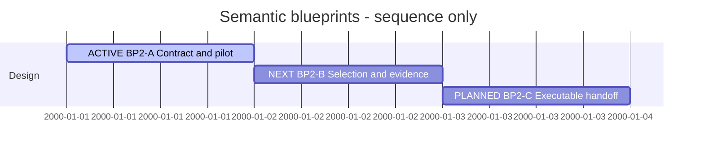

# Session 0008 — Semantic blueprints

## Session roadmap

T001, 2026-10-06. Sequence only; dates are display slots, not duration estimates.

| State | Step | Outcome | Evidence / remaining work |
| --- | --- | --- | --- |
| on-going | S1 / BP2-A | Contract and real-model pilot | Contract candidate and validated reduced MVP1 specimen delivered; owner feedback on pilot pending |
| next | S2 / BP2-B | Deterministic impact selection and negative cases | NOW/TARGET union, removed neighbors, unknown frontier, stale/overflow/cycle cases |
| planned | S3 / BP2-C | API and implementation handoff | Bounded implementation plan and permitted worker/reviewer trial |

| Field | Value |
| --- | --- |
| Session reference | SESSION-SDP-0008 |
| Status | active |
| Primary card | KB-SDP-050 |
| Snapshot date | 2026-10-06 |
| Execution authority | Owner says continue after the proposed KB050 pilot route |

## Goal

Design the first useful semantic blueprint around a small real-model change,
then hand off measurable implementation slices. The eventual generator must show
NOW/TARGET differences, affected surroundings, preserved obligations and unknowns.
This Session's active plan is a DesignPlan; no production generator or Ponsse
implementation is claimed by producing model specimens.

## Cards and plans

| Card | Initial | Planned final | Current | Actual final |
| --- | --- | --- | --- | --- |
| [KB050](../KanBan/active/%23050--Proposal--Semantic-blueprints.md) | backlog | completed after implemented/verified blueprint feature | in-progress | pending |

| Plan | Readiness | Lifecycle | Outcome |
| --- | --- | --- | --- |
| [PLAN-SDP-0001](../04--Design/SDPTool/Blueprints/Plan.md) | on-going | active | Contract, selection and executable handoff design |
| Successor ImplementationPlan | planned | not created | Generated blueprint delivery after BP2-C |

## Turn journal

### T001 — Start design and exercise MVP1 input snapshots

Owner input: continue the recommended next step. Skills loaded/reused: sdp,
sdp-planning and sdp-architect. Manual work summary, not exact host transcript;
no automatic routine enforcement or fabricated host identity is claimed.

Recovered KB050/BP2 and completed ModelGovernance. Found the actual MVP1 source
uses experimental sdl-mvp1-exercise/0.1, so did not pretend a raw directory copy is
accepted by the production parser. Authored a clearly reduced design-core/0.6
specimen retaining MachineService/BuckingWeb/BuckingUI and an explicit simplified
contract. TARGET extracts calibration ownership within MachineService. The owner
has not yet reviewed this particular proposed change.

Compiled existing tools from committed 043c59c in temporary storage to avoid
concurrent ProjectGovernance edits affecting pilot evidence. Both snapshots pass
canonical parser checks. Real model-only release -> dirty WORK -> preliminary
snapshot -> candidate succeeds with matching capture/promotion digest. Ordinary
VP02/VP03 are generated by the SDL toolkit; no semantic blueprint generator exists
yet. Initial drafts failed canonical/request-contract checks and were corrected
before the retained successful evidence.

[Contract candidate](../04--Design/SDPTool/Blueprints/Contract.md) and
[pilot evidence](../04--Design/SDPTool/Blueprints/Pilot-MVP1-evidence.json) describe
scope and limits. Parallel ProjectGovernance work is preserved; Git policy reuses
the current branch without a shared checkout switch, with isolated staging.

Next: BP2-B impact-selection/evidence design and negative cases. BP2-A awaits
feedback on its specific pilot; this does not block independent selection design.
Main merge, publication and XFMD/Ponsse application changes are not selected.
