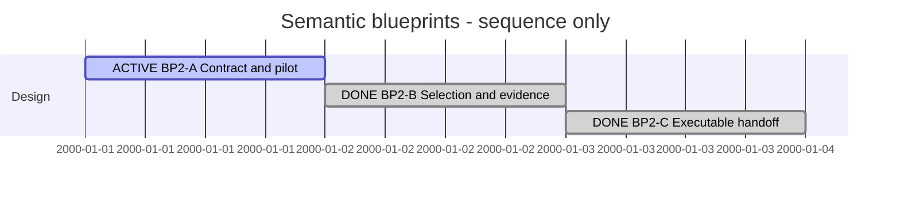

# Session 0008 — Semantic blueprints

## Session roadmap

T008, 2026-10-08. Sequence only; dates are display slots, not duration estimates.

| State | Step | Outcome | Evidence / remaining work |
| --- | --- | --- | --- |
| on-going | S1 / BP2-A | Contract and real-model pilot | Contract candidate and validated reduced MVP1 specimen delivered; owner feedback on pilot pending |
| completed | S2 / BP2-B | Deterministic impact selection and negative cases | NOW/TARGET union, removed neighbors, unknown frontier, stale/overflow/cycle cases |
| completed | S3 / BP2-C | API and implementation handoff | Authored model Worker/Reviewer trial; A approved, violating B rejected |
| completed | S4 / BPI1 | Production Go analysis | Go analyzer delivered; independent review approves bounded BPI1 |
| on-going | S5 / BPI2 | Publication and catalogue | M1 delivered; M2 next: retained revisions and discovery tab |
| planned | S6 / BPI3 | Evidence and lifecycle | M1 generated-bundle trial; M2 revision-bound state transitions and navigation |

| Field | Value |
| --- | --- |
| Session reference | SESSION-SDP-0008 |
| Status | active |
| Primary card | KB-SDP-050 |
| Snapshot date | 2026-10-07 |
| Execution authority | Owner says continue after the proposed KB050 pilot route |

## Goal

Design the first useful semantic blueprint around a small real-model change,
then hand off measurable implementation slices. The eventual generator must show
NOW/TARGET differences, affected surroundings, preserved obligations and unknowns.
This Session's active plan is a DesignPlan; no production generator or Ponsse
implementation is claimed by producing model specimens.

## Cards and plans

| Card | Initial | Planned final | Current | Actual final |
| --- | --- | --- | --- | --- |
| [KB050](../KanBan/active/%23050--Proposal--Semantic-blueprints.md) | backlog | completed after implemented/verified blueprint feature | in-progress | pending |

| Plan | Readiness | Lifecycle | Outcome |
| --- | --- | --- | --- |
| [PLAN-SDP-0001](../04--Design/SDPTool/Blueprints/Plan.md) | on-going | active | Contract, selection and executable handoff design |
| [PLAN-SDP-0020](../05--Implementation/SDPTool/Blueprints/Plan.md) | on-going | active | BPI1 analysis, BPI2 publication, BPI3 assignment evidence |

## Turn journal

### T001 — Start design and exercise MVP1 input snapshots

Owner input: continue the recommended next step. Skills loaded/reused: sdp,
sdp-planning and sdp-architect. Manual work summary, not exact host transcript;
no automatic routine enforcement or fabricated host identity is claimed.

Recovered KB050/BP2 and completed ModelGovernance. Found the actual MVP1 source
uses experimental sdl-mvp1-exercise/0.1, so did not pretend a raw directory copy is
accepted by the production parser. Authored a clearly reduced design-core/0.6
specimen retaining MachineService/BuckingWeb/BuckingUI and an explicit simplified
contract. TARGET extracts calibration ownership within MachineService. The owner
has not yet reviewed this particular proposed change.

Compiled existing tools from committed 043c59c in temporary storage to avoid
concurrent ProjectGovernance edits affecting pilot evidence. Both snapshots pass
canonical parser checks. Real model-only release -> dirty WORK -> preliminary
snapshot -> candidate succeeds with matching capture/promotion digest. Ordinary
VP02/VP03 are generated by the SDL toolkit; no semantic blueprint generator exists
yet. Initial drafts failed canonical/request-contract checks and were corrected
before the retained successful evidence.

[Contract candidate](../04--Design/SDPTool/Blueprints/Contract.md) and
[pilot evidence](../04--Design/SDPTool/Blueprints/Pilot-MVP1-evidence.json) describe
scope and limits. Parallel ProjectGovernance work is preserved; Git policy reuses
the current branch without a shared checkout switch, with isolated staging.

Next: BP2-B impact-selection/evidence design and negative cases. BP2-A awaits
feedback on its specific pilot; this does not block independent selection design.
Main merge, publication and XFMD/Ponsse application changes are not selected.

### T002 — Impact selection and evidence (2026-10-07)

Owner input: continue. Skills reused: sdp, Planning and Architect. Manual work
summary, not a host transcript. Delivered BP2-B-M1 selection/evidence contract
and an experimental selector consuming the actual toolkit AST, without product
parser/CLI changes. Eight tests pass: NOW/TARGET union and deleted ownership,
atomic channel/payload closure, authored context/frontier, cycles, overflow,
stale identity, missing endpoint and valid-SDL ownership drift (formatting/source
positions are also separated from semantic facts).

The first missing-endpoint expectation failed: the real parser permits that model.
The experiment now reports a separate unknown-peer diagnostic. This evidence
strengthens the design requirement; no parser behavior was silently changed.
Prose distinguishes complete proposed production obligations from the smaller
experiment, whose cycles include a labeled synthetic normalized graph fixture.
Concurrent ProjectGovernance changes remain untouched and excluded from this commit.

[Selection contract](../04--Design/SDPTool/Blueprints/Selection-and-Evidence.md)
and [evidence](../04--Design/SDPTool/Blueprints/Selection-evidence.json) capture
results. BP2-B is delivered; BP2-C is next. BP2-A's particular pilot still awaits
explicit owner feedback, with no main merge, release or product generator claimed.

### T003 — Producer and handoff (2026-10-07)

Owner input: continue with next. Manual work summary, not exact host transcript.
Skills loaded/reused: sdp, Planning, Architect, Master, Worker and Reviewer.
BP2-C defines the SDL analysis / SDPTool capture and publication boundaries,
deterministic bundle identity, separate readiness/authority and failure semantics.
PLAN-SDP-0020 is created as a planned three-phase implementation successor.

The coordinator performed the bounded Worker model-edit trial on temporary copies.
A fresh independent Reviewer approved A and rejected the deliberately injected
protected-ownership violation in B, although both pass the actual parser.
Reproduction produces byte-identical evidence. The reviewer found no material
contradiction in the proposed design and successor plan. This is an authored
assignment trial; it does not prove generated-bundle or production-code behavior.

See [review](../04--Design/SDPTool/Blueprints/Trial-review.md).
BP2-C is delivered; BP2-A still awaits specific owner pilot disposition.
KB050 remains in-progress; production implementation, main merge and publication
are not claimed. Concurrent governance/SDUI changes are excluded from this milestone.
Verification: project-management validator and Toolkit validator pass; staged
whitespace check passes. Only this milestone and its own appended ledger events
are staged.
Next: select BPI1 Go analyzer implementation, preserving the explicit pilot gate
and leaving full code/evidence mapping in its owning workstream.

### T004 — Catalogue and assignment progress (2026-10-07)

Owner asks whether XFMD can already visualize a blueprint and requests an SDP
Blueprint sub-tab listing assigned, in-progress and implemented work. Manual
discussion summary, not exact transcript. Skills: sdp and Architect.

Confirmed the current blueprint delivery is design/experiments, not a production
generator or catalogue. Recorded the requested consumer workflow and a proposed
source-discovered SDP/Blueprints catalogue in Producer-and-Handoff.md. Recommend
stable task/blueprint and revision identities, work-state projection from canonical
management records, and separate freshness/readiness/evidence badges. Parent-card
state cannot establish individual blueprint implementation. The detailed lifecycle
and retention convention remain recommendations, not owner-approved contracts.

Affected steps: S5/BPI2 publication and S6/BPI3 assignment evidence need catalogue
design refinement before execution. S4/BPI1 remains next for the pure analyzer;
no implementation, XFMD edits, merge or publication occurred this turn.

### T005 — Catalogue scope selected and plan revised (2026-10-07)

Owner asks to extend the existing card and update plans to implement the catalogue.
Skills: sdp, Planning and reused Architect context. Manual work summary.
Extended KB050 and PLAN-SDP-0020 with BPI2-M2 catalogue/discovery and BPI3-M2
assignment lifecycle, observable acceptance and failure cases. Updated producer
design status to distinguish selected scope from remaining detailed schema design.

Retained revisions, source-derived discovery and canonical management history
replace a manual index or mutable status in generated documents. Added explicit
multiple-assignment, stale-input, reviewed-completion and missing-reference cases.
Native XFMD changes remain externally owned. No new card/plan or production code
was needed. BPI1 remains next; the implementation plan remains planned.

### T006 — Commit selected catalogue plan (2026-10-07)

Owner reports restored Git access. Reused SDP planning and Session routines.
Recovered the pending T004/T005 design, card and plan changes; scoped staging
excludes concurrent ProjectGovernance and SDUI work, including their ledger events.
This turn records the catalogue planning delivery, not BPI2/BPI3 implementation.
Project-management and Toolkit validation passed during T005; recheck before commit.
Next remains BPI1 implementation. No main merge or release is selected.

### T007 — BPI1 implementation (2026-10-07)

Owner asks to continue following the plan. Loaded/reused sdp, Master, Worker,
Planning, and independent Reviewer. Work proceeds on sdp/blueprint-implementation
in /tmp/sdp-blueprint-implementation from 3d265d1. The original shared worktree
remains on its branch with concurrent ProjectGovernance/SDUI changes untouched.

Implemented an I/O-free Go analyzer using checked sourcegraph snapshots, typed
semantic facts, union closure, task constraints and source provenance. Initial
tests exposed fixture mistakes (pilot System name, a parser-forbidden directed
cycle and source-path naming); fixtures were corrected to supported inputs.
Independent review requested changes for missing zero-participant diagnostics,
change permissions/protection scope, typed output and coverage. Those findings
were addressed and regression tests added; final independent review approves the bounded analyzer with exact source hashes
retained in Evidence-BPI1.md.

Parser/sourcegraph/blueprint race suites and blueprint vet pass after fixes.
This is component evidence only. BPI2 publication/catalogue and BPI3 lifecycle
remain planned; no production CLI, GUI, model-to-code proof or release claimed.

BPI1-M1 is delivered. Next is BPI2-M1 document publication, followed by the
BPI2-M2 catalogue. Worktree-local plan and Session are authoritative for this
implementation branch; the original concurrent worktree is preserved.

### T008 — Blueprint document production (2026-10-07/08)

Owner asks to continue. Reused SDP Master/Worker and independent Reviewer routines.
BPI2-M1 runs on the same isolated branch/worktree. Implemented source capture,
reachable SDL compilation, diagnostic bundle generation, shared publication and
human/JSON CLI output. No catalogue discovery is claimed yet.

Independent review confirmed an output/source overlap bug through a symlinked model
area; fixed by rejecting input ancestry symlinks, with a no-source-write regression.
Added identity-bound entrypoint and compiler/executable provenance. A second review
found protection IDs containing slashes lost visual PRESERVE marks; fixed using
exact task prefixes with a regression. Final focused review approves the diagnostic
publication scope. The generated SDPTool source model passes the existing checker.

A real compiled command generated the reduced MVP1 blueprint. Full context rendering
was terminated after several minutes under concurrent load, so it is not recorded as
a successful visual check. Added a source-derived small delta diagram as the first
view while retaining the complete context. Selected-diagram rendering and broad test
completion are recorded separately in milestone evidence. No GUI acceptance,
readiness, assignment lifecycle or release is inferred.

T008 result: BPI2-M1 delivered and independently approved. Selected delta SVG
rendering and visual inspection succeeded. Broad race run passed all reported
SDPTool packages except installer, which timed out in an unchanged recovery test;
raw evidence preserves the incomplete check. It remains outstanding for final
integration. Next BPI2-M2 catalogue/discovery; no native XFMD tab yet.
