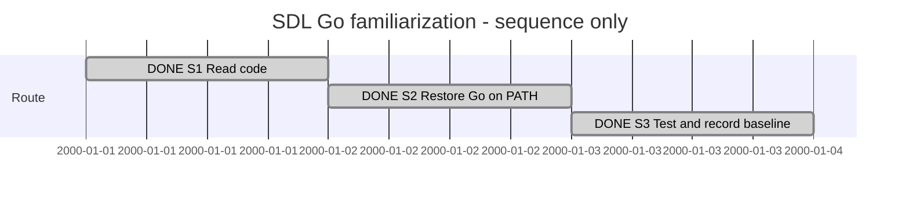

# Session 0009 — SDL Go familiarization

## Session roadmap

Latest recorded turn: T001, 2026-10-07. Late registration: previous conversation
work is reconstructed below. Sequence only; synthetic dates are display slots,
not elapsed time or delivery estimates.

| State | Step | Outcome | Authority / evidence |
| --- | --- | --- | --- |
| completed | S1 | Understand packages, key flows and test organization | Original owner request; reconstructed code-reading summary below |
| completed | S2 | Make Go and gofmt available on PATH | Explicit owner instruction; Go 1.27.1 and gofmt verified in a new shell |
| completed | S3 / FAM1-M1 | Run existing tests and record result and limitations | 14 test packages passed; [candidate and limits](evidence/0009-go-baseline/README.md) |

| Field | Value |
| --- | --- |
| Session reference | SESSION-SDP-0009 |
| Status | completed |
| Primary card | [KB-SDL-008](../KanBan/completed/%23008--SDL--Study--Go-code-familiarization.md) |
| Snapshot date | 2026-10-07 |
| Current step | None; FAM1-M1 complete |
| Proposed next step | None within this goal; await a concrete follow-up assignment |
| Execution authority | Owner request to familiarize with Go code, make Go available on PATH, then continue and update Session/goal |

## Goal

Become familiar with SDL/go package responsibilities and main workflows, make the
existing Go toolchain usable from PATH, and report the available automated test
baseline with explicit limits. Deliver a concise handoff and durable continuity.
This is familiarization, not an independent code review, product change, desktop
acceptance, release verification or continuation of another agent's active goal.

## Affected cards and plan register

| Card | Initial lifecycle / CardState | Planned final | Current | Actual final |
| --- | --- | --- | --- | --- |
| KB-SDL-008 | active / in-progress at late registration | Completed bounded study | completed | completed |

The direct Study card contains FAM1-M1 scope, completion criteria and Git policy.
No standalone typed plan or Sprint is needed. Sessions 0007 and 0008 belong to
other goals and are not changed by this work.

## Reconstructed prior work — registered 2026-10-07

Manual summaries from the visible conversation, not exact transcripts. Host
thread, turn and item IDs and exact earlier times are unknown.

- 2026-10-02: owner requested familiarity with the Go code. Loaded SDP entrypoint
  and document workflow; inspected README, parser, sourcegraph, viewpoints,
  documents, broker, runtime, bridge, codegen, reload/devhost and central tests.
  Reported that `go test ./...` could not start because `go` was absent from PATH
  and the few conventional installation locations checked. No code was changed.
- 2026-10-03: working-directory question only; no substantive work.
- 2026-10-06: owner challenged the toolchain conclusion. Found the working
  Go 1.27.1 installation under ~/.local/share/sdp-toolchains/go1.27.1/go;
  repository verification evidence documents previous use via its absolute path.
  Corrected the earlier overly narrow search conclusion.
- 2026-10-07: owner authorized PATH availability. Created non-overwriting symlinks
  for go and gofmt in ~/.local/bin, already on PATH. Verified command lookup,
  version, GOROOT and formatting in a fresh shell. No repository code changed.

Session upkeep was missing in these earlier turns. This registration does not
claim that a Session journal or goal was already maintained at those times.

## Code-reading handoff

Structural inputs flow through parser and sourcegraph into validated snapshots,
then viewpoint projections and documents. Broker coordinates on-demand selection,
cache/leases and stale-request checks; reader provides the XFMD handoff. Action
models use explicit typed Go registry bindings in runtime; bridge connects SDUI
callbacks and result handles. Codegen emits model constructors. Model reload
preserves Go-owned domain state; devhost builds and restarts on Go source changes.
The untracked sourceinput package was already present and has no import from the
other Go packages inspected; it is preserved as existing local work.

## Turn journal

### T001 — Resume tests and correct continuity, 2026-10-07

- Capture: manual work summary; exact host IDs/times and routine-run ID unknown.
- Owner input summary: continue the task and confirm Session and Session goal
  are updated. The visible original task is Go code familiarization.
- Request classification: resume bounded inspection/verification and repair its
  missing continuity record. No implementation scope was added.
- Skills loaded/reused (agent-reported): sdp 1.1.1, its document workflow,
  sdp-verifier 2.0.0, sdp-planning 1.0.0 and its plan contract for card/Git upkeep.
  No automatic routine enforcement or independent review is claimed.
- Steps affected: S3; S1/S2 registered retrospectively with explicit provenance.
- Work summary: recovered existing Sessions, confirmed no matching goal, created
  this separate Session and primary Study card, and started the existing suite
  with `GOMAXPROCS=2 go test -race -count=1 -p 2 ./...` from SDL/go.
- Outcome: all 14 test packages passed, exit 0, with race detection. Corrected
  the progress-message count of 15 by counting the actual `ok` lines.
  [Evidence](evidence/0009-go-baseline/README.md) records candidate and limitations.
- Management validation passed after registration. Closure and local links are
  checked before the scoped FAM1-M1 documentation commit.
- Next step: none within this goal; await a concrete follow-up assignment.

## Closeout

Goal achieved for bounded familiarization and test baseline. S1–S3 and
KB-SDL-008 are completed. External-renderer/desktop acceptance is not claimed.
No implementation plan or successor task was selected. This is a work summary,
not a captured final response or owner acceptance of broader product behavior.
