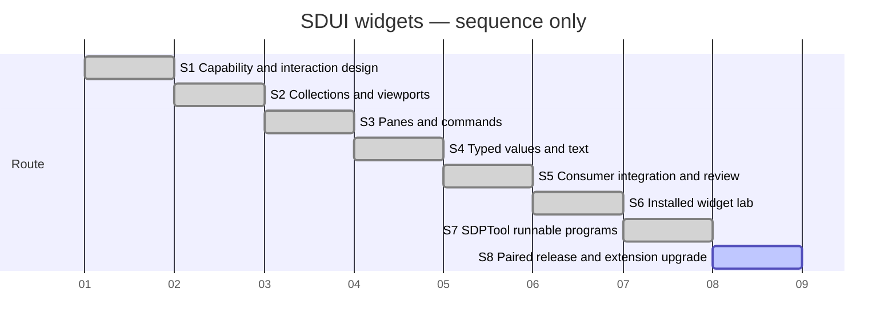

# Session — SDUI widget inventory

## Session roadmap

Latest recorded turn: T011. S1–S7, the combined main integration, independent installed lab and SDPTool
program discovery/launch are completed.
WCI1/WCI2 are implemented, verified and independently reviewed; WCI3 scalar fields and extended text are delivered and independently reviewed; WCI4 is delivered and independently reviewed. Diagram is **sequence only**, using synthetic equal
slots; it is not a delivery schedule or measured timeline.

| State | Step | Work and linked plan milestone | Prerequisites | Authorization | Completion evidence / outcome |
| --- | --- | --- | --- | --- | --- |
| completed | S1 | PLAN-SDP-0021 WCD1 and PLAN-SDP-0022 WCI0 | Existing gap study and inventory | Owner T001 | WCD1 independently reviewed and complete; WCI0 verified and independently reviewed |
| completed | S2 | PLAN-SDP-0022 WCI1 | S1 | Owner T001 full card | c39b330; Evidence-WCI1; 54 native checks; independent approval |
| completed | S3 | PLAN-SDP-0022 WCI2 | S2 pilot evidence | Owner T001 full card | 403c540 / 0fc15c8; 58 pane + 118 command native checks; independent approval |
| completed | S4 | PLAN-SDP-0022 WCI3 | Shared contracts from S1–S3 | Owner T001 full card | ea49991f / 69d0a332; Evidence-WCI3-M1/M2; independent approval |
| completed | S5 | PLAN-SDP-0022 WCI4 | S2–S4 | Owner T001; publication unselected | dcf2a74; Evidence-WCI4-M2; independent integrated acceptance |
| completed | S6 | KB-SDUI-006 / external PLAN-LAB-0001 LAB1 | Completed widget delivery | Owner T008 and full SDL/SDUI steering | Consumer 0946342; exact runtime db206bc; WIDGETLAB-VER-001, race suite and 26 native checks passed |
| completed | S7 | PLAN-SDP-0023 RSP1 / KB-SDP-051 | S6 installed lab | Owner T010 | 9963159; full race suite and actual gh-sdp/native SDL-Go route passed |
| on-going | S8 | MAINT-SDP-0015 / gh-sdp SPS-009 | S7 program delivery | Owner T011 | Release gate and independent review pending |

| Field | Value |
| --- | --- |
| Session reference | SESSION-SDP-0010 |
| Status | active |
| Primary card | [KB-SDUI-003](../KanBan/completed/%23003--SDUI--Proposal--Capabilities-and-navigation-pilot.md) |
| Snapshot date | 2026-10-07 owner request; actual ledger timestamps recorded separately |
| Current step | S8 release and extension upgrade |
| Proposed next step | Complete MAINT-SDP-0015 release gates, publish paired versions and upgrade gh-sdp |
| Execution authority | Owner T001 widget work, T006 combined main integration, T008 independent source-defined lab |

## Goal

Deliver the complete KB-SDUI-003 widget inventory in staged runnable slices,
with truthful profile/capability checks, native Fyne behavior, typed SDL binding,
exports and consumer distribution preparation. No full XFMD rewrite, FOX bridge,
rich editor or binary publication is selected. T006 separately authorized the
combined main merge; T008 extends the outcome with an independent installed lab
containing complete SDL/SDUI source and interpreted Go calls. Preserve original 0.2 and
XM-M2 evidence. Rich optional research retains its existing disposition.

## Affected cards

| Card | Role | Initial lifecycle / CardState | Planned final disposition | Current snapshot | Actual final disposition |
| --- | --- | --- | --- | --- | --- |
| KB-SDUI-003 | Primary | backlog / backlog at T001 | All inventory delivered, verified and reviewed | completed | completed |
| KB-SDUI-005 | Context-only dependency | active / gate-review in producer record | Retain separate preview ownership | Existing dirty producer changes preserved | Not disposed here |
| KB-SDUI-004 | Context-only | backlog | Separate glyph/wrapping fidelity work | backlog | Not disposed here |
| KB-SDP-051 | Successor program workflow | active at T010 | SDPTool discovers and starts the lab | completed | completed through PLAN-SDP-0023 |
| KB-SDUI-006 | Successor lab | backlog at T007 | Bounded independent consumer delivered | completed | completed through external PLAN-LAB-0001 |

## Plan register

| Local ref | Plan type and document | Document readiness | Canonical plan lifecycle | Depends on | Outcome / evidence |
| --- | --- | --- | --- | --- | --- |
| P1 | [PLAN-SDP-0021 DesignPlan](../04--Design/SDUI/Widgets/Plan.md) | completed | completed | PLAN-SDP-0009 research | Independently reviewed design and per-family acceptance |
| P2 | [PLAN-SDP-0022 ImplementationPlan](../05--Implementation/SDUI/Widgets/Plan.md) | completed | completed | P1, staged elaboration | WCI0–WCI4 delivered; Evidence-WCI4-M2; independent integrated acceptance |
| P3 | External PLAN-LAB-0001 ImplementationPlan in sdui_widget_lab | completed | completed | P2/main widget libraries | LAB1-M1/M2/M3; WIDGETLAB-VER-001; bounded source/race/native evidence, no independent review claim |
| P4 | [PLAN-SDP-0023](../05--Implementation/SDPTool/Programs/Plan.md) | completed | completed | P3 consumer | RSP1 discovery/run; final full race and native gh-sdp evidence |

External plan:
file:///home/warloc/git/sdui_widget_lab/SDP/05--Implementation/WidgetLab/Plan.md

## Route changes and decisions

| Date / turn | Previous route | Change and reason | Authority | Affected steps/cards |
| --- | --- | --- | --- | --- |
| T001 | Inventory only, execution unselected | Activate prerequisite design and staged full-card execution | Owner prompt below | S1–S5, KB-SDUI-003 |
| T008 | Completed widget delivery and proposed consumer | Select independent local installed repo; require full SDL/SDUI source and interpreted named Go functions | Owner placement reply and steering below | S6, KB-SDUI-006, external P3 |

## Turn journal

### T001 — take the widget work

- Capture mode: exact owner prompt below, manually recorded work summaries.
- Host thread/turn/item IDs and exact prompt time: unknown. Independent reviewer
  agent ID observed: `01a11854-523d-7c11-adf4-f622b19b68c6`.
- Request category: existing card execution. Routine run ID: unavailable; no
  claim of enforced routing. Skills loaded by coordinator: sdp 1.1.1,
  sdp-master 2.0.0, sdp-planning 1.0.0, sdp-architect 2.0.0, sdp-worker 2.0.0, sdp-traceability 2.0.0 and sdp-verifier 2.0.0.
  Paths: Skills/<name>/SKILL.md; loading is agent-reported. Reviewer separately
  reports sdp-reviewer use. Worker role is loaded for subsequent bounded execution.

Owner prompt, verbatim:

> kan du ta jobben som er beskrevet i kb-sdui-003?

Work summary (not an already captured final response): recovered the full revised
inventory, project contracts and relevant implementation. Intake HEAD `3d265d1`
has concurrent uncommitted governance and preview work; preserve those changes.
Created design/acceptance candidate, staged implementation plan and this Session.
Activated the card through management history. All widget delivery remains pending.
Independent initial inspection identifies typed item identity, atomic preparation,
explicit prototype/connected distinction and restricted SDL action types as design
requirements. Actual document review follows that inspection.

WCD1 update: independent document review identified three blockers; all were
resolved and the same independent reviewer approved bounded design completion.
[Evidence](../04--Design/SDUI/Widgets/Evidence.md) records the dispositions.
The management validator passed with 528 events; all local links in eight new or
moved documents resolved. This is design/record evidence, not widget delivery.

WCI0 implementation started in `/tmp/sdp-sdui-widgets`, branch
`sdui/widgets-wci0`, dependency baseline `00b105a`. The KB005 input snapshot has
an explicit hash manifest and its own dependency commit. Worker agent
`01a1185a-ed19-7793-989c-52fbe15b1f9d` implements only Preparation.md's detached
capability/admission boundary. Full native publication remains WCI1. No shared
branch switch or unrelated governance change is part of this work.

Remaining work and next step: inspect and verify the WCI0 candidate, then obtain
independent implementation review. Later grammar/native slices remain explicit
implementation obligations.

### T002 — 2026-10-08, continuation after permission interruption

- Owner prompt, verbatim: “ok fortsett”. The preceding access question was answered
  from the observed unrestricted environment; it did not change product scope.
- Capture: manually recorded work summary. Host thread/turn/item IDs and exact
  prompt times remain unknown. Routine run ID unavailable.
- Recovered Session0010 and reused sdp/master, planning, architect, worker,
  traceability and verifier routines loaded in T001; re-read sdp/master entries.
- T001 interruption correction: the scoped design patch reached the index, but
  its commit permission request was interrupted. Verified HEAD and index before
  continuing; committed WCD1 as `eae0149` without unrelated staged changes.
- WCI0 independent reviewer approved the exact inventoried candidate and reran
  targeted race/bridge tests. Coordinator inspected actual diffs, compared target
  baselines and copied ten reviewed implementation/test files into the shared tree.
  Phase commit `fac09f2` on `sdui/widgets-wci0` retains dependency `00b105a`.
- Full SDUI race tests and bounded SDL bridge/runtime checks pass. An unchanged SDL
  generated-constructor baseline mismatch is explicitly registered as a WCI1
  prerequisite investigation; no all-SDL-suite pass is claimed.
- Steps: S1 complete at its bounded level; S2 stage design started. Architect agent
  `01a11878-3e2d-7c32-98fb-69bee87297a4` owns only Collections.md. Worker investigates
  constructor mismatch read-only. All widget families remain pending.
- WCI1-P0 correction: worker identified stale generated constructors after KB005,
  regenerated through sdl-gen and added a compiled reuse/provenance regression.
  SDL codegen/bridge and SDUI codegen pass. Phase branch `sdui/widgets-wci1`
  starts with prerequisite commit `d1c5c88`; exact files integrated after baseline
  comparison. No frozen fixture or historical evidence was altered.
- WCI1 stage contract independently approved after correcting canceled/failed-load
  keyboard recovery and pruning mandatory SVG snapshots/general scene/custom row
  drawing. Export rejection remains explicit; all required interaction stays in scope.
- WCI1 implementation lanes in the isolated clone: frontend/export Dalton,
  runtime James (`01a11887-3b3f-7d11-9501-8c00902b9bdf`), layout Gibbs
  (`01a11887-8d55-74f3-bd58-7c6ea563b28e`), native/preparation/bridge Noether.
  Exclusive file ownership and an early shared API memo govern integration.
- Native tooling smoke: actual X11 click and Tab+space each reached the Fyne
  desktop driver, using separate Xvfb :189 and XDG area. This proves the input
  route only, not collection acceptance; see native/README in WCI1 evidence area.
- Milestone backlog review: KB-SDUI-004 remains independently owned text fidelity
  backlog; KB-SDUI-005 remains gate-review with delivered producer evidence. No
  onHold work displaced the selected widget route. The isolated clone lacks the
  uncommitted KB005 card; the canonical board review used the original workspace.
- WCI2 draft-only architecture lane: Lorentz
  (`01a11888-c963-7663-af5e-cd5a107a6715`) prepares Panes-and-commands.md in the
  original workspace. Execution still requires WCI1 pilot feedback and stage review.
- Main reused ProjectManagement and Toolkit validators; both pass after stage
  registration. No widget completion is inferred from record validation.
- WCI1 lane results: frontend/export and layout implementations have passed their
  scoped race checks; actual native integration/acceptance remains pending.
  Runtime/host recovery clarifies that a previously loading root paused by a
  compatible reload offers explicit Load/R, without automatic restart.
- WCI3 draft-only architecture lane: Dalton prepares Values-and-text.md after
  completing frontend code. Future-stage code remains gated by preceding pilot
  evidence and reviewed contracts.
- Native pilot build passed, but its first launch rejected the fixture SDL action
  declaration as noncanonical before window creation. No product native pass is
  claimed. Host geometry/input findings are being corrected; see Pilot-WCI1.md.
- Second native pilot reached real SDL activation, controlled retry/cancel/late
  completion and two compatible reloads. It is development feedback on an evolving
  candidate, not final acceptance. OS captures replace black Canvas.Capture output.
  A repeatable XTest harness is being established; host integration fixes remain.
- WCI1 adjacent consumer corrections: Dalton owns profile-aware helper/SDPTool
  metadata and SDL bundle generator provenance in the clone. Exact 0.3 support
  must never be mislabeled 0.2 or imply unavailable native providers.
- Host lifecycle handoff: Noether explicitly transferred document.go and a new
  lifecycle regression file to James. Reentrant error reconciliation, failed-resize
  recovery, clamped resource snapshots and focus restoration now pass scoped race
  checks. Actual empty-root native tests pass, including R after compatible reload.
- Native nested scrollbar overlap led to a bounded shared measurement refinement:
  optional frame/group viewport insets and explicit gutter rectangles. Independent
  reviewer approved before code; Gibbs owns layout and Noether owns adapters.
  Separate thumb reachability and final integrated evidence remain pending.
- WCI2 draft review resolved tab activation, dialog results and split minima. The
  next review prunes an unnecessary reconciliation API and separates future WCI3
  obligations. No WCI2 implementation is started from draft approval alone.
- Selected WCI2 nonmodal adapter has bounded standalone native experiment evidence
  in Widgets/nonmodal-probe: main drove XTest input and inspected OS captures.
  Parent interaction, draft revert, opener keyboard focus and five exactly-once
  terminal results passed. No WM decoration, SDL or SDUI product acceptance is
  claimed; WCI2 remains future work pending stage readiness and WCI1 completion.
- WCI1 gutter layout regressions and race checks passed; native adapter integration
  and separate thumb input are next. Expanded basic native pilot checks include
  horizontal Alt-arrow scrolling and keyboard/pointer retry on a selectable branch.
- Integrated working-candidate checks: coordinator ran the full SDUI race suite
  successfully, plus SDL bridge/runtime/codegen/collection fixture tests. The
  remaining visible-height PageUp/PageDown correction and final native candidate
  rerun are explicit; these passes do not yet close WCI1.
- Expanded nested native pilot passed all twenty checks, including independent
  scrollbar reachability and visible-height paging. Input-delivery pacing was
  corrected explicitly; provider synchronization still uses controlled barriers.
- Independent review found long diagnostic text could reject its own error-state
  layout. Host recovery fitting and visible compact R hint are being corrected;
  final candidate approval remains pending. Added native lifecycle verification
  for hide/disable, failed resize recovery and zero scroll ranges.
- WCI1-M1 delivered as phase commit c39b330. Independent reviewer verified all
  88 hashes, rebuilt the native binary identically and approved 54 native checks.
  Integrated original full SDUI race, affected SDL race and full SDPTool tests pass.
  Only SDPTool/sdui.go needed explicit KB005 Combined/source-bundle reconciliation;
  other candidate bytes match, unrelated work preserved. S2 is complete.
- Milestone backlog review retains KB004 glyph fidelity separately and KB005
  gate-review; no onHold item changes the selected full inventory route.
- Reviewer confirmed final WCI2 contract cf93dea6 with no design blockers.
  Coordinator starts S3/WCI2-M1 on sdui/widgets-wci2 using existing owner scope.
  Five exclusive lanes cover frontend, runtime, layout, host/preparation and SDL
  bridge/fixture. Shared identity/API memo precedes dependent changes.
- Next: integrate runnable tabs/split milestone and native acceptance before M2.
  Work summary, not captured final response; full inventory remains incomplete,
  and no release/merge authority is inferred.

### T003 — continuation after owner interruption notice

- Owner prompt, verbatim: “det ser ut som jeg avbrøt deg”. This steers continuity,
  not scope or authorization. Exact prompt time/host IDs unavailable.
- Recovered the existing Session and WCI2 lane/API records. Reused SDP Master,
  Worker, Architect and Verifier context. WCI1 remains delivered/reviewed; WCI2-M1
  changes are preserved in the isolated phase branch, but not yet verified.
- The interrupted call had updated the isolated IME probe launcher; native test
  processes and agent handles were no longer live on recovery. Restoring task
  workers/display explicitly; no product work or historical evidence discarded.
- Current work summary: resume the five exclusive WCI2-M1 lanes and native input
  preparation. IME investigation is provisional WCI3 design evidence only.
- WCI3 independent draft review identified typed result mode, atomic-form local
  Commit behavior, multiline scroll ownership and numeric tolerance omissions.
  Coordinator revised the provisional draft; re-review remains pending, no WCI3
  product implementation selected.
- Actual isolated IBus XIM probe reproduced pinned GLFW key leakage: composition
  Return submitted the old empty Entry before inserting the composed character.
  A one-condition filter trial prevented consumed Return/Escape delivery while
  preserving ordinary Enter/navigation. Durable Widgets/ime-probe retains source,
  patch, raw logs and hashes. Local dependency disposition awaits design review;
  no product dependency or desktop configuration was changed.
- WCI2-M1 native evolving-candidate pilots passed 25 panes, 11 horizontal split
  and 7 page/provider lifecycle checks. Captures confirm retained drafts/scroll,
  collapsed geometry and real SDL preview updates. Harness corrections preserve
  failure expectations; final source freeze/rerun and independent approval remain.
- WCI4 Architect draft Providers-and-packaging.md now records explicit provider
  and labelled fallback boundaries, exact module/private-helper package inventory,
  and conditional IME dependency packaging; draft-only and not product delivery.
  Current WCI3 numeric/form refinements remain under independent review.
- Next: complete runnable panes integration and verify/review before WCI2-M2.
- Further native checks passed the vertical split variant (nine checks). Final
  candidate testing found two bounded host omissions: native errors lost the
  interaction's domain outcome, and clicking the selected tab from an input did
  not focus the header. Both remain M1 corrections, with explicit native
  regressions; no milestone completion is claimed before correction/review.
- Full SDUI, affected SDL and SDPTool suites are running on the integrated phase
  candidate. Runtime prepares only a read-only M2 API handoff while M1 is frozen
  outside the host correction lane. Next remains final M1 evidence and review.
- Those suites passed, including SDUI host race (53.472s), actual SDL panes race
  (54.071s), bridge/runtime/codegen/collections and full phase SDPTool tests.
  Independent review additionally reproduced native selection divergence while
  the tabs owner is disabled. Host correction and actual-input regression are
  included before final acceptance; original integration target audit found no
  conflicting bytes among the 72 M1 files.
- WCI3 architecture review accepted exact-decimal membership, proposal-only
  number-step Commit in atomic dialog forms, and the bounded licensed GLFW IME
  patch route. Its final numeric correction requires step strictly greater than
  endpoint binary64 spacing to prevent midpoint ties collapsing ticks. Draft
  updated; WCI3 code remains subsequent to WCI2, with product IME proof pending.

- WCI2-M1 delivered at 403c540: 72 exact original-integration files, 58 native
  checks, full phase/original suites and independent approval. Backlog review
  retains KB004 and KB005 ownership. M2 final menu dismissal ordering is being
  reconciled with pinned Fyne before implementation; no main merge or release.

- Reviewer approved the final M2 contract 9a9c8710 after correcting the pinned
  Fyne dismissal order and replacing queued cleanup with synchronous per-opening
  selection scope. No additional probe is required for stage entry; native proof
  remains mandatory. Coordinator starts M2 on the existing phase branch with
  exclusive frontend/runtime/layout/host/bridge lanes; no duplicate SDL dispatch.

- M1 evidence/original handoff committed as f18fcc0. The isolated phase copy
  initially lacked the preceding scoped card/plan ledger events; its unpublished
  handoff commit is corrected with canonical event bytes and the card move/index.
  Phase validation passes with 526 events; original canonical history remains
  unchanged and passes with 538. Unrelated governance history is not imported.

- M2 seams are frozen for selected-root frontend identities, aggregate per-canvas
  layout, runtime MenuScope and native inspection. First native-menu adapter
  regressions pass; independent review found reused-model callback wrapping and
  disabled keyboard invocation defects, both assigned to host before integration.
- Native harness preparation adds real secondary click, WM close protocol and
  focus observation without forced focus. The WM close helper was exercised on
  the delivered pane fixture (clean close/teardown); this is tooling proof, not
  M2 acceptance. Separate :190 display has space for nonmodal windows.
- Next: finish the five M2 lanes, integrate the actual SDL command/dialog fixture,
  and run native command/context/modal/nonmodal/error/lifetime acceptance.

- Independent WCI4 draft review approved path-keyed immutable Markdown outcomes
  and explicit fatal-versus-fallback resource handling for future stage entry.
  WCI3 exact-number design now bounds coefficient digits and effective decimal
  exponents before arbitrary-precision conversion, including precise zero/trailing
  zero handling; compact exponents cannot bypass memory bounds. Product stages
  remain subsequent to M2 and still require actual native evidence.

- M2 frontend and layout lanes passed scoped race checks and froze their files.
  Independent runtime review found opener/remembered-focus fallback and inactive
  nonmodal key routing gaps; assigned corrections retain the reviewed behavior.
  Actual SDL fixture exposed the existing one-receiver connection invariant:
  distinct visible receivers are being used rather than weakening the parser.
- Native dialog imports require Fyne's already pinned fancyfs v0.0.1. Coordinator
  added only that indirect requirement and its two checksums to SDL/SDUI module
  roots; no dependency version upgrade or product patch. Host inspection alone
  transfers to the finished layout worker; core host ownership stays unchanged.

- Superseding independent M2 runtime/bridge checkpoint: focus/key routing,
  cross-pane command updates with reserved-owner protection, and strict snapshot
  schema projection corrections pass the five reviewer regressions. Independent
  runtime race passes (1.737s); corrected real SDL bridge race passes (2.198s).
  This is scoped approval; native host/frozen integrated acceptance remains open.
  Surface inspection tests found a scoped SVG inventory mismatch assigned to host.

- Continuation recovery reused sdp/master/verifier and preserved exclusive lanes.
  Actual pilot2 binary 3b5efbcc passes context (4 checks), modal and nonmodal
  dialog (7 each), failed acceptance (17), and nonmodal lifecycle (12). The
  focused-tree shortcut loss is corrected; hidden surface SVG inventory and
  button runtime focus corrections pass the inspector/full host race checks.
  These evolving-candidate results do not establish final M2 acceptance.
- Runtime adds exact-token forced RevokeSurface for a genuinely lost native
  owner, preserving stale replacement protection and bypassing fallible geometry.
  Independent review and final host freeze remain pending. Next: keyboard,
  focus and visible native proof, then exact-candidate verification/integration.

- Further M2 native pilots prove modal/nonmodal Tab order, parent modality and
  restored real keyboard focus (10 checks each), plus nine failed-command checks
  with truthful outcomes and retained accepted reentrant drafts. A late keyboard
  edge exposed GLFW's Shift-only dispatch; corrected pilot3 passes Shift+F10 and
  Entry shortcuts. Inspected OS captures confirm visible themed icon and actual
  dialog/context menu. The new A06 fixture proves three separate Escape levels.
- Main reconciled prior widget architecture/requirements documentation missing
  only from the isolated phase copy, with original baselines retained for safe
  integration. Future WCI3/WCI4 documents now truthfully record their existing
  independent design approvals while keeping product implementation unselected.
  Host's final keyboard edge corrections and exact-candidate freeze/review remain
  next; all later families and whole-card completion remain open.

- Candidate 22539389 passed all 110 command/surface native checks, 58 pane
  regressions, full phase/original suites, and an audit of 22 exactly-once
  published openings. Its 112 files were safely integrated with prior bytes
  backed up. Independent review then found a missing dynamic-parent case:
  root-sibling dialog source order selected the wrong native parent/size.
  M2 stays in progress; only host surface ordering and the bounded regression
  fixture are unfrozen. Prior evidence is retained as candidate-22539389,
  not final acceptance. A new actual nested-window workflow is required.
- One prior keyboard run emitted an upstream Fyne preference-load EOF while
  all behavior assertions passed; one fresh-configuration repeat passed without
  stderr. Both records are retained. A preferences watcher/write race is a
  plausible source-based explanation, not proven causality or a product patch.

- Recovery work summary: final candidate 2c1db6d1 passes 118 native checks, including
  actual dynamic-parent geometry and modal-child lifetime. Exactly 26 published
  openings have one terminal result each; all completed-run stderr is empty. Final
  SDUI/SDL race and original SDPTool suites exit zero. A runner interruption (143)
  is retained separately; remaining scenarios were rerun and passed. Source remains
  frozen pending final independent archive approval. WM native-owner closure is
  explicitly parent-closed/sequence zero; source Close/Cancel remains user-sequenced.
- Reused sdp/master/planning/verifier/architect/traceability. Independent reviewer
  approved WCI3 preimplementation refinements: closed-dialog draft discard overrides
  general successor retention, and only exact safe53 integer grids use uncapped
  uint64 ticks. No WCI3 implementation selected yet. Next: M2 reviewed delivery,
  then WCI3 scalar stage under existing whole-card authority.

- M2 delivery work summary: independent reviewer approved all 113 files, 70 archive
  entries and final native/suite evidence. Phase commit 0fc15c8 records product
  delivery; only two documentation status paragraphs changed after tested freeze.
  S3 is complete. WCI3-M1 selected under original full-card authority; bounded
  numeric/runtime, frontend, layout, host and SDL lanes continue on a new phase
  branch. No whole-card, merge or release completion is claimed.

- WCI3-M1 implementation is active in five disjoint lanes on sdui/widgets-wci3
  after evidence handoff a28b3cc (original cea7015); original/phase management
  validators pass 541/529 events. Main added held XTest pointer/key primitives
  and started scalar native workflows; these are unrun harness work, not evidence.
- Read-only consumer reconnaissance located actual XFMD helper build/install and
  protocol contracts. WCI4-consumer-preparation.md and its hashed inventory record
  the supplied external root without changing its dirty work. Final matching helper
  builds, licenses, protocol/native tests and packaging remain subsequent WCI4 work.

- Independent numeric checkpoint passed bounded-exponent, 445-grid rational-oracle
  and safe53 boundary checks. Typed runtime review found a real Apply batch-order
  issue for same-field value/readOnly writes; assigned to runtime owner, not waived.
- WCI4 launcher boundary reviewed: staged connected DocumentHost fixtures are the
  runnable 0.3 route; legacy standalone helper remains explicitly unsupported for
  those host adapters. Package matrix must distinguish this from absent providers
  and cannot claim XFMD Launch gains the new widgets. No launcher migration selected.
- Isolated IBus launcher preparation selects the real Simple engine successfully.
  D-Bus reports filesystem-watch permission diagnostics in this host environment;
  this is environment setup only, not clean-stderr or SDUI IME acceptance. Temporary
  display :191 was stopped; no owner desktop or package installation changed.

- M1 native pilot 78344a92 passes Boolean, choice, held-slider, action failures,
  reentrant observer, legacy text and mixed Go Accept failure workflows. Numeric
  typing/Enter passes, but actual step-button click failed. Host traced delegated
  Button renderer size to zero despite positive wrapper geometry and corrected
  Resize synchronization; pilot2 OS verification remains required. Fixture now
  uses explicit fill widths for meaningful native presentation. M1 stays active.

- Pre-review 0e92 candidate full SDUI/SDL/original SDPTool suites passed, but
  independent review found slider automatic-tap recapture and stranded held-key
  state after focus loss. Both bounded fixes pass independent regressions; actual
  native tap now confirms zero SDL calls. Harness completion barriers were hardened
  after detecting an intermediate-snapshot false positive; that run is excluded.
- Coordinator/reviewer approved already-required accepted-empty reload retention
  as a narrow contract refinement, with new-constraint/nonempty-invalid guards.
  Runtime and actual fixture corrections are scoped and reviewed. Reviewer also
  identified missing visible slider numeric value feedback required by the card;
  host correction is active. M1 stays in progress, final inventory/build/evidence
  pending. M2 opt-in/self-echo design is reviewed but product work remains unselected.

- Continuation work summary after interruption recovery: the visible slider numeric
  feedback delta is frozen and independently approved. Final binary 3c1abba7 is
  byte-identical across worker and coordinator builds. All 88 candidate paths
  match the original workspace after guarded integration of 11 changed files;
  unrelated work is preserved. The final slider native workflow passes 11 checks,
  including held proposal feedback, accepted value, Escape and silent programmatic
  replacement. Fresh full suites and the remaining native workflows are running.
  Reused SDP/master/verifier/traceability; S4 remains active, M2 still unselected.

- M1 delivery work summary: `ea49991f` records 88 exact files, 113 native
  assertions and 12 exactly-once results, with clean full suites and independent
  approval. One additional passing forms run emitted a preserved Preferences EOF;
  its same-binary isolated repeat is clean. No causal correction is claimed.
  WCI3-M2 is now selected under existing whole-card authorization, reusing the
  reviewed frontend/runtime/layout handoffs and bounded host preparation. Main
  owns the pinned X11 filter dependency and actual IME evidence. Reused
  SDP/master/planning/architect/verifier/traceability; S4 remains active.
  Next: implement and verify extended text, then WCI4 providers/package preparation.

- M2 native editing decision: coordinator and independent reviewer explicitly
  narrow the earlier draft history promise. Identical displayed bytes retain
  history; different programmatic text resets it. An actual rejected native edit
  restores the latest authoritative draft muted on the same focused Entry and may
  reset native history/caret/selection/scroll. Invalid-but-admitted drafts and failed
  Commit/reload/probe retain history. CR/LF paste is refused before delegation from
  the same captured clipboard bytes, including context menus. This is a reviewed
  design choice within basic editing scope, not a new owner quotation.

- WCI3-M2 implementation work summary: five bounded lanes are active after
  ea49991/d674274 (original handoff 277c3eb). The frontend opt-in helper and runtime
  projection API are on disk with initial component checks; no final freeze yet.
  Main added the pinned 145-file GLFW source with one X11 conditional change and
  explicit replacements in both native build roots. Independent provenance review
  and exact reverse-patch verification pass; real product IME evidence remains
  pending. No module-cache or external consumer source was changed.

- M2 checkpoints: independent frontend/runtime/layout reviews approve their frozen
  scoped candidates and legacy byte compatibility. Actual single-line Unicode
  workflow passes six checks. Multiline OS input exposed missing Ctrl+Shift+Z Redo
  mapping despite component tests; host fixed the exact custom-shortcut route, with
  native rerun pending. Cold native startup exceeded the initial 15-second test
  bound during parallel race tests; a bounded 45-second startup retry is underway,
  without treating the transient minimum diagnostic as a proven cause.

- M2 actual configured IBus/XIM pilot passes seven checks: preedit emits no draft
  or SDL action, consumed Return commits composition without Save, consumed Escape
  retains the prior draft, ordinary Return and explicit multiline Primary+Return
  save once. Fixture stderr is empty; isolated D-Bus/portal environment warnings
  remain explicit. Native history, paste guards, scrolling, retention, required
  text and dialog pilots also pass; final candidate audit remains open.
- WCI4 read-only API reconciliation found the existing composite SVG image route
  drops nested diagram images in pinned Fyne/oksvg. Coordinator/reviewer select
  truthful per-diagram label/reject before outcome freeze, retaining prose and
  requiring actual direct-SVG proof. Fyne Accessible adapter labels are selected;
  Linux screen-reader bridge delivery is explicitly unsupported/unverified. This
  fits the card’s preview-placeholder boundary and does not start WCI4 code.

- Interruption recovery work summary: owner noted an apparent interruption;
  continued the authorized card from the preserved checkpoint. M2 all five scoped
  lanes are independently approved, including the final text fixture race suite
  (508.408 seconds within its unchanged limit). Main and worker native binaries
  match SHA256 `0078f72eec7fe61bd41a1b090bb7ca2f26ba48c3a1e54c4eff6bd240c010f001`.
  Guarded integration copied 222 frozen source paths into the original workspace,
  retaining backups and unrelated work. Strengthened actual wrap/scrollbar pilot
  passes nine checks. Fresh final native matrix and aggregate suites are running.
  Reused SDP/master/verifier/traceability; S4/M2 stays active. WCI4 final geometry
  API is independently approved and recorded, with implementation still pending.

- Final M2 native work summary: all 13 fresh workflows pass 86 checks, with
  five published openings/five exactly-once terminal results and clean fixture
  teardown. Full SDUI race and original SDPTool pass. Final evidence inspection
  distinguishes the earlier SDL values/commands/panes passes on an older host
  from the current source; a bounded current-candidate rerun is now required and
  running. Text (508.408s), collections (18.031s) and non-Fyne current evidence
  remain valid. No product defect or code change is inferred from this evidence
  gap. S4 stays active until the final suite/archive review completes.

- Independent final raw audit verifies all 13 binary-bound runs, 86 checks, five
  exact receipts, actual nonmodal ownership and clean session teardown; inspected
  OS captures have no visual blocker. All 222 source hashes still match both roots.
  Overall acceptance waits for the current SDL group and faithful archive. A crossed
  asynchronous handoff briefly launched duplicate current-group tests; coordinator
  stopped only its own later invocation, retained its explicit aborted diagnostic
  record and continued the earlier worker run. No product failure is inferred.

- Late M2 integration finding: independent overlay reproduces accepted command
  and tab TextResult bindings to an extended read-only receiver executing SDL
  once, then rejecting UI publication with `field-conflict`/domain succeeded.
  interactionHandler omitted the captured draft revision required by extended
  fields. Earlier aggregate approval is suspended. The complete 0078 candidate
  archive is retained as `WCI3-M2-before-interaction-fix`; it proves its exercised
  paths but does not close this new cross-family failure. A bounded bridge guard
  correction, command/tab regressions and actual command-load native proof are
  assigned. No existing supported receiver route is silently replaced by a basic
  fixture workaround. S4 remains in progress; WCI4 implementation remains pending.

- Guard correction work summary: coordinator took the bounded Worker delta after
  closing the integration worker context. Exactly three paths change: captured
  draft guard, actual SDL integration regressions and a false-default command-load
  native CLI variant. The 224-file candidate matches both roots; independent
  rebuild matches binary 2579df7a. Targeted tests and fresh affected SDL race group
  pass (values 131.457s), with unchanged-source receipts. Independent same-event
  replay evidence supplements the committed no-automatic-replay assertion.
- A fresh context-menu paste run exposed an input readiness assumption: immediate
  navigation reached the Entry and triggered Save. The failed raw run is retained.
  Harness now observes Entry losing focus to the popup, captures the actual menu
  and preserves focus for its keys; same-binary corrected run passes with zero
  SDL calls and intact Undo. Reviewer accepts the bounded harness correction;
  the precise delay-versus-forced-focus cause is not claimed. Remaining native
  variants are running; no further product change or M2 completion yet.

- M2 delivery work summary: `69d0a332` records 224 exact paths, 92 native
  checks, 5 exactly-once results and independent integrated approval. Full
  SDUI race, affected SDL packages/fixtures and original SDPTool pass; actual XIM
  composition and history/scroll/dialog workflows are archived with earlier failed
  pilots and environment diagnostics. S4 is complete; S5/WCI4-M1 is selected under
  the existing full-card request. Reused SDP/master/planning/architect/verifier/
  traceability. The reviewed four-lane APIs and canonical backend/geometry matrix
  govern previews; main owns consumer packaging. Next: implement bounded prepared
  content and native previews, verify matching packages, then integrated closeout.

- WCI4 implementation work summary: phase sdui/widgets-wci4 starts from 90a94b5;
  M2 source/evidence is durable on origin/sdui/widgets-wci3. Five disjoint lanes
  implement frontend, immutable providers, shared layout, native host/preparation
  and a new actual SDL preview fixture. Main retains packaging/native evidence.
  The reviewed aggregate budget counts distinct copied/validated bytes before
  backend classification, with no label-policy refund; failed bytes need not stay
  resident. Same bytes across paths count once. Canonical/API wording is aligned.
- The unmodified external XFMD helper build recipe succeeds from clean 90a94b5
  in a detached worktree. A separate SDUI-root legacy-helper IME pilot passes eight
  checks using accepted A plus a dirty B suffix to detect premature submission.
  Latin-1 WM_NAME exposed a title-lookup harness issue; corrected lookup and all
  prior attempts are retained. This is preparation only: final WCI4 source/package
  must be rebuilt and retested. External checkout and installed helpers unchanged.
  Reused SDP/master/worker/architect/verifier; S5 remains in progress.

- WCI4 integration work summary: frontend, layout and host/preparation lanes are
  frozen and independently approved; their meaningful race suites pass. The actual
  SDL preview fixture compiles and its targeted race suite passes (244.019s).
  Native light-profile geometry pilot passes 13 checks, including supplied shapes,
  prose, actual Accessible labels, copied resource ownership, scroll translation,
  tabs and split restoration without renderer calls. A prior pilot failed only an
  exact float64/float32 clip comparison; retained raw evidence supports the 0.01px
  tolerance correction. Default dark rendering exposes the inherited fixed-glyph
  contrast limitation; reviewer accepts bounded light-profile proof and requires
  truthful documentation. Provider final-allocation fallback guard is still being
  tightened before freeze. Packaging and protocol harnesses are prepared; final
  exact-candidate package and all-family verification remain pending. Reused
  SDP/master/worker/verifier; S5 remains active, with no delivery inferred.

- Candidate-one work summary: guarded integration copied 67 scoped paths into the
  original workspace without changing unrelated work. Matching package preparation
  succeeds from 1,403 inventoried source paths; ten binaries, 34 compiled modules
  and 42 third-party notices are recorded, with full pinned GLFW source/policy and
  connected fixture sources. The supplied XFMD GUI test passes using all three
  staged executable paths verified by exec trace; its exact C++ build source is
  unknown, so this proves supplied-binary compatibility only. Packaged protocols
  pass 50 real commands/eight cases. These remain prior-candidate evidence.
- Native parent-hide exposed retained preview frame/resources and a phantom mounted
  inspector entry after real surface closure. Independent provider review also
  reproduces nonfinite transformed/extreme SVG geometry passing admission. Host and
  provider owners are correcting these bounded defects; their approvals are
  suspended. Main explicitly aborted its own SDUI aggregate run before source edits
  and retained logs/receipt. Earlier forms pilot failures include a corrected test
  field lookup and loss of the old X server; both are recorded separately. A fresh
  owned display is :191. Final packages/suites/native matrix will use the corrected
  frozen candidate. Theme observation is registered on separate backlog KB-SDUI-004
  as EVT-KB-SDUI-000027; no fidelity implementation selected. S5 remains active.

- Corrected candidate work summary: independent review approves the 16-path host
  freeze (including exact stale-opening protection) and 17-path provider freeze
  (actual coordinate/extents/reflected-control/arc finite checks). Main reconciled
  README/architecture/requirements with the implemented boundaries; those prose
  deltas are independently reviewed. Guarded integration now matches 74 scoped
  product/test/document paths in both roots, inventory 938ff22c. Matching candidate
  two packaging and fresh aggregate suites are running; 27 current native workflows
  are queued against its binaries. Prior failed/aborted/passed pilots, superseded
  source bytes and corrections are archived explicitly. Reused SDP/master/verifier/
  traceability; S5 still active until actual final results and integrated approval.

- M1 delivery work summary: `a026a5d1` records all 74 exact source/test/doc
  paths; matching candidate-two payload and 50 protocol commands pass independent
  review. Fresh modal/nonmodal native runs pass 24 checks and ten exact receipts,
  including corrected parent-hide/reload/close lifetimes. Source build metadata
  remains 90a94b5 plus the inventoried dirty bytes, now committed unchanged. M1
  is complete; M2 is active for the remaining current native matrix, aggregate
  suites and final integrated evidence review. Reused SDP/master/planning/verifier/
  traceability. S5/card/Session remain active; merge and publication unselected.

- M2 verification work summary: candidate two passes 26 native workflow
  assertion sets, packaged protocol and the supplied XFMD consumer binary. The
  helper IME job initially found an unmapped X window; waiting for actual
  IsViewable within the existing startup deadline passes all eight checks on the
  same binary. SDUI race and SDPTool suites pass. The combined SDL run times out
  in text after 600 seconds; an isolated unchanged-source retry is in progress,
  with the original failure retained and no increased timeout.
- Independent screenshot review finds negative-origin SVG pixels disagree with
  the fitted image despite passing aspect assertions. M2 remains open. Host
  preparation now receives a bounded correction in a detached worktree, retaining
  original identity and using a validated zero-origin native derivative. SVG2
  root-transform order is S × Rroot × Torigin × Cchildren. Actual raster tests
  also expose the pinned decoder's one-argument scale error; preparation-time
  normalization is authorized within the same admitted SVG contract. Added
  positive/mixed-origin and noncommuting root-transform fixtures are independently
  reviewed; actual OS pixel proof is being added. Candidate-two local archive is
  prior evidence, not the final deliverable. Reused SDP/master/worker/architect/
  verifier/traceability; S5/M2 remain active.
- Final integration boundary: the selected baseline already contains 73 prior
  unmerged commits. Preserve the selected branch history and create a draft
  combined PR with this dependency explicit after WCI acceptance. Do not claim
  review of the earlier baseline from widget evidence, merge, or publish.

- Final T003 work summary: completed corrected dcf2a74 verification and independent
  review. 28 applicable native workflows contain 321 checks and
  25 unique terminal results for 25 published openings; eight workflows
  use rebuilt package three and twenty retain explicitly applicable predecessor
  binaries. Full SDUI race passes 248.335s and SDL previews race 212.731s;
  unchanged SDL text isolated pass and earlier unaffected suites remain associated.
  Actual pixel coverage, both native IME recipes, 50 packaged protocol commands
  and supplied XFMD consumer compatibility pass. Prior timeout, unmapped-window
  failure and exact-RGB edge-oracle correction are retained. Only two historical
  status qualifiers changed after tested product source; no runtime rebuild claim.
  Reused SDP/master/worker/architect/planning/verifier/traceability; reviewer used
  independent SDP Reviewer context. S5/P2/card completed; no further widget work.
  Milestone backlog/onHold review retains KB004 backlog, KB005 separate gate-review,
  and optional/source-set proposals unselected. Next: finish authorized draft PR
  handoff with the inherited 73-commit dependency explicit; no merge/publication.

- Final handoff work summary: [draft PR #52](https://github.com/Hans-Einar/SDP/pull/52) targets main and
  preserves the selected phase history, with the 73-commit inherited-baseline
  dependency explicit. Both local integration and GitHub phase pushes succeeded.
  The owned Xvfb :191 process was stopped after every native workflow completed;
  its exact process/cleanup receipt is retained. S1–S5 remain completed. No merge,
  release or further widget work was performed; next disposition belongs to owner.

### T004 — clarify the inherited PR history

Owner prompt, verbatim:

> ok, hva vil det si? bygger 73 tidligere commits som må integreres først? jeg forstår ikke settningen.. PR 52 er avhengig av at 73 andre commits blir committed til main før PR #52?  hva menes med integreres først i denne sammenhengen

Capture mode: exact supplied prompt and coordinator work summary; host turn ID
and exact prompt timestamp unavailable. Discussion-only clarification, reusing
SDP entrypoint 1.1.1 and the manual Session routine; no new implementation scope.

Work summary: Git ancestry and the live PR confirm 91 commits absent from main:
73 inherited before baseline 3d265d1 and 18 subsequent widget/dependency/handoff
commits. The 73 are already committed and included in PR #52; they do not need
committing again. Earlier wording that they "must be integrated first" was too
strong: Git does not require a separate earlier merge. Merging the current PR
would bring both the earlier work and widgets into main together. Alternatively,
accept the earlier work through a separate integration first, leaving a narrower
widget PR comparison. The reason for draft status is the broader review/acceptance
scope; ancestry alone does not prove that widget code technically requires every
one of the 73 commits. No merge, rebase, PR edit or new integration decision is
performed or authorized by this clarification. S1–S5/card/plan remain completed;
next step is the owner's choice of integration scope.

### T005 — verify that the stopped FOX direction was not revived

Owner prompt, verbatim:

> aha. kan det være at du bygget det på de commits som vi egentlig hadde valgt å la være å bruke videre? altså at widgets skulle lages i FOX? for nå er målet å lage det i fyne. fox sporet ble stoppet

Capture mode: exact supplied prompt and coordinator work summary; exact host turn
ID/timestamp unavailable. Owner confirms Fyne is the selected goal and FOX is
stopped. Reused SDP entrypoint/Session workflow and loaded sdp-change-analysis
1.0.0 plus shared document workflow for a bounded source/history investigation.

Work summary: checked the stopped-direction hypothesis against governing decisions,
the selected baseline, refreshed origin/main and actual PR implementation. Main
9e4c173 and baseline 3d265d1 have the identical SDUI/go tree
57b6974fc3d1c267b0d8fa5d2fb6c23ea773d346. Their FOX handoff and Go implementation
plan are also byte-identical: the September 21–22 decision replaces Rust/C-ABI/FOX
with Go/Fyne, and that decision is already in main. SDUI-PLAN-003 explicitly
supersedes the old track. Current WCI design/plan excludes a new FOX host.

The PR changes 54 paths under SDUI/go/host/fynehost. Actual connected preview entry
constructs a Fyne application/window and fynehost.DocumentHost; both module roots
pin Fyne 2.8.1. No FOX identifiers were found in the searched SDUI Go source or
connected widget Go fixtures, and no FOX-named product paths changed in the WCI
range. The earlier 73-commit log instead contains routine-governance studies,
ecosystem models, SDL source composition, discovery/releases/Sessions, model
governance and blueprint work. This is not a technical endorsement of every prior
commit, but it rejects the hypothesis that widget implementation revived the
stopped FOX backend. XFMD consumer compatibility remains a separate existing-app
boundary, not a FOX widget implementation.

No code, branch history or PR content changed and no new tests were needed for
this source/history check. S1–S5/card/plan remain completed. The broader PR inclusion
scope still requires an integration disposition; no merge or earlier-work acceptance
is inferred from verifying the correct Fyne host choice.

### T006 — owner authorizes the complete PR into main

Owner prompt, verbatim:

> ta med alt du og få det til main

Capture mode: exact supplied prompt and coordinator work summary; exact prompt
clock/host IDs unavailable. Reused SDP/master and Session/document workflow.

Decision: include the entire PR #52 history, including the 73 inherited commits,
and merge it into main. This supersedes the earlier draft-only/separate-integration
boundary for this PR. It does not select unrelated uncommitted workspace work,
a release or publication of binary artifacts. Preserve the Fyne implementation
and phase history; use a merge commit rather than squash/rebase.

Pre-merge work summary: actual PR head236c539 is mergeable/CLEAN; both GitHub
checks (contracts and go-installation-linux) pass. Existing product/native evidence
remains applicable; only this discussion/authorization handoff is added. The
original worktree contains concurrent dirty work, so integration uses the isolated
phase checkout and GitHub PR. Recheck checks on the final exact head before merge.
The GitHub PR merge receipt is authoritative for the actual merged SHA/time;
authorization alone is not recorded as an already completed merge.

T006 final work summary: [PR #52](https://github.com/Hans-Einar/SDP/pull/52) merged at
2026-10-08T15:19:04Z as `04f88ff918e7c25c9fa1883f061ef20b8c3923a2`. Both exact-head GitHub checks passed
(contracts and go-installation-linux). Refreshed origin/main equals that merge;
the authorized head ea03e8b and inherited baseline 3d265d1 are ancestors, and
main's file tree exactly equals the checked PR head. All inherited 73 commits and
the widget/decision commits are included with history preserved. The shared dirty
worktree was not switched, reset or swept into the PR. No release was published.
S1–S5 and the requested integration are complete; no next action is outstanding.

### T007 — assess release readiness and a complete widget test project

Owner prompt, verbatim:

> ok. skal vi release en ny versjon av SDPTool og med andre ord gh sdp nå? finnes det et test prosjekt med SDP katalog som inneholder SDL og SDUI hvor alle widgets kan testes? kanskje det burde vært et sånn test prosjekt under experiments/ ?

Capture mode: exact supplied prompt and coordinator work summary; exact host IDs
and prompt timestamp unavailable. Assessment and proposal registration, not a
publication decision. Reused SDP entrypoint/Session/document workflow and loaded
sdp-release 2.0.0 and sdp-versioning 2.0.0 for release assessment.

Work summary: inspected actual GitHub releases (SDP v2.1.0 and gh-sdp v0.2.1),
release notes/checklist/package recipe, connected widget examples and experiments.
Six real Fyne applications cover the families; no unified SDP-bearing runnable
all-widget project was found. The MVP1 experiment is a design corpus, not such a
system. The new connected DocumentHost route requires application providers and
bindings, while standalone RuntimeView still rejects the new 0.3 families.
SDPTool's package recipe does not itself ship the native fixture applications.
Releasing the tool alone would therefore not prove the owner's manual workflow.

Recommendation: select experiments/sdui_widget_lab/ with its own SDP, discoverable
SDL/SDUI sources, one documented Fyne start command and a family/scenario checklist,
then verify the actual installed release candidate and coordinate gh-sdp's pinned
SDP version. Registered [KB-SDUI-006](../KanBan/completed/%23006--SDUI--Proposal--Runnable-widget-test-project.md)
in backlog with its creation event and board entry. Generic launcher migration,
release version and publication remain unselected. The concurrent shared-tree
preview/facade test mismatch noted on KB-SDUI-003 is preserved and is a candidate
integration concern, not a reversal of the reviewed widget evidence.

Affected steps: S1–S5, P1/P2 and KB-SDUI-003 remain completed. Proposed next action:
select the test-project launch contract and bounded plan before a release intended
to demonstrate all widgets. No product changes or release publication performed.

### T008 — create an installed consumer widget lab

Owner prompt, verbatim:

> ok. la oss lage sdui_widget_lab/ med "gyldig" SDP folder som installeres via gh sdp. men er det da bedre at vi har et helt eget repo med sdui_widget_lab, eller fungerer det fint å ha det i SDP-vNow/experiments/ ?

Manual work summary; host IDs and exact prompt time unavailable. Reused SDP entry,
Session/document workflow; loaded change-analysis, architect, planning, master and
worker for the new consumer assignment. Read installed consumer entrypoint 1.1.0
and local instructions after actual installation; producer entrypoint is 1.1.1.

Verified explicit nested-root install preview: 67 actions, no conflicts, no parent
root promotion. Recommended independent local Git history to exercise consumer
installation and exact dependencies; asked optional location preference and
proceeded with the recommendation. Initialized lab/initial at
/home/warloc/git/sdui_widget_lab. Actual gh sdp v0.2.1 route installed signed SDP
2.1.0 (operation install-50692ebb25138bb2c4cd2ab1). No remote or publication.

Owner follow-up selects "Eget lokalt repo (anbefalt)". Placement is now explicitly
confirmed, superseding the provisional coordinator selection.

S6 added; KB-SDUI-006 active/in-progress. PLAN-LAB-0001 and KB-LAB-001 track local
implementation. Original S1–S5/P1/P2 remain completed. Application/evidence pending.

T008 owner steering, verbatim:

> jeg vil gjerne at du designer den widget lab'en med full SDL og SDUI design kode så kan vi også teste interpreter og at SDUI kan kalle SDL rutiner som igjen kan kalle GO funksjoner

Revised S6/PLAN-LAB-0001 before dependent implementation: use an entirely
source-defined lab application with own executable SDL action contracts and named
Go handlers. Supersede the uncommitted fixture launcher prototype. Retain product
libraries, signed installation and exact dependency pin. Full design-core model
and native interpreted invocation evidence are now explicit acceptance.

T008 final work summary (not an already captured final response): delivered the
independent consumer on lab/initial, foundation 6818c57, implementation 97aa16e,
final runtime db206bc and evidence closeout 0946342. Complete canonical composed
SDL model, 17 action-core routines, own typed Go domain functions and full SDUI UI
are read from project source. Tests prove changed invokes and ref paths affect
actual interpretation without rebuilding and reject invalid bindings. Final race
suite passed in 230.432s; source validation passed; clean native build passed 26
actual X11 input checks. Inspected native screenshots and saved hashes/state/logs.
Earlier harness failures and the stopped competing race run remain explicit in
the evidence; no success was inferred from them.

Actual gh sdp installation/discovery and current-release no-change upgrade preview
are recorded. Released SDPTool 2.1.0 discovers/validates SDL but does not parse SDUI
0.3; the lab deliberately uses clean exact pinned post-release libraries. No
release, future-candidate upgrade, generic launcher migration, every-combination
native regression or independent lab review is claimed. Loaded routines remain
those listed at T008 entry; source/schema/native checks do not impersonate a
separate reviewer. All LAB1 milestones/local Ref and KB-SDUI-006 are completed;
S1–S5 remain completed. Shared unrelated work is preserved. The next optional
owner activity is manual lab exploration, then separately selecting release scope.

file:///home/warloc/git/sdui_widget_lab/SDP/05--Implementation/WidgetLab/Evidence.md

### T009 — clarify XFMD Run versus the connected lab

Owner prompt, verbatim:

> ok. det vil også si at XFMD skal kunne kjøre run på SDUI koden der også og det starter det samme som make run?

Manual work summary; exact prompt timestamp and host IDs unavailable. Recovered
Session0010 and read sdp 1.1.1 plus its document workflow; bounded existing-contract
clarification, not a new implementation assignment or independent verification.

Inspected the actual consumer at /home/warloc/git/xfmd-sdl-navigation, specifically
src/application/sdp/SduiWorkflow.cpp and SduiTools.cpp. XFMD probes sdui-preview
with -check/-source/-entry/-revision, then launches sdui-fyne with entry, revision,
watch and source arguments. It does not discover or execute the lab's Makefile,
application binary, Go registry or providers. This matches the previously recorded
WCI4 consumer/launcher boundary. The older /home/warloc/git/xfmd checkout was not
used as evidence for current SDUI integration.

The lab's Makefile builds cmd/widget-lab and launches its own native application.
internal/lab/application.go reads SDUI and its SDL reference, creates the SDL engine
with domain.Registry(), supplies providers/resources/typed bridge plans, and adopts
a connected DocumentHost. Those application services are not supplied by a SDUI
file alone. Consequently current XFMD Run is not equivalent to make run and the
lab's 26 native checks do not establish XFMD end-to-end acceptance. Supporting
new widgets in a generic prototype would still not automatically provide the
lab's Go functions. Actual parity needs an explicit project application launch
contract and verification from XFMD through the same connected application.

S1–S6, KB-SDUI-006 and PLAN-LAB-0001 remain completed at their recorded scope;
no XFMD code, helper configuration, lab code, release or lifecycle state changed.
Next optional scope is selecting that launch integration; current supported lab
startup remains make run. No new runtime test was needed for this source-contract
comparison. This entry records a work summary, not an already captured response.

### T010 — SDPTool owns runnable program discovery and launch

Owner prompt, verbatim:

> ok. egentlig er det sdptool som skal finne og kunne starte dette. så i sdui_widget_lab så skal gh sdp . discover kunne returnere "kjørbare" sdui "programmer" i tillegg til å finne SDUI kode som før.

Manual work summary; exact prompt time/host IDs unavailable. Owner corrects the
suggested XFMD ownership: SDPTool discovers and starts applications, with existing
source discovery preserved. Loaded sdp/change-analysis/architect/master/planning/
worker and shared document/plan contracts. PLAN-SDP-0023 and KB-SDP-051 select RSP1;
S7 added, S1–S6 remain complete. Work uses isolated sdp/runnable-programs from
04f88ff to preserve concurrent dirty code in the shared checkout. Explicit program
declarations replace only the former blanket no-executable-metadata rule for
this owner-selected Run workflow. Discovery never executes commands. Actual
implementation and gh-sdp/native verification remain pending. No XFMD code change,
main merge or release selected.

T010 final work summary: RSP1-M1/M2 completed on 99631595eb2ccf5d1e8cc52be5ce30a02b492341; full final
SDPTool race suite passed. Actual installed gh-sdp v0.2.1 selected the explicit
locally test-signed development engine, returned both validated SDUI source and
widget-lab program, then ran the declared make run from the project root. Native
X11 input produced the visible SDL Run -> GoRun -> SDUI result; native close
returned 0 through the process chain. Consumer declaration/evidence commit 75b6dca.
No application runtime source changed. Requirement/design/contract and exact
evidence accompany PLAN-SDP-0023. The locally sourced environment selects the dev
engine only for that shell; signed SDP installation and released bootstrap defaults
remain unchanged. No independent review, XFMD UI acceptance, main merge or release
was claimed. S7/card/plan are completed; S1–S6 remain complete. Next optional work
is selecting merge/release and having XFMD consume this SDPTool contract.

T010 handoff: pushed the isolated implementation/evidence branch and opened
[draft PR #53](https://github.com/Hans-Einar/SDP/pull/53) against main under the
existing phase-push/PR authority. No merge or release performed. Runtime candidate
9963159 and evidence closeout 95dd6aa remain the tested boundary; later handoff
text does not change product code. GitHub checks are not inferred from local tests.

### T011 — publish and upgrade gh-sdp

Owner prompt, verbatim:

> ok, kan du gjøre en release av gh sdp, og så kan du gjøre en gh extension upgrade så skal jeg prøve å starte sdui fra nyeste xfmd

Manual work summary; exact host IDs/prompt time unavailable. Loaded sdp-release
2.0.0 and sdp-versioning 2.0.0, release contracts/checklist; read the client's
installed release/master/versioning/reviewer routines and current Slice history.
Explicit publication and local extension-upgrade authority selects MAINT-SDP-0015
and client SPS-009. SDP 2.2.0 adds program discovery/run, accepted ModelGovernance
and the widget delivery since 2.1.0; gh-sdp 0.2.2 updates its immutable default.
Clean release branches preserve all concurrent dirty work. No main merge or live
project migration selected. Fresh read-only Codex context performs independent
product review; final release review remains pending. Local XFMD source still
uses sdui-fyne prototype launch, so no XFMD UI parity is promised from an extension
upgrade alone. S8 active; all preceding deliveries remain completed.

## Closeout

WCI0–WCI4 and the full bounded KB-SDUI-003 inventory are implemented, verified and
independently reviewed on the selected baseline. PLAN-SDP-0022 and the primary card
are completed. Combined [PR #52](https://github.com/Hans-Einar/SDP/pull/52) was merged into main at
`04f88ff918e7c25c9fa1883f061ef20b8c3923a2`, including the inherited baseline authorized in T006.
Binary publication is now selected in T011; actual publication is pending. T008 also completed the independent installed
widget lab and KB-SDUI-006; no selected implementation remains.
