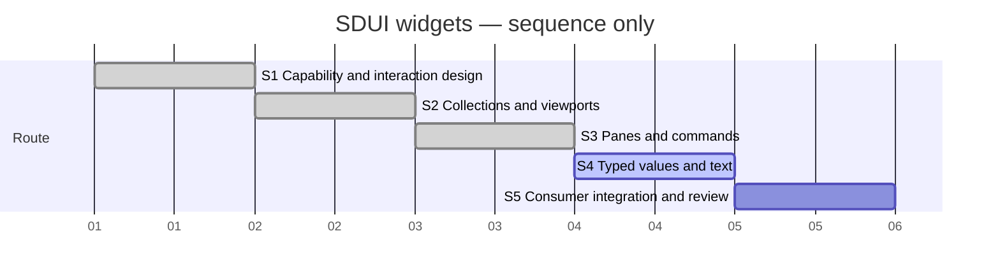

# Session — SDUI widget inventory

## Session roadmap

Latest recorded turn: T003. Current work: S4 typed values and text.
WCI1/WCI2 are implemented, verified and independently reviewed; WCI3-M1 scalar fields is selected. Diagram is **sequence only**, using synthetic equal
slots; it is not a delivery schedule or measured timeline.

| State | Step | Work and linked plan milestone | Prerequisites | Authorization | Completion evidence / outcome |
| --- | --- | --- | --- | --- | --- |
| completed | S1 | PLAN-SDP-0021 WCD1 and PLAN-SDP-0022 WCI0 | Existing gap study and inventory | Owner T001 | WCD1 independently reviewed and complete; WCI0 verified and independently reviewed |
| completed | S2 | PLAN-SDP-0022 WCI1 | S1 | Owner T001 full card | c39b330; Evidence-WCI1; 54 native checks; independent approval |
| completed | S3 | PLAN-SDP-0022 WCI2 | S2 pilot evidence | Owner T001 full card | 403c540 / 0fc15c8; 58 pane + 118 command native checks; independent approval |
| on-going | S4 | PLAN-SDP-0022 WCI3 | Shared contracts from S1–S3 | Owner T001 full card | pending |
| planned | S5 | PLAN-SDP-0022 WCI4 | S2–S4 | Owner T001; publication unselected | pending |

| Field | Value |
| --- | --- |
| Session reference | SESSION-SDP-0010 |
| Status | active |
| Primary card | [KB-SDUI-003](../KanBan/active/%23003--SDUI--Proposal--Capabilities-and-navigation-pilot.md) |
| Snapshot date | 2026-10-07 owner request; actual ledger timestamps recorded separately |
| Current step | S4 |
| Proposed next step | S4 WCI3-M1 typed scalar fields |
| Execution authority | Owner T001 requests taking the card's work |

## Goal

Deliver the complete KB-SDUI-003 widget inventory in staged runnable slices,
with truthful profile/capability checks, native Fyne behavior, typed SDL binding,
exports and consumer distribution preparation. No full XFMD rewrite, FOX bridge,
rich editor, upstream publication or merge is selected. Preserve original 0.2 and
XM-M2 evidence. Rich optional research retains its existing disposition.

## Affected cards

| Card | Role | Initial lifecycle / CardState | Planned final disposition | Current snapshot | Actual final disposition |
| --- | --- | --- | --- | --- | --- |
| KB-SDUI-003 | Primary | backlog / backlog at T001 | All inventory delivered, verified and reviewed | active / in-progress | pending |
| KB-SDUI-005 | Context-only dependency | active / gate-review in producer record | Retain separate preview ownership | Existing dirty producer changes preserved | Not disposed here |
| KB-SDUI-004 | Context-only | backlog | Separate glyph/wrapping fidelity work | backlog | Not disposed here |

## Plan register

| Local ref | Plan type and document | Document readiness | Canonical plan lifecycle | Depends on | Outcome / evidence |
| --- | --- | --- | --- | --- | --- |
| P1 | [PLAN-SDP-0021 DesignPlan](../04--Design/SDUI/Widgets/Plan.md) | completed | completed | PLAN-SDP-0009 research | Independently reviewed design and per-family acceptance |
| P2 | [PLAN-SDP-0022 ImplementationPlan](../05--Implementation/SDUI/Widgets/Plan.md) | on-going | active | P1, staged elaboration | WCI0/WCI1 delivered; WCI2-M1 delivered; M2 in progress |

## Route changes and decisions

| Date / turn | Previous route | Change and reason | Authority | Affected steps/cards |
| --- | --- | --- | --- | --- |
| T001 | Inventory only, execution unselected | Activate prerequisite design and staged full-card execution | Owner prompt below | S1–S5, KB-SDUI-003 |

## Turn journal

### T001 — take the widget work

- Capture mode: exact owner prompt below, manually recorded work summaries.
- Host thread/turn/item IDs and exact prompt time: unknown. Independent reviewer
  agent ID observed: `01a11854-523d-7c11-adf4-f622b19b68c6`.
- Request category: existing card execution. Routine run ID: unavailable; no
  claim of enforced routing. Skills loaded by coordinator: sdp 1.1.1,
  sdp-master 2.0.0, sdp-planning 1.0.0, sdp-architect 2.0.0, sdp-worker 2.0.0, sdp-traceability 2.0.0 and sdp-verifier 2.0.0.
  Paths: Skills/<name>/SKILL.md; loading is agent-reported. Reviewer separately
  reports sdp-reviewer use. Worker role is loaded for subsequent bounded execution.

Owner prompt, verbatim:

> kan du ta jobben som er beskrevet i kb-sdui-003?

Work summary (not an already captured final response): recovered the full revised
inventory, project contracts and relevant implementation. Intake HEAD `3d265d1`
has concurrent uncommitted governance and preview work; preserve those changes.
Created design/acceptance candidate, staged implementation plan and this Session.
Activated the card through management history. All widget delivery remains pending.
Independent initial inspection identifies typed item identity, atomic preparation,
explicit prototype/connected distinction and restricted SDL action types as design
requirements. Actual document review follows that inspection.

WCD1 update: independent document review identified three blockers; all were
resolved and the same independent reviewer approved bounded design completion.
[Evidence](../04--Design/SDUI/Widgets/Evidence.md) records the dispositions.
The management validator passed with 528 events; all local links in eight new or
moved documents resolved. This is design/record evidence, not widget delivery.

WCI0 implementation started in `/tmp/sdp-sdui-widgets`, branch
`sdui/widgets-wci0`, dependency baseline `00b105a`. The KB005 input snapshot has
an explicit hash manifest and its own dependency commit. Worker agent
`01a1185a-ed19-7793-989c-52fbe15b1f9d` implements only Preparation.md's detached
capability/admission boundary. Full native publication remains WCI1. No shared
branch switch or unrelated governance change is part of this work.

Remaining work and next step: inspect and verify the WCI0 candidate, then obtain
independent implementation review. Later grammar/native slices remain explicit
implementation obligations.

### T002 — 2026-10-08, continuation after permission interruption

- Owner prompt, verbatim: “ok fortsett”. The preceding access question was answered
  from the observed unrestricted environment; it did not change product scope.
- Capture: manually recorded work summary. Host thread/turn/item IDs and exact
  prompt times remain unknown. Routine run ID unavailable.
- Recovered Session0010 and reused sdp/master, planning, architect, worker,
  traceability and verifier routines loaded in T001; re-read sdp/master entries.
- T001 interruption correction: the scoped design patch reached the index, but
  its commit permission request was interrupted. Verified HEAD and index before
  continuing; committed WCD1 as `eae0149` without unrelated staged changes.
- WCI0 independent reviewer approved the exact inventoried candidate and reran
  targeted race/bridge tests. Coordinator inspected actual diffs, compared target
  baselines and copied ten reviewed implementation/test files into the shared tree.
  Phase commit `fac09f2` on `sdui/widgets-wci0` retains dependency `00b105a`.
- Full SDUI race tests and bounded SDL bridge/runtime checks pass. An unchanged SDL
  generated-constructor baseline mismatch is explicitly registered as a WCI1
  prerequisite investigation; no all-SDL-suite pass is claimed.
- Steps: S1 complete at its bounded level; S2 stage design started. Architect agent
  `01a11878-3e2d-7c32-98fb-69bee87297a4` owns only Collections.md. Worker investigates
  constructor mismatch read-only. All widget families remain pending.
- WCI1-P0 correction: worker identified stale generated constructors after KB005,
  regenerated through sdl-gen and added a compiled reuse/provenance regression.
  SDL codegen/bridge and SDUI codegen pass. Phase branch `sdui/widgets-wci1`
  starts with prerequisite commit `d1c5c88`; exact files integrated after baseline
  comparison. No frozen fixture or historical evidence was altered.
- WCI1 stage contract independently approved after correcting canceled/failed-load
  keyboard recovery and pruning mandatory SVG snapshots/general scene/custom row
  drawing. Export rejection remains explicit; all required interaction stays in scope.
- WCI1 implementation lanes in the isolated clone: frontend/export Dalton,
  runtime James (`01a11887-3b3f-7d11-9501-8c00902b9bdf`), layout Gibbs
  (`01a11887-8d55-74f3-bd58-7c6ea563b28e`), native/preparation/bridge Noether.
  Exclusive file ownership and an early shared API memo govern integration.
- Native tooling smoke: actual X11 click and Tab+space each reached the Fyne
  desktop driver, using separate Xvfb :189 and XDG area. This proves the input
  route only, not collection acceptance; see native/README in WCI1 evidence area.
- Milestone backlog review: KB-SDUI-004 remains independently owned text fidelity
  backlog; KB-SDUI-005 remains gate-review with delivered producer evidence. No
  onHold work displaced the selected widget route. The isolated clone lacks the
  uncommitted KB005 card; the canonical board review used the original workspace.
- WCI2 draft-only architecture lane: Lorentz
  (`01a11888-c963-7663-af5e-cd5a107a6715`) prepares Panes-and-commands.md in the
  original workspace. Execution still requires WCI1 pilot feedback and stage review.
- Main reused ProjectManagement and Toolkit validators; both pass after stage
  registration. No widget completion is inferred from record validation.
- WCI1 lane results: frontend/export and layout implementations have passed their
  scoped race checks; actual native integration/acceptance remains pending.
  Runtime/host recovery clarifies that a previously loading root paused by a
  compatible reload offers explicit Load/R, without automatic restart.
- WCI3 draft-only architecture lane: Dalton prepares Values-and-text.md after
  completing frontend code. Future-stage code remains gated by preceding pilot
  evidence and reviewed contracts.
- Native pilot build passed, but its first launch rejected the fixture SDL action
  declaration as noncanonical before window creation. No product native pass is
  claimed. Host geometry/input findings are being corrected; see Pilot-WCI1.md.
- Second native pilot reached real SDL activation, controlled retry/cancel/late
  completion and two compatible reloads. It is development feedback on an evolving
  candidate, not final acceptance. OS captures replace black Canvas.Capture output.
  A repeatable XTest harness is being established; host integration fixes remain.
- WCI1 adjacent consumer corrections: Dalton owns profile-aware helper/SDPTool
  metadata and SDL bundle generator provenance in the clone. Exact 0.3 support
  must never be mislabeled 0.2 or imply unavailable native providers.
- Host lifecycle handoff: Noether explicitly transferred document.go and a new
  lifecycle regression file to James. Reentrant error reconciliation, failed-resize
  recovery, clamped resource snapshots and focus restoration now pass scoped race
  checks. Actual empty-root native tests pass, including R after compatible reload.
- Native nested scrollbar overlap led to a bounded shared measurement refinement:
  optional frame/group viewport insets and explicit gutter rectangles. Independent
  reviewer approved before code; Gibbs owns layout and Noether owns adapters.
  Separate thumb reachability and final integrated evidence remain pending.
- WCI2 draft review resolved tab activation, dialog results and split minima. The
  next review prunes an unnecessary reconciliation API and separates future WCI3
  obligations. No WCI2 implementation is started from draft approval alone.
- Selected WCI2 nonmodal adapter has bounded standalone native experiment evidence
  in Widgets/nonmodal-probe: main drove XTest input and inspected OS captures.
  Parent interaction, draft revert, opener keyboard focus and five exactly-once
  terminal results passed. No WM decoration, SDL or SDUI product acceptance is
  claimed; WCI2 remains future work pending stage readiness and WCI1 completion.
- WCI1 gutter layout regressions and race checks passed; native adapter integration
  and separate thumb input are next. Expanded basic native pilot checks include
  horizontal Alt-arrow scrolling and keyboard/pointer retry on a selectable branch.
- Integrated working-candidate checks: coordinator ran the full SDUI race suite
  successfully, plus SDL bridge/runtime/codegen/collection fixture tests. The
  remaining visible-height PageUp/PageDown correction and final native candidate
  rerun are explicit; these passes do not yet close WCI1.
- Expanded nested native pilot passed all twenty checks, including independent
  scrollbar reachability and visible-height paging. Input-delivery pacing was
  corrected explicitly; provider synchronization still uses controlled barriers.
- Independent review found long diagnostic text could reject its own error-state
  layout. Host recovery fitting and visible compact R hint are being corrected;
  final candidate approval remains pending. Added native lifecycle verification
  for hide/disable, failed resize recovery and zero scroll ranges.
- WCI1-M1 delivered as phase commit c39b330. Independent reviewer verified all
  88 hashes, rebuilt the native binary identically and approved 54 native checks.
  Integrated original full SDUI race, affected SDL race and full SDPTool tests pass.
  Only SDPTool/sdui.go needed explicit KB005 Combined/source-bundle reconciliation;
  other candidate bytes match, unrelated work preserved. S2 is complete.
- Milestone backlog review retains KB004 glyph fidelity separately and KB005
  gate-review; no onHold item changes the selected full inventory route.
- Reviewer confirmed final WCI2 contract cf93dea6 with no design blockers.
  Coordinator starts S3/WCI2-M1 on sdui/widgets-wci2 using existing owner scope.
  Five exclusive lanes cover frontend, runtime, layout, host/preparation and SDL
  bridge/fixture. Shared identity/API memo precedes dependent changes.
- Next: integrate runnable tabs/split milestone and native acceptance before M2.
  Work summary, not captured final response; full inventory remains incomplete,
  and no release/merge authority is inferred.

### T003 — continuation after owner interruption notice

- Owner prompt, verbatim: “det ser ut som jeg avbrøt deg”. This steers continuity,
  not scope or authorization. Exact prompt time/host IDs unavailable.
- Recovered the existing Session and WCI2 lane/API records. Reused SDP Master,
  Worker, Architect and Verifier context. WCI1 remains delivered/reviewed; WCI2-M1
  changes are preserved in the isolated phase branch, but not yet verified.
- The interrupted call had updated the isolated IME probe launcher; native test
  processes and agent handles were no longer live on recovery. Restoring task
  workers/display explicitly; no product work or historical evidence discarded.
- Current work summary: resume the five exclusive WCI2-M1 lanes and native input
  preparation. IME investigation is provisional WCI3 design evidence only.
- WCI3 independent draft review identified typed result mode, atomic-form local
  Commit behavior, multiline scroll ownership and numeric tolerance omissions.
  Coordinator revised the provisional draft; re-review remains pending, no WCI3
  product implementation selected.
- Actual isolated IBus XIM probe reproduced pinned GLFW key leakage: composition
  Return submitted the old empty Entry before inserting the composed character.
  A one-condition filter trial prevented consumed Return/Escape delivery while
  preserving ordinary Enter/navigation. Durable Widgets/ime-probe retains source,
  patch, raw logs and hashes. Local dependency disposition awaits design review;
  no product dependency or desktop configuration was changed.
- WCI2-M1 native evolving-candidate pilots passed 25 panes, 11 horizontal split
  and 7 page/provider lifecycle checks. Captures confirm retained drafts/scroll,
  collapsed geometry and real SDL preview updates. Harness corrections preserve
  failure expectations; final source freeze/rerun and independent approval remain.
- WCI4 Architect draft Providers-and-packaging.md now records explicit provider
  and labelled fallback boundaries, exact module/private-helper package inventory,
  and conditional IME dependency packaging; draft-only and not product delivery.
  Current WCI3 numeric/form refinements remain under independent review.
- Next: complete runnable panes integration and verify/review before WCI2-M2.
- Further native checks passed the vertical split variant (nine checks). Final
  candidate testing found two bounded host omissions: native errors lost the
  interaction's domain outcome, and clicking the selected tab from an input did
  not focus the header. Both remain M1 corrections, with explicit native
  regressions; no milestone completion is claimed before correction/review.
- Full SDUI, affected SDL and SDPTool suites are running on the integrated phase
  candidate. Runtime prepares only a read-only M2 API handoff while M1 is frozen
  outside the host correction lane. Next remains final M1 evidence and review.
- Those suites passed, including SDUI host race (53.472s), actual SDL panes race
  (54.071s), bridge/runtime/codegen/collections and full phase SDPTool tests.
  Independent review additionally reproduced native selection divergence while
  the tabs owner is disabled. Host correction and actual-input regression are
  included before final acceptance; original integration target audit found no
  conflicting bytes among the 72 M1 files.
- WCI3 architecture review accepted exact-decimal membership, proposal-only
  number-step Commit in atomic dialog forms, and the bounded licensed GLFW IME
  patch route. Its final numeric correction requires step strictly greater than
  endpoint binary64 spacing to prevent midpoint ties collapsing ticks. Draft
  updated; WCI3 code remains subsequent to WCI2, with product IME proof pending.

- WCI2-M1 delivered at 403c540: 72 exact original-integration files, 58 native
  checks, full phase/original suites and independent approval. Backlog review
  retains KB004 and KB005 ownership. M2 final menu dismissal ordering is being
  reconciled with pinned Fyne before implementation; no main merge or release.

- Reviewer approved the final M2 contract 9a9c8710 after correcting the pinned
  Fyne dismissal order and replacing queued cleanup with synchronous per-opening
  selection scope. No additional probe is required for stage entry; native proof
  remains mandatory. Coordinator starts M2 on the existing phase branch with
  exclusive frontend/runtime/layout/host/bridge lanes; no duplicate SDL dispatch.

- M1 evidence/original handoff committed as f18fcc0. The isolated phase copy
  initially lacked the preceding scoped card/plan ledger events; its unpublished
  handoff commit is corrected with canonical event bytes and the card move/index.
  Phase validation passes with 526 events; original canonical history remains
  unchanged and passes with 538. Unrelated governance history is not imported.

- M2 seams are frozen for selected-root frontend identities, aggregate per-canvas
  layout, runtime MenuScope and native inspection. First native-menu adapter
  regressions pass; independent review found reused-model callback wrapping and
  disabled keyboard invocation defects, both assigned to host before integration.
- Native harness preparation adds real secondary click, WM close protocol and
  focus observation without forced focus. The WM close helper was exercised on
  the delivered pane fixture (clean close/teardown); this is tooling proof, not
  M2 acceptance. Separate :190 display has space for nonmodal windows.
- Next: finish the five M2 lanes, integrate the actual SDL command/dialog fixture,
  and run native command/context/modal/nonmodal/error/lifetime acceptance.

- Independent WCI4 draft review approved path-keyed immutable Markdown outcomes
  and explicit fatal-versus-fallback resource handling for future stage entry.
  WCI3 exact-number design now bounds coefficient digits and effective decimal
  exponents before arbitrary-precision conversion, including precise zero/trailing
  zero handling; compact exponents cannot bypass memory bounds. Product stages
  remain subsequent to M2 and still require actual native evidence.

- M2 frontend and layout lanes passed scoped race checks and froze their files.
  Independent runtime review found opener/remembered-focus fallback and inactive
  nonmodal key routing gaps; assigned corrections retain the reviewed behavior.
  Actual SDL fixture exposed the existing one-receiver connection invariant:
  distinct visible receivers are being used rather than weakening the parser.
- Native dialog imports require Fyne's already pinned fancyfs v0.0.1. Coordinator
  added only that indirect requirement and its two checksums to SDL/SDUI module
  roots; no dependency version upgrade or product patch. Host inspection alone
  transfers to the finished layout worker; core host ownership stays unchanged.

- Superseding independent M2 runtime/bridge checkpoint: focus/key routing,
  cross-pane command updates with reserved-owner protection, and strict snapshot
  schema projection corrections pass the five reviewer regressions. Independent
  runtime race passes (1.737s); corrected real SDL bridge race passes (2.198s).
  This is scoped approval; native host/frozen integrated acceptance remains open.
  Surface inspection tests found a scoped SVG inventory mismatch assigned to host.

- Continuation recovery reused sdp/master/verifier and preserved exclusive lanes.
  Actual pilot2 binary 3b5efbcc passes context (4 checks), modal and nonmodal
  dialog (7 each), failed acceptance (17), and nonmodal lifecycle (12). The
  focused-tree shortcut loss is corrected; hidden surface SVG inventory and
  button runtime focus corrections pass the inspector/full host race checks.
  These evolving-candidate results do not establish final M2 acceptance.
- Runtime adds exact-token forced RevokeSurface for a genuinely lost native
  owner, preserving stale replacement protection and bypassing fallible geometry.
  Independent review and final host freeze remain pending. Next: keyboard,
  focus and visible native proof, then exact-candidate verification/integration.

- Further M2 native pilots prove modal/nonmodal Tab order, parent modality and
  restored real keyboard focus (10 checks each), plus nine failed-command checks
  with truthful outcomes and retained accepted reentrant drafts. A late keyboard
  edge exposed GLFW's Shift-only dispatch; corrected pilot3 passes Shift+F10 and
  Entry shortcuts. Inspected OS captures confirm visible themed icon and actual
  dialog/context menu. The new A06 fixture proves three separate Escape levels.
- Main reconciled prior widget architecture/requirements documentation missing
  only from the isolated phase copy, with original baselines retained for safe
  integration. Future WCI3/WCI4 documents now truthfully record their existing
  independent design approvals while keeping product implementation unselected.
  Host's final keyboard edge corrections and exact-candidate freeze/review remain
  next; all later families and whole-card completion remain open.

- Candidate 22539389 passed all 110 command/surface native checks, 58 pane
  regressions, full phase/original suites, and an audit of 22 exactly-once
  published openings. Its 112 files were safely integrated with prior bytes
  backed up. Independent review then found a missing dynamic-parent case:
  root-sibling dialog source order selected the wrong native parent/size.
  M2 stays in progress; only host surface ordering and the bounded regression
  fixture are unfrozen. Prior evidence is retained as candidate-22539389,
  not final acceptance. A new actual nested-window workflow is required.
- One prior keyboard run emitted an upstream Fyne preference-load EOF while
  all behavior assertions passed; one fresh-configuration repeat passed without
  stderr. Both records are retained. A preferences watcher/write race is a
  plausible source-based explanation, not proven causality or a product patch.

- Recovery work summary: final candidate 2c1db6d1 passes 118 native checks, including
  actual dynamic-parent geometry and modal-child lifetime. Exactly 26 published
  openings have one terminal result each; all completed-run stderr is empty. Final
  SDUI/SDL race and original SDPTool suites exit zero. A runner interruption (143)
  is retained separately; remaining scenarios were rerun and passed. Source remains
  frozen pending final independent archive approval. WM native-owner closure is
  explicitly parent-closed/sequence zero; source Close/Cancel remains user-sequenced.
- Reused sdp/master/planning/verifier/architect/traceability. Independent reviewer
  approved WCI3 preimplementation refinements: closed-dialog draft discard overrides
  general successor retention, and only exact safe53 integer grids use uncapped
  uint64 ticks. No WCI3 implementation selected yet. Next: M2 reviewed delivery,
  then WCI3 scalar stage under existing whole-card authority.

- M2 delivery work summary: independent reviewer approved all 113 files, 70 archive
  entries and final native/suite evidence. Phase commit 0fc15c8 records product
  delivery; only two documentation status paragraphs changed after tested freeze.
  S3 is complete. WCI3-M1 selected under original full-card authority; bounded
  numeric/runtime, frontend, layout, host and SDL lanes continue on a new phase
  branch. No whole-card, merge or release completion is claimed.

## Closeout
Open. No widget, plan, card or Session completion is inferred from intake/design.
