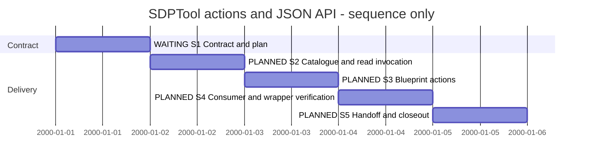

# Session 0011 — SDPTool actions and JSON API

## Session roadmap

T007, 2026-10-10. Active Session; refreshed product preflight is RED.
S1 contract proposal and PLAN-SDP-0024 are prepared. Next: resolve S0 integration
ownership/identity and finalize S1 schemas/SDL on the selected baseline.
Sequence only: dates below are display slots, not estimates or measured time. The table is the authoritative roadmap.

| State | Step | Outcome / linked milestone | Prerequisites | Completion evidence |
| --- | --- | --- | --- | --- |
| waiting | S0 | Concurrent-work preflight and coordination | Owner T002 requires green before implementation | [RED refreshed T007](evidence/0011-concurrent-work/refresh-T007.md) |
| waiting | S1 | Define action catalogue and JSON invocation contract; register bounded ImplementationPlan | KB051, current Go APIs/CLI, XFMD handoff | [Contract proposal](../04--Design/SDPTool/Actions/Contract.md) and PLAN-SDP-0024 prepared; executable schemas/SDL wait for S0 |
| planned | S2 | One shared action registry, catalogue and JSON read operation | S1 | CLI/API equivalence, deterministic metadata and strict request/error tests; pending |
| planned | S3 | Blueprint generation/retention, assessment and revision-bound assignment actions | S2 | Real success/failure workflows preserve source, bundle and ledger contracts; pending |
| planned | S4 | Test actual consumer protocol and gh-sdp forwarding on development candidate | S3 | Subprocess input/output, structured failures, compatibility and exact binary identity; pending |
| planned | S5 | Documentation, review and XFMD handoff; reconcile KB051 and resume pointer | S4 | Evidence-backed outcome, residual scopes and Session0008 recovery note; pending |

| Field | Value |
| --- | --- |
| Session reference | SESSION-SDP-0011 |
| Status | active |
| Primary card | [KB-SDP-051](../KanBan/backlog/%23051--Proposal--Discoverable-SDPTool-actions.md) |
| Snapshot date | 2026-10-10 |
| Current step | S0 refreshed red; S1 prose/plan ready, schemas/SDL waiting |
| Proposed next step | Select integration ownership/order and reconcile KB051; fresh green baseline before ACT1 product/model changes |
| Execution authority | Owner resumes delivery in T007; earlier green preflight prerequisite remains |
| Predecessor | [Session0008 — paused](session-%230008--Semantic_blueprints.md) |

## Goal

Let native clients discover supported SDPTool actions and invoke them through a
versioned JSON request/response interface using the same typed services as the
human CLI. First delivery supports a complete blueprint workflow rather than
advertising arbitrary unimplemented operations. The contract should let XFMD build
menus/forms and configured toolbar actions without guessing command syntax.

Retain readable CLI commands, existing identity/revision/authority gates and
structured diagnostics. Start with one request per process. A persistent daemon,
full MCP transport, native XFMD menu implementation and automatic publication are
outside this Session's product scope. A future adapter can reuse the same services.

## Affected cards

| Card | Role | Initial | Planned final | Current | Actual final |
| --- | --- | --- | --- | --- | --- |
| [KB051](../KanBan/backlog/%23051--Proposal--Discoverable-SDPTool-actions.md) | Primary | backlog | completed after scoped delivery/evidence | queued for S1 | pending |
| [KB050](../KanBan/active/%23050--Proposal--Semantic-blueprints.md) | Context only | gate-review | unchanged by this Session | gate-review; Session0008 paused | not disposed here |
| [KB052](../KanBan/backlog/%23052--Change--Project-Leader-and-SAD-orchestration.md) | Handoff to ProjectGovernance | absent | backlog registration; owning Session0007 selects delivery | owning PG worktree active, observed T007; local copy remains historical backlog | registered T005; transferred to PG |
| external:KB-XFMD-030 | Consumer handoff | reported backlog at creation | XFMD agent selects native work | external, not locally authoritative | external |

## Plan register

| Local ref | Plan document/type | Readiness | Lifecycle | Outcome |
| --- | --- | --- | --- | --- |
| M1 | [MaintenancePlan MAINT-SDP-0015](../Maintenance/PLR1/Plan.md) — role/skill prerequisite only | completed | completed | Scoped guidance and ProjectGovernance handoff |
| P1 | [ImplementationPlan PLAN-SDP-0024](../05--Implementation/SDPTool/Actions/Plan.md) | ready for coordination; execution blocked | planned | ACT0–ACT5 catalogue/JSON and blueprint delivery |

Keep detailed milestone status in P1; the Session tracks the route.
Contract decisions can live in one feature document without mandatory separate
Requirement/Architecture/Design plans. Follow adopted plan rules and update SDL
sources for material responsibility/contract changes before product implementation.

## Baseline and proposed execution policy

Source checkout: /tmp/sdp-blueprint-implementation, sdp/blueprint-implementation;
code baseline d2cc760, documentation baseline a4a81f8. Inspect Git status at resume.
The primary SDP-vNow and other worktrees contain unrelated work; preserve it.
PLAN-SDP-0024 selects one dedicated actions branch after the combined baseline is
agreed, with milestone commits; planning remains on this branch. This refines the
initial provisional stacked-branch suggestion without changing prior commitments.
This Session does not authorize main merge or publication. Test distribution
preparation is distinct from publishing alpha/beta assets or replacing installations.

[Current integration handoff](../../SDPTool/XFMD-Blueprint-Integration.md) distinguishes
implemented CLI from proposed invocation syntax. gh-sdp forwards stdin; XFMD's
current job transport does not and must retain structured nonzero-exit responses.
That native consumer change belongs to external KB-XFMD-030, not this repository.

## Route changes and decisions

| Turn | Change | Authority | Impact |
| --- | --- | --- | --- |
| T001 | Separate KB051 delivery from blueprint pilot review | Owner request | Session0008 paused; this Session active; no implicit pilot acceptance |
| T007 | Prepare bounded ACT plan while integration gate remains red | Owner continuation and existing preflight prerequisite | One actions working branch after combined baseline; PG owns KB052; no product activation |

## Turn journal

### T001 — Establish focused delivery Session (2026-10-09)

Owner input is summarized in predecessor Session0008 T015: create a new Session
for KB051 and leave an explicit resume note for the current one. Host turn IDs and
exact timings are unknown; no automatic capture is claimed. Loaded SDP/Planning
and shared document workflow (agent-reported), reusing current architecture analysis.

Work summary: allocated 0011 after checking parallel worktrees; established this
roadmap, queued KB051 and linked the paused predecessor. No product code or formal
execution plan was written this turn. Next S1 resolves the typed operation catalogue,
JSON envelope, stdin/file behavior, context/authority and error contract, then
registers the implementation milestones. This is not a captured final response.

## Closeout and return

Pending. On closeout, record actual delivery and remaining consumer/publication
work. Return to Session0008's Resume here block and S1/BP2-A owner pilot disposition.
Do not close KB050 or approve its pilot merely because KB051 is delivered.

### T002 — Mandatory concurrency check before starting (2026-10-09)

Owner input (summary): establish a procedure checking active cards/Sessions for
parallel work on SDPTool and possible merge conflicts; proceed only on green.
Loaded/reused SDP, Master, Planning and shared document workflow. Ran the local
preflight over nine known Git worktrees, including committed divergence and dirty
files; inspected active Session/card projections and shared command-routing changes.

Work summary: established Concurrent-Work-Preflight.md and linked it from AGENTS.md
and ProjectManagement. The [observed result](evidence/0011-concurrent-work/README.md)
is RED. Governance and runnable-program branches change the same dispatch/output
interfaces; committed forecasts have actual conflicts. The primary worktree also
has a new runnable-program card declaring our KB-SDP-051 identity. No unilateral
renumbering, product code edits, branch merges or owner messages were performed.

Session remains active for coordination, S1 waits, and KB051 stays queued with the
new prerequisite. Green requires current ownership/integration sequencing and
identity reconciliation, followed by fresh inspection. The earlier scoped Go/CLI
proposal does not authorize bypassing this owner gate. Next: coordinate a safe
combined/sequenced baseline; then resume S1. Session0008 remains paused. This is a
manual work summary, not an exact transcript or claimed live-agent observation.

### T003 — Project-leader agent and choice of client (2026-10-09)

Owner input (summary): establish a Steering/Project Leader agent responsible for
cross-workstream coordination; ask whether Codex suits this or ChatGPT can run
in a Linux CLI and may be better. Read OpenAI Docs and SDP Steering guidance;
reused local governance design and the red concurrency evidence. No permanent role
appointment or new agent was inferred from this exploratory comparison.

Recommendation: use a dedicated Codex operational coordinator with repository and
worktree access, separate from task Masters/Workers. The owner retains product
Steering/acceptance authority; the coordinator prepares decisions, controls work
allocation within delegated authority and checks evidence. ChatGPT can remain a
strategy/design discussion surface if the owner prefers its interaction; no measured
claim that one product is intrinsically a better project manager is established.

The official Codex CLI documents Linux operation, local tools and ChatGPT sign-in.
The official OpenAI CLI exposes API requests with API-key authentication; it is not
the full ChatGPT application transplanted into a terminal. App-server supports a
programmatic conversation/event interface and fits existing KB038 work; no new
client or daemon is needed simply to assign the coordinator role.

A coordinator prompt alone cannot prevent races. All workers must consult shared
coordination state and register work scope before changes. Branch-local copies of
a registry are insufficient for globally unique card allocation or reservations.
Initially select one coordination authority and explicit assignment/integration
sequence; future SDPTool/MCP operations should enforce atomic allocation and scope
claims with explicit release/recovery rules. These are recommendations, not newly
implemented guarantees. A Codex session does not automatically observe all other
chats or independently running terminals.

Work summary: recorded the comparison and recommended role boundary in this Session,
without duplicating the in-progress governance work. Proposed first coordinator
assignment: reconcile KB051 identity, select shared-file ownership and integration
baseline, then rerun the preflight. S0 remains red and S1 waiting; Session0008 remains
paused. No API call, agent launch, code change or role/merge authority was granted.

Official sources inspected (2026-10-09):
- [Codex CLI](https://learn.chatgpt.com/docs/codex/cli)
- [OpenAI CLI](https://developers.openai.com/api/docs/libraries/openai-cli)
- [Codex app-server](https://learn.chatgpt.com/docs/app-server)

### T004 — Explicit Project Leader, Steering, SAD and Master roles (2026-10-09)

Owner input (summary): Project Leader is the normal contact and supervises several
Master agents using ProjectGovernance; Steering supplies strategic input. A SAD
agent authors SDL/SDUI TARGET and blueprints through ModelGovernance, with direct
owner dialogue/preview and revision-bound approval before implementation. Master
owns its Session/ImplementationPlan and reports phase outcomes; leader stays available.
A UI should expose agents, tools, children and idle/progress status. Owner asks whether
MCP delivers completion notifications to the leader.

Loaded skill-creator, SDP, Architect and reused Planning/Steering/document workflow;
checked official OpenAI plugin/skill docs and the actual governance worktree. Existing
Steering/Master/Architect skills lacked a dedicated operational Project Leader role.
MAINT-SDP-0015 delivers a new sdp-project-leader skill and clarifies the existing roles;
Architect is SAD rather than a duplicate skill. Canonical discovery/distribution
metadata are maintained together; no online installation is claimed.

Scoped preflight found no current competing Skills/inventory edits, permitting this
explicit maintenance only. The product implementation gate remains red. The active
ProjectGovernance branch was inspected read-only: its MCP worker surface cannot
launch/resume agents and its controller currently drives one bounded Master without
native children. A handoff captures the new privileged adapter, durable notification
and multi-assignment UI requirements without overwriting that workstream's design.

Work summary and verification follow in MAINT-SDP-0015. No Master/SAD was launched,
no controller authority widened and no ChatGPT plugin installed. The model cannot
be its own continuously running event loop; controller persistence and host wake-up
must be implemented/tested separately. Scope and identity collisions remain the next
coordination issue for S0. Session0008 stays paused. Manual summary, not a transcript.

T004 verification/closeout: MAINT-SDP-0015 completed for local role guidance,
portable skill inventory and the ProjectGovernance handoff. Five skills pass format
validation; two metadata/distribution tests and Toolkit/management/link checks pass.
Draft metadata errors were corrected without rewriting pre-existing ledger bytes.
Same-context scenario inspection is recorded in the MaintenancePlan; no independent
live-agent behavior is claimed. New skill discovery applies to this working branch,
not an unmodified parallel checkout or online account. Next is reconciliation with
the ProjectGovernance owner; KB051 product work remains behind S0's red gate.

### T005 — Register the ProjectGovernance handoff as a card (2026-10-09)

Owner input (summary): the handoff should be in a KanBan card. Reused SDP,
Traceability and document workflow. Checked card IDs across nine known local
worktrees; allocated KB-SDP-052, preserving the already identified KB051 collision.

Work summary: created backlog Change KB052 with scope, owning KB038/Session0007,
links to the complete handoff and delivered role maintenance, and acceptance/next
planning action. Updated board index, reciprocal links and append-only creation/
review events. No new runtime plan or execution phase is activated. Next is owning
ProjectGovernance planning reconciliation; our S0 gate remains red and Session0008
paused. This is a manual work summary, not a captured final response.

### T006 — Confirm workstream ownership after PG handoff (2026-10-10)

Owner input (summary): asks which Session this agent will continue and reports
having told the ProjectGovernance Codex agent to work on KB-SDP-052. Loaded SDP,
Traceability and the shared document workflow; recovered this Session and the
paused blueprint Session. This is a status and handoff turn, not a new execution
plan or implementation milestone.

Work summary: this agent continues Session0011, whose primary deliverable is the
discoverable SDPTool action catalogue and JSON invocation interface (the
discoverable-actions KB051). KB052 belongs to the ProjectGovernance workstream;
the owner's reported handoff is recorded here without claiming that its agent has
already activated, implemented or completed the card. Its owning workstream must
maintain the canonical card lifecycle. Session0008 remains paused with BP2-A owner
pilot disposition pending; this handoff does not approve that pilot.

The implementation checkout is clean at edfac18 before this journal update.
Observed worktree heads have changed since the recorded concurrency check:
SDP-vNow is e38298c and the runnable-program checkout is ef8741c on
sdp/release-2.2.0; ProjectGovernance remains 0b0e82c. The previous RED evidence
is historical, not a fresh conflict forecast. No green result is claimed.

Next: refresh S0 against current active work, resolve any remaining shared-file
ownership and KB051 identity collision, then deliver S1's contract and bounded
ImplementationPlan. S2–S5 retain their catalogue/read invocation, blueprint
actions, consumer verification and handoff sequence. No product code, card
lifecycle, release or other worktree was changed in this turn. Manual work
summary; no exact transcript or live-agent observation is claimed.

### T007 — Resume actions contract and implementation planning (2026-10-10)

Owner input (summary): confirms Session0011 and asks this agent to continue. Loaded
SDP, Planning, Architect and reused Traceability/document workflow. Refreshed known
worktree status and merge forecasts, including current PG's PGL1 ownership record.
PG's active KB052 is now observed locally, not merely owner-reported. That does not
resolve shared product integration: both merge forecasts return concrete conflicts
and the two different KB051 cards still collide. Preserved all other worktrees.

Work summary: wrote a scoped Actions contract proposal and registered planned
PLAN-SDP-0024. They specify one compiled metadata/handler registry, a bounded
stdin/file JSON request protocol, human CLI compatibility, five initial actions,
separate caller principal, structured nonzero responses and revision/retry rules.
Recorded current context.Background generation routing as an implementation concern;
no cancellation fix, schema or product command is claimed delivered. SDL model
updates wait for the selected combined baseline instead of editing shared authority.
The plan selects meaningful milestone commits on one actions branch after ACT0.

Asynchronously requested the owner's coordination preference: PG selects shared-file
integration/identity reconciliation, or this agent takes a separate coordinated
integration assignment. No response is inferred from elapsed time. S0 remains red;
S1's prose and plan are ready, executable schemas/SDL pending. KB051 remains queued,
PLAN-SDP-0024 planned; Session0008 stays paused for BP2-A owner disposition. Next is
integration ownership/order, preserved identity/history reconciliation and refreshed
green evidence. Only documentation/registration changed. Verification below records
actual document checks; it is not implementation or independent review evidence.

T007 verification: project-management validator passes with 64 cards, 41 management
records, 4 lineage operations and 529 events. Toolkit validation, local Markdown
links and git diff --check pass. Existing ledger bytes are preserved, with one plan
creation and one card review appended. No product tests were needed/run for this
document-only delivery. The asynchronous integration choice is still pending at
this recorded closeout; no answer or authority is inferred.
