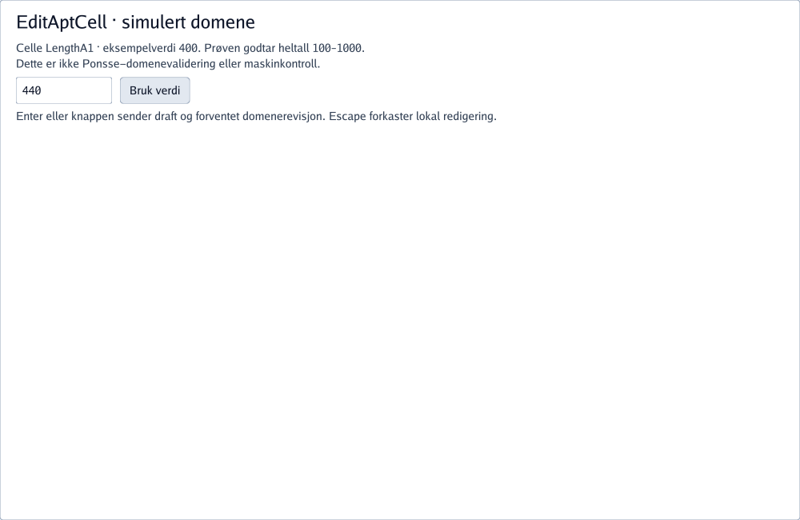

# SDUI — valgt statisk tilstand

[Struktur og rå Markdown](structure.md) · [Proveniens](provenance.json)

Statisk eksport: ingen callbacks er kjørt. UI-verdier er eksplisitte dokumentasjonsdata.

[SDL-arkitektur og viewpoints](design/index.md) · [Navigator](design/navigator.md)
