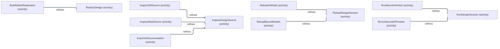

# SDL-viewpoints — generert modellrapport

Generert fra validert SDL. Struktur og designpåstander, ikke observert kjøring.
Ingen håndskrevet arkitekturfakta er lagt til av generatoren.

| Viewpoint | Status | Grunnlag / mangel |
| --- | --- | --- |
| VP01 — Bruksmål og sporbarhet | Tilgjengelig | pursues, supports og contributes-to; modellens omfang, uten oppdiktet System-grense. |
| VP02 — Arkitektur og logisk inndeling | Tilgjengelig | Container/Unit og contains; bibliotekstruktur er ikke en deployment-allokering. |
| VP03 — Ansvar og kapabiliteter over arkitekturen | Tilgjengelig | owns, realizes og provides. Capability er ikke Feature. |
| VP04 — Grensesnitt og samarbeid | Tilgjengelig | consumes viser bruk; ingen tilbyder, Channel eller kjørbar meldingsflyt utledes. |
| VP05 — Avhengigheter per modus | Tilgjengelig | requires in mode; modi har ingen implisitt arv. |
| VP06 — Aktivitetsdetaljering | Tilgjengelig | refines er detaljering, ikke rekkefølge eller tilstandsoverganger. |
| VP07 — Features over arkitekturen | Tilgjengelig | contributes-to, owns og eksplisitt allocated-to per modus. Uspesifisert allokering vises som hull. |
| VP08 — Channel-kontrakter og sekvenser | Tilgjengelig | Eksplisitte scenario-steg validert mot permits, deltakelse, modus og request/resultat-korrelasjon. |
| VP09 — Dataset, Datagram og persistent Database | Tilgjengelig | Eksplisitte holdere, kilde, kontrakter, varianter, felt og projeksjoner. |
| VP10 — Datagram-koding og packet | Tilgjengelig | Kun closed kontrakt med validert Encoding og eksplisitte bitplasseringer. |
| VP11 — Egenskaper, sporbarhet og modellhull | Tilgjengelig | Deklarasjoner og alle fakta med kildeposisjoner; støttegrenser beholdes. |

## VP01 — Bruksmål og sporbarhet

Bruksmålskartene viser Actors, støttende Features og direkte Functionality-bidrag.
De etterfølgende Feature-kartene detaljerer bidragene med samme modellidentiteter.
Oppdelingen endrer ingen relasjoner og innfører ingen System-grense.

### Bruksmål: BuildNativeProduct

Kildegrunnlag: f0106, f0253.

### Bruksmål: EditRunningPrototype

Kildegrunnlag: f0107, f0231, f0576.

### Bruksmål: InspectModels

Kildegrunnlag: f0108, f0113, f0577, f0587.

### Bruksmål: PrototypeUserInterface

Kildegrunnlag: f0109, f0114, f0224.

### Bruksmål: PublishDesignDocumentation

Kildegrunnlag: f0110, f0112, f0115.

### Bruksmål: TryDomainInteraction

Kildegrunnlag: f0111, f0592.

### Functionality-bidrag til Feature: DesignDocumentation

Kildegrunnlag: f0090, f0163, f0167, f0294, f0586, f0673.

### Functionality-bidrag til Feature: InteractiveUiPreview

Kildegrunnlag: f0018, f0051, f0087, f0219, f0310.

### Functionality-bidrag til Feature: LiveModelReload

Kildegrunnlag: f0229, f0270, f0274, f0279, f0298, f0304, f0363.

### Functionality-bidrag til Feature: NativeGoAssembly

Kildegrunnlag: f0047, f0193, f0196, f0282.

### Functionality-bidrag til Feature: StructuralModelInspection

Kildegrunnlag: f0054, f0059, f0364, f0658, f0668.

### Functionality-bidrag til Feature: TypedDomainBinding

Kildegrunnlag: f0094, f0145, f0226, f0301, f0369.

## VP02 — Arkitektur og logisk inndeling

Container er en erklært runtimegrense. Unit-røtter viser logisk struktur.
contains angir ikke deployment. Eksplisitt Functionality-allokering vises per modus i VP07.

### Arkitekturrøtter — ingen kobling/allokering er utledet

Kildegrunnlag: Kun deklarasjoner.

### Logisk inndeling: ContentServices

Kildegrunnlag: f0096, f0097, f0098.

### Logisk inndeling: DevelopmentTools

Kildegrunnlag: f0129, f0130, f0131, f0132, f0133, f0134.

### Logisk inndeling: SdlFrontend

Kildegrunnlag: f0415, f0416, f0417, f0418.

### Logisk inndeling: SdlLibrary

Kildegrunnlag: f0427, f0428, f0429.

### Logisk inndeling: SdlRuntime

Kildegrunnlag: f0439, f0440, f0441, f0442, f0443.

### Logisk inndeling: SduiFrontend

Kildegrunnlag: f0485, f0486, f0487, f0488.

### Logisk inndeling: SduiLibrary

Kildegrunnlag: f0513, f0514, f0515, f0516.

### Logisk inndeling: SduiRuntime

Kildegrunnlag: f0539, f0540, f0541, f0542.

## VP03 — Ansvar og kapabiliteter over arkitekturen

### Bidrag til kapabilitet: BoundInteraction

Kildegrunnlag: f0095, f0143, f0302, f0370, f0385, f0454, f0455, f0456, f0457, f0458.

### Tilbydere av kapabilitet: BoundInteraction

Kildegrunnlag: f0459.

### Bidrag til kapabilitet: DevelopmentReload

Kildegrunnlag: f0069, f0230, f0271, f0275, f0306, f0329, f0330, f0331, f0332, f0381, f0568, f0569.

### Tilbydere av kapabilitet: DevelopmentReload

Kildegrunnlag: f0135, f0333, f0570.

### Bidrag til kapabilitet: DomainOperations

Kildegrunnlag: f0214, f0272.

### Tilbydere av kapabilitet: DomainOperations

Kildegrunnlag: f0215.

### Bidrag til kapabilitet: ExecutableDesign

Kildegrunnlag: f0063, f0064, f0065, f0066, f0067, f0102, f0104, f0154, f0155, f0227, f0233, f0247, f0314, f0400, f0401, f0402, f0403, f0411, f0422, f0423, f0444, f0445, f0448, f0449, f0556, f0649.

### Tilbydere av kapabilitet: ExecutableDesign

Kildegrunnlag: f0156, f0404, f0412, f0424, f0430, f0446, f0450.

### Bidrag til kapabilitet: InteractiveSession

Kildegrunnlag: f0021, f0068, f0103, f0105, f0146, f0235, f0242, f0280, f0315, f0366, f0382, f0473, f0474, f0475, f0476, f0495, f0497, f0498, f0533, f0534, f0535, f0543, f0544, f0557, f0591, f0645, f0646, f0647, f0650, f0665.

### Tilbydere av kapabilitet: InteractiveSession

Kildegrunnlag: f0477, f0499, f0517, f0536, f0545, f0648.

### Bidrag til kapabilitet: MeasuredPresentation

Kildegrunnlag: f0019, f0052, f0092, f0244, f0367, f0505, f0506, f0507, f0508, f0509.

### Tilbydere av kapabilitet: MeasuredPresentation

Kildegrunnlag: f0510, f0518.

### Bidrag til kapabilitet: NativeInteraction

Kildegrunnlag: f0088, f0172, f0173, f0174, f0175, f0189, f0190, f0220, f0307, f0312, f0316, f0388.

### Tilbydere av kapabilitet: NativeInteraction

Kildegrunnlag: f0176, f0191.

### Bidrag til kapabilitet: NativeRealization

Kildegrunnlag: f0048, f0194, f0197, f0200, f0201, f0206, f0207, f0208, f0283, f0380.

### Tilbydere av kapabilitet: NativeRealization

Kildegrunnlag: f0202, f0209.

### Bidrag til kapabilitet: RichContent

Kildegrunnlag: f0141, f0239, f0240, f0243, f0276, f0277, f0317, f0377, f0378, f0666.

### Tilbydere av kapabilitet: RichContent

Kildegrunnlag: f0099, f0142, f0241, f0379.

### Bidrag til kapabilitet: SdlSourceModel

Kildegrunnlag: f0057, f0100, f0264, f0286, f0373, f0419, f0425, f0432, f0433, f0435, f0464, f0465, f0466, f0580, f0656, f0661.

### Tilbydere av kapabilitet: SdlSourceModel

Kildegrunnlag: f0420, f0426, f0431, f0434, f0436, f0467.

### Bidrag til kapabilitet: SduiSourceModel

Kildegrunnlag: f0062, f0101, f0160, f0289, f0292, f0376, f0489, f0511, f0521, f0522, f0523, f0525, f0547, f0548, f0549, f0550, f0583, f0653, f0664, f0671.

### Tilbydere av kapabilitet: SduiSourceModel

Kildegrunnlag: f0490, f0512, f0519, f0524, f0526, f0551.

### Bidrag til kapabilitet: SourceDiagnostics

Kildegrunnlag: f0136, f0137, f0360, f0365.

### Tilbydere av kapabilitet: SourceDiagnostics

Kildegrunnlag: f0138.

### Bidrag til kapabilitet: SourceLoading

Kildegrunnlag: f0221, f0308, f0564, f0565.

### Tilbydere av kapabilitet: SourceLoading

Kildegrunnlag: f0566.

### Bidrag til kapabilitet: StaticDocumentation

Kildegrunnlag: f0074, f0075, f0085, f0091, f0161, f0164, f0528, f0529, f0530, f0674.

### Tilbydere av kapabilitet: StaticDocumentation

Kildegrunnlag: f0076, f0520, f0531.

## VP05 — Avhengigheter per modus

### Nødvendige porter i modus: BoundExecution

Kildegrunnlag: f0044, f0045, f0157.

### Nødvendige porter i modus: BoundLiveEditing

Kildegrunnlag: f0121, f0122, f0124, f0125, f0127.

### Nødvendige porter i modus: LiveEditing

Kildegrunnlag: f0123, f0126, f0128.

### Nødvendige porter i modus: NativeBuild

Kildegrunnlag: f0255, f0256.

### Nødvendige porter i modus: RichDocument

Kildegrunnlag: f0383, f0384.

### Nødvendige porter i modus: SourceInspection

Kildegrunnlag: f0447, f0546.

### Nødvendige porter i modus: StaticExport

Kildegrunnlag: f0245, f0574, f0575.

### Nødvendige porter i modus: UiPreview

Kildegrunnlag: f0246, f0254.

## VP06 — Aktivitetsdetaljering

### Detaljert aktivitet → overordnet aktivitet

Kildegrunnlag: f0049, f0165, f0222, f0223, f0321, f0359, f0386, f0387.

## VP07 — Features over arkitekturen

### Feature: DesignDocumentation — modus SourceInspection

Kildegrunnlag: f0075, f0090, f0163, f0167, f0294, f0468, f0469, f0470, f0528, f0530, f0584, f0586, f0673.

### Feature: DesignDocumentation — modus StaticExport

Kildegrunnlag: f0075, f0089, f0090, f0162, f0163, f0166, f0167, f0293, f0294, f0468, f0469, f0470, f0528, f0530, f0585, f0586, f0672, f0673.

### Feature: InteractiveUiPreview — modus UiPreview

Kildegrunnlag: f0017, f0018, f0050, f0051, f0086, f0087, f0172, f0174, f0189, f0218, f0219, f0309, f0310, f0505, f0506.

### Feature: LiveModelReload — modus LiveEditing

Kildegrunnlag: f0137, f0228, f0229, f0269, f0270, f0273, f0274, f0278, f0279, f0297, f0298, f0303, f0304, f0329, f0330, f0331, f0362, f0363, f0496, f0569, f0646.

### Feature: LiveModelReload — modus SourceInspection

Kildegrunnlag: f0137, f0229, f0270, f0274, f0279, f0298, f0304, f0329, f0330, f0331, f0361, f0363, f0496, f0569, f0646.

### Feature: NativeGoAssembly — modus NativeBuild

Kildegrunnlag: f0046, f0047, f0192, f0193, f0195, f0196, f0200, f0206, f0207, f0208, f0281, f0282.

### Feature: StructuralModelInspection — modus LiveEditing

Kildegrunnlag: f0054, f0059, f0137, f0362, f0364, f0435, f0466, f0525, f0550, f0658, f0668.

### Feature: StructuralModelInspection — modus SourceInspection

Kildegrunnlag: f0053, f0054, f0058, f0059, f0137, f0361, f0364, f0435, f0466, f0525, f0550, f0657, f0658, f0667, f0668.

### Feature: TypedDomainBinding — modus BoundExecution

Kildegrunnlag: f0093, f0094, f0144, f0145, f0225, f0226, f0300, f0301, f0368, f0369, f0402, f0454, f0456, f0457, f0474.

### Modellhull i dette utsnittet

| Identitet | Modus | Mangel |
| --- | --- | --- |
| ComposeMarkdownDocument | SourceInspection | Container-allokering er uspesifisert for bidrag til DesignDocumentation. |
| ExportSvgSnapshot | SourceInspection | Container-allokering er uspesifisert for bidrag til DesignDocumentation. |
| ExportViewpointMarkdown | SourceInspection | Container-allokering er uspesifisert for bidrag til DesignDocumentation. |
| ProjectSdlViewpoints | SourceInspection | Container-allokering er uspesifisert for bidrag til DesignDocumentation. |
| WriteGeneratedArtifacts | SourceInspection | Container-allokering er uspesifisert for bidrag til DesignDocumentation. |
| KeepLastValidModels | SourceInspection | Container-allokering er uspesifisert for bidrag til LiveModelReload. |
| ObserveSourceChanges | SourceInspection | Container-allokering er uspesifisert for bidrag til LiveModelReload. |
| PrepareCandidateModels | SourceInspection | Container-allokering er uspesifisert for bidrag til LiveModelReload. |
| PreserveCompatibleUiState | SourceInspection | Container-allokering er uspesifisert for bidrag til LiveModelReload. |
| ProjectUiGeneration | SourceInspection | Container-allokering er uspesifisert for bidrag til LiveModelReload. |
| PublishModelGeneration | SourceInspection | Container-allokering er uspesifisert for bidrag til LiveModelReload. |
| BuildSdlAst | LiveEditing | Container-allokering er uspesifisert for bidrag til StructuralModelInspection. |
| BuildSduiAst | LiveEditing | Container-allokering er uspesifisert for bidrag til StructuralModelInspection. |
| ValidateSdlStructure | LiveEditing | Container-allokering er uspesifisert for bidrag til StructuralModelInspection. |
| ValidateWidgetArguments | LiveEditing | Container-allokering er uspesifisert for bidrag til StructuralModelInspection. |

## VP08 — Channel-kontrakter og sekvenser

### Scenario: BoundActionAccepted — modus BoundExecution

Kildegrunnlag: f0022, f0023, f0024, f0025, f0026, f0027, f0028, f0029, f0030, f0031, f0032, f0033, f0039, f0040, f0041, f0042, f0043, f0147, f0148, f0149, f0150, f0151, f0178, f0179, f0180, f0210, f0212, f0213, f0216, f0217, f0257, f0260, f0261, f0389, f0391, f0392, f0393, f0394, f0395, f0396, f0397, f0405, f0406, f0407, f0408, f0460, f0461, f0462, f0463, f0478, f0480, f0481, f0482, f0500, f0596, f0597, f0598, f0599, f0600, f0606, f0608, f0609, f0614, f0616, f0618.

### Scenario: BoundActionRejected — modus BoundExecution

Kildegrunnlag: f0034, f0035, f0036, f0037, f0038, f0177, f0179, f0257, f0259, f0260, f0478, f0479, f0593, f0594, f0595, f0596, f0597.

### Scenario: UiModelReloadAccepted — modus LiveEditing

Kildegrunnlag: f0080, f0081, f0082, f0083, f0084, f0181, f0248, f0250, f0252, f0334, f0335, f0338, f0339, f0345, f0346, f0347, f0353, f0354, f0491, f0493, f0501, f0571, f0573, f0601, f0604, f0605, f0614, f0616, f0618, f0624, f0625, f0626, f0627, f0628, f0629, f0630, f0631.

### Scenario: UiModelReloadRejected — modus LiveEditing

Kildegrunnlag: f0077, f0078, f0079, f0080, f0081, f0248, f0251, f0252, f0334, f0336, f0337, f0339, f0350, f0351, f0352, f0353, f0354, f0491, f0492, f0572, f0573, f0601, f0603, f0604, f0632, f0633, f0634, f0635, f0636, f0637, f0638.

## VP09 — Dataset, Datagram og persistent Database

### Dataopprinnelse og holder: DesignSourceDocuments

Kildegrunnlag: f0116, f0117, f0563.

### Dataopprinnelse og holder: UiSessionState

Kildegrunnlag: f0494, f0617, f0618, f0642.

### Kontraktstruktur: ActionArguments

Kildegrunnlag: f0001, f0002, f0003.

### Kontraktstruktur: ActionOutcome

Kildegrunnlag: f0009, f0010.

### Kontraktstruktur: DesignSourceRecord

Kildegrunnlag: f0119, f0120.

### Kontraktstruktur: GoDomainCallsProtocol

Kildegrunnlag: f0212, f0213.

### Kontraktstruktur: ModelReloadCallsProtocol

Kildegrunnlag: f0250, f0251, f0252.

### Kontraktstruktur: NativeUiActionsProtocol

Kildegrunnlag: f0259, f0260, f0261.

### Kontraktstruktur: ReloadArguments

Kildegrunnlag: f0319, f0320.

### Kontraktstruktur: ReloadOutcome

Kildegrunnlag: f0343, f0344.

### Kontraktstruktur: SdlActionCallsProtocol

Kildegrunnlag: f0391, f0392.

### Kontraktstruktur: UiCompilationCallsProtocol

Kildegrunnlag: f0603, f0604, f0605.

### Kontraktstruktur: UiDomainActionsProtocol

Kildegrunnlag: f0608, f0609.

### Kontraktstruktur: UiGenerationContract

Kildegrunnlag: f0610, f0611, f0613.

### Kontraktstruktur: UiGenerationEventsProtocol

Kildegrunnlag: f0616.

### Kontraktstruktur: UiSessionRecord

Kildegrunnlag: f0640, f0641.

## VP10 — Datagram-koding og packet

### Packet: UiGenerationWire / UiGenerationChanged — big-endian, most-significant-first

Kildegrunnlag: f0265, f0266, f0267, f0268, f0610, f0611, f0612, f0613, f0619, f0620, f0621, f0622, f0623.

### VP09 — felt og kontraktegenskaper

| Modellfaktum | Kilde-ID |
| --- | --- |
| ActionArguments has completeness = closed. | f0000 |
| ActionGeneration has presence = required. | f0004 |
| ActionGeneration has value-type = unsigned. | f0005 |
| ActionInputText has presence = required. | f0006 |
| ActionInputText has value-type = text. | f0007 |
| ActionOutcome has completeness = closed. | f0008 |
| ActionOutputText has presence = required. | f0011 |
| ActionOutputText has value-type = text. | f0012 |
| ActionStatusCode has presence = required. | f0013 |
| ActionStatusCode has value-type = unsigned. | f0014 |
| ActionSymbol has presence = required. | f0015 |
| ActionSymbol has value-type = text. | f0016 |
| DesignSourceRecord has completeness = closed. | f0118 |
| GoDomainCallsProtocol has completeness = closed. | f0211 |
| ModelReloadCallsProtocol has completeness = closed. | f0249 |
| NativeUiActionsProtocol has completeness = closed. | f0258 |
| NoticeGeneration has presence = required. | f0265 |
| NoticeGeneration has value-type = unsigned. | f0266 |
| NoticeVersion has presence = required. | f0267 |
| NoticeVersion has value-type = unsigned. | f0268 |
| ReloadArguments has completeness = closed. | f0318 |
| ReloadDiagnostic has presence = optional. | f0340 |
| ReloadDiagnostic has value-type = text. | f0341 |
| ReloadOutcome has completeness = closed. | f0342 |
| ReloadPublishedGeneration has presence = optional. | f0348 |
| ReloadPublishedGeneration has value-type = unsigned. | f0349 |
| ReloadSourceRevision has presence = required. | f0355 |
| ReloadSourceRevision has value-type = unsigned. | f0356 |
| ReloadSourceText has presence = required. | f0357 |
| ReloadSourceText has value-type = text. | f0358 |
| SdlActionCallsProtocol has completeness = closed. | f0390 |
| SessionDraft has presence = optional. | f0552 |
| SessionDraft has value-type = text. | f0553 |
| SessionGeneration has presence = required. | f0554 |
| SessionGeneration has value-type = unsigned. | f0555 |
| SourceDocumentRevision has presence = required. | f0558 |
| SourceDocumentRevision has value-type = unsigned. | f0559 |
| SourceDocumentText has presence = required. | f0560 |
| SourceDocumentText has value-type = text. | f0561 |
| UiCompilationCallsProtocol has completeness = closed. | f0602 |
| UiDomainActionsProtocol has completeness = closed. | f0607 |
| UiGenerationContract has completeness = closed. | f0612 |
| UiGenerationEventsProtocol has completeness = closed. | f0615 |
| UiGenerationWire has bit-order = most-significant-first. | f0620 |
| UiGenerationWire has byte-order = big-endian. | f0621 |
| UiSessionRecord has completeness = closed. | f0639 |

### VP09 — projeksjonsansvar

| Functionality | Dataset | Datagram-familie | Faktum |
| --- | --- | --- | --- |
| ProjectUiGeneration | UiSessionState | UiGenerationNotices | f0299 |

### VP08 — avledet MessageSet per Channel og modus

Generert fra permits og deltakelse, ikke en separat authored modell. Tom deltakelse er et hull.

| Channel | Mode | Message / Datagram | Sender | Receiver | Kilde-ID-er |
| --- | --- | --- | --- | --- | --- |
| GoDomainCalls | BoundExecution | DomainActionRequest | SdlDispatcher | GoDomainImplementation | f0148, f0210, f0212, f0216, f0406 |
| GoDomainCalls | BoundExecution | DomainActionResult | GoDomainImplementation | SdlDispatcher | f0151, f0210, f0213, f0217, f0405 |
| ModelReloadCalls | LiveEditing | ReloadPublished | ReloadCoordinator | SourceWatcher | f0248, f0250, f0335, f0347, f0571 |
| ModelReloadCalls | LiveEditing | ReloadRejected | ReloadCoordinator | SourceWatcher | f0248, f0251, f0336, f0352, f0572 |
| ModelReloadCalls | LiveEditing | ReloadRequest | SourceWatcher | ReloadCoordinator | f0248, f0252, f0334, f0354, f0573 |
| NativeUiActions | BoundExecution | UiActionRejected | SduiDispatcher | FyneBackend | f0177, f0257, f0259, f0479, f0595 |
| NativeUiActions | BoundExecution | UiActionRequest | FyneBackend | SduiDispatcher | f0179, f0257, f0260, f0478, f0597 |
| NativeUiActions | BoundExecution | UiActionResult | SduiDispatcher | FyneBackend | f0178, f0257, f0261, f0480, f0600 |
| SdlActionCalls | BoundExecution | SdlActionRequest | SdlUiBindingAdapter | SdlDispatcher | f0389, f0391, f0394, f0407, f0461 |
| SdlActionCalls | BoundExecution | SdlActionResult | SdlDispatcher | SdlUiBindingAdapter | f0389, f0392, f0397, f0408, f0460 |
| UiCompilationCalls | LiveEditing | CompileUiRejected | SduiFrontend | ReloadCoordinator | f0079, f0337, f0492, f0601, f0603 |
| UiCompilationCalls | LiveEditing | CompileUiRequest | ReloadCoordinator | SduiFrontend | f0081, f0339, f0491, f0601, f0604 |
| UiCompilationCalls | LiveEditing | CompileUiResult | SduiFrontend | ReloadCoordinator | f0084, f0338, f0493, f0601, f0605 |
| UiDomainActions | BoundExecution | BoundActionRequest | SduiDispatcher | SdlUiBindingAdapter | f0040, f0462, f0482, f0606, f0608 |
| UiDomainActions | BoundExecution | BoundActionResult | SdlUiBindingAdapter | SduiDispatcher | f0043, f0463, f0481, f0606, f0609 |
| UiGenerationEvents | BoundExecution | UiGenerationNotices | SduiInstanceStore | FyneBackend | f0180, f0500, f0614, f0616, f0618 |
| UiGenerationEvents | LiveEditing | UiGenerationNotices | SduiInstanceStore | FyneBackend | f0181, f0501, f0614, f0616, f0618 |

## VP04 — Grensesnittbruk

Tabellen dekker alle consumes-fakta. Portnavn er ikke Channel-kontrakter eller tilbyderkoblinger.

| Unit / Container | Interface | Faktum | Kildelinje |
| --- | --- | --- | --- |
| CommandLineHost | ExportSinkPort | f0070 | 345 |
| CommandLineHost | PreparedFramePort | f0071 | 346 |
| CommandLineHost | SduiFrontendPort | f0072 | 347 |
| CommandLineHost | SourceSnapshotPort | f0073 | 348 |
| DiagramProvider | DiagramEnginePort | f0139 | 414 |
| DiagramProvider | ResourcePort | f0140 | 415 |
| DomainStateMigrator | DomainStatePort | f0152 | 427 |
| DomainStateMigrator | SdlModelPort | f0153 | 428 |
| FyneBackend | PreparedFramePort | f0170 | 445 |
| FyneBackend | UiSessionPort | f0171 | 446 |
| FyneHost | DomainBindingPort | f0182 | 457 |
| FyneHost | ReloadPort | f0183 | 458 |
| FyneHost | SdlFrontendPort | f0184 | 459 |
| FyneHost | SduiFrontendPort | f0185 | 460 |
| FyneHost | SourceSnapshotPort | f0186 | 461 |
| FyneHost | UiSessionPort | f0187 | 462 |
| FyneHost | WidgetBackendPort | f0188 | 463 |
| GoBuildRunner | BuildToolPort | f0198 | 473 |
| GoBuildRunner | GeneratedArtifactPort | f0199 | 474 |
| GoCodeGenerator | ExecutionProfilePort | f0203 | 478 |
| GoCodeGenerator | SdlModelPort | f0204 | 479 |
| GoCodeGenerator | SduiModelPort | f0205 | 480 |
| MarkdownProvider | DiagramPort | f0236 | 511 |
| MarkdownProvider | MeasurementPort | f0237 | 512 |
| MarkdownProvider | ResourcePort | f0238 | 513 |
| ReloadCoordinator | BindingReloadPort | f0322 | 597 |
| ReloadCoordinator | DiagnosticPort | f0323 | 598 |
| ReloadCoordinator | SdlFrontendPort | f0324 | 599 |
| ReloadCoordinator | SdlReloadPort | f0325 | 600 |
| ReloadCoordinator | SduiFrontendPort | f0326 | 601 |
| ReloadCoordinator | SourceSnapshotPort | f0327 | 602 |
| ReloadCoordinator | UiReloadPort | f0328 | 603 |
| SdlDispatcher | DomainFunctionPort | f0398 | 673 |
| SdlDispatcher | DomainStatePort | f0399 | 674 |
| SdlExecutionGate | DiagnosticPort | f0409 | 684 |
| SdlExecutionGate | SdlModelPort | f0410 | 685 |
| SdlFrontend | DiagnosticPort | f0413 | 688 |
| SdlFrontend | SourceSnapshotPort | f0414 | 689 |
| SdlFunctionRegistry | DomainFunctionPort | f0421 | 696 |
| SdlRuntime | DomainFunctionPort | f0437 | 712 |
| SdlRuntime | SdlModelPort | f0438 | 713 |
| SdlUiBindingAdapter | DiagnosticPort | f0451 | 726 |
| SdlUiBindingAdapter | SdlExecutionPort | f0452 | 727 |
| SdlUiBindingAdapter | UiSessionPort | f0453 | 728 |
| SduiDispatcher | DomainBindingPort | f0471 | 746 |
| SduiDispatcher | UiStatePort | f0472 | 747 |
| SduiFrontend | DiagnosticPort | f0483 | 758 |
| SduiFrontend | SourceSnapshotPort | f0484 | 759 |
| SduiLayout | ContentProviderPort | f0502 | 777 |
| SduiLayout | MeasurementPort | f0503 | 778 |
| SduiLayout | UiSnapshotPort | f0504 | 779 |
| SduiPresentation | PreparedFramePort | f0527 | 802 |
| SduiPropertyStore | UiStatePort | f0532 | 807 |
| SduiRuntime | DomainBindingPort | f0537 | 812 |
| SduiRuntime | SduiModelPort | f0538 | 813 |
| SourceLoader | SourceInputPort | f0562 | 837 |
| SourceWatcher | FileChangePort | f0567 | 842 |
| UiStateReconciler | SduiModelPort | f0643 | 918 |
| UiStateReconciler | UiStatePort | f0644 | 919 |

## VP11 — Egenskaper og fullstendig faktaregister

Registeret inkluderer alle fakta, også de som ikke har en egen tegning.

| ID | Utsagn | Kildelinje |
| --- | --- | --- |
| f0000 | ActionArguments has completeness = closed. | 275 |
| f0001 | ActionArguments has-field ActionGeneration. | 276 |
| f0002 | ActionArguments has-field ActionInputText. | 277 |
| f0003 | ActionArguments has-field ActionSymbol. | 278 |
| f0004 | ActionGeneration has presence = required. | 279 |
| f0005 | ActionGeneration has value-type = unsigned. | 280 |
| f0006 | ActionInputText has presence = required. | 281 |
| f0007 | ActionInputText has value-type = text. | 282 |
| f0008 | ActionOutcome has completeness = closed. | 283 |
| f0009 | ActionOutcome has-field ActionOutputText. | 284 |
| f0010 | ActionOutcome has-field ActionStatusCode. | 285 |
| f0011 | ActionOutputText has presence = required. | 286 |
| f0012 | ActionOutputText has value-type = text. | 287 |
| f0013 | ActionStatusCode has presence = required. | 288 |
| f0014 | ActionStatusCode has value-type = unsigned. | 289 |
| f0015 | ActionSymbol has presence = required. | 290 |
| f0016 | ActionSymbol has value-type = text. | 291 |
| f0017 | AllocateGeometry allocated-to FyneHost in mode UiPreview. | 292 |
| f0018 | AllocateGeometry contributes-to InteractiveUiPreview. | 293 |
| f0019 | AllocateGeometry realizes MeasuredPresentation. | 294 |
| f0020 | ApplyPropertyBatch has state-retention = stateful. | 295 |
| f0021 | ApplyPropertyBatch realizes InteractiveSession. | 296 |
| f0022 | BoundActionAccepted exercises TryDomainInteraction. | 297 |
| f0023 | BoundActionAccepted has completeness = closed. | 298 |
| f0024 | BoundActionAccepted runs-in BoundExecution. | 299 |
| f0025 | BoundActionAccepted step 1 sends UiActionRequest from FyneBackend to SduiDispatcher via NativeUiActions. | 300 |
| f0026 | BoundActionAccepted step 2 sends BoundActionRequest from SduiDispatcher to SdlUiBindingAdapter via UiDomainActions. | 301 |
| f0027 | BoundActionAccepted step 3 sends SdlActionRequest from SdlUiBindingAdapter to SdlDispatcher via SdlActionCalls. | 302 |
| f0028 | BoundActionAccepted step 4 sends DomainActionRequest from SdlDispatcher to GoDomainImplementation via GoDomainCalls. | 303 |
| f0029 | BoundActionAccepted step 5 sends DomainActionResult from GoDomainImplementation to SdlDispatcher via GoDomainCalls reply-to 4. | 304 |
| f0030 | BoundActionAccepted step 6 sends SdlActionResult from SdlDispatcher to SdlUiBindingAdapter via SdlActionCalls reply-to 3. | 305 |
| f0031 | BoundActionAccepted step 7 sends BoundActionResult from SdlUiBindingAdapter to SduiDispatcher via UiDomainActions reply-to 2. | 306 |
| f0032 | BoundActionAccepted step 8 sends UiActionResult from SduiDispatcher to FyneBackend via NativeUiActions reply-to 1. | 307 |
| f0033 | BoundActionAccepted step 9 sends UiGenerationNotices variant UiGenerationChanged from SduiInstanceStore to FyneBackend via UiGenerationEvents. | 308 |
| f0034 | BoundActionRejected exercises TryDomainInteraction. | 309 |
| f0035 | BoundActionRejected has completeness = closed. | 310 |
| f0036 | BoundActionRejected runs-in BoundExecution. | 311 |
| f0037 | BoundActionRejected step 1 sends UiActionRequest from FyneBackend to SduiDispatcher via NativeUiActions. | 312 |
| f0038 | BoundActionRejected step 2 sends UiActionRejected from SduiDispatcher to FyneBackend via NativeUiActions reply-to 1. | 313 |
| f0039 | BoundActionRequest has message-kind = request. | 314 |
| f0040 | BoundActionRequest upholds ActionArguments. | 315 |
| f0041 | BoundActionResult has message-kind = result. | 316 |
| f0042 | BoundActionResult replies-to BoundActionRequest. | 317 |
| f0043 | BoundActionResult upholds ActionOutcome. | 318 |
| f0044 | BoundInteraction requires SdlExecutionPort in mode BoundExecution. | 319 |
| f0045 | BoundInteraction requires UiSessionPort in mode BoundExecution. | 320 |
| f0046 | BuildGeneratedApplication allocated-to CommandLineHost in mode NativeBuild. | 321 |
| f0047 | BuildGeneratedApplication contributes-to NativeGoAssembly. | 322 |
| f0048 | BuildGeneratedApplication realizes NativeRealization. | 323 |
| f0049 | BuildNativeRealization refines RealizeDesign. | 324 |
| f0050 | BuildPreparedFrame allocated-to FyneHost in mode UiPreview. | 325 |
| f0051 | BuildPreparedFrame contributes-to InteractiveUiPreview. | 326 |
| f0052 | BuildPreparedFrame realizes MeasuredPresentation. | 327 |
| f0053 | BuildSdlAst allocated-to CommandLineHost in mode SourceInspection. | 328 |
| f0054 | BuildSdlAst contributes-to StructuralModelInspection. | 329 |
| f0055 | BuildSdlAst has repeatability = deterministic. | 330 |
| f0056 | BuildSdlAst has state-retention = stateless. | 331 |
| f0057 | BuildSdlAst realizes SdlSourceModel. | 332 |
| f0058 | BuildSduiAst allocated-to CommandLineHost in mode SourceInspection. | 333 |
| f0059 | BuildSduiAst contributes-to StructuralModelInspection. | 334 |
| f0060 | BuildSduiAst has repeatability = deterministic. | 335 |
| f0061 | BuildSduiAst has state-retention = stateless. | 336 |
| f0062 | BuildSduiAst realizes SduiSourceModel. | 337 |
| f0063 | CancelPendingActions realizes ExecutableDesign. | 338 |
| f0064 | CheckDomainStateCompatibility realizes ExecutableDesign. | 339 |
| f0065 | CheckExecutionCompleteness realizes ExecutableDesign. | 340 |
| f0066 | CheckFunctionSignatures realizes ExecutableDesign. | 341 |
| f0067 | CloseSdlInstance realizes ExecutableDesign. | 342 |
| f0068 | CloseUiInstance realizes InteractiveSession. | 343 |
| f0069 | CoalesceSourceChanges realizes DevelopmentReload. | 344 |
| f0070 | CommandLineHost consumes ExportSinkPort. | 345 |
| f0071 | CommandLineHost consumes PreparedFramePort. | 346 |
| f0072 | CommandLineHost consumes SduiFrontendPort. | 347 |
| f0073 | CommandLineHost consumes SourceSnapshotPort. | 348 |
| f0074 | CommandLineHost owns ComposeHeadlessExport. | 349 |
| f0075 | CommandLineHost owns WriteGeneratedArtifacts. | 350 |
| f0076 | CommandLineHost provides StaticDocumentation. | 351 |
| f0077 | CompileUiRejected has message-kind = result. | 352 |
| f0078 | CompileUiRejected replies-to CompileUiRequest. | 353 |
| f0079 | CompileUiRejected upholds ReloadOutcome. | 354 |
| f0080 | CompileUiRequest has message-kind = request. | 355 |
| f0081 | CompileUiRequest upholds ReloadArguments. | 356 |
| f0082 | CompileUiResult has message-kind = result. | 357 |
| f0083 | CompileUiResult replies-to CompileUiRequest. | 358 |
| f0084 | CompileUiResult upholds ReloadOutcome. | 359 |
| f0085 | ComposeHeadlessExport realizes StaticDocumentation. | 360 |
| f0086 | ComposeInteractiveSession allocated-to FyneHost in mode UiPreview. | 361 |
| f0087 | ComposeInteractiveSession contributes-to InteractiveUiPreview. | 362 |
| f0088 | ComposeInteractiveSession realizes NativeInteraction. | 363 |
| f0089 | ComposeMarkdownDocument allocated-to CommandLineHost in mode StaticExport. | 364 |
| f0090 | ComposeMarkdownDocument contributes-to DesignDocumentation. | 365 |
| f0091 | ComposeMarkdownDocument realizes StaticDocumentation. | 366 |
| f0092 | ComputeClipping realizes MeasuredPresentation. | 367 |
| f0093 | ConnectTypedWidgetHandles allocated-to FyneHost in mode BoundExecution. | 368 |
| f0094 | ConnectTypedWidgetHandles contributes-to TypedDomainBinding. | 369 |
| f0095 | ConnectTypedWidgetHandles realizes BoundInteraction. | 370 |
| f0096 | ContentServices contains DiagramProvider. | 371 |
| f0097 | ContentServices contains MarkdownProvider. | 372 |
| f0098 | ContentServices contains ResourceStore. | 373 |
| f0099 | ContentServices provides RichContent. | 374 |
| f0100 | CoordinateSdlCompilation realizes SdlSourceModel. | 375 |
| f0101 | CoordinateSduiCompilation realizes SduiSourceModel. | 376 |
| f0102 | CorrelateActionResult realizes ExecutableDesign. | 377 |
| f0103 | CorrelateUiResult realizes InteractiveSession. | 378 |
| f0104 | CreateSdlInstance realizes ExecutableDesign. | 379 |
| f0105 | CreateUiInstance realizes InteractiveSession. | 380 |
| f0106 | DesignAuthor pursues BuildNativeProduct. | 381 |
| f0107 | DesignAuthor pursues EditRunningPrototype. | 382 |
| f0108 | DesignAuthor pursues InspectModels. | 383 |
| f0109 | DesignAuthor pursues PrototypeUserInterface. | 384 |
| f0110 | DesignAuthor pursues PublishDesignDocumentation. | 385 |
| f0111 | DesignAuthor pursues TryDomainInteraction. | 386 |
| f0112 | DesignDocumentation supports PublishDesignDocumentation. | 387 |
| f0113 | DesignReviewer pursues InspectModels. | 388 |
| f0114 | DesignReviewer pursues PrototypeUserInterface. | 389 |
| f0115 | DesignReviewer pursues PublishDesignDocumentation. | 390 |
| f0116 | DesignSourceArchive holds DesignSourceDocuments. | 391 |
| f0117 | DesignSourceDocuments upholds DesignSourceRecord. | 392 |
| f0118 | DesignSourceRecord has completeness = closed. | 393 |
| f0119 | DesignSourceRecord has-field SourceDocumentRevision. | 394 |
| f0120 | DesignSourceRecord has-field SourceDocumentText. | 395 |
| f0121 | DevelopmentReload requires BindingReloadPort in mode BoundLiveEditing. | 396 |
| f0122 | DevelopmentReload requires FileChangePort in mode BoundLiveEditing. | 397 |
| f0123 | DevelopmentReload requires FileChangePort in mode LiveEditing. | 398 |
| f0124 | DevelopmentReload requires SdlReloadPort in mode BoundLiveEditing. | 399 |
| f0125 | DevelopmentReload requires SourceSnapshotPort in mode BoundLiveEditing. | 400 |
| f0126 | DevelopmentReload requires SourceSnapshotPort in mode LiveEditing. | 401 |
| f0127 | DevelopmentReload requires UiReloadPort in mode BoundLiveEditing. | 402 |
| f0128 | DevelopmentReload requires UiReloadPort in mode LiveEditing. | 403 |
| f0129 | DevelopmentTools contains DiagnosticReporter. | 404 |
| f0130 | DevelopmentTools contains GoBuildRunner. | 405 |
| f0131 | DevelopmentTools contains GoCodeGenerator. | 406 |
| f0132 | DevelopmentTools contains ReloadCoordinator. | 407 |
| f0133 | DevelopmentTools contains SourceLoader. | 408 |
| f0134 | DevelopmentTools contains SourceWatcher. | 409 |
| f0135 | DevelopmentTools provides DevelopmentReload. | 410 |
| f0136 | DiagnosticReporter owns ReportBindingDiagnostics. | 411 |
| f0137 | DiagnosticReporter owns ReportSourceDiagnostics. | 412 |
| f0138 | DiagnosticReporter provides SourceDiagnostics. | 413 |
| f0139 | DiagramProvider consumes DiagramEnginePort. | 414 |
| f0140 | DiagramProvider consumes ResourcePort. | 415 |
| f0141 | DiagramProvider owns PrepareDiagramResource. | 416 |
| f0142 | DiagramProvider provides RichContent. | 417 |
| f0143 | DisconnectBindings realizes BoundInteraction. | 418 |
| f0144 | DispatchUiEvent allocated-to FyneHost in mode BoundExecution. | 419 |
| f0145 | DispatchUiEvent contributes-to TypedDomainBinding. | 420 |
| f0146 | DispatchUiEvent realizes InteractiveSession. | 421 |
| f0147 | DomainActionRequest has message-kind = request. | 422 |
| f0148 | DomainActionRequest upholds ActionArguments. | 423 |
| f0149 | DomainActionResult has message-kind = result. | 424 |
| f0150 | DomainActionResult replies-to DomainActionRequest. | 425 |
| f0151 | DomainActionResult upholds ActionOutcome. | 426 |
| f0152 | DomainStateMigrator consumes DomainStatePort. | 427 |
| f0153 | DomainStateMigrator consumes SdlModelPort. | 428 |
| f0154 | DomainStateMigrator owns CheckDomainStateCompatibility. | 429 |
| f0155 | DomainStateMigrator owns MigrateOrResetDomainState. | 430 |
| f0156 | DomainStateMigrator provides ExecutableDesign. | 431 |
| f0157 | ExecutableDesign requires DomainFunctionPort in mode BoundExecution. | 432 |
| f0158 | ExpandUiDefinitions has repeatability = deterministic. | 433 |
| f0159 | ExpandUiDefinitions has state-retention = stateless. | 434 |
| f0160 | ExpandUiDefinitions realizes SduiSourceModel. | 435 |
| f0161 | ExportConsoleSnapshot realizes StaticDocumentation. | 436 |
| f0162 | ExportSvgSnapshot allocated-to CommandLineHost in mode StaticExport. | 437 |
| f0163 | ExportSvgSnapshot contributes-to DesignDocumentation. | 438 |
| f0164 | ExportSvgSnapshot realizes StaticDocumentation. | 439 |
| f0165 | ExportUiDocumentation refines InspectDesignSource. | 440 |
| f0166 | ExportViewpointMarkdown allocated-to CommandLineHost in mode StaticExport. | 441 |
| f0167 | ExportViewpointMarkdown contributes-to DesignDocumentation. | 442 |
| f0168 | ExportViewpointMarkdown has repeatability = deterministic. | 443 |
| f0169 | ExportViewpointMarkdown has state-retention = stateless. | 444 |
| f0170 | FyneBackend consumes PreparedFramePort. | 445 |
| f0171 | FyneBackend consumes UiSessionPort. | 446 |
| f0172 | FyneBackend owns HandleFocusAndTextInput. | 447 |
| f0173 | FyneBackend owns PublishPresentation. | 448 |
| f0174 | FyneBackend owns ReconcileWidgets. | 449 |
| f0175 | FyneBackend owns ReleaseNativeWidgets. | 450 |
| f0176 | FyneBackend provides NativeInteraction. | 451 |
| f0177 | FyneBackend uses NativeUiActions as receiver of UiActionRejected in mode BoundExecution. | 452 |
| f0178 | FyneBackend uses NativeUiActions as receiver of UiActionResult in mode BoundExecution. | 453 |
| f0179 | FyneBackend uses NativeUiActions as sender of UiActionRequest in mode BoundExecution. | 454 |
| f0180 | FyneBackend uses UiGenerationEvents as receiver of UiGenerationNotices in mode BoundExecution. | 455 |
| f0181 | FyneBackend uses UiGenerationEvents as receiver of UiGenerationNotices in mode LiveEditing. | 456 |
| f0182 | FyneHost consumes DomainBindingPort. | 457 |
| f0183 | FyneHost consumes ReloadPort. | 458 |
| f0184 | FyneHost consumes SdlFrontendPort. | 459 |
| f0185 | FyneHost consumes SduiFrontendPort. | 460 |
| f0186 | FyneHost consumes SourceSnapshotPort. | 461 |
| f0187 | FyneHost consumes UiSessionPort. | 462 |
| f0188 | FyneHost consumes WidgetBackendPort. | 463 |
| f0189 | FyneHost owns ComposeInteractiveSession. | 464 |
| f0190 | FyneHost owns ScheduleUiPublication. | 465 |
| f0191 | FyneHost provides NativeInteraction. | 466 |
| f0192 | GenerateBindingRegistration allocated-to CommandLineHost in mode NativeBuild. | 467 |
| f0193 | GenerateBindingRegistration contributes-to NativeGoAssembly. | 468 |
| f0194 | GenerateBindingRegistration realizes NativeRealization. | 469 |
| f0195 | GenerateModelConstructors allocated-to CommandLineHost in mode NativeBuild. | 470 |
| f0196 | GenerateModelConstructors contributes-to NativeGoAssembly. | 471 |
| f0197 | GenerateModelConstructors realizes NativeRealization. | 472 |
| f0198 | GoBuildRunner consumes BuildToolPort. | 473 |
| f0199 | GoBuildRunner consumes GeneratedArtifactPort. | 474 |
| f0200 | GoBuildRunner owns BuildGeneratedApplication. | 475 |
| f0201 | GoBuildRunner owns RestartChangedGoProgram. | 476 |
| f0202 | GoBuildRunner provides NativeRealization. | 477 |
| f0203 | GoCodeGenerator consumes ExecutionProfilePort. | 478 |
| f0204 | GoCodeGenerator consumes SdlModelPort. | 479 |
| f0205 | GoCodeGenerator consumes SduiModelPort. | 480 |
| f0206 | GoCodeGenerator owns GenerateBindingRegistration. | 481 |
| f0207 | GoCodeGenerator owns GenerateModelConstructors. | 482 |
| f0208 | GoCodeGenerator owns PreserveHandwrittenSources. | 483 |
| f0209 | GoCodeGenerator provides NativeRealization. | 484 |
| f0210 | GoDomainCalls upholds GoDomainCallsProtocol. | 485 |
| f0211 | GoDomainCallsProtocol has completeness = closed. | 486 |
| f0212 | GoDomainCallsProtocol permits DomainActionRequest. | 487 |
| f0213 | GoDomainCallsProtocol permits DomainActionResult. | 488 |
| f0214 | GoDomainImplementation owns PerformDomainOperation. | 489 |
| f0215 | GoDomainImplementation provides DomainOperations. | 490 |
| f0216 | GoDomainImplementation uses GoDomainCalls as receiver of DomainActionRequest in mode BoundExecution. | 491 |
| f0217 | GoDomainImplementation uses GoDomainCalls as sender of DomainActionResult in mode BoundExecution. | 492 |
| f0218 | HandleFocusAndTextInput allocated-to FyneHost in mode UiPreview. | 493 |
| f0219 | HandleFocusAndTextInput contributes-to InteractiveUiPreview. | 494 |
| f0220 | HandleFocusAndTextInput realizes NativeInteraction. | 495 |
| f0221 | IdentifySourceRevision realizes SourceLoading. | 496 |
| f0222 | InspectSdlSource refines InspectDesignSource. | 497 |
| f0223 | InspectSduiSource refines InspectDesignSource. | 498 |
| f0224 | InteractiveUiPreview supports PrototypeUserInterface. | 499 |
| f0225 | InvokeRegisteredFunction allocated-to FyneHost in mode BoundExecution. | 500 |
| f0226 | InvokeRegisteredFunction contributes-to TypedDomainBinding. | 501 |
| f0227 | InvokeRegisteredFunction realizes ExecutableDesign. | 502 |
| f0228 | KeepLastValidModels allocated-to FyneHost in mode LiveEditing. | 503 |
| f0229 | KeepLastValidModels contributes-to LiveModelReload. | 504 |
| f0230 | KeepLastValidModels realizes DevelopmentReload. | 505 |
| f0231 | LiveModelReload supports EditRunningPrototype. | 506 |
| f0232 | ManageDomainState has state-retention = stateful. | 507 |
| f0233 | ManageDomainState realizes ExecutableDesign. | 508 |
| f0234 | ManageWidgetIdentities has state-retention = stateful. | 509 |
| f0235 | ManageWidgetIdentities realizes InteractiveSession. | 510 |
| f0236 | MarkdownProvider consumes DiagramPort. | 511 |
| f0237 | MarkdownProvider consumes MeasurementPort. | 512 |
| f0238 | MarkdownProvider consumes ResourcePort. | 513 |
| f0239 | MarkdownProvider owns MeasureMarkdownContent. | 514 |
| f0240 | MarkdownProvider owns PrepareMarkdown. | 515 |
| f0241 | MarkdownProvider provides RichContent. | 516 |
| f0242 | MatchCompatibleWidgets realizes InteractiveSession. | 517 |
| f0243 | MeasureMarkdownContent realizes RichContent. | 518 |
| f0244 | MeasureUiContent realizes MeasuredPresentation. | 519 |
| f0245 | MeasuredPresentation requires MeasurementPort in mode StaticExport. | 520 |
| f0246 | MeasuredPresentation requires MeasurementPort in mode UiPreview. | 521 |
| f0247 | MigrateOrResetDomainState realizes ExecutableDesign. | 522 |
| f0248 | ModelReloadCalls upholds ModelReloadCallsProtocol. | 523 |
| f0249 | ModelReloadCallsProtocol has completeness = closed. | 524 |
| f0250 | ModelReloadCallsProtocol permits ReloadPublished. | 525 |
| f0251 | ModelReloadCallsProtocol permits ReloadRejected. | 526 |
| f0252 | ModelReloadCallsProtocol permits ReloadRequest. | 527 |
| f0253 | NativeGoAssembly supports BuildNativeProduct. | 528 |
| f0254 | NativeInteraction requires WidgetBackendPort in mode UiPreview. | 529 |
| f0255 | NativeRealization requires BuildToolPort in mode NativeBuild. | 530 |
| f0256 | NativeRealization requires GeneratedArtifactPort in mode NativeBuild. | 531 |
| f0257 | NativeUiActions upholds NativeUiActionsProtocol. | 532 |
| f0258 | NativeUiActionsProtocol has completeness = closed. | 533 |
| f0259 | NativeUiActionsProtocol permits UiActionRejected. | 534 |
| f0260 | NativeUiActionsProtocol permits UiActionRequest. | 535 |
| f0261 | NativeUiActionsProtocol permits UiActionResult. | 536 |
| f0262 | NormalizeSdlModel has repeatability = deterministic. | 537 |
| f0263 | NormalizeSdlModel has state-retention = stateless. | 538 |
| f0264 | NormalizeSdlModel realizes SdlSourceModel. | 539 |
| f0265 | NoticeGeneration has presence = required. | 540 |
| f0266 | NoticeGeneration has value-type = unsigned. | 541 |
| f0267 | NoticeVersion has presence = required. | 542 |
| f0268 | NoticeVersion has value-type = unsigned. | 543 |
| f0269 | ObserveSourceChanges allocated-to FyneHost in mode LiveEditing. | 544 |
| f0270 | ObserveSourceChanges contributes-to LiveModelReload. | 545 |
| f0271 | ObserveSourceChanges realizes DevelopmentReload. | 546 |
| f0272 | PerformDomainOperation realizes DomainOperations. | 547 |
| f0273 | PrepareCandidateModels allocated-to FyneHost in mode LiveEditing. | 548 |
| f0274 | PrepareCandidateModels contributes-to LiveModelReload. | 549 |
| f0275 | PrepareCandidateModels realizes DevelopmentReload. | 550 |
| f0276 | PrepareDiagramResource realizes RichContent. | 551 |
| f0277 | PrepareMarkdown realizes RichContent. | 552 |
| f0278 | PreserveCompatibleUiState allocated-to FyneHost in mode LiveEditing. | 553 |
| f0279 | PreserveCompatibleUiState contributes-to LiveModelReload. | 554 |
| f0280 | PreserveCompatibleUiState realizes InteractiveSession. | 555 |
| f0281 | PreserveHandwrittenSources allocated-to CommandLineHost in mode NativeBuild. | 556 |
| f0282 | PreserveHandwrittenSources contributes-to NativeGoAssembly. | 557 |
| f0283 | PreserveHandwrittenSources realizes NativeRealization. | 558 |
| f0284 | PreserveSdlSourceMap has repeatability = deterministic. | 559 |
| f0285 | PreserveSdlSourceMap has state-retention = stateless. | 560 |
| f0286 | PreserveSdlSourceMap realizes SdlSourceModel. | 561 |
| f0287 | PreserveUiRegions has repeatability = deterministic. | 562 |
| f0288 | PreserveUiRegions has state-retention = stateless. | 563 |
| f0289 | PreserveUiRegions realizes SduiSourceModel. | 564 |
| f0290 | PreserveUiSourceMap has repeatability = deterministic. | 565 |
| f0291 | PreserveUiSourceMap has state-retention = stateless. | 566 |
| f0292 | PreserveUiSourceMap realizes SduiSourceModel. | 567 |
| f0293 | ProjectSdlViewpoints allocated-to CommandLineHost in mode StaticExport. | 568 |
| f0294 | ProjectSdlViewpoints contributes-to DesignDocumentation. | 569 |
| f0295 | ProjectSdlViewpoints has repeatability = deterministic. | 570 |
| f0296 | ProjectSdlViewpoints has state-retention = stateless. | 571 |
| f0297 | ProjectUiGeneration allocated-to FyneHost in mode LiveEditing. | 572 |
| f0298 | ProjectUiGeneration contributes-to LiveModelReload. | 573 |
| f0299 | ProjectUiGeneration projects UiSessionState into UiGenerationNotices. | 574 |
| f0300 | PublishDomainUpdates allocated-to FyneHost in mode BoundExecution. | 575 |
| f0301 | PublishDomainUpdates contributes-to TypedDomainBinding. | 576 |
| f0302 | PublishDomainUpdates realizes BoundInteraction. | 577 |
| f0303 | PublishModelGeneration allocated-to FyneHost in mode LiveEditing. | 578 |
| f0304 | PublishModelGeneration contributes-to LiveModelReload. | 579 |
| f0305 | PublishModelGeneration has state-retention = stateful. | 580 |
| f0306 | PublishModelGeneration realizes DevelopmentReload. | 581 |
| f0307 | PublishPresentation realizes NativeInteraction. | 582 |
| f0308 | ReadBoundedSources realizes SourceLoading. | 583 |
| f0309 | ReconcileWidgets allocated-to FyneHost in mode UiPreview. | 584 |
| f0310 | ReconcileWidgets contributes-to InteractiveUiPreview. | 585 |
| f0311 | ReconcileWidgets has state-retention = stateful. | 586 |
| f0312 | ReconcileWidgets realizes NativeInteraction. | 587 |
| f0313 | RegisterDomainFunctions has state-retention = stateful. | 588 |
| f0314 | RegisterDomainFunctions realizes ExecutableDesign. | 589 |
| f0315 | RejectStaleUiEvent realizes InteractiveSession. | 590 |
| f0316 | ReleaseNativeWidgets realizes NativeInteraction. | 591 |
| f0317 | ReleaseVisualResources realizes RichContent. | 592 |
| f0318 | ReloadArguments has completeness = closed. | 593 |
| f0319 | ReloadArguments has-field ReloadSourceRevision. | 594 |
| f0320 | ReloadArguments has-field ReloadSourceText. | 595 |
| f0321 | ReloadBoundModels refines ReloadDesignSession. | 596 |
| f0322 | ReloadCoordinator consumes BindingReloadPort. | 597 |
| f0323 | ReloadCoordinator consumes DiagnosticPort. | 598 |
| f0324 | ReloadCoordinator consumes SdlFrontendPort. | 599 |
| f0325 | ReloadCoordinator consumes SdlReloadPort. | 600 |
| f0326 | ReloadCoordinator consumes SduiFrontendPort. | 601 |
| f0327 | ReloadCoordinator consumes SourceSnapshotPort. | 602 |
| f0328 | ReloadCoordinator consumes UiReloadPort. | 603 |
| f0329 | ReloadCoordinator owns KeepLastValidModels. | 604 |
| f0330 | ReloadCoordinator owns PrepareCandidateModels. | 605 |
| f0331 | ReloadCoordinator owns PublishModelGeneration. | 606 |
| f0332 | ReloadCoordinator owns RetirePreviousGeneration. | 607 |
| f0333 | ReloadCoordinator provides DevelopmentReload. | 608 |
| f0334 | ReloadCoordinator uses ModelReloadCalls as receiver of ReloadRequest in mode LiveEditing. | 609 |
| f0335 | ReloadCoordinator uses ModelReloadCalls as sender of ReloadPublished in mode LiveEditing. | 610 |
| f0336 | ReloadCoordinator uses ModelReloadCalls as sender of ReloadRejected in mode LiveEditing. | 611 |
| f0337 | ReloadCoordinator uses UiCompilationCalls as receiver of CompileUiRejected in mode LiveEditing. | 612 |
| f0338 | ReloadCoordinator uses UiCompilationCalls as receiver of CompileUiResult in mode LiveEditing. | 613 |
| f0339 | ReloadCoordinator uses UiCompilationCalls as sender of CompileUiRequest in mode LiveEditing. | 614 |
| f0340 | ReloadDiagnostic has presence = optional. | 615 |
| f0341 | ReloadDiagnostic has value-type = text. | 616 |
| f0342 | ReloadOutcome has completeness = closed. | 617 |
| f0343 | ReloadOutcome has-field ReloadDiagnostic. | 618 |
| f0344 | ReloadOutcome has-field ReloadPublishedGeneration. | 619 |
| f0345 | ReloadPublished has message-kind = result. | 620 |
| f0346 | ReloadPublished replies-to ReloadRequest. | 621 |
| f0347 | ReloadPublished upholds ReloadOutcome. | 622 |
| f0348 | ReloadPublishedGeneration has presence = optional. | 623 |
| f0349 | ReloadPublishedGeneration has value-type = unsigned. | 624 |
| f0350 | ReloadRejected has message-kind = result. | 625 |
| f0351 | ReloadRejected replies-to ReloadRequest. | 626 |
| f0352 | ReloadRejected upholds ReloadOutcome. | 627 |
| f0353 | ReloadRequest has message-kind = request. | 628 |
| f0354 | ReloadRequest upholds ReloadArguments. | 629 |
| f0355 | ReloadSourceRevision has presence = required. | 630 |
| f0356 | ReloadSourceRevision has value-type = unsigned. | 631 |
| f0357 | ReloadSourceText has presence = required. | 632 |
| f0358 | ReloadSourceText has value-type = text. | 633 |
| f0359 | ReloadUiModel refines ReloadDesignSession. | 634 |
| f0360 | ReportBindingDiagnostics realizes SourceDiagnostics. | 635 |
| f0361 | ReportSourceDiagnostics allocated-to CommandLineHost in mode SourceInspection. | 636 |
| f0362 | ReportSourceDiagnostics allocated-to FyneHost in mode LiveEditing. | 637 |
| f0363 | ReportSourceDiagnostics contributes-to LiveModelReload. | 638 |
| f0364 | ReportSourceDiagnostics contributes-to StructuralModelInspection. | 639 |
| f0365 | ReportSourceDiagnostics realizes SourceDiagnostics. | 640 |
| f0366 | ResetIncompatibleUiState realizes InteractiveSession. | 641 |
| f0367 | ResolveAncestorDimensions realizes MeasuredPresentation. | 642 |
| f0368 | ResolveCallbackSymbols allocated-to FyneHost in mode BoundExecution. | 643 |
| f0369 | ResolveCallbackSymbols contributes-to TypedDomainBinding. | 644 |
| f0370 | ResolveCallbackSymbols realizes BoundInteraction. | 645 |
| f0371 | ResolveSdlSymbols has repeatability = deterministic. | 646 |
| f0372 | ResolveSdlSymbols has state-retention = stateless. | 647 |
| f0373 | ResolveSdlSymbols realizes SdlSourceModel. | 648 |
| f0374 | ResolveUiNames has repeatability = deterministic. | 649 |
| f0375 | ResolveUiNames has state-retention = stateless. | 650 |
| f0376 | ResolveUiNames realizes SduiSourceModel. | 651 |
| f0377 | ResourceStore owns ReleaseVisualResources. | 652 |
| f0378 | ResourceStore owns ValidateVisualResources. | 653 |
| f0379 | ResourceStore provides RichContent. | 654 |
| f0380 | RestartChangedGoProgram realizes NativeRealization. | 655 |
| f0381 | RetirePreviousGeneration realizes DevelopmentReload. | 656 |
| f0382 | RevokeWidgetGenerations realizes InteractiveSession. | 657 |
| f0383 | RichContent requires ContentProviderPort in mode RichDocument. | 658 |
| f0384 | RichContent requires DiagramEnginePort in mode RichDocument. | 659 |
| f0385 | RouteDomainBindings realizes BoundInteraction. | 660 |
| f0386 | RunBoundUiAction refines RunDesignSession. | 661 |
| f0387 | RunUnboundUiPreview refines RunDesignSession. | 662 |
| f0388 | ScheduleUiPublication realizes NativeInteraction. | 663 |
| f0389 | SdlActionCalls upholds SdlActionCallsProtocol. | 664 |
| f0390 | SdlActionCallsProtocol has completeness = closed. | 665 |
| f0391 | SdlActionCallsProtocol permits SdlActionRequest. | 666 |
| f0392 | SdlActionCallsProtocol permits SdlActionResult. | 667 |
| f0393 | SdlActionRequest has message-kind = request. | 668 |
| f0394 | SdlActionRequest upholds ActionArguments. | 669 |
| f0395 | SdlActionResult has message-kind = result. | 670 |
| f0396 | SdlActionResult replies-to SdlActionRequest. | 671 |
| f0397 | SdlActionResult upholds ActionOutcome. | 672 |
| f0398 | SdlDispatcher consumes DomainFunctionPort. | 673 |
| f0399 | SdlDispatcher consumes DomainStatePort. | 674 |
| f0400 | SdlDispatcher owns CancelPendingActions. | 675 |
| f0401 | SdlDispatcher owns CorrelateActionResult. | 676 |
| f0402 | SdlDispatcher owns InvokeRegisteredFunction. | 677 |
| f0403 | SdlDispatcher owns ValidateActionInput. | 678 |
| f0404 | SdlDispatcher provides ExecutableDesign. | 679 |
| f0405 | SdlDispatcher uses GoDomainCalls as receiver of DomainActionResult in mode BoundExecution. | 680 |
| f0406 | SdlDispatcher uses GoDomainCalls as sender of DomainActionRequest in mode BoundExecution. | 681 |
| f0407 | SdlDispatcher uses SdlActionCalls as receiver of SdlActionRequest in mode BoundExecution. | 682 |
| f0408 | SdlDispatcher uses SdlActionCalls as sender of SdlActionResult in mode BoundExecution. | 683 |
| f0409 | SdlExecutionGate consumes DiagnosticPort. | 684 |
| f0410 | SdlExecutionGate consumes SdlModelPort. | 685 |
| f0411 | SdlExecutionGate owns CheckExecutionCompleteness. | 686 |
| f0412 | SdlExecutionGate provides ExecutableDesign. | 687 |
| f0413 | SdlFrontend consumes DiagnosticPort. | 688 |
| f0414 | SdlFrontend consumes SourceSnapshotPort. | 689 |
| f0415 | SdlFrontend contains SdlLexer. | 690 |
| f0416 | SdlFrontend contains SdlNormalizer. | 691 |
| f0417 | SdlFrontend contains SdlParser. | 692 |
| f0418 | SdlFrontend contains SdlValidator. | 693 |
| f0419 | SdlFrontend owns CoordinateSdlCompilation. | 694 |
| f0420 | SdlFrontend provides SdlSourceModel. | 695 |
| f0421 | SdlFunctionRegistry consumes DomainFunctionPort. | 696 |
| f0422 | SdlFunctionRegistry owns CheckFunctionSignatures. | 697 |
| f0423 | SdlFunctionRegistry owns RegisterDomainFunctions. | 698 |
| f0424 | SdlFunctionRegistry provides ExecutableDesign. | 699 |
| f0425 | SdlLexer owns TokenizeSdlSource. | 700 |
| f0426 | SdlLexer provides SdlSourceModel. | 701 |
| f0427 | SdlLibrary contains SdlFrontend. | 702 |
| f0428 | SdlLibrary contains SdlRuntime. | 703 |
| f0429 | SdlLibrary contains SdlViewpointGenerator. | 704 |
| f0430 | SdlLibrary provides ExecutableDesign. | 705 |
| f0431 | SdlLibrary provides SdlSourceModel. | 706 |
| f0432 | SdlNormalizer owns NormalizeSdlModel. | 707 |
| f0433 | SdlNormalizer owns PreserveSdlSourceMap. | 708 |
| f0434 | SdlNormalizer provides SdlSourceModel. | 709 |
| f0435 | SdlParser owns BuildSdlAst. | 710 |
| f0436 | SdlParser provides SdlSourceModel. | 711 |
| f0437 | SdlRuntime consumes DomainFunctionPort. | 712 |
| f0438 | SdlRuntime consumes SdlModelPort. | 713 |
| f0439 | SdlRuntime contains DomainStateMigrator. | 714 |
| f0440 | SdlRuntime contains SdlDispatcher. | 715 |
| f0441 | SdlRuntime contains SdlExecutionGate. | 716 |
| f0442 | SdlRuntime contains SdlFunctionRegistry. | 717 |
| f0443 | SdlRuntime contains SdlStateStore. | 718 |
| f0444 | SdlRuntime owns CloseSdlInstance. | 719 |
| f0445 | SdlRuntime owns CreateSdlInstance. | 720 |
| f0446 | SdlRuntime provides ExecutableDesign. | 721 |
| f0447 | SdlSourceModel requires SourceSnapshotPort in mode SourceInspection. | 722 |
| f0448 | SdlStateStore owns ManageDomainState. | 723 |
| f0449 | SdlStateStore owns SnapshotDomainState. | 724 |
| f0450 | SdlStateStore provides ExecutableDesign. | 725 |
| f0451 | SdlUiBindingAdapter consumes DiagnosticPort. | 726 |
| f0452 | SdlUiBindingAdapter consumes SdlExecutionPort. | 727 |
| f0453 | SdlUiBindingAdapter consumes UiSessionPort. | 728 |
| f0454 | SdlUiBindingAdapter owns ConnectTypedWidgetHandles. | 729 |
| f0455 | SdlUiBindingAdapter owns DisconnectBindings. | 730 |
| f0456 | SdlUiBindingAdapter owns PublishDomainUpdates. | 731 |
| f0457 | SdlUiBindingAdapter owns ResolveCallbackSymbols. | 732 |
| f0458 | SdlUiBindingAdapter owns RouteDomainBindings. | 733 |
| f0459 | SdlUiBindingAdapter provides BoundInteraction. | 734 |
| f0460 | SdlUiBindingAdapter uses SdlActionCalls as receiver of SdlActionResult in mode BoundExecution. | 735 |
| f0461 | SdlUiBindingAdapter uses SdlActionCalls as sender of SdlActionRequest in mode BoundExecution. | 736 |
| f0462 | SdlUiBindingAdapter uses UiDomainActions as receiver of BoundActionRequest in mode BoundExecution. | 737 |
| f0463 | SdlUiBindingAdapter uses UiDomainActions as sender of BoundActionResult in mode BoundExecution. | 738 |
| f0464 | SdlValidator owns ResolveSdlSymbols. | 739 |
| f0465 | SdlValidator owns ValidateSdlProfile. | 740 |
| f0466 | SdlValidator owns ValidateSdlStructure. | 741 |
| f0467 | SdlValidator provides SdlSourceModel. | 742 |
| f0468 | SdlViewpointGenerator owns ExportViewpointMarkdown. | 743 |
| f0469 | SdlViewpointGenerator owns ProjectSdlViewpoints. | 744 |
| f0470 | SdlViewpointGenerator owns TraceViewpointFacts. | 745 |
| f0471 | SduiDispatcher consumes DomainBindingPort. | 746 |
| f0472 | SduiDispatcher consumes UiStatePort. | 747 |
| f0473 | SduiDispatcher owns CorrelateUiResult. | 748 |
| f0474 | SduiDispatcher owns DispatchUiEvent. | 749 |
| f0475 | SduiDispatcher owns RejectStaleUiEvent. | 750 |
| f0476 | SduiDispatcher owns ValidateUiEvent. | 751 |
| f0477 | SduiDispatcher provides InteractiveSession. | 752 |
| f0478 | SduiDispatcher uses NativeUiActions as receiver of UiActionRequest in mode BoundExecution. | 753 |
| f0479 | SduiDispatcher uses NativeUiActions as sender of UiActionRejected in mode BoundExecution. | 754 |
| f0480 | SduiDispatcher uses NativeUiActions as sender of UiActionResult in mode BoundExecution. | 755 |
| f0481 | SduiDispatcher uses UiDomainActions as receiver of BoundActionResult in mode BoundExecution. | 756 |
| f0482 | SduiDispatcher uses UiDomainActions as sender of BoundActionRequest in mode BoundExecution. | 757 |
| f0483 | SduiFrontend consumes DiagnosticPort. | 758 |
| f0484 | SduiFrontend consumes SourceSnapshotPort. | 759 |
| f0485 | SduiFrontend contains SduiLexer. | 760 |
| f0486 | SduiFrontend contains SduiNormalizer. | 761 |
| f0487 | SduiFrontend contains SduiParser. | 762 |
| f0488 | SduiFrontend contains SduiValidator. | 763 |
| f0489 | SduiFrontend owns CoordinateSduiCompilation. | 764 |
| f0490 | SduiFrontend provides SduiSourceModel. | 765 |
| f0491 | SduiFrontend uses UiCompilationCalls as receiver of CompileUiRequest in mode LiveEditing. | 766 |
| f0492 | SduiFrontend uses UiCompilationCalls as sender of CompileUiRejected in mode LiveEditing. | 767 |
| f0493 | SduiFrontend uses UiCompilationCalls as sender of CompileUiResult in mode LiveEditing. | 768 |
| f0494 | SduiInstanceStore holds UiSessionState. | 769 |
| f0495 | SduiInstanceStore owns ManageWidgetIdentities. | 770 |
| f0496 | SduiInstanceStore owns ProjectUiGeneration. | 771 |
| f0497 | SduiInstanceStore owns RevokeWidgetGenerations. | 772 |
| f0498 | SduiInstanceStore owns SnapshotUiState. | 773 |
| f0499 | SduiInstanceStore provides InteractiveSession. | 774 |
| f0500 | SduiInstanceStore uses UiGenerationEvents as sender of UiGenerationNotices in mode BoundExecution. | 775 |
| f0501 | SduiInstanceStore uses UiGenerationEvents as sender of UiGenerationNotices in mode LiveEditing. | 776 |
| f0502 | SduiLayout consumes ContentProviderPort. | 777 |
| f0503 | SduiLayout consumes MeasurementPort. | 778 |
| f0504 | SduiLayout consumes UiSnapshotPort. | 779 |
| f0505 | SduiLayout owns AllocateGeometry. | 780 |
| f0506 | SduiLayout owns BuildPreparedFrame. | 781 |
| f0507 | SduiLayout owns ComputeClipping. | 782 |
| f0508 | SduiLayout owns MeasureUiContent. | 783 |
| f0509 | SduiLayout owns ResolveAncestorDimensions. | 784 |
| f0510 | SduiLayout provides MeasuredPresentation. | 785 |
| f0511 | SduiLexer owns TokenizeSduiSource. | 786 |
| f0512 | SduiLexer provides SduiSourceModel. | 787 |
| f0513 | SduiLibrary contains SduiFrontend. | 788 |
| f0514 | SduiLibrary contains SduiLayout. | 789 |
| f0515 | SduiLibrary contains SduiPresentation. | 790 |
| f0516 | SduiLibrary contains SduiRuntime. | 791 |
| f0517 | SduiLibrary provides InteractiveSession. | 792 |
| f0518 | SduiLibrary provides MeasuredPresentation. | 793 |
| f0519 | SduiLibrary provides SduiSourceModel. | 794 |
| f0520 | SduiLibrary provides StaticDocumentation. | 795 |
| f0521 | SduiNormalizer owns ExpandUiDefinitions. | 796 |
| f0522 | SduiNormalizer owns PreserveUiRegions. | 797 |
| f0523 | SduiNormalizer owns PreserveUiSourceMap. | 798 |
| f0524 | SduiNormalizer provides SduiSourceModel. | 799 |
| f0525 | SduiParser owns BuildSduiAst. | 800 |
| f0526 | SduiParser provides SduiSourceModel. | 801 |
| f0527 | SduiPresentation consumes PreparedFramePort. | 802 |
| f0528 | SduiPresentation owns ComposeMarkdownDocument. | 803 |
| f0529 | SduiPresentation owns ExportConsoleSnapshot. | 804 |
| f0530 | SduiPresentation owns ExportSvgSnapshot. | 805 |
| f0531 | SduiPresentation provides StaticDocumentation. | 806 |
| f0532 | SduiPropertyStore consumes UiStatePort. | 807 |
| f0533 | SduiPropertyStore owns ApplyPropertyBatch. | 808 |
| f0534 | SduiPropertyStore owns TrackInputDraft. | 809 |
| f0535 | SduiPropertyStore owns ValidatePropertyBatch. | 810 |
| f0536 | SduiPropertyStore provides InteractiveSession. | 811 |
| f0537 | SduiRuntime consumes DomainBindingPort. | 812 |
| f0538 | SduiRuntime consumes SduiModelPort. | 813 |
| f0539 | SduiRuntime contains SduiDispatcher. | 814 |
| f0540 | SduiRuntime contains SduiInstanceStore. | 815 |
| f0541 | SduiRuntime contains SduiPropertyStore. | 816 |
| f0542 | SduiRuntime contains UiStateReconciler. | 817 |
| f0543 | SduiRuntime owns CloseUiInstance. | 818 |
| f0544 | SduiRuntime owns CreateUiInstance. | 819 |
| f0545 | SduiRuntime provides InteractiveSession. | 820 |
| f0546 | SduiSourceModel requires SourceSnapshotPort in mode SourceInspection. | 821 |
| f0547 | SduiValidator owns ResolveUiNames. | 822 |
| f0548 | SduiValidator owns ValidateRelativeFormatting. | 823 |
| f0549 | SduiValidator owns ValidateSymbolicBindings. | 824 |
| f0550 | SduiValidator owns ValidateWidgetArguments. | 825 |
| f0551 | SduiValidator provides SduiSourceModel. | 826 |
| f0552 | SessionDraft has presence = optional. | 827 |
| f0553 | SessionDraft has value-type = text. | 828 |
| f0554 | SessionGeneration has presence = required. | 829 |
| f0555 | SessionGeneration has value-type = unsigned. | 830 |
| f0556 | SnapshotDomainState realizes ExecutableDesign. | 831 |
| f0557 | SnapshotUiState realizes InteractiveSession. | 832 |
| f0558 | SourceDocumentRevision has presence = required. | 833 |
| f0559 | SourceDocumentRevision has value-type = unsigned. | 834 |
| f0560 | SourceDocumentText has presence = required. | 835 |
| f0561 | SourceDocumentText has value-type = text. | 836 |
| f0562 | SourceLoader consumes SourceInputPort. | 837 |
| f0563 | SourceLoader owns DesignSourceArchive. | 838 |
| f0564 | SourceLoader owns IdentifySourceRevision. | 839 |
| f0565 | SourceLoader owns ReadBoundedSources. | 840 |
| f0566 | SourceLoader provides SourceLoading. | 841 |
| f0567 | SourceWatcher consumes FileChangePort. | 842 |
| f0568 | SourceWatcher owns CoalesceSourceChanges. | 843 |
| f0569 | SourceWatcher owns ObserveSourceChanges. | 844 |
| f0570 | SourceWatcher provides DevelopmentReload. | 845 |
| f0571 | SourceWatcher uses ModelReloadCalls as receiver of ReloadPublished in mode LiveEditing. | 846 |
| f0572 | SourceWatcher uses ModelReloadCalls as receiver of ReloadRejected in mode LiveEditing. | 847 |
| f0573 | SourceWatcher uses ModelReloadCalls as sender of ReloadRequest in mode LiveEditing. | 848 |
| f0574 | StaticDocumentation requires ExportSinkPort in mode StaticExport. | 849 |
| f0575 | StaticDocumentation requires PreparedFramePort in mode StaticExport. | 850 |
| f0576 | StructuralModelInspection supports EditRunningPrototype. | 851 |
| f0577 | StructuralModelInspection supports InspectModels. | 852 |
| f0578 | TokenizeSdlSource has repeatability = deterministic. | 853 |
| f0579 | TokenizeSdlSource has state-retention = stateless. | 854 |
| f0580 | TokenizeSdlSource realizes SdlSourceModel. | 855 |
| f0581 | TokenizeSduiSource has repeatability = deterministic. | 856 |
| f0582 | TokenizeSduiSource has state-retention = stateless. | 857 |
| f0583 | TokenizeSduiSource realizes SduiSourceModel. | 858 |
| f0584 | TraceViewpointFacts allocated-to CommandLineHost in mode SourceInspection. | 859 |
| f0585 | TraceViewpointFacts allocated-to CommandLineHost in mode StaticExport. | 860 |
| f0586 | TraceViewpointFacts contributes-to DesignDocumentation. | 861 |
| f0587 | TraceViewpointFacts contributes-to InspectModels. | 862 |
| f0588 | TraceViewpointFacts has repeatability = deterministic. | 863 |
| f0589 | TraceViewpointFacts has state-retention = stateless. | 864 |
| f0590 | TrackInputDraft has state-retention = stateful. | 865 |
| f0591 | TrackInputDraft realizes InteractiveSession. | 866 |
| f0592 | TypedDomainBinding supports TryDomainInteraction. | 867 |
| f0593 | UiActionRejected has message-kind = result. | 868 |
| f0594 | UiActionRejected replies-to UiActionRequest. | 869 |
| f0595 | UiActionRejected upholds ActionOutcome. | 870 |
| f0596 | UiActionRequest has message-kind = request. | 871 |
| f0597 | UiActionRequest upholds ActionArguments. | 872 |
| f0598 | UiActionResult has message-kind = result. | 873 |
| f0599 | UiActionResult replies-to UiActionRequest. | 874 |
| f0600 | UiActionResult upholds ActionOutcome. | 875 |
| f0601 | UiCompilationCalls upholds UiCompilationCallsProtocol. | 876 |
| f0602 | UiCompilationCallsProtocol has completeness = closed. | 877 |
| f0603 | UiCompilationCallsProtocol permits CompileUiRejected. | 878 |
| f0604 | UiCompilationCallsProtocol permits CompileUiRequest. | 879 |
| f0605 | UiCompilationCallsProtocol permits CompileUiResult. | 880 |
| f0606 | UiDomainActions upholds UiDomainActionsProtocol. | 881 |
| f0607 | UiDomainActionsProtocol has completeness = closed. | 882 |
| f0608 | UiDomainActionsProtocol permits BoundActionRequest. | 883 |
| f0609 | UiDomainActionsProtocol permits BoundActionResult. | 884 |
| f0610 | UiGenerationChanged has-field NoticeGeneration. | 885 |
| f0611 | UiGenerationContract defines UiGenerationChanged. | 886 |
| f0612 | UiGenerationContract has completeness = closed. | 887 |
| f0613 | UiGenerationContract has-field NoticeVersion. | 888 |
| f0614 | UiGenerationEvents upholds UiGenerationEventsProtocol. | 889 |
| f0615 | UiGenerationEventsProtocol has completeness = closed. | 890 |
| f0616 | UiGenerationEventsProtocol permits UiGenerationNotices. | 891 |
| f0617 | UiGenerationNotices from UiSessionState. | 892 |
| f0618 | UiGenerationNotices upholds UiGenerationContract. | 893 |
| f0619 | UiGenerationWire encodes UiGenerationChanged. | 894 |
| f0620 | UiGenerationWire has bit-order = most-significant-first. | 895 |
| f0621 | UiGenerationWire has byte-order = big-endian. | 896 |
| f0622 | UiGenerationWire places NoticeGeneration at 16 bits 64. | 897 |
| f0623 | UiGenerationWire places NoticeVersion at 0 bits 16. | 898 |
| f0624 | UiModelReloadAccepted exercises EditRunningPrototype. | 899 |
| f0625 | UiModelReloadAccepted has completeness = closed. | 900 |
| f0626 | UiModelReloadAccepted runs-in LiveEditing. | 901 |
| f0627 | UiModelReloadAccepted step 1 sends ReloadRequest from SourceWatcher to ReloadCoordinator via ModelReloadCalls. | 902 |
| f0628 | UiModelReloadAccepted step 2 sends CompileUiRequest from ReloadCoordinator to SduiFrontend via UiCompilationCalls. | 903 |
| f0629 | UiModelReloadAccepted step 3 sends CompileUiResult from SduiFrontend to ReloadCoordinator via UiCompilationCalls reply-to 2. | 904 |
| f0630 | UiModelReloadAccepted step 4 sends ReloadPublished from ReloadCoordinator to SourceWatcher via ModelReloadCalls reply-to 1. | 905 |
| f0631 | UiModelReloadAccepted step 5 sends UiGenerationNotices variant UiGenerationChanged from SduiInstanceStore to FyneBackend via UiGenerationEvents. | 906 |
| f0632 | UiModelReloadRejected exercises EditRunningPrototype. | 907 |
| f0633 | UiModelReloadRejected has completeness = closed. | 908 |
| f0634 | UiModelReloadRejected runs-in LiveEditing. | 909 |
| f0635 | UiModelReloadRejected step 1 sends ReloadRequest from SourceWatcher to ReloadCoordinator via ModelReloadCalls. | 910 |
| f0636 | UiModelReloadRejected step 2 sends CompileUiRequest from ReloadCoordinator to SduiFrontend via UiCompilationCalls. | 911 |
| f0637 | UiModelReloadRejected step 3 sends CompileUiRejected from SduiFrontend to ReloadCoordinator via UiCompilationCalls reply-to 2. | 912 |
| f0638 | UiModelReloadRejected step 4 sends ReloadRejected from ReloadCoordinator to SourceWatcher via ModelReloadCalls reply-to 1. | 913 |
| f0639 | UiSessionRecord has completeness = closed. | 914 |
| f0640 | UiSessionRecord has-field SessionDraft. | 915 |
| f0641 | UiSessionRecord has-field SessionGeneration. | 916 |
| f0642 | UiSessionState upholds UiSessionRecord. | 917 |
| f0643 | UiStateReconciler consumes SduiModelPort. | 918 |
| f0644 | UiStateReconciler consumes UiStatePort. | 919 |
| f0645 | UiStateReconciler owns MatchCompatibleWidgets. | 920 |
| f0646 | UiStateReconciler owns PreserveCompatibleUiState. | 921 |
| f0647 | UiStateReconciler owns ResetIncompatibleUiState. | 922 |
| f0648 | UiStateReconciler provides InteractiveSession. | 923 |
| f0649 | ValidateActionInput realizes ExecutableDesign. | 924 |
| f0650 | ValidatePropertyBatch realizes InteractiveSession. | 925 |
| f0651 | ValidateRelativeFormatting has repeatability = deterministic. | 926 |
| f0652 | ValidateRelativeFormatting has state-retention = stateless. | 927 |
| f0653 | ValidateRelativeFormatting realizes SduiSourceModel. | 928 |
| f0654 | ValidateSdlProfile has repeatability = deterministic. | 929 |
| f0655 | ValidateSdlProfile has state-retention = stateless. | 930 |
| f0656 | ValidateSdlProfile realizes SdlSourceModel. | 931 |
| f0657 | ValidateSdlStructure allocated-to CommandLineHost in mode SourceInspection. | 932 |
| f0658 | ValidateSdlStructure contributes-to StructuralModelInspection. | 933 |
| f0659 | ValidateSdlStructure has repeatability = deterministic. | 934 |
| f0660 | ValidateSdlStructure has state-retention = stateless. | 935 |
| f0661 | ValidateSdlStructure realizes SdlSourceModel. | 936 |
| f0662 | ValidateSymbolicBindings has repeatability = deterministic. | 937 |
| f0663 | ValidateSymbolicBindings has state-retention = stateless. | 938 |
| f0664 | ValidateSymbolicBindings realizes SduiSourceModel. | 939 |
| f0665 | ValidateUiEvent realizes InteractiveSession. | 940 |
| f0666 | ValidateVisualResources realizes RichContent. | 941 |
| f0667 | ValidateWidgetArguments allocated-to CommandLineHost in mode SourceInspection. | 942 |
| f0668 | ValidateWidgetArguments contributes-to StructuralModelInspection. | 943 |
| f0669 | ValidateWidgetArguments has repeatability = deterministic. | 944 |
| f0670 | ValidateWidgetArguments has state-retention = stateless. | 945 |
| f0671 | ValidateWidgetArguments realizes SduiSourceModel. | 946 |
| f0672 | WriteGeneratedArtifacts allocated-to CommandLineHost in mode StaticExport. | 947 |
| f0673 | WriteGeneratedArtifacts contributes-to DesignDocumentation. | 948 |
| f0674 | WriteGeneratedArtifacts realizes StaticDocumentation. | 949 |

### Deklarasjonsregister

| Identitet | Type | Kildelinje |
| --- | --- | --- |
| ActionArguments | contract | 2 |
| ActionGeneration | field | 3 |
| ActionInputText | field | 4 |
| ActionOutcome | contract | 5 |
| ActionOutputText | field | 6 |
| ActionStatusCode | field | 7 |
| ActionSymbol | field | 8 |
| AllocateGeometry | functionality | 9 |
| ApplyPropertyBatch | functionality | 10 |
| BindingReloadPort | interface | 11 |
| BoundActionAccepted | scenario | 12 |
| BoundActionRejected | scenario | 13 |
| BoundActionRequest | message | 14 |
| BoundActionResult | message | 15 |
| BoundExecution | mode | 16 |
| BoundInteraction | capability | 17 |
| BoundLiveEditing | mode | 18 |
| BuildGeneratedApplication | functionality | 19 |
| BuildNativeProduct | usecase | 20 |
| BuildNativeRealization | activity | 21 |
| BuildPreparedFrame | functionality | 22 |
| BuildSdlAst | functionality | 23 |
| BuildSduiAst | functionality | 24 |
| BuildToolPort | interface | 25 |
| CancelPendingActions | functionality | 26 |
| CheckDomainStateCompatibility | functionality | 27 |
| CheckExecutionCompleteness | functionality | 28 |
| CheckFunctionSignatures | functionality | 29 |
| CloseSdlInstance | functionality | 30 |
| CloseUiInstance | functionality | 31 |
| CoalesceSourceChanges | functionality | 32 |
| CommandLineHost | container | 33 |
| CompileUiRejected | message | 34 |
| CompileUiRequest | message | 35 |
| CompileUiResult | message | 36 |
| ComposeHeadlessExport | functionality | 37 |
| ComposeInteractiveSession | functionality | 38 |
| ComposeMarkdownDocument | functionality | 39 |
| ComputeClipping | functionality | 40 |
| ConnectTypedWidgetHandles | functionality | 41 |
| ContentProviderPort | interface | 42 |
| ContentServices | unit | 43 |
| CoordinateSdlCompilation | functionality | 44 |
| CoordinateSduiCompilation | functionality | 45 |
| CorrelateActionResult | functionality | 46 |
| CorrelateUiResult | functionality | 47 |
| CreateSdlInstance | functionality | 48 |
| CreateUiInstance | functionality | 49 |
| DesignAuthor | actor | 50 |
| DesignDocumentation | feature | 51 |
| DesignReviewer | actor | 52 |
| DesignSourceArchive | database | 53 |
| DesignSourceDocuments | dataset | 54 |
| DesignSourceRecord | contract | 55 |
| DevelopmentReload | capability | 56 |
| DevelopmentTools | unit | 57 |
| DiagnosticPort | interface | 58 |
| DiagnosticReporter | unit | 59 |
| DiagramEnginePort | interface | 60 |
| DiagramPort | interface | 61 |
| DiagramProvider | unit | 62 |
| DisconnectBindings | functionality | 63 |
| DispatchUiEvent | functionality | 64 |
| DomainActionRequest | message | 65 |
| DomainActionResult | message | 66 |
| DomainBindingPort | interface | 67 |
| DomainFunctionPort | interface | 68 |
| DomainOperations | capability | 69 |
| DomainStateMigrator | unit | 70 |
| DomainStatePort | interface | 71 |
| EditRunningPrototype | usecase | 72 |
| ExecutableDesign | capability | 73 |
| ExecutionProfilePort | interface | 74 |
| ExpandUiDefinitions | functionality | 75 |
| ExportConsoleSnapshot | functionality | 76 |
| ExportSinkPort | interface | 77 |
| ExportSvgSnapshot | functionality | 78 |
| ExportUiDocumentation | activity | 79 |
| ExportViewpointMarkdown | functionality | 80 |
| FileChangePort | interface | 81 |
| FyneBackend | unit | 82 |
| FyneHost | container | 83 |
| GenerateBindingRegistration | functionality | 84 |
| GenerateModelConstructors | functionality | 85 |
| GeneratedArtifactPort | interface | 86 |
| GoBuildRunner | unit | 87 |
| GoCodeGenerator | unit | 88 |
| GoDomainCalls | channel | 89 |
| GoDomainCallsProtocol | contract | 90 |
| GoDomainImplementation | unit | 91 |
| HandleFocusAndTextInput | functionality | 92 |
| IdentifySourceRevision | functionality | 93 |
| InspectDesignSource | activity | 94 |
| InspectModels | usecase | 95 |
| InspectSdlSource | activity | 96 |
| InspectSduiSource | activity | 97 |
| InteractiveSession | capability | 98 |
| InteractiveUiPreview | feature | 99 |
| InvokeRegisteredFunction | functionality | 100 |
| KeepLastValidModels | functionality | 101 |
| LiveEditing | mode | 102 |
| LiveModelReload | feature | 103 |
| ManageDomainState | functionality | 104 |
| ManageWidgetIdentities | functionality | 105 |
| MarkdownProvider | unit | 106 |
| MatchCompatibleWidgets | functionality | 107 |
| MeasureMarkdownContent | functionality | 108 |
| MeasureUiContent | functionality | 109 |
| MeasuredPresentation | capability | 110 |
| MeasurementPort | interface | 111 |
| MigrateOrResetDomainState | functionality | 112 |
| ModelReloadCalls | channel | 113 |
| ModelReloadCallsProtocol | contract | 114 |
| NativeBuild | mode | 115 |
| NativeGoAssembly | feature | 116 |
| NativeInteraction | capability | 117 |
| NativeRealization | capability | 118 |
| NativeUiActions | channel | 119 |
| NativeUiActionsProtocol | contract | 120 |
| NormalizeSdlModel | functionality | 121 |
| NoticeGeneration | field | 122 |
| NoticeVersion | field | 123 |
| ObserveSourceChanges | functionality | 124 |
| PerformDomainOperation | functionality | 125 |
| PrepareCandidateModels | functionality | 126 |
| PrepareDiagramResource | functionality | 127 |
| PrepareMarkdown | functionality | 128 |
| PreparedFramePort | interface | 129 |
| PreserveCompatibleUiState | functionality | 130 |
| PreserveHandwrittenSources | functionality | 131 |
| PreserveSdlSourceMap | functionality | 132 |
| PreserveUiRegions | functionality | 133 |
| PreserveUiSourceMap | functionality | 134 |
| ProjectSdlViewpoints | functionality | 135 |
| ProjectUiGeneration | functionality | 136 |
| PrototypeUserInterface | usecase | 137 |
| PublishDesignDocumentation | usecase | 138 |
| PublishDomainUpdates | functionality | 139 |
| PublishModelGeneration | functionality | 140 |
| PublishPresentation | functionality | 141 |
| ReadBoundedSources | functionality | 142 |
| RealizeDesign | activity | 143 |
| ReconcileWidgets | functionality | 144 |
| RegisterDomainFunctions | functionality | 145 |
| RejectStaleUiEvent | functionality | 146 |
| ReleaseNativeWidgets | functionality | 147 |
| ReleaseVisualResources | functionality | 148 |
| ReloadArguments | contract | 149 |
| ReloadBoundModels | activity | 150 |
| ReloadCoordinator | unit | 151 |
| ReloadDesignSession | activity | 152 |
| ReloadDiagnostic | field | 153 |
| ReloadOutcome | contract | 154 |
| ReloadPort | interface | 155 |
| ReloadPublished | message | 156 |
| ReloadPublishedGeneration | field | 157 |
| ReloadRejected | message | 158 |
| ReloadRequest | message | 159 |
| ReloadSourceRevision | field | 160 |
| ReloadSourceText | field | 161 |
| ReloadUiModel | activity | 162 |
| ReportBindingDiagnostics | functionality | 163 |
| ReportSourceDiagnostics | functionality | 164 |
| ResetIncompatibleUiState | functionality | 165 |
| ResolveAncestorDimensions | functionality | 166 |
| ResolveCallbackSymbols | functionality | 167 |
| ResolveSdlSymbols | functionality | 168 |
| ResolveUiNames | functionality | 169 |
| ResourcePort | interface | 170 |
| ResourceStore | unit | 171 |
| RestartChangedGoProgram | functionality | 172 |
| RetirePreviousGeneration | functionality | 173 |
| RevokeWidgetGenerations | functionality | 174 |
| RichContent | capability | 175 |
| RichDocument | mode | 176 |
| RouteDomainBindings | functionality | 177 |
| RunBoundUiAction | activity | 178 |
| RunDesignSession | activity | 179 |
| RunUnboundUiPreview | activity | 180 |
| ScheduleUiPublication | functionality | 181 |
| SdlActionCalls | channel | 182 |
| SdlActionCallsProtocol | contract | 183 |
| SdlActionRequest | message | 184 |
| SdlActionResult | message | 185 |
| SdlDispatcher | unit | 186 |
| SdlExecutionGate | unit | 187 |
| SdlExecutionPort | interface | 188 |
| SdlFrontend | unit | 189 |
| SdlFrontendPort | interface | 190 |
| SdlFunctionRegistry | unit | 191 |
| SdlLexer | unit | 192 |
| SdlLibrary | unit | 193 |
| SdlModelPort | interface | 194 |
| SdlNormalizer | unit | 195 |
| SdlParser | unit | 196 |
| SdlReloadPort | interface | 197 |
| SdlRuntime | unit | 198 |
| SdlSourceModel | capability | 199 |
| SdlStateStore | unit | 200 |
| SdlUiBindingAdapter | unit | 201 |
| SdlValidator | unit | 202 |
| SdlViewpointGenerator | unit | 203 |
| SduiDispatcher | unit | 204 |
| SduiFrontend | unit | 205 |
| SduiFrontendPort | interface | 206 |
| SduiInstanceStore | unit | 207 |
| SduiLayout | unit | 208 |
| SduiLexer | unit | 209 |
| SduiLibrary | unit | 210 |
| SduiModelPort | interface | 211 |
| SduiNormalizer | unit | 212 |
| SduiParser | unit | 213 |
| SduiPresentation | unit | 214 |
| SduiPropertyStore | unit | 215 |
| SduiRuntime | unit | 216 |
| SduiSourceModel | capability | 217 |
| SduiValidator | unit | 218 |
| SessionDraft | field | 219 |
| SessionGeneration | field | 220 |
| SnapshotDomainState | functionality | 221 |
| SnapshotUiState | functionality | 222 |
| SourceDiagnostics | capability | 223 |
| SourceDocumentRevision | field | 224 |
| SourceDocumentText | field | 225 |
| SourceInputPort | interface | 226 |
| SourceInspection | mode | 227 |
| SourceLoader | unit | 228 |
| SourceLoading | capability | 229 |
| SourceSnapshotPort | interface | 230 |
| SourceWatcher | unit | 231 |
| StaticDocumentation | capability | 232 |
| StaticExport | mode | 233 |
| StructuralModelInspection | feature | 234 |
| TokenizeSdlSource | functionality | 235 |
| TokenizeSduiSource | functionality | 236 |
| TraceViewpointFacts | functionality | 237 |
| TrackInputDraft | functionality | 238 |
| TryDomainInteraction | usecase | 239 |
| TypedDomainBinding | feature | 240 |
| UiActionRejected | message | 241 |
| UiActionRequest | message | 242 |
| UiActionResult | message | 243 |
| UiCompilationCalls | channel | 244 |
| UiCompilationCallsProtocol | contract | 245 |
| UiDomainActions | channel | 246 |
| UiDomainActionsProtocol | contract | 247 |
| UiGenerationChanged | variant | 248 |
| UiGenerationContract | contract | 249 |
| UiGenerationEvents | channel | 250 |
| UiGenerationEventsProtocol | contract | 251 |
| UiGenerationNotices | datagram | 252 |
| UiGenerationWire | encoding | 253 |
| UiModelReloadAccepted | scenario | 254 |
| UiModelReloadRejected | scenario | 255 |
| UiPreview | mode | 256 |
| UiReloadPort | interface | 257 |
| UiSessionPort | interface | 258 |
| UiSessionRecord | contract | 259 |
| UiSessionState | dataset | 260 |
| UiSnapshotPort | interface | 261 |
| UiStatePort | interface | 262 |
| UiStateReconciler | unit | 263 |
| ValidateActionInput | functionality | 264 |
| ValidatePropertyBatch | functionality | 265 |
| ValidateRelativeFormatting | functionality | 266 |
| ValidateSdlProfile | functionality | 267 |
| ValidateSdlStructure | functionality | 268 |
| ValidateSymbolicBindings | functionality | 269 |
| ValidateUiEvent | functionality | 270 |
| ValidateVisualResources | functionality | 271 |
| ValidateWidgetArguments | functionality | 272 |
| WidgetBackendPort | interface | 273 |
| WriteGeneratedArtifacts | functionality | 274 |
