# SDL-viewpoints — generert modellrapport

Generert fra validert SDL. Struktur og designpåstander, ikke observert kjøring.
Ingen håndskrevet arkitekturfakta er lagt til av generatoren.

| Viewpoint | Status | Grunnlag / mangel |
| --- | --- | --- |
| VP01 — Bruksmål og sporbarhet | Tilgjengelig | pursues, supports og contributes-to; modellens omfang, uten oppdiktet System-grense. |
| VP02 — Arkitektur og logisk inndeling | Tilgjengelig | Container/Unit og contains; bibliotekstruktur er ikke en deployment-allokering. |
| VP03 — Ansvar og kapabiliteter over arkitekturen | Tilgjengelig | owns, realizes og provides. Capability er ikke Feature. |
| VP04 — Grensesnitt og samarbeid | Tilgjengelig | consumes viser bruk; ingen tilbyder, Channel eller kjørbar meldingsflyt utledes. |
| VP05 — Avhengigheter per modus | Tilgjengelig | requires in mode; modi har ingen implisitt arv. |
| VP06 — Aktiviteter og leveranseplan | Tilgjengelig | refines, addresses, delivers og depends-on; planstatus er en eksplisitt kildepåstand. |
| VP07 — Features over arkitekturen | Tilgjengelig | contributes-to, owns og eksplisitt allocated-to per modus. Uspesifisert allokering vises som hull. |
| VP08 — Channel-kontrakter og sekvenser | Tilgjengelig | Eksplisitte scenario-steg validert mot permits, deltakelse, modus og request/resultat-korrelasjon. |
| VP09 — Dataset, Datagram og persistent Database | Tilgjengelig | Eksplisitte holdere, kilde, kontrakter, varianter, felt og projeksjoner. |
| VP10 — Datagram-koding og packet | Tilgjengelig | Kun closed kontrakt med validert Encoding og eksplisitte bitplasseringer. |
| VP11 — Egenskaper, sporbarhet og modellhull | Tilgjengelig | Deklarasjoner og alle fakta med kildeposisjoner; støttegrenser beholdes. |

## VP01 — Bruksmål og sporbarhet

Bruksmålskartene viser Actors, støttende Features og direkte Functionality-bidrag.
De etterfølgende Feature-kartene detaljerer bidragene med samme modellidentiteter.
Oppdelingen endrer ingen relasjoner og innfører ingen System-grense.

### Bruksmål: BrowseDesignViews

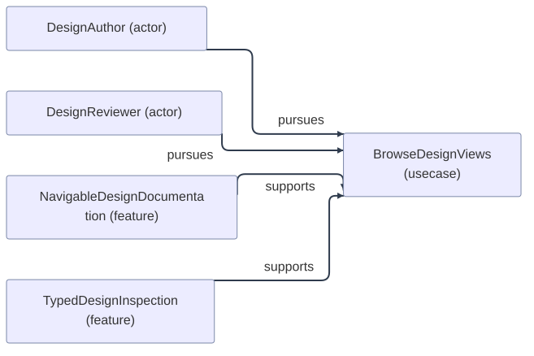

Kildegrunnlag: f0144, f0152, f0637, f1143.

### Bruksmål: BuildNativeProduct

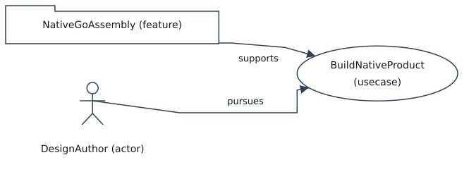

Kildegrunnlag: f0145, f0620.

### Bruksmål: EditRunningPrototype

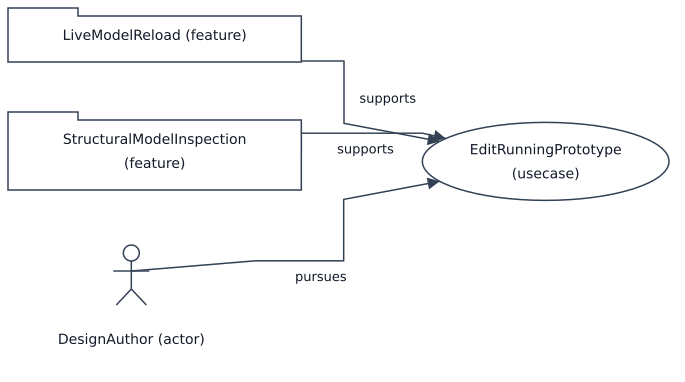

Kildegrunnlag: f0146, f0587, f1109.

### Bruksmål: InspectModels

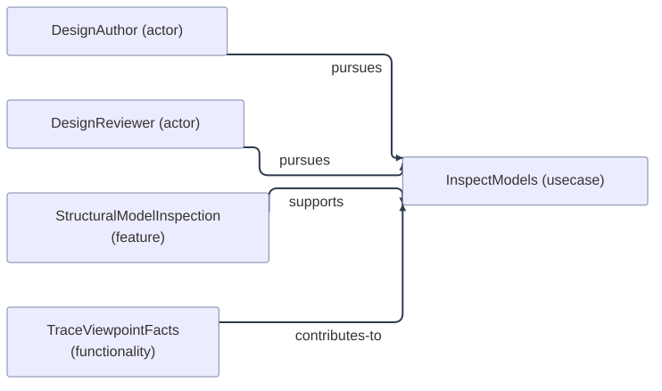

Kildegrunnlag: f0147, f0153, f1110, f1138, f1144.

### Bruksmål: PrototypeUserInterface

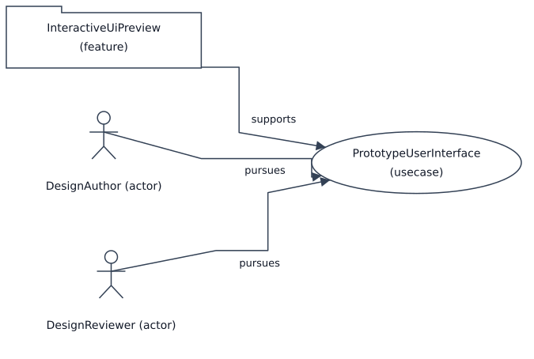

Kildegrunnlag: f0148, f0154, f0550.

### Bruksmål: PublishDesignDocumentation

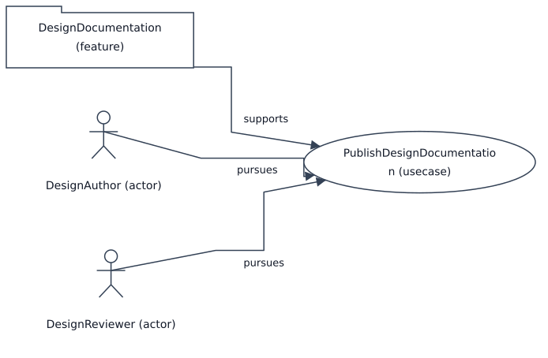

Kildegrunnlag: f0149, f0151, f0155.

### Bruksmål: TryDomainInteraction

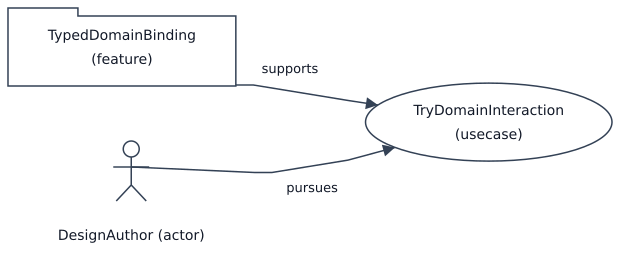

Kildegrunnlag: f0150, f1145.

### Functionality-bidrag til Feature: DesignDocumentation

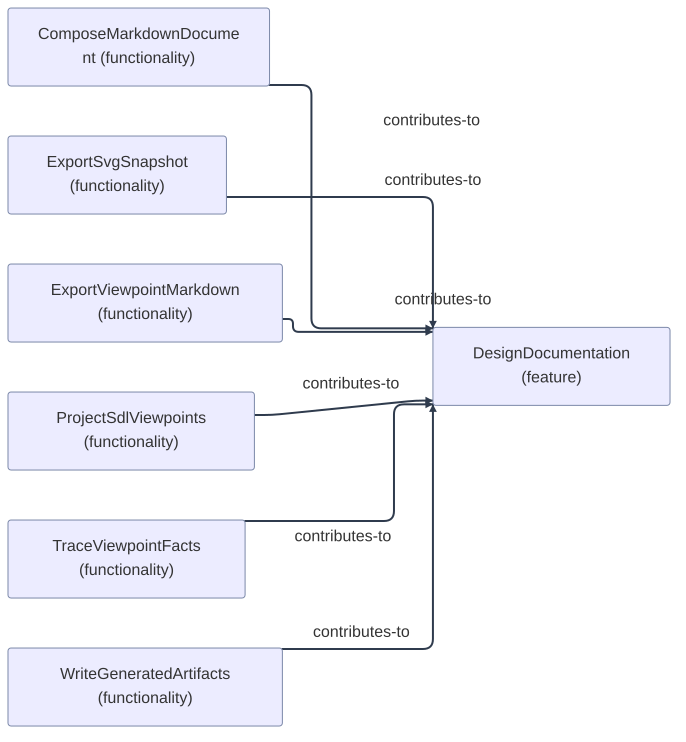

Kildegrunnlag: f0126, f0232, f0237, f0715, f1137, f1414.

### Functionality-bidrag til Feature: InteractiveUiPreview

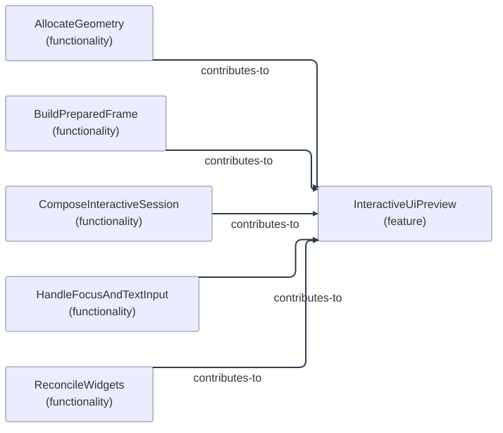

Kildegrunnlag: f0018, f0064, f0123, f0534, f0739.

### Functionality-bidrag til Feature: LiveModelReload

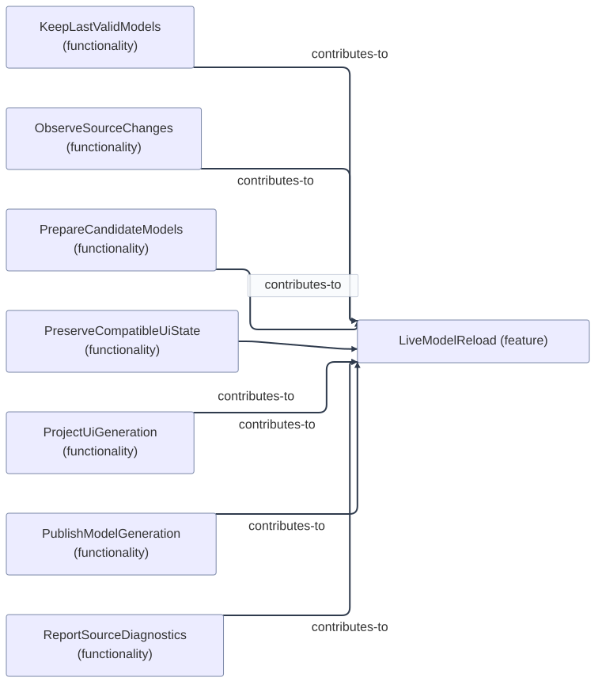

Kildegrunnlag: f0562, f0655, f0677, f0695, f0721, f0729, f0799.

### Functionality-bidrag til Feature: NativeGoAssembly

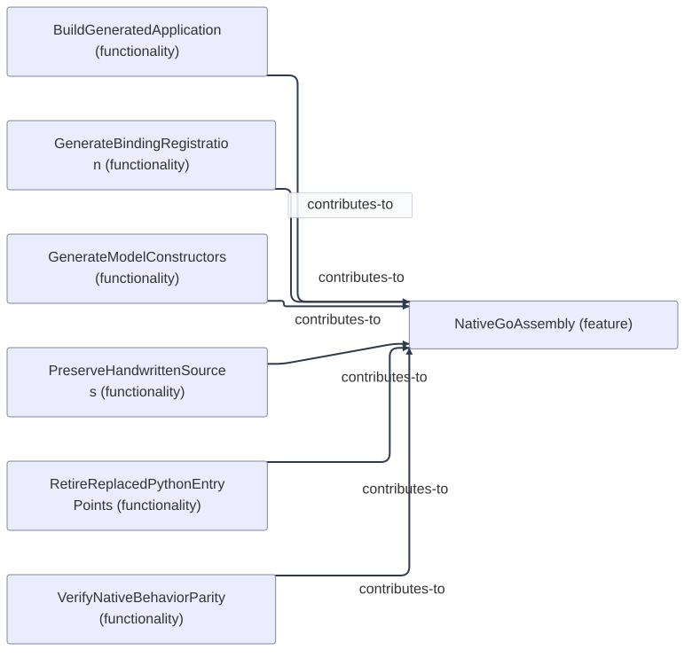

Kildegrunnlag: f0055, f0483, f0491, f0698, f0823, f1280.

### Functionality-bidrag til Feature: NavigableDesignDocumentation

Kildegrunnlag: f0083, f0129, f0190, f0218, f0494, f0565, f0710, f0719, f0734, f0746, f0808, f0820, f0828, f1072, f1267.

### Functionality-bidrag til Feature: StructuralModelInspection

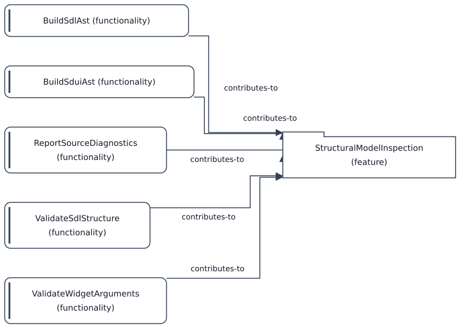

Kildegrunnlag: f0067, f0072, f0800, f1253, f1270.

### Functionality-bidrag til Feature: TypedDesignInspection

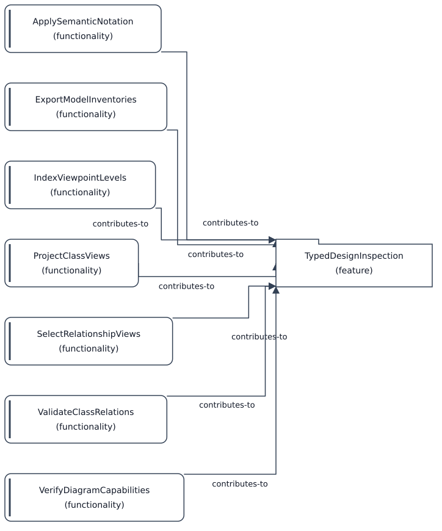

Kildegrunnlag: f0023, f0225, f0538, f0712, f1051, f1244, f1278.

### Functionality-bidrag til Feature: TypedDomainBinding

Kildegrunnlag: f0132, f0187, f0559, f0726, f0805.

## VP02 — Arkitektur og logisk inndeling

Container er en erklært runtimegrense. Unit-røtter viser logisk struktur.
contains angir ikke deployment. Eksplisitt Functionality-allokering vises per modus i VP07.

### Arkitekturrøtter — ingen kobling/allokering er utledet

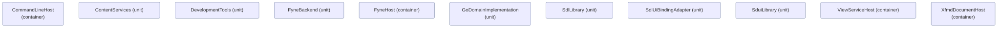

Kildegrunnlag: Kun deklarasjoner.

### Logisk inndeling: ContentServices

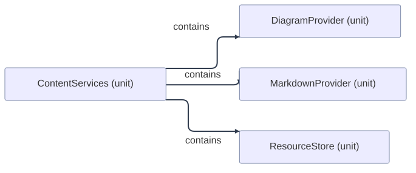

Kildegrunnlag: f0134, f0135, f0136.

### Logisk inndeling: DevelopmentTools

Kildegrunnlag: f0169, f0170, f0171, f0172, f0173, f0174.

### Logisk inndeling: SdlFrontend

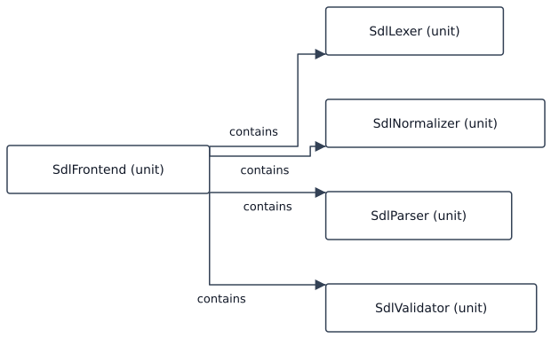

Kildegrunnlag: f0863, f0864, f0865, f0866.

### Logisk inndeling: SdlLibrary

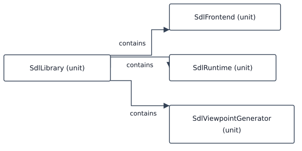

Kildegrunnlag: f0877, f0878, f0879.

### Logisk inndeling: SdlRuntime

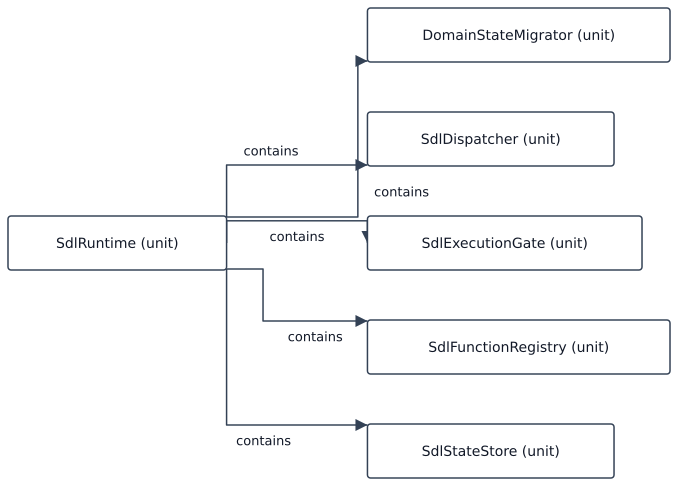

Kildegrunnlag: f0898, f0899, f0900, f0901, f0902.

### Logisk inndeling: SduiFrontend

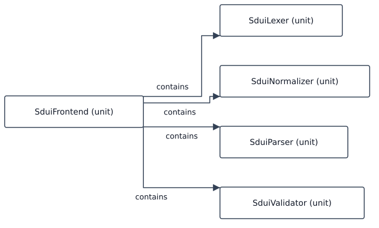

Kildegrunnlag: f0958, f0959, f0960, f0961.

### Logisk inndeling: SduiLibrary

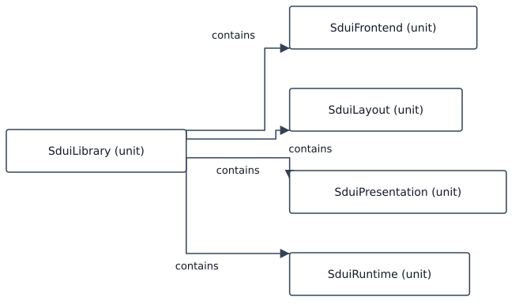

Kildegrunnlag: f1003, f1004, f1005, f1006.

### Logisk inndeling: SduiRuntime

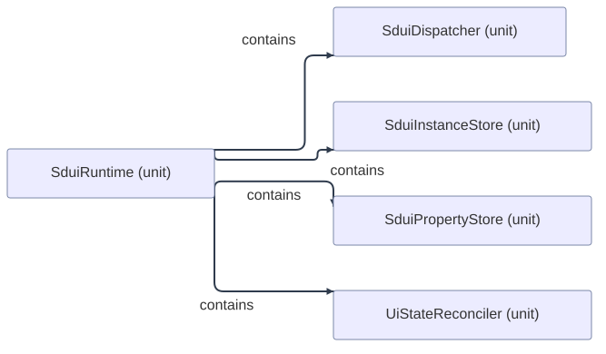

Kildegrunnlag: f1035, f1036, f1037, f1038.

### Logisk inndeling: ViewServiceHost

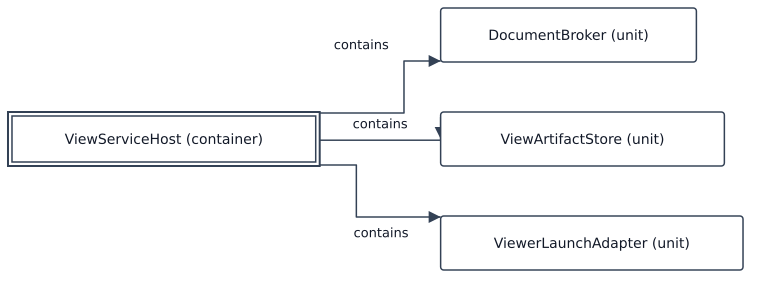

Kildegrunnlag: f1396, f1397, f1398.

## VP03 — Ansvar og kapabiliteter over arkitekturen

### Bidrag til kapabilitet: BoundInteraction

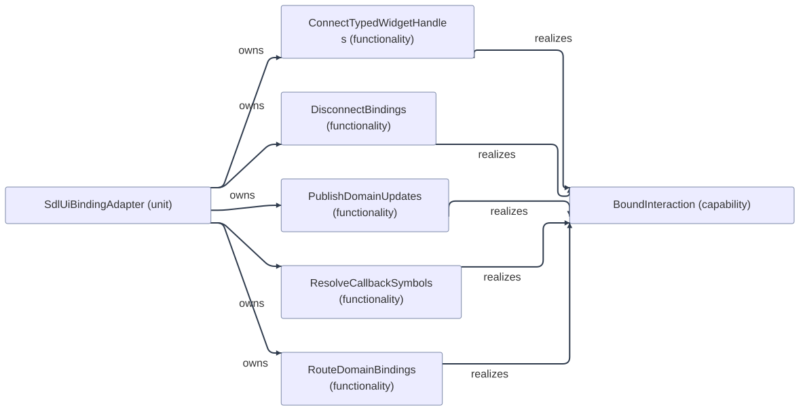

Kildegrunnlag: f0133, f0185, f0727, f0806, f0829, f0913, f0914, f0915, f0916, f0917.

### Tilbydere av kapabilitet: BoundInteraction

Kildegrunnlag: f0918.

### Bidrag til kapabilitet: DevelopmentReload

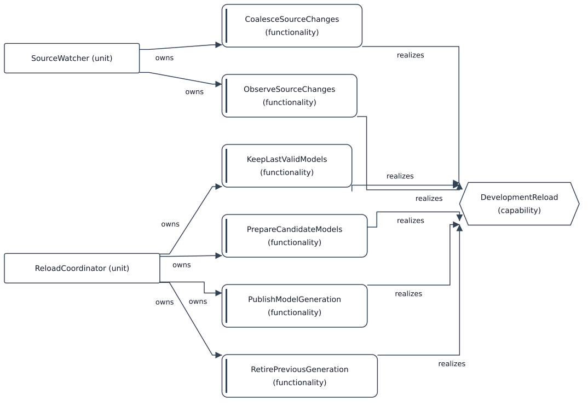

Kildegrunnlag: f0089, f0563, f0656, f0678, f0731, f0760, f0761, f0762, f0763, f0821, f1089, f1090.

### Tilbydere av kapabilitet: DevelopmentReload

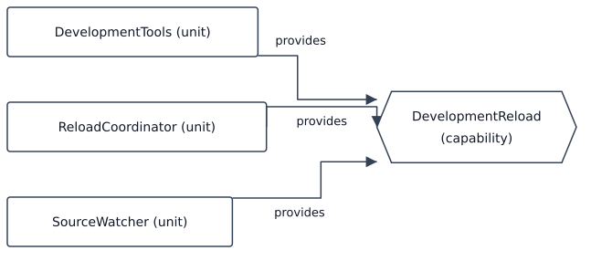

Kildegrunnlag: f0177, f0764, f1091.

### Bidrag til kapabilitet: DomainOperations

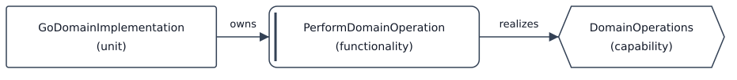

Kildegrunnlag: f0523, f0675.

### Tilbydere av kapabilitet: DomainOperations

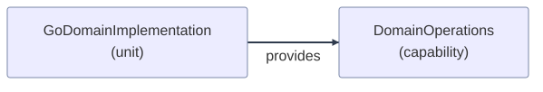

Kildegrunnlag: f0524.

### Bidrag til kapabilitet: ExecutableDesign

Kildegrunnlag: f0081, f0084, f0085, f0086, f0087, f0140, f0142, f0214, f0215, f0560, f0589, f0603, f0743, f0848, f0849, f0850, f0851, f0859, f0872, f0873, f0903, f0904, f0907, f0908, f1077, f1242.

### Tilbydere av kapabilitet: ExecutableDesign

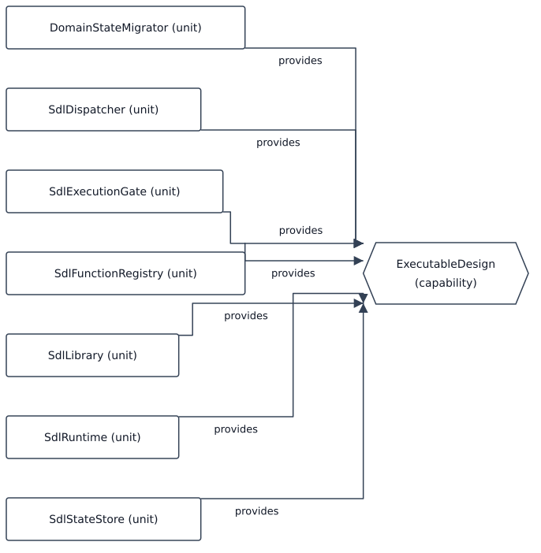

Kildegrunnlag: f0216, f0852, f0860, f0874, f0880, f0905, f0909.

### Bidrag til kapabilitet: InteractiveSession

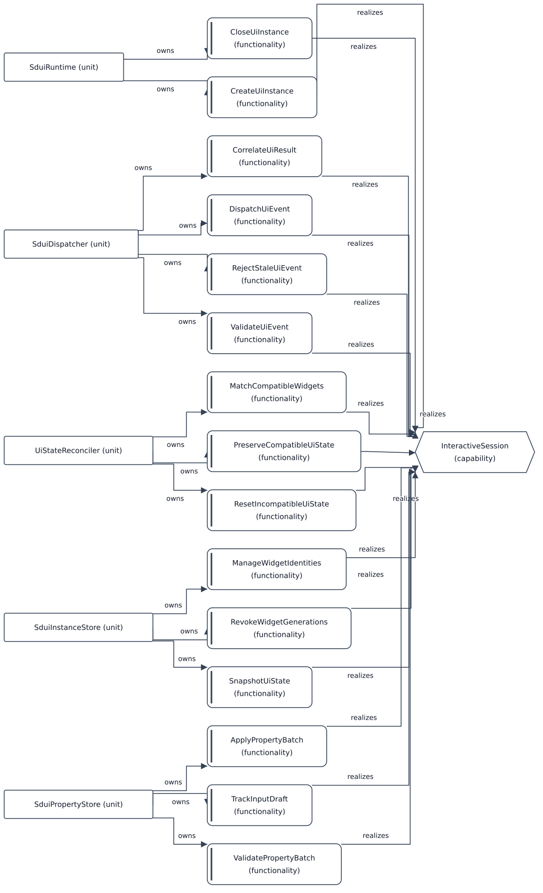

Kildegrunnlag: f0021, f0088, f0141, f0143, f0188, f0591, f0598, f0696, f0744, f0802, f0824, f0946, f0947, f0948, f0949, f0979, f0981, f0982, f1029, f1030, f1031, f1039, f1040, f1078, f1142, f1224, f1225, f1226, f1245, f1260.

### Tilbydere av kapabilitet: InteractiveSession

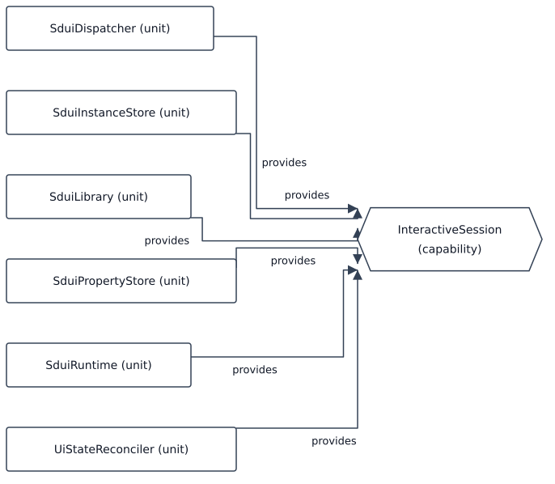

Kildegrunnlag: f0950, f0983, f1007, f1032, f1041, f1227.

### Bidrag til kapabilitet: MeasuredPresentation

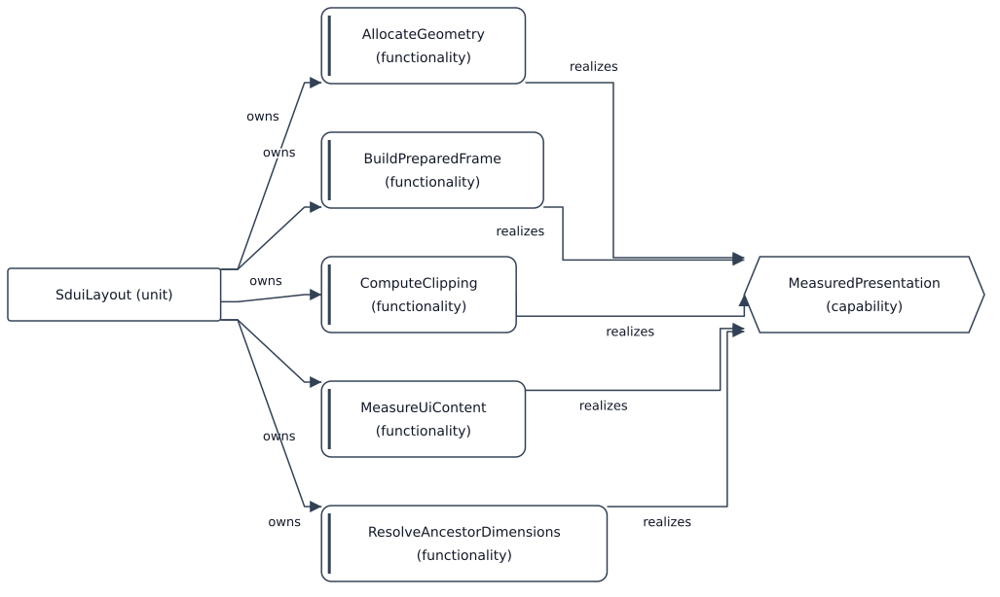

Kildegrunnlag: f0019, f0065, f0130, f0600, f0803, f0989, f0990, f0991, f0992, f0993.

### Tilbydere av kapabilitet: MeasuredPresentation

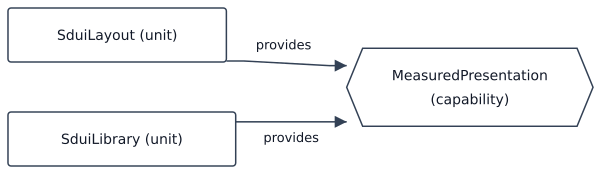

Kildegrunnlag: f0994, f1008.

### Bidrag til kapabilitet: NativeInteraction

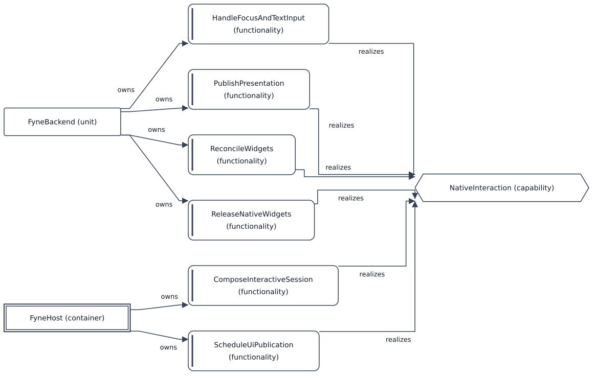

Kildegrunnlag: f0124, f0248, f0249, f0250, f0251, f0267, f0268, f0535, f0732, f0741, f0747, f0832.

### Tilbydere av kapabilitet: NativeInteraction

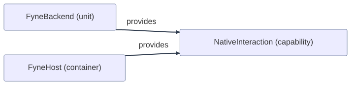

Kildegrunnlag: f0252, f0269.

### Bidrag til kapabilitet: NativeRealization

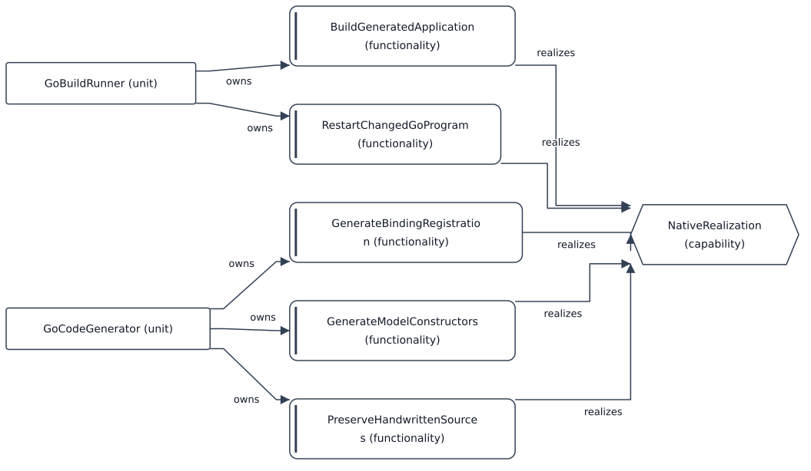

Kildegrunnlag: f0056, f0484, f0492, f0505, f0506, f0513, f0514, f0515, f0699, f0818.

### Tilbydere av kapabilitet: NativeRealization

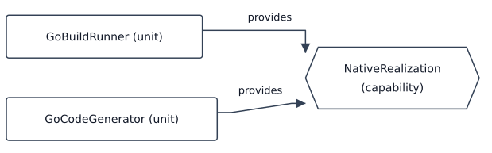

Kildegrunnlag: f0507, f0516.

### Bidrag til kapabilitet: RichContent

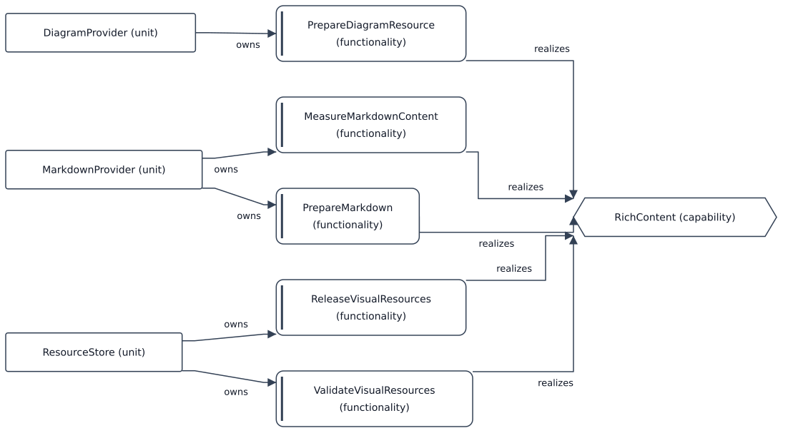

Kildegrunnlag: f0183, f0595, f0596, f0599, f0679, f0680, f0748, f0815, f0816, f1268.

### Tilbydere av kapabilitet: RichContent

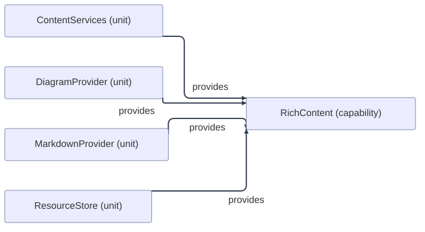

Kildegrunnlag: f0137, f0184, f0597, f0817.

### Bidrag til kapabilitet: SdlSourceModel

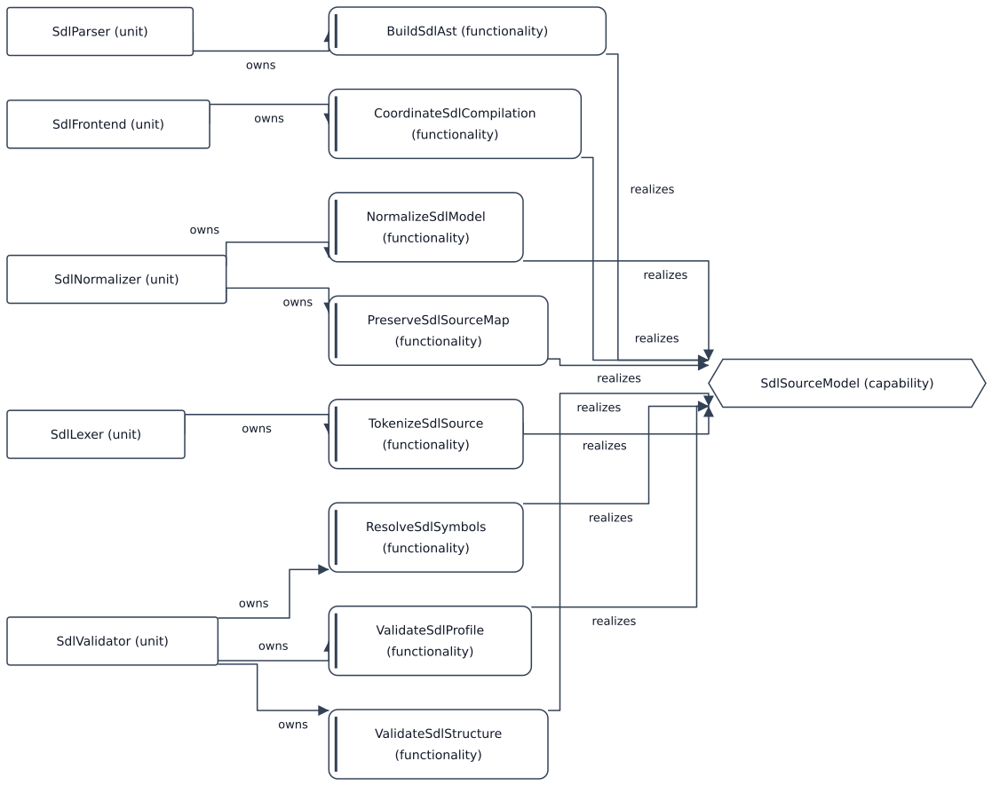

Kildegrunnlag: f0070, f0138, f0640, f0702, f0811, f0867, f0875, f0891, f0892, f0894, f0923, f0925, f0926, f1125, f1251, f1256.

### Tilbydere av kapabilitet: SdlSourceModel

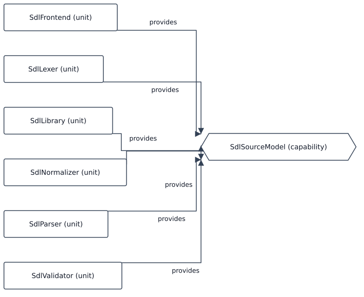

Kildegrunnlag: f0868, f0876, f0881, f0893, f0895, f0927.

### Bidrag til kapabilitet: SduiSourceModel

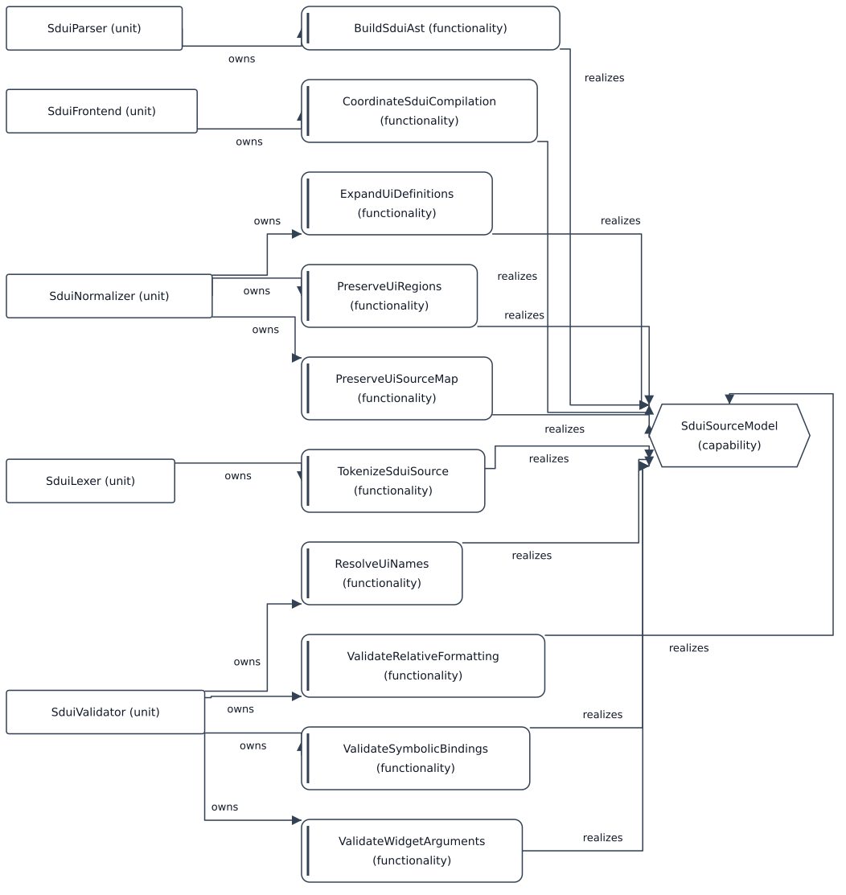

Kildegrunnlag: f0075, f0139, f0222, f0705, f0708, f0814, f0962, f0999, f1011, f1012, f1013, f1017, f1043, f1044, f1045, f1046, f1128, f1248, f1259, f1273.

### Tilbydere av kapabilitet: SduiSourceModel

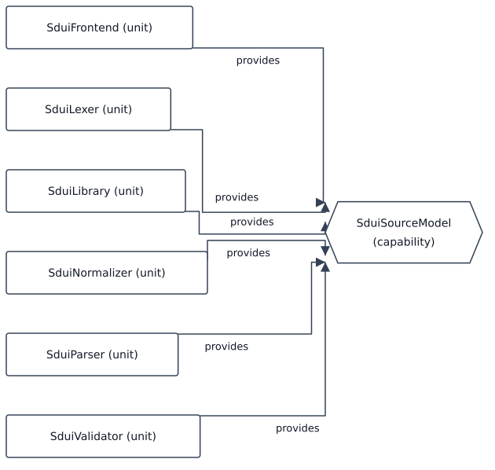

Kildegrunnlag: f0963, f1000, f1009, f1014, f1018, f1047.

### Bidrag til kapabilitet: SourceDiagnostics

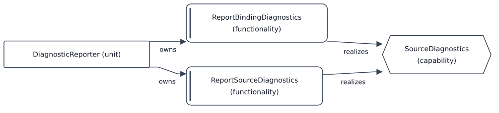

Kildegrunnlag: f0178, f0179, f0796, f0801.

### Tilbydere av kapabilitet: SourceDiagnostics

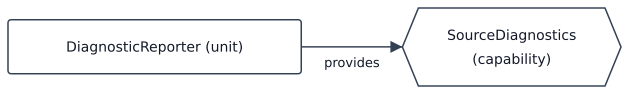

Kildegrunnlag: f0180.

### Bidrag til kapabilitet: SourceLoading

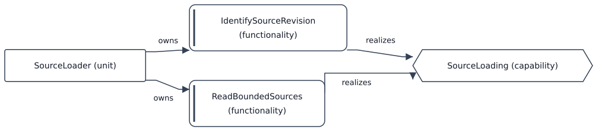

Kildegrunnlag: f0536, f0737, f1085, f1086.

### Tilbydere av kapabilitet: SourceLoading

Kildegrunnlag: f1087.

### Bidrag til kapabilitet: StaticDocumentation

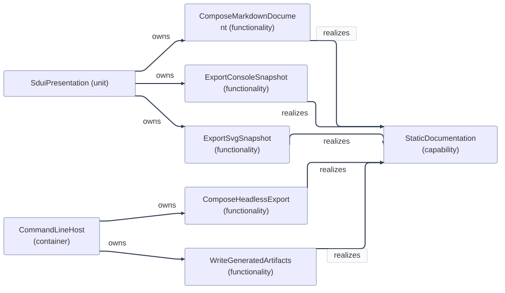

Kildegrunnlag: f0094, f0095, f0121, f0127, f0223, f0233, f1022, f1023, f1024, f1415.

### Tilbydere av kapabilitet: StaticDocumentation

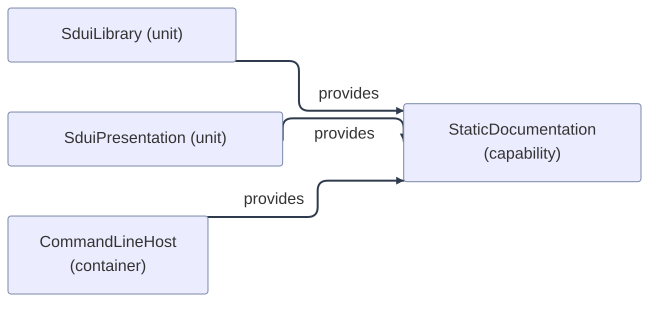

Kildegrunnlag: f0096, f1010, f1025.

## VP05 — Avhengigheter per modus

### Nødvendige porter i modus: BoundExecution

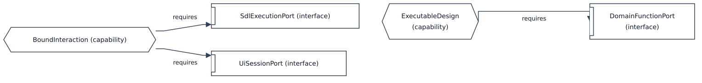

Kildegrunnlag: f0052, f0053, f0219.

### Nødvendige porter i modus: BoundLiveEditing

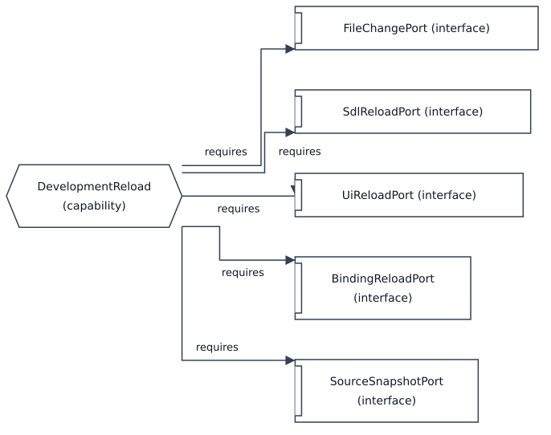

Kildegrunnlag: f0161, f0162, f0164, f0165, f0167.

### Nødvendige porter i modus: LiveEditing

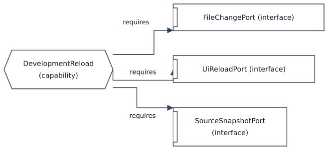

Kildegrunnlag: f0163, f0166, f0168.

### Nødvendige porter i modus: NativeBuild

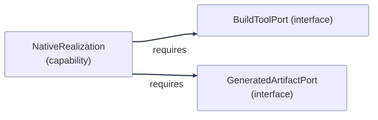

Kildegrunnlag: f0630, f0631.

### Nødvendige porter i modus: RichDocument

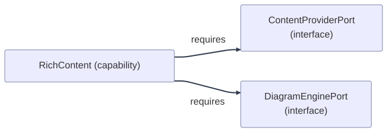

Kildegrunnlag: f0825, f0826.

### Nødvendige porter i modus: SourceInspection

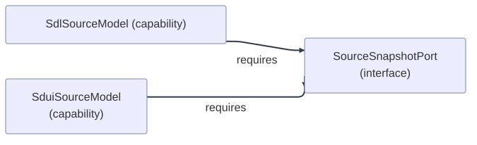

Kildegrunnlag: f0906, f1042.

### Nødvendige porter i modus: StaticExport

Kildegrunnlag: f0601, f1098, f1099.

### Nødvendige porter i modus: UiPreview

Kildegrunnlag: f0602, f0621.

## VP06 — Aktiviteter og leveranseplan

### Aktivitetsrøtter

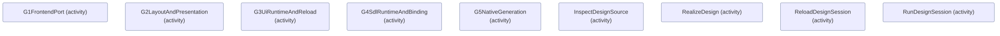

Kildegrunnlag: Kun deklarasjoner.

### Aktivitetsinndeling: G1FrontendPort

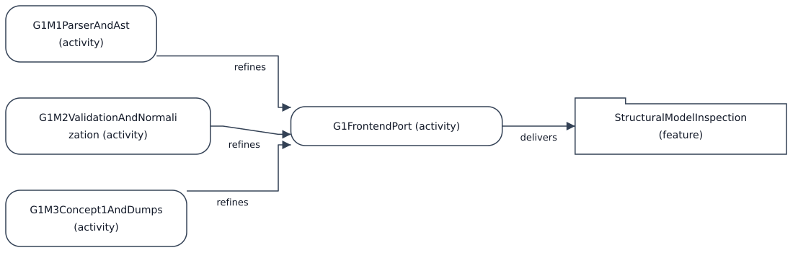

Kildegrunnlag: f0276, f0283, f0294, f0299.

### Aktivitetsinndeling: G2LayoutAndPresentation

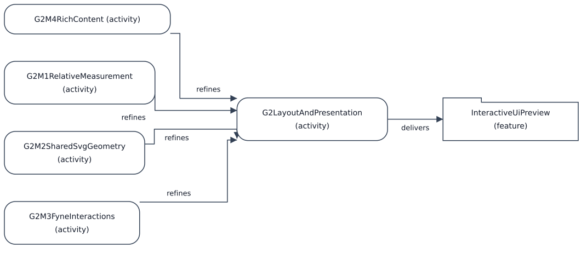

Kildegrunnlag: f0300, f0308, f0313, f0322, f0330.

### Aktivitetsinndeling: G3UiRuntimeAndReload

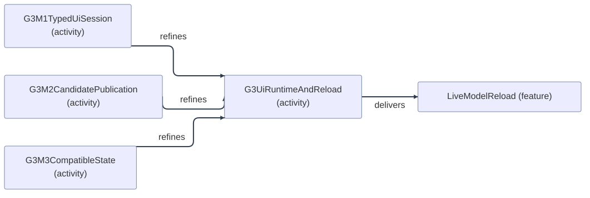

Kildegrunnlag: f0347, f0356, f0362, f0363.

### Aktivitetsinndeling: G4SdlRuntimeAndBinding

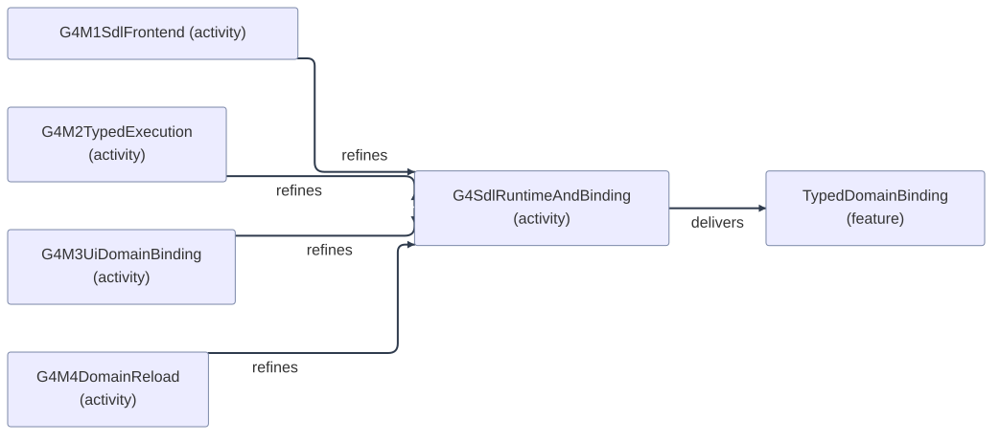

Kildegrunnlag: f0374, f0389, f0399, f0406, f0407.

### Aktivitetsinndeling: G5NativeGeneration

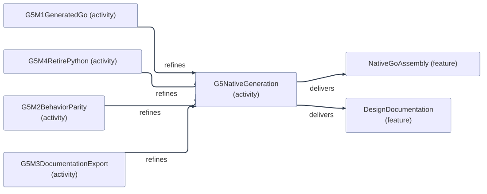

Kildegrunnlag: f0415, f0419, f0427, f0432, f0433, f0434.

### Aktivitetsinndeling: G6NavigableDocumentation

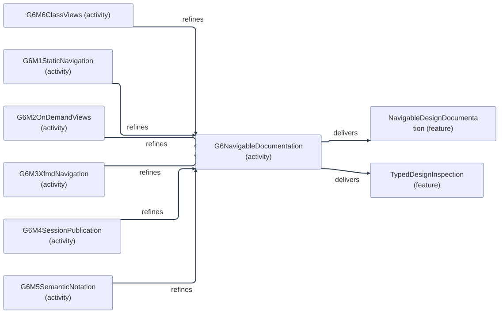

Kildegrunnlag: f0446, f0454, f0461, f0468, f0473, f0478, f0479, f0480.

### Aktivitetsinndeling: InspectDesignSource

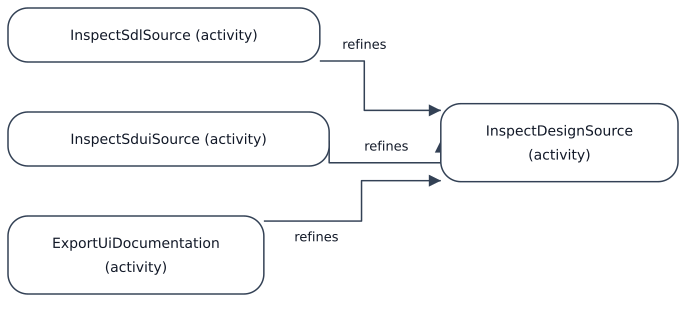

Kildegrunnlag: f0234, f0539, f0540.

### Aktivitetsinndeling: RealizeDesign

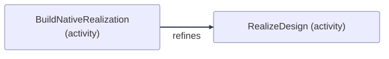

Kildegrunnlag: f0062.

### Aktivitetsinndeling: ReloadDesignSession

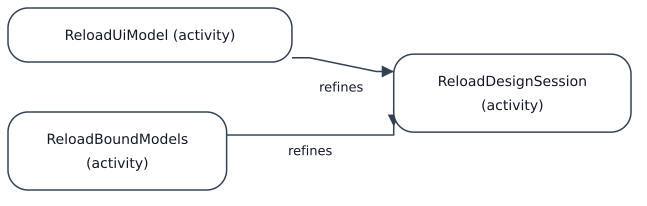

Kildegrunnlag: f0752, f0795.

### Aktivitetsinndeling: RunDesignSession

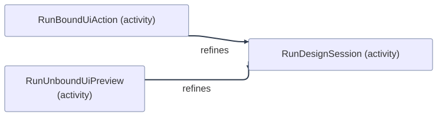

Kildegrunnlag: f0830, f0831.

### Planlagt ansvar: G1M1ParserAndAst

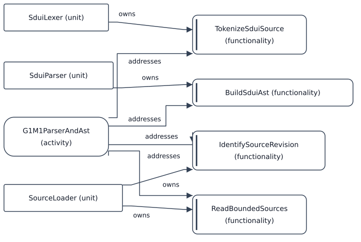

Kildegrunnlag: f0278, f0279, f0280, f0281, f0999, f1017, f1085, f1086.

### Planlagt ansvar: G1M2ValidationAndNormalization

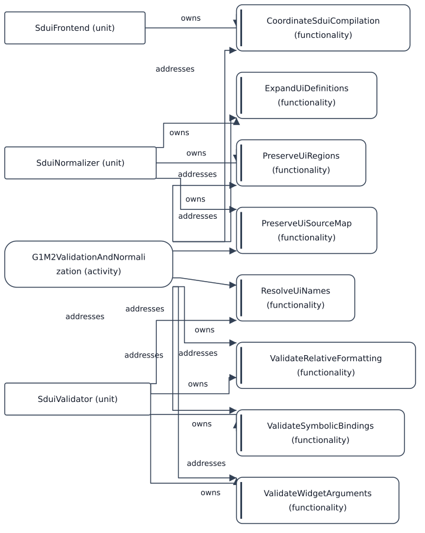

Kildegrunnlag: f0284, f0285, f0286, f0287, f0288, f0289, f0290, f0291, f0962, f1011, f1012, f1013, f1043, f1044, f1045, f1046.

### Planlagt ansvar: G1M3Concept1AndDumps

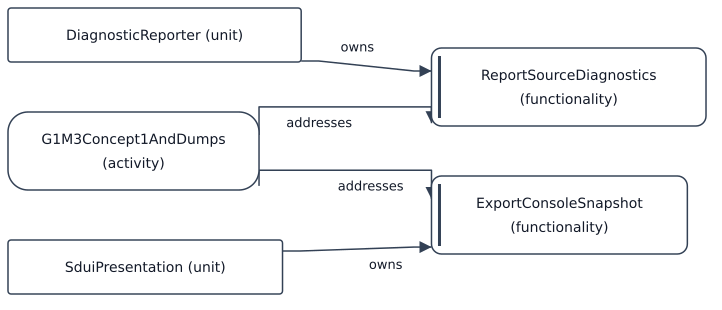

Kildegrunnlag: f0179, f0295, f0296, f1023.

### Planlagt ansvar: G2M1RelativeMeasurement

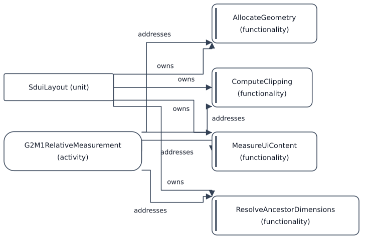

Kildegrunnlag: f0302, f0303, f0304, f0305, f0989, f0991, f0992, f0993.

### Planlagt ansvar: G2M2SharedSvgGeometry

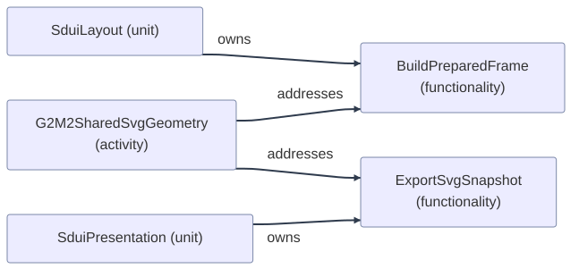

Kildegrunnlag: f0309, f0310, f0990, f1024.

### Planlagt ansvar: G2M3FyneInteractions

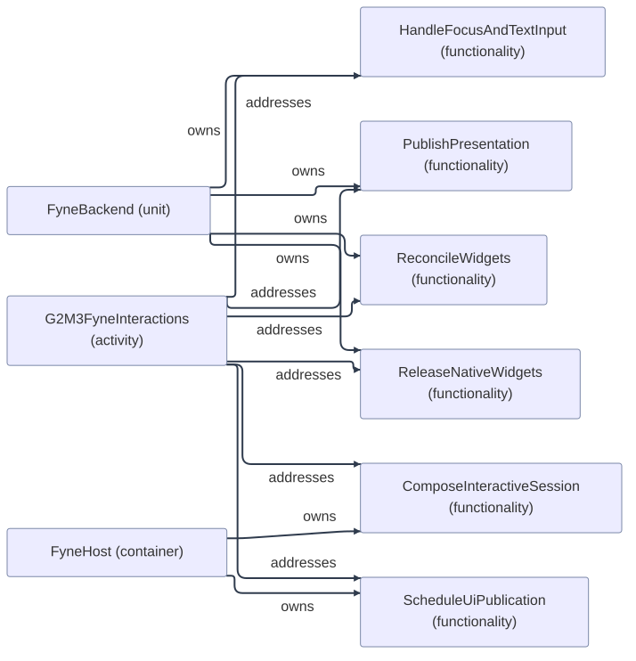

Kildegrunnlag: f0248, f0249, f0250, f0251, f0267, f0268, f0314, f0315, f0316, f0317, f0318, f0319.

### Planlagt ansvar: G2M4RichContent

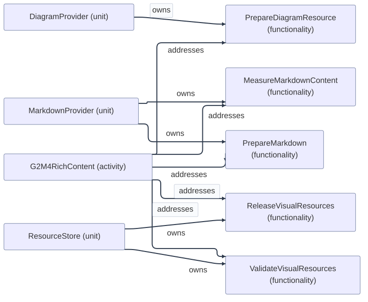

Kildegrunnlag: f0183, f0323, f0324, f0325, f0326, f0327, f0595, f0596, f0815, f0816.

### Planlagt ansvar: G3M1TypedUiSession

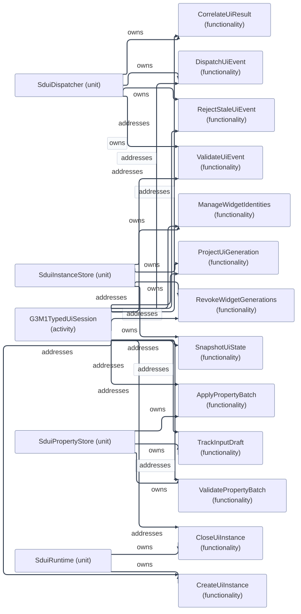

Kildegrunnlag: f0331, f0332, f0333, f0334, f0335, f0336, f0337, f0338, f0339, f0340, f0341, f0342, f0343, f0946, f0947, f0948, f0949, f0979, f0980, f0981, f0982, f1029, f1030, f1031, f1039, f1040.

### Planlagt ansvar: G3M2CandidatePublication

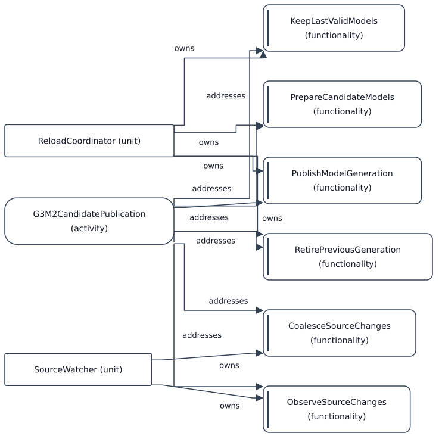

Kildegrunnlag: f0348, f0349, f0350, f0351, f0352, f0353, f0760, f0761, f0762, f0763, f1089, f1090.

### Planlagt ansvar: G3M3CompatibleState

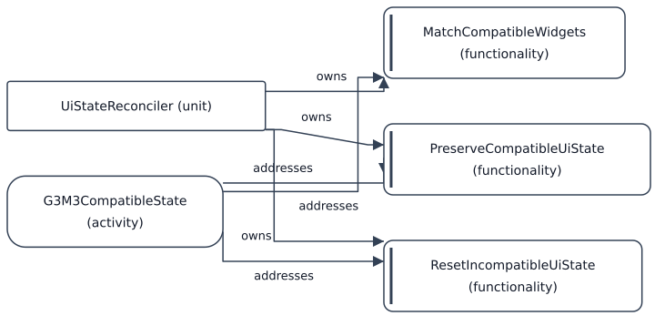

Kildegrunnlag: f0357, f0358, f0359, f1224, f1225, f1226.

### Planlagt ansvar: G4M1SdlFrontend

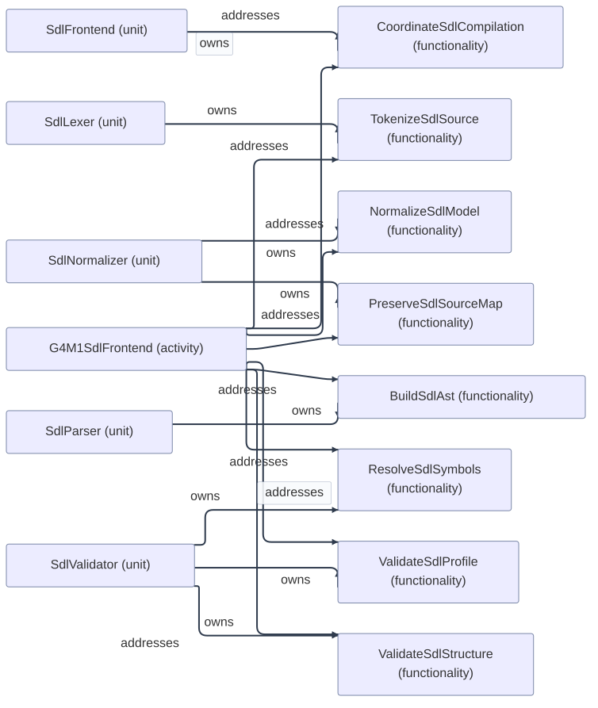

Kildegrunnlag: f0365, f0366, f0367, f0368, f0369, f0370, f0371, f0372, f0867, f0875, f0891, f0892, f0894, f0923, f0925, f0926.

### Planlagt ansvar: G4M2TypedExecution

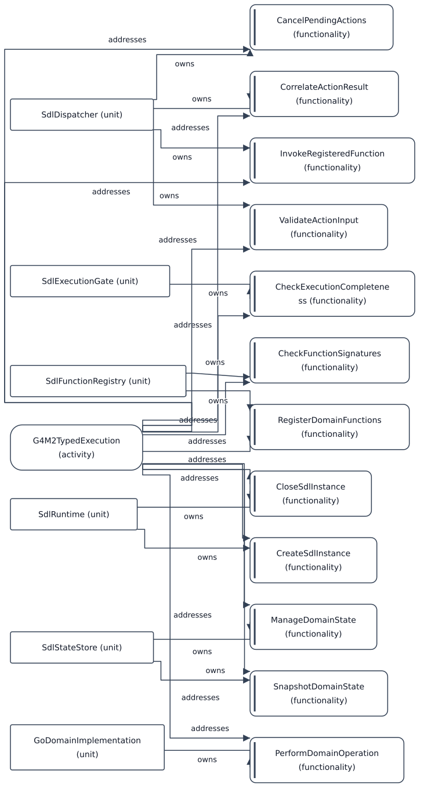

Kildegrunnlag: f0375, f0376, f0377, f0378, f0379, f0380, f0381, f0382, f0383, f0384, f0385, f0386, f0523, f0848, f0849, f0850, f0851, f0859, f0872, f0873, f0903, f0904, f0907, f0908.

### Planlagt ansvar: G4M3UiDomainBinding

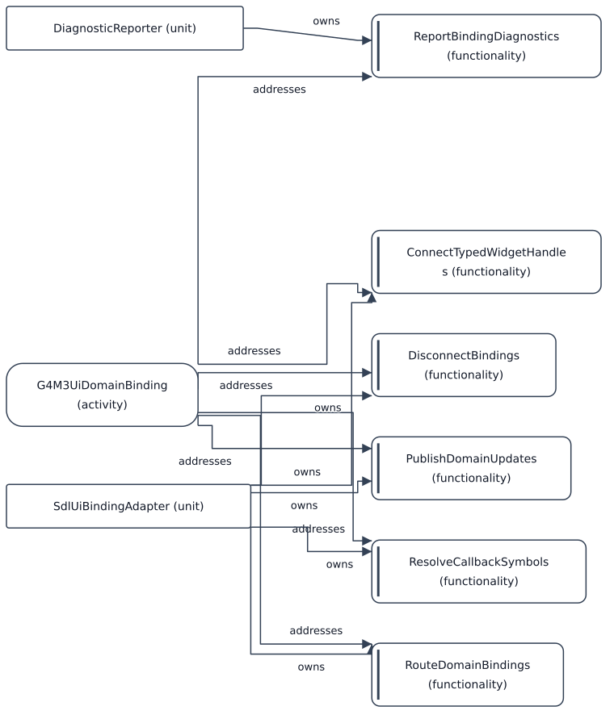

Kildegrunnlag: f0178, f0390, f0391, f0392, f0393, f0394, f0395, f0913, f0914, f0915, f0916, f0917.

### Planlagt ansvar: G4M4DomainReload

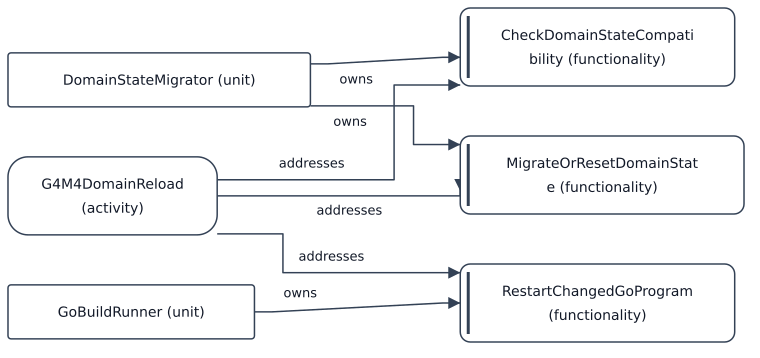

Kildegrunnlag: f0214, f0215, f0400, f0401, f0402, f0506.

### Planlagt ansvar: G5M1GeneratedGo

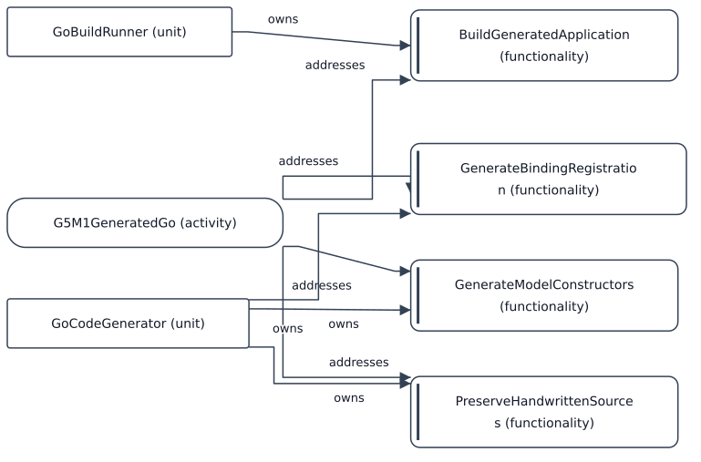

Kildegrunnlag: f0409, f0410, f0411, f0412, f0505, f0513, f0514, f0515.

### Planlagt ansvar: G5M2BehaviorParity

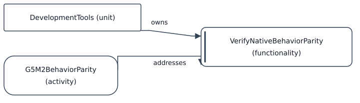

Kildegrunnlag: f0176, f0416.

### Planlagt ansvar: G5M3DocumentationExport

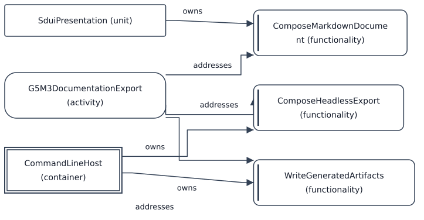

Kildegrunnlag: f0094, f0095, f0420, f0421, f0422, f1022.

### Planlagt ansvar: G5M4RetirePython

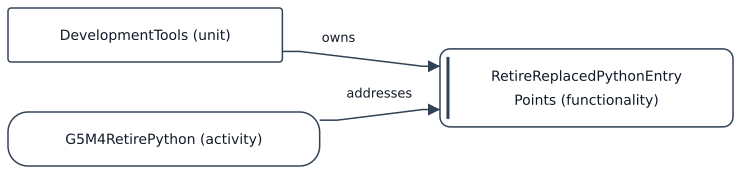

Kildegrunnlag: f0175, f0428.

### Planlagt ansvar: G6M1StaticNavigation

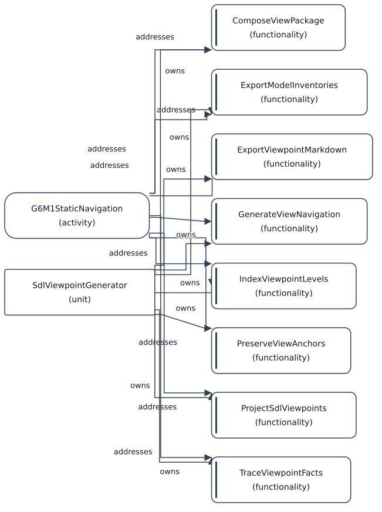

Kildegrunnlag: f0436, f0437, f0438, f0439, f0440, f0441, f0442, f0443, f0929, f0930, f0931, f0932, f0933, f0934, f0936, f0939.

### Planlagt ansvar: G6M2OnDemandViews

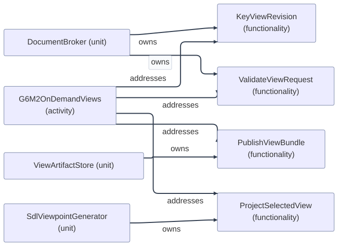

Kildegrunnlag: f0193, f0196, f0447, f0448, f0449, f0450, f0451, f0937, f0938, f1282.

### Planlagt ansvar: G6M3XfmdNavigation

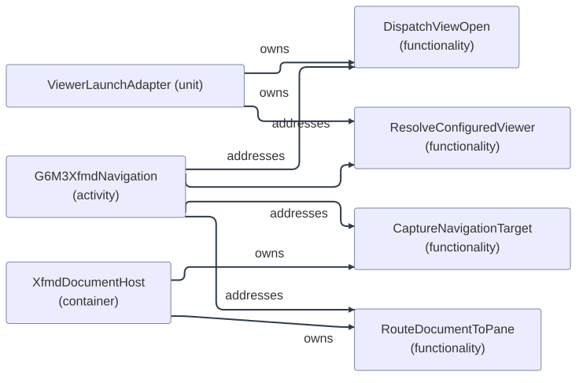

Kildegrunnlag: f0455, f0456, f0457, f0458, f1406, f1407, f1416, f1417.

### Planlagt ansvar: G6M4SessionPublication

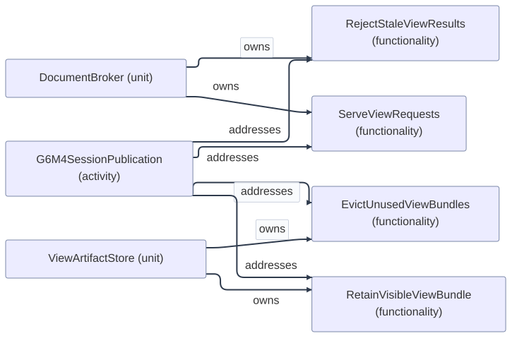

Kildegrunnlag: f0194, f0195, f0462, f0463, f0464, f0465, f1281, f1283.

### Planlagt ansvar: G6M5SemanticNotation

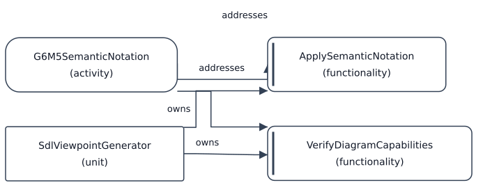

Kildegrunnlag: f0469, f0470, f0928, f0940.

### Planlagt ansvar: G6M6ClassViews

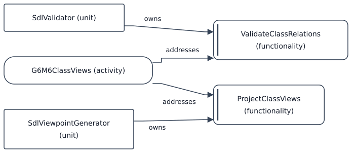

Kildegrunnlag: f0474, f0475, f0924, f0935.

### Eksplisitte aktivitetsavhengigheter

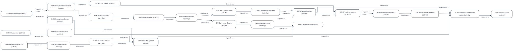

Kildegrunnlag: f0292, f0297, f0306, f0311, f0320, f0328, f0344, f0345, f0354, f0360, f0387, f0396, f0397, f0403, f0404, f0413, f0417, f0423, f0424, f0425, f0429, f0430, f0444, f0452, f0459, f0466, f0471, f0476.

## VP07 — Features over arkitekturen

### Feature: DesignDocumentation — modus DocumentBrowsing

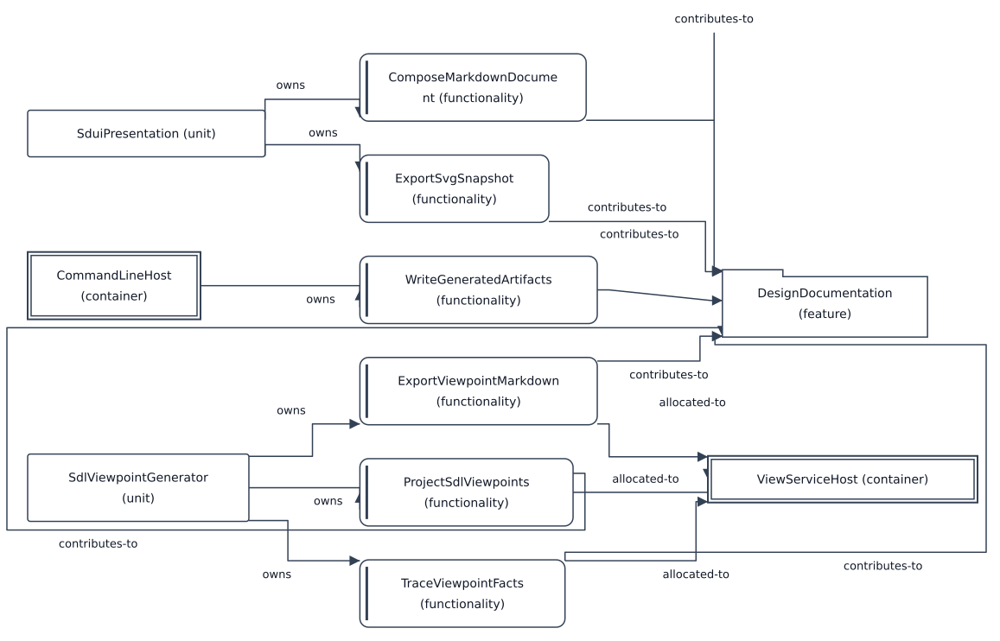

Kildegrunnlag: f0095, f0126, f0232, f0236, f0237, f0714, f0715, f0931, f0936, f0939, f1022, f1024, f1136, f1137, f1414.

### Feature: DesignDocumentation — modus SourceInspection

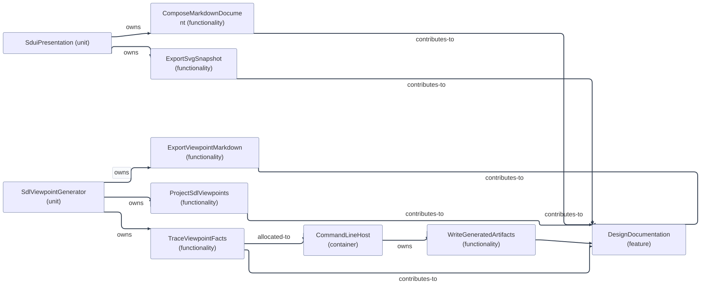

Kildegrunnlag: f0095, f0126, f0232, f0237, f0715, f0931, f0936, f0939, f1022, f1024, f1134, f1137, f1414.

### Feature: DesignDocumentation — modus StaticExport

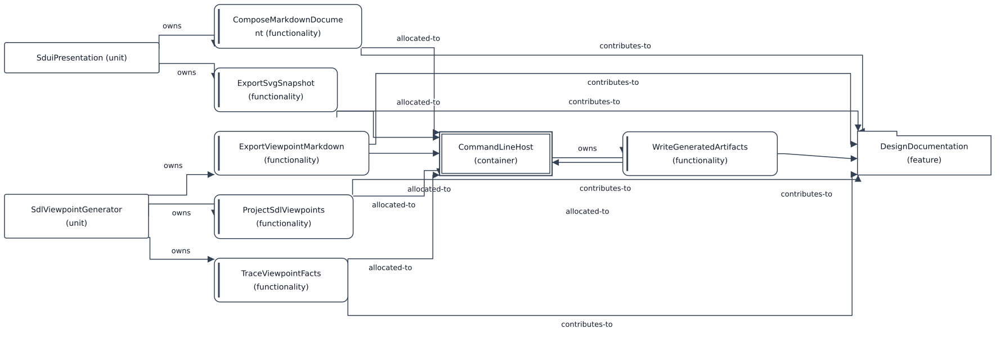

Kildegrunnlag: f0095, f0125, f0126, f0231, f0232, f0235, f0237, f0713, f0715, f0931, f0936, f0939, f1022, f1024, f1135, f1137, f1413, f1414.

### Feature: InteractiveUiPreview — modus UiPreview

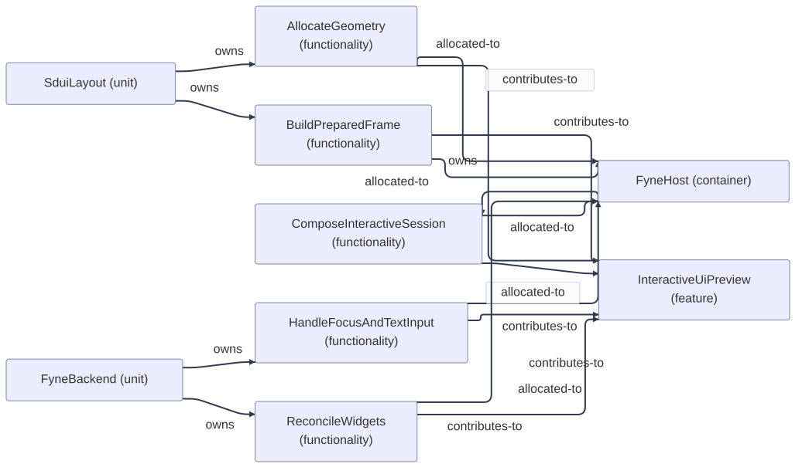

Kildegrunnlag: f0017, f0018, f0063, f0064, f0122, f0123, f0248, f0250, f0267, f0533, f0534, f0738, f0739, f0989, f0990.

### Feature: LiveModelReload — modus LiveEditing

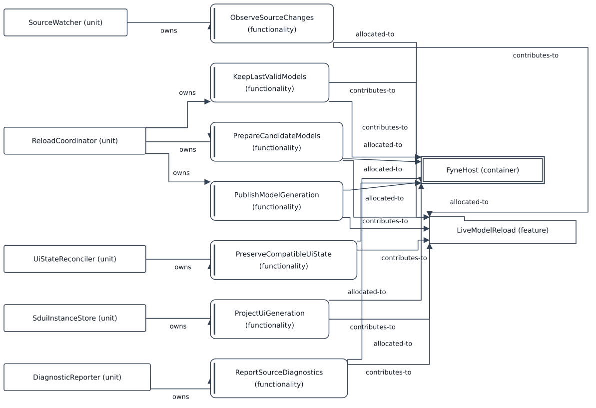

Kildegrunnlag: f0179, f0561, f0562, f0654, f0655, f0676, f0677, f0694, f0695, f0720, f0721, f0728, f0729, f0760, f0761, f0762, f0798, f0799, f0980, f1090, f1225.

### Feature: LiveModelReload — modus SourceInspection

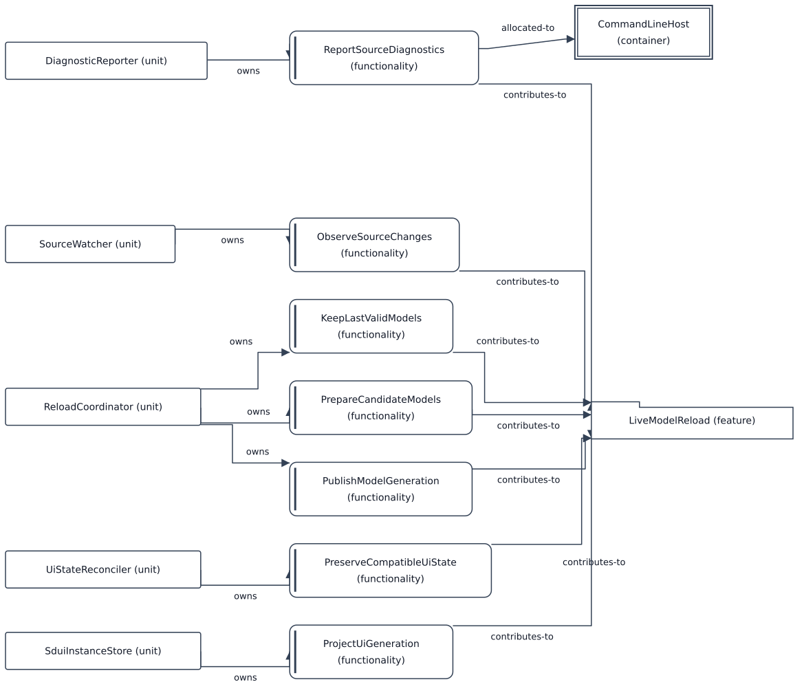

Kildegrunnlag: f0179, f0562, f0655, f0677, f0695, f0721, f0729, f0760, f0761, f0762, f0797, f0799, f0980, f1090, f1225.

### Feature: NativeGoAssembly — modus NativeBuild

Kildegrunnlag: f0054, f0055, f0175, f0176, f0482, f0483, f0490, f0491, f0505, f0513, f0514, f0515, f0697, f0698, f0822, f0823, f1279, f1280.

### Feature: NavigableDesignDocumentation — modus DocumentBrowsing

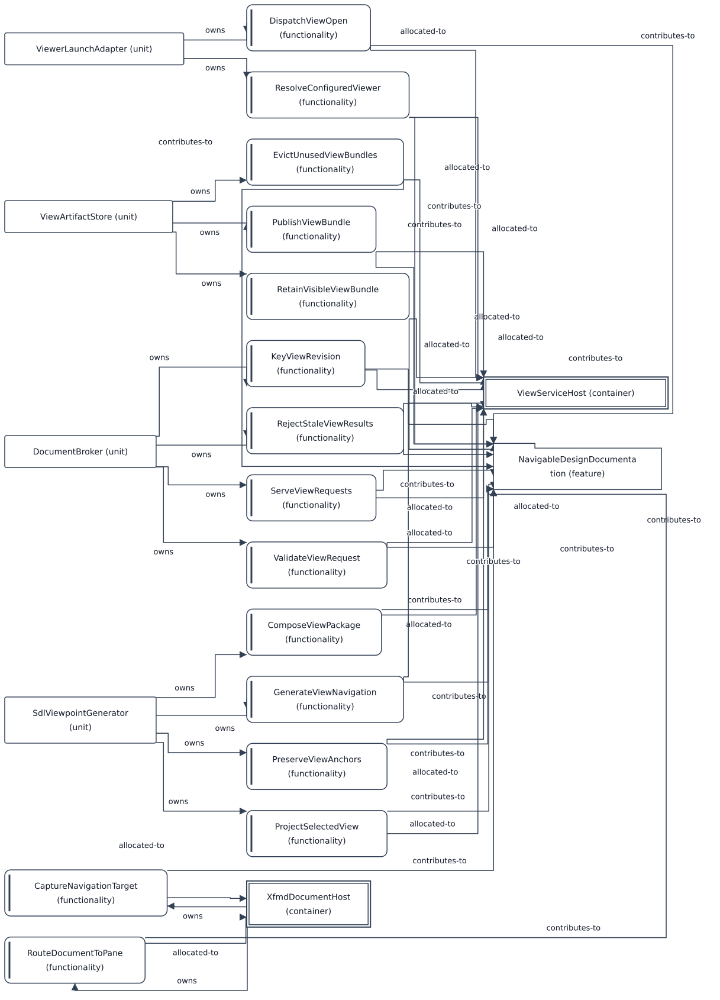

Kildegrunnlag: f0082, f0083, f0128, f0129, f0189, f0190, f0193, f0194, f0195, f0196, f0217, f0218, f0493, f0494, f0564, f0565, f0709, f0710, f0718, f0719, f0733, f0734, f0745, f0746, f0807, f0808, f0819, f0820, f0827, f0828, f0929, f0932, f0934, f0937, f1071, f1072, f1266, f1267, f1281, f1282, f1283, f1406, f1407, f1416, f1417.

### Feature: StructuralModelInspection — modus LiveEditing

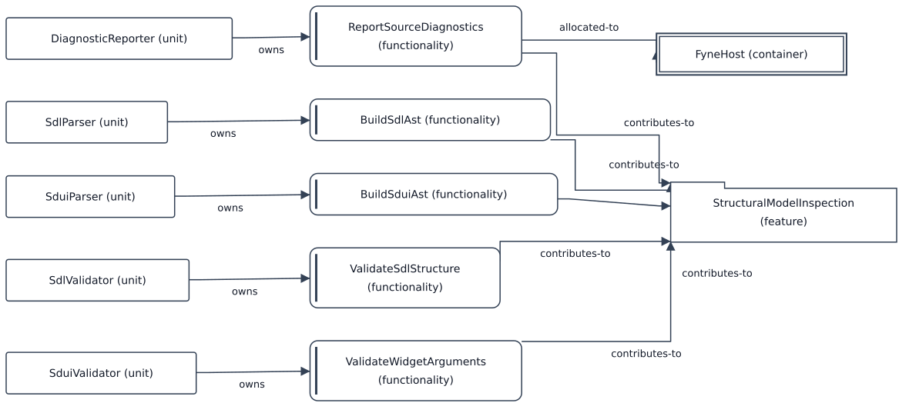

Kildegrunnlag: f0067, f0072, f0179, f0798, f0800, f0894, f0926, f1017, f1046, f1253, f1270.

### Feature: StructuralModelInspection — modus SourceInspection

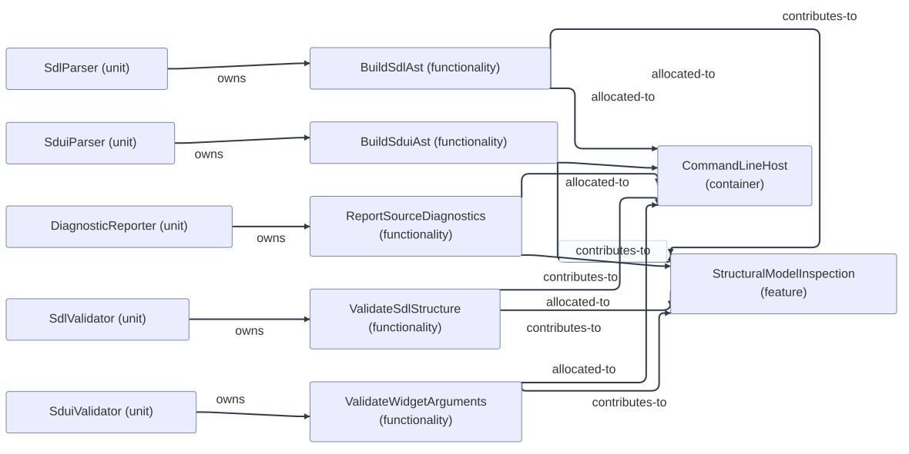

Kildegrunnlag: f0066, f0067, f0071, f0072, f0179, f0797, f0800, f0894, f0926, f1017, f1046, f1252, f1253, f1269, f1270.

### Feature: TypedDesignInspection — modus DocumentBrowsing

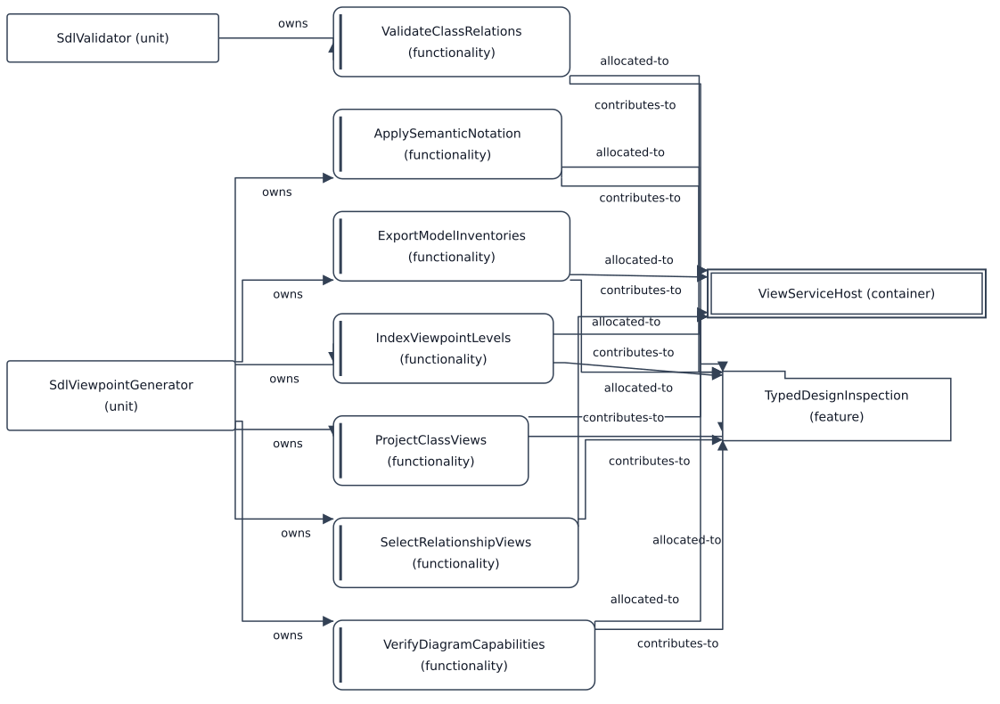

Kildegrunnlag: f0022, f0023, f0224, f0225, f0537, f0538, f0711, f0712, f0924, f0928, f0930, f0933, f0935, f0938, f0940, f1050, f1051, f1243, f1244, f1277, f1278.

### Feature: TypedDomainBinding — modus BoundExecution

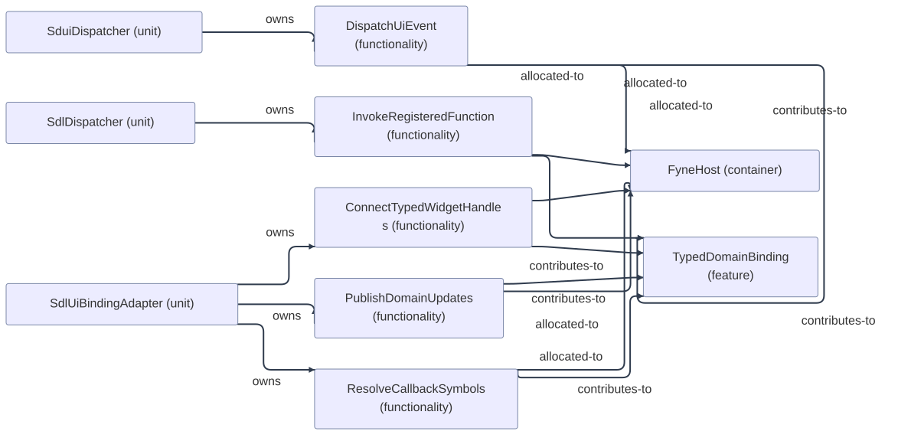

Kildegrunnlag: f0131, f0132, f0186, f0187, f0558, f0559, f0725, f0726, f0804, f0805, f0850, f0913, f0915, f0916, f0947.

### Modellhull i dette utsnittet

| Identitet | Modus | Mangel |
| --- | --- | --- |
| ComposeMarkdownDocument | DocumentBrowsing | Container-allokering er uspesifisert for bidrag til DesignDocumentation. |
| ExportSvgSnapshot | DocumentBrowsing | Container-allokering er uspesifisert for bidrag til DesignDocumentation. |
| WriteGeneratedArtifacts | DocumentBrowsing | Container-allokering er uspesifisert for bidrag til DesignDocumentation. |
| ComposeMarkdownDocument | SourceInspection | Container-allokering er uspesifisert for bidrag til DesignDocumentation. |
| ExportSvgSnapshot | SourceInspection | Container-allokering er uspesifisert for bidrag til DesignDocumentation. |
| ExportViewpointMarkdown | SourceInspection | Container-allokering er uspesifisert for bidrag til DesignDocumentation. |
| ProjectSdlViewpoints | SourceInspection | Container-allokering er uspesifisert for bidrag til DesignDocumentation. |
| WriteGeneratedArtifacts | SourceInspection | Container-allokering er uspesifisert for bidrag til DesignDocumentation. |
| KeepLastValidModels | SourceInspection | Container-allokering er uspesifisert for bidrag til LiveModelReload. |
| ObserveSourceChanges | SourceInspection | Container-allokering er uspesifisert for bidrag til LiveModelReload. |
| PrepareCandidateModels | SourceInspection | Container-allokering er uspesifisert for bidrag til LiveModelReload. |
| PreserveCompatibleUiState | SourceInspection | Container-allokering er uspesifisert for bidrag til LiveModelReload. |
| ProjectUiGeneration | SourceInspection | Container-allokering er uspesifisert for bidrag til LiveModelReload. |
| PublishModelGeneration | SourceInspection | Container-allokering er uspesifisert for bidrag til LiveModelReload. |
| BuildSdlAst | LiveEditing | Container-allokering er uspesifisert for bidrag til StructuralModelInspection. |
| BuildSduiAst | LiveEditing | Container-allokering er uspesifisert for bidrag til StructuralModelInspection. |
| ValidateSdlStructure | LiveEditing | Container-allokering er uspesifisert for bidrag til StructuralModelInspection. |
| ValidateWidgetArguments | LiveEditing | Container-allokering er uspesifisert for bidrag til StructuralModelInspection. |

## VP08 — Channel-kontrakter og sekvenser

### Scenario: BoundActionAccepted — modus BoundExecution

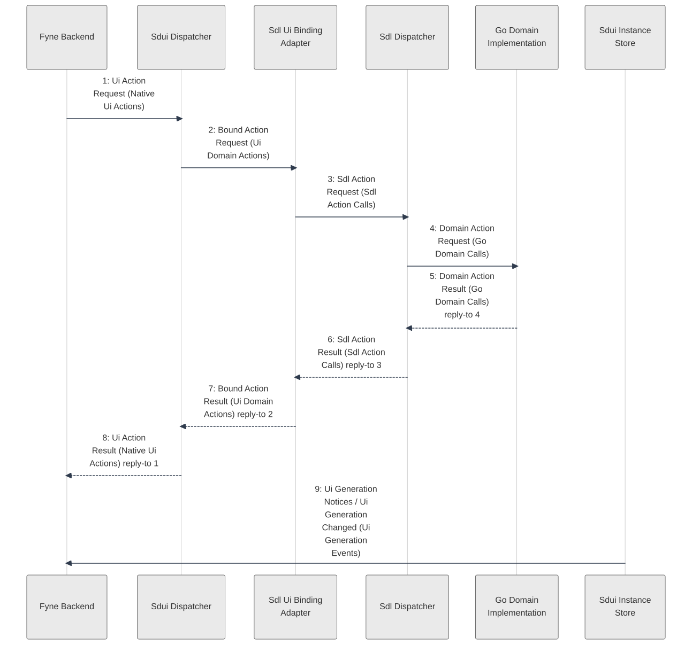

Kildegrunnlag: f0028, f0029, f0030, f0031, f0032, f0033, f0034, f0035, f0036, f0037, f0038, f0039, f0040, f0047, f0048, f0049, f0050, f0051, f0207, f0208, f0209, f0210, f0211, f0256, f0257, f0258, f0519, f0521, f0522, f0525, f0527, f0632, f0635, f0636, f0833, f0835, f0836, f0837, f0838, f0839, f0840, f0841, f0853, f0854, f0855, f0856, f0919, f0920, f0921, f0922, f0951, f0953, f0954, f0955, f0984, f1149, f1150, f1151, f1152, f1153, f1178, f1180, f1181, f1186, f1188, f1190.

### Scenario: BoundActionRejected — modus BoundExecution

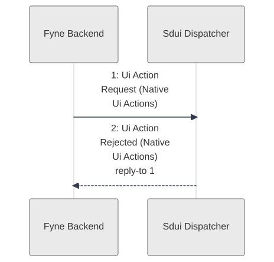

Kildegrunnlag: f0041, f0042, f0043, f0044, f0045, f0046, f0255, f0257, f0632, f0634, f0635, f0951, f0952, f1146, f1147, f1148, f1149, f1150.

### Scenario: InteractiveFramePrepared — modus UiPreview

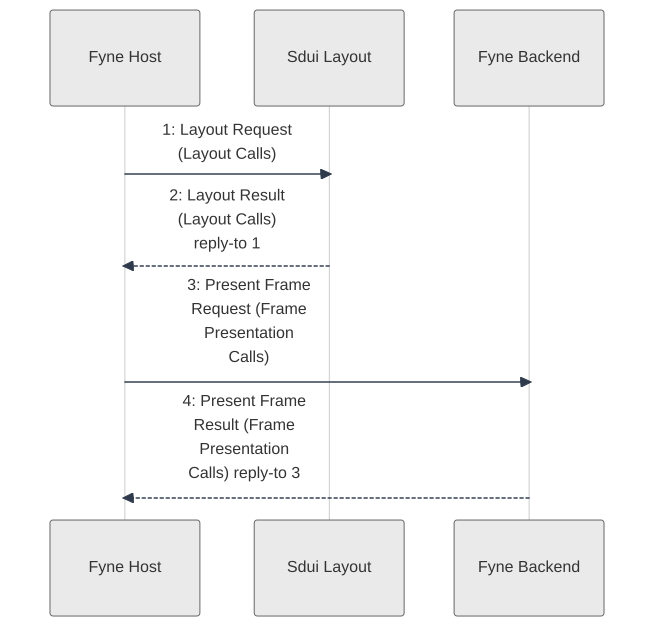

Kildegrunnlag: f0242, f0244, f0245, f0253, f0254, f0270, f0271, f0274, f0275, f0541, f0542, f0543, f0544, f0545, f0546, f0547, f0548, f0549, f0572, f0574, f0575, f0578, f0579, f0580, f0581, f0582, f0685, f0686, f0687, f0688, f0689, f0996, f0998.

### Scenario: InvalidViewSelectionRejected — modus DocumentBrowsing

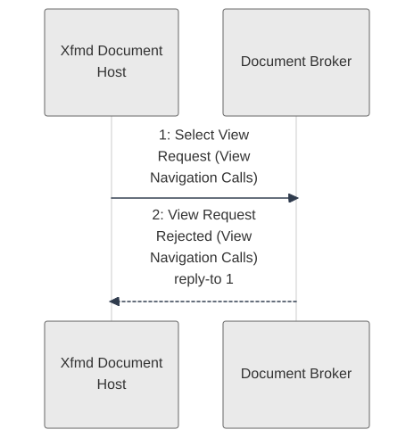

Kildegrunnlag: f0199, f0201, f0551, f0552, f0553, f0554, f0555, f0556, f0557, f1052, f1053, f1327, f1329, f1331, f1383, f1384, f1385, f1422, f1423.

### Scenario: NativeProgramBuilt — modus NativeBuild

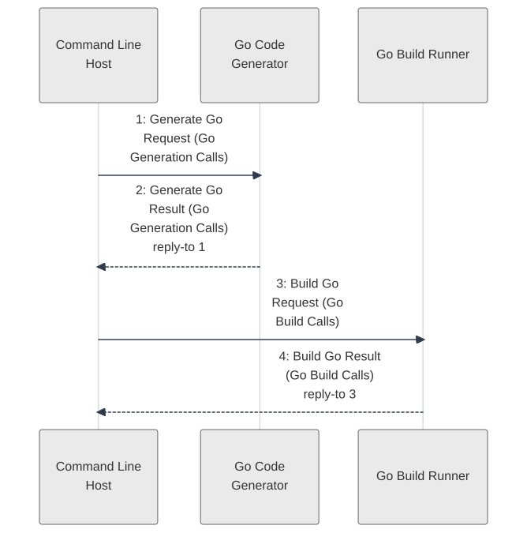

Kildegrunnlag: f0057, f0058, f0059, f0060, f0061, f0097, f0098, f0099, f0100, f0485, f0486, f0487, f0488, f0489, f0499, f0501, f0502, f0508, f0509, f0517, f0518, f0529, f0531, f0532, f0622, f0623, f0624, f0625, f0626, f0627, f0628, f0629.

### Scenario: SdlModelReloadAccepted — modus BoundLiveEditing

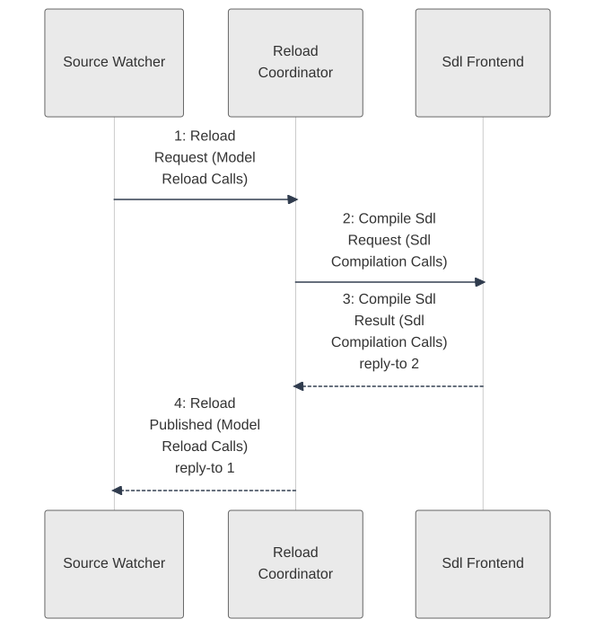

Kildegrunnlag: f0108, f0109, f0110, f0111, f0112, f0608, f0610, f0612, f0765, f0767, f0771, f0772, f0781, f0782, f0783, f0789, f0790, f0842, f0844, f0845, f0869, f0870, f0882, f0883, f0884, f0885, f0886, f0887, f0888, f0889, f0890, f1092, f1096.

### Scenario: SelectedViewOpened — modus DocumentBrowsing

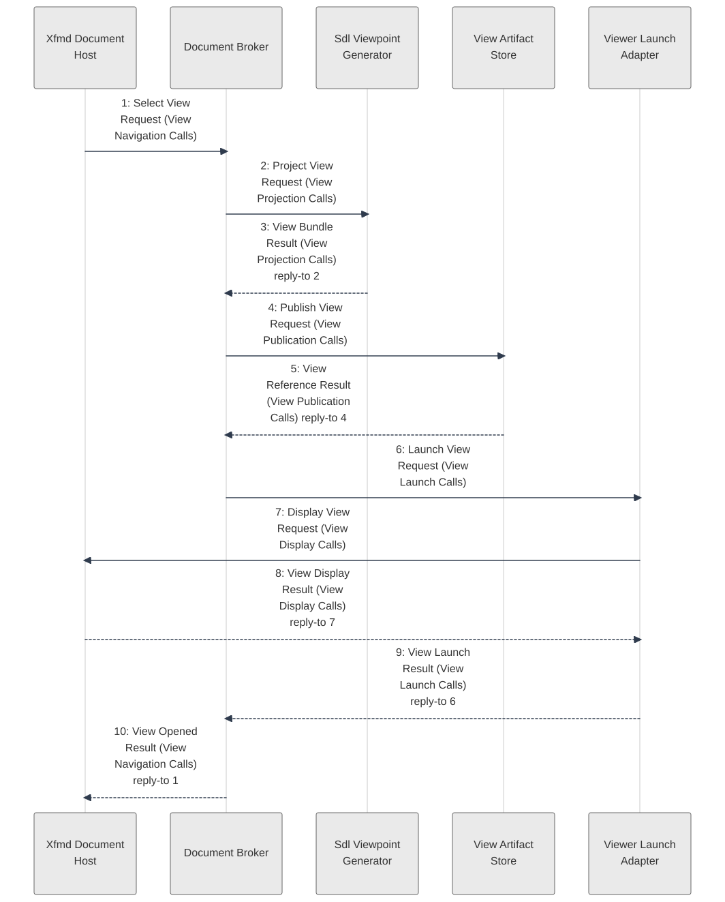

Kildegrunnlag: f0191, f0192, f0197, f0198, f0199, f0200, f0202, f0204, f0205, f0206, f0566, f0567, f0723, f0724, f0735, f0736, f0941, f0942, f1052, f1053, f1054, f1055, f1056, f1057, f1058, f1059, f1060, f1061, f1062, f1063, f1064, f1065, f1066, f1067, f1068, f1069, f1070, f1284, f1285, f1291, f1292, f1293, f1298, f1300, f1301, f1303, f1304, f1305, f1316, f1318, f1319, f1320, f1321, f1322, f1327, f1329, f1330, f1343, f1344, f1345, f1350, f1352, f1353, f1367, f1369, f1370, f1378, f1379, f1380, f1408, f1410, f1411, f1412, f1418, f1419, f1421, f1423.

### Scenario: StaticFrameExported — modus StaticExport

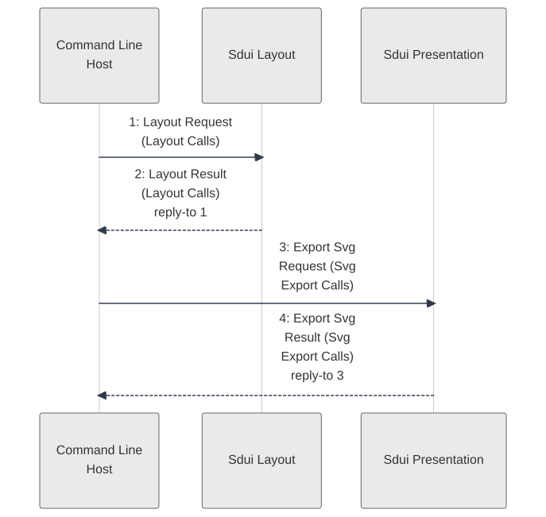

Kildegrunnlag: f0101, f0102, f0103, f0104, f0226, f0227, f0228, f0229, f0230, f0572, f0574, f0575, f0578, f0579, f0580, f0581, f0582, f0995, f0997, f1026, f1027, f1100, f1101, f1102, f1103, f1104, f1105, f1106, f1107, f1108, f1115, f1117, f1118.

### Scenario: UiCompilationAccepted — modus SourceInspection

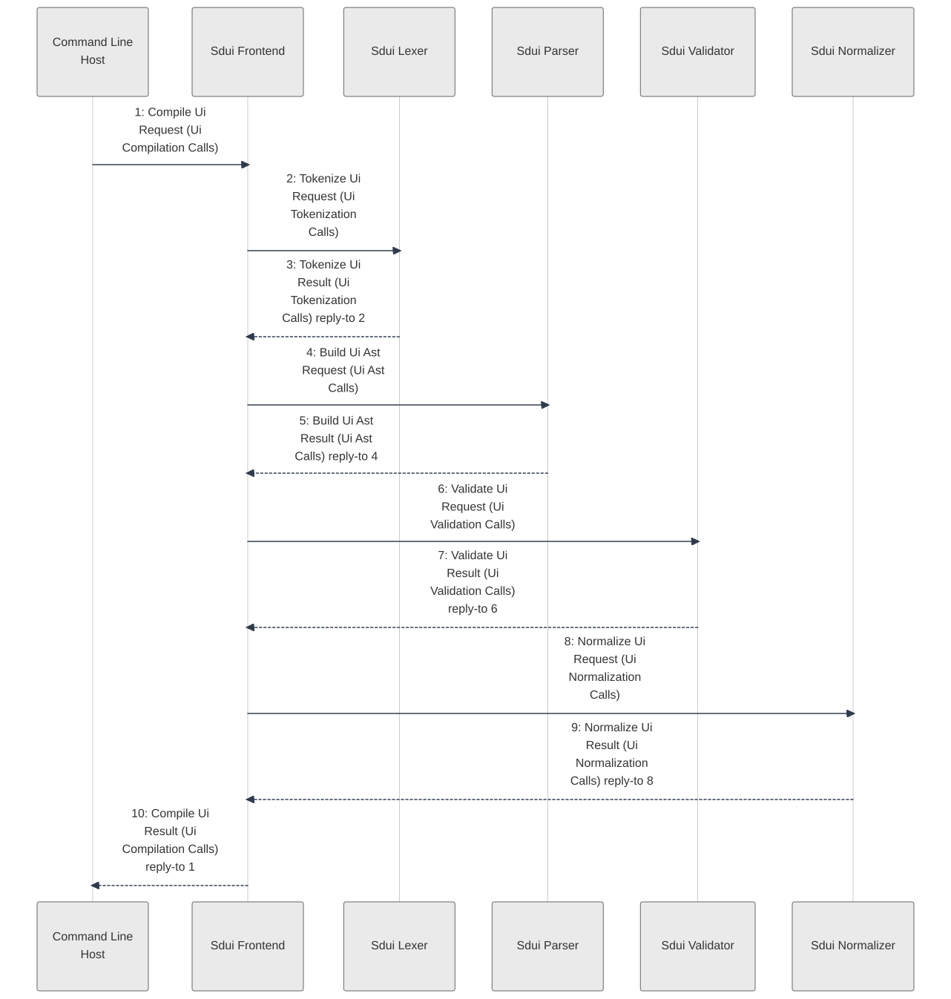

Kildegrunnlag: f0076, f0077, f0078, f0079, f0080, f0106, f0107, f0116, f0117, f0118, f0119, f0120, f0641, f0642, f0643, f0644, f0645, f0964, f0965, f0967, f0971, f0972, f0973, f0974, f0975, f0976, f0977, f1001, f1002, f1015, f1016, f1019, f1020, f1048, f1049, f1129, f1130, f1131, f1132, f1133, f1154, f1156, f1157, f1158, f1159, f1160, f1161, f1162, f1163, f1164, f1165, f1166, f1167, f1168, f1169, f1170, f1171, f1172, f1173, f1176, f1177, f1214, f1216, f1217, f1228, f1230, f1231, f1232, f1234, f1235, f1261, f1262, f1263, f1264, f1265.

### Scenario: UiModelReloadAccepted — modus LiveEditing

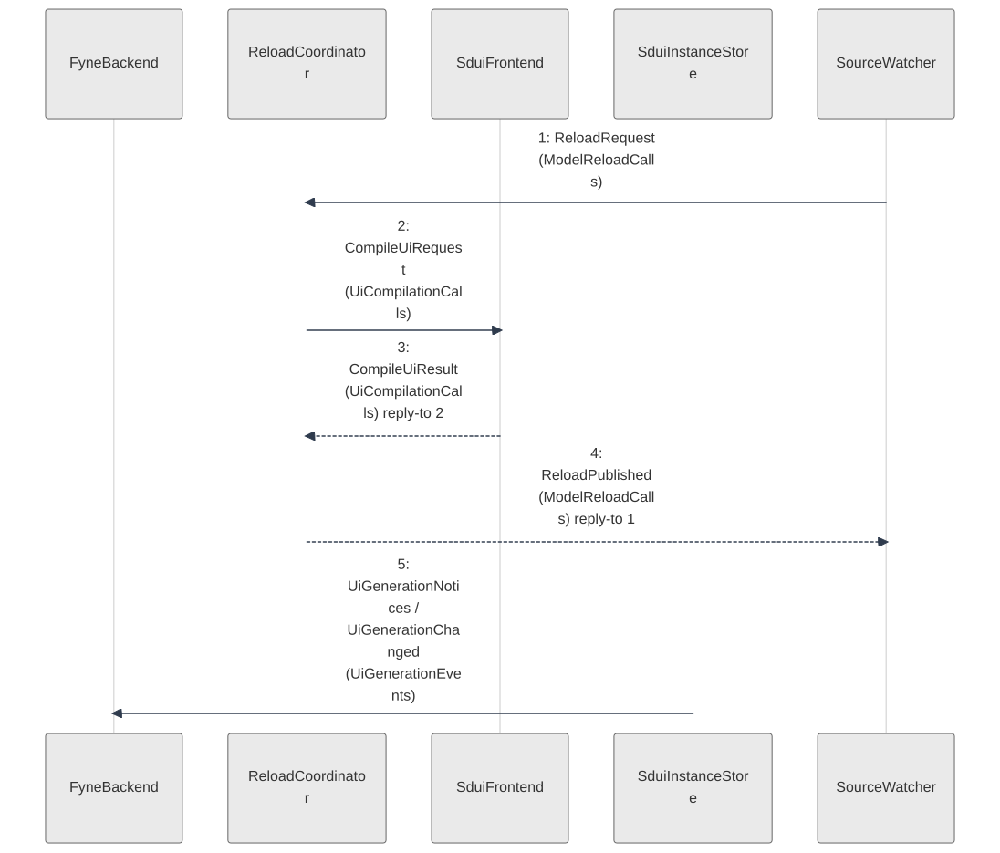

Kildegrunnlag: f0116, f0117, f0118, f0119, f0120, f0259, f0608, f0610, f0612, f0766, f0768, f0774, f0775, f0781, f0782, f0783, f0789, f0790, f0966, f0970, f0985, f1093, f1097, f1173, f1176, f1177, f1186, f1188, f1190, f1196, f1197, f1198, f1199, f1200, f1201, f1202, f1203, f1204, f1205.

### Scenario: UiModelReloadRejected — modus LiveEditing

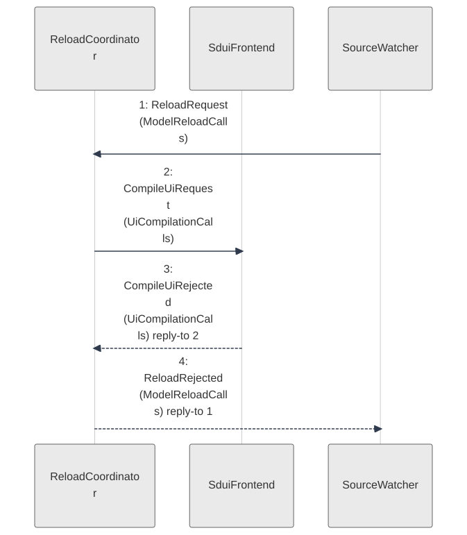

Kildegrunnlag: f0113, f0114, f0115, f0116, f0117, f0608, f0611, f0612, f0766, f0770, f0773, f0775, f0786, f0787, f0788, f0789, f0790, f0966, f0968, f1095, f1097, f1173, f1175, f1176, f1206, f1207, f1208, f1209, f1210, f1211, f1212, f1213.

### Scenario: UnboundLocalAction — modus UiPreview

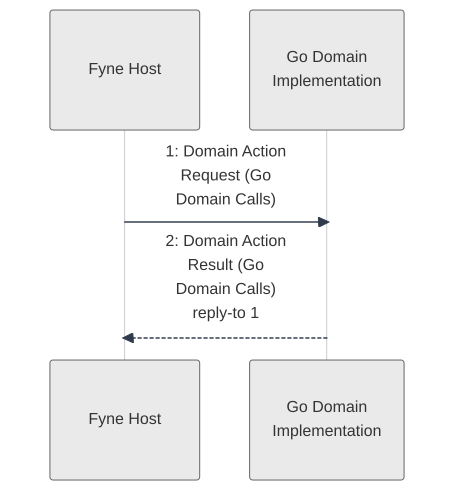

Kildegrunnlag: f0207, f0208, f0209, f0210, f0211, f0272, f0273, f0519, f0521, f0522, f0526, f0528, f1236, f1237, f1238, f1239, f1240, f1241.

### Scenario: ViewProjectionFailed — modus DocumentBrowsing

Kildegrunnlag: f0199, f0201, f0203, f0204, f0723, f0724, f0941, f0943, f1052, f1053, f1327, f1329, f1331, f1350, f1352, f1354, f1355, f1356, f1357, f1358, f1359, f1360, f1361, f1362, f1363, f1364, f1365, f1366, f1383, f1384, f1385, f1422, f1423.

## VP09 — Dataset, Datagram og persistent Database

### Dataopprinnelse og holder: DesignSourceDocuments

Kildegrunnlag: f0156, f0157, f1084.

### Dataopprinnelse og holder: UiSessionState

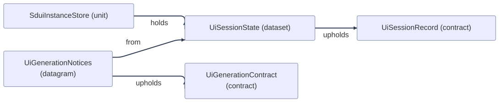

Kildegrunnlag: f0978, f1189, f1190, f1221.

### Kontraktstruktur: ActionArguments

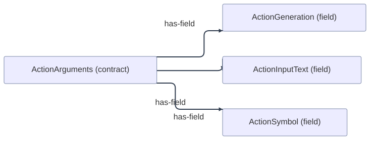

Kildegrunnlag: f0001, f0002, f0003.

### Kontraktstruktur: ActionOutcome

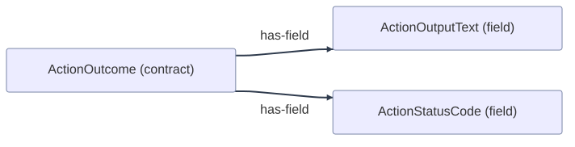

Kildegrunnlag: f0009, f0010.

### Kontraktstruktur: AstArtifactContract

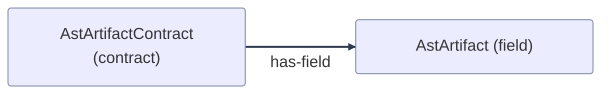

Kildegrunnlag: f0027.

### Kontraktstruktur: DesignSourceRecord

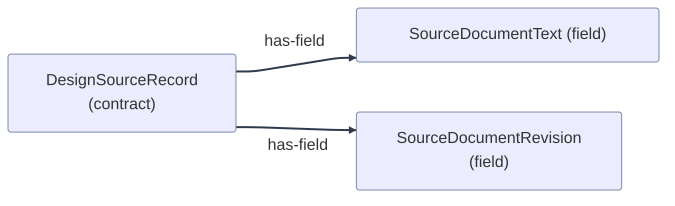

Kildegrunnlag: f0159, f0160.

### Kontraktstruktur: FramePresentationCallsProtocol

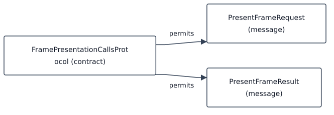

Kildegrunnlag: f0244, f0245.

### Kontraktstruktur: GeneratedGoContract

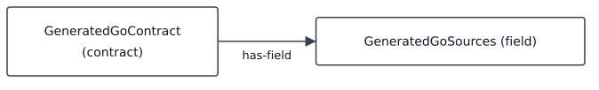

Kildegrunnlag: f0496.

### Kontraktstruktur: GoBuildCallsProtocol

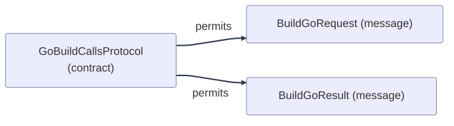

Kildegrunnlag: f0501, f0502.

### Kontraktstruktur: GoDomainCallsProtocol

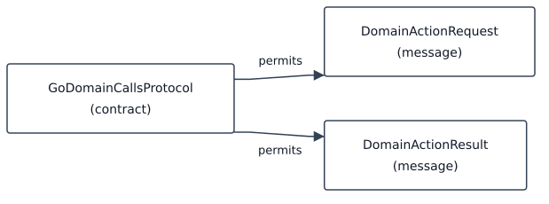

Kildegrunnlag: f0521, f0522.

### Kontraktstruktur: GoGenerationCallsProtocol

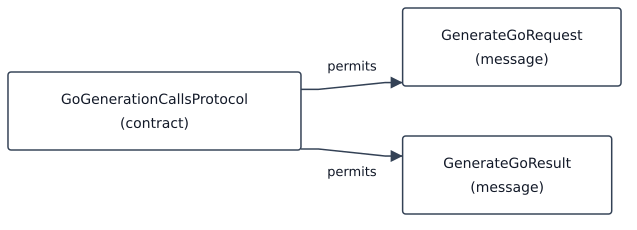

Kildegrunnlag: f0531, f0532.

### Kontraktstruktur: LayoutArguments

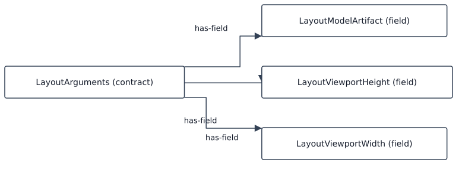

Kildegrunnlag: f0569, f0570, f0571.

### Kontraktstruktur: LayoutCallsProtocol

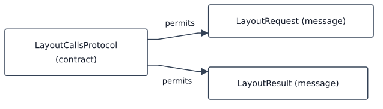

Kildegrunnlag: f0574, f0575.

### Kontraktstruktur: ModelReloadCallsProtocol

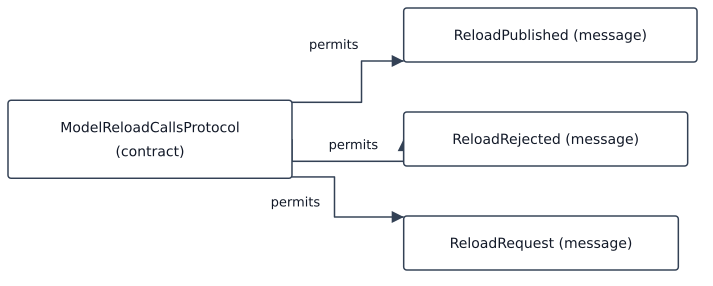

Kildegrunnlag: f0610, f0611, f0612.

### Kontraktstruktur: NativeBuildContract

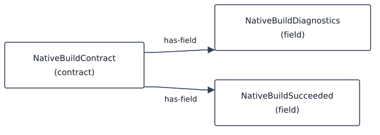

Kildegrunnlag: f0614, f0615.

### Kontraktstruktur: NativeUiActionsProtocol

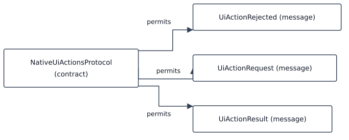

Kildegrunnlag: f0634, f0635, f0636.

### Kontraktstruktur: NormalizedModelContract

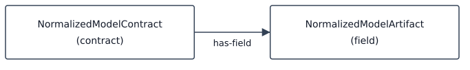

Kildegrunnlag: f0649.

### Kontraktstruktur: PreparedFrameContract

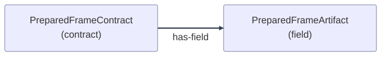

Kildegrunnlag: f0684.

### Kontraktstruktur: PresentationOutcome

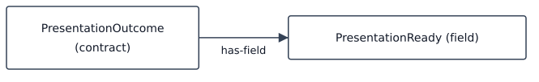

Kildegrunnlag: f0691.

### Kontraktstruktur: ReloadArguments

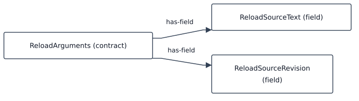

Kildegrunnlag: f0750, f0751.

### Kontraktstruktur: ReloadOutcome

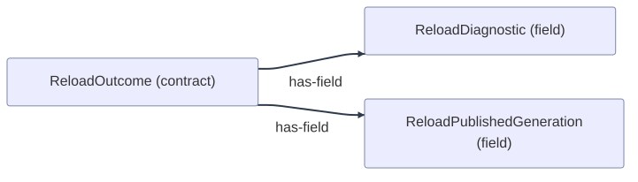

Kildegrunnlag: f0779, f0780.

### Kontraktstruktur: SdlActionCallsProtocol

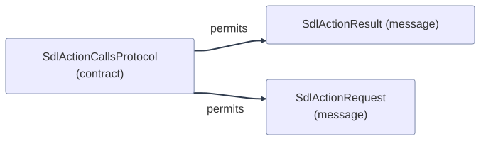

Kildegrunnlag: f0835, f0836.

### Kontraktstruktur: SdlCompilationCallsProtocol

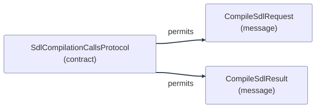

Kildegrunnlag: f0844, f0845.

### Kontraktstruktur: SvgDocumentContract

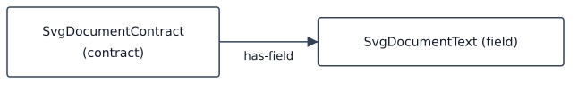

Kildegrunnlag: f1112.

### Kontraktstruktur: SvgExportCallsProtocol

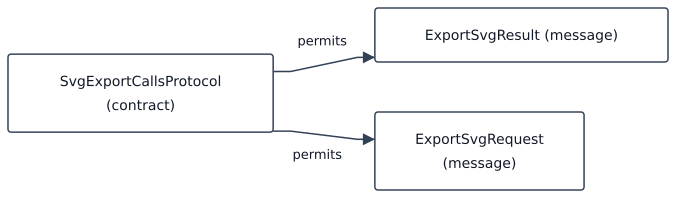

Kildegrunnlag: f1117, f1118.

### Kontraktstruktur: TokenArtifactContract

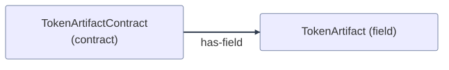

Kildegrunnlag: f1122.

### Kontraktstruktur: UiAstCallsProtocol

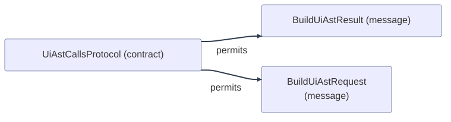

Kildegrunnlag: f1156, f1157.

### Kontraktstruktur: UiCompilationCallsProtocol

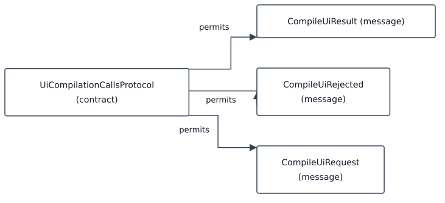

Kildegrunnlag: f1175, f1176, f1177.

### Kontraktstruktur: UiDomainActionsProtocol

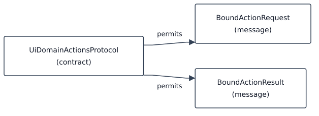

Kildegrunnlag: f1180, f1181.

### Kontraktstruktur: UiGenerationContract

Kildegrunnlag: f1182, f1183, f1185.

### Kontraktstruktur: UiGenerationEventsProtocol

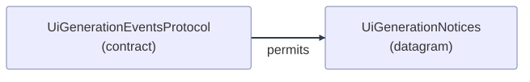

Kildegrunnlag: f1188.

### Kontraktstruktur: UiNormalizationCallsProtocol

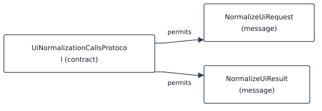

Kildegrunnlag: f1216, f1217.

### Kontraktstruktur: UiSessionRecord

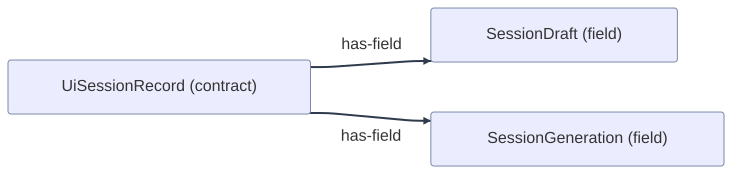

Kildegrunnlag: f1219, f1220.

### Kontraktstruktur: UiTokenizationCallsProtocol

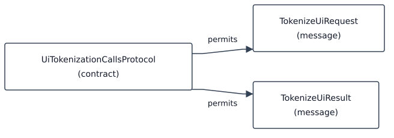

Kildegrunnlag: f1230, f1231.

### Kontraktstruktur: UiValidationCallsProtocol

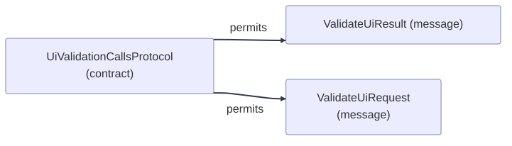

Kildegrunnlag: f1234, f1235.

### Kontraktstruktur: ValidationOutcomeContract

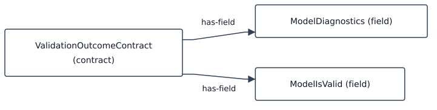

Kildegrunnlag: f1275, f1276.

### Kontraktstruktur: ViewBundleContract

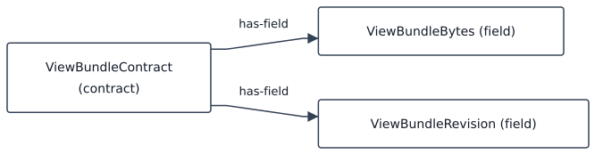

Kildegrunnlag: f1289, f1290.

### Kontraktstruktur: ViewDisplayCallsProtocol

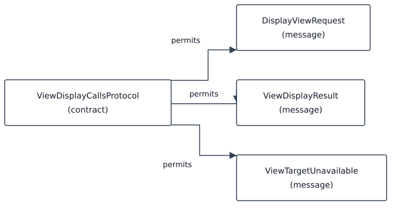

Kildegrunnlag: f1300, f1301, f1302.

### Kontraktstruktur: ViewFailureContract

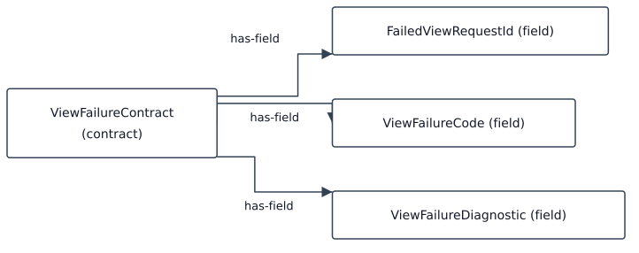

Kildegrunnlag: f1311, f1312, f1313.

### Kontraktstruktur: ViewLaunchCallsProtocol

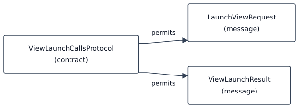

Kildegrunnlag: f1318, f1319.

### Kontraktstruktur: ViewNavigationCallsProtocol

Kildegrunnlag: f1329, f1330, f1331.

### Kontraktstruktur: ViewOpenContract

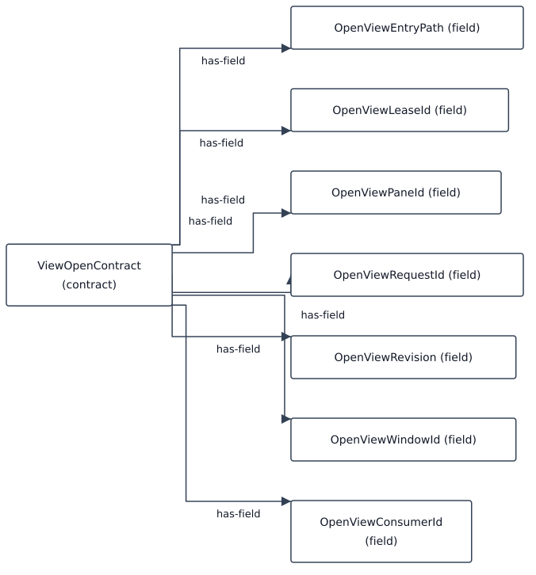

Kildegrunnlag: f1333, f1334, f1335, f1336, f1337, f1338, f1339.

### Kontraktstruktur: ViewOpenedContract

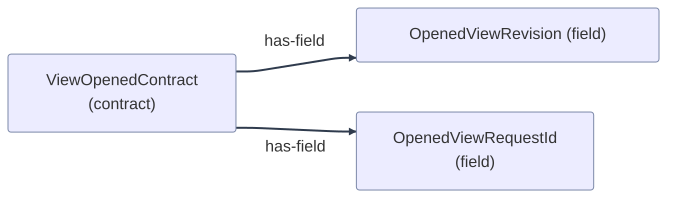

Kildegrunnlag: f1341, f1342.

### Kontraktstruktur: ViewProjectionCallsProtocol

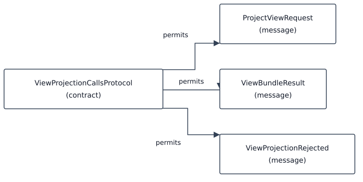

Kildegrunnlag: f1352, f1353, f1354.

### Kontraktstruktur: ViewPublicationCallsProtocol

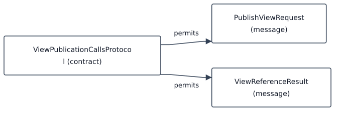

Kildegrunnlag: f1369, f1370.

### Kontraktstruktur: ViewReferenceContract

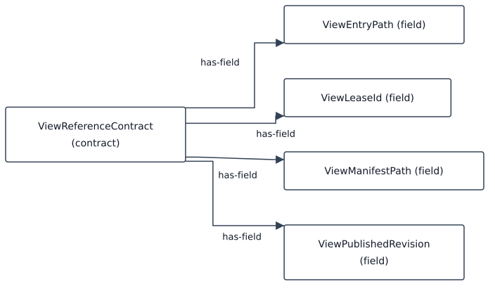

Kildegrunnlag: f1374, f1375, f1376, f1377.

### Kontraktstruktur: ViewSelectionContract

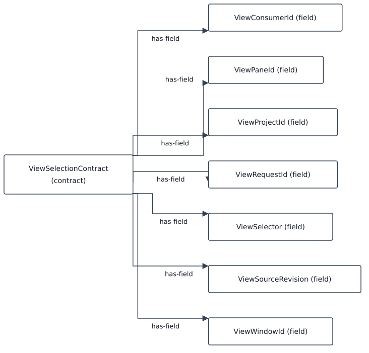

Kildegrunnlag: f1387, f1388, f1389, f1390, f1391, f1392, f1393.

## VP10 — Datagram-koding og packet

### Packet: UiGenerationWire / UiGenerationChanged — big-endian, most-significant-first

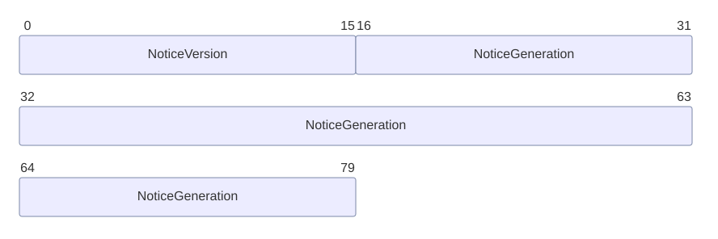

Kildegrunnlag: f0650, f0651, f0652, f0653, f1182, f1183, f1184, f1185, f1191, f1192, f1193, f1194, f1195.

### VP09 — felt og kontraktegenskaper

| Modellfaktum | Kilde-ID |
| --- | --- |
| ActionArguments has completeness = closed. | f0000 |
| ActionGeneration has presence = required. | f0004 |
| ActionGeneration has value-type = unsigned. | f0005 |
| ActionInputText has presence = required. | f0006 |
| ActionInputText has value-type = text. | f0007 |
| ActionOutcome has completeness = closed. | f0008 |
| ActionOutputText has presence = required. | f0011 |
| ActionOutputText has value-type = text. | f0012 |
| ActionStatusCode has presence = required. | f0013 |
| ActionStatusCode has value-type = unsigned. | f0014 |
| ActionSymbol has presence = required. | f0015 |
| ActionSymbol has value-type = text. | f0016 |
| AstArtifact has presence = required. | f0024 |
| AstArtifact has value-type = bytes. | f0025 |
| AstArtifactContract has completeness = closed. | f0026 |
| DesignSourceRecord has completeness = closed. | f0158 |
| FailedViewRequestId has presence = required. | f0240 |
| FailedViewRequestId has value-type = text. | f0241 |
| FramePresentationCallsProtocol has completeness = closed. | f0243 |
| GeneratedGoContract has completeness = closed. | f0495 |
| GeneratedGoSources has presence = required. | f0497 |
| GeneratedGoSources has value-type = bytes. | f0498 |
| GoBuildCallsProtocol has completeness = closed. | f0500 |
| GoDomainCallsProtocol has completeness = closed. | f0520 |
| GoGenerationCallsProtocol has completeness = closed. | f0530 |
| LayoutArguments has completeness = closed. | f0568 |
| LayoutCallsProtocol has completeness = closed. | f0573 |
| LayoutModelArtifact has presence = required. | f0576 |
| LayoutModelArtifact has value-type = bytes. | f0577 |
| LayoutViewportHeight has presence = required. | f0583 |
| LayoutViewportHeight has value-type = decimal. | f0584 |
| LayoutViewportWidth has presence = required. | f0585 |
| LayoutViewportWidth has value-type = decimal. | f0586 |
| ModelDiagnostics has presence = optional. | f0604 |
| ModelDiagnostics has value-type = text. | f0605 |
| ModelIsValid has presence = required. | f0606 |
| ModelIsValid has value-type = boolean. | f0607 |
| ModelReloadCallsProtocol has completeness = closed. | f0609 |
| NativeBuildContract has completeness = closed. | f0613 |
| NativeBuildDiagnostics has presence = optional. | f0616 |
| NativeBuildDiagnostics has value-type = text. | f0617 |
| NativeBuildSucceeded has presence = required. | f0618 |
| NativeBuildSucceeded has value-type = boolean. | f0619 |
| NativeUiActionsProtocol has completeness = closed. | f0633 |
| NormalizedModelArtifact has presence = required. | f0646 |
| NormalizedModelArtifact has value-type = bytes. | f0647 |
| NormalizedModelContract has completeness = closed. | f0648 |
| NoticeGeneration has presence = required. | f0650 |
| NoticeGeneration has value-type = unsigned. | f0651 |
| NoticeVersion has presence = required. | f0652 |
| NoticeVersion has value-type = unsigned. | f0653 |
| OpenViewConsumerId has presence = required. | f0657 |
| OpenViewConsumerId has value-type = text. | f0658 |
| OpenViewEntryPath has presence = required. | f0659 |
| OpenViewEntryPath has value-type = text. | f0660 |
| OpenViewLeaseId has presence = required. | f0661 |
| OpenViewLeaseId has value-type = text. | f0662 |
| OpenViewPaneId has presence = required. | f0663 |
| OpenViewPaneId has value-type = text. | f0664 |
| OpenViewRequestId has presence = required. | f0665 |
| OpenViewRequestId has value-type = text. | f0666 |
| OpenViewRevision has presence = required. | f0667 |
| OpenViewRevision has value-type = text. | f0668 |
| OpenViewWindowId has presence = required. | f0669 |
| OpenViewWindowId has value-type = text. | f0670 |
| OpenedViewRequestId has presence = required. | f0671 |
| OpenedViewRequestId has value-type = text. | f0672 |
| OpenedViewRevision has presence = required. | f0673 |
| OpenedViewRevision has value-type = text. | f0674 |
| PreparedFrameArtifact has presence = required. | f0681 |
| PreparedFrameArtifact has value-type = bytes. | f0682 |
| PreparedFrameContract has completeness = closed. | f0683 |
| PresentationOutcome has completeness = closed. | f0690 |
| PresentationReady has presence = required. | f0692 |
| PresentationReady has value-type = boolean. | f0693 |
| ReloadArguments has completeness = closed. | f0749 |
| ReloadDiagnostic has presence = optional. | f0776 |
| ReloadDiagnostic has value-type = text. | f0777 |
| ReloadOutcome has completeness = closed. | f0778 |
| ReloadPublishedGeneration has presence = optional. | f0784 |
| ReloadPublishedGeneration has value-type = unsigned. | f0785 |
| ReloadSourceRevision has presence = required. | f0791 |
| ReloadSourceRevision has value-type = unsigned. | f0792 |
| ReloadSourceText has presence = required. | f0793 |
| ReloadSourceText has value-type = text. | f0794 |
| SdlActionCallsProtocol has completeness = closed. | f0834 |
| SdlCompilationCallsProtocol has completeness = closed. | f0843 |
| SessionDraft has presence = optional. | f1073 |
| SessionDraft has value-type = text. | f1074 |
| SessionGeneration has presence = required. | f1075 |
| SessionGeneration has value-type = unsigned. | f1076 |
| SourceDocumentRevision has presence = required. | f1079 |
| SourceDocumentRevision has value-type = unsigned. | f1080 |
| SourceDocumentText has presence = required. | f1081 |
| SourceDocumentText has value-type = text. | f1082 |
| SvgDocumentContract has completeness = closed. | f1111 |
| SvgDocumentText has presence = required. | f1113 |
| SvgDocumentText has value-type = text. | f1114 |
| SvgExportCallsProtocol has completeness = closed. | f1116 |
| TokenArtifact has presence = required. | f1119 |
| TokenArtifact has value-type = bytes. | f1120 |
| TokenArtifactContract has completeness = closed. | f1121 |
| UiAstCallsProtocol has completeness = closed. | f1155 |
| UiCompilationCallsProtocol has completeness = closed. | f1174 |
| UiDomainActionsProtocol has completeness = closed. | f1179 |
| UiGenerationContract has completeness = closed. | f1184 |
| UiGenerationEventsProtocol has completeness = closed. | f1187 |
| UiGenerationWire has bit-order = most-significant-first. | f1192 |
| UiGenerationWire has byte-order = big-endian. | f1193 |
| UiNormalizationCallsProtocol has completeness = closed. | f1215 |
| UiSessionRecord has completeness = closed. | f1218 |
| UiTokenizationCallsProtocol has completeness = closed. | f1229 |
| UiValidationCallsProtocol has completeness = closed. | f1233 |
| ValidationOutcomeContract has completeness = closed. | f1274 |
| ViewBundleBytes has presence = required. | f1286 |
| ViewBundleBytes has value-type = bytes. | f1287 |
| ViewBundleContract has completeness = closed. | f1288 |
| ViewBundleRevision has presence = required. | f1294 |
| ViewBundleRevision has value-type = text. | f1295 |
| ViewConsumerId has presence = required. | f1296 |
| ViewConsumerId has value-type = text. | f1297 |
| ViewDisplayCallsProtocol has completeness = closed. | f1299 |
| ViewEntryPath has presence = required. | f1306 |
| ViewEntryPath has value-type = text. | f1307 |
| ViewFailureCode has presence = required. | f1308 |
| ViewFailureCode has value-type = text. | f1309 |
| ViewFailureContract has completeness = closed. | f1310 |
| ViewFailureDiagnostic has presence = required. | f1314 |
| ViewFailureDiagnostic has value-type = text. | f1315 |
| ViewLaunchCallsProtocol has completeness = closed. | f1317 |
| ViewLeaseId has presence = required. | f1323 |
| ViewLeaseId has value-type = text. | f1324 |
| ViewManifestPath has presence = required. | f1325 |
| ViewManifestPath has value-type = text. | f1326 |
| ViewNavigationCallsProtocol has completeness = closed. | f1328 |
| ViewOpenContract has completeness = closed. | f1332 |
| ViewOpenedContract has completeness = closed. | f1340 |
| ViewPaneId has presence = required. | f1346 |
| ViewPaneId has value-type = text. | f1347 |
| ViewProjectId has presence = required. | f1348 |
| ViewProjectId has value-type = text. | f1349 |
| ViewProjectionCallsProtocol has completeness = closed. | f1351 |
| ViewPublicationCallsProtocol has completeness = closed. | f1368 |
| ViewPublishedRevision has presence = required. | f1371 |
| ViewPublishedRevision has value-type = text. | f1372 |
| ViewReferenceContract has completeness = closed. | f1373 |
| ViewRequestId has presence = required. | f1381 |
| ViewRequestId has value-type = text. | f1382 |
| ViewSelectionContract has completeness = closed. | f1386 |
| ViewSelector has presence = required. | f1394 |
| ViewSelector has value-type = text. | f1395 |
| ViewSourceRevision has presence = required. | f1399 |
| ViewSourceRevision has value-type = text. | f1400 |
| ViewWindowId has presence = required. | f1404 |
| ViewWindowId has value-type = text. | f1405 |

### VP09 — projeksjonsansvar

| Functionality | Dataset | Datagram-familie | Faktum |
| --- | --- | --- | --- |
| ProjectUiGeneration | UiSessionState | UiGenerationNotices | f0722 |

### VP08 — avledet MessageSet per Channel og modus

Generert fra permits og deltakelse, ikke en separat authored modell. Tom deltakelse er et hull.

| Channel | Mode | Message / Datagram | Sender | Receiver | Kilde-ID-er |
| --- | --- | --- | --- | --- | --- |
| FramePresentationCalls | UiPreview | PresentFrameRequest | FyneHost | FyneBackend | f0242, f0244, f0253, f0271, f0686 |
| FramePresentationCalls | UiPreview | PresentFrameResult | FyneBackend | FyneHost | f0242, f0245, f0254, f0270, f0689 |
| GoBuildCalls | NativeBuild | BuildGoRequest | CommandLineHost | GoBuildRunner | f0058, f0098, f0499, f0501, f0508 |
| GoBuildCalls | NativeBuild | BuildGoResult | GoBuildRunner | CommandLineHost | f0061, f0097, f0499, f0502, f0509 |
| GoDomainCalls | BoundExecution | DomainActionRequest | SdlDispatcher | GoDomainImplementation | f0208, f0519, f0521, f0525, f0854 |
| GoDomainCalls | BoundExecution | DomainActionResult | GoDomainImplementation | SdlDispatcher | f0211, f0519, f0522, f0527, f0853 |
| GoDomainCalls | UiPreview | DomainActionRequest | FyneHost | GoDomainImplementation | f0208, f0273, f0519, f0521, f0526 |
| GoDomainCalls | UiPreview | DomainActionResult | GoDomainImplementation | FyneHost | f0211, f0272, f0519, f0522, f0528 |
| GoGenerationCalls | NativeBuild | GenerateGoRequest | CommandLineHost | GoCodeGenerator | f0100, f0486, f0517, f0529, f0531 |
| GoGenerationCalls | NativeBuild | GenerateGoResult | GoCodeGenerator | CommandLineHost | f0099, f0489, f0518, f0529, f0532 |
| LayoutCalls | StaticExport | LayoutRequest | CommandLineHost | SduiLayout | f0102, f0572, f0574, f0579, f0995 |
| LayoutCalls | StaticExport | LayoutResult | SduiLayout | CommandLineHost | f0101, f0572, f0575, f0582, f0997 |
| LayoutCalls | UiPreview | LayoutRequest | FyneHost | SduiLayout | f0275, f0572, f0574, f0579, f0996 |
| LayoutCalls | UiPreview | LayoutResult | SduiLayout | FyneHost | f0274, f0572, f0575, f0582, f0998 |
| ModelReloadCalls | BoundLiveEditing | ReloadPublished | ReloadCoordinator | SourceWatcher | f0608, f0610, f0767, f0783, f1092 |
| ModelReloadCalls | BoundLiveEditing | ReloadRejected | ReloadCoordinator | SourceWatcher | f0608, f0611, f0769, f0788, f1094 |
| ModelReloadCalls | BoundLiveEditing | ReloadRequest | SourceWatcher | ReloadCoordinator | f0608, f0612, f0765, f0790, f1096 |
| ModelReloadCalls | LiveEditing | ReloadPublished | ReloadCoordinator | SourceWatcher | f0608, f0610, f0768, f0783, f1093 |
| ModelReloadCalls | LiveEditing | ReloadRejected | ReloadCoordinator | SourceWatcher | f0608, f0611, f0770, f0788, f1095 |
| ModelReloadCalls | LiveEditing | ReloadRequest | SourceWatcher | ReloadCoordinator | f0608, f0612, f0766, f0790, f1097 |
| NativeUiActions | BoundExecution | UiActionRejected | SduiDispatcher | FyneBackend | f0255, f0632, f0634, f0952, f1148 |
| NativeUiActions | BoundExecution | UiActionRequest | FyneBackend | SduiDispatcher | f0257, f0632, f0635, f0951, f1150 |
| NativeUiActions | BoundExecution | UiActionResult | SduiDispatcher | FyneBackend | f0256, f0632, f0636, f0953, f1153 |
| SdlActionCalls | BoundExecution | SdlActionRequest | SdlUiBindingAdapter | SdlDispatcher | f0833, f0835, f0838, f0855, f0920 |
| SdlActionCalls | BoundExecution | SdlActionResult | SdlDispatcher | SdlUiBindingAdapter | f0833, f0836, f0841, f0856, f0919 |
| SdlCompilationCalls | BoundLiveEditing | CompileSdlRequest | ReloadCoordinator | SdlFrontend | f0109, f0772, f0842, f0844, f0869 |
| SdlCompilationCalls | BoundLiveEditing | CompileSdlResult | SdlFrontend | ReloadCoordinator | f0112, f0771, f0842, f0845, f0870 |
| SvgExportCalls | StaticExport | ExportSvgRequest | CommandLineHost | SduiPresentation | f0104, f0227, f1026, f1115, f1117 |
| SvgExportCalls | StaticExport | ExportSvgResult | SduiPresentation | CommandLineHost | f0103, f0230, f1027, f1115, f1118 |
| UiAstCalls | SourceInspection | BuildUiAstRequest | SduiFrontend | SduiParser | f0077, f0965, f1019, f1154, f1156 |
| UiAstCalls | SourceInspection | BuildUiAstResult | SduiParser | SduiFrontend | f0080, f0964, f1020, f1154, f1157 |
| UiCompilationCalls | LiveEditing | CompileUiRejected | SduiFrontend | ReloadCoordinator | f0115, f0773, f0968, f1173, f1175 |
| UiCompilationCalls | LiveEditing | CompileUiRequest | ReloadCoordinator | SduiFrontend | f0117, f0775, f0966, f1173, f1176 |
| UiCompilationCalls | LiveEditing | CompileUiResult | SduiFrontend | ReloadCoordinator | f0120, f0774, f0970, f1173, f1177 |
| UiCompilationCalls | SourceInspection | CompileUiRejected | SduiFrontend | CommandLineHost | f0105, f0115, f0969, f1173, f1175 |
| UiCompilationCalls | SourceInspection | CompileUiRequest | CommandLineHost | SduiFrontend | f0107, f0117, f0967, f1173, f1176 |
| UiCompilationCalls | SourceInspection | CompileUiResult | SduiFrontend | CommandLineHost | f0106, f0120, f0971, f1173, f1177 |
| UiDomainActions | BoundExecution | BoundActionRequest | SduiDispatcher | SdlUiBindingAdapter | f0048, f0921, f0955, f1178, f1180 |
| UiDomainActions | BoundExecution | BoundActionResult | SdlUiBindingAdapter | SduiDispatcher | f0051, f0922, f0954, f1178, f1181 |
| UiGenerationEvents | BoundExecution | UiGenerationNotices | SduiInstanceStore | FyneBackend | f0258, f0984, f1186, f1188, f1190 |
| UiGenerationEvents | LiveEditing | UiGenerationNotices | SduiInstanceStore | FyneBackend | f0259, f0985, f1186, f1188, f1190 |
| UiNormalizationCalls | SourceInspection | NormalizeUiRequest | SduiFrontend | SduiNormalizer | f0642, f0973, f1015, f1214, f1216 |
| UiNormalizationCalls | SourceInspection | NormalizeUiResult | SduiNormalizer | SduiFrontend | f0645, f0972, f1016, f1214, f1217 |
| UiTokenizationCalls | SourceInspection | TokenizeUiRequest | SduiFrontend | SduiLexer | f0975, f1001, f1130, f1228, f1230 |
| UiTokenizationCalls | SourceInspection | TokenizeUiResult | SduiLexer | SduiFrontend | f0974, f1002, f1133, f1228, f1231 |
| UiValidationCalls | SourceInspection | ValidateUiRequest | SduiFrontend | SduiValidator | f0977, f1048, f1232, f1234, f1262 |
| UiValidationCalls | SourceInspection | ValidateUiResult | SduiValidator | SduiFrontend | f0976, f1049, f1232, f1235, f1265 |
| ViewDisplayCalls | DocumentBrowsing | DisplayViewRequest | ViewerLaunchAdapter | XfmdDocumentHost | f0192, f1298, f1300, f1410, f1418 |
| ViewDisplayCalls | DocumentBrowsing | ViewDisplayResult | XfmdDocumentHost | ViewerLaunchAdapter | f1298, f1301, f1305, f1408, f1419 |
| ViewDisplayCalls | DocumentBrowsing | ViewTargetUnavailable | XfmdDocumentHost | ViewerLaunchAdapter | f1298, f1302, f1403, f1409, f1420 |
| ViewLaunchCalls | DocumentBrowsing | LaunchViewRequest | DocumentBroker | ViewerLaunchAdapter | f0198, f0567, f1316, f1318, f1411 |
| ViewLaunchCalls | DocumentBrowsing | ViewLaunchResult | ViewerLaunchAdapter | DocumentBroker | f0197, f1316, f1319, f1322, f1412 |
| ViewNavigationCalls | DocumentBrowsing | SelectViewRequest | XfmdDocumentHost | DocumentBroker | f0199, f1053, f1327, f1329, f1423 |
| ViewNavigationCalls | DocumentBrowsing | ViewOpenedResult | DocumentBroker | XfmdDocumentHost | f0200, f1327, f1330, f1345, f1421 |
| ViewNavigationCalls | DocumentBrowsing | ViewRequestRejected | DocumentBroker | XfmdDocumentHost | f0201, f1327, f1331, f1385, f1422 |
| ViewProjectionCalls | DocumentBrowsing | ProjectViewRequest | DocumentBroker | SdlViewpointGenerator | f0204, f0724, f0941, f1350, f1352 |
| ViewProjectionCalls | DocumentBrowsing | ViewBundleResult | SdlViewpointGenerator | DocumentBroker | f0202, f0942, f1293, f1350, f1353 |
| ViewProjectionCalls | DocumentBrowsing | ViewProjectionRejected | SdlViewpointGenerator | DocumentBroker | f0203, f0943, f1350, f1354, f1366 |
| ViewPublicationCalls | DocumentBrowsing | PublishViewRequest | DocumentBroker | ViewArtifactStore | f0206, f0736, f1284, f1367, f1369 |
| ViewPublicationCalls | DocumentBrowsing | ViewReferenceResult | ViewArtifactStore | DocumentBroker | f0205, f1285, f1367, f1370, f1380 |

## VP04 — Grensesnittbruk

Tabellen dekker alle consumes-fakta. Portnavn er ikke Channel-kontrakter eller tilbyderkoblinger.

| Unit / Container | Interface | Faktum | Kildelinje |
| --- | --- | --- | --- |
| CommandLineHost | ExportSinkPort | f0090 | 555 |
| CommandLineHost | PreparedFramePort | f0091 | 556 |
| CommandLineHost | SduiFrontendPort | f0092 | 557 |
| CommandLineHost | SourceSnapshotPort | f0093 | 558 |
| DiagramProvider | DiagramEnginePort | f0181 | 646 |
| DiagramProvider | ResourcePort | f0182 | 647 |
| DomainStateMigrator | DomainStatePort | f0212 | 677 |
| DomainStateMigrator | SdlModelPort | f0213 | 678 |
| FyneBackend | PreparedFramePort | f0246 | 711 |
| FyneBackend | UiSessionPort | f0247 | 712 |
| FyneHost | DomainBindingPort | f0260 | 725 |
| FyneHost | ReloadPort | f0261 | 726 |
| FyneHost | SdlFrontendPort | f0262 | 727 |
| FyneHost | SduiFrontendPort | f0263 | 728 |
| FyneHost | SourceSnapshotPort | f0264 | 729 |
| FyneHost | UiSessionPort | f0265 | 730 |
| FyneHost | WidgetBackendPort | f0266 | 731 |
| GoBuildRunner | BuildToolPort | f0503 | 968 |
| GoBuildRunner | GeneratedArtifactPort | f0504 | 969 |
| GoCodeGenerator | ExecutionProfilePort | f0510 | 975 |
| GoCodeGenerator | SdlModelPort | f0511 | 976 |
| GoCodeGenerator | SduiModelPort | f0512 | 977 |
| MarkdownProvider | DiagramPort | f0592 | 1057 |
| MarkdownProvider | MeasurementPort | f0593 | 1058 |
| MarkdownProvider | ResourcePort | f0594 | 1059 |
| ReloadCoordinator | BindingReloadPort | f0753 | 1218 |
| ReloadCoordinator | DiagnosticPort | f0754 | 1219 |
| ReloadCoordinator | SdlFrontendPort | f0755 | 1220 |
| ReloadCoordinator | SdlReloadPort | f0756 | 1221 |
| ReloadCoordinator | SduiFrontendPort | f0757 | 1222 |
| ReloadCoordinator | SourceSnapshotPort | f0758 | 1223 |
| ReloadCoordinator | UiReloadPort | f0759 | 1224 |
| SdlDispatcher | DomainFunctionPort | f0846 | 1311 |
| SdlDispatcher | DomainStatePort | f0847 | 1312 |
| SdlExecutionGate | DiagnosticPort | f0857 | 1322 |
| SdlExecutionGate | SdlModelPort | f0858 | 1323 |
| SdlFrontend | DiagnosticPort | f0861 | 1326 |
| SdlFrontend | SourceSnapshotPort | f0862 | 1327 |
| SdlFunctionRegistry | DomainFunctionPort | f0871 | 1336 |
| SdlRuntime | DomainFunctionPort | f0896 | 1361 |
| SdlRuntime | SdlModelPort | f0897 | 1362 |
| SdlUiBindingAdapter | DiagnosticPort | f0910 | 1375 |
| SdlUiBindingAdapter | SdlExecutionPort | f0911 | 1376 |
| SdlUiBindingAdapter | UiSessionPort | f0912 | 1377 |
| SduiDispatcher | DomainBindingPort | f0944 | 1409 |
| SduiDispatcher | UiStatePort | f0945 | 1410 |
| SduiFrontend | DiagnosticPort | f0956 | 1421 |
| SduiFrontend | SourceSnapshotPort | f0957 | 1422 |
| SduiLayout | ContentProviderPort | f0986 | 1451 |
| SduiLayout | MeasurementPort | f0987 | 1452 |
| SduiLayout | UiSnapshotPort | f0988 | 1453 |
| SduiPresentation | PreparedFramePort | f1021 | 1486 |
| SduiPropertyStore | UiStatePort | f1028 | 1493 |
| SduiRuntime | DomainBindingPort | f1033 | 1498 |
| SduiRuntime | SduiModelPort | f1034 | 1499 |
| SourceLoader | SourceInputPort | f1083 | 1548 |
| SourceWatcher | FileChangePort | f1088 | 1553 |
| UiStateReconciler | SduiModelPort | f1222 | 1687 |
| UiStateReconciler | UiStatePort | f1223 | 1688 |

## VP11 — Egenskaper og fullstendig faktaregister

Registeret inkluderer alle fakta, også de som ikke har en egen tegning.

| ID | Utsagn | Kildelinje |
| --- | --- | --- |
| f0000 | ActionArguments has completeness = closed. | 465 |
| f0001 | ActionArguments has-field ActionGeneration. | 466 |
| f0002 | ActionArguments has-field ActionInputText. | 467 |
| f0003 | ActionArguments has-field ActionSymbol. | 468 |
| f0004 | ActionGeneration has presence = required. | 469 |
| f0005 | ActionGeneration has value-type = unsigned. | 470 |
| f0006 | ActionInputText has presence = required. | 471 |
| f0007 | ActionInputText has value-type = text. | 472 |
| f0008 | ActionOutcome has completeness = closed. | 473 |
| f0009 | ActionOutcome has-field ActionOutputText. | 474 |
| f0010 | ActionOutcome has-field ActionStatusCode. | 475 |
| f0011 | ActionOutputText has presence = required. | 476 |
| f0012 | ActionOutputText has value-type = text. | 477 |
| f0013 | ActionStatusCode has presence = required. | 478 |
| f0014 | ActionStatusCode has value-type = unsigned. | 479 |
| f0015 | ActionSymbol has presence = required. | 480 |
| f0016 | ActionSymbol has value-type = text. | 481 |
| f0017 | AllocateGeometry allocated-to FyneHost in mode UiPreview. | 482 |
| f0018 | AllocateGeometry contributes-to InteractiveUiPreview. | 483 |
| f0019 | AllocateGeometry realizes MeasuredPresentation. | 484 |
| f0020 | ApplyPropertyBatch has state-retention = stateful. | 485 |
| f0021 | ApplyPropertyBatch realizes InteractiveSession. | 486 |
| f0022 | ApplySemanticNotation allocated-to ViewServiceHost in mode DocumentBrowsing. | 487 |
| f0023 | ApplySemanticNotation contributes-to TypedDesignInspection. | 488 |
| f0024 | AstArtifact has presence = required. | 489 |
| f0025 | AstArtifact has value-type = bytes. | 490 |
| f0026 | AstArtifactContract has completeness = closed. | 491 |
| f0027 | AstArtifactContract has-field AstArtifact. | 492 |
| f0028 | BoundActionAccepted exercises TryDomainInteraction. | 493 |
| f0029 | BoundActionAccepted has completeness = closed. | 494 |
| f0030 | BoundActionAccepted illustrates G4M3UiDomainBinding. | 495 |
| f0031 | BoundActionAccepted runs-in BoundExecution. | 496 |
| f0032 | BoundActionAccepted step 1 sends UiActionRequest from FyneBackend to SduiDispatcher via NativeUiActions. | 497 |
| f0033 | BoundActionAccepted step 2 sends BoundActionRequest from SduiDispatcher to SdlUiBindingAdapter via UiDomainActions. | 498 |
| f0034 | BoundActionAccepted step 3 sends SdlActionRequest from SdlUiBindingAdapter to SdlDispatcher via SdlActionCalls. | 499 |
| f0035 | BoundActionAccepted step 4 sends DomainActionRequest from SdlDispatcher to GoDomainImplementation via GoDomainCalls. | 500 |
| f0036 | BoundActionAccepted step 5 sends DomainActionResult from GoDomainImplementation to SdlDispatcher via GoDomainCalls reply-to 4. | 501 |
| f0037 | BoundActionAccepted step 6 sends SdlActionResult from SdlDispatcher to SdlUiBindingAdapter via SdlActionCalls reply-to 3. | 502 |
| f0038 | BoundActionAccepted step 7 sends BoundActionResult from SdlUiBindingAdapter to SduiDispatcher via UiDomainActions reply-to 2. | 503 |
| f0039 | BoundActionAccepted step 8 sends UiActionResult from SduiDispatcher to FyneBackend via NativeUiActions reply-to 1. | 504 |
| f0040 | BoundActionAccepted step 9 sends UiGenerationNotices variant UiGenerationChanged from SduiInstanceStore to FyneBackend via UiGenerationEvents. | 505 |
| f0041 | BoundActionRejected exercises TryDomainInteraction. | 506 |
| f0042 | BoundActionRejected has completeness = closed. | 507 |
| f0043 | BoundActionRejected illustrates G4M3UiDomainBinding. | 508 |
| f0044 | BoundActionRejected runs-in BoundExecution. | 509 |
| f0045 | BoundActionRejected step 1 sends UiActionRequest from FyneBackend to SduiDispatcher via NativeUiActions. | 510 |
| f0046 | BoundActionRejected step 2 sends UiActionRejected from SduiDispatcher to FyneBackend via NativeUiActions reply-to 1. | 511 |
| f0047 | BoundActionRequest has message-kind = request. | 512 |
| f0048 | BoundActionRequest upholds ActionArguments. | 513 |
| f0049 | BoundActionResult has message-kind = result. | 514 |
| f0050 | BoundActionResult replies-to BoundActionRequest. | 515 |
| f0051 | BoundActionResult upholds ActionOutcome. | 516 |
| f0052 | BoundInteraction requires SdlExecutionPort in mode BoundExecution. | 517 |
| f0053 | BoundInteraction requires UiSessionPort in mode BoundExecution. | 518 |
| f0054 | BuildGeneratedApplication allocated-to CommandLineHost in mode NativeBuild. | 519 |
| f0055 | BuildGeneratedApplication contributes-to NativeGoAssembly. | 520 |
| f0056 | BuildGeneratedApplication realizes NativeRealization. | 521 |
| f0057 | BuildGoRequest has message-kind = request. | 522 |
| f0058 | BuildGoRequest upholds GeneratedGoContract. | 523 |
| f0059 | BuildGoResult has message-kind = result. | 524 |
| f0060 | BuildGoResult replies-to BuildGoRequest. | 525 |
| f0061 | BuildGoResult upholds NativeBuildContract. | 526 |
| f0062 | BuildNativeRealization refines RealizeDesign. | 527 |
| f0063 | BuildPreparedFrame allocated-to FyneHost in mode UiPreview. | 528 |
| f0064 | BuildPreparedFrame contributes-to InteractiveUiPreview. | 529 |
| f0065 | BuildPreparedFrame realizes MeasuredPresentation. | 530 |
| f0066 | BuildSdlAst allocated-to CommandLineHost in mode SourceInspection. | 531 |
| f0067 | BuildSdlAst contributes-to StructuralModelInspection. | 532 |
| f0068 | BuildSdlAst has repeatability = deterministic. | 533 |
| f0069 | BuildSdlAst has state-retention = stateless. | 534 |
| f0070 | BuildSdlAst realizes SdlSourceModel. | 535 |
| f0071 | BuildSduiAst allocated-to CommandLineHost in mode SourceInspection. | 536 |
| f0072 | BuildSduiAst contributes-to StructuralModelInspection. | 537 |
| f0073 | BuildSduiAst has repeatability = deterministic. | 538 |
| f0074 | BuildSduiAst has state-retention = stateless. | 539 |
| f0075 | BuildSduiAst realizes SduiSourceModel. | 540 |
| f0076 | BuildUiAstRequest has message-kind = request. | 541 |
| f0077 | BuildUiAstRequest upholds TokenArtifactContract. | 542 |
| f0078 | BuildUiAstResult has message-kind = result. | 543 |
| f0079 | BuildUiAstResult replies-to BuildUiAstRequest. | 544 |
| f0080 | BuildUiAstResult upholds AstArtifactContract. | 545 |
| f0081 | CancelPendingActions realizes ExecutableDesign. | 546 |
| f0082 | CaptureNavigationTarget allocated-to XfmdDocumentHost in mode DocumentBrowsing. | 547 |
| f0083 | CaptureNavigationTarget contributes-to NavigableDesignDocumentation. | 548 |
| f0084 | CheckDomainStateCompatibility realizes ExecutableDesign. | 549 |
| f0085 | CheckExecutionCompleteness realizes ExecutableDesign. | 550 |
| f0086 | CheckFunctionSignatures realizes ExecutableDesign. | 551 |
| f0087 | CloseSdlInstance realizes ExecutableDesign. | 552 |
| f0088 | CloseUiInstance realizes InteractiveSession. | 553 |
| f0089 | CoalesceSourceChanges realizes DevelopmentReload. | 554 |
| f0090 | CommandLineHost consumes ExportSinkPort. | 555 |
| f0091 | CommandLineHost consumes PreparedFramePort. | 556 |
| f0092 | CommandLineHost consumes SduiFrontendPort. | 557 |
| f0093 | CommandLineHost consumes SourceSnapshotPort. | 558 |
| f0094 | CommandLineHost owns ComposeHeadlessExport. | 559 |
| f0095 | CommandLineHost owns WriteGeneratedArtifacts. | 560 |
| f0096 | CommandLineHost provides StaticDocumentation. | 561 |
| f0097 | CommandLineHost uses GoBuildCalls as receiver of BuildGoResult in mode NativeBuild. | 562 |
| f0098 | CommandLineHost uses GoBuildCalls as sender of BuildGoRequest in mode NativeBuild. | 563 |
| f0099 | CommandLineHost uses GoGenerationCalls as receiver of GenerateGoResult in mode NativeBuild. | 564 |
| f0100 | CommandLineHost uses GoGenerationCalls as sender of GenerateGoRequest in mode NativeBuild. | 565 |
| f0101 | CommandLineHost uses LayoutCalls as receiver of LayoutResult in mode StaticExport. | 566 |
| f0102 | CommandLineHost uses LayoutCalls as sender of LayoutRequest in mode StaticExport. | 567 |
| f0103 | CommandLineHost uses SvgExportCalls as receiver of ExportSvgResult in mode StaticExport. | 568 |
| f0104 | CommandLineHost uses SvgExportCalls as sender of ExportSvgRequest in mode StaticExport. | 569 |
| f0105 | CommandLineHost uses UiCompilationCalls as receiver of CompileUiRejected in mode SourceInspection. | 570 |
| f0106 | CommandLineHost uses UiCompilationCalls as receiver of CompileUiResult in mode SourceInspection. | 571 |
| f0107 | CommandLineHost uses UiCompilationCalls as sender of CompileUiRequest in mode SourceInspection. | 572 |
| f0108 | CompileSdlRequest has message-kind = request. | 573 |
| f0109 | CompileSdlRequest upholds ReloadArguments. | 574 |
| f0110 | CompileSdlResult has message-kind = result. | 575 |
| f0111 | CompileSdlResult replies-to CompileSdlRequest. | 576 |
| f0112 | CompileSdlResult upholds ReloadOutcome. | 577 |
| f0113 | CompileUiRejected has message-kind = result. | 578 |
| f0114 | CompileUiRejected replies-to CompileUiRequest. | 579 |
| f0115 | CompileUiRejected upholds ReloadOutcome. | 580 |
| f0116 | CompileUiRequest has message-kind = request. | 581 |
| f0117 | CompileUiRequest upholds ReloadArguments. | 582 |
| f0118 | CompileUiResult has message-kind = result. | 583 |
| f0119 | CompileUiResult replies-to CompileUiRequest. | 584 |
| f0120 | CompileUiResult upholds ReloadOutcome. | 585 |
| f0121 | ComposeHeadlessExport realizes StaticDocumentation. | 586 |
| f0122 | ComposeInteractiveSession allocated-to FyneHost in mode UiPreview. | 587 |
| f0123 | ComposeInteractiveSession contributes-to InteractiveUiPreview. | 588 |
| f0124 | ComposeInteractiveSession realizes NativeInteraction. | 589 |
| f0125 | ComposeMarkdownDocument allocated-to CommandLineHost in mode StaticExport. | 590 |
| f0126 | ComposeMarkdownDocument contributes-to DesignDocumentation. | 591 |
| f0127 | ComposeMarkdownDocument realizes StaticDocumentation. | 592 |
| f0128 | ComposeViewPackage allocated-to ViewServiceHost in mode DocumentBrowsing. | 593 |
| f0129 | ComposeViewPackage contributes-to NavigableDesignDocumentation. | 594 |
| f0130 | ComputeClipping realizes MeasuredPresentation. | 595 |
| f0131 | ConnectTypedWidgetHandles allocated-to FyneHost in mode BoundExecution. | 596 |
| f0132 | ConnectTypedWidgetHandles contributes-to TypedDomainBinding. | 597 |
| f0133 | ConnectTypedWidgetHandles realizes BoundInteraction. | 598 |
| f0134 | ContentServices contains DiagramProvider. | 599 |
| f0135 | ContentServices contains MarkdownProvider. | 600 |
| f0136 | ContentServices contains ResourceStore. | 601 |
| f0137 | ContentServices provides RichContent. | 602 |
| f0138 | CoordinateSdlCompilation realizes SdlSourceModel. | 603 |
| f0139 | CoordinateSduiCompilation realizes SduiSourceModel. | 604 |
| f0140 | CorrelateActionResult realizes ExecutableDesign. | 605 |
| f0141 | CorrelateUiResult realizes InteractiveSession. | 606 |
| f0142 | CreateSdlInstance realizes ExecutableDesign. | 607 |
| f0143 | CreateUiInstance realizes InteractiveSession. | 608 |
| f0144 | DesignAuthor pursues BrowseDesignViews. | 609 |
| f0145 | DesignAuthor pursues BuildNativeProduct. | 610 |
| f0146 | DesignAuthor pursues EditRunningPrototype. | 611 |
| f0147 | DesignAuthor pursues InspectModels. | 612 |
| f0148 | DesignAuthor pursues PrototypeUserInterface. | 613 |
| f0149 | DesignAuthor pursues PublishDesignDocumentation. | 614 |
| f0150 | DesignAuthor pursues TryDomainInteraction. | 615 |
| f0151 | DesignDocumentation supports PublishDesignDocumentation. | 616 |
| f0152 | DesignReviewer pursues BrowseDesignViews. | 617 |
| f0153 | DesignReviewer pursues InspectModels. | 618 |
| f0154 | DesignReviewer pursues PrototypeUserInterface. | 619 |
| f0155 | DesignReviewer pursues PublishDesignDocumentation. | 620 |
| f0156 | DesignSourceArchive holds DesignSourceDocuments. | 621 |
| f0157 | DesignSourceDocuments upholds DesignSourceRecord. | 622 |
| f0158 | DesignSourceRecord has completeness = closed. | 623 |
| f0159 | DesignSourceRecord has-field SourceDocumentRevision. | 624 |
| f0160 | DesignSourceRecord has-field SourceDocumentText. | 625 |
| f0161 | DevelopmentReload requires BindingReloadPort in mode BoundLiveEditing. | 626 |
| f0162 | DevelopmentReload requires FileChangePort in mode BoundLiveEditing. | 627 |
| f0163 | DevelopmentReload requires FileChangePort in mode LiveEditing. | 628 |
| f0164 | DevelopmentReload requires SdlReloadPort in mode BoundLiveEditing. | 629 |
| f0165 | DevelopmentReload requires SourceSnapshotPort in mode BoundLiveEditing. | 630 |
| f0166 | DevelopmentReload requires SourceSnapshotPort in mode LiveEditing. | 631 |
| f0167 | DevelopmentReload requires UiReloadPort in mode BoundLiveEditing. | 632 |
| f0168 | DevelopmentReload requires UiReloadPort in mode LiveEditing. | 633 |
| f0169 | DevelopmentTools contains DiagnosticReporter. | 634 |
| f0170 | DevelopmentTools contains GoBuildRunner. | 635 |
| f0171 | DevelopmentTools contains GoCodeGenerator. | 636 |
| f0172 | DevelopmentTools contains ReloadCoordinator. | 637 |
| f0173 | DevelopmentTools contains SourceLoader. | 638 |
| f0174 | DevelopmentTools contains SourceWatcher. | 639 |
| f0175 | DevelopmentTools owns RetireReplacedPythonEntryPoints. | 640 |
| f0176 | DevelopmentTools owns VerifyNativeBehaviorParity. | 641 |
| f0177 | DevelopmentTools provides DevelopmentReload. | 642 |
| f0178 | DiagnosticReporter owns ReportBindingDiagnostics. | 643 |
| f0179 | DiagnosticReporter owns ReportSourceDiagnostics. | 644 |
| f0180 | DiagnosticReporter provides SourceDiagnostics. | 645 |
| f0181 | DiagramProvider consumes DiagramEnginePort. | 646 |
| f0182 | DiagramProvider consumes ResourcePort. | 647 |
| f0183 | DiagramProvider owns PrepareDiagramResource. | 648 |
| f0184 | DiagramProvider provides RichContent. | 649 |
| f0185 | DisconnectBindings realizes BoundInteraction. | 650 |
| f0186 | DispatchUiEvent allocated-to FyneHost in mode BoundExecution. | 651 |
| f0187 | DispatchUiEvent contributes-to TypedDomainBinding. | 652 |
| f0188 | DispatchUiEvent realizes InteractiveSession. | 653 |
| f0189 | DispatchViewOpen allocated-to ViewServiceHost in mode DocumentBrowsing. | 654 |
| f0190 | DispatchViewOpen contributes-to NavigableDesignDocumentation. | 655 |
| f0191 | DisplayViewRequest has message-kind = request. | 656 |
| f0192 | DisplayViewRequest upholds ViewOpenContract. | 657 |
| f0193 | DocumentBroker owns KeyViewRevision. | 658 |
| f0194 | DocumentBroker owns RejectStaleViewResults. | 659 |
| f0195 | DocumentBroker owns ServeViewRequests. | 660 |
| f0196 | DocumentBroker owns ValidateViewRequest. | 661 |
| f0197 | DocumentBroker uses ViewLaunchCalls as receiver of ViewLaunchResult in mode DocumentBrowsing. | 662 |
| f0198 | DocumentBroker uses ViewLaunchCalls as sender of LaunchViewRequest in mode DocumentBrowsing. | 663 |
| f0199 | DocumentBroker uses ViewNavigationCalls as receiver of SelectViewRequest in mode DocumentBrowsing. | 664 |
| f0200 | DocumentBroker uses ViewNavigationCalls as sender of ViewOpenedResult in mode DocumentBrowsing. | 665 |
| f0201 | DocumentBroker uses ViewNavigationCalls as sender of ViewRequestRejected in mode DocumentBrowsing. | 666 |
| f0202 | DocumentBroker uses ViewProjectionCalls as receiver of ViewBundleResult in mode DocumentBrowsing. | 667 |
| f0203 | DocumentBroker uses ViewProjectionCalls as receiver of ViewProjectionRejected in mode DocumentBrowsing. | 668 |
| f0204 | DocumentBroker uses ViewProjectionCalls as sender of ProjectViewRequest in mode DocumentBrowsing. | 669 |
| f0205 | DocumentBroker uses ViewPublicationCalls as receiver of ViewReferenceResult in mode DocumentBrowsing. | 670 |
| f0206 | DocumentBroker uses ViewPublicationCalls as sender of PublishViewRequest in mode DocumentBrowsing. | 671 |
| f0207 | DomainActionRequest has message-kind = request. | 672 |
| f0208 | DomainActionRequest upholds ActionArguments. | 673 |
| f0209 | DomainActionResult has message-kind = result. | 674 |
| f0210 | DomainActionResult replies-to DomainActionRequest. | 675 |
| f0211 | DomainActionResult upholds ActionOutcome. | 676 |
| f0212 | DomainStateMigrator consumes DomainStatePort. | 677 |
| f0213 | DomainStateMigrator consumes SdlModelPort. | 678 |
| f0214 | DomainStateMigrator owns CheckDomainStateCompatibility. | 679 |
| f0215 | DomainStateMigrator owns MigrateOrResetDomainState. | 680 |
| f0216 | DomainStateMigrator provides ExecutableDesign. | 681 |
| f0217 | EvictUnusedViewBundles allocated-to ViewServiceHost in mode DocumentBrowsing. | 682 |
| f0218 | EvictUnusedViewBundles contributes-to NavigableDesignDocumentation. | 683 |
| f0219 | ExecutableDesign requires DomainFunctionPort in mode BoundExecution. | 684 |
| f0220 | ExpandUiDefinitions has repeatability = deterministic. | 685 |
| f0221 | ExpandUiDefinitions has state-retention = stateless. | 686 |
| f0222 | ExpandUiDefinitions realizes SduiSourceModel. | 687 |
| f0223 | ExportConsoleSnapshot realizes StaticDocumentation. | 688 |
| f0224 | ExportModelInventories allocated-to ViewServiceHost in mode DocumentBrowsing. | 689 |
| f0225 | ExportModelInventories contributes-to TypedDesignInspection. | 690 |
| f0226 | ExportSvgRequest has message-kind = request. | 691 |
| f0227 | ExportSvgRequest upholds PreparedFrameContract. | 692 |
| f0228 | ExportSvgResult has message-kind = result. | 693 |
| f0229 | ExportSvgResult replies-to ExportSvgRequest. | 694 |
| f0230 | ExportSvgResult upholds SvgDocumentContract. | 695 |
| f0231 | ExportSvgSnapshot allocated-to CommandLineHost in mode StaticExport. | 696 |
| f0232 | ExportSvgSnapshot contributes-to DesignDocumentation. | 697 |
| f0233 | ExportSvgSnapshot realizes StaticDocumentation. | 698 |
| f0234 | ExportUiDocumentation refines InspectDesignSource. | 699 |
| f0235 | ExportViewpointMarkdown allocated-to CommandLineHost in mode StaticExport. | 700 |
| f0236 | ExportViewpointMarkdown allocated-to ViewServiceHost in mode DocumentBrowsing. | 701 |
| f0237 | ExportViewpointMarkdown contributes-to DesignDocumentation. | 702 |
| f0238 | ExportViewpointMarkdown has repeatability = deterministic. | 703 |
| f0239 | ExportViewpointMarkdown has state-retention = stateless. | 704 |
| f0240 | FailedViewRequestId has presence = required. | 705 |
| f0241 | FailedViewRequestId has value-type = text. | 706 |
| f0242 | FramePresentationCalls upholds FramePresentationCallsProtocol. | 707 |
| f0243 | FramePresentationCallsProtocol has completeness = closed. | 708 |
| f0244 | FramePresentationCallsProtocol permits PresentFrameRequest. | 709 |
| f0245 | FramePresentationCallsProtocol permits PresentFrameResult. | 710 |
| f0246 | FyneBackend consumes PreparedFramePort. | 711 |
| f0247 | FyneBackend consumes UiSessionPort. | 712 |
| f0248 | FyneBackend owns HandleFocusAndTextInput. | 713 |
| f0249 | FyneBackend owns PublishPresentation. | 714 |
| f0250 | FyneBackend owns ReconcileWidgets. | 715 |
| f0251 | FyneBackend owns ReleaseNativeWidgets. | 716 |
| f0252 | FyneBackend provides NativeInteraction. | 717 |
| f0253 | FyneBackend uses FramePresentationCalls as receiver of PresentFrameRequest in mode UiPreview. | 718 |
| f0254 | FyneBackend uses FramePresentationCalls as sender of PresentFrameResult in mode UiPreview. | 719 |
| f0255 | FyneBackend uses NativeUiActions as receiver of UiActionRejected in mode BoundExecution. | 720 |
| f0256 | FyneBackend uses NativeUiActions as receiver of UiActionResult in mode BoundExecution. | 721 |
| f0257 | FyneBackend uses NativeUiActions as sender of UiActionRequest in mode BoundExecution. | 722 |
| f0258 | FyneBackend uses UiGenerationEvents as receiver of UiGenerationNotices in mode BoundExecution. | 723 |
| f0259 | FyneBackend uses UiGenerationEvents as receiver of UiGenerationNotices in mode LiveEditing. | 724 |
| f0260 | FyneHost consumes DomainBindingPort. | 725 |
| f0261 | FyneHost consumes ReloadPort. | 726 |
| f0262 | FyneHost consumes SdlFrontendPort. | 727 |
| f0263 | FyneHost consumes SduiFrontendPort. | 728 |
| f0264 | FyneHost consumes SourceSnapshotPort. | 729 |
| f0265 | FyneHost consumes UiSessionPort. | 730 |
| f0266 | FyneHost consumes WidgetBackendPort. | 731 |
| f0267 | FyneHost owns ComposeInteractiveSession. | 732 |
| f0268 | FyneHost owns ScheduleUiPublication. | 733 |
| f0269 | FyneHost provides NativeInteraction. | 734 |
| f0270 | FyneHost uses FramePresentationCalls as receiver of PresentFrameResult in mode UiPreview. | 735 |
| f0271 | FyneHost uses FramePresentationCalls as sender of PresentFrameRequest in mode UiPreview. | 736 |
| f0272 | FyneHost uses GoDomainCalls as receiver of DomainActionResult in mode UiPreview. | 737 |
| f0273 | FyneHost uses GoDomainCalls as sender of DomainActionRequest in mode UiPreview. | 738 |
| f0274 | FyneHost uses LayoutCalls as receiver of LayoutResult in mode UiPreview. | 739 |
| f0275 | FyneHost uses LayoutCalls as sender of LayoutRequest in mode UiPreview. | 740 |
| f0276 | G1FrontendPort delivers StructuralModelInspection. | 741 |
| f0277 | G1FrontendPort has implementation-status = planned. | 742 |
| f0278 | G1M1ParserAndAst addresses BuildSduiAst. | 743 |
| f0279 | G1M1ParserAndAst addresses IdentifySourceRevision. | 744 |
| f0280 | G1M1ParserAndAst addresses ReadBoundedSources. | 745 |
| f0281 | G1M1ParserAndAst addresses TokenizeSduiSource. | 746 |
| f0282 | G1M1ParserAndAst has implementation-status = planned. | 747 |
| f0283 | G1M1ParserAndAst refines G1FrontendPort. | 748 |
| f0284 | G1M2ValidationAndNormalization addresses CoordinateSduiCompilation. | 749 |
| f0285 | G1M2ValidationAndNormalization addresses ExpandUiDefinitions. | 750 |
| f0286 | G1M2ValidationAndNormalization addresses PreserveUiRegions. | 751 |
| f0287 | G1M2ValidationAndNormalization addresses PreserveUiSourceMap. | 752 |
| f0288 | G1M2ValidationAndNormalization addresses ResolveUiNames. | 753 |
| f0289 | G1M2ValidationAndNormalization addresses ValidateRelativeFormatting. | 754 |
| f0290 | G1M2ValidationAndNormalization addresses ValidateSymbolicBindings. | 755 |
| f0291 | G1M2ValidationAndNormalization addresses ValidateWidgetArguments. | 756 |
| f0292 | G1M2ValidationAndNormalization depends-on G1M1ParserAndAst. | 757 |
| f0293 | G1M2ValidationAndNormalization has implementation-status = planned. | 758 |
| f0294 | G1M2ValidationAndNormalization refines G1FrontendPort. | 759 |
| f0295 | G1M3Concept1AndDumps addresses ExportConsoleSnapshot. | 760 |
| f0296 | G1M3Concept1AndDumps addresses ReportSourceDiagnostics. | 761 |
| f0297 | G1M3Concept1AndDumps depends-on G1M2ValidationAndNormalization. | 762 |
| f0298 | G1M3Concept1AndDumps has implementation-status = planned. | 763 |
| f0299 | G1M3Concept1AndDumps refines G1FrontendPort. | 764 |
| f0300 | G2LayoutAndPresentation delivers InteractiveUiPreview. | 765 |
| f0301 | G2LayoutAndPresentation has implementation-status = planned. | 766 |
| f0302 | G2M1RelativeMeasurement addresses AllocateGeometry. | 767 |
| f0303 | G2M1RelativeMeasurement addresses ComputeClipping. | 768 |
| f0304 | G2M1RelativeMeasurement addresses MeasureUiContent. | 769 |
| f0305 | G2M1RelativeMeasurement addresses ResolveAncestorDimensions. | 770 |
| f0306 | G2M1RelativeMeasurement depends-on G1M2ValidationAndNormalization. | 771 |
| f0307 | G2M1RelativeMeasurement has implementation-status = planned. | 772 |
| f0308 | G2M1RelativeMeasurement refines G2LayoutAndPresentation. | 773 |
| f0309 | G2M2SharedSvgGeometry addresses BuildPreparedFrame. | 774 |
| f0310 | G2M2SharedSvgGeometry addresses ExportSvgSnapshot. | 775 |
| f0311 | G2M2SharedSvgGeometry depends-on G2M1RelativeMeasurement. | 776 |
| f0312 | G2M2SharedSvgGeometry has implementation-status = planned. | 777 |
| f0313 | G2M2SharedSvgGeometry refines G2LayoutAndPresentation. | 778 |
| f0314 | G2M3FyneInteractions addresses ComposeInteractiveSession. | 779 |
| f0315 | G2M3FyneInteractions addresses HandleFocusAndTextInput. | 780 |
| f0316 | G2M3FyneInteractions addresses PublishPresentation. | 781 |
| f0317 | G2M3FyneInteractions addresses ReconcileWidgets. | 782 |
| f0318 | G2M3FyneInteractions addresses ReleaseNativeWidgets. | 783 |
| f0319 | G2M3FyneInteractions addresses ScheduleUiPublication. | 784 |
| f0320 | G2M3FyneInteractions depends-on G2M2SharedSvgGeometry. | 785 |
| f0321 | G2M3FyneInteractions has implementation-status = planned. | 786 |
| f0322 | G2M3FyneInteractions refines G2LayoutAndPresentation. | 787 |
| f0323 | G2M4RichContent addresses MeasureMarkdownContent. | 788 |
| f0324 | G2M4RichContent addresses PrepareDiagramResource. | 789 |
| f0325 | G2M4RichContent addresses PrepareMarkdown. | 790 |
| f0326 | G2M4RichContent addresses ReleaseVisualResources. | 791 |
| f0327 | G2M4RichContent addresses ValidateVisualResources. | 792 |
| f0328 | G2M4RichContent depends-on G2M3FyneInteractions. | 793 |
| f0329 | G2M4RichContent has implementation-status = planned. | 794 |
| f0330 | G2M4RichContent refines G2LayoutAndPresentation. | 795 |
| f0331 | G3M1TypedUiSession addresses ApplyPropertyBatch. | 796 |
| f0332 | G3M1TypedUiSession addresses CloseUiInstance. | 797 |
| f0333 | G3M1TypedUiSession addresses CorrelateUiResult. | 798 |
| f0334 | G3M1TypedUiSession addresses CreateUiInstance. | 799 |
| f0335 | G3M1TypedUiSession addresses DispatchUiEvent. | 800 |
| f0336 | G3M1TypedUiSession addresses ManageWidgetIdentities. | 801 |
| f0337 | G3M1TypedUiSession addresses ProjectUiGeneration. | 802 |
| f0338 | G3M1TypedUiSession addresses RejectStaleUiEvent. | 803 |
| f0339 | G3M1TypedUiSession addresses RevokeWidgetGenerations. | 804 |
| f0340 | G3M1TypedUiSession addresses SnapshotUiState. | 805 |
| f0341 | G3M1TypedUiSession addresses TrackInputDraft. | 806 |
| f0342 | G3M1TypedUiSession addresses ValidatePropertyBatch. | 807 |
| f0343 | G3M1TypedUiSession addresses ValidateUiEvent. | 808 |
| f0344 | G3M1TypedUiSession depends-on G1M2ValidationAndNormalization. | 809 |
| f0345 | G3M1TypedUiSession depends-on G2M3FyneInteractions. | 810 |
| f0346 | G3M1TypedUiSession has implementation-status = planned. | 811 |
| f0347 | G3M1TypedUiSession refines G3UiRuntimeAndReload. | 812 |
| f0348 | G3M2CandidatePublication addresses CoalesceSourceChanges. | 813 |
| f0349 | G3M2CandidatePublication addresses KeepLastValidModels. | 814 |
| f0350 | G3M2CandidatePublication addresses ObserveSourceChanges. | 815 |
| f0351 | G3M2CandidatePublication addresses PrepareCandidateModels. | 816 |
| f0352 | G3M2CandidatePublication addresses PublishModelGeneration. | 817 |
| f0353 | G3M2CandidatePublication addresses RetirePreviousGeneration. | 818 |
| f0354 | G3M2CandidatePublication depends-on G3M1TypedUiSession. | 819 |
| f0355 | G3M2CandidatePublication has implementation-status = planned. | 820 |
| f0356 | G3M2CandidatePublication refines G3UiRuntimeAndReload. | 821 |
| f0357 | G3M3CompatibleState addresses MatchCompatibleWidgets. | 822 |
| f0358 | G3M3CompatibleState addresses PreserveCompatibleUiState. | 823 |
| f0359 | G3M3CompatibleState addresses ResetIncompatibleUiState. | 824 |
| f0360 | G3M3CompatibleState depends-on G3M2CandidatePublication. | 825 |
| f0361 | G3M3CompatibleState has implementation-status = planned. | 826 |
| f0362 | G3M3CompatibleState refines G3UiRuntimeAndReload. | 827 |
| f0363 | G3UiRuntimeAndReload delivers LiveModelReload. | 828 |
| f0364 | G3UiRuntimeAndReload has implementation-status = planned. | 829 |
| f0365 | G4M1SdlFrontend addresses BuildSdlAst. | 830 |
| f0366 | G4M1SdlFrontend addresses CoordinateSdlCompilation. | 831 |
| f0367 | G4M1SdlFrontend addresses NormalizeSdlModel. | 832 |
| f0368 | G4M1SdlFrontend addresses PreserveSdlSourceMap. | 833 |
| f0369 | G4M1SdlFrontend addresses ResolveSdlSymbols. | 834 |
| f0370 | G4M1SdlFrontend addresses TokenizeSdlSource. | 835 |
| f0371 | G4M1SdlFrontend addresses ValidateSdlProfile. | 836 |
| f0372 | G4M1SdlFrontend addresses ValidateSdlStructure. | 837 |
| f0373 | G4M1SdlFrontend has implementation-status = planned. | 838 |
| f0374 | G4M1SdlFrontend refines G4SdlRuntimeAndBinding. | 839 |
| f0375 | G4M2TypedExecution addresses CancelPendingActions. | 840 |
| f0376 | G4M2TypedExecution addresses CheckExecutionCompleteness. | 841 |
| f0377 | G4M2TypedExecution addresses CheckFunctionSignatures. | 842 |
| f0378 | G4M2TypedExecution addresses CloseSdlInstance. | 843 |
| f0379 | G4M2TypedExecution addresses CorrelateActionResult. | 844 |
| f0380 | G4M2TypedExecution addresses CreateSdlInstance. | 845 |
| f0381 | G4M2TypedExecution addresses InvokeRegisteredFunction. | 846 |
| f0382 | G4M2TypedExecution addresses ManageDomainState. | 847 |
| f0383 | G4M2TypedExecution addresses PerformDomainOperation. | 848 |
| f0384 | G4M2TypedExecution addresses RegisterDomainFunctions. | 849 |
| f0385 | G4M2TypedExecution addresses SnapshotDomainState. | 850 |
| f0386 | G4M2TypedExecution addresses ValidateActionInput. | 851 |
| f0387 | G4M2TypedExecution depends-on G4M1SdlFrontend. | 852 |
| f0388 | G4M2TypedExecution has implementation-status = planned. | 853 |
| f0389 | G4M2TypedExecution refines G4SdlRuntimeAndBinding. | 854 |
| f0390 | G4M3UiDomainBinding addresses ConnectTypedWidgetHandles. | 855 |
| f0391 | G4M3UiDomainBinding addresses DisconnectBindings. | 856 |
| f0392 | G4M3UiDomainBinding addresses PublishDomainUpdates. | 857 |
| f0393 | G4M3UiDomainBinding addresses ReportBindingDiagnostics. | 858 |
| f0394 | G4M3UiDomainBinding addresses ResolveCallbackSymbols. | 859 |
| f0395 | G4M3UiDomainBinding addresses RouteDomainBindings. | 860 |
| f0396 | G4M3UiDomainBinding depends-on G3M1TypedUiSession. | 861 |
| f0397 | G4M3UiDomainBinding depends-on G4M2TypedExecution. | 862 |
| f0398 | G4M3UiDomainBinding has implementation-status = planned. | 863 |
| f0399 | G4M3UiDomainBinding refines G4SdlRuntimeAndBinding. | 864 |
| f0400 | G4M4DomainReload addresses CheckDomainStateCompatibility. | 865 |
| f0401 | G4M4DomainReload addresses MigrateOrResetDomainState. | 866 |
| f0402 | G4M4DomainReload addresses RestartChangedGoProgram. | 867 |
| f0403 | G4M4DomainReload depends-on G3M3CompatibleState. | 868 |
| f0404 | G4M4DomainReload depends-on G4M3UiDomainBinding. | 869 |
| f0405 | G4M4DomainReload has implementation-status = planned. | 870 |
| f0406 | G4M4DomainReload refines G4SdlRuntimeAndBinding. | 871 |
| f0407 | G4SdlRuntimeAndBinding delivers TypedDomainBinding. | 872 |
| f0408 | G4SdlRuntimeAndBinding has implementation-status = planned. | 873 |
| f0409 | G5M1GeneratedGo addresses BuildGeneratedApplication. | 874 |
| f0410 | G5M1GeneratedGo addresses GenerateBindingRegistration. | 875 |
| f0411 | G5M1GeneratedGo addresses GenerateModelConstructors. | 876 |
| f0412 | G5M1GeneratedGo addresses PreserveHandwrittenSources. | 877 |
| f0413 | G5M1GeneratedGo depends-on G4M4DomainReload. | 878 |
| f0414 | G5M1GeneratedGo has implementation-status = planned. | 879 |
| f0415 | G5M1GeneratedGo refines G5NativeGeneration. | 880 |
| f0416 | G5M2BehaviorParity addresses VerifyNativeBehaviorParity. | 881 |
| f0417 | G5M2BehaviorParity depends-on G5M1GeneratedGo. | 882 |
| f0418 | G5M2BehaviorParity has implementation-status = planned. | 883 |
| f0419 | G5M2BehaviorParity refines G5NativeGeneration. | 884 |
| f0420 | G5M3DocumentationExport addresses ComposeHeadlessExport. | 885 |
| f0421 | G5M3DocumentationExport addresses ComposeMarkdownDocument. | 886 |
| f0422 | G5M3DocumentationExport addresses WriteGeneratedArtifacts. | 887 |
| f0423 | G5M3DocumentationExport depends-on G2M4RichContent. | 888 |
| f0424 | G5M3DocumentationExport depends-on G5M2BehaviorParity. | 889 |
| f0425 | G5M3DocumentationExport depends-on G6M1StaticNavigation. | 890 |
| f0426 | G5M3DocumentationExport has implementation-status = planned. | 891 |
| f0427 | G5M3DocumentationExport refines G5NativeGeneration. | 892 |
| f0428 | G5M4RetirePython addresses RetireReplacedPythonEntryPoints. | 893 |
| f0429 | G5M4RetirePython depends-on G1M3Concept1AndDumps. | 894 |
| f0430 | G5M4RetirePython depends-on G5M3DocumentationExport. | 895 |
| f0431 | G5M4RetirePython has implementation-status = planned. | 896 |
| f0432 | G5M4RetirePython refines G5NativeGeneration. | 897 |
| f0433 | G5NativeGeneration delivers DesignDocumentation. | 898 |
| f0434 | G5NativeGeneration delivers NativeGoAssembly. | 899 |
| f0435 | G5NativeGeneration has implementation-status = planned. | 900 |
| f0436 | G6M1StaticNavigation addresses ComposeViewPackage. | 901 |
| f0437 | G6M1StaticNavigation addresses ExportModelInventories. | 902 |
| f0438 | G6M1StaticNavigation addresses ExportViewpointMarkdown. | 903 |
| f0439 | G6M1StaticNavigation addresses GenerateViewNavigation. | 904 |
| f0440 | G6M1StaticNavigation addresses IndexViewpointLevels. | 905 |
| f0441 | G6M1StaticNavigation addresses PreserveViewAnchors. | 906 |
| f0442 | G6M1StaticNavigation addresses ProjectSdlViewpoints. | 907 |
| f0443 | G6M1StaticNavigation addresses TraceViewpointFacts. | 908 |
| f0444 | G6M1StaticNavigation depends-on G4M1SdlFrontend. | 909 |
| f0445 | G6M1StaticNavigation has implementation-status = planned. | 910 |
| f0446 | G6M1StaticNavigation refines G6NavigableDocumentation. | 911 |
| f0447 | G6M2OnDemandViews addresses KeyViewRevision. | 912 |
| f0448 | G6M2OnDemandViews addresses ProjectSelectedView. | 913 |
| f0449 | G6M2OnDemandViews addresses PublishViewBundle. | 914 |
| f0450 | G6M2OnDemandViews addresses SelectRelationshipViews. | 915 |
| f0451 | G6M2OnDemandViews addresses ValidateViewRequest. | 916 |
| f0452 | G6M2OnDemandViews depends-on G6M1StaticNavigation. | 917 |
| f0453 | G6M2OnDemandViews has implementation-status = planned. | 918 |
| f0454 | G6M2OnDemandViews refines G6NavigableDocumentation. | 919 |
| f0455 | G6M3XfmdNavigation addresses CaptureNavigationTarget. | 920 |
| f0456 | G6M3XfmdNavigation addresses DispatchViewOpen. | 921 |
| f0457 | G6M3XfmdNavigation addresses ResolveConfiguredViewer. | 922 |
| f0458 | G6M3XfmdNavigation addresses RouteDocumentToPane. | 923 |
| f0459 | G6M3XfmdNavigation depends-on G6M2OnDemandViews. | 924 |
| f0460 | G6M3XfmdNavigation has implementation-status = planned. | 925 |
| f0461 | G6M3XfmdNavigation refines G6NavigableDocumentation. | 926 |
| f0462 | G6M4SessionPublication addresses EvictUnusedViewBundles. | 927 |
| f0463 | G6M4SessionPublication addresses RejectStaleViewResults. | 928 |
| f0464 | G6M4SessionPublication addresses RetainVisibleViewBundle. | 929 |
| f0465 | G6M4SessionPublication addresses ServeViewRequests. | 930 |
| f0466 | G6M4SessionPublication depends-on G6M3XfmdNavigation. | 931 |
| f0467 | G6M4SessionPublication has implementation-status = planned. | 932 |
| f0468 | G6M4SessionPublication refines G6NavigableDocumentation. | 933 |
| f0469 | G6M5SemanticNotation addresses ApplySemanticNotation. | 934 |
| f0470 | G6M5SemanticNotation addresses VerifyDiagramCapabilities. | 935 |
| f0471 | G6M5SemanticNotation depends-on G6M1StaticNavigation. | 936 |
| f0472 | G6M5SemanticNotation has implementation-status = planned. | 937 |
| f0473 | G6M5SemanticNotation refines G6NavigableDocumentation. | 938 |
| f0474 | G6M6ClassViews addresses ProjectClassViews. | 939 |
| f0475 | G6M6ClassViews addresses ValidateClassRelations. | 940 |
| f0476 | G6M6ClassViews depends-on G6M5SemanticNotation. | 941 |
| f0477 | G6M6ClassViews has implementation-status = planned. | 942 |
| f0478 | G6M6ClassViews refines G6NavigableDocumentation. | 943 |
| f0479 | G6NavigableDocumentation delivers NavigableDesignDocumentation. | 944 |
| f0480 | G6NavigableDocumentation delivers TypedDesignInspection. | 945 |
| f0481 | G6NavigableDocumentation has implementation-status = planned. | 946 |
| f0482 | GenerateBindingRegistration allocated-to CommandLineHost in mode NativeBuild. | 947 |
| f0483 | GenerateBindingRegistration contributes-to NativeGoAssembly. | 948 |
| f0484 | GenerateBindingRegistration realizes NativeRealization. | 949 |
| f0485 | GenerateGoRequest has message-kind = request. | 950 |
| f0486 | GenerateGoRequest upholds NormalizedModelContract. | 951 |
| f0487 | GenerateGoResult has message-kind = result. | 952 |
| f0488 | GenerateGoResult replies-to GenerateGoRequest. | 953 |
| f0489 | GenerateGoResult upholds GeneratedGoContract. | 954 |
| f0490 | GenerateModelConstructors allocated-to CommandLineHost in mode NativeBuild. | 955 |
| f0491 | GenerateModelConstructors contributes-to NativeGoAssembly. | 956 |
| f0492 | GenerateModelConstructors realizes NativeRealization. | 957 |
| f0493 | GenerateViewNavigation allocated-to ViewServiceHost in mode DocumentBrowsing. | 958 |
| f0494 | GenerateViewNavigation contributes-to NavigableDesignDocumentation. | 959 |
| f0495 | GeneratedGoContract has completeness = closed. | 960 |
| f0496 | GeneratedGoContract has-field GeneratedGoSources. | 961 |
| f0497 | GeneratedGoSources has presence = required. | 962 |
| f0498 | GeneratedGoSources has value-type = bytes. | 963 |
| f0499 | GoBuildCalls upholds GoBuildCallsProtocol. | 964 |
| f0500 | GoBuildCallsProtocol has completeness = closed. | 965 |
| f0501 | GoBuildCallsProtocol permits BuildGoRequest. | 966 |
| f0502 | GoBuildCallsProtocol permits BuildGoResult. | 967 |
| f0503 | GoBuildRunner consumes BuildToolPort. | 968 |
| f0504 | GoBuildRunner consumes GeneratedArtifactPort. | 969 |
| f0505 | GoBuildRunner owns BuildGeneratedApplication. | 970 |
| f0506 | GoBuildRunner owns RestartChangedGoProgram. | 971 |
| f0507 | GoBuildRunner provides NativeRealization. | 972 |
| f0508 | GoBuildRunner uses GoBuildCalls as receiver of BuildGoRequest in mode NativeBuild. | 973 |
| f0509 | GoBuildRunner uses GoBuildCalls as sender of BuildGoResult in mode NativeBuild. | 974 |
| f0510 | GoCodeGenerator consumes ExecutionProfilePort. | 975 |
| f0511 | GoCodeGenerator consumes SdlModelPort. | 976 |
| f0512 | GoCodeGenerator consumes SduiModelPort. | 977 |
| f0513 | GoCodeGenerator owns GenerateBindingRegistration. | 978 |
| f0514 | GoCodeGenerator owns GenerateModelConstructors. | 979 |
| f0515 | GoCodeGenerator owns PreserveHandwrittenSources. | 980 |
| f0516 | GoCodeGenerator provides NativeRealization. | 981 |
| f0517 | GoCodeGenerator uses GoGenerationCalls as receiver of GenerateGoRequest in mode NativeBuild. | 982 |
| f0518 | GoCodeGenerator uses GoGenerationCalls as sender of GenerateGoResult in mode NativeBuild. | 983 |
| f0519 | GoDomainCalls upholds GoDomainCallsProtocol. | 984 |
| f0520 | GoDomainCallsProtocol has completeness = closed. | 985 |
| f0521 | GoDomainCallsProtocol permits DomainActionRequest. | 986 |
| f0522 | GoDomainCallsProtocol permits DomainActionResult. | 987 |
| f0523 | GoDomainImplementation owns PerformDomainOperation. | 988 |
| f0524 | GoDomainImplementation provides DomainOperations. | 989 |
| f0525 | GoDomainImplementation uses GoDomainCalls as receiver of DomainActionRequest in mode BoundExecution. | 990 |
| f0526 | GoDomainImplementation uses GoDomainCalls as receiver of DomainActionRequest in mode UiPreview. | 991 |
| f0527 | GoDomainImplementation uses GoDomainCalls as sender of DomainActionResult in mode BoundExecution. | 992 |
| f0528 | GoDomainImplementation uses GoDomainCalls as sender of DomainActionResult in mode UiPreview. | 993 |
| f0529 | GoGenerationCalls upholds GoGenerationCallsProtocol. | 994 |
| f0530 | GoGenerationCallsProtocol has completeness = closed. | 995 |
| f0531 | GoGenerationCallsProtocol permits GenerateGoRequest. | 996 |
| f0532 | GoGenerationCallsProtocol permits GenerateGoResult. | 997 |
| f0533 | HandleFocusAndTextInput allocated-to FyneHost in mode UiPreview. | 998 |
| f0534 | HandleFocusAndTextInput contributes-to InteractiveUiPreview. | 999 |
| f0535 | HandleFocusAndTextInput realizes NativeInteraction. | 1000 |
| f0536 | IdentifySourceRevision realizes SourceLoading. | 1001 |
| f0537 | IndexViewpointLevels allocated-to ViewServiceHost in mode DocumentBrowsing. | 1002 |
| f0538 | IndexViewpointLevels contributes-to TypedDesignInspection. | 1003 |
| f0539 | InspectSdlSource refines InspectDesignSource. | 1004 |
| f0540 | InspectSduiSource refines InspectDesignSource. | 1005 |
| f0541 | InteractiveFramePrepared exercises PrototypeUserInterface. | 1006 |
| f0542 | InteractiveFramePrepared has completeness = closed. | 1007 |
| f0543 | InteractiveFramePrepared illustrates G2M1RelativeMeasurement. | 1008 |
| f0544 | InteractiveFramePrepared illustrates G2M3FyneInteractions. | 1009 |
| f0545 | InteractiveFramePrepared runs-in UiPreview. | 1010 |
| f0546 | InteractiveFramePrepared step 1 sends LayoutRequest from FyneHost to SduiLayout via LayoutCalls. | 1011 |
| f0547 | InteractiveFramePrepared step 2 sends LayoutResult from SduiLayout to FyneHost via LayoutCalls reply-to 1. | 1012 |
| f0548 | InteractiveFramePrepared step 3 sends PresentFrameRequest from FyneHost to FyneBackend via FramePresentationCalls. | 1013 |
| f0549 | InteractiveFramePrepared step 4 sends PresentFrameResult from FyneBackend to FyneHost via FramePresentationCalls reply-to 3. | 1014 |
| f0550 | InteractiveUiPreview supports PrototypeUserInterface. | 1015 |
| f0551 | InvalidViewSelectionRejected exercises BrowseDesignViews. | 1016 |
| f0552 | InvalidViewSelectionRejected has completeness = closed. | 1017 |
| f0553 | InvalidViewSelectionRejected illustrates G6M2OnDemandViews. | 1018 |
| f0554 | InvalidViewSelectionRejected illustrates G6M4SessionPublication. | 1019 |
| f0555 | InvalidViewSelectionRejected runs-in DocumentBrowsing. | 1020 |
| f0556 | InvalidViewSelectionRejected step 1 sends SelectViewRequest from XfmdDocumentHost to DocumentBroker via ViewNavigationCalls. | 1021 |
| f0557 | InvalidViewSelectionRejected step 2 sends ViewRequestRejected from DocumentBroker to XfmdDocumentHost via ViewNavigationCalls reply-to 1. | 1022 |
| f0558 | InvokeRegisteredFunction allocated-to FyneHost in mode BoundExecution. | 1023 |
| f0559 | InvokeRegisteredFunction contributes-to TypedDomainBinding. | 1024 |
| f0560 | InvokeRegisteredFunction realizes ExecutableDesign. | 1025 |
| f0561 | KeepLastValidModels allocated-to FyneHost in mode LiveEditing. | 1026 |
| f0562 | KeepLastValidModels contributes-to LiveModelReload. | 1027 |
| f0563 | KeepLastValidModels realizes DevelopmentReload. | 1028 |
| f0564 | KeyViewRevision allocated-to ViewServiceHost in mode DocumentBrowsing. | 1029 |
| f0565 | KeyViewRevision contributes-to NavigableDesignDocumentation. | 1030 |
| f0566 | LaunchViewRequest has message-kind = request. | 1031 |
| f0567 | LaunchViewRequest upholds ViewOpenContract. | 1032 |
| f0568 | LayoutArguments has completeness = closed. | 1033 |
| f0569 | LayoutArguments has-field LayoutModelArtifact. | 1034 |
| f0570 | LayoutArguments has-field LayoutViewportHeight. | 1035 |
| f0571 | LayoutArguments has-field LayoutViewportWidth. | 1036 |
| f0572 | LayoutCalls upholds LayoutCallsProtocol. | 1037 |
| f0573 | LayoutCallsProtocol has completeness = closed. | 1038 |
| f0574 | LayoutCallsProtocol permits LayoutRequest. | 1039 |
| f0575 | LayoutCallsProtocol permits LayoutResult. | 1040 |
| f0576 | LayoutModelArtifact has presence = required. | 1041 |
| f0577 | LayoutModelArtifact has value-type = bytes. | 1042 |
| f0578 | LayoutRequest has message-kind = request. | 1043 |
| f0579 | LayoutRequest upholds LayoutArguments. | 1044 |
| f0580 | LayoutResult has message-kind = result. | 1045 |
| f0581 | LayoutResult replies-to LayoutRequest. | 1046 |
| f0582 | LayoutResult upholds PreparedFrameContract. | 1047 |
| f0583 | LayoutViewportHeight has presence = required. | 1048 |
| f0584 | LayoutViewportHeight has value-type = decimal. | 1049 |
| f0585 | LayoutViewportWidth has presence = required. | 1050 |
| f0586 | LayoutViewportWidth has value-type = decimal. | 1051 |
| f0587 | LiveModelReload supports EditRunningPrototype. | 1052 |
| f0588 | ManageDomainState has state-retention = stateful. | 1053 |
| f0589 | ManageDomainState realizes ExecutableDesign. | 1054 |
| f0590 | ManageWidgetIdentities has state-retention = stateful. | 1055 |
| f0591 | ManageWidgetIdentities realizes InteractiveSession. | 1056 |
| f0592 | MarkdownProvider consumes DiagramPort. | 1057 |
| f0593 | MarkdownProvider consumes MeasurementPort. | 1058 |
| f0594 | MarkdownProvider consumes ResourcePort. | 1059 |
| f0595 | MarkdownProvider owns MeasureMarkdownContent. | 1060 |
| f0596 | MarkdownProvider owns PrepareMarkdown. | 1061 |
| f0597 | MarkdownProvider provides RichContent. | 1062 |
| f0598 | MatchCompatibleWidgets realizes InteractiveSession. | 1063 |
| f0599 | MeasureMarkdownContent realizes RichContent. | 1064 |
| f0600 | MeasureUiContent realizes MeasuredPresentation. | 1065 |
| f0601 | MeasuredPresentation requires MeasurementPort in mode StaticExport. | 1066 |
| f0602 | MeasuredPresentation requires MeasurementPort in mode UiPreview. | 1067 |
| f0603 | MigrateOrResetDomainState realizes ExecutableDesign. | 1068 |
| f0604 | ModelDiagnostics has presence = optional. | 1069 |
| f0605 | ModelDiagnostics has value-type = text. | 1070 |
| f0606 | ModelIsValid has presence = required. | 1071 |
| f0607 | ModelIsValid has value-type = boolean. | 1072 |
| f0608 | ModelReloadCalls upholds ModelReloadCallsProtocol. | 1073 |
| f0609 | ModelReloadCallsProtocol has completeness = closed. | 1074 |
| f0610 | ModelReloadCallsProtocol permits ReloadPublished. | 1075 |
| f0611 | ModelReloadCallsProtocol permits ReloadRejected. | 1076 |
| f0612 | ModelReloadCallsProtocol permits ReloadRequest. | 1077 |
| f0613 | NativeBuildContract has completeness = closed. | 1078 |
| f0614 | NativeBuildContract has-field NativeBuildDiagnostics. | 1079 |
| f0615 | NativeBuildContract has-field NativeBuildSucceeded. | 1080 |
| f0616 | NativeBuildDiagnostics has presence = optional. | 1081 |
| f0617 | NativeBuildDiagnostics has value-type = text. | 1082 |
| f0618 | NativeBuildSucceeded has presence = required. | 1083 |
| f0619 | NativeBuildSucceeded has value-type = boolean. | 1084 |
| f0620 | NativeGoAssembly supports BuildNativeProduct. | 1085 |
| f0621 | NativeInteraction requires WidgetBackendPort in mode UiPreview. | 1086 |
| f0622 | NativeProgramBuilt exercises BuildNativeProduct. | 1087 |
| f0623 | NativeProgramBuilt has completeness = closed. | 1088 |
| f0624 | NativeProgramBuilt illustrates G5M1GeneratedGo. | 1089 |
| f0625 | NativeProgramBuilt runs-in NativeBuild. | 1090 |
| f0626 | NativeProgramBuilt step 1 sends GenerateGoRequest from CommandLineHost to GoCodeGenerator via GoGenerationCalls. | 1091 |
| f0627 | NativeProgramBuilt step 2 sends GenerateGoResult from GoCodeGenerator to CommandLineHost via GoGenerationCalls reply-to 1. | 1092 |
| f0628 | NativeProgramBuilt step 3 sends BuildGoRequest from CommandLineHost to GoBuildRunner via GoBuildCalls. | 1093 |
| f0629 | NativeProgramBuilt step 4 sends BuildGoResult from GoBuildRunner to CommandLineHost via GoBuildCalls reply-to 3. | 1094 |
| f0630 | NativeRealization requires BuildToolPort in mode NativeBuild. | 1095 |
| f0631 | NativeRealization requires GeneratedArtifactPort in mode NativeBuild. | 1096 |
| f0632 | NativeUiActions upholds NativeUiActionsProtocol. | 1097 |
| f0633 | NativeUiActionsProtocol has completeness = closed. | 1098 |
| f0634 | NativeUiActionsProtocol permits UiActionRejected. | 1099 |
| f0635 | NativeUiActionsProtocol permits UiActionRequest. | 1100 |
| f0636 | NativeUiActionsProtocol permits UiActionResult. | 1101 |
| f0637 | NavigableDesignDocumentation supports BrowseDesignViews. | 1102 |
| f0638 | NormalizeSdlModel has repeatability = deterministic. | 1103 |
| f0639 | NormalizeSdlModel has state-retention = stateless. | 1104 |
| f0640 | NormalizeSdlModel realizes SdlSourceModel. | 1105 |
| f0641 | NormalizeUiRequest has message-kind = request. | 1106 |
| f0642 | NormalizeUiRequest upholds AstArtifactContract. | 1107 |
| f0643 | NormalizeUiResult has message-kind = result. | 1108 |
| f0644 | NormalizeUiResult replies-to NormalizeUiRequest. | 1109 |
| f0645 | NormalizeUiResult upholds NormalizedModelContract. | 1110 |
| f0646 | NormalizedModelArtifact has presence = required. | 1111 |
| f0647 | NormalizedModelArtifact has value-type = bytes. | 1112 |
| f0648 | NormalizedModelContract has completeness = closed. | 1113 |
| f0649 | NormalizedModelContract has-field NormalizedModelArtifact. | 1114 |
| f0650 | NoticeGeneration has presence = required. | 1115 |
| f0651 | NoticeGeneration has value-type = unsigned. | 1116 |
| f0652 | NoticeVersion has presence = required. | 1117 |
| f0653 | NoticeVersion has value-type = unsigned. | 1118 |
| f0654 | ObserveSourceChanges allocated-to FyneHost in mode LiveEditing. | 1119 |
| f0655 | ObserveSourceChanges contributes-to LiveModelReload. | 1120 |
| f0656 | ObserveSourceChanges realizes DevelopmentReload. | 1121 |
| f0657 | OpenViewConsumerId has presence = required. | 1122 |
| f0658 | OpenViewConsumerId has value-type = text. | 1123 |
| f0659 | OpenViewEntryPath has presence = required. | 1124 |
| f0660 | OpenViewEntryPath has value-type = text. | 1125 |
| f0661 | OpenViewLeaseId has presence = required. | 1126 |
| f0662 | OpenViewLeaseId has value-type = text. | 1127 |
| f0663 | OpenViewPaneId has presence = required. | 1128 |
| f0664 | OpenViewPaneId has value-type = text. | 1129 |
| f0665 | OpenViewRequestId has presence = required. | 1130 |
| f0666 | OpenViewRequestId has value-type = text. | 1131 |
| f0667 | OpenViewRevision has presence = required. | 1132 |
| f0668 | OpenViewRevision has value-type = text. | 1133 |
| f0669 | OpenViewWindowId has presence = required. | 1134 |
| f0670 | OpenViewWindowId has value-type = text. | 1135 |
| f0671 | OpenedViewRequestId has presence = required. | 1136 |
| f0672 | OpenedViewRequestId has value-type = text. | 1137 |
| f0673 | OpenedViewRevision has presence = required. | 1138 |
| f0674 | OpenedViewRevision has value-type = text. | 1139 |
| f0675 | PerformDomainOperation realizes DomainOperations. | 1140 |
| f0676 | PrepareCandidateModels allocated-to FyneHost in mode LiveEditing. | 1141 |
| f0677 | PrepareCandidateModels contributes-to LiveModelReload. | 1142 |
| f0678 | PrepareCandidateModels realizes DevelopmentReload. | 1143 |
| f0679 | PrepareDiagramResource realizes RichContent. | 1144 |
| f0680 | PrepareMarkdown realizes RichContent. | 1145 |
| f0681 | PreparedFrameArtifact has presence = required. | 1146 |
| f0682 | PreparedFrameArtifact has value-type = bytes. | 1147 |
| f0683 | PreparedFrameContract has completeness = closed. | 1148 |
| f0684 | PreparedFrameContract has-field PreparedFrameArtifact. | 1149 |
| f0685 | PresentFrameRequest has message-kind = request. | 1150 |
| f0686 | PresentFrameRequest upholds PreparedFrameContract. | 1151 |
| f0687 | PresentFrameResult has message-kind = result. | 1152 |
| f0688 | PresentFrameResult replies-to PresentFrameRequest. | 1153 |
| f0689 | PresentFrameResult upholds PresentationOutcome. | 1154 |
| f0690 | PresentationOutcome has completeness = closed. | 1155 |
| f0691 | PresentationOutcome has-field PresentationReady. | 1156 |
| f0692 | PresentationReady has presence = required. | 1157 |
| f0693 | PresentationReady has value-type = boolean. | 1158 |
| f0694 | PreserveCompatibleUiState allocated-to FyneHost in mode LiveEditing. | 1159 |
| f0695 | PreserveCompatibleUiState contributes-to LiveModelReload. | 1160 |
| f0696 | PreserveCompatibleUiState realizes InteractiveSession. | 1161 |
| f0697 | PreserveHandwrittenSources allocated-to CommandLineHost in mode NativeBuild. | 1162 |
| f0698 | PreserveHandwrittenSources contributes-to NativeGoAssembly. | 1163 |
| f0699 | PreserveHandwrittenSources realizes NativeRealization. | 1164 |
| f0700 | PreserveSdlSourceMap has repeatability = deterministic. | 1165 |
| f0701 | PreserveSdlSourceMap has state-retention = stateless. | 1166 |
| f0702 | PreserveSdlSourceMap realizes SdlSourceModel. | 1167 |
| f0703 | PreserveUiRegions has repeatability = deterministic. | 1168 |
| f0704 | PreserveUiRegions has state-retention = stateless. | 1169 |
| f0705 | PreserveUiRegions realizes SduiSourceModel. | 1170 |
| f0706 | PreserveUiSourceMap has repeatability = deterministic. | 1171 |
| f0707 | PreserveUiSourceMap has state-retention = stateless. | 1172 |
| f0708 | PreserveUiSourceMap realizes SduiSourceModel. | 1173 |
| f0709 | PreserveViewAnchors allocated-to ViewServiceHost in mode DocumentBrowsing. | 1174 |
| f0710 | PreserveViewAnchors contributes-to NavigableDesignDocumentation. | 1175 |
| f0711 | ProjectClassViews allocated-to ViewServiceHost in mode DocumentBrowsing. | 1176 |
| f0712 | ProjectClassViews contributes-to TypedDesignInspection. | 1177 |
| f0713 | ProjectSdlViewpoints allocated-to CommandLineHost in mode StaticExport. | 1178 |
| f0714 | ProjectSdlViewpoints allocated-to ViewServiceHost in mode DocumentBrowsing. | 1179 |
| f0715 | ProjectSdlViewpoints contributes-to DesignDocumentation. | 1180 |
| f0716 | ProjectSdlViewpoints has repeatability = deterministic. | 1181 |
| f0717 | ProjectSdlViewpoints has state-retention = stateless. | 1182 |
| f0718 | ProjectSelectedView allocated-to ViewServiceHost in mode DocumentBrowsing. | 1183 |
| f0719 | ProjectSelectedView contributes-to NavigableDesignDocumentation. | 1184 |
| f0720 | ProjectUiGeneration allocated-to FyneHost in mode LiveEditing. | 1185 |
| f0721 | ProjectUiGeneration contributes-to LiveModelReload. | 1186 |
| f0722 | ProjectUiGeneration projects UiSessionState into UiGenerationNotices. | 1187 |
| f0723 | ProjectViewRequest has message-kind = request. | 1188 |
| f0724 | ProjectViewRequest upholds ViewSelectionContract. | 1189 |
| f0725 | PublishDomainUpdates allocated-to FyneHost in mode BoundExecution. | 1190 |
| f0726 | PublishDomainUpdates contributes-to TypedDomainBinding. | 1191 |
| f0727 | PublishDomainUpdates realizes BoundInteraction. | 1192 |
| f0728 | PublishModelGeneration allocated-to FyneHost in mode LiveEditing. | 1193 |
| f0729 | PublishModelGeneration contributes-to LiveModelReload. | 1194 |
| f0730 | PublishModelGeneration has state-retention = stateful. | 1195 |
| f0731 | PublishModelGeneration realizes DevelopmentReload. | 1196 |
| f0732 | PublishPresentation realizes NativeInteraction. | 1197 |
| f0733 | PublishViewBundle allocated-to ViewServiceHost in mode DocumentBrowsing. | 1198 |
| f0734 | PublishViewBundle contributes-to NavigableDesignDocumentation. | 1199 |
| f0735 | PublishViewRequest has message-kind = request. | 1200 |
| f0736 | PublishViewRequest upholds ViewBundleContract. | 1201 |
| f0737 | ReadBoundedSources realizes SourceLoading. | 1202 |
| f0738 | ReconcileWidgets allocated-to FyneHost in mode UiPreview. | 1203 |
| f0739 | ReconcileWidgets contributes-to InteractiveUiPreview. | 1204 |
| f0740 | ReconcileWidgets has state-retention = stateful. | 1205 |
| f0741 | ReconcileWidgets realizes NativeInteraction. | 1206 |
| f0742 | RegisterDomainFunctions has state-retention = stateful. | 1207 |
| f0743 | RegisterDomainFunctions realizes ExecutableDesign. | 1208 |
| f0744 | RejectStaleUiEvent realizes InteractiveSession. | 1209 |
| f0745 | RejectStaleViewResults allocated-to ViewServiceHost in mode DocumentBrowsing. | 1210 |
| f0746 | RejectStaleViewResults contributes-to NavigableDesignDocumentation. | 1211 |
| f0747 | ReleaseNativeWidgets realizes NativeInteraction. | 1212 |
| f0748 | ReleaseVisualResources realizes RichContent. | 1213 |
| f0749 | ReloadArguments has completeness = closed. | 1214 |
| f0750 | ReloadArguments has-field ReloadSourceRevision. | 1215 |
| f0751 | ReloadArguments has-field ReloadSourceText. | 1216 |
| f0752 | ReloadBoundModels refines ReloadDesignSession. | 1217 |
| f0753 | ReloadCoordinator consumes BindingReloadPort. | 1218 |
| f0754 | ReloadCoordinator consumes DiagnosticPort. | 1219 |
| f0755 | ReloadCoordinator consumes SdlFrontendPort. | 1220 |
| f0756 | ReloadCoordinator consumes SdlReloadPort. | 1221 |
| f0757 | ReloadCoordinator consumes SduiFrontendPort. | 1222 |
| f0758 | ReloadCoordinator consumes SourceSnapshotPort. | 1223 |
| f0759 | ReloadCoordinator consumes UiReloadPort. | 1224 |
| f0760 | ReloadCoordinator owns KeepLastValidModels. | 1225 |
| f0761 | ReloadCoordinator owns PrepareCandidateModels. | 1226 |
| f0762 | ReloadCoordinator owns PublishModelGeneration. | 1227 |
| f0763 | ReloadCoordinator owns RetirePreviousGeneration. | 1228 |
| f0764 | ReloadCoordinator provides DevelopmentReload. | 1229 |
| f0765 | ReloadCoordinator uses ModelReloadCalls as receiver of ReloadRequest in mode BoundLiveEditing. | 1230 |
| f0766 | ReloadCoordinator uses ModelReloadCalls as receiver of ReloadRequest in mode LiveEditing. | 1231 |
| f0767 | ReloadCoordinator uses ModelReloadCalls as sender of ReloadPublished in mode BoundLiveEditing. | 1232 |
| f0768 | ReloadCoordinator uses ModelReloadCalls as sender of ReloadPublished in mode LiveEditing. | 1233 |
| f0769 | ReloadCoordinator uses ModelReloadCalls as sender of ReloadRejected in mode BoundLiveEditing. | 1234 |
| f0770 | ReloadCoordinator uses ModelReloadCalls as sender of ReloadRejected in mode LiveEditing. | 1235 |
| f0771 | ReloadCoordinator uses SdlCompilationCalls as receiver of CompileSdlResult in mode BoundLiveEditing. | 1236 |
| f0772 | ReloadCoordinator uses SdlCompilationCalls as sender of CompileSdlRequest in mode BoundLiveEditing. | 1237 |
| f0773 | ReloadCoordinator uses UiCompilationCalls as receiver of CompileUiRejected in mode LiveEditing. | 1238 |
| f0774 | ReloadCoordinator uses UiCompilationCalls as receiver of CompileUiResult in mode LiveEditing. | 1239 |
| f0775 | ReloadCoordinator uses UiCompilationCalls as sender of CompileUiRequest in mode LiveEditing. | 1240 |
| f0776 | ReloadDiagnostic has presence = optional. | 1241 |
| f0777 | ReloadDiagnostic has value-type = text. | 1242 |
| f0778 | ReloadOutcome has completeness = closed. | 1243 |
| f0779 | ReloadOutcome has-field ReloadDiagnostic. | 1244 |
| f0780 | ReloadOutcome has-field ReloadPublishedGeneration. | 1245 |
| f0781 | ReloadPublished has message-kind = result. | 1246 |
| f0782 | ReloadPublished replies-to ReloadRequest. | 1247 |
| f0783 | ReloadPublished upholds ReloadOutcome. | 1248 |
| f0784 | ReloadPublishedGeneration has presence = optional. | 1249 |
| f0785 | ReloadPublishedGeneration has value-type = unsigned. | 1250 |
| f0786 | ReloadRejected has message-kind = result. | 1251 |
| f0787 | ReloadRejected replies-to ReloadRequest. | 1252 |
| f0788 | ReloadRejected upholds ReloadOutcome. | 1253 |
| f0789 | ReloadRequest has message-kind = request. | 1254 |
| f0790 | ReloadRequest upholds ReloadArguments. | 1255 |
| f0791 | ReloadSourceRevision has presence = required. | 1256 |
| f0792 | ReloadSourceRevision has value-type = unsigned. | 1257 |
| f0793 | ReloadSourceText has presence = required. | 1258 |
| f0794 | ReloadSourceText has value-type = text. | 1259 |
| f0795 | ReloadUiModel refines ReloadDesignSession. | 1260 |
| f0796 | ReportBindingDiagnostics realizes SourceDiagnostics. | 1261 |
| f0797 | ReportSourceDiagnostics allocated-to CommandLineHost in mode SourceInspection. | 1262 |
| f0798 | ReportSourceDiagnostics allocated-to FyneHost in mode LiveEditing. | 1263 |
| f0799 | ReportSourceDiagnostics contributes-to LiveModelReload. | 1264 |
| f0800 | ReportSourceDiagnostics contributes-to StructuralModelInspection. | 1265 |
| f0801 | ReportSourceDiagnostics realizes SourceDiagnostics. | 1266 |
| f0802 | ResetIncompatibleUiState realizes InteractiveSession. | 1267 |
| f0803 | ResolveAncestorDimensions realizes MeasuredPresentation. | 1268 |
| f0804 | ResolveCallbackSymbols allocated-to FyneHost in mode BoundExecution. | 1269 |
| f0805 | ResolveCallbackSymbols contributes-to TypedDomainBinding. | 1270 |
| f0806 | ResolveCallbackSymbols realizes BoundInteraction. | 1271 |
| f0807 | ResolveConfiguredViewer allocated-to ViewServiceHost in mode DocumentBrowsing. | 1272 |
| f0808 | ResolveConfiguredViewer contributes-to NavigableDesignDocumentation. | 1273 |
| f0809 | ResolveSdlSymbols has repeatability = deterministic. | 1274 |
| f0810 | ResolveSdlSymbols has state-retention = stateless. | 1275 |
| f0811 | ResolveSdlSymbols realizes SdlSourceModel. | 1276 |
| f0812 | ResolveUiNames has repeatability = deterministic. | 1277 |
| f0813 | ResolveUiNames has state-retention = stateless. | 1278 |
| f0814 | ResolveUiNames realizes SduiSourceModel. | 1279 |
| f0815 | ResourceStore owns ReleaseVisualResources. | 1280 |
| f0816 | ResourceStore owns ValidateVisualResources. | 1281 |
| f0817 | ResourceStore provides RichContent. | 1282 |
| f0818 | RestartChangedGoProgram realizes NativeRealization. | 1283 |
| f0819 | RetainVisibleViewBundle allocated-to ViewServiceHost in mode DocumentBrowsing. | 1284 |
| f0820 | RetainVisibleViewBundle contributes-to NavigableDesignDocumentation. | 1285 |
| f0821 | RetirePreviousGeneration realizes DevelopmentReload. | 1286 |
| f0822 | RetireReplacedPythonEntryPoints allocated-to CommandLineHost in mode NativeBuild. | 1287 |
| f0823 | RetireReplacedPythonEntryPoints contributes-to NativeGoAssembly. | 1288 |
| f0824 | RevokeWidgetGenerations realizes InteractiveSession. | 1289 |
| f0825 | RichContent requires ContentProviderPort in mode RichDocument. | 1290 |
| f0826 | RichContent requires DiagramEnginePort in mode RichDocument. | 1291 |
| f0827 | RouteDocumentToPane allocated-to XfmdDocumentHost in mode DocumentBrowsing. | 1292 |
| f0828 | RouteDocumentToPane contributes-to NavigableDesignDocumentation. | 1293 |
| f0829 | RouteDomainBindings realizes BoundInteraction. | 1294 |
| f0830 | RunBoundUiAction refines RunDesignSession. | 1295 |
| f0831 | RunUnboundUiPreview refines RunDesignSession. | 1296 |
| f0832 | ScheduleUiPublication realizes NativeInteraction. | 1297 |
| f0833 | SdlActionCalls upholds SdlActionCallsProtocol. | 1298 |
| f0834 | SdlActionCallsProtocol has completeness = closed. | 1299 |
| f0835 | SdlActionCallsProtocol permits SdlActionRequest. | 1300 |
| f0836 | SdlActionCallsProtocol permits SdlActionResult. | 1301 |
| f0837 | SdlActionRequest has message-kind = request. | 1302 |
| f0838 | SdlActionRequest upholds ActionArguments. | 1303 |
| f0839 | SdlActionResult has message-kind = result. | 1304 |
| f0840 | SdlActionResult replies-to SdlActionRequest. | 1305 |
| f0841 | SdlActionResult upholds ActionOutcome. | 1306 |
| f0842 | SdlCompilationCalls upholds SdlCompilationCallsProtocol. | 1307 |
| f0843 | SdlCompilationCallsProtocol has completeness = closed. | 1308 |
| f0844 | SdlCompilationCallsProtocol permits CompileSdlRequest. | 1309 |
| f0845 | SdlCompilationCallsProtocol permits CompileSdlResult. | 1310 |
| f0846 | SdlDispatcher consumes DomainFunctionPort. | 1311 |
| f0847 | SdlDispatcher consumes DomainStatePort. | 1312 |
| f0848 | SdlDispatcher owns CancelPendingActions. | 1313 |
| f0849 | SdlDispatcher owns CorrelateActionResult. | 1314 |
| f0850 | SdlDispatcher owns InvokeRegisteredFunction. | 1315 |
| f0851 | SdlDispatcher owns ValidateActionInput. | 1316 |
| f0852 | SdlDispatcher provides ExecutableDesign. | 1317 |
| f0853 | SdlDispatcher uses GoDomainCalls as receiver of DomainActionResult in mode BoundExecution. | 1318 |
| f0854 | SdlDispatcher uses GoDomainCalls as sender of DomainActionRequest in mode BoundExecution. | 1319 |
| f0855 | SdlDispatcher uses SdlActionCalls as receiver of SdlActionRequest in mode BoundExecution. | 1320 |
| f0856 | SdlDispatcher uses SdlActionCalls as sender of SdlActionResult in mode BoundExecution. | 1321 |
| f0857 | SdlExecutionGate consumes DiagnosticPort. | 1322 |
| f0858 | SdlExecutionGate consumes SdlModelPort. | 1323 |
| f0859 | SdlExecutionGate owns CheckExecutionCompleteness. | 1324 |
| f0860 | SdlExecutionGate provides ExecutableDesign. | 1325 |
| f0861 | SdlFrontend consumes DiagnosticPort. | 1326 |
| f0862 | SdlFrontend consumes SourceSnapshotPort. | 1327 |
| f0863 | SdlFrontend contains SdlLexer. | 1328 |
| f0864 | SdlFrontend contains SdlNormalizer. | 1329 |
| f0865 | SdlFrontend contains SdlParser. | 1330 |
| f0866 | SdlFrontend contains SdlValidator. | 1331 |
| f0867 | SdlFrontend owns CoordinateSdlCompilation. | 1332 |
| f0868 | SdlFrontend provides SdlSourceModel. | 1333 |
| f0869 | SdlFrontend uses SdlCompilationCalls as receiver of CompileSdlRequest in mode BoundLiveEditing. | 1334 |
| f0870 | SdlFrontend uses SdlCompilationCalls as sender of CompileSdlResult in mode BoundLiveEditing. | 1335 |
| f0871 | SdlFunctionRegistry consumes DomainFunctionPort. | 1336 |
| f0872 | SdlFunctionRegistry owns CheckFunctionSignatures. | 1337 |
| f0873 | SdlFunctionRegistry owns RegisterDomainFunctions. | 1338 |
| f0874 | SdlFunctionRegistry provides ExecutableDesign. | 1339 |
| f0875 | SdlLexer owns TokenizeSdlSource. | 1340 |
| f0876 | SdlLexer provides SdlSourceModel. | 1341 |
| f0877 | SdlLibrary contains SdlFrontend. | 1342 |
| f0878 | SdlLibrary contains SdlRuntime. | 1343 |
| f0879 | SdlLibrary contains SdlViewpointGenerator. | 1344 |
| f0880 | SdlLibrary provides ExecutableDesign. | 1345 |
| f0881 | SdlLibrary provides SdlSourceModel. | 1346 |
| f0882 | SdlModelReloadAccepted exercises EditRunningPrototype. | 1347 |
| f0883 | SdlModelReloadAccepted has completeness = closed. | 1348 |
| f0884 | SdlModelReloadAccepted illustrates G4M1SdlFrontend. | 1349 |
| f0885 | SdlModelReloadAccepted illustrates G4M4DomainReload. | 1350 |
| f0886 | SdlModelReloadAccepted runs-in BoundLiveEditing. | 1351 |
| f0887 | SdlModelReloadAccepted step 1 sends ReloadRequest from SourceWatcher to ReloadCoordinator via ModelReloadCalls. | 1352 |
| f0888 | SdlModelReloadAccepted step 2 sends CompileSdlRequest from ReloadCoordinator to SdlFrontend via SdlCompilationCalls. | 1353 |
| f0889 | SdlModelReloadAccepted step 3 sends CompileSdlResult from SdlFrontend to ReloadCoordinator via SdlCompilationCalls reply-to 2. | 1354 |
| f0890 | SdlModelReloadAccepted step 4 sends ReloadPublished from ReloadCoordinator to SourceWatcher via ModelReloadCalls reply-to 1. | 1355 |
| f0891 | SdlNormalizer owns NormalizeSdlModel. | 1356 |
| f0892 | SdlNormalizer owns PreserveSdlSourceMap. | 1357 |
| f0893 | SdlNormalizer provides SdlSourceModel. | 1358 |
| f0894 | SdlParser owns BuildSdlAst. | 1359 |
| f0895 | SdlParser provides SdlSourceModel. | 1360 |
| f0896 | SdlRuntime consumes DomainFunctionPort. | 1361 |
| f0897 | SdlRuntime consumes SdlModelPort. | 1362 |
| f0898 | SdlRuntime contains DomainStateMigrator. | 1363 |
| f0899 | SdlRuntime contains SdlDispatcher. | 1364 |
| f0900 | SdlRuntime contains SdlExecutionGate. | 1365 |
| f0901 | SdlRuntime contains SdlFunctionRegistry. | 1366 |
| f0902 | SdlRuntime contains SdlStateStore. | 1367 |
| f0903 | SdlRuntime owns CloseSdlInstance. | 1368 |
| f0904 | SdlRuntime owns CreateSdlInstance. | 1369 |
| f0905 | SdlRuntime provides ExecutableDesign. | 1370 |
| f0906 | SdlSourceModel requires SourceSnapshotPort in mode SourceInspection. | 1371 |
| f0907 | SdlStateStore owns ManageDomainState. | 1372 |
| f0908 | SdlStateStore owns SnapshotDomainState. | 1373 |
| f0909 | SdlStateStore provides ExecutableDesign. | 1374 |
| f0910 | SdlUiBindingAdapter consumes DiagnosticPort. | 1375 |
| f0911 | SdlUiBindingAdapter consumes SdlExecutionPort. | 1376 |
| f0912 | SdlUiBindingAdapter consumes UiSessionPort. | 1377 |
| f0913 | SdlUiBindingAdapter owns ConnectTypedWidgetHandles. | 1378 |
| f0914 | SdlUiBindingAdapter owns DisconnectBindings. | 1379 |
| f0915 | SdlUiBindingAdapter owns PublishDomainUpdates. | 1380 |
| f0916 | SdlUiBindingAdapter owns ResolveCallbackSymbols. | 1381 |
| f0917 | SdlUiBindingAdapter owns RouteDomainBindings. | 1382 |
| f0918 | SdlUiBindingAdapter provides BoundInteraction. | 1383 |
| f0919 | SdlUiBindingAdapter uses SdlActionCalls as receiver of SdlActionResult in mode BoundExecution. | 1384 |
| f0920 | SdlUiBindingAdapter uses SdlActionCalls as sender of SdlActionRequest in mode BoundExecution. | 1385 |
| f0921 | SdlUiBindingAdapter uses UiDomainActions as receiver of BoundActionRequest in mode BoundExecution. | 1386 |
| f0922 | SdlUiBindingAdapter uses UiDomainActions as sender of BoundActionResult in mode BoundExecution. | 1387 |
| f0923 | SdlValidator owns ResolveSdlSymbols. | 1388 |
| f0924 | SdlValidator owns ValidateClassRelations. | 1389 |
| f0925 | SdlValidator owns ValidateSdlProfile. | 1390 |
| f0926 | SdlValidator owns ValidateSdlStructure. | 1391 |
| f0927 | SdlValidator provides SdlSourceModel. | 1392 |
| f0928 | SdlViewpointGenerator owns ApplySemanticNotation. | 1393 |
| f0929 | SdlViewpointGenerator owns ComposeViewPackage. | 1394 |
| f0930 | SdlViewpointGenerator owns ExportModelInventories. | 1395 |
| f0931 | SdlViewpointGenerator owns ExportViewpointMarkdown. | 1396 |
| f0932 | SdlViewpointGenerator owns GenerateViewNavigation. | 1397 |
| f0933 | SdlViewpointGenerator owns IndexViewpointLevels. | 1398 |
| f0934 | SdlViewpointGenerator owns PreserveViewAnchors. | 1399 |
| f0935 | SdlViewpointGenerator owns ProjectClassViews. | 1400 |
| f0936 | SdlViewpointGenerator owns ProjectSdlViewpoints. | 1401 |
| f0937 | SdlViewpointGenerator owns ProjectSelectedView. | 1402 |
| f0938 | SdlViewpointGenerator owns SelectRelationshipViews. | 1403 |
| f0939 | SdlViewpointGenerator owns TraceViewpointFacts. | 1404 |
| f0940 | SdlViewpointGenerator owns VerifyDiagramCapabilities. | 1405 |
| f0941 | SdlViewpointGenerator uses ViewProjectionCalls as receiver of ProjectViewRequest in mode DocumentBrowsing. | 1406 |
| f0942 | SdlViewpointGenerator uses ViewProjectionCalls as sender of ViewBundleResult in mode DocumentBrowsing. | 1407 |
| f0943 | SdlViewpointGenerator uses ViewProjectionCalls as sender of ViewProjectionRejected in mode DocumentBrowsing. | 1408 |
| f0944 | SduiDispatcher consumes DomainBindingPort. | 1409 |
| f0945 | SduiDispatcher consumes UiStatePort. | 1410 |
| f0946 | SduiDispatcher owns CorrelateUiResult. | 1411 |
| f0947 | SduiDispatcher owns DispatchUiEvent. | 1412 |
| f0948 | SduiDispatcher owns RejectStaleUiEvent. | 1413 |
| f0949 | SduiDispatcher owns ValidateUiEvent. | 1414 |
| f0950 | SduiDispatcher provides InteractiveSession. | 1415 |
| f0951 | SduiDispatcher uses NativeUiActions as receiver of UiActionRequest in mode BoundExecution. | 1416 |
| f0952 | SduiDispatcher uses NativeUiActions as sender of UiActionRejected in mode BoundExecution. | 1417 |
| f0953 | SduiDispatcher uses NativeUiActions as sender of UiActionResult in mode BoundExecution. | 1418 |
| f0954 | SduiDispatcher uses UiDomainActions as receiver of BoundActionResult in mode BoundExecution. | 1419 |
| f0955 | SduiDispatcher uses UiDomainActions as sender of BoundActionRequest in mode BoundExecution. | 1420 |
| f0956 | SduiFrontend consumes DiagnosticPort. | 1421 |
| f0957 | SduiFrontend consumes SourceSnapshotPort. | 1422 |
| f0958 | SduiFrontend contains SduiLexer. | 1423 |
| f0959 | SduiFrontend contains SduiNormalizer. | 1424 |
| f0960 | SduiFrontend contains SduiParser. | 1425 |
| f0961 | SduiFrontend contains SduiValidator. | 1426 |
| f0962 | SduiFrontend owns CoordinateSduiCompilation. | 1427 |
| f0963 | SduiFrontend provides SduiSourceModel. | 1428 |
| f0964 | SduiFrontend uses UiAstCalls as receiver of BuildUiAstResult in mode SourceInspection. | 1429 |
| f0965 | SduiFrontend uses UiAstCalls as sender of BuildUiAstRequest in mode SourceInspection. | 1430 |
| f0966 | SduiFrontend uses UiCompilationCalls as receiver of CompileUiRequest in mode LiveEditing. | 1431 |
| f0967 | SduiFrontend uses UiCompilationCalls as receiver of CompileUiRequest in mode SourceInspection. | 1432 |
| f0968 | SduiFrontend uses UiCompilationCalls as sender of CompileUiRejected in mode LiveEditing. | 1433 |
| f0969 | SduiFrontend uses UiCompilationCalls as sender of CompileUiRejected in mode SourceInspection. | 1434 |
| f0970 | SduiFrontend uses UiCompilationCalls as sender of CompileUiResult in mode LiveEditing. | 1435 |
| f0971 | SduiFrontend uses UiCompilationCalls as sender of CompileUiResult in mode SourceInspection. | 1436 |
| f0972 | SduiFrontend uses UiNormalizationCalls as receiver of NormalizeUiResult in mode SourceInspection. | 1437 |
| f0973 | SduiFrontend uses UiNormalizationCalls as sender of NormalizeUiRequest in mode SourceInspection. | 1438 |
| f0974 | SduiFrontend uses UiTokenizationCalls as receiver of TokenizeUiResult in mode SourceInspection. | 1439 |
| f0975 | SduiFrontend uses UiTokenizationCalls as sender of TokenizeUiRequest in mode SourceInspection. | 1440 |
| f0976 | SduiFrontend uses UiValidationCalls as receiver of ValidateUiResult in mode SourceInspection. | 1441 |
| f0977 | SduiFrontend uses UiValidationCalls as sender of ValidateUiRequest in mode SourceInspection. | 1442 |
| f0978 | SduiInstanceStore holds UiSessionState. | 1443 |
| f0979 | SduiInstanceStore owns ManageWidgetIdentities. | 1444 |
| f0980 | SduiInstanceStore owns ProjectUiGeneration. | 1445 |
| f0981 | SduiInstanceStore owns RevokeWidgetGenerations. | 1446 |
| f0982 | SduiInstanceStore owns SnapshotUiState. | 1447 |
| f0983 | SduiInstanceStore provides InteractiveSession. | 1448 |
| f0984 | SduiInstanceStore uses UiGenerationEvents as sender of UiGenerationNotices in mode BoundExecution. | 1449 |
| f0985 | SduiInstanceStore uses UiGenerationEvents as sender of UiGenerationNotices in mode LiveEditing. | 1450 |
| f0986 | SduiLayout consumes ContentProviderPort. | 1451 |
| f0987 | SduiLayout consumes MeasurementPort. | 1452 |
| f0988 | SduiLayout consumes UiSnapshotPort. | 1453 |
| f0989 | SduiLayout owns AllocateGeometry. | 1454 |
| f0990 | SduiLayout owns BuildPreparedFrame. | 1455 |
| f0991 | SduiLayout owns ComputeClipping. | 1456 |
| f0992 | SduiLayout owns MeasureUiContent. | 1457 |
| f0993 | SduiLayout owns ResolveAncestorDimensions. | 1458 |
| f0994 | SduiLayout provides MeasuredPresentation. | 1459 |
| f0995 | SduiLayout uses LayoutCalls as receiver of LayoutRequest in mode StaticExport. | 1460 |
| f0996 | SduiLayout uses LayoutCalls as receiver of LayoutRequest in mode UiPreview. | 1461 |
| f0997 | SduiLayout uses LayoutCalls as sender of LayoutResult in mode StaticExport. | 1462 |
| f0998 | SduiLayout uses LayoutCalls as sender of LayoutResult in mode UiPreview. | 1463 |
| f0999 | SduiLexer owns TokenizeSduiSource. | 1464 |
| f1000 | SduiLexer provides SduiSourceModel. | 1465 |
| f1001 | SduiLexer uses UiTokenizationCalls as receiver of TokenizeUiRequest in mode SourceInspection. | 1466 |
| f1002 | SduiLexer uses UiTokenizationCalls as sender of TokenizeUiResult in mode SourceInspection. | 1467 |
| f1003 | SduiLibrary contains SduiFrontend. | 1468 |
| f1004 | SduiLibrary contains SduiLayout. | 1469 |
| f1005 | SduiLibrary contains SduiPresentation. | 1470 |
| f1006 | SduiLibrary contains SduiRuntime. | 1471 |
| f1007 | SduiLibrary provides InteractiveSession. | 1472 |
| f1008 | SduiLibrary provides MeasuredPresentation. | 1473 |
| f1009 | SduiLibrary provides SduiSourceModel. | 1474 |
| f1010 | SduiLibrary provides StaticDocumentation. | 1475 |
| f1011 | SduiNormalizer owns ExpandUiDefinitions. | 1476 |
| f1012 | SduiNormalizer owns PreserveUiRegions. | 1477 |
| f1013 | SduiNormalizer owns PreserveUiSourceMap. | 1478 |
| f1014 | SduiNormalizer provides SduiSourceModel. | 1479 |
| f1015 | SduiNormalizer uses UiNormalizationCalls as receiver of NormalizeUiRequest in mode SourceInspection. | 1480 |
| f1016 | SduiNormalizer uses UiNormalizationCalls as sender of NormalizeUiResult in mode SourceInspection. | 1481 |
| f1017 | SduiParser owns BuildSduiAst. | 1482 |
| f1018 | SduiParser provides SduiSourceModel. | 1483 |
| f1019 | SduiParser uses UiAstCalls as receiver of BuildUiAstRequest in mode SourceInspection. | 1484 |
| f1020 | SduiParser uses UiAstCalls as sender of BuildUiAstResult in mode SourceInspection. | 1485 |
| f1021 | SduiPresentation consumes PreparedFramePort. | 1486 |
| f1022 | SduiPresentation owns ComposeMarkdownDocument. | 1487 |
| f1023 | SduiPresentation owns ExportConsoleSnapshot. | 1488 |
| f1024 | SduiPresentation owns ExportSvgSnapshot. | 1489 |
| f1025 | SduiPresentation provides StaticDocumentation. | 1490 |
| f1026 | SduiPresentation uses SvgExportCalls as receiver of ExportSvgRequest in mode StaticExport. | 1491 |
| f1027 | SduiPresentation uses SvgExportCalls as sender of ExportSvgResult in mode StaticExport. | 1492 |
| f1028 | SduiPropertyStore consumes UiStatePort. | 1493 |
| f1029 | SduiPropertyStore owns ApplyPropertyBatch. | 1494 |
| f1030 | SduiPropertyStore owns TrackInputDraft. | 1495 |
| f1031 | SduiPropertyStore owns ValidatePropertyBatch. | 1496 |
| f1032 | SduiPropertyStore provides InteractiveSession. | 1497 |
| f1033 | SduiRuntime consumes DomainBindingPort. | 1498 |
| f1034 | SduiRuntime consumes SduiModelPort. | 1499 |
| f1035 | SduiRuntime contains SduiDispatcher. | 1500 |
| f1036 | SduiRuntime contains SduiInstanceStore. | 1501 |
| f1037 | SduiRuntime contains SduiPropertyStore. | 1502 |
| f1038 | SduiRuntime contains UiStateReconciler. | 1503 |
| f1039 | SduiRuntime owns CloseUiInstance. | 1504 |
| f1040 | SduiRuntime owns CreateUiInstance. | 1505 |
| f1041 | SduiRuntime provides InteractiveSession. | 1506 |
| f1042 | SduiSourceModel requires SourceSnapshotPort in mode SourceInspection. | 1507 |
| f1043 | SduiValidator owns ResolveUiNames. | 1508 |
| f1044 | SduiValidator owns ValidateRelativeFormatting. | 1509 |
| f1045 | SduiValidator owns ValidateSymbolicBindings. | 1510 |
| f1046 | SduiValidator owns ValidateWidgetArguments. | 1511 |
| f1047 | SduiValidator provides SduiSourceModel. | 1512 |
| f1048 | SduiValidator uses UiValidationCalls as receiver of ValidateUiRequest in mode SourceInspection. | 1513 |
| f1049 | SduiValidator uses UiValidationCalls as sender of ValidateUiResult in mode SourceInspection. | 1514 |
| f1050 | SelectRelationshipViews allocated-to ViewServiceHost in mode DocumentBrowsing. | 1515 |
| f1051 | SelectRelationshipViews contributes-to TypedDesignInspection. | 1516 |
| f1052 | SelectViewRequest has message-kind = request. | 1517 |
| f1053 | SelectViewRequest upholds ViewSelectionContract. | 1518 |
| f1054 | SelectedViewOpened exercises BrowseDesignViews. | 1519 |
| f1055 | SelectedViewOpened has completeness = closed. | 1520 |
| f1056 | SelectedViewOpened illustrates G6M1StaticNavigation. | 1521 |
| f1057 | SelectedViewOpened illustrates G6M2OnDemandViews. | 1522 |
| f1058 | SelectedViewOpened illustrates G6M3XfmdNavigation. | 1523 |
| f1059 | SelectedViewOpened illustrates G6M4SessionPublication. | 1524 |
| f1060 | SelectedViewOpened runs-in DocumentBrowsing. | 1525 |
| f1061 | SelectedViewOpened step 1 sends SelectViewRequest from XfmdDocumentHost to DocumentBroker via ViewNavigationCalls. | 1526 |
| f1062 | SelectedViewOpened step 10 sends ViewOpenedResult from DocumentBroker to XfmdDocumentHost via ViewNavigationCalls reply-to 1. | 1527 |
| f1063 | SelectedViewOpened step 2 sends ProjectViewRequest from DocumentBroker to SdlViewpointGenerator via ViewProjectionCalls. | 1528 |
| f1064 | SelectedViewOpened step 3 sends ViewBundleResult from SdlViewpointGenerator to DocumentBroker via ViewProjectionCalls reply-to 2. | 1529 |
| f1065 | SelectedViewOpened step 4 sends PublishViewRequest from DocumentBroker to ViewArtifactStore via ViewPublicationCalls. | 1530 |
| f1066 | SelectedViewOpened step 5 sends ViewReferenceResult from ViewArtifactStore to DocumentBroker via ViewPublicationCalls reply-to 4. | 1531 |
| f1067 | SelectedViewOpened step 6 sends LaunchViewRequest from DocumentBroker to ViewerLaunchAdapter via ViewLaunchCalls. | 1532 |
| f1068 | SelectedViewOpened step 7 sends DisplayViewRequest from ViewerLaunchAdapter to XfmdDocumentHost via ViewDisplayCalls. | 1533 |
| f1069 | SelectedViewOpened step 8 sends ViewDisplayResult from XfmdDocumentHost to ViewerLaunchAdapter via ViewDisplayCalls reply-to 7. | 1534 |
| f1070 | SelectedViewOpened step 9 sends ViewLaunchResult from ViewerLaunchAdapter to DocumentBroker via ViewLaunchCalls reply-to 6. | 1535 |
| f1071 | ServeViewRequests allocated-to ViewServiceHost in mode DocumentBrowsing. | 1536 |
| f1072 | ServeViewRequests contributes-to NavigableDesignDocumentation. | 1537 |
| f1073 | SessionDraft has presence = optional. | 1538 |
| f1074 | SessionDraft has value-type = text. | 1539 |
| f1075 | SessionGeneration has presence = required. | 1540 |
| f1076 | SessionGeneration has value-type = unsigned. | 1541 |
| f1077 | SnapshotDomainState realizes ExecutableDesign. | 1542 |
| f1078 | SnapshotUiState realizes InteractiveSession. | 1543 |
| f1079 | SourceDocumentRevision has presence = required. | 1544 |
| f1080 | SourceDocumentRevision has value-type = unsigned. | 1545 |
| f1081 | SourceDocumentText has presence = required. | 1546 |
| f1082 | SourceDocumentText has value-type = text. | 1547 |
| f1083 | SourceLoader consumes SourceInputPort. | 1548 |
| f1084 | SourceLoader owns DesignSourceArchive. | 1549 |
| f1085 | SourceLoader owns IdentifySourceRevision. | 1550 |
| f1086 | SourceLoader owns ReadBoundedSources. | 1551 |
| f1087 | SourceLoader provides SourceLoading. | 1552 |
| f1088 | SourceWatcher consumes FileChangePort. | 1553 |
| f1089 | SourceWatcher owns CoalesceSourceChanges. | 1554 |
| f1090 | SourceWatcher owns ObserveSourceChanges. | 1555 |
| f1091 | SourceWatcher provides DevelopmentReload. | 1556 |
| f1092 | SourceWatcher uses ModelReloadCalls as receiver of ReloadPublished in mode BoundLiveEditing. | 1557 |
| f1093 | SourceWatcher uses ModelReloadCalls as receiver of ReloadPublished in mode LiveEditing. | 1558 |
| f1094 | SourceWatcher uses ModelReloadCalls as receiver of ReloadRejected in mode BoundLiveEditing. | 1559 |
| f1095 | SourceWatcher uses ModelReloadCalls as receiver of ReloadRejected in mode LiveEditing. | 1560 |
| f1096 | SourceWatcher uses ModelReloadCalls as sender of ReloadRequest in mode BoundLiveEditing. | 1561 |
| f1097 | SourceWatcher uses ModelReloadCalls as sender of ReloadRequest in mode LiveEditing. | 1562 |
| f1098 | StaticDocumentation requires ExportSinkPort in mode StaticExport. | 1563 |
| f1099 | StaticDocumentation requires PreparedFramePort in mode StaticExport. | 1564 |
| f1100 | StaticFrameExported exercises PublishDesignDocumentation. | 1565 |
| f1101 | StaticFrameExported has completeness = closed. | 1566 |
| f1102 | StaticFrameExported illustrates G2M2SharedSvgGeometry. | 1567 |
| f1103 | StaticFrameExported illustrates G5M3DocumentationExport. | 1568 |
| f1104 | StaticFrameExported runs-in StaticExport. | 1569 |
| f1105 | StaticFrameExported step 1 sends LayoutRequest from CommandLineHost to SduiLayout via LayoutCalls. | 1570 |
| f1106 | StaticFrameExported step 2 sends LayoutResult from SduiLayout to CommandLineHost via LayoutCalls reply-to 1. | 1571 |
| f1107 | StaticFrameExported step 3 sends ExportSvgRequest from CommandLineHost to SduiPresentation via SvgExportCalls. | 1572 |
| f1108 | StaticFrameExported step 4 sends ExportSvgResult from SduiPresentation to CommandLineHost via SvgExportCalls reply-to 3. | 1573 |
| f1109 | StructuralModelInspection supports EditRunningPrototype. | 1574 |
| f1110 | StructuralModelInspection supports InspectModels. | 1575 |
| f1111 | SvgDocumentContract has completeness = closed. | 1576 |
| f1112 | SvgDocumentContract has-field SvgDocumentText. | 1577 |
| f1113 | SvgDocumentText has presence = required. | 1578 |
| f1114 | SvgDocumentText has value-type = text. | 1579 |
| f1115 | SvgExportCalls upholds SvgExportCallsProtocol. | 1580 |
| f1116 | SvgExportCallsProtocol has completeness = closed. | 1581 |
| f1117 | SvgExportCallsProtocol permits ExportSvgRequest. | 1582 |
| f1118 | SvgExportCallsProtocol permits ExportSvgResult. | 1583 |
| f1119 | TokenArtifact has presence = required. | 1584 |
| f1120 | TokenArtifact has value-type = bytes. | 1585 |
| f1121 | TokenArtifactContract has completeness = closed. | 1586 |
| f1122 | TokenArtifactContract has-field TokenArtifact. | 1587 |
| f1123 | TokenizeSdlSource has repeatability = deterministic. | 1588 |
| f1124 | TokenizeSdlSource has state-retention = stateless. | 1589 |
| f1125 | TokenizeSdlSource realizes SdlSourceModel. | 1590 |
| f1126 | TokenizeSduiSource has repeatability = deterministic. | 1591 |
| f1127 | TokenizeSduiSource has state-retention = stateless. | 1592 |
| f1128 | TokenizeSduiSource realizes SduiSourceModel. | 1593 |
| f1129 | TokenizeUiRequest has message-kind = request. | 1594 |
| f1130 | TokenizeUiRequest upholds ReloadArguments. | 1595 |
| f1131 | TokenizeUiResult has message-kind = result. | 1596 |
| f1132 | TokenizeUiResult replies-to TokenizeUiRequest. | 1597 |
| f1133 | TokenizeUiResult upholds TokenArtifactContract. | 1598 |
| f1134 | TraceViewpointFacts allocated-to CommandLineHost in mode SourceInspection. | 1599 |
| f1135 | TraceViewpointFacts allocated-to CommandLineHost in mode StaticExport. | 1600 |
| f1136 | TraceViewpointFacts allocated-to ViewServiceHost in mode DocumentBrowsing. | 1601 |
| f1137 | TraceViewpointFacts contributes-to DesignDocumentation. | 1602 |
| f1138 | TraceViewpointFacts contributes-to InspectModels. | 1603 |
| f1139 | TraceViewpointFacts has repeatability = deterministic. | 1604 |
| f1140 | TraceViewpointFacts has state-retention = stateless. | 1605 |
| f1141 | TrackInputDraft has state-retention = stateful. | 1606 |
| f1142 | TrackInputDraft realizes InteractiveSession. | 1607 |
| f1143 | TypedDesignInspection supports BrowseDesignViews. | 1608 |
| f1144 | TypedDesignInspection supports InspectModels. | 1609 |
| f1145 | TypedDomainBinding supports TryDomainInteraction. | 1610 |
| f1146 | UiActionRejected has message-kind = result. | 1611 |
| f1147 | UiActionRejected replies-to UiActionRequest. | 1612 |
| f1148 | UiActionRejected upholds ActionOutcome. | 1613 |
| f1149 | UiActionRequest has message-kind = request. | 1614 |
| f1150 | UiActionRequest upholds ActionArguments. | 1615 |
| f1151 | UiActionResult has message-kind = result. | 1616 |
| f1152 | UiActionResult replies-to UiActionRequest. | 1617 |
| f1153 | UiActionResult upholds ActionOutcome. | 1618 |
| f1154 | UiAstCalls upholds UiAstCallsProtocol. | 1619 |
| f1155 | UiAstCallsProtocol has completeness = closed. | 1620 |
| f1156 | UiAstCallsProtocol permits BuildUiAstRequest. | 1621 |
| f1157 | UiAstCallsProtocol permits BuildUiAstResult. | 1622 |
| f1158 | UiCompilationAccepted exercises InspectModels. | 1623 |
| f1159 | UiCompilationAccepted has completeness = closed. | 1624 |
| f1160 | UiCompilationAccepted illustrates G1M1ParserAndAst. | 1625 |
| f1161 | UiCompilationAccepted illustrates G1M2ValidationAndNormalization. | 1626 |
| f1162 | UiCompilationAccepted runs-in SourceInspection. | 1627 |
| f1163 | UiCompilationAccepted step 1 sends CompileUiRequest from CommandLineHost to SduiFrontend via UiCompilationCalls. | 1628 |
| f1164 | UiCompilationAccepted step 10 sends CompileUiResult from SduiFrontend to CommandLineHost via UiCompilationCalls reply-to 1. | 1629 |
| f1165 | UiCompilationAccepted step 2 sends TokenizeUiRequest from SduiFrontend to SduiLexer via UiTokenizationCalls. | 1630 |
| f1166 | UiCompilationAccepted step 3 sends TokenizeUiResult from SduiLexer to SduiFrontend via UiTokenizationCalls reply-to 2. | 1631 |
| f1167 | UiCompilationAccepted step 4 sends BuildUiAstRequest from SduiFrontend to SduiParser via UiAstCalls. | 1632 |
| f1168 | UiCompilationAccepted step 5 sends BuildUiAstResult from SduiParser to SduiFrontend via UiAstCalls reply-to 4. | 1633 |
| f1169 | UiCompilationAccepted step 6 sends ValidateUiRequest from SduiFrontend to SduiValidator via UiValidationCalls. | 1634 |
| f1170 | UiCompilationAccepted step 7 sends ValidateUiResult from SduiValidator to SduiFrontend via UiValidationCalls reply-to 6. | 1635 |
| f1171 | UiCompilationAccepted step 8 sends NormalizeUiRequest from SduiFrontend to SduiNormalizer via UiNormalizationCalls. | 1636 |
| f1172 | UiCompilationAccepted step 9 sends NormalizeUiResult from SduiNormalizer to SduiFrontend via UiNormalizationCalls reply-to 8. | 1637 |
| f1173 | UiCompilationCalls upholds UiCompilationCallsProtocol. | 1638 |
| f1174 | UiCompilationCallsProtocol has completeness = closed. | 1639 |
| f1175 | UiCompilationCallsProtocol permits CompileUiRejected. | 1640 |
| f1176 | UiCompilationCallsProtocol permits CompileUiRequest. | 1641 |
| f1177 | UiCompilationCallsProtocol permits CompileUiResult. | 1642 |
| f1178 | UiDomainActions upholds UiDomainActionsProtocol. | 1643 |
| f1179 | UiDomainActionsProtocol has completeness = closed. | 1644 |
| f1180 | UiDomainActionsProtocol permits BoundActionRequest. | 1645 |
| f1181 | UiDomainActionsProtocol permits BoundActionResult. | 1646 |
| f1182 | UiGenerationChanged has-field NoticeGeneration. | 1647 |
| f1183 | UiGenerationContract defines UiGenerationChanged. | 1648 |
| f1184 | UiGenerationContract has completeness = closed. | 1649 |
| f1185 | UiGenerationContract has-field NoticeVersion. | 1650 |
| f1186 | UiGenerationEvents upholds UiGenerationEventsProtocol. | 1651 |
| f1187 | UiGenerationEventsProtocol has completeness = closed. | 1652 |
| f1188 | UiGenerationEventsProtocol permits UiGenerationNotices. | 1653 |
| f1189 | UiGenerationNotices from UiSessionState. | 1654 |
| f1190 | UiGenerationNotices upholds UiGenerationContract. | 1655 |
| f1191 | UiGenerationWire encodes UiGenerationChanged. | 1656 |
| f1192 | UiGenerationWire has bit-order = most-significant-first. | 1657 |
| f1193 | UiGenerationWire has byte-order = big-endian. | 1658 |
| f1194 | UiGenerationWire places NoticeGeneration at 16 bits 64. | 1659 |
| f1195 | UiGenerationWire places NoticeVersion at 0 bits 16. | 1660 |
| f1196 | UiModelReloadAccepted exercises EditRunningPrototype. | 1661 |
| f1197 | UiModelReloadAccepted has completeness = closed. | 1662 |
| f1198 | UiModelReloadAccepted illustrates G3M2CandidatePublication. | 1663 |
| f1199 | UiModelReloadAccepted illustrates G3M3CompatibleState. | 1664 |
| f1200 | UiModelReloadAccepted runs-in LiveEditing. | 1665 |
| f1201 | UiModelReloadAccepted step 1 sends ReloadRequest from SourceWatcher to ReloadCoordinator via ModelReloadCalls. | 1666 |
| f1202 | UiModelReloadAccepted step 2 sends CompileUiRequest from ReloadCoordinator to SduiFrontend via UiCompilationCalls. | 1667 |
| f1203 | UiModelReloadAccepted step 3 sends CompileUiResult from SduiFrontend to ReloadCoordinator via UiCompilationCalls reply-to 2. | 1668 |
| f1204 | UiModelReloadAccepted step 4 sends ReloadPublished from ReloadCoordinator to SourceWatcher via ModelReloadCalls reply-to 1. | 1669 |
| f1205 | UiModelReloadAccepted step 5 sends UiGenerationNotices variant UiGenerationChanged from SduiInstanceStore to FyneBackend via UiGenerationEvents. | 1670 |
| f1206 | UiModelReloadRejected exercises EditRunningPrototype. | 1671 |
| f1207 | UiModelReloadRejected has completeness = closed. | 1672 |
| f1208 | UiModelReloadRejected illustrates G3M2CandidatePublication. | 1673 |
| f1209 | UiModelReloadRejected runs-in LiveEditing. | 1674 |
| f1210 | UiModelReloadRejected step 1 sends ReloadRequest from SourceWatcher to ReloadCoordinator via ModelReloadCalls. | 1675 |
| f1211 | UiModelReloadRejected step 2 sends CompileUiRequest from ReloadCoordinator to SduiFrontend via UiCompilationCalls. | 1676 |
| f1212 | UiModelReloadRejected step 3 sends CompileUiRejected from SduiFrontend to ReloadCoordinator via UiCompilationCalls reply-to 2. | 1677 |
| f1213 | UiModelReloadRejected step 4 sends ReloadRejected from ReloadCoordinator to SourceWatcher via ModelReloadCalls reply-to 1. | 1678 |
| f1214 | UiNormalizationCalls upholds UiNormalizationCallsProtocol. | 1679 |
| f1215 | UiNormalizationCallsProtocol has completeness = closed. | 1680 |
| f1216 | UiNormalizationCallsProtocol permits NormalizeUiRequest. | 1681 |
| f1217 | UiNormalizationCallsProtocol permits NormalizeUiResult. | 1682 |
| f1218 | UiSessionRecord has completeness = closed. | 1683 |
| f1219 | UiSessionRecord has-field SessionDraft. | 1684 |
| f1220 | UiSessionRecord has-field SessionGeneration. | 1685 |
| f1221 | UiSessionState upholds UiSessionRecord. | 1686 |
| f1222 | UiStateReconciler consumes SduiModelPort. | 1687 |
| f1223 | UiStateReconciler consumes UiStatePort. | 1688 |
| f1224 | UiStateReconciler owns MatchCompatibleWidgets. | 1689 |
| f1225 | UiStateReconciler owns PreserveCompatibleUiState. | 1690 |
| f1226 | UiStateReconciler owns ResetIncompatibleUiState. | 1691 |
| f1227 | UiStateReconciler provides InteractiveSession. | 1692 |
| f1228 | UiTokenizationCalls upholds UiTokenizationCallsProtocol. | 1693 |
| f1229 | UiTokenizationCallsProtocol has completeness = closed. | 1694 |
| f1230 | UiTokenizationCallsProtocol permits TokenizeUiRequest. | 1695 |
| f1231 | UiTokenizationCallsProtocol permits TokenizeUiResult. | 1696 |
| f1232 | UiValidationCalls upholds UiValidationCallsProtocol. | 1697 |
| f1233 | UiValidationCallsProtocol has completeness = closed. | 1698 |
| f1234 | UiValidationCallsProtocol permits ValidateUiRequest. | 1699 |
| f1235 | UiValidationCallsProtocol permits ValidateUiResult. | 1700 |
| f1236 | UnboundLocalAction exercises PrototypeUserInterface. | 1701 |
| f1237 | UnboundLocalAction has completeness = closed. | 1702 |
| f1238 | UnboundLocalAction illustrates G2M3FyneInteractions. | 1703 |
| f1239 | UnboundLocalAction runs-in UiPreview. | 1704 |
| f1240 | UnboundLocalAction step 1 sends DomainActionRequest from FyneHost to GoDomainImplementation via GoDomainCalls. | 1705 |
| f1241 | UnboundLocalAction step 2 sends DomainActionResult from GoDomainImplementation to FyneHost via GoDomainCalls reply-to 1. | 1706 |
| f1242 | ValidateActionInput realizes ExecutableDesign. | 1707 |
| f1243 | ValidateClassRelations allocated-to ViewServiceHost in mode DocumentBrowsing. | 1708 |
| f1244 | ValidateClassRelations contributes-to TypedDesignInspection. | 1709 |
| f1245 | ValidatePropertyBatch realizes InteractiveSession. | 1710 |
| f1246 | ValidateRelativeFormatting has repeatability = deterministic. | 1711 |
| f1247 | ValidateRelativeFormatting has state-retention = stateless. | 1712 |
| f1248 | ValidateRelativeFormatting realizes SduiSourceModel. | 1713 |
| f1249 | ValidateSdlProfile has repeatability = deterministic. | 1714 |
| f1250 | ValidateSdlProfile has state-retention = stateless. | 1715 |
| f1251 | ValidateSdlProfile realizes SdlSourceModel. | 1716 |
| f1252 | ValidateSdlStructure allocated-to CommandLineHost in mode SourceInspection. | 1717 |
| f1253 | ValidateSdlStructure contributes-to StructuralModelInspection. | 1718 |
| f1254 | ValidateSdlStructure has repeatability = deterministic. | 1719 |
| f1255 | ValidateSdlStructure has state-retention = stateless. | 1720 |
| f1256 | ValidateSdlStructure realizes SdlSourceModel. | 1721 |
| f1257 | ValidateSymbolicBindings has repeatability = deterministic. | 1722 |
| f1258 | ValidateSymbolicBindings has state-retention = stateless. | 1723 |
| f1259 | ValidateSymbolicBindings realizes SduiSourceModel. | 1724 |
| f1260 | ValidateUiEvent realizes InteractiveSession. | 1725 |
| f1261 | ValidateUiRequest has message-kind = request. | 1726 |
| f1262 | ValidateUiRequest upholds AstArtifactContract. | 1727 |
| f1263 | ValidateUiResult has message-kind = result. | 1728 |
| f1264 | ValidateUiResult replies-to ValidateUiRequest. | 1729 |
| f1265 | ValidateUiResult upholds ValidationOutcomeContract. | 1730 |
| f1266 | ValidateViewRequest allocated-to ViewServiceHost in mode DocumentBrowsing. | 1731 |
| f1267 | ValidateViewRequest contributes-to NavigableDesignDocumentation. | 1732 |
| f1268 | ValidateVisualResources realizes RichContent. | 1733 |
| f1269 | ValidateWidgetArguments allocated-to CommandLineHost in mode SourceInspection. | 1734 |
| f1270 | ValidateWidgetArguments contributes-to StructuralModelInspection. | 1735 |
| f1271 | ValidateWidgetArguments has repeatability = deterministic. | 1736 |
| f1272 | ValidateWidgetArguments has state-retention = stateless. | 1737 |
| f1273 | ValidateWidgetArguments realizes SduiSourceModel. | 1738 |
| f1274 | ValidationOutcomeContract has completeness = closed. | 1739 |
| f1275 | ValidationOutcomeContract has-field ModelDiagnostics. | 1740 |
| f1276 | ValidationOutcomeContract has-field ModelIsValid. | 1741 |
| f1277 | VerifyDiagramCapabilities allocated-to ViewServiceHost in mode DocumentBrowsing. | 1742 |
| f1278 | VerifyDiagramCapabilities contributes-to TypedDesignInspection. | 1743 |
| f1279 | VerifyNativeBehaviorParity allocated-to CommandLineHost in mode NativeBuild. | 1744 |
| f1280 | VerifyNativeBehaviorParity contributes-to NativeGoAssembly. | 1745 |
| f1281 | ViewArtifactStore owns EvictUnusedViewBundles. | 1746 |
| f1282 | ViewArtifactStore owns PublishViewBundle. | 1747 |
| f1283 | ViewArtifactStore owns RetainVisibleViewBundle. | 1748 |
| f1284 | ViewArtifactStore uses ViewPublicationCalls as receiver of PublishViewRequest in mode DocumentBrowsing. | 1749 |
| f1285 | ViewArtifactStore uses ViewPublicationCalls as sender of ViewReferenceResult in mode DocumentBrowsing. | 1750 |
| f1286 | ViewBundleBytes has presence = required. | 1751 |
| f1287 | ViewBundleBytes has value-type = bytes. | 1752 |
| f1288 | ViewBundleContract has completeness = closed. | 1753 |
| f1289 | ViewBundleContract has-field ViewBundleBytes. | 1754 |
| f1290 | ViewBundleContract has-field ViewBundleRevision. | 1755 |
| f1291 | ViewBundleResult has message-kind = result. | 1756 |
| f1292 | ViewBundleResult replies-to ProjectViewRequest. | 1757 |
| f1293 | ViewBundleResult upholds ViewBundleContract. | 1758 |
| f1294 | ViewBundleRevision has presence = required. | 1759 |
| f1295 | ViewBundleRevision has value-type = text. | 1760 |
| f1296 | ViewConsumerId has presence = required. | 1761 |
| f1297 | ViewConsumerId has value-type = text. | 1762 |
| f1298 | ViewDisplayCalls upholds ViewDisplayCallsProtocol. | 1763 |
| f1299 | ViewDisplayCallsProtocol has completeness = closed. | 1764 |
| f1300 | ViewDisplayCallsProtocol permits DisplayViewRequest. | 1765 |
| f1301 | ViewDisplayCallsProtocol permits ViewDisplayResult. | 1766 |
| f1302 | ViewDisplayCallsProtocol permits ViewTargetUnavailable. | 1767 |
| f1303 | ViewDisplayResult has message-kind = result. | 1768 |
| f1304 | ViewDisplayResult replies-to DisplayViewRequest. | 1769 |
| f1305 | ViewDisplayResult upholds ViewOpenedContract. | 1770 |
| f1306 | ViewEntryPath has presence = required. | 1771 |
| f1307 | ViewEntryPath has value-type = text. | 1772 |
| f1308 | ViewFailureCode has presence = required. | 1773 |
| f1309 | ViewFailureCode has value-type = text. | 1774 |
| f1310 | ViewFailureContract has completeness = closed. | 1775 |
| f1311 | ViewFailureContract has-field FailedViewRequestId. | 1776 |
| f1312 | ViewFailureContract has-field ViewFailureCode. | 1777 |
| f1313 | ViewFailureContract has-field ViewFailureDiagnostic. | 1778 |
| f1314 | ViewFailureDiagnostic has presence = required. | 1779 |
| f1315 | ViewFailureDiagnostic has value-type = text. | 1780 |
| f1316 | ViewLaunchCalls upholds ViewLaunchCallsProtocol. | 1781 |
| f1317 | ViewLaunchCallsProtocol has completeness = closed. | 1782 |
| f1318 | ViewLaunchCallsProtocol permits LaunchViewRequest. | 1783 |
| f1319 | ViewLaunchCallsProtocol permits ViewLaunchResult. | 1784 |
| f1320 | ViewLaunchResult has message-kind = result. | 1785 |
| f1321 | ViewLaunchResult replies-to LaunchViewRequest. | 1786 |
| f1322 | ViewLaunchResult upholds ViewOpenedContract. | 1787 |
| f1323 | ViewLeaseId has presence = required. | 1788 |
| f1324 | ViewLeaseId has value-type = text. | 1789 |
| f1325 | ViewManifestPath has presence = required. | 1790 |
| f1326 | ViewManifestPath has value-type = text. | 1791 |
| f1327 | ViewNavigationCalls upholds ViewNavigationCallsProtocol. | 1792 |
| f1328 | ViewNavigationCallsProtocol has completeness = closed. | 1793 |
| f1329 | ViewNavigationCallsProtocol permits SelectViewRequest. | 1794 |
| f1330 | ViewNavigationCallsProtocol permits ViewOpenedResult. | 1795 |
| f1331 | ViewNavigationCallsProtocol permits ViewRequestRejected. | 1796 |
| f1332 | ViewOpenContract has completeness = closed. | 1797 |
| f1333 | ViewOpenContract has-field OpenViewConsumerId. | 1798 |
| f1334 | ViewOpenContract has-field OpenViewEntryPath. | 1799 |
| f1335 | ViewOpenContract has-field OpenViewLeaseId. | 1800 |
| f1336 | ViewOpenContract has-field OpenViewPaneId. | 1801 |
| f1337 | ViewOpenContract has-field OpenViewRequestId. | 1802 |
| f1338 | ViewOpenContract has-field OpenViewRevision. | 1803 |
| f1339 | ViewOpenContract has-field OpenViewWindowId. | 1804 |
| f1340 | ViewOpenedContract has completeness = closed. | 1805 |
| f1341 | ViewOpenedContract has-field OpenedViewRequestId. | 1806 |
| f1342 | ViewOpenedContract has-field OpenedViewRevision. | 1807 |
| f1343 | ViewOpenedResult has message-kind = result. | 1808 |
| f1344 | ViewOpenedResult replies-to SelectViewRequest. | 1809 |
| f1345 | ViewOpenedResult upholds ViewOpenedContract. | 1810 |
| f1346 | ViewPaneId has presence = required. | 1811 |
| f1347 | ViewPaneId has value-type = text. | 1812 |
| f1348 | ViewProjectId has presence = required. | 1813 |
| f1349 | ViewProjectId has value-type = text. | 1814 |
| f1350 | ViewProjectionCalls upholds ViewProjectionCallsProtocol. | 1815 |
| f1351 | ViewProjectionCallsProtocol has completeness = closed. | 1816 |
| f1352 | ViewProjectionCallsProtocol permits ProjectViewRequest. | 1817 |
| f1353 | ViewProjectionCallsProtocol permits ViewBundleResult. | 1818 |
| f1354 | ViewProjectionCallsProtocol permits ViewProjectionRejected. | 1819 |
| f1355 | ViewProjectionFailed exercises BrowseDesignViews. | 1820 |
| f1356 | ViewProjectionFailed has completeness = closed. | 1821 |
| f1357 | ViewProjectionFailed illustrates G6M2OnDemandViews. | 1822 |
| f1358 | ViewProjectionFailed illustrates G6M4SessionPublication. | 1823 |
| f1359 | ViewProjectionFailed runs-in DocumentBrowsing. | 1824 |
| f1360 | ViewProjectionFailed step 1 sends SelectViewRequest from XfmdDocumentHost to DocumentBroker via ViewNavigationCalls. | 1825 |
| f1361 | ViewProjectionFailed step 2 sends ProjectViewRequest from DocumentBroker to SdlViewpointGenerator via ViewProjectionCalls. | 1826 |
| f1362 | ViewProjectionFailed step 3 sends ViewProjectionRejected from SdlViewpointGenerator to DocumentBroker via ViewProjectionCalls reply-to 2. | 1827 |
| f1363 | ViewProjectionFailed step 4 sends ViewRequestRejected from DocumentBroker to XfmdDocumentHost via ViewNavigationCalls reply-to 1. | 1828 |
| f1364 | ViewProjectionRejected has message-kind = result. | 1829 |
| f1365 | ViewProjectionRejected replies-to ProjectViewRequest. | 1830 |
| f1366 | ViewProjectionRejected upholds ViewFailureContract. | 1831 |
| f1367 | ViewPublicationCalls upholds ViewPublicationCallsProtocol. | 1832 |
| f1368 | ViewPublicationCallsProtocol has completeness = closed. | 1833 |
| f1369 | ViewPublicationCallsProtocol permits PublishViewRequest. | 1834 |
| f1370 | ViewPublicationCallsProtocol permits ViewReferenceResult. | 1835 |
| f1371 | ViewPublishedRevision has presence = required. | 1836 |
| f1372 | ViewPublishedRevision has value-type = text. | 1837 |
| f1373 | ViewReferenceContract has completeness = closed. | 1838 |
| f1374 | ViewReferenceContract has-field ViewEntryPath. | 1839 |
| f1375 | ViewReferenceContract has-field ViewLeaseId. | 1840 |
| f1376 | ViewReferenceContract has-field ViewManifestPath. | 1841 |
| f1377 | ViewReferenceContract has-field ViewPublishedRevision. | 1842 |
| f1378 | ViewReferenceResult has message-kind = result. | 1843 |
| f1379 | ViewReferenceResult replies-to PublishViewRequest. | 1844 |
| f1380 | ViewReferenceResult upholds ViewReferenceContract. | 1845 |
| f1381 | ViewRequestId has presence = required. | 1846 |
| f1382 | ViewRequestId has value-type = text. | 1847 |
| f1383 | ViewRequestRejected has message-kind = result. | 1848 |
| f1384 | ViewRequestRejected replies-to SelectViewRequest. | 1849 |
| f1385 | ViewRequestRejected upholds ViewFailureContract. | 1850 |
| f1386 | ViewSelectionContract has completeness = closed. | 1851 |
| f1387 | ViewSelectionContract has-field ViewConsumerId. | 1852 |
| f1388 | ViewSelectionContract has-field ViewPaneId. | 1853 |
| f1389 | ViewSelectionContract has-field ViewProjectId. | 1854 |
| f1390 | ViewSelectionContract has-field ViewRequestId. | 1855 |
| f1391 | ViewSelectionContract has-field ViewSelector. | 1856 |
| f1392 | ViewSelectionContract has-field ViewSourceRevision. | 1857 |
| f1393 | ViewSelectionContract has-field ViewWindowId. | 1858 |
| f1394 | ViewSelector has presence = required. | 1859 |
| f1395 | ViewSelector has value-type = text. | 1860 |
| f1396 | ViewServiceHost contains DocumentBroker. | 1861 |
| f1397 | ViewServiceHost contains ViewArtifactStore. | 1862 |
| f1398 | ViewServiceHost contains ViewerLaunchAdapter. | 1863 |
| f1399 | ViewSourceRevision has presence = required. | 1864 |
| f1400 | ViewSourceRevision has value-type = text. | 1865 |
| f1401 | ViewTargetUnavailable has message-kind = result. | 1866 |
| f1402 | ViewTargetUnavailable replies-to DisplayViewRequest. | 1867 |
| f1403 | ViewTargetUnavailable upholds ViewFailureContract. | 1868 |
| f1404 | ViewWindowId has presence = required. | 1869 |
| f1405 | ViewWindowId has value-type = text. | 1870 |
| f1406 | ViewerLaunchAdapter owns DispatchViewOpen. | 1871 |
| f1407 | ViewerLaunchAdapter owns ResolveConfiguredViewer. | 1872 |
| f1408 | ViewerLaunchAdapter uses ViewDisplayCalls as receiver of ViewDisplayResult in mode DocumentBrowsing. | 1873 |
| f1409 | ViewerLaunchAdapter uses ViewDisplayCalls as receiver of ViewTargetUnavailable in mode DocumentBrowsing. | 1874 |
| f1410 | ViewerLaunchAdapter uses ViewDisplayCalls as sender of DisplayViewRequest in mode DocumentBrowsing. | 1875 |
| f1411 | ViewerLaunchAdapter uses ViewLaunchCalls as receiver of LaunchViewRequest in mode DocumentBrowsing. | 1876 |
| f1412 | ViewerLaunchAdapter uses ViewLaunchCalls as sender of ViewLaunchResult in mode DocumentBrowsing. | 1877 |
| f1413 | WriteGeneratedArtifacts allocated-to CommandLineHost in mode StaticExport. | 1878 |
| f1414 | WriteGeneratedArtifacts contributes-to DesignDocumentation. | 1879 |
| f1415 | WriteGeneratedArtifacts realizes StaticDocumentation. | 1880 |
| f1416 | XfmdDocumentHost owns CaptureNavigationTarget. | 1881 |
| f1417 | XfmdDocumentHost owns RouteDocumentToPane. | 1882 |
| f1418 | XfmdDocumentHost uses ViewDisplayCalls as receiver of DisplayViewRequest in mode DocumentBrowsing. | 1883 |
| f1419 | XfmdDocumentHost uses ViewDisplayCalls as sender of ViewDisplayResult in mode DocumentBrowsing. | 1884 |
| f1420 | XfmdDocumentHost uses ViewDisplayCalls as sender of ViewTargetUnavailable in mode DocumentBrowsing. | 1885 |
| f1421 | XfmdDocumentHost uses ViewNavigationCalls as receiver of ViewOpenedResult in mode DocumentBrowsing. | 1886 |
| f1422 | XfmdDocumentHost uses ViewNavigationCalls as receiver of ViewRequestRejected in mode DocumentBrowsing. | 1887 |
| f1423 | XfmdDocumentHost uses ViewNavigationCalls as sender of SelectViewRequest in mode DocumentBrowsing. | 1888 |

### Deklarasjonsregister

| Identitet | Type | Kildelinje |
| --- | --- | --- |
| ActionArguments | contract | 2 |
| ActionGeneration | field | 3 |
| ActionInputText | field | 4 |
| ActionOutcome | contract | 5 |
| ActionOutputText | field | 6 |
| ActionStatusCode | field | 7 |
| ActionSymbol | field | 8 |
| AllocateGeometry | functionality | 9 |
| ApplyPropertyBatch | functionality | 10 |
| ApplySemanticNotation | functionality | 11 |
| AstArtifact | field | 12 |
| AstArtifactContract | contract | 13 |
| BindingReloadPort | interface | 14 |
| BoundActionAccepted | scenario | 15 |
| BoundActionRejected | scenario | 16 |
| BoundActionRequest | message | 17 |
| BoundActionResult | message | 18 |
| BoundExecution | mode | 19 |
| BoundInteraction | capability | 20 |
| BoundLiveEditing | mode | 21 |
| BrowseDesignViews | usecase | 22 |
| BuildGeneratedApplication | functionality | 23 |
| BuildGoRequest | message | 24 |
| BuildGoResult | message | 25 |
| BuildNativeProduct | usecase | 26 |
| BuildNativeRealization | activity | 27 |
| BuildPreparedFrame | functionality | 28 |
| BuildSdlAst | functionality | 29 |
| BuildSduiAst | functionality | 30 |
| BuildToolPort | interface | 31 |
| BuildUiAstRequest | message | 32 |
| BuildUiAstResult | message | 33 |
| CancelPendingActions | functionality | 34 |
| CaptureNavigationTarget | functionality | 35 |
| CheckDomainStateCompatibility | functionality | 36 |
| CheckExecutionCompleteness | functionality | 37 |
| CheckFunctionSignatures | functionality | 38 |
| CloseSdlInstance | functionality | 39 |
| CloseUiInstance | functionality | 40 |
| CoalesceSourceChanges | functionality | 41 |
| CommandLineHost | container | 42 |
| CompileSdlRequest | message | 43 |
| CompileSdlResult | message | 44 |
| CompileUiRejected | message | 45 |
| CompileUiRequest | message | 46 |
| CompileUiResult | message | 47 |
| ComposeHeadlessExport | functionality | 48 |
| ComposeInteractiveSession | functionality | 49 |
| ComposeMarkdownDocument | functionality | 50 |
| ComposeViewPackage | functionality | 51 |
| ComputeClipping | functionality | 52 |
| ConnectTypedWidgetHandles | functionality | 53 |
| ContentProviderPort | interface | 54 |
| ContentServices | unit | 55 |
| CoordinateSdlCompilation | functionality | 56 |
| CoordinateSduiCompilation | functionality | 57 |
| CorrelateActionResult | functionality | 58 |
| CorrelateUiResult | functionality | 59 |
| CreateSdlInstance | functionality | 60 |
| CreateUiInstance | functionality | 61 |
| DesignAuthor | actor | 62 |
| DesignDocumentation | feature | 63 |
| DesignReviewer | actor | 64 |
| DesignSourceArchive | database | 65 |
| DesignSourceDocuments | dataset | 66 |
| DesignSourceRecord | contract | 67 |
| DevelopmentReload | capability | 68 |
| DevelopmentTools | unit | 69 |
| DiagnosticPort | interface | 70 |
| DiagnosticReporter | unit | 71 |
| DiagramEnginePort | interface | 72 |
| DiagramPort | interface | 73 |
| DiagramProvider | unit | 74 |
| DisconnectBindings | functionality | 75 |
| DispatchUiEvent | functionality | 76 |
| DispatchViewOpen | functionality | 77 |
| DisplayViewRequest | message | 78 |
| DocumentBroker | unit | 79 |
| DocumentBrowsing | mode | 80 |
| DomainActionRequest | message | 81 |
| DomainActionResult | message | 82 |
| DomainBindingPort | interface | 83 |
| DomainFunctionPort | interface | 84 |
| DomainOperations | capability | 85 |
| DomainStateMigrator | unit | 86 |
| DomainStatePort | interface | 87 |
| EditRunningPrototype | usecase | 88 |
| EvictUnusedViewBundles | functionality | 89 |
| ExecutableDesign | capability | 90 |
| ExecutionProfilePort | interface | 91 |
| ExpandUiDefinitions | functionality | 92 |
| ExportConsoleSnapshot | functionality | 93 |
| ExportModelInventories | functionality | 94 |
| ExportSinkPort | interface | 95 |
| ExportSvgRequest | message | 96 |
| ExportSvgResult | message | 97 |
| ExportSvgSnapshot | functionality | 98 |
| ExportUiDocumentation | activity | 99 |
| ExportViewpointMarkdown | functionality | 100 |
| FailedViewRequestId | field | 101 |
| FileChangePort | interface | 102 |
| FramePresentationCalls | channel | 103 |
| FramePresentationCallsProtocol | contract | 104 |
| FyneBackend | unit | 105 |
| FyneHost | container | 106 |
| G1FrontendPort | activity | 107 |
| G1M1ParserAndAst | activity | 108 |
| G1M2ValidationAndNormalization | activity | 109 |
| G1M3Concept1AndDumps | activity | 110 |
| G2LayoutAndPresentation | activity | 111 |
| G2M1RelativeMeasurement | activity | 112 |
| G2M2SharedSvgGeometry | activity | 113 |
| G2M3FyneInteractions | activity | 114 |
| G2M4RichContent | activity | 115 |
| G3M1TypedUiSession | activity | 116 |
| G3M2CandidatePublication | activity | 117 |
| G3M3CompatibleState | activity | 118 |
| G3UiRuntimeAndReload | activity | 119 |
| G4M1SdlFrontend | activity | 120 |
| G4M2TypedExecution | activity | 121 |
| G4M3UiDomainBinding | activity | 122 |
| G4M4DomainReload | activity | 123 |
| G4SdlRuntimeAndBinding | activity | 124 |
| G5M1GeneratedGo | activity | 125 |
| G5M2BehaviorParity | activity | 126 |
| G5M3DocumentationExport | activity | 127 |
| G5M4RetirePython | activity | 128 |
| G5NativeGeneration | activity | 129 |
| G6M1StaticNavigation | activity | 130 |
| G6M2OnDemandViews | activity | 131 |
| G6M3XfmdNavigation | activity | 132 |
| G6M4SessionPublication | activity | 133 |
| G6M5SemanticNotation | activity | 134 |
| G6M6ClassViews | activity | 135 |
| G6NavigableDocumentation | activity | 136 |
| GenerateBindingRegistration | functionality | 137 |
| GenerateGoRequest | message | 138 |
| GenerateGoResult | message | 139 |
| GenerateModelConstructors | functionality | 140 |
| GenerateViewNavigation | functionality | 141 |
| GeneratedArtifactPort | interface | 142 |
| GeneratedGoContract | contract | 143 |
| GeneratedGoSources | field | 144 |
| GoBuildCalls | channel | 145 |
| GoBuildCallsProtocol | contract | 146 |
| GoBuildRunner | unit | 147 |
| GoCodeGenerator | unit | 148 |
| GoDomainCalls | channel | 149 |
| GoDomainCallsProtocol | contract | 150 |
| GoDomainImplementation | unit | 151 |
| GoGenerationCalls | channel | 152 |
| GoGenerationCallsProtocol | contract | 153 |
| HandleFocusAndTextInput | functionality | 154 |
| IdentifySourceRevision | functionality | 155 |
| IndexViewpointLevels | functionality | 156 |
| InspectDesignSource | activity | 157 |
| InspectModels | usecase | 158 |
| InspectSdlSource | activity | 159 |
| InspectSduiSource | activity | 160 |
| InteractiveFramePrepared | scenario | 161 |
| InteractiveSession | capability | 162 |
| InteractiveUiPreview | feature | 163 |
| InvalidViewSelectionRejected | scenario | 164 |
| InvokeRegisteredFunction | functionality | 165 |
| KeepLastValidModels | functionality | 166 |
| KeyViewRevision | functionality | 167 |
| LaunchViewRequest | message | 168 |
| LayoutArguments | contract | 169 |
| LayoutCalls | channel | 170 |
| LayoutCallsProtocol | contract | 171 |
| LayoutModelArtifact | field | 172 |
| LayoutRequest | message | 173 |
| LayoutResult | message | 174 |
| LayoutViewportHeight | field | 175 |
| LayoutViewportWidth | field | 176 |
| LiveEditing | mode | 177 |
| LiveModelReload | feature | 178 |
| ManageDomainState | functionality | 179 |
| ManageWidgetIdentities | functionality | 180 |
| MarkdownProvider | unit | 181 |
| MatchCompatibleWidgets | functionality | 182 |
| MeasureMarkdownContent | functionality | 183 |
| MeasureUiContent | functionality | 184 |
| MeasuredPresentation | capability | 185 |
| MeasurementPort | interface | 186 |
| MigrateOrResetDomainState | functionality | 187 |
| ModelDiagnostics | field | 188 |
| ModelIsValid | field | 189 |
| ModelReloadCalls | channel | 190 |
| ModelReloadCallsProtocol | contract | 191 |
| NativeBuild | mode | 192 |
| NativeBuildContract | contract | 193 |
| NativeBuildDiagnostics | field | 194 |
| NativeBuildSucceeded | field | 195 |
| NativeGoAssembly | feature | 196 |
| NativeInteraction | capability | 197 |
| NativeProgramBuilt | scenario | 198 |
| NativeRealization | capability | 199 |
| NativeUiActions | channel | 200 |
| NativeUiActionsProtocol | contract | 201 |
| NavigableDesignDocumentation | feature | 202 |
| NormalizeSdlModel | functionality | 203 |
| NormalizeUiRequest | message | 204 |
| NormalizeUiResult | message | 205 |
| NormalizedModelArtifact | field | 206 |
| NormalizedModelContract | contract | 207 |
| NoticeGeneration | field | 208 |
| NoticeVersion | field | 209 |
| ObserveSourceChanges | functionality | 210 |
| OpenViewConsumerId | field | 211 |
| OpenViewEntryPath | field | 212 |
| OpenViewLeaseId | field | 213 |
| OpenViewPaneId | field | 214 |
| OpenViewRequestId | field | 215 |
| OpenViewRevision | field | 216 |
| OpenViewWindowId | field | 217 |
| OpenedViewRequestId | field | 218 |
| OpenedViewRevision | field | 219 |
| PerformDomainOperation | functionality | 220 |
| PrepareCandidateModels | functionality | 221 |
| PrepareDiagramResource | functionality | 222 |
| PrepareMarkdown | functionality | 223 |
| PreparedFrameArtifact | field | 224 |
| PreparedFrameContract | contract | 225 |
| PreparedFramePort | interface | 226 |
| PresentFrameRequest | message | 227 |
| PresentFrameResult | message | 228 |
| PresentationOutcome | contract | 229 |
| PresentationReady | field | 230 |
| PreserveCompatibleUiState | functionality | 231 |
| PreserveHandwrittenSources | functionality | 232 |
| PreserveSdlSourceMap | functionality | 233 |
| PreserveUiRegions | functionality | 234 |
| PreserveUiSourceMap | functionality | 235 |
| PreserveViewAnchors | functionality | 236 |
| ProjectClassViews | functionality | 237 |
| ProjectSdlViewpoints | functionality | 238 |
| ProjectSelectedView | functionality | 239 |
| ProjectUiGeneration | functionality | 240 |
| ProjectViewRequest | message | 241 |
| PrototypeUserInterface | usecase | 242 |
| PublishDesignDocumentation | usecase | 243 |
| PublishDomainUpdates | functionality | 244 |
| PublishModelGeneration | functionality | 245 |
| PublishPresentation | functionality | 246 |
| PublishViewBundle | functionality | 247 |
| PublishViewRequest | message | 248 |
| ReadBoundedSources | functionality | 249 |
| RealizeDesign | activity | 250 |
| ReconcileWidgets | functionality | 251 |
| RegisterDomainFunctions | functionality | 252 |
| RejectStaleUiEvent | functionality | 253 |
| RejectStaleViewResults | functionality | 254 |
| ReleaseNativeWidgets | functionality | 255 |
| ReleaseVisualResources | functionality | 256 |
| ReloadArguments | contract | 257 |
| ReloadBoundModels | activity | 258 |
| ReloadCoordinator | unit | 259 |
| ReloadDesignSession | activity | 260 |
| ReloadDiagnostic | field | 261 |
| ReloadOutcome | contract | 262 |
| ReloadPort | interface | 263 |
| ReloadPublished | message | 264 |
| ReloadPublishedGeneration | field | 265 |
| ReloadRejected | message | 266 |
| ReloadRequest | message | 267 |
| ReloadSourceRevision | field | 268 |
| ReloadSourceText | field | 269 |
| ReloadUiModel | activity | 270 |
| ReportBindingDiagnostics | functionality | 271 |
| ReportSourceDiagnostics | functionality | 272 |
| ResetIncompatibleUiState | functionality | 273 |
| ResolveAncestorDimensions | functionality | 274 |
| ResolveCallbackSymbols | functionality | 275 |
| ResolveConfiguredViewer | functionality | 276 |
| ResolveSdlSymbols | functionality | 277 |
| ResolveUiNames | functionality | 278 |
| ResourcePort | interface | 279 |
| ResourceStore | unit | 280 |
| RestartChangedGoProgram | functionality | 281 |
| RetainVisibleViewBundle | functionality | 282 |
| RetirePreviousGeneration | functionality | 283 |
| RetireReplacedPythonEntryPoints | functionality | 284 |
| RevokeWidgetGenerations | functionality | 285 |
| RichContent | capability | 286 |
| RichDocument | mode | 287 |
| RouteDocumentToPane | functionality | 288 |
| RouteDomainBindings | functionality | 289 |
| RunBoundUiAction | activity | 290 |
| RunDesignSession | activity | 291 |
| RunUnboundUiPreview | activity | 292 |
| ScheduleUiPublication | functionality | 293 |
| SdlActionCalls | channel | 294 |
| SdlActionCallsProtocol | contract | 295 |
| SdlActionRequest | message | 296 |
| SdlActionResult | message | 297 |
| SdlCompilationCalls | channel | 298 |
| SdlCompilationCallsProtocol | contract | 299 |
| SdlDispatcher | unit | 300 |
| SdlExecutionGate | unit | 301 |
| SdlExecutionPort | interface | 302 |
| SdlFrontend | unit | 303 |
| SdlFrontendPort | interface | 304 |
| SdlFunctionRegistry | unit | 305 |
| SdlLexer | unit | 306 |
| SdlLibrary | unit | 307 |
| SdlModelPort | interface | 308 |
| SdlModelReloadAccepted | scenario | 309 |
| SdlNormalizer | unit | 310 |
| SdlParser | unit | 311 |
| SdlReloadPort | interface | 312 |
| SdlRuntime | unit | 313 |
| SdlSourceModel | capability | 314 |
| SdlStateStore | unit | 315 |
| SdlUiBindingAdapter | unit | 316 |
| SdlValidator | unit | 317 |
| SdlViewpointGenerator | unit | 318 |
| SduiDispatcher | unit | 319 |
| SduiFrontend | unit | 320 |
| SduiFrontendPort | interface | 321 |
| SduiInstanceStore | unit | 322 |
| SduiLayout | unit | 323 |
| SduiLexer | unit | 324 |
| SduiLibrary | unit | 325 |
| SduiModelPort | interface | 326 |
| SduiNormalizer | unit | 327 |
| SduiParser | unit | 328 |
| SduiPresentation | unit | 329 |
| SduiPropertyStore | unit | 330 |
| SduiRuntime | unit | 331 |
| SduiSourceModel | capability | 332 |
| SduiValidator | unit | 333 |
| SelectRelationshipViews | functionality | 334 |
| SelectViewRequest | message | 335 |
| SelectedViewOpened | scenario | 336 |
| ServeViewRequests | functionality | 337 |
| SessionDraft | field | 338 |
| SessionGeneration | field | 339 |
| SnapshotDomainState | functionality | 340 |
| SnapshotUiState | functionality | 341 |
| SourceDiagnostics | capability | 342 |
| SourceDocumentRevision | field | 343 |
| SourceDocumentText | field | 344 |
| SourceInputPort | interface | 345 |
| SourceInspection | mode | 346 |
| SourceLoader | unit | 347 |
| SourceLoading | capability | 348 |
| SourceSnapshotPort | interface | 349 |
| SourceWatcher | unit | 350 |
| StaticDocumentation | capability | 351 |
| StaticExport | mode | 352 |
| StaticFrameExported | scenario | 353 |
| StructuralModelInspection | feature | 354 |
| SvgDocumentContract | contract | 355 |
| SvgDocumentText | field | 356 |
| SvgExportCalls | channel | 357 |
| SvgExportCallsProtocol | contract | 358 |
| TokenArtifact | field | 359 |
| TokenArtifactContract | contract | 360 |
| TokenizeSdlSource | functionality | 361 |
| TokenizeSduiSource | functionality | 362 |
| TokenizeUiRequest | message | 363 |
| TokenizeUiResult | message | 364 |
| TraceViewpointFacts | functionality | 365 |
| TrackInputDraft | functionality | 366 |
| TryDomainInteraction | usecase | 367 |
| TypedDesignInspection | feature | 368 |
| TypedDomainBinding | feature | 369 |
| UiActionRejected | message | 370 |
| UiActionRequest | message | 371 |
| UiActionResult | message | 372 |
| UiAstCalls | channel | 373 |
| UiAstCallsProtocol | contract | 374 |
| UiCompilationAccepted | scenario | 375 |
| UiCompilationCalls | channel | 376 |
| UiCompilationCallsProtocol | contract | 377 |
| UiDomainActions | channel | 378 |
| UiDomainActionsProtocol | contract | 379 |
| UiGenerationChanged | variant | 380 |
| UiGenerationContract | contract | 381 |
| UiGenerationEvents | channel | 382 |
| UiGenerationEventsProtocol | contract | 383 |
| UiGenerationNotices | datagram | 384 |
| UiGenerationWire | encoding | 385 |
| UiModelReloadAccepted | scenario | 386 |
| UiModelReloadRejected | scenario | 387 |
| UiNormalizationCalls | channel | 388 |
| UiNormalizationCallsProtocol | contract | 389 |
| UiPreview | mode | 390 |
| UiReloadPort | interface | 391 |
| UiSessionPort | interface | 392 |
| UiSessionRecord | contract | 393 |
| UiSessionState | dataset | 394 |
| UiSnapshotPort | interface | 395 |
| UiStatePort | interface | 396 |
| UiStateReconciler | unit | 397 |
| UiTokenizationCalls | channel | 398 |
| UiTokenizationCallsProtocol | contract | 399 |
| UiValidationCalls | channel | 400 |
| UiValidationCallsProtocol | contract | 401 |
| UnboundLocalAction | scenario | 402 |
| ValidateActionInput | functionality | 403 |
| ValidateClassRelations | functionality | 404 |
| ValidatePropertyBatch | functionality | 405 |
| ValidateRelativeFormatting | functionality | 406 |
| ValidateSdlProfile | functionality | 407 |
| ValidateSdlStructure | functionality | 408 |
| ValidateSymbolicBindings | functionality | 409 |
| ValidateUiEvent | functionality | 410 |
| ValidateUiRequest | message | 411 |
| ValidateUiResult | message | 412 |
| ValidateViewRequest | functionality | 413 |
| ValidateVisualResources | functionality | 414 |
| ValidateWidgetArguments | functionality | 415 |
| ValidationOutcomeContract | contract | 416 |
| VerifyDiagramCapabilities | functionality | 417 |
| VerifyNativeBehaviorParity | functionality | 418 |
| ViewArtifactStore | unit | 419 |
| ViewBundleBytes | field | 420 |
| ViewBundleContract | contract | 421 |
| ViewBundleResult | message | 422 |
| ViewBundleRevision | field | 423 |
| ViewConsumerId | field | 424 |
| ViewDisplayCalls | channel | 425 |
| ViewDisplayCallsProtocol | contract | 426 |
| ViewDisplayResult | message | 427 |
| ViewEntryPath | field | 428 |
| ViewFailureCode | field | 429 |
| ViewFailureContract | contract | 430 |
| ViewFailureDiagnostic | field | 431 |
| ViewLaunchCalls | channel | 432 |
| ViewLaunchCallsProtocol | contract | 433 |
| ViewLaunchResult | message | 434 |
| ViewLeaseId | field | 435 |
| ViewManifestPath | field | 436 |
| ViewNavigationCalls | channel | 437 |
| ViewNavigationCallsProtocol | contract | 438 |
| ViewOpenContract | contract | 439 |
| ViewOpenedContract | contract | 440 |
| ViewOpenedResult | message | 441 |
| ViewPaneId | field | 442 |
| ViewProjectId | field | 443 |
| ViewProjectionCalls | channel | 444 |
| ViewProjectionCallsProtocol | contract | 445 |
| ViewProjectionFailed | scenario | 446 |
| ViewProjectionRejected | message | 447 |
| ViewPublicationCalls | channel | 448 |
| ViewPublicationCallsProtocol | contract | 449 |
| ViewPublishedRevision | field | 450 |
| ViewReferenceContract | contract | 451 |
| ViewReferenceResult | message | 452 |
| ViewRequestId | field | 453 |
| ViewRequestRejected | message | 454 |
| ViewSelectionContract | contract | 455 |
| ViewSelector | field | 456 |
| ViewServiceHost | container | 457 |
| ViewSourceRevision | field | 458 |
| ViewTargetUnavailable | message | 459 |
| ViewWindowId | field | 460 |
| ViewerLaunchAdapter | unit | 461 |
| WidgetBackendPort | interface | 462 |
| WriteGeneratedArtifacts | functionality | 463 |
| XfmdDocumentHost | container | 464 |
