# SDL-viewpoints — generert modellrapport

Generert fra validert SDL. Struktur og designpåstander, ikke observert kjøring.
Ingen håndskrevet arkitekturfakta er lagt til av generatoren.

| Viewpoint | Status | Grunnlag / mangel |
| --- | --- | --- |
| VP01 — Bruksmål og sporbarhet | Tilgjengelig | pursues, supports og contributes-to; modellens omfang, uten oppdiktet System-grense. |
| VP02 — Arkitektur og logisk inndeling | Tilgjengelig | Container/Unit og contains; bibliotekstruktur er ikke en deployment-allokering. |
| VP03 — Ansvar og kapabiliteter over arkitekturen | Tilgjengelig | owns, realizes og provides. Capability er ikke Feature. |
| VP04 — Grensesnitt og samarbeid | Tilgjengelig | consumes viser bruk; ingen tilbyder, Channel eller kjørbar meldingsflyt utledes. |
| VP05 — Avhengigheter per modus | Tilgjengelig | requires in mode; modi har ingen implisitt arv. |
| VP06 — Aktivitetsdetaljering | Tilgjengelig | refines er detaljering, ikke rekkefølge eller tilstandsoverganger. |
| VP07 — Features over arkitekturen | Tilgjengelig | contributes-to, owns og eksplisitt allocated-to per modus. Uspesifisert allokering vises som hull. |
| VP08 — Channel-kontrakter og sekvenser | Kan ikke genereres | Channel, deltakere, meldingskontrakt og ordnede scenario-/protokollsteg mangler. |
| VP09 — Dataset, Datagram og persistent Database | Kan ikke genereres | Datatyper, kontrakter, kilde-/lagrings-/projeksjonsrelasjoner mangler. |
| VP10 — Datagram-koding og packet | Kan ikke genereres | Kodingskontrakt med felt, bitbredder/offset og variant mangler; ingen layout gjettes. |
| VP11 — Egenskaper, sporbarhet og modellhull | Tilgjengelig | Deklarasjoner og alle fakta med kildeposisjoner; støttegrenser beholdes. |

## VP01 — Bruksmål og sporbarhet

Bruksmålskartene viser Actors, støttende Features og direkte Functionality-bidrag.
De etterfølgende Feature-kartene detaljerer bidragene med samme modellidentiteter.
Oppdelingen endrer ingen relasjoner og innfører ingen System-grense.

### Bruksmål: BuildNativeProduct

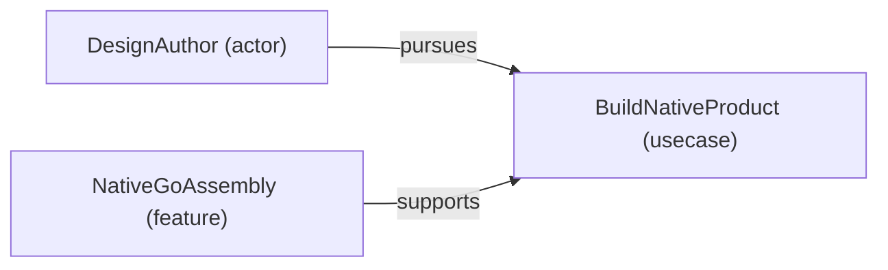
```mermaid
flowchart LR
    n_BuildNativeProduct["BuildNativeProduct (usecase)"]
    n_DesignAuthor["DesignAuthor (actor)"]
    n_NativeGoAssembly["NativeGoAssembly (feature)"]
    n_DesignAuthor -->|pursues| n_BuildNativeProduct
    n_NativeGoAssembly -->|supports| n_BuildNativeProduct
```

Kildegrunnlag: f0059, f0180.

### Bruksmål: EditRunningPrototype

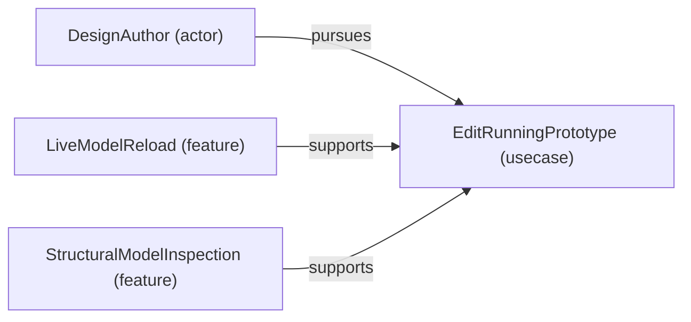
```mermaid
flowchart LR
    n_DesignAuthor["DesignAuthor (actor)"]
    n_EditRunningPrototype["EditRunningPrototype (usecase)"]
    n_LiveModelReload["LiveModelReload (feature)"]
    n_StructuralModelInspection["StructuralModelInspection (feature)"]
    n_DesignAuthor -->|pursues| n_EditRunningPrototype
    n_LiveModelReload -->|supports| n_EditRunningPrototype
    n_StructuralModelInspection -->|supports| n_EditRunningPrototype
```

Kildegrunnlag: f0060, f0163, f0422.

### Bruksmål: InspectModels

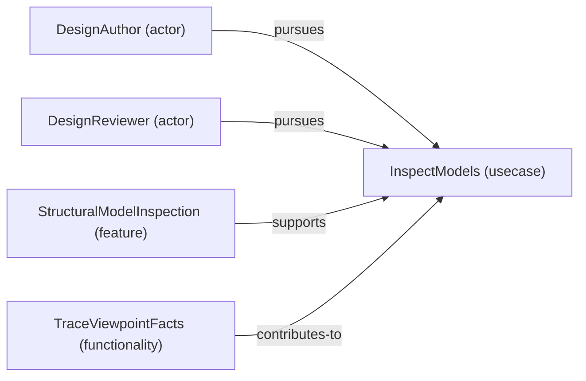
```mermaid
flowchart LR
    n_DesignAuthor["DesignAuthor (actor)"]
    n_DesignReviewer["DesignReviewer (actor)"]
    n_InspectModels["InspectModels (usecase)"]
    n_StructuralModelInspection["StructuralModelInspection (feature)"]
    n_TraceViewpointFacts["TraceViewpointFacts (functionality)"]
    n_DesignAuthor -->|pursues| n_InspectModels
    n_DesignReviewer -->|pursues| n_InspectModels
    n_StructuralModelInspection -->|supports| n_InspectModels
    n_TraceViewpointFacts -->|contributes-to| n_InspectModels
```

Kildegrunnlag: f0061, f0066, f0423, f0433.

### Bruksmål: PrototypeUserInterface

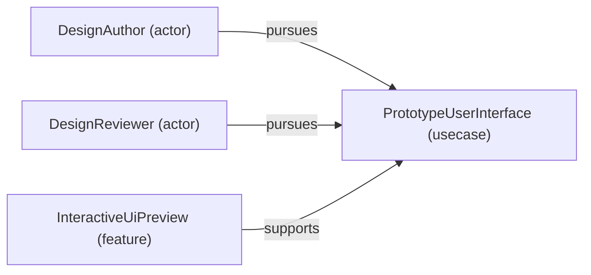
```mermaid
flowchart LR
    n_DesignAuthor["DesignAuthor (actor)"]
    n_DesignReviewer["DesignReviewer (actor)"]
    n_InteractiveUiPreview["InteractiveUiPreview (feature)"]
    n_PrototypeUserInterface["PrototypeUserInterface (usecase)"]
    n_DesignAuthor -->|pursues| n_PrototypeUserInterface
    n_DesignReviewer -->|pursues| n_PrototypeUserInterface
    n_InteractiveUiPreview -->|supports| n_PrototypeUserInterface
```

Kildegrunnlag: f0062, f0067, f0156.

### Bruksmål: PublishDesignDocumentation

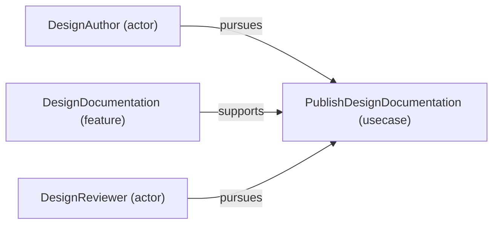
```mermaid
flowchart LR
    n_DesignAuthor["DesignAuthor (actor)"]
    n_DesignDocumentation["DesignDocumentation (feature)"]
    n_DesignReviewer["DesignReviewer (actor)"]
    n_PublishDesignDocumentation["PublishDesignDocumentation (usecase)"]
    n_DesignAuthor -->|pursues| n_PublishDesignDocumentation
    n_DesignDocumentation -->|supports| n_PublishDesignDocumentation
    n_DesignReviewer -->|pursues| n_PublishDesignDocumentation
```

Kildegrunnlag: f0063, f0068, f0065.

### Bruksmål: TryDomainInteraction

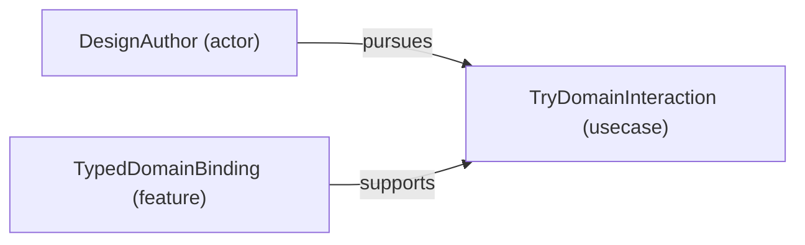
```mermaid
flowchart LR
    n_DesignAuthor["DesignAuthor (actor)"]
    n_TryDomainInteraction["TryDomainInteraction (usecase)"]
    n_TypedDomainBinding["TypedDomainBinding (feature)"]
    n_DesignAuthor -->|pursues| n_TryDomainInteraction
    n_TypedDomainBinding -->|supports| n_TryDomainInteraction
```

Kildegrunnlag: f0064, f0438.

### Functionality-bidrag til Feature: DesignDocumentation

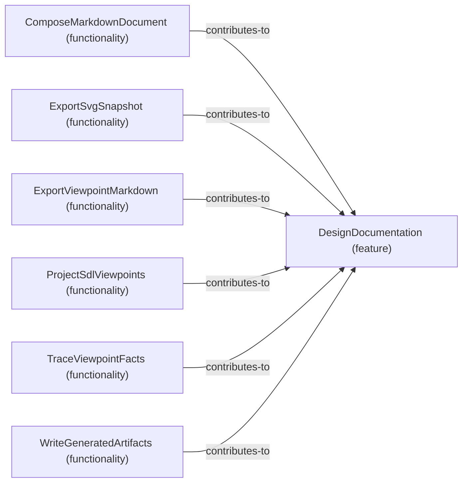
```mermaid
flowchart LR
    n_ComposeMarkdownDocument["ComposeMarkdownDocument (functionality)"]
    n_DesignDocumentation["DesignDocumentation (feature)"]
    n_ExportSvgSnapshot["ExportSvgSnapshot (functionality)"]
    n_ExportViewpointMarkdown["ExportViewpointMarkdown (functionality)"]
    n_ProjectSdlViewpoints["ProjectSdlViewpoints (functionality)"]
    n_TraceViewpointFacts["TraceViewpointFacts (functionality)"]
    n_WriteGeneratedArtifacts["WriteGeneratedArtifacts (functionality)"]
    n_ComposeMarkdownDocument -->|contributes-to| n_DesignDocumentation
    n_ExportSvgSnapshot -->|contributes-to| n_DesignDocumentation
    n_ExportViewpointMarkdown -->|contributes-to| n_DesignDocumentation
    n_ProjectSdlViewpoints -->|contributes-to| n_DesignDocumentation
    n_TraceViewpointFacts -->|contributes-to| n_DesignDocumentation
    n_WriteGeneratedArtifacts -->|contributes-to| n_DesignDocumentation
```

Kildegrunnlag: f0043, f0106, f0110, f0212, f0432, f0469.

### Functionality-bidrag til Feature: InteractiveUiPreview

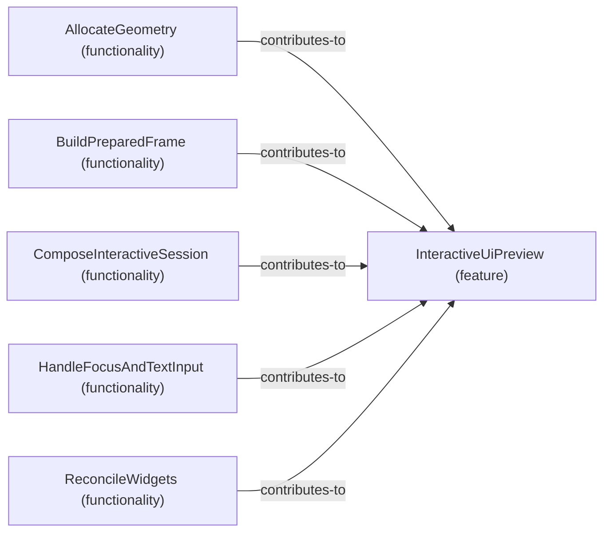
```mermaid
flowchart LR
    n_AllocateGeometry["AllocateGeometry (functionality)"]
    n_BuildPreparedFrame["BuildPreparedFrame (functionality)"]
    n_ComposeInteractiveSession["ComposeInteractiveSession (functionality)"]
    n_HandleFocusAndTextInput["HandleFocusAndTextInput (functionality)"]
    n_InteractiveUiPreview["InteractiveUiPreview (feature)"]
    n_ReconcileWidgets["ReconcileWidgets (functionality)"]
    n_AllocateGeometry -->|contributes-to| n_InteractiveUiPreview
    n_BuildPreparedFrame -->|contributes-to| n_InteractiveUiPreview
    n_ComposeInteractiveSession -->|contributes-to| n_InteractiveUiPreview
    n_HandleFocusAndTextInput -->|contributes-to| n_InteractiveUiPreview
    n_ReconcileWidgets -->|contributes-to| n_InteractiveUiPreview
```

Kildegrunnlag: f0001, f0012, f0040, f0151, f0225.

### Functionality-bidrag til Feature: LiveModelReload

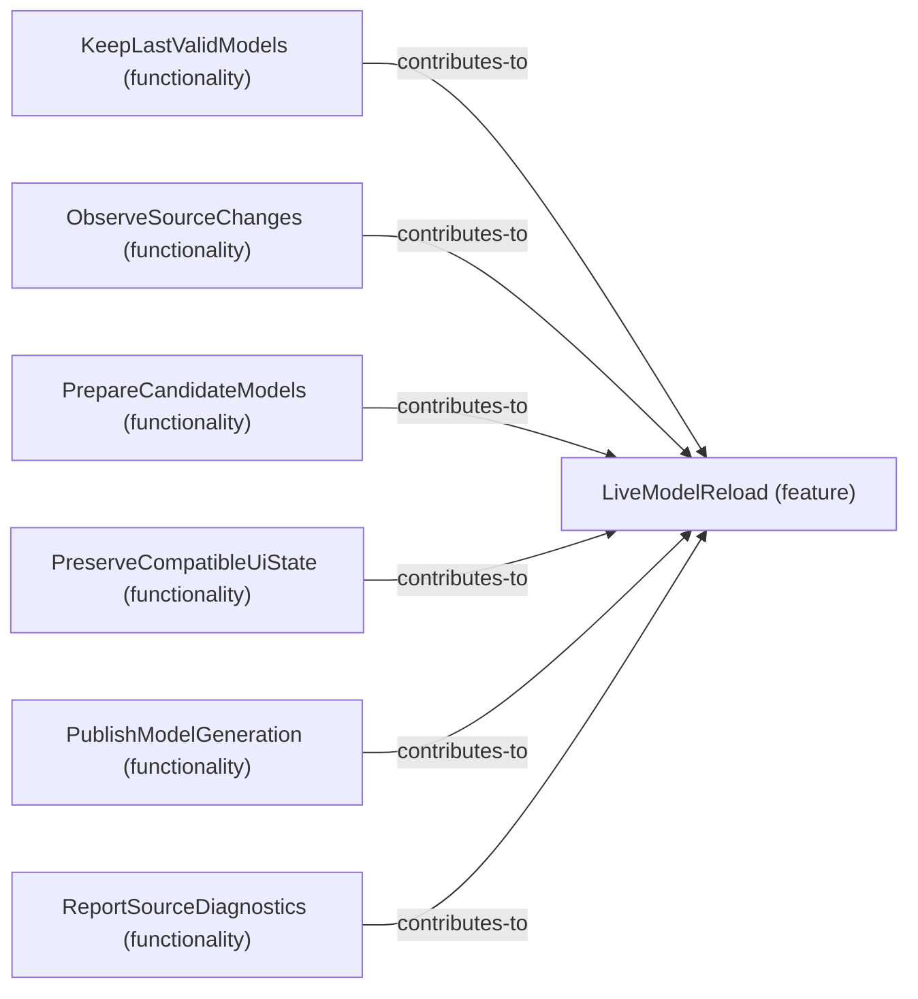
```mermaid
flowchart LR
    n_KeepLastValidModels["KeepLastValidModels (functionality)"]
    n_LiveModelReload["LiveModelReload (feature)"]
    n_ObserveSourceChanges["ObserveSourceChanges (functionality)"]
    n_PrepareCandidateModels["PrepareCandidateModels (functionality)"]
    n_PreserveCompatibleUiState["PreserveCompatibleUiState (functionality)"]
    n_PublishModelGeneration["PublishModelGeneration (functionality)"]
    n_ReportSourceDiagnostics["ReportSourceDiagnostics (functionality)"]
    n_KeepLastValidModels -->|contributes-to| n_LiveModelReload
    n_ObserveSourceChanges -->|contributes-to| n_LiveModelReload
    n_PrepareCandidateModels -->|contributes-to| n_LiveModelReload
    n_PreserveCompatibleUiState -->|contributes-to| n_LiveModelReload
    n_PublishModelGeneration -->|contributes-to| n_LiveModelReload
    n_ReportSourceDiagnostics -->|contributes-to| n_LiveModelReload
```

Kildegrunnlag: f0161, f0188, f0192, f0197, f0219, f0250.

### Functionality-bidrag til Feature: NativeGoAssembly

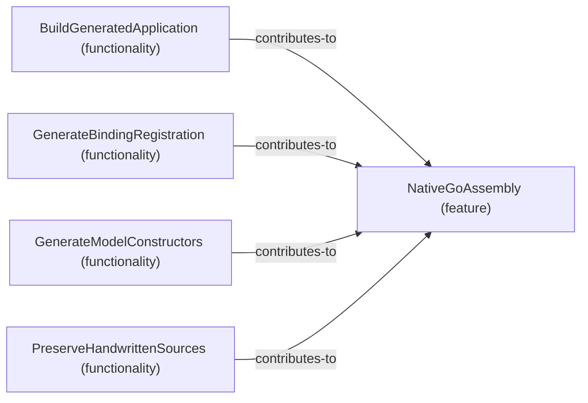
```mermaid
flowchart LR
    n_BuildGeneratedApplication["BuildGeneratedApplication (functionality)"]
    n_GenerateBindingRegistration["GenerateBindingRegistration (functionality)"]
    n_GenerateModelConstructors["GenerateModelConstructors (functionality)"]
    n_NativeGoAssembly["NativeGoAssembly (feature)"]
    n_PreserveHandwrittenSources["PreserveHandwrittenSources (functionality)"]
    n_BuildGeneratedApplication -->|contributes-to| n_NativeGoAssembly
    n_GenerateBindingRegistration -->|contributes-to| n_NativeGoAssembly
    n_GenerateModelConstructors -->|contributes-to| n_NativeGoAssembly
    n_PreserveHandwrittenSources -->|contributes-to| n_NativeGoAssembly
```

Kildegrunnlag: f0008, f0131, f0134, f0200.

### Functionality-bidrag til Feature: StructuralModelInspection

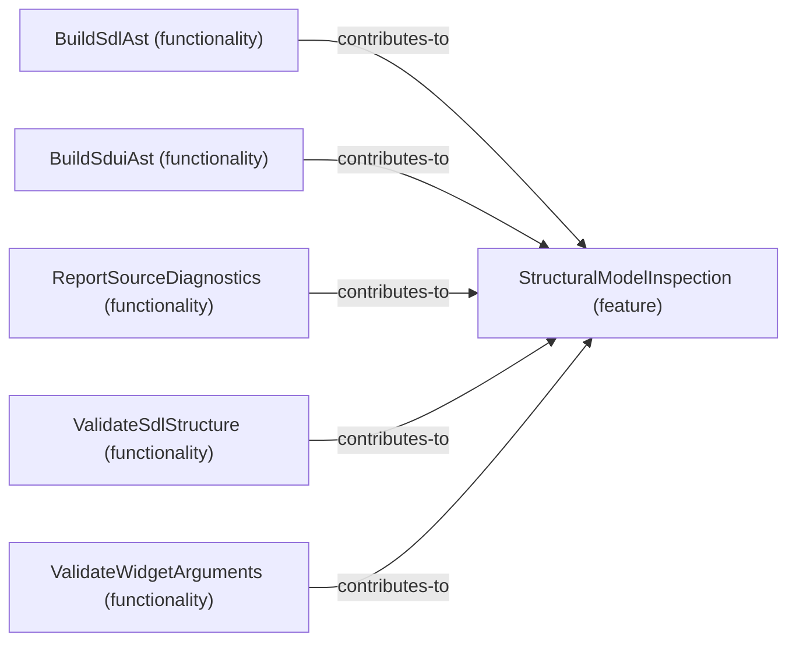
```mermaid
flowchart LR
    n_BuildSdlAst["BuildSdlAst (functionality)"]
    n_BuildSduiAst["BuildSduiAst (functionality)"]
    n_ReportSourceDiagnostics["ReportSourceDiagnostics (functionality)"]
    n_StructuralModelInspection["StructuralModelInspection (feature)"]
    n_ValidateSdlStructure["ValidateSdlStructure (functionality)"]
    n_ValidateWidgetArguments["ValidateWidgetArguments (functionality)"]
    n_BuildSdlAst -->|contributes-to| n_StructuralModelInspection
    n_BuildSduiAst -->|contributes-to| n_StructuralModelInspection
    n_ReportSourceDiagnostics -->|contributes-to| n_StructuralModelInspection
    n_ValidateSdlStructure -->|contributes-to| n_StructuralModelInspection
    n_ValidateWidgetArguments -->|contributes-to| n_StructuralModelInspection
```

Kildegrunnlag: f0015, f0020, f0251, f0454, f0464.

### Functionality-bidrag til Feature: TypedDomainBinding

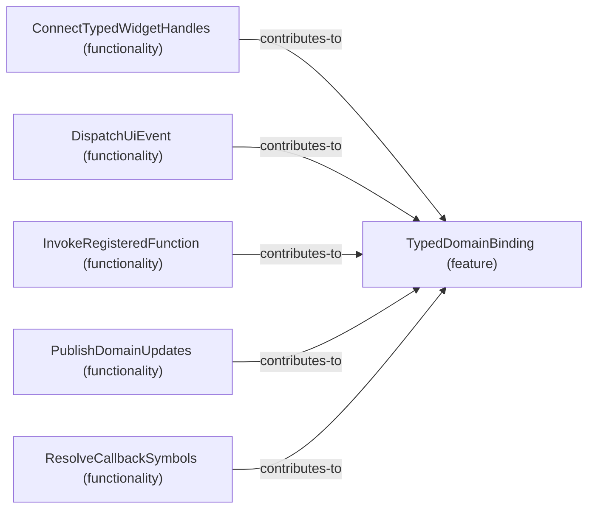
```mermaid
flowchart LR
    n_ConnectTypedWidgetHandles["ConnectTypedWidgetHandles (functionality)"]
    n_DispatchUiEvent["DispatchUiEvent (functionality)"]
    n_InvokeRegisteredFunction["InvokeRegisteredFunction (functionality)"]
    n_PublishDomainUpdates["PublishDomainUpdates (functionality)"]
    n_ResolveCallbackSymbols["ResolveCallbackSymbols (functionality)"]
    n_TypedDomainBinding["TypedDomainBinding (feature)"]
    n_ConnectTypedWidgetHandles -->|contributes-to| n_TypedDomainBinding
    n_DispatchUiEvent -->|contributes-to| n_TypedDomainBinding
    n_InvokeRegisteredFunction -->|contributes-to| n_TypedDomainBinding
    n_PublishDomainUpdates -->|contributes-to| n_TypedDomainBinding
    n_ResolveCallbackSymbols -->|contributes-to| n_TypedDomainBinding
```

Kildegrunnlag: f0047, f0093, f0158, f0216, f0256.

## VP02 — Arkitektur og logisk inndeling

Container er en erklært runtimegrense. Unit-røtter viser logisk struktur.
contains angir ikke deployment. Eksplisitt Functionality-allokering vises per modus i VP07.

### Arkitekturrøtter — ingen kobling/allokering er utledet

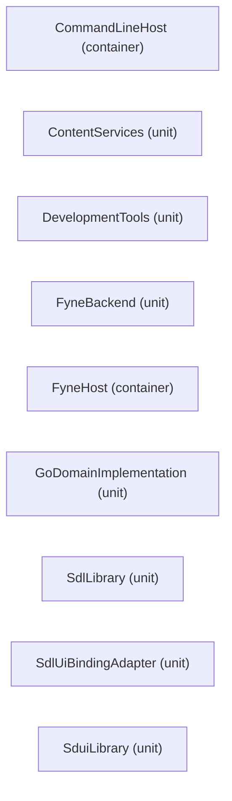
```mermaid
flowchart LR
    n_CommandLineHost["CommandLineHost (container)"]
    n_ContentServices["ContentServices (unit)"]
    n_DevelopmentTools["DevelopmentTools (unit)"]
    n_FyneBackend["FyneBackend (unit)"]
    n_FyneHost["FyneHost (container)"]
    n_GoDomainImplementation["GoDomainImplementation (unit)"]
    n_SdlLibrary["SdlLibrary (unit)"]
    n_SdlUiBindingAdapter["SdlUiBindingAdapter (unit)"]
    n_SduiLibrary["SduiLibrary (unit)"]
```

Kildegrunnlag: Kun deklarasjoner.

### Logisk inndeling: ContentServices

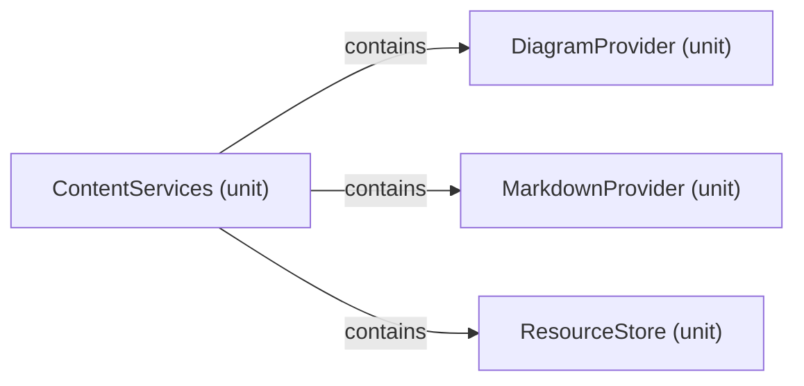
```mermaid
flowchart LR
    n_ContentServices["ContentServices (unit)"]
    n_DiagramProvider["DiagramProvider (unit)"]
    n_MarkdownProvider["MarkdownProvider (unit)"]
    n_ResourceStore["ResourceStore (unit)"]
    n_ContentServices -->|contains| n_DiagramProvider
    n_ContentServices -->|contains| n_MarkdownProvider
    n_ContentServices -->|contains| n_ResourceStore
```

Kildegrunnlag: f0049, f0050, f0051.

### Logisk inndeling: DevelopmentTools

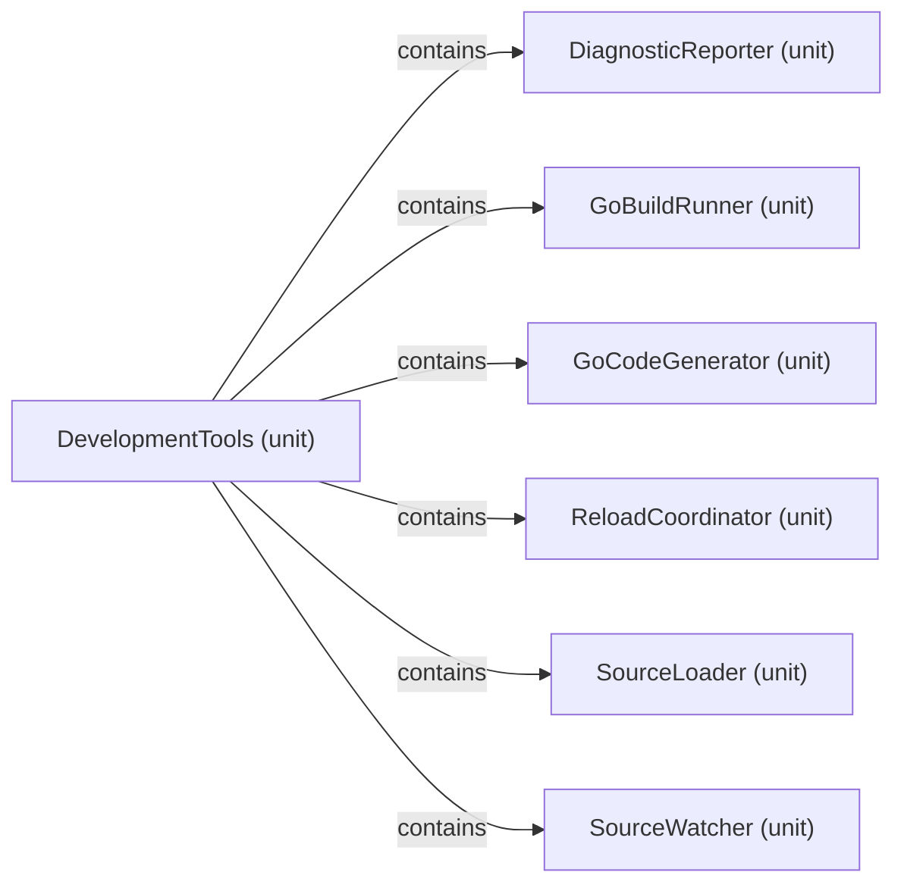
```mermaid
flowchart LR
    n_DevelopmentTools["DevelopmentTools (unit)"]
    n_DiagnosticReporter["DiagnosticReporter (unit)"]
    n_GoBuildRunner["GoBuildRunner (unit)"]
    n_GoCodeGenerator["GoCodeGenerator (unit)"]
    n_ReloadCoordinator["ReloadCoordinator (unit)"]
    n_SourceLoader["SourceLoader (unit)"]
    n_SourceWatcher["SourceWatcher (unit)"]
    n_DevelopmentTools -->|contains| n_DiagnosticReporter
    n_DevelopmentTools -->|contains| n_GoBuildRunner
    n_DevelopmentTools -->|contains| n_GoCodeGenerator
    n_DevelopmentTools -->|contains| n_ReloadCoordinator
    n_DevelopmentTools -->|contains| n_SourceLoader
    n_DevelopmentTools -->|contains| n_SourceWatcher
```

Kildegrunnlag: f0077, f0078, f0079, f0080, f0081, f0082.

### Logisk inndeling: SdlFrontend

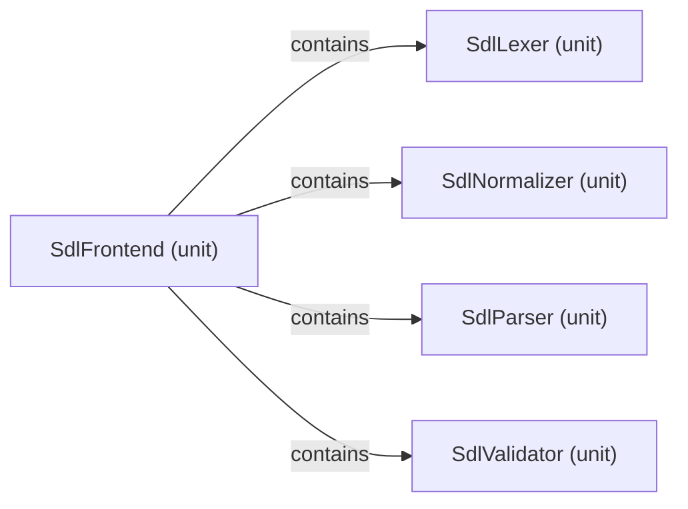
```mermaid
flowchart LR
    n_SdlFrontend["SdlFrontend (unit)"]
    n_SdlLexer["SdlLexer (unit)"]
    n_SdlNormalizer["SdlNormalizer (unit)"]
    n_SdlParser["SdlParser (unit)"]
    n_SdlValidator["SdlValidator (unit)"]
    n_SdlFrontend -->|contains| n_SdlLexer
    n_SdlFrontend -->|contains| n_SdlNormalizer
    n_SdlFrontend -->|contains| n_SdlParser
    n_SdlFrontend -->|contains| n_SdlValidator
```

Kildegrunnlag: f0289, f0290, f0291, f0292.

### Logisk inndeling: SdlLibrary

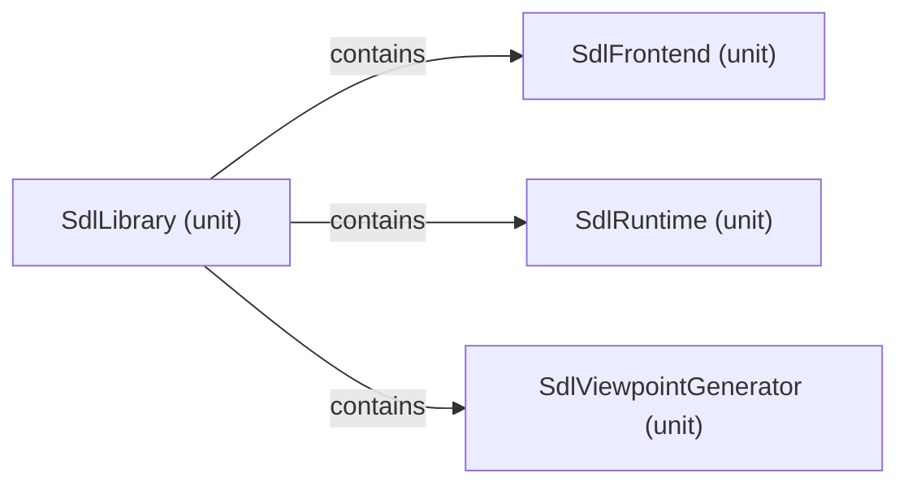
```mermaid
flowchart LR
    n_SdlFrontend["SdlFrontend (unit)"]
    n_SdlLibrary["SdlLibrary (unit)"]
    n_SdlRuntime["SdlRuntime (unit)"]
    n_SdlViewpointGenerator["SdlViewpointGenerator (unit)"]
    n_SdlLibrary -->|contains| n_SdlFrontend
    n_SdlLibrary -->|contains| n_SdlRuntime
    n_SdlLibrary -->|contains| n_SdlViewpointGenerator
```

Kildegrunnlag: f0301, f0302, f0303.

### Logisk inndeling: SdlRuntime

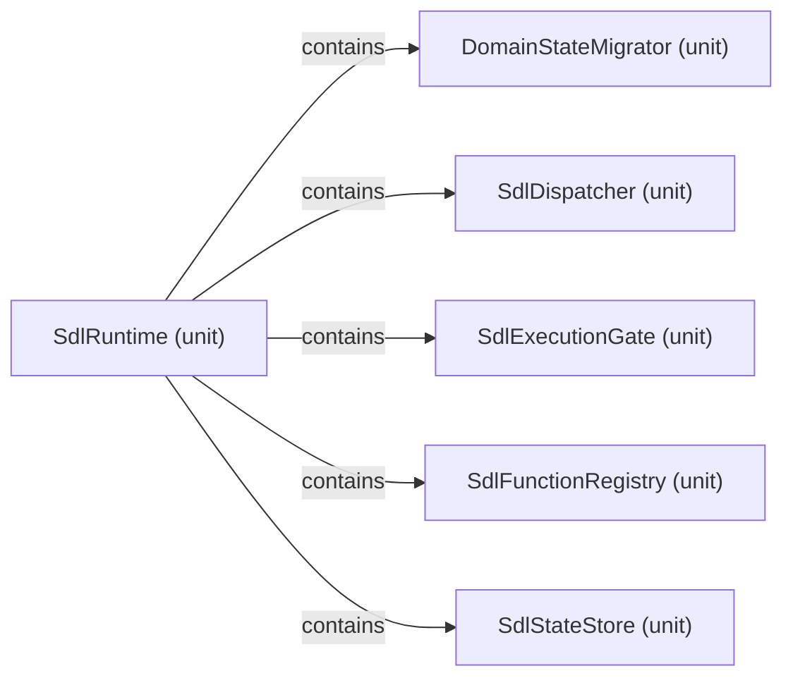
```mermaid
flowchart LR
    n_DomainStateMigrator["DomainStateMigrator (unit)"]
    n_SdlDispatcher["SdlDispatcher (unit)"]
    n_SdlExecutionGate["SdlExecutionGate (unit)"]
    n_SdlFunctionRegistry["SdlFunctionRegistry (unit)"]
    n_SdlRuntime["SdlRuntime (unit)"]
    n_SdlStateStore["SdlStateStore (unit)"]
    n_SdlRuntime -->|contains| n_DomainStateMigrator
    n_SdlRuntime -->|contains| n_SdlDispatcher
    n_SdlRuntime -->|contains| n_SdlExecutionGate
    n_SdlRuntime -->|contains| n_SdlFunctionRegistry
    n_SdlRuntime -->|contains| n_SdlStateStore
```

Kildegrunnlag: f0313, f0314, f0315, f0316, f0317.

### Logisk inndeling: SduiFrontend

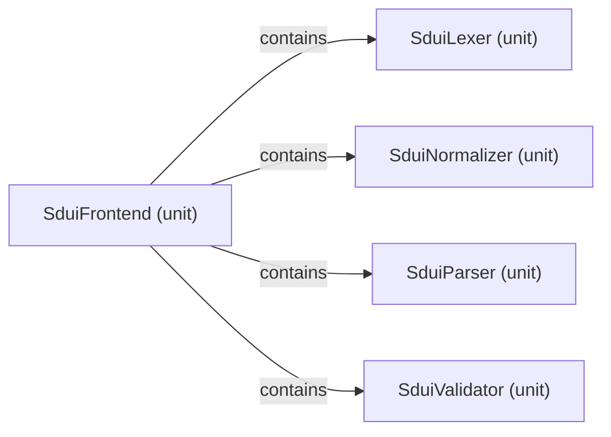
```mermaid
flowchart LR
    n_SduiFrontend["SduiFrontend (unit)"]
    n_SduiLexer["SduiLexer (unit)"]
    n_SduiNormalizer["SduiNormalizer (unit)"]
    n_SduiParser["SduiParser (unit)"]
    n_SduiValidator["SduiValidator (unit)"]
    n_SduiFrontend -->|contains| n_SduiLexer
    n_SduiFrontend -->|contains| n_SduiNormalizer
    n_SduiFrontend -->|contains| n_SduiParser
    n_SduiFrontend -->|contains| n_SduiValidator
```

Kildegrunnlag: f0350, f0351, f0352, f0353.

### Logisk inndeling: SduiLibrary

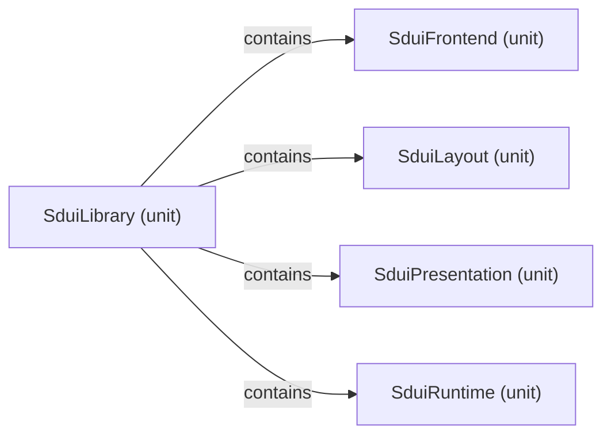
```mermaid
flowchart LR
    n_SduiFrontend["SduiFrontend (unit)"]
    n_SduiLayout["SduiLayout (unit)"]
    n_SduiLibrary["SduiLibrary (unit)"]
    n_SduiPresentation["SduiPresentation (unit)"]
    n_SduiRuntime["SduiRuntime (unit)"]
    n_SduiLibrary -->|contains| n_SduiFrontend
    n_SduiLibrary -->|contains| n_SduiLayout
    n_SduiLibrary -->|contains| n_SduiPresentation
    n_SduiLibrary -->|contains| n_SduiRuntime
```

Kildegrunnlag: f0371, f0372, f0373, f0374.

### Logisk inndeling: SduiRuntime

```mermaid
flowchart LR
    n_SduiDispatcher["SduiDispatcher (unit)"]
    n_SduiInstanceStore["SduiInstanceStore (unit)"]
    n_SduiPropertyStore["SduiPropertyStore (unit)"]
    n_SduiRuntime["SduiRuntime (unit)"]
    n_UiStateReconciler["UiStateReconciler (unit)"]
    n_SduiRuntime -->|contains| n_SduiDispatcher
    n_SduiRuntime -->|contains| n_SduiInstanceStore
    n_SduiRuntime -->|contains| n_SduiPropertyStore
    n_SduiRuntime -->|contains| n_UiStateReconciler
```

Kildegrunnlag: f0397, f0398, f0399, f0400.

## VP03 — Ansvar og kapabiliteter over arkitekturen

### Bidrag til kapabilitet: BoundInteraction

```mermaid
flowchart LR
    n_BoundInteraction["BoundInteraction (capability)"]
    n_ConnectTypedWidgetHandles["ConnectTypedWidgetHandles (functionality)"]
    n_DisconnectBindings["DisconnectBindings (functionality)"]
    n_PublishDomainUpdates["PublishDomainUpdates (functionality)"]
    n_ResolveCallbackSymbols["ResolveCallbackSymbols (functionality)"]
    n_RouteDomainBindings["RouteDomainBindings (functionality)"]
    n_SdlUiBindingAdapter["SdlUiBindingAdapter (unit)"]
    n_ConnectTypedWidgetHandles -->|realizes| n_BoundInteraction
    n_DisconnectBindings -->|realizes| n_BoundInteraction
    n_PublishDomainUpdates -->|realizes| n_BoundInteraction
    n_ResolveCallbackSymbols -->|realizes| n_BoundInteraction
    n_RouteDomainBindings -->|realizes| n_BoundInteraction
    n_SdlUiBindingAdapter -->|owns| n_ConnectTypedWidgetHandles
    n_SdlUiBindingAdapter -->|owns| n_DisconnectBindings
    n_SdlUiBindingAdapter -->|owns| n_PublishDomainUpdates
    n_SdlUiBindingAdapter -->|owns| n_ResolveCallbackSymbols
    n_SdlUiBindingAdapter -->|owns| n_RouteDomainBindings
```

Kildegrunnlag: f0048, f0091, f0217, f0257, f0272, f0328, f0329, f0330, f0331, f0332.

### Tilbydere av kapabilitet: BoundInteraction

```mermaid
flowchart LR
    n_BoundInteraction["BoundInteraction (capability)"]
    n_SdlUiBindingAdapter["SdlUiBindingAdapter (unit)"]
    n_SdlUiBindingAdapter -->|provides| n_BoundInteraction
```

Kildegrunnlag: f0333.

### Bidrag til kapabilitet: DevelopmentReload

```mermaid
flowchart LR
    n_CoalesceSourceChanges["CoalesceSourceChanges (functionality)"]
    n_DevelopmentReload["DevelopmentReload (capability)"]
    n_KeepLastValidModels["KeepLastValidModels (functionality)"]
    n_ObserveSourceChanges["ObserveSourceChanges (functionality)"]
    n_PrepareCandidateModels["PrepareCandidateModels (functionality)"]
    n_PublishModelGeneration["PublishModelGeneration (functionality)"]
    n_ReloadCoordinator["ReloadCoordinator (unit)"]
    n_RetirePreviousGeneration["RetirePreviousGeneration (functionality)"]
    n_SourceWatcher["SourceWatcher (unit)"]
    n_CoalesceSourceChanges -->|realizes| n_DevelopmentReload
    n_KeepLastValidModels -->|realizes| n_DevelopmentReload
    n_ObserveSourceChanges -->|realizes| n_DevelopmentReload
    n_PrepareCandidateModels -->|realizes| n_DevelopmentReload
    n_PublishModelGeneration -->|realizes| n_DevelopmentReload
    n_ReloadCoordinator -->|owns| n_KeepLastValidModels
    n_ReloadCoordinator -->|owns| n_PrepareCandidateModels
    n_ReloadCoordinator -->|owns| n_PublishModelGeneration
    n_ReloadCoordinator -->|owns| n_RetirePreviousGeneration
    n_RetirePreviousGeneration -->|realizes| n_DevelopmentReload
    n_SourceWatcher -->|owns| n_CoalesceSourceChanges
    n_SourceWatcher -->|owns| n_ObserveSourceChanges
```

Kildegrunnlag: f0030, f0162, f0189, f0193, f0221, f0268, f0241, f0242, f0243, f0244, f0417, f0418.

### Tilbydere av kapabilitet: DevelopmentReload

```mermaid
flowchart LR
    n_DevelopmentReload["DevelopmentReload (capability)"]
    n_DevelopmentTools["DevelopmentTools (unit)"]
    n_ReloadCoordinator["ReloadCoordinator (unit)"]
    n_SourceWatcher["SourceWatcher (unit)"]
    n_DevelopmentTools -->|provides| n_DevelopmentReload
    n_ReloadCoordinator -->|provides| n_DevelopmentReload
    n_SourceWatcher -->|provides| n_DevelopmentReload
```

Kildegrunnlag: f0083, f0245, f0419.

### Bidrag til kapabilitet: DomainOperations

```mermaid
flowchart LR
    n_DomainOperations["DomainOperations (capability)"]
    n_GoDomainImplementation["GoDomainImplementation (unit)"]
    n_PerformDomainOperation["PerformDomainOperation (functionality)"]
    n_GoDomainImplementation -->|owns| n_PerformDomainOperation
    n_PerformDomainOperation -->|realizes| n_DomainOperations
```

Kildegrunnlag: f0190, f0148.

### Tilbydere av kapabilitet: DomainOperations

```mermaid
flowchart LR
    n_DomainOperations["DomainOperations (capability)"]
    n_GoDomainImplementation["GoDomainImplementation (unit)"]
    n_GoDomainImplementation -->|provides| n_DomainOperations
```

Kildegrunnlag: f0149.

### Bidrag til kapabilitet: ExecutableDesign

```mermaid
flowchart LR
    n_CancelPendingActions["CancelPendingActions (functionality)"]
    n_CheckDomainStateCompatibility["CheckDomainStateCompatibility (functionality)"]
    n_CheckExecutionCompleteness["CheckExecutionCompleteness (functionality)"]
    n_CheckFunctionSignatures["CheckFunctionSignatures (functionality)"]
    n_CloseSdlInstance["CloseSdlInstance (functionality)"]
    n_CorrelateActionResult["CorrelateActionResult (functionality)"]
    n_CreateSdlInstance["CreateSdlInstance (functionality)"]
    n_DomainStateMigrator["DomainStateMigrator (unit)"]
    n_ExecutableDesign["ExecutableDesign (capability)"]
    n_InvokeRegisteredFunction["InvokeRegisteredFunction (functionality)"]
    n_ManageDomainState["ManageDomainState (functionality)"]
    n_MigrateOrResetDomainState["MigrateOrResetDomainState (functionality)"]
    n_RegisterDomainFunctions["RegisterDomainFunctions (functionality)"]
    n_SdlDispatcher["SdlDispatcher (unit)"]
    n_SdlExecutionGate["SdlExecutionGate (unit)"]
    n_SdlFunctionRegistry["SdlFunctionRegistry (unit)"]
    n_SdlRuntime["SdlRuntime (unit)"]
    n_SdlStateStore["SdlStateStore (unit)"]
    n_SnapshotDomainState["SnapshotDomainState (functionality)"]
    n_ValidateActionInput["ValidateActionInput (functionality)"]
    n_CancelPendingActions -->|realizes| n_ExecutableDesign
    n_CheckDomainStateCompatibility -->|realizes| n_ExecutableDesign
    n_CheckExecutionCompleteness -->|realizes| n_ExecutableDesign
    n_CheckFunctionSignatures -->|realizes| n_ExecutableDesign
    n_CloseSdlInstance -->|realizes| n_ExecutableDesign
    n_CorrelateActionResult -->|realizes| n_ExecutableDesign
    n_CreateSdlInstance -->|realizes| n_ExecutableDesign
    n_DomainStateMigrator -->|owns| n_CheckDomainStateCompatibility
    n_DomainStateMigrator -->|owns| n_MigrateOrResetDomainState
    n_InvokeRegisteredFunction -->|realizes| n_ExecutableDesign
    n_ManageDomainState -->|realizes| n_ExecutableDesign
    n_MigrateOrResetDomainState -->|realizes| n_ExecutableDesign
    n_RegisterDomainFunctions -->|realizes| n_ExecutableDesign
    n_SdlDispatcher -->|owns| n_CancelPendingActions
    n_SdlDispatcher -->|owns| n_CorrelateActionResult
    n_SdlDispatcher -->|owns| n_InvokeRegisteredFunction
    n_SdlDispatcher -->|owns| n_ValidateActionInput
    n_SdlExecutionGate -->|owns| n_CheckExecutionCompleteness
    n_SdlFunctionRegistry -->|owns| n_CheckFunctionSignatures
    n_SdlFunctionRegistry -->|owns| n_RegisterDomainFunctions
    n_SdlRuntime -->|owns| n_CloseSdlInstance
    n_SdlRuntime -->|owns| n_CreateSdlInstance
    n_SdlStateStore -->|owns| n_ManageDomainState
    n_SdlStateStore -->|owns| n_SnapshotDomainState
    n_SnapshotDomainState -->|realizes| n_ExecutableDesign
    n_ValidateActionInput -->|realizes| n_ExecutableDesign
```

Kildegrunnlag: f0024, f0025, f0026, f0027, f0028, f0055, f0057, f0159, f0165, f0179, f0229, f0410, f0445, f0097, f0098, f0278, f0279, f0280, f0281, f0285, f0296, f0297, f0318, f0319, f0322, f0323.

### Tilbydere av kapabilitet: ExecutableDesign

```mermaid
flowchart LR
    n_DomainStateMigrator["DomainStateMigrator (unit)"]
    n_ExecutableDesign["ExecutableDesign (capability)"]
    n_SdlDispatcher["SdlDispatcher (unit)"]
    n_SdlExecutionGate["SdlExecutionGate (unit)"]
    n_SdlFunctionRegistry["SdlFunctionRegistry (unit)"]
    n_SdlLibrary["SdlLibrary (unit)"]
    n_SdlRuntime["SdlRuntime (unit)"]
    n_SdlStateStore["SdlStateStore (unit)"]
    n_DomainStateMigrator -->|provides| n_ExecutableDesign
    n_SdlDispatcher -->|provides| n_ExecutableDesign
    n_SdlExecutionGate -->|provides| n_ExecutableDesign
    n_SdlFunctionRegistry -->|provides| n_ExecutableDesign
    n_SdlLibrary -->|provides| n_ExecutableDesign
    n_SdlRuntime -->|provides| n_ExecutableDesign
    n_SdlStateStore -->|provides| n_ExecutableDesign
```

Kildegrunnlag: f0099, f0282, f0286, f0298, f0304, f0320, f0324.

### Bidrag til kapabilitet: InteractiveSession

```mermaid
flowchart LR
    n_ApplyPropertyBatch["ApplyPropertyBatch (functionality)"]
    n_CloseUiInstance["CloseUiInstance (functionality)"]
    n_CorrelateUiResult["CorrelateUiResult (functionality)"]
    n_CreateUiInstance["CreateUiInstance (functionality)"]
    n_DispatchUiEvent["DispatchUiEvent (functionality)"]
    n_InteractiveSession["InteractiveSession (capability)"]
    n_ManageWidgetIdentities["ManageWidgetIdentities (functionality)"]
    n_MatchCompatibleWidgets["MatchCompatibleWidgets (functionality)"]
    n_PreserveCompatibleUiState["PreserveCompatibleUiState (functionality)"]
    n_RejectStaleUiEvent["RejectStaleUiEvent (functionality)"]
    n_ResetIncompatibleUiState["ResetIncompatibleUiState (functionality)"]
    n_RevokeWidgetGenerations["RevokeWidgetGenerations (functionality)"]
    n_SduiDispatcher["SduiDispatcher (unit)"]
    n_SduiInstanceStore["SduiInstanceStore (unit)"]
    n_SduiPropertyStore["SduiPropertyStore (unit)"]
    n_SduiRuntime["SduiRuntime (unit)"]
    n_SnapshotUiState["SnapshotUiState (functionality)"]
    n_TrackInputDraft["TrackInputDraft (functionality)"]
    n_UiStateReconciler["UiStateReconciler (unit)"]
    n_ValidatePropertyBatch["ValidatePropertyBatch (functionality)"]
    n_ValidateUiEvent["ValidateUiEvent (functionality)"]
    n_ApplyPropertyBatch -->|realizes| n_InteractiveSession
    n_CloseUiInstance -->|realizes| n_InteractiveSession
    n_CorrelateUiResult -->|realizes| n_InteractiveSession
    n_CreateUiInstance -->|realizes| n_InteractiveSession
    n_DispatchUiEvent -->|realizes| n_InteractiveSession
    n_ManageWidgetIdentities -->|realizes| n_InteractiveSession
    n_MatchCompatibleWidgets -->|realizes| n_InteractiveSession
    n_PreserveCompatibleUiState -->|realizes| n_InteractiveSession
    n_RejectStaleUiEvent -->|realizes| n_InteractiveSession
    n_ResetIncompatibleUiState -->|realizes| n_InteractiveSession
    n_RevokeWidgetGenerations -->|realizes| n_InteractiveSession
    n_SduiDispatcher -->|owns| n_CorrelateUiResult
    n_SduiDispatcher -->|owns| n_DispatchUiEvent
    n_SduiDispatcher -->|owns| n_RejectStaleUiEvent
    n_SduiDispatcher -->|owns| n_ValidateUiEvent
    n_SduiInstanceStore -->|owns| n_ManageWidgetIdentities
    n_SduiInstanceStore -->|owns| n_RevokeWidgetGenerations
    n_SduiInstanceStore -->|owns| n_SnapshotUiState
    n_SduiPropertyStore -->|owns| n_ApplyPropertyBatch
    n_SduiPropertyStore -->|owns| n_TrackInputDraft
    n_SduiPropertyStore -->|owns| n_ValidatePropertyBatch
    n_SduiRuntime -->|owns| n_CloseUiInstance
    n_SduiRuntime -->|owns| n_CreateUiInstance
    n_SnapshotUiState -->|realizes| n_InteractiveSession
    n_TrackInputDraft -->|realizes| n_InteractiveSession
    n_UiStateReconciler -->|owns| n_MatchCompatibleWidgets
    n_UiStateReconciler -->|owns| n_PreserveCompatibleUiState
    n_UiStateReconciler -->|owns| n_ResetIncompatibleUiState
    n_ValidatePropertyBatch -->|realizes| n_InteractiveSession
    n_ValidateUiEvent -->|realizes| n_InteractiveSession
```

Kildegrunnlag: f0004, f0029, f0056, f0058, f0094, f0167, f0174, f0198, f0230, f0253, f0269, f0411, f0437, f0446, f0461, f0343, f0344, f0345, f0346, f0356, f0357, f0358, f0391, f0392, f0393, f0401, f0402, f0441, f0442, f0443.

### Tilbydere av kapabilitet: InteractiveSession

```mermaid
flowchart LR
    n_InteractiveSession["InteractiveSession (capability)"]
    n_SduiDispatcher["SduiDispatcher (unit)"]
    n_SduiInstanceStore["SduiInstanceStore (unit)"]
    n_SduiLibrary["SduiLibrary (unit)"]
    n_SduiPropertyStore["SduiPropertyStore (unit)"]
    n_SduiRuntime["SduiRuntime (unit)"]
    n_UiStateReconciler["UiStateReconciler (unit)"]
    n_SduiDispatcher -->|provides| n_InteractiveSession
    n_SduiInstanceStore -->|provides| n_InteractiveSession
    n_SduiLibrary -->|provides| n_InteractiveSession
    n_SduiPropertyStore -->|provides| n_InteractiveSession
    n_SduiRuntime -->|provides| n_InteractiveSession
    n_UiStateReconciler -->|provides| n_InteractiveSession
```

Kildegrunnlag: f0347, f0359, f0375, f0394, f0403, f0444.

### Bidrag til kapabilitet: MeasuredPresentation

```mermaid
flowchart LR
    n_AllocateGeometry["AllocateGeometry (functionality)"]
    n_BuildPreparedFrame["BuildPreparedFrame (functionality)"]
    n_ComputeClipping["ComputeClipping (functionality)"]
    n_MeasureUiContent["MeasureUiContent (functionality)"]
    n_MeasuredPresentation["MeasuredPresentation (capability)"]
    n_ResolveAncestorDimensions["ResolveAncestorDimensions (functionality)"]
    n_SduiLayout["SduiLayout (unit)"]
    n_AllocateGeometry -->|realizes| n_MeasuredPresentation
    n_BuildPreparedFrame -->|realizes| n_MeasuredPresentation
    n_ComputeClipping -->|realizes| n_MeasuredPresentation
    n_MeasureUiContent -->|realizes| n_MeasuredPresentation
    n_ResolveAncestorDimensions -->|realizes| n_MeasuredPresentation
    n_SduiLayout -->|owns| n_AllocateGeometry
    n_SduiLayout -->|owns| n_BuildPreparedFrame
    n_SduiLayout -->|owns| n_ComputeClipping
    n_SduiLayout -->|owns| n_MeasureUiContent
    n_SduiLayout -->|owns| n_ResolveAncestorDimensions
```

Kildegrunnlag: f0002, f0013, f0045, f0176, f0254, f0363, f0364, f0365, f0366, f0367.

### Tilbydere av kapabilitet: MeasuredPresentation

```mermaid
flowchart LR
    n_MeasuredPresentation["MeasuredPresentation (capability)"]
    n_SduiLayout["SduiLayout (unit)"]
    n_SduiLibrary["SduiLibrary (unit)"]
    n_SduiLayout -->|provides| n_MeasuredPresentation
    n_SduiLibrary -->|provides| n_MeasuredPresentation
```

Kildegrunnlag: f0368, f0376.

### Bidrag til kapabilitet: NativeInteraction

```mermaid
flowchart LR
    n_ComposeInteractiveSession["ComposeInteractiveSession (functionality)"]
    n_FyneBackend["FyneBackend (unit)"]
    n_FyneHost["FyneHost (container)"]
    n_HandleFocusAndTextInput["HandleFocusAndTextInput (functionality)"]
    n_NativeInteraction["NativeInteraction (capability)"]
    n_PublishPresentation["PublishPresentation (functionality)"]
    n_ReconcileWidgets["ReconcileWidgets (functionality)"]
    n_ReleaseNativeWidgets["ReleaseNativeWidgets (functionality)"]
    n_ScheduleUiPublication["ScheduleUiPublication (functionality)"]
    n_ComposeInteractiveSession -->|realizes| n_NativeInteraction
    n_FyneBackend -->|owns| n_HandleFocusAndTextInput
    n_FyneBackend -->|owns| n_PublishPresentation
    n_FyneBackend -->|owns| n_ReconcileWidgets
    n_FyneBackend -->|owns| n_ReleaseNativeWidgets
    n_FyneHost -->|owns| n_ComposeInteractiveSession
    n_FyneHost -->|owns| n_ScheduleUiPublication
    n_HandleFocusAndTextInput -->|realizes| n_NativeInteraction
    n_PublishPresentation -->|realizes| n_NativeInteraction
    n_ReconcileWidgets -->|realizes| n_NativeInteraction
    n_ReleaseNativeWidgets -->|realizes| n_NativeInteraction
    n_ScheduleUiPublication -->|realizes| n_NativeInteraction
```

Kildegrunnlag: f0041, f0152, f0222, f0227, f0231, f0275, f0115, f0116, f0117, f0118, f0127, f0128.

### Tilbydere av kapabilitet: NativeInteraction

```mermaid
flowchart LR
    n_FyneBackend["FyneBackend (unit)"]
    n_FyneHost["FyneHost (container)"]
    n_NativeInteraction["NativeInteraction (capability)"]
    n_FyneBackend -->|provides| n_NativeInteraction
    n_FyneHost -->|provides| n_NativeInteraction
```

Kildegrunnlag: f0119, f0129.

### Bidrag til kapabilitet: NativeRealization

```mermaid
flowchart LR
    n_BuildGeneratedApplication["BuildGeneratedApplication (functionality)"]
    n_GenerateBindingRegistration["GenerateBindingRegistration (functionality)"]
    n_GenerateModelConstructors["GenerateModelConstructors (functionality)"]
    n_GoBuildRunner["GoBuildRunner (unit)"]
    n_GoCodeGenerator["GoCodeGenerator (unit)"]
    n_NativeRealization["NativeRealization (capability)"]
    n_PreserveHandwrittenSources["PreserveHandwrittenSources (functionality)"]
    n_RestartChangedGoProgram["RestartChangedGoProgram (functionality)"]
    n_BuildGeneratedApplication -->|realizes| n_NativeRealization
    n_GenerateBindingRegistration -->|realizes| n_NativeRealization
    n_GenerateModelConstructors -->|realizes| n_NativeRealization
    n_GoBuildRunner -->|owns| n_BuildGeneratedApplication
    n_GoBuildRunner -->|owns| n_RestartChangedGoProgram
    n_GoCodeGenerator -->|owns| n_GenerateBindingRegistration
    n_GoCodeGenerator -->|owns| n_GenerateModelConstructors
    n_GoCodeGenerator -->|owns| n_PreserveHandwrittenSources
    n_PreserveHandwrittenSources -->|realizes| n_NativeRealization
    n_RestartChangedGoProgram -->|realizes| n_NativeRealization
```

Kildegrunnlag: f0009, f0132, f0135, f0201, f0267, f0138, f0139, f0144, f0145, f0146.

### Tilbydere av kapabilitet: NativeRealization

```mermaid
flowchart LR
    n_GoBuildRunner["GoBuildRunner (unit)"]
    n_GoCodeGenerator["GoCodeGenerator (unit)"]
    n_NativeRealization["NativeRealization (capability)"]
    n_GoBuildRunner -->|provides| n_NativeRealization
    n_GoCodeGenerator -->|provides| n_NativeRealization
```

Kildegrunnlag: f0140, f0147.

### Bidrag til kapabilitet: RichContent

```mermaid
flowchart LR
    n_DiagramProvider["DiagramProvider (unit)"]
    n_MarkdownProvider["MarkdownProvider (unit)"]
    n_MeasureMarkdownContent["MeasureMarkdownContent (functionality)"]
    n_PrepareDiagramResource["PrepareDiagramResource (functionality)"]
    n_PrepareMarkdown["PrepareMarkdown (functionality)"]
    n_ReleaseVisualResources["ReleaseVisualResources (functionality)"]
    n_ResourceStore["ResourceStore (unit)"]
    n_RichContent["RichContent (capability)"]
    n_ValidateVisualResources["ValidateVisualResources (functionality)"]
    n_DiagramProvider -->|owns| n_PrepareDiagramResource
    n_MarkdownProvider -->|owns| n_MeasureMarkdownContent
    n_MarkdownProvider -->|owns| n_PrepareMarkdown
    n_MeasureMarkdownContent -->|realizes| n_RichContent
    n_PrepareDiagramResource -->|realizes| n_RichContent
    n_PrepareMarkdown -->|realizes| n_RichContent
    n_ReleaseVisualResources -->|realizes| n_RichContent
    n_ResourceStore -->|owns| n_ReleaseVisualResources
    n_ResourceStore -->|owns| n_ValidateVisualResources
    n_ValidateVisualResources -->|realizes| n_RichContent
```

Kildegrunnlag: f0175, f0194, f0195, f0232, f0462, f0089, f0171, f0172, f0264, f0265.

### Tilbydere av kapabilitet: RichContent

```mermaid
flowchart LR
    n_ContentServices["ContentServices (unit)"]
    n_DiagramProvider["DiagramProvider (unit)"]
    n_MarkdownProvider["MarkdownProvider (unit)"]
    n_ResourceStore["ResourceStore (unit)"]
    n_RichContent["RichContent (capability)"]
    n_ContentServices -->|provides| n_RichContent
    n_DiagramProvider -->|provides| n_RichContent
    n_MarkdownProvider -->|provides| n_RichContent
    n_ResourceStore -->|provides| n_RichContent
```

Kildegrunnlag: f0052, f0090, f0173, f0266.

### Bidrag til kapabilitet: SdlSourceModel

```mermaid
flowchart LR
    n_BuildSdlAst["BuildSdlAst (functionality)"]
    n_CoordinateSdlCompilation["CoordinateSdlCompilation (functionality)"]
    n_NormalizeSdlModel["NormalizeSdlModel (functionality)"]
    n_PreserveSdlSourceMap["PreserveSdlSourceMap (functionality)"]
    n_ResolveSdlSymbols["ResolveSdlSymbols (functionality)"]
    n_SdlFrontend["SdlFrontend (unit)"]
    n_SdlLexer["SdlLexer (unit)"]
    n_SdlNormalizer["SdlNormalizer (unit)"]
    n_SdlParser["SdlParser (unit)"]
    n_SdlSourceModel["SdlSourceModel (capability)"]
    n_SdlValidator["SdlValidator (unit)"]
    n_TokenizeSdlSource["TokenizeSdlSource (functionality)"]
    n_ValidateSdlProfile["ValidateSdlProfile (functionality)"]
    n_ValidateSdlStructure["ValidateSdlStructure (functionality)"]
    n_BuildSdlAst -->|realizes| n_SdlSourceModel
    n_CoordinateSdlCompilation -->|realizes| n_SdlSourceModel
    n_NormalizeSdlModel -->|realizes| n_SdlSourceModel
    n_PreserveSdlSourceMap -->|realizes| n_SdlSourceModel
    n_ResolveSdlSymbols -->|realizes| n_SdlSourceModel
    n_SdlFrontend -->|owns| n_CoordinateSdlCompilation
    n_SdlLexer -->|owns| n_TokenizeSdlSource
    n_SdlNormalizer -->|owns| n_NormalizeSdlModel
    n_SdlNormalizer -->|owns| n_PreserveSdlSourceMap
    n_SdlParser -->|owns| n_BuildSdlAst
    n_SdlValidator -->|owns| n_ResolveSdlSymbols
    n_SdlValidator -->|owns| n_ValidateSdlProfile
    n_SdlValidator -->|owns| n_ValidateSdlStructure
    n_TokenizeSdlSource -->|realizes| n_SdlSourceModel
    n_ValidateSdlProfile -->|realizes| n_SdlSourceModel
    n_ValidateSdlStructure -->|realizes| n_SdlSourceModel
```

Kildegrunnlag: f0018, f0053, f0186, f0204, f0260, f0426, f0452, f0457, f0293, f0299, f0306, f0307, f0309, f0334, f0335, f0336.

### Tilbydere av kapabilitet: SdlSourceModel

```mermaid
flowchart LR
    n_SdlFrontend["SdlFrontend (unit)"]
    n_SdlLexer["SdlLexer (unit)"]
    n_SdlLibrary["SdlLibrary (unit)"]
    n_SdlNormalizer["SdlNormalizer (unit)"]
    n_SdlParser["SdlParser (unit)"]
    n_SdlSourceModel["SdlSourceModel (capability)"]
    n_SdlValidator["SdlValidator (unit)"]
    n_SdlFrontend -->|provides| n_SdlSourceModel
    n_SdlLexer -->|provides| n_SdlSourceModel
    n_SdlLibrary -->|provides| n_SdlSourceModel
    n_SdlNormalizer -->|provides| n_SdlSourceModel
    n_SdlParser -->|provides| n_SdlSourceModel
    n_SdlValidator -->|provides| n_SdlSourceModel
```

Kildegrunnlag: f0294, f0300, f0305, f0308, f0310, f0337.

### Bidrag til kapabilitet: SduiSourceModel

```mermaid
flowchart LR
    n_BuildSduiAst["BuildSduiAst (functionality)"]
    n_CoordinateSduiCompilation["CoordinateSduiCompilation (functionality)"]
    n_ExpandUiDefinitions["ExpandUiDefinitions (functionality)"]
    n_PreserveUiRegions["PreserveUiRegions (functionality)"]
    n_PreserveUiSourceMap["PreserveUiSourceMap (functionality)"]
    n_ResolveUiNames["ResolveUiNames (functionality)"]
    n_SduiFrontend["SduiFrontend (unit)"]
    n_SduiLexer["SduiLexer (unit)"]
    n_SduiNormalizer["SduiNormalizer (unit)"]
    n_SduiParser["SduiParser (unit)"]
    n_SduiSourceModel["SduiSourceModel (capability)"]
    n_SduiValidator["SduiValidator (unit)"]
    n_TokenizeSduiSource["TokenizeSduiSource (functionality)"]
    n_ValidateRelativeFormatting["ValidateRelativeFormatting (functionality)"]
    n_ValidateSymbolicBindings["ValidateSymbolicBindings (functionality)"]
    n_ValidateWidgetArguments["ValidateWidgetArguments (functionality)"]
    n_BuildSduiAst -->|realizes| n_SduiSourceModel
    n_CoordinateSduiCompilation -->|realizes| n_SduiSourceModel
    n_ExpandUiDefinitions -->|realizes| n_SduiSourceModel
    n_PreserveUiRegions -->|realizes| n_SduiSourceModel
    n_PreserveUiSourceMap -->|realizes| n_SduiSourceModel
    n_ResolveUiNames -->|realizes| n_SduiSourceModel
    n_SduiFrontend -->|owns| n_CoordinateSduiCompilation
    n_SduiLexer -->|owns| n_TokenizeSduiSource
    n_SduiNormalizer -->|owns| n_ExpandUiDefinitions
    n_SduiNormalizer -->|owns| n_PreserveUiRegions
    n_SduiNormalizer -->|owns| n_PreserveUiSourceMap
    n_SduiParser -->|owns| n_BuildSduiAst
    n_SduiValidator -->|owns| n_ResolveUiNames
    n_SduiValidator -->|owns| n_ValidateRelativeFormatting
    n_SduiValidator -->|owns| n_ValidateSymbolicBindings
    n_SduiValidator -->|owns| n_ValidateWidgetArguments
    n_TokenizeSduiSource -->|realizes| n_SduiSourceModel
    n_ValidateRelativeFormatting -->|realizes| n_SduiSourceModel
    n_ValidateSymbolicBindings -->|realizes| n_SduiSourceModel
    n_ValidateWidgetArguments -->|realizes| n_SduiSourceModel
```

Kildegrunnlag: f0023, f0054, f0103, f0207, f0210, f0263, f0429, f0449, f0460, f0467, f0354, f0369, f0379, f0380, f0381, f0383, f0405, f0406, f0407, f0408.

### Tilbydere av kapabilitet: SduiSourceModel

```mermaid
flowchart LR
    n_SduiFrontend["SduiFrontend (unit)"]
    n_SduiLexer["SduiLexer (unit)"]
    n_SduiLibrary["SduiLibrary (unit)"]
    n_SduiNormalizer["SduiNormalizer (unit)"]
    n_SduiParser["SduiParser (unit)"]
    n_SduiSourceModel["SduiSourceModel (capability)"]
    n_SduiValidator["SduiValidator (unit)"]
    n_SduiFrontend -->|provides| n_SduiSourceModel
    n_SduiLexer -->|provides| n_SduiSourceModel
    n_SduiLibrary -->|provides| n_SduiSourceModel
    n_SduiNormalizer -->|provides| n_SduiSourceModel
    n_SduiParser -->|provides| n_SduiSourceModel
    n_SduiValidator -->|provides| n_SduiSourceModel
```

Kildegrunnlag: f0355, f0370, f0377, f0382, f0384, f0409.

### Bidrag til kapabilitet: SourceDiagnostics

```mermaid
flowchart LR
    n_DiagnosticReporter["DiagnosticReporter (unit)"]
    n_ReportBindingDiagnostics["ReportBindingDiagnostics (functionality)"]
    n_ReportSourceDiagnostics["ReportSourceDiagnostics (functionality)"]
    n_SourceDiagnostics["SourceDiagnostics (capability)"]
    n_DiagnosticReporter -->|owns| n_ReportBindingDiagnostics
    n_DiagnosticReporter -->|owns| n_ReportSourceDiagnostics
    n_ReportBindingDiagnostics -->|realizes| n_SourceDiagnostics
    n_ReportSourceDiagnostics -->|realizes| n_SourceDiagnostics
```

Kildegrunnlag: f0247, f0252, f0084, f0085.

### Tilbydere av kapabilitet: SourceDiagnostics

```mermaid
flowchart LR
    n_DiagnosticReporter["DiagnosticReporter (unit)"]
    n_SourceDiagnostics["SourceDiagnostics (capability)"]
    n_DiagnosticReporter -->|provides| n_SourceDiagnostics
```

Kildegrunnlag: f0086.

### Bidrag til kapabilitet: SourceLoading

```mermaid
flowchart LR
    n_IdentifySourceRevision["IdentifySourceRevision (functionality)"]
    n_ReadBoundedSources["ReadBoundedSources (functionality)"]
    n_SourceLoader["SourceLoader (unit)"]
    n_SourceLoading["SourceLoading (capability)"]
    n_IdentifySourceRevision -->|realizes| n_SourceLoading
    n_ReadBoundedSources -->|realizes| n_SourceLoading
    n_SourceLoader -->|owns| n_IdentifySourceRevision
    n_SourceLoader -->|owns| n_ReadBoundedSources
```

Kildegrunnlag: f0153, f0223, f0413, f0414.

### Tilbydere av kapabilitet: SourceLoading

```mermaid
flowchart LR
    n_SourceLoader["SourceLoader (unit)"]
    n_SourceLoading["SourceLoading (capability)"]
    n_SourceLoader -->|provides| n_SourceLoading
```

Kildegrunnlag: f0415.

### Bidrag til kapabilitet: StaticDocumentation

```mermaid
flowchart LR
    n_CommandLineHost["CommandLineHost (container)"]
    n_ComposeHeadlessExport["ComposeHeadlessExport (functionality)"]
    n_ComposeMarkdownDocument["ComposeMarkdownDocument (functionality)"]
    n_ExportConsoleSnapshot["ExportConsoleSnapshot (functionality)"]
    n_ExportSvgSnapshot["ExportSvgSnapshot (functionality)"]
    n_SduiPresentation["SduiPresentation (unit)"]
    n_StaticDocumentation["StaticDocumentation (capability)"]
    n_WriteGeneratedArtifacts["WriteGeneratedArtifacts (functionality)"]
    n_CommandLineHost -->|owns| n_ComposeHeadlessExport
    n_CommandLineHost -->|owns| n_WriteGeneratedArtifacts
    n_ComposeHeadlessExport -->|realizes| n_StaticDocumentation
    n_ComposeMarkdownDocument -->|realizes| n_StaticDocumentation
    n_ExportConsoleSnapshot -->|realizes| n_StaticDocumentation
    n_ExportSvgSnapshot -->|realizes| n_StaticDocumentation
    n_SduiPresentation -->|owns| n_ComposeMarkdownDocument
    n_SduiPresentation -->|owns| n_ExportConsoleSnapshot
    n_SduiPresentation -->|owns| n_ExportSvgSnapshot
    n_WriteGeneratedArtifacts -->|realizes| n_StaticDocumentation
```

Kildegrunnlag: f0038, f0044, f0104, f0107, f0470, f0035, f0036, f0386, f0387, f0388.

### Tilbydere av kapabilitet: StaticDocumentation

```mermaid
flowchart LR
    n_CommandLineHost["CommandLineHost (container)"]
    n_SduiLibrary["SduiLibrary (unit)"]
    n_SduiPresentation["SduiPresentation (unit)"]
    n_StaticDocumentation["StaticDocumentation (capability)"]
    n_CommandLineHost -->|provides| n_StaticDocumentation
    n_SduiLibrary -->|provides| n_StaticDocumentation
    n_SduiPresentation -->|provides| n_StaticDocumentation
```

Kildegrunnlag: f0037, f0378, f0389.

## VP05 — Avhengigheter per modus

### Nødvendige porter i modus: BoundExecution

```mermaid
flowchart LR
    n_BoundInteraction["BoundInteraction (capability)"]
    n_DomainFunctionPort["DomainFunctionPort (interface)"]
    n_ExecutableDesign["ExecutableDesign (capability)"]
    n_SdlExecutionPort["SdlExecutionPort (interface)"]
    n_UiSessionPort["UiSessionPort (interface)"]
    n_BoundInteraction -->|requires| n_SdlExecutionPort
    n_BoundInteraction -->|requires| n_UiSessionPort
    n_ExecutableDesign -->|requires| n_DomainFunctionPort
```

Kildegrunnlag: f0005, f0006, f0100.

### Nødvendige porter i modus: BoundLiveEditing

```mermaid
flowchart LR
    n_BindingReloadPort["BindingReloadPort (interface)"]
    n_DevelopmentReload["DevelopmentReload (capability)"]
    n_FileChangePort["FileChangePort (interface)"]
    n_SdlReloadPort["SdlReloadPort (interface)"]
    n_SourceSnapshotPort["SourceSnapshotPort (interface)"]
    n_UiReloadPort["UiReloadPort (interface)"]
    n_DevelopmentReload -->|requires| n_BindingReloadPort
    n_DevelopmentReload -->|requires| n_FileChangePort
    n_DevelopmentReload -->|requires| n_SdlReloadPort
    n_DevelopmentReload -->|requires| n_SourceSnapshotPort
    n_DevelopmentReload -->|requires| n_UiReloadPort
```

Kildegrunnlag: f0069, f0070, f0072, f0073, f0075.

### Nødvendige porter i modus: LiveEditing

```mermaid
flowchart LR
    n_DevelopmentReload["DevelopmentReload (capability)"]
    n_FileChangePort["FileChangePort (interface)"]
    n_SourceSnapshotPort["SourceSnapshotPort (interface)"]
    n_UiReloadPort["UiReloadPort (interface)"]
    n_DevelopmentReload -->|requires| n_FileChangePort
    n_DevelopmentReload -->|requires| n_SourceSnapshotPort
    n_DevelopmentReload -->|requires| n_UiReloadPort
```

Kildegrunnlag: f0071, f0074, f0076.

### Nødvendige porter i modus: NativeBuild

```mermaid
flowchart LR
    n_BuildToolPort["BuildToolPort (interface)"]
    n_GeneratedArtifactPort["GeneratedArtifactPort (interface)"]
    n_NativeRealization["NativeRealization (capability)"]
    n_NativeRealization -->|requires| n_BuildToolPort
    n_NativeRealization -->|requires| n_GeneratedArtifactPort
```

Kildegrunnlag: f0182, f0183.

### Nødvendige porter i modus: RichDocument

```mermaid
flowchart LR
    n_ContentProviderPort["ContentProviderPort (interface)"]
    n_DiagramEnginePort["DiagramEnginePort (interface)"]
    n_RichContent["RichContent (capability)"]
    n_RichContent -->|requires| n_ContentProviderPort
    n_RichContent -->|requires| n_DiagramEnginePort
```

Kildegrunnlag: f0270, f0271.

### Nødvendige porter i modus: SourceInspection

```mermaid
flowchart LR
    n_SdlSourceModel["SdlSourceModel (capability)"]
    n_SduiSourceModel["SduiSourceModel (capability)"]
    n_SourceSnapshotPort["SourceSnapshotPort (interface)"]
    n_SdlSourceModel -->|requires| n_SourceSnapshotPort
    n_SduiSourceModel -->|requires| n_SourceSnapshotPort
```

Kildegrunnlag: f0321, f0404.

### Nødvendige porter i modus: StaticExport

```mermaid
flowchart LR
    n_ExportSinkPort["ExportSinkPort (interface)"]
    n_MeasuredPresentation["MeasuredPresentation (capability)"]
    n_MeasurementPort["MeasurementPort (interface)"]
    n_PreparedFramePort["PreparedFramePort (interface)"]
    n_StaticDocumentation["StaticDocumentation (capability)"]
    n_MeasuredPresentation -->|requires| n_MeasurementPort
    n_StaticDocumentation -->|requires| n_ExportSinkPort
    n_StaticDocumentation -->|requires| n_PreparedFramePort
```

Kildegrunnlag: f0177, f0420, f0421.

### Nødvendige porter i modus: UiPreview

```mermaid
flowchart LR
    n_MeasuredPresentation["MeasuredPresentation (capability)"]
    n_MeasurementPort["MeasurementPort (interface)"]
    n_NativeInteraction["NativeInteraction (capability)"]
    n_WidgetBackendPort["WidgetBackendPort (interface)"]
    n_MeasuredPresentation -->|requires| n_MeasurementPort
    n_NativeInteraction -->|requires| n_WidgetBackendPort
```

Kildegrunnlag: f0178, f0181.

## VP06 — Aktivitetsdetaljering

### Detaljert aktivitet → overordnet aktivitet

```mermaid
flowchart LR
    n_BuildNativeRealization["BuildNativeRealization (activity)"]
    n_ExportUiDocumentation["ExportUiDocumentation (activity)"]
    n_InspectDesignSource["InspectDesignSource (activity)"]
    n_InspectSdlSource["InspectSdlSource (activity)"]
    n_InspectSduiSource["InspectSduiSource (activity)"]
    n_RealizeDesign["RealizeDesign (activity)"]
    n_ReloadBoundModels["ReloadBoundModels (activity)"]
    n_ReloadDesignSession["ReloadDesignSession (activity)"]
    n_ReloadUiModel["ReloadUiModel (activity)"]
    n_RunBoundUiAction["RunBoundUiAction (activity)"]
    n_RunDesignSession["RunDesignSession (activity)"]
    n_RunUnboundUiPreview["RunUnboundUiPreview (activity)"]
    n_BuildNativeRealization -->|refines| n_RealizeDesign
    n_ExportUiDocumentation -->|refines| n_InspectDesignSource
    n_InspectSdlSource -->|refines| n_InspectDesignSource
    n_InspectSduiSource -->|refines| n_InspectDesignSource
    n_ReloadBoundModels -->|refines| n_ReloadDesignSession
    n_ReloadUiModel -->|refines| n_ReloadDesignSession
    n_RunBoundUiAction -->|refines| n_RunDesignSession
    n_RunUnboundUiPreview -->|refines| n_RunDesignSession
```

Kildegrunnlag: f0010, f0108, f0154, f0155, f0233, f0246, f0273, f0274.

## VP07 — Features over arkitekturen

### Feature: DesignDocumentation — modus SourceInspection

```mermaid
flowchart LR
    n_CommandLineHost["CommandLineHost (container)"]
    n_ComposeMarkdownDocument["ComposeMarkdownDocument (functionality)"]
    n_DesignDocumentation["DesignDocumentation (feature)"]
    n_ExportSvgSnapshot["ExportSvgSnapshot (functionality)"]
    n_ExportViewpointMarkdown["ExportViewpointMarkdown (functionality)"]
    n_ProjectSdlViewpoints["ProjectSdlViewpoints (functionality)"]
    n_SdlViewpointGenerator["SdlViewpointGenerator (unit)"]
    n_SduiPresentation["SduiPresentation (unit)"]
    n_TraceViewpointFacts["TraceViewpointFacts (functionality)"]
    n_WriteGeneratedArtifacts["WriteGeneratedArtifacts (functionality)"]
    n_CommandLineHost -->|owns| n_WriteGeneratedArtifacts
    n_ComposeMarkdownDocument -->|contributes-to| n_DesignDocumentation
    n_ExportSvgSnapshot -->|contributes-to| n_DesignDocumentation
    n_ExportViewpointMarkdown -->|contributes-to| n_DesignDocumentation
    n_ProjectSdlViewpoints -->|contributes-to| n_DesignDocumentation
    n_SdlViewpointGenerator -->|owns| n_ExportViewpointMarkdown
    n_SdlViewpointGenerator -->|owns| n_ProjectSdlViewpoints
    n_SdlViewpointGenerator -->|owns| n_TraceViewpointFacts
    n_SduiPresentation -->|owns| n_ComposeMarkdownDocument
    n_SduiPresentation -->|owns| n_ExportSvgSnapshot
    n_TraceViewpointFacts -->|allocated-to| n_CommandLineHost
    n_TraceViewpointFacts -->|contributes-to| n_DesignDocumentation
    n_WriteGeneratedArtifacts -->|contributes-to| n_DesignDocumentation
```

Kildegrunnlag: f0043, f0106, f0110, f0212, f0432, f0469, f0036, f0338, f0339, f0340, f0386, f0388, f0430.

### Feature: DesignDocumentation — modus StaticExport

```mermaid
flowchart LR
    n_CommandLineHost["CommandLineHost (container)"]
    n_ComposeMarkdownDocument["ComposeMarkdownDocument (functionality)"]
    n_DesignDocumentation["DesignDocumentation (feature)"]
    n_ExportSvgSnapshot["ExportSvgSnapshot (functionality)"]
    n_ExportViewpointMarkdown["ExportViewpointMarkdown (functionality)"]
    n_ProjectSdlViewpoints["ProjectSdlViewpoints (functionality)"]
    n_SdlViewpointGenerator["SdlViewpointGenerator (unit)"]
    n_SduiPresentation["SduiPresentation (unit)"]
    n_TraceViewpointFacts["TraceViewpointFacts (functionality)"]
    n_WriteGeneratedArtifacts["WriteGeneratedArtifacts (functionality)"]
    n_CommandLineHost -->|owns| n_WriteGeneratedArtifacts
    n_ComposeMarkdownDocument -->|allocated-to| n_CommandLineHost
    n_ComposeMarkdownDocument -->|contributes-to| n_DesignDocumentation
    n_ExportSvgSnapshot -->|allocated-to| n_CommandLineHost
    n_ExportSvgSnapshot -->|contributes-to| n_DesignDocumentation
    n_ExportViewpointMarkdown -->|allocated-to| n_CommandLineHost
    n_ExportViewpointMarkdown -->|contributes-to| n_DesignDocumentation
    n_ProjectSdlViewpoints -->|allocated-to| n_CommandLineHost
    n_ProjectSdlViewpoints -->|contributes-to| n_DesignDocumentation
    n_SdlViewpointGenerator -->|owns| n_ExportViewpointMarkdown
    n_SdlViewpointGenerator -->|owns| n_ProjectSdlViewpoints
    n_SdlViewpointGenerator -->|owns| n_TraceViewpointFacts
    n_SduiPresentation -->|owns| n_ComposeMarkdownDocument
    n_SduiPresentation -->|owns| n_ExportSvgSnapshot
    n_TraceViewpointFacts -->|allocated-to| n_CommandLineHost
    n_TraceViewpointFacts -->|contributes-to| n_DesignDocumentation
    n_WriteGeneratedArtifacts -->|allocated-to| n_CommandLineHost
    n_WriteGeneratedArtifacts -->|contributes-to| n_DesignDocumentation
```

Kildegrunnlag: f0043, f0106, f0110, f0212, f0432, f0469, f0036, f0338, f0339, f0340, f0386, f0388, f0042, f0105, f0109, f0211, f0431, f0468.

### Feature: InteractiveUiPreview — modus UiPreview

```mermaid
flowchart LR
    n_AllocateGeometry["AllocateGeometry (functionality)"]
    n_BuildPreparedFrame["BuildPreparedFrame (functionality)"]
    n_ComposeInteractiveSession["ComposeInteractiveSession (functionality)"]
    n_FyneBackend["FyneBackend (unit)"]
    n_FyneHost["FyneHost (container)"]
    n_HandleFocusAndTextInput["HandleFocusAndTextInput (functionality)"]
    n_InteractiveUiPreview["InteractiveUiPreview (feature)"]
    n_ReconcileWidgets["ReconcileWidgets (functionality)"]
    n_SduiLayout["SduiLayout (unit)"]
    n_AllocateGeometry -->|allocated-to| n_FyneHost
    n_AllocateGeometry -->|contributes-to| n_InteractiveUiPreview
    n_BuildPreparedFrame -->|allocated-to| n_FyneHost
    n_BuildPreparedFrame -->|contributes-to| n_InteractiveUiPreview
    n_ComposeInteractiveSession -->|allocated-to| n_FyneHost
    n_ComposeInteractiveSession -->|contributes-to| n_InteractiveUiPreview
    n_FyneBackend -->|owns| n_HandleFocusAndTextInput
    n_FyneBackend -->|owns| n_ReconcileWidgets
    n_FyneHost -->|owns| n_ComposeInteractiveSession
    n_HandleFocusAndTextInput -->|allocated-to| n_FyneHost
    n_HandleFocusAndTextInput -->|contributes-to| n_InteractiveUiPreview
    n_ReconcileWidgets -->|allocated-to| n_FyneHost
    n_ReconcileWidgets -->|contributes-to| n_InteractiveUiPreview
    n_SduiLayout -->|owns| n_AllocateGeometry
    n_SduiLayout -->|owns| n_BuildPreparedFrame
```

Kildegrunnlag: f0001, f0012, f0040, f0151, f0225, f0115, f0117, f0127, f0363, f0364, f0000, f0011, f0039, f0150, f0224.

### Feature: LiveModelReload — modus LiveEditing

```mermaid
flowchart LR
    n_DiagnosticReporter["DiagnosticReporter (unit)"]
    n_FyneHost["FyneHost (container)"]
    n_KeepLastValidModels["KeepLastValidModels (functionality)"]
    n_LiveModelReload["LiveModelReload (feature)"]
    n_ObserveSourceChanges["ObserveSourceChanges (functionality)"]
    n_PrepareCandidateModels["PrepareCandidateModels (functionality)"]
    n_PreserveCompatibleUiState["PreserveCompatibleUiState (functionality)"]
    n_PublishModelGeneration["PublishModelGeneration (functionality)"]
    n_ReloadCoordinator["ReloadCoordinator (unit)"]
    n_ReportSourceDiagnostics["ReportSourceDiagnostics (functionality)"]
    n_SourceWatcher["SourceWatcher (unit)"]
    n_UiStateReconciler["UiStateReconciler (unit)"]
    n_DiagnosticReporter -->|owns| n_ReportSourceDiagnostics
    n_KeepLastValidModels -->|allocated-to| n_FyneHost
    n_KeepLastValidModels -->|contributes-to| n_LiveModelReload
    n_ObserveSourceChanges -->|allocated-to| n_FyneHost
    n_ObserveSourceChanges -->|contributes-to| n_LiveModelReload
    n_PrepareCandidateModels -->|allocated-to| n_FyneHost
    n_PrepareCandidateModels -->|contributes-to| n_LiveModelReload
    n_PreserveCompatibleUiState -->|allocated-to| n_FyneHost
    n_PreserveCompatibleUiState -->|contributes-to| n_LiveModelReload
    n_PublishModelGeneration -->|allocated-to| n_FyneHost
    n_PublishModelGeneration -->|contributes-to| n_LiveModelReload
    n_ReloadCoordinator -->|owns| n_KeepLastValidModels
    n_ReloadCoordinator -->|owns| n_PrepareCandidateModels
    n_ReloadCoordinator -->|owns| n_PublishModelGeneration
    n_ReportSourceDiagnostics -->|allocated-to| n_FyneHost
    n_ReportSourceDiagnostics -->|contributes-to| n_LiveModelReload
    n_SourceWatcher -->|owns| n_ObserveSourceChanges
    n_UiStateReconciler -->|owns| n_PreserveCompatibleUiState
```

Kildegrunnlag: f0161, f0188, f0192, f0197, f0219, f0250, f0085, f0241, f0242, f0243, f0418, f0442, f0160, f0187, f0191, f0196, f0218, f0249.

### Feature: LiveModelReload — modus SourceInspection

```mermaid
flowchart LR
    n_CommandLineHost["CommandLineHost (container)"]
    n_DiagnosticReporter["DiagnosticReporter (unit)"]
    n_KeepLastValidModels["KeepLastValidModels (functionality)"]
    n_LiveModelReload["LiveModelReload (feature)"]
    n_ObserveSourceChanges["ObserveSourceChanges (functionality)"]
    n_PrepareCandidateModels["PrepareCandidateModels (functionality)"]
    n_PreserveCompatibleUiState["PreserveCompatibleUiState (functionality)"]
    n_PublishModelGeneration["PublishModelGeneration (functionality)"]
    n_ReloadCoordinator["ReloadCoordinator (unit)"]
    n_ReportSourceDiagnostics["ReportSourceDiagnostics (functionality)"]
    n_SourceWatcher["SourceWatcher (unit)"]
    n_UiStateReconciler["UiStateReconciler (unit)"]
    n_DiagnosticReporter -->|owns| n_ReportSourceDiagnostics
    n_KeepLastValidModels -->|contributes-to| n_LiveModelReload
    n_ObserveSourceChanges -->|contributes-to| n_LiveModelReload
    n_PrepareCandidateModels -->|contributes-to| n_LiveModelReload
    n_PreserveCompatibleUiState -->|contributes-to| n_LiveModelReload
    n_PublishModelGeneration -->|contributes-to| n_LiveModelReload
    n_ReloadCoordinator -->|owns| n_KeepLastValidModels
    n_ReloadCoordinator -->|owns| n_PrepareCandidateModels
    n_ReloadCoordinator -->|owns| n_PublishModelGeneration
    n_ReportSourceDiagnostics -->|allocated-to| n_CommandLineHost
    n_ReportSourceDiagnostics -->|contributes-to| n_LiveModelReload
    n_SourceWatcher -->|owns| n_ObserveSourceChanges
    n_UiStateReconciler -->|owns| n_PreserveCompatibleUiState
```

Kildegrunnlag: f0161, f0188, f0192, f0197, f0219, f0250, f0085, f0241, f0242, f0243, f0418, f0442, f0248.

### Feature: NativeGoAssembly — modus NativeBuild

```mermaid
flowchart LR
    n_BuildGeneratedApplication["BuildGeneratedApplication (functionality)"]
    n_CommandLineHost["CommandLineHost (container)"]
    n_GenerateBindingRegistration["GenerateBindingRegistration (functionality)"]
    n_GenerateModelConstructors["GenerateModelConstructors (functionality)"]
    n_GoBuildRunner["GoBuildRunner (unit)"]
    n_GoCodeGenerator["GoCodeGenerator (unit)"]
    n_NativeGoAssembly["NativeGoAssembly (feature)"]
    n_PreserveHandwrittenSources["PreserveHandwrittenSources (functionality)"]
    n_BuildGeneratedApplication -->|allocated-to| n_CommandLineHost
    n_BuildGeneratedApplication -->|contributes-to| n_NativeGoAssembly
    n_GenerateBindingRegistration -->|allocated-to| n_CommandLineHost
    n_GenerateBindingRegistration -->|contributes-to| n_NativeGoAssembly
    n_GenerateModelConstructors -->|allocated-to| n_CommandLineHost
    n_GenerateModelConstructors -->|contributes-to| n_NativeGoAssembly
    n_GoBuildRunner -->|owns| n_BuildGeneratedApplication
    n_GoCodeGenerator -->|owns| n_GenerateBindingRegistration
    n_GoCodeGenerator -->|owns| n_GenerateModelConstructors
    n_GoCodeGenerator -->|owns| n_PreserveHandwrittenSources
    n_PreserveHandwrittenSources -->|allocated-to| n_CommandLineHost
    n_PreserveHandwrittenSources -->|contributes-to| n_NativeGoAssembly
```

Kildegrunnlag: f0008, f0131, f0134, f0200, f0138, f0144, f0145, f0146, f0007, f0130, f0133, f0199.

### Feature: StructuralModelInspection — modus LiveEditing

```mermaid
flowchart LR
    n_BuildSdlAst["BuildSdlAst (functionality)"]
    n_BuildSduiAst["BuildSduiAst (functionality)"]
    n_DiagnosticReporter["DiagnosticReporter (unit)"]
    n_FyneHost["FyneHost (container)"]
    n_ReportSourceDiagnostics["ReportSourceDiagnostics (functionality)"]
    n_SdlParser["SdlParser (unit)"]
    n_SdlValidator["SdlValidator (unit)"]
    n_SduiParser["SduiParser (unit)"]
    n_SduiValidator["SduiValidator (unit)"]
    n_StructuralModelInspection["StructuralModelInspection (feature)"]
    n_ValidateSdlStructure["ValidateSdlStructure (functionality)"]
    n_ValidateWidgetArguments["ValidateWidgetArguments (functionality)"]
    n_BuildSdlAst -->|contributes-to| n_StructuralModelInspection
    n_BuildSduiAst -->|contributes-to| n_StructuralModelInspection
    n_DiagnosticReporter -->|owns| n_ReportSourceDiagnostics
    n_ReportSourceDiagnostics -->|allocated-to| n_FyneHost
    n_ReportSourceDiagnostics -->|contributes-to| n_StructuralModelInspection
    n_SdlParser -->|owns| n_BuildSdlAst
    n_SdlValidator -->|owns| n_ValidateSdlStructure
    n_SduiParser -->|owns| n_BuildSduiAst
    n_SduiValidator -->|owns| n_ValidateWidgetArguments
    n_ValidateSdlStructure -->|contributes-to| n_StructuralModelInspection
    n_ValidateWidgetArguments -->|contributes-to| n_StructuralModelInspection
```

Kildegrunnlag: f0015, f0020, f0251, f0454, f0464, f0085, f0309, f0336, f0383, f0408, f0249.

### Feature: StructuralModelInspection — modus SourceInspection

```mermaid
flowchart LR
    n_BuildSdlAst["BuildSdlAst (functionality)"]
    n_BuildSduiAst["BuildSduiAst (functionality)"]
    n_CommandLineHost["CommandLineHost (container)"]
    n_DiagnosticReporter["DiagnosticReporter (unit)"]
    n_ReportSourceDiagnostics["ReportSourceDiagnostics (functionality)"]
    n_SdlParser["SdlParser (unit)"]
    n_SdlValidator["SdlValidator (unit)"]
    n_SduiParser["SduiParser (unit)"]
    n_SduiValidator["SduiValidator (unit)"]
    n_StructuralModelInspection["StructuralModelInspection (feature)"]
    n_ValidateSdlStructure["ValidateSdlStructure (functionality)"]
    n_ValidateWidgetArguments["ValidateWidgetArguments (functionality)"]
    n_BuildSdlAst -->|allocated-to| n_CommandLineHost
    n_BuildSdlAst -->|contributes-to| n_StructuralModelInspection
    n_BuildSduiAst -->|allocated-to| n_CommandLineHost
    n_BuildSduiAst -->|contributes-to| n_StructuralModelInspection
    n_DiagnosticReporter -->|owns| n_ReportSourceDiagnostics
    n_ReportSourceDiagnostics -->|allocated-to| n_CommandLineHost
    n_ReportSourceDiagnostics -->|contributes-to| n_StructuralModelInspection
    n_SdlParser -->|owns| n_BuildSdlAst
    n_SdlValidator -->|owns| n_ValidateSdlStructure
    n_SduiParser -->|owns| n_BuildSduiAst
    n_SduiValidator -->|owns| n_ValidateWidgetArguments
    n_ValidateSdlStructure -->|allocated-to| n_CommandLineHost
    n_ValidateSdlStructure -->|contributes-to| n_StructuralModelInspection
    n_ValidateWidgetArguments -->|allocated-to| n_CommandLineHost
    n_ValidateWidgetArguments -->|contributes-to| n_StructuralModelInspection
```

Kildegrunnlag: f0015, f0020, f0251, f0454, f0464, f0085, f0309, f0336, f0383, f0408, f0014, f0019, f0248, f0453, f0463.

### Feature: TypedDomainBinding — modus BoundExecution

```mermaid
flowchart LR
    n_ConnectTypedWidgetHandles["ConnectTypedWidgetHandles (functionality)"]
    n_DispatchUiEvent["DispatchUiEvent (functionality)"]
    n_FyneHost["FyneHost (container)"]
    n_InvokeRegisteredFunction["InvokeRegisteredFunction (functionality)"]
    n_PublishDomainUpdates["PublishDomainUpdates (functionality)"]
    n_ResolveCallbackSymbols["ResolveCallbackSymbols (functionality)"]
    n_SdlDispatcher["SdlDispatcher (unit)"]
    n_SdlUiBindingAdapter["SdlUiBindingAdapter (unit)"]
    n_SduiDispatcher["SduiDispatcher (unit)"]
    n_TypedDomainBinding["TypedDomainBinding (feature)"]
    n_ConnectTypedWidgetHandles -->|allocated-to| n_FyneHost
    n_ConnectTypedWidgetHandles -->|contributes-to| n_TypedDomainBinding
    n_DispatchUiEvent -->|allocated-to| n_FyneHost
    n_DispatchUiEvent -->|contributes-to| n_TypedDomainBinding
    n_InvokeRegisteredFunction -->|allocated-to| n_FyneHost
    n_InvokeRegisteredFunction -->|contributes-to| n_TypedDomainBinding
    n_PublishDomainUpdates -->|allocated-to| n_FyneHost
    n_PublishDomainUpdates -->|contributes-to| n_TypedDomainBinding
    n_ResolveCallbackSymbols -->|allocated-to| n_FyneHost
    n_ResolveCallbackSymbols -->|contributes-to| n_TypedDomainBinding
    n_SdlDispatcher -->|owns| n_InvokeRegisteredFunction
    n_SdlUiBindingAdapter -->|owns| n_ConnectTypedWidgetHandles
    n_SdlUiBindingAdapter -->|owns| n_PublishDomainUpdates
    n_SdlUiBindingAdapter -->|owns| n_ResolveCallbackSymbols
    n_SduiDispatcher -->|owns| n_DispatchUiEvent
```

Kildegrunnlag: f0047, f0093, f0158, f0216, f0256, f0280, f0328, f0330, f0331, f0344, f0046, f0092, f0157, f0215, f0255.

### Modellhull i dette utsnittet

| Identitet | Modus | Mangel |
| --- | --- | --- |
| ComposeMarkdownDocument | SourceInspection | Container-allokering er uspesifisert for bidrag til DesignDocumentation. |
| ExportSvgSnapshot | SourceInspection | Container-allokering er uspesifisert for bidrag til DesignDocumentation. |
| ExportViewpointMarkdown | SourceInspection | Container-allokering er uspesifisert for bidrag til DesignDocumentation. |
| ProjectSdlViewpoints | SourceInspection | Container-allokering er uspesifisert for bidrag til DesignDocumentation. |
| WriteGeneratedArtifacts | SourceInspection | Container-allokering er uspesifisert for bidrag til DesignDocumentation. |
| KeepLastValidModels | SourceInspection | Container-allokering er uspesifisert for bidrag til LiveModelReload. |
| ObserveSourceChanges | SourceInspection | Container-allokering er uspesifisert for bidrag til LiveModelReload. |
| PrepareCandidateModels | SourceInspection | Container-allokering er uspesifisert for bidrag til LiveModelReload. |
| PreserveCompatibleUiState | SourceInspection | Container-allokering er uspesifisert for bidrag til LiveModelReload. |
| PublishModelGeneration | SourceInspection | Container-allokering er uspesifisert for bidrag til LiveModelReload. |
| BuildSdlAst | LiveEditing | Container-allokering er uspesifisert for bidrag til StructuralModelInspection. |
| BuildSduiAst | LiveEditing | Container-allokering er uspesifisert for bidrag til StructuralModelInspection. |
| ValidateSdlStructure | LiveEditing | Container-allokering er uspesifisert for bidrag til StructuralModelInspection. |
| ValidateWidgetArguments | LiveEditing | Container-allokering er uspesifisert for bidrag til StructuralModelInspection. |

## VP04 — Grensesnittbruk

Tabellen dekker alle consumes-fakta. Portnavn er ikke Channel-kontrakter eller tilbyderkoblinger.

| Unit / Container | Interface | Faktum | Kildelinje |
| --- | --- | --- | --- |
| CommandLineHost | ExportSinkPort | f0031 | 244 |
| CommandLineHost | PreparedFramePort | f0032 | 245 |
| CommandLineHost | SduiFrontendPort | f0033 | 246 |
| CommandLineHost | SourceSnapshotPort | f0034 | 247 |
| DiagramProvider | DiagramEnginePort | f0087 | 300 |
| DiagramProvider | ResourcePort | f0088 | 301 |
| DomainStateMigrator | DomainStatePort | f0095 | 308 |
| DomainStateMigrator | SdlModelPort | f0096 | 309 |
| FyneBackend | PreparedFramePort | f0113 | 326 |
| FyneBackend | UiSessionPort | f0114 | 327 |
| FyneHost | DomainBindingPort | f0120 | 333 |
| FyneHost | ReloadPort | f0121 | 334 |
| FyneHost | SdlFrontendPort | f0122 | 335 |
| FyneHost | SduiFrontendPort | f0123 | 336 |
| FyneHost | SourceSnapshotPort | f0124 | 337 |
| FyneHost | UiSessionPort | f0125 | 338 |
| FyneHost | WidgetBackendPort | f0126 | 339 |
| GoBuildRunner | BuildToolPort | f0136 | 349 |
| GoBuildRunner | GeneratedArtifactPort | f0137 | 350 |
| GoCodeGenerator | ExecutionProfilePort | f0141 | 354 |
| GoCodeGenerator | SdlModelPort | f0142 | 355 |
| GoCodeGenerator | SduiModelPort | f0143 | 356 |
| MarkdownProvider | DiagramPort | f0168 | 381 |
| MarkdownProvider | MeasurementPort | f0169 | 382 |
| MarkdownProvider | ResourcePort | f0170 | 383 |
| ReloadCoordinator | BindingReloadPort | f0234 | 447 |
| ReloadCoordinator | DiagnosticPort | f0235 | 448 |
| ReloadCoordinator | SdlFrontendPort | f0236 | 449 |
| ReloadCoordinator | SdlReloadPort | f0237 | 450 |
| ReloadCoordinator | SduiFrontendPort | f0238 | 451 |
| ReloadCoordinator | SourceSnapshotPort | f0239 | 452 |
| ReloadCoordinator | UiReloadPort | f0240 | 453 |
| SdlDispatcher | DomainFunctionPort | f0276 | 489 |
| SdlDispatcher | DomainStatePort | f0277 | 490 |
| SdlExecutionGate | DiagnosticPort | f0283 | 496 |
| SdlExecutionGate | SdlModelPort | f0284 | 497 |
| SdlFrontend | DiagnosticPort | f0287 | 500 |
| SdlFrontend | SourceSnapshotPort | f0288 | 501 |
| SdlFunctionRegistry | DomainFunctionPort | f0295 | 508 |
| SdlRuntime | DomainFunctionPort | f0311 | 524 |
| SdlRuntime | SdlModelPort | f0312 | 525 |
| SdlUiBindingAdapter | DiagnosticPort | f0325 | 538 |
| SdlUiBindingAdapter | SdlExecutionPort | f0326 | 539 |
| SdlUiBindingAdapter | UiSessionPort | f0327 | 540 |
| SduiDispatcher | DomainBindingPort | f0341 | 554 |
| SduiDispatcher | UiStatePort | f0342 | 555 |
| SduiFrontend | DiagnosticPort | f0348 | 561 |
| SduiFrontend | SourceSnapshotPort | f0349 | 562 |
| SduiLayout | ContentProviderPort | f0360 | 573 |
| SduiLayout | MeasurementPort | f0361 | 574 |
| SduiLayout | UiSnapshotPort | f0362 | 575 |
| SduiPresentation | PreparedFramePort | f0385 | 598 |
| SduiPropertyStore | UiStatePort | f0390 | 603 |
| SduiRuntime | DomainBindingPort | f0395 | 608 |
| SduiRuntime | SduiModelPort | f0396 | 609 |
| SourceLoader | SourceInputPort | f0412 | 625 |
| SourceWatcher | FileChangePort | f0416 | 629 |
| UiStateReconciler | SduiModelPort | f0439 | 652 |
| UiStateReconciler | UiStatePort | f0440 | 653 |

## VP11 — Egenskaper og fullstendig faktaregister

Registeret inkluderer alle fakta, også de som ikke har en egen tegning.

| ID | Utsagn | Kildelinje |
| --- | --- | --- |
| f0000 | AllocateGeometry allocated-to FyneHost in mode UiPreview | 213 |
| f0001 | AllocateGeometry contributes-to InteractiveUiPreview | 214 |
| f0002 | AllocateGeometry realizes MeasuredPresentation | 215 |
| f0003 | ApplyPropertyBatch has state-retention = stateful | 216 |
| f0004 | ApplyPropertyBatch realizes InteractiveSession | 217 |
| f0005 | BoundInteraction requires SdlExecutionPort in mode BoundExecution | 218 |
| f0006 | BoundInteraction requires UiSessionPort in mode BoundExecution | 219 |
| f0007 | BuildGeneratedApplication allocated-to CommandLineHost in mode NativeBuild | 220 |
| f0008 | BuildGeneratedApplication contributes-to NativeGoAssembly | 221 |
| f0009 | BuildGeneratedApplication realizes NativeRealization | 222 |
| f0010 | BuildNativeRealization refines RealizeDesign | 223 |
| f0011 | BuildPreparedFrame allocated-to FyneHost in mode UiPreview | 224 |
| f0012 | BuildPreparedFrame contributes-to InteractiveUiPreview | 225 |
| f0013 | BuildPreparedFrame realizes MeasuredPresentation | 226 |
| f0014 | BuildSdlAst allocated-to CommandLineHost in mode SourceInspection | 227 |
| f0015 | BuildSdlAst contributes-to StructuralModelInspection | 228 |
| f0016 | BuildSdlAst has repeatability = deterministic | 229 |
| f0017 | BuildSdlAst has state-retention = stateless | 230 |
| f0018 | BuildSdlAst realizes SdlSourceModel | 231 |
| f0019 | BuildSduiAst allocated-to CommandLineHost in mode SourceInspection | 232 |
| f0020 | BuildSduiAst contributes-to StructuralModelInspection | 233 |
| f0021 | BuildSduiAst has repeatability = deterministic | 234 |
| f0022 | BuildSduiAst has state-retention = stateless | 235 |
| f0023 | BuildSduiAst realizes SduiSourceModel | 236 |
| f0024 | CancelPendingActions realizes ExecutableDesign | 237 |
| f0025 | CheckDomainStateCompatibility realizes ExecutableDesign | 238 |
| f0026 | CheckExecutionCompleteness realizes ExecutableDesign | 239 |
| f0027 | CheckFunctionSignatures realizes ExecutableDesign | 240 |
| f0028 | CloseSdlInstance realizes ExecutableDesign | 241 |
| f0029 | CloseUiInstance realizes InteractiveSession | 242 |
| f0030 | CoalesceSourceChanges realizes DevelopmentReload | 243 |
| f0031 | CommandLineHost consumes ExportSinkPort | 244 |
| f0032 | CommandLineHost consumes PreparedFramePort | 245 |
| f0033 | CommandLineHost consumes SduiFrontendPort | 246 |
| f0034 | CommandLineHost consumes SourceSnapshotPort | 247 |
| f0035 | CommandLineHost owns ComposeHeadlessExport | 248 |
| f0036 | CommandLineHost owns WriteGeneratedArtifacts | 249 |
| f0037 | CommandLineHost provides StaticDocumentation | 250 |
| f0038 | ComposeHeadlessExport realizes StaticDocumentation | 251 |
| f0039 | ComposeInteractiveSession allocated-to FyneHost in mode UiPreview | 252 |
| f0040 | ComposeInteractiveSession contributes-to InteractiveUiPreview | 253 |
| f0041 | ComposeInteractiveSession realizes NativeInteraction | 254 |
| f0042 | ComposeMarkdownDocument allocated-to CommandLineHost in mode StaticExport | 255 |
| f0043 | ComposeMarkdownDocument contributes-to DesignDocumentation | 256 |
| f0044 | ComposeMarkdownDocument realizes StaticDocumentation | 257 |
| f0045 | ComputeClipping realizes MeasuredPresentation | 258 |
| f0046 | ConnectTypedWidgetHandles allocated-to FyneHost in mode BoundExecution | 259 |
| f0047 | ConnectTypedWidgetHandles contributes-to TypedDomainBinding | 260 |
| f0048 | ConnectTypedWidgetHandles realizes BoundInteraction | 261 |
| f0049 | ContentServices contains DiagramProvider | 262 |
| f0050 | ContentServices contains MarkdownProvider | 263 |
| f0051 | ContentServices contains ResourceStore | 264 |
| f0052 | ContentServices provides RichContent | 265 |
| f0053 | CoordinateSdlCompilation realizes SdlSourceModel | 266 |
| f0054 | CoordinateSduiCompilation realizes SduiSourceModel | 267 |
| f0055 | CorrelateActionResult realizes ExecutableDesign | 268 |
| f0056 | CorrelateUiResult realizes InteractiveSession | 269 |
| f0057 | CreateSdlInstance realizes ExecutableDesign | 270 |
| f0058 | CreateUiInstance realizes InteractiveSession | 271 |
| f0059 | DesignAuthor pursues BuildNativeProduct | 272 |
| f0060 | DesignAuthor pursues EditRunningPrototype | 273 |
| f0061 | DesignAuthor pursues InspectModels | 274 |
| f0062 | DesignAuthor pursues PrototypeUserInterface | 275 |
| f0063 | DesignAuthor pursues PublishDesignDocumentation | 276 |
| f0064 | DesignAuthor pursues TryDomainInteraction | 277 |
| f0065 | DesignDocumentation supports PublishDesignDocumentation | 278 |
| f0066 | DesignReviewer pursues InspectModels | 279 |
| f0067 | DesignReviewer pursues PrototypeUserInterface | 280 |
| f0068 | DesignReviewer pursues PublishDesignDocumentation | 281 |
| f0069 | DevelopmentReload requires BindingReloadPort in mode BoundLiveEditing | 282 |
| f0070 | DevelopmentReload requires FileChangePort in mode BoundLiveEditing | 283 |
| f0071 | DevelopmentReload requires FileChangePort in mode LiveEditing | 284 |
| f0072 | DevelopmentReload requires SdlReloadPort in mode BoundLiveEditing | 285 |
| f0073 | DevelopmentReload requires SourceSnapshotPort in mode BoundLiveEditing | 286 |
| f0074 | DevelopmentReload requires SourceSnapshotPort in mode LiveEditing | 287 |
| f0075 | DevelopmentReload requires UiReloadPort in mode BoundLiveEditing | 288 |
| f0076 | DevelopmentReload requires UiReloadPort in mode LiveEditing | 289 |
| f0077 | DevelopmentTools contains DiagnosticReporter | 290 |
| f0078 | DevelopmentTools contains GoBuildRunner | 291 |
| f0079 | DevelopmentTools contains GoCodeGenerator | 292 |
| f0080 | DevelopmentTools contains ReloadCoordinator | 293 |
| f0081 | DevelopmentTools contains SourceLoader | 294 |
| f0082 | DevelopmentTools contains SourceWatcher | 295 |
| f0083 | DevelopmentTools provides DevelopmentReload | 296 |
| f0084 | DiagnosticReporter owns ReportBindingDiagnostics | 297 |
| f0085 | DiagnosticReporter owns ReportSourceDiagnostics | 298 |
| f0086 | DiagnosticReporter provides SourceDiagnostics | 299 |
| f0087 | DiagramProvider consumes DiagramEnginePort | 300 |
| f0088 | DiagramProvider consumes ResourcePort | 301 |
| f0089 | DiagramProvider owns PrepareDiagramResource | 302 |
| f0090 | DiagramProvider provides RichContent | 303 |
| f0091 | DisconnectBindings realizes BoundInteraction | 304 |
| f0092 | DispatchUiEvent allocated-to FyneHost in mode BoundExecution | 305 |
| f0093 | DispatchUiEvent contributes-to TypedDomainBinding | 306 |
| f0094 | DispatchUiEvent realizes InteractiveSession | 307 |
| f0095 | DomainStateMigrator consumes DomainStatePort | 308 |
| f0096 | DomainStateMigrator consumes SdlModelPort | 309 |
| f0097 | DomainStateMigrator owns CheckDomainStateCompatibility | 310 |
| f0098 | DomainStateMigrator owns MigrateOrResetDomainState | 311 |
| f0099 | DomainStateMigrator provides ExecutableDesign | 312 |
| f0100 | ExecutableDesign requires DomainFunctionPort in mode BoundExecution | 313 |
| f0101 | ExpandUiDefinitions has repeatability = deterministic | 314 |
| f0102 | ExpandUiDefinitions has state-retention = stateless | 315 |
| f0103 | ExpandUiDefinitions realizes SduiSourceModel | 316 |
| f0104 | ExportConsoleSnapshot realizes StaticDocumentation | 317 |
| f0105 | ExportSvgSnapshot allocated-to CommandLineHost in mode StaticExport | 318 |
| f0106 | ExportSvgSnapshot contributes-to DesignDocumentation | 319 |
| f0107 | ExportSvgSnapshot realizes StaticDocumentation | 320 |
| f0108 | ExportUiDocumentation refines InspectDesignSource | 321 |
| f0109 | ExportViewpointMarkdown allocated-to CommandLineHost in mode StaticExport | 322 |
| f0110 | ExportViewpointMarkdown contributes-to DesignDocumentation | 323 |
| f0111 | ExportViewpointMarkdown has repeatability = deterministic | 324 |
| f0112 | ExportViewpointMarkdown has state-retention = stateless | 325 |
| f0113 | FyneBackend consumes PreparedFramePort | 326 |
| f0114 | FyneBackend consumes UiSessionPort | 327 |
| f0115 | FyneBackend owns HandleFocusAndTextInput | 328 |
| f0116 | FyneBackend owns PublishPresentation | 329 |
| f0117 | FyneBackend owns ReconcileWidgets | 330 |
| f0118 | FyneBackend owns ReleaseNativeWidgets | 331 |
| f0119 | FyneBackend provides NativeInteraction | 332 |
| f0120 | FyneHost consumes DomainBindingPort | 333 |
| f0121 | FyneHost consumes ReloadPort | 334 |
| f0122 | FyneHost consumes SdlFrontendPort | 335 |
| f0123 | FyneHost consumes SduiFrontendPort | 336 |
| f0124 | FyneHost consumes SourceSnapshotPort | 337 |
| f0125 | FyneHost consumes UiSessionPort | 338 |
| f0126 | FyneHost consumes WidgetBackendPort | 339 |
| f0127 | FyneHost owns ComposeInteractiveSession | 340 |
| f0128 | FyneHost owns ScheduleUiPublication | 341 |
| f0129 | FyneHost provides NativeInteraction | 342 |
| f0130 | GenerateBindingRegistration allocated-to CommandLineHost in mode NativeBuild | 343 |
| f0131 | GenerateBindingRegistration contributes-to NativeGoAssembly | 344 |
| f0132 | GenerateBindingRegistration realizes NativeRealization | 345 |
| f0133 | GenerateModelConstructors allocated-to CommandLineHost in mode NativeBuild | 346 |
| f0134 | GenerateModelConstructors contributes-to NativeGoAssembly | 347 |
| f0135 | GenerateModelConstructors realizes NativeRealization | 348 |
| f0136 | GoBuildRunner consumes BuildToolPort | 349 |
| f0137 | GoBuildRunner consumes GeneratedArtifactPort | 350 |
| f0138 | GoBuildRunner owns BuildGeneratedApplication | 351 |
| f0139 | GoBuildRunner owns RestartChangedGoProgram | 352 |
| f0140 | GoBuildRunner provides NativeRealization | 353 |
| f0141 | GoCodeGenerator consumes ExecutionProfilePort | 354 |
| f0142 | GoCodeGenerator consumes SdlModelPort | 355 |
| f0143 | GoCodeGenerator consumes SduiModelPort | 356 |
| f0144 | GoCodeGenerator owns GenerateBindingRegistration | 357 |
| f0145 | GoCodeGenerator owns GenerateModelConstructors | 358 |
| f0146 | GoCodeGenerator owns PreserveHandwrittenSources | 359 |
| f0147 | GoCodeGenerator provides NativeRealization | 360 |
| f0148 | GoDomainImplementation owns PerformDomainOperation | 361 |
| f0149 | GoDomainImplementation provides DomainOperations | 362 |
| f0150 | HandleFocusAndTextInput allocated-to FyneHost in mode UiPreview | 363 |
| f0151 | HandleFocusAndTextInput contributes-to InteractiveUiPreview | 364 |
| f0152 | HandleFocusAndTextInput realizes NativeInteraction | 365 |
| f0153 | IdentifySourceRevision realizes SourceLoading | 366 |
| f0154 | InspectSdlSource refines InspectDesignSource | 367 |
| f0155 | InspectSduiSource refines InspectDesignSource | 368 |
| f0156 | InteractiveUiPreview supports PrototypeUserInterface | 369 |
| f0157 | InvokeRegisteredFunction allocated-to FyneHost in mode BoundExecution | 370 |
| f0158 | InvokeRegisteredFunction contributes-to TypedDomainBinding | 371 |
| f0159 | InvokeRegisteredFunction realizes ExecutableDesign | 372 |
| f0160 | KeepLastValidModels allocated-to FyneHost in mode LiveEditing | 373 |
| f0161 | KeepLastValidModels contributes-to LiveModelReload | 374 |
| f0162 | KeepLastValidModels realizes DevelopmentReload | 375 |
| f0163 | LiveModelReload supports EditRunningPrototype | 376 |
| f0164 | ManageDomainState has state-retention = stateful | 377 |
| f0165 | ManageDomainState realizes ExecutableDesign | 378 |
| f0166 | ManageWidgetIdentities has state-retention = stateful | 379 |
| f0167 | ManageWidgetIdentities realizes InteractiveSession | 380 |
| f0168 | MarkdownProvider consumes DiagramPort | 381 |
| f0169 | MarkdownProvider consumes MeasurementPort | 382 |
| f0170 | MarkdownProvider consumes ResourcePort | 383 |
| f0171 | MarkdownProvider owns MeasureMarkdownContent | 384 |
| f0172 | MarkdownProvider owns PrepareMarkdown | 385 |
| f0173 | MarkdownProvider provides RichContent | 386 |
| f0174 | MatchCompatibleWidgets realizes InteractiveSession | 387 |
| f0175 | MeasureMarkdownContent realizes RichContent | 388 |
| f0176 | MeasureUiContent realizes MeasuredPresentation | 389 |
| f0177 | MeasuredPresentation requires MeasurementPort in mode StaticExport | 390 |
| f0178 | MeasuredPresentation requires MeasurementPort in mode UiPreview | 391 |
| f0179 | MigrateOrResetDomainState realizes ExecutableDesign | 392 |
| f0180 | NativeGoAssembly supports BuildNativeProduct | 393 |
| f0181 | NativeInteraction requires WidgetBackendPort in mode UiPreview | 394 |
| f0182 | NativeRealization requires BuildToolPort in mode NativeBuild | 395 |
| f0183 | NativeRealization requires GeneratedArtifactPort in mode NativeBuild | 396 |
| f0184 | NormalizeSdlModel has repeatability = deterministic | 397 |
| f0185 | NormalizeSdlModel has state-retention = stateless | 398 |
| f0186 | NormalizeSdlModel realizes SdlSourceModel | 399 |
| f0187 | ObserveSourceChanges allocated-to FyneHost in mode LiveEditing | 400 |
| f0188 | ObserveSourceChanges contributes-to LiveModelReload | 401 |
| f0189 | ObserveSourceChanges realizes DevelopmentReload | 402 |
| f0190 | PerformDomainOperation realizes DomainOperations | 403 |
| f0191 | PrepareCandidateModels allocated-to FyneHost in mode LiveEditing | 404 |
| f0192 | PrepareCandidateModels contributes-to LiveModelReload | 405 |
| f0193 | PrepareCandidateModels realizes DevelopmentReload | 406 |
| f0194 | PrepareDiagramResource realizes RichContent | 407 |
| f0195 | PrepareMarkdown realizes RichContent | 408 |
| f0196 | PreserveCompatibleUiState allocated-to FyneHost in mode LiveEditing | 409 |
| f0197 | PreserveCompatibleUiState contributes-to LiveModelReload | 410 |
| f0198 | PreserveCompatibleUiState realizes InteractiveSession | 411 |
| f0199 | PreserveHandwrittenSources allocated-to CommandLineHost in mode NativeBuild | 412 |
| f0200 | PreserveHandwrittenSources contributes-to NativeGoAssembly | 413 |
| f0201 | PreserveHandwrittenSources realizes NativeRealization | 414 |
| f0202 | PreserveSdlSourceMap has repeatability = deterministic | 415 |
| f0203 | PreserveSdlSourceMap has state-retention = stateless | 416 |
| f0204 | PreserveSdlSourceMap realizes SdlSourceModel | 417 |
| f0205 | PreserveUiRegions has repeatability = deterministic | 418 |
| f0206 | PreserveUiRegions has state-retention = stateless | 419 |
| f0207 | PreserveUiRegions realizes SduiSourceModel | 420 |
| f0208 | PreserveUiSourceMap has repeatability = deterministic | 421 |
| f0209 | PreserveUiSourceMap has state-retention = stateless | 422 |
| f0210 | PreserveUiSourceMap realizes SduiSourceModel | 423 |
| f0211 | ProjectSdlViewpoints allocated-to CommandLineHost in mode StaticExport | 424 |
| f0212 | ProjectSdlViewpoints contributes-to DesignDocumentation | 425 |
| f0213 | ProjectSdlViewpoints has repeatability = deterministic | 426 |
| f0214 | ProjectSdlViewpoints has state-retention = stateless | 427 |
| f0215 | PublishDomainUpdates allocated-to FyneHost in mode BoundExecution | 428 |
| f0216 | PublishDomainUpdates contributes-to TypedDomainBinding | 429 |
| f0217 | PublishDomainUpdates realizes BoundInteraction | 430 |
| f0218 | PublishModelGeneration allocated-to FyneHost in mode LiveEditing | 431 |
| f0219 | PublishModelGeneration contributes-to LiveModelReload | 432 |
| f0220 | PublishModelGeneration has state-retention = stateful | 433 |
| f0221 | PublishModelGeneration realizes DevelopmentReload | 434 |
| f0222 | PublishPresentation realizes NativeInteraction | 435 |
| f0223 | ReadBoundedSources realizes SourceLoading | 436 |
| f0224 | ReconcileWidgets allocated-to FyneHost in mode UiPreview | 437 |
| f0225 | ReconcileWidgets contributes-to InteractiveUiPreview | 438 |
| f0226 | ReconcileWidgets has state-retention = stateful | 439 |
| f0227 | ReconcileWidgets realizes NativeInteraction | 440 |
| f0228 | RegisterDomainFunctions has state-retention = stateful | 441 |
| f0229 | RegisterDomainFunctions realizes ExecutableDesign | 442 |
| f0230 | RejectStaleUiEvent realizes InteractiveSession | 443 |
| f0231 | ReleaseNativeWidgets realizes NativeInteraction | 444 |
| f0232 | ReleaseVisualResources realizes RichContent | 445 |
| f0233 | ReloadBoundModels refines ReloadDesignSession | 446 |
| f0234 | ReloadCoordinator consumes BindingReloadPort | 447 |
| f0235 | ReloadCoordinator consumes DiagnosticPort | 448 |
| f0236 | ReloadCoordinator consumes SdlFrontendPort | 449 |
| f0237 | ReloadCoordinator consumes SdlReloadPort | 450 |
| f0238 | ReloadCoordinator consumes SduiFrontendPort | 451 |
| f0239 | ReloadCoordinator consumes SourceSnapshotPort | 452 |
| f0240 | ReloadCoordinator consumes UiReloadPort | 453 |
| f0241 | ReloadCoordinator owns KeepLastValidModels | 454 |
| f0242 | ReloadCoordinator owns PrepareCandidateModels | 455 |
| f0243 | ReloadCoordinator owns PublishModelGeneration | 456 |
| f0244 | ReloadCoordinator owns RetirePreviousGeneration | 457 |
| f0245 | ReloadCoordinator provides DevelopmentReload | 458 |
| f0246 | ReloadUiModel refines ReloadDesignSession | 459 |
| f0247 | ReportBindingDiagnostics realizes SourceDiagnostics | 460 |
| f0248 | ReportSourceDiagnostics allocated-to CommandLineHost in mode SourceInspection | 461 |
| f0249 | ReportSourceDiagnostics allocated-to FyneHost in mode LiveEditing | 462 |
| f0250 | ReportSourceDiagnostics contributes-to LiveModelReload | 463 |
| f0251 | ReportSourceDiagnostics contributes-to StructuralModelInspection | 464 |
| f0252 | ReportSourceDiagnostics realizes SourceDiagnostics | 465 |
| f0253 | ResetIncompatibleUiState realizes InteractiveSession | 466 |
| f0254 | ResolveAncestorDimensions realizes MeasuredPresentation | 467 |
| f0255 | ResolveCallbackSymbols allocated-to FyneHost in mode BoundExecution | 468 |
| f0256 | ResolveCallbackSymbols contributes-to TypedDomainBinding | 469 |
| f0257 | ResolveCallbackSymbols realizes BoundInteraction | 470 |
| f0258 | ResolveSdlSymbols has repeatability = deterministic | 471 |
| f0259 | ResolveSdlSymbols has state-retention = stateless | 472 |
| f0260 | ResolveSdlSymbols realizes SdlSourceModel | 473 |
| f0261 | ResolveUiNames has repeatability = deterministic | 474 |
| f0262 | ResolveUiNames has state-retention = stateless | 475 |
| f0263 | ResolveUiNames realizes SduiSourceModel | 476 |
| f0264 | ResourceStore owns ReleaseVisualResources | 477 |
| f0265 | ResourceStore owns ValidateVisualResources | 478 |
| f0266 | ResourceStore provides RichContent | 479 |
| f0267 | RestartChangedGoProgram realizes NativeRealization | 480 |
| f0268 | RetirePreviousGeneration realizes DevelopmentReload | 481 |
| f0269 | RevokeWidgetGenerations realizes InteractiveSession | 482 |
| f0270 | RichContent requires ContentProviderPort in mode RichDocument | 483 |
| f0271 | RichContent requires DiagramEnginePort in mode RichDocument | 484 |
| f0272 | RouteDomainBindings realizes BoundInteraction | 485 |
| f0273 | RunBoundUiAction refines RunDesignSession | 486 |
| f0274 | RunUnboundUiPreview refines RunDesignSession | 487 |
| f0275 | ScheduleUiPublication realizes NativeInteraction | 488 |
| f0276 | SdlDispatcher consumes DomainFunctionPort | 489 |
| f0277 | SdlDispatcher consumes DomainStatePort | 490 |
| f0278 | SdlDispatcher owns CancelPendingActions | 491 |
| f0279 | SdlDispatcher owns CorrelateActionResult | 492 |
| f0280 | SdlDispatcher owns InvokeRegisteredFunction | 493 |
| f0281 | SdlDispatcher owns ValidateActionInput | 494 |
| f0282 | SdlDispatcher provides ExecutableDesign | 495 |
| f0283 | SdlExecutionGate consumes DiagnosticPort | 496 |
| f0284 | SdlExecutionGate consumes SdlModelPort | 497 |
| f0285 | SdlExecutionGate owns CheckExecutionCompleteness | 498 |
| f0286 | SdlExecutionGate provides ExecutableDesign | 499 |
| f0287 | SdlFrontend consumes DiagnosticPort | 500 |
| f0288 | SdlFrontend consumes SourceSnapshotPort | 501 |
| f0289 | SdlFrontend contains SdlLexer | 502 |
| f0290 | SdlFrontend contains SdlNormalizer | 503 |
| f0291 | SdlFrontend contains SdlParser | 504 |
| f0292 | SdlFrontend contains SdlValidator | 505 |
| f0293 | SdlFrontend owns CoordinateSdlCompilation | 506 |
| f0294 | SdlFrontend provides SdlSourceModel | 507 |
| f0295 | SdlFunctionRegistry consumes DomainFunctionPort | 508 |
| f0296 | SdlFunctionRegistry owns CheckFunctionSignatures | 509 |
| f0297 | SdlFunctionRegistry owns RegisterDomainFunctions | 510 |
| f0298 | SdlFunctionRegistry provides ExecutableDesign | 511 |
| f0299 | SdlLexer owns TokenizeSdlSource | 512 |
| f0300 | SdlLexer provides SdlSourceModel | 513 |
| f0301 | SdlLibrary contains SdlFrontend | 514 |
| f0302 | SdlLibrary contains SdlRuntime | 515 |
| f0303 | SdlLibrary contains SdlViewpointGenerator | 516 |
| f0304 | SdlLibrary provides ExecutableDesign | 517 |
| f0305 | SdlLibrary provides SdlSourceModel | 518 |
| f0306 | SdlNormalizer owns NormalizeSdlModel | 519 |
| f0307 | SdlNormalizer owns PreserveSdlSourceMap | 520 |
| f0308 | SdlNormalizer provides SdlSourceModel | 521 |
| f0309 | SdlParser owns BuildSdlAst | 522 |
| f0310 | SdlParser provides SdlSourceModel | 523 |
| f0311 | SdlRuntime consumes DomainFunctionPort | 524 |
| f0312 | SdlRuntime consumes SdlModelPort | 525 |
| f0313 | SdlRuntime contains DomainStateMigrator | 526 |
| f0314 | SdlRuntime contains SdlDispatcher | 527 |
| f0315 | SdlRuntime contains SdlExecutionGate | 528 |
| f0316 | SdlRuntime contains SdlFunctionRegistry | 529 |
| f0317 | SdlRuntime contains SdlStateStore | 530 |
| f0318 | SdlRuntime owns CloseSdlInstance | 531 |
| f0319 | SdlRuntime owns CreateSdlInstance | 532 |
| f0320 | SdlRuntime provides ExecutableDesign | 533 |
| f0321 | SdlSourceModel requires SourceSnapshotPort in mode SourceInspection | 534 |
| f0322 | SdlStateStore owns ManageDomainState | 535 |
| f0323 | SdlStateStore owns SnapshotDomainState | 536 |
| f0324 | SdlStateStore provides ExecutableDesign | 537 |
| f0325 | SdlUiBindingAdapter consumes DiagnosticPort | 538 |
| f0326 | SdlUiBindingAdapter consumes SdlExecutionPort | 539 |
| f0327 | SdlUiBindingAdapter consumes UiSessionPort | 540 |
| f0328 | SdlUiBindingAdapter owns ConnectTypedWidgetHandles | 541 |
| f0329 | SdlUiBindingAdapter owns DisconnectBindings | 542 |
| f0330 | SdlUiBindingAdapter owns PublishDomainUpdates | 543 |
| f0331 | SdlUiBindingAdapter owns ResolveCallbackSymbols | 544 |
| f0332 | SdlUiBindingAdapter owns RouteDomainBindings | 545 |
| f0333 | SdlUiBindingAdapter provides BoundInteraction | 546 |
| f0334 | SdlValidator owns ResolveSdlSymbols | 547 |
| f0335 | SdlValidator owns ValidateSdlProfile | 548 |
| f0336 | SdlValidator owns ValidateSdlStructure | 549 |
| f0337 | SdlValidator provides SdlSourceModel | 550 |
| f0338 | SdlViewpointGenerator owns ExportViewpointMarkdown | 551 |
| f0339 | SdlViewpointGenerator owns ProjectSdlViewpoints | 552 |
| f0340 | SdlViewpointGenerator owns TraceViewpointFacts | 553 |
| f0341 | SduiDispatcher consumes DomainBindingPort | 554 |
| f0342 | SduiDispatcher consumes UiStatePort | 555 |
| f0343 | SduiDispatcher owns CorrelateUiResult | 556 |
| f0344 | SduiDispatcher owns DispatchUiEvent | 557 |
| f0345 | SduiDispatcher owns RejectStaleUiEvent | 558 |
| f0346 | SduiDispatcher owns ValidateUiEvent | 559 |
| f0347 | SduiDispatcher provides InteractiveSession | 560 |
| f0348 | SduiFrontend consumes DiagnosticPort | 561 |
| f0349 | SduiFrontend consumes SourceSnapshotPort | 562 |
| f0350 | SduiFrontend contains SduiLexer | 563 |
| f0351 | SduiFrontend contains SduiNormalizer | 564 |
| f0352 | SduiFrontend contains SduiParser | 565 |
| f0353 | SduiFrontend contains SduiValidator | 566 |
| f0354 | SduiFrontend owns CoordinateSduiCompilation | 567 |
| f0355 | SduiFrontend provides SduiSourceModel | 568 |
| f0356 | SduiInstanceStore owns ManageWidgetIdentities | 569 |
| f0357 | SduiInstanceStore owns RevokeWidgetGenerations | 570 |
| f0358 | SduiInstanceStore owns SnapshotUiState | 571 |
| f0359 | SduiInstanceStore provides InteractiveSession | 572 |
| f0360 | SduiLayout consumes ContentProviderPort | 573 |
| f0361 | SduiLayout consumes MeasurementPort | 574 |
| f0362 | SduiLayout consumes UiSnapshotPort | 575 |
| f0363 | SduiLayout owns AllocateGeometry | 576 |
| f0364 | SduiLayout owns BuildPreparedFrame | 577 |
| f0365 | SduiLayout owns ComputeClipping | 578 |
| f0366 | SduiLayout owns MeasureUiContent | 579 |
| f0367 | SduiLayout owns ResolveAncestorDimensions | 580 |
| f0368 | SduiLayout provides MeasuredPresentation | 581 |
| f0369 | SduiLexer owns TokenizeSduiSource | 582 |
| f0370 | SduiLexer provides SduiSourceModel | 583 |
| f0371 | SduiLibrary contains SduiFrontend | 584 |
| f0372 | SduiLibrary contains SduiLayout | 585 |
| f0373 | SduiLibrary contains SduiPresentation | 586 |
| f0374 | SduiLibrary contains SduiRuntime | 587 |
| f0375 | SduiLibrary provides InteractiveSession | 588 |
| f0376 | SduiLibrary provides MeasuredPresentation | 589 |
| f0377 | SduiLibrary provides SduiSourceModel | 590 |
| f0378 | SduiLibrary provides StaticDocumentation | 591 |
| f0379 | SduiNormalizer owns ExpandUiDefinitions | 592 |
| f0380 | SduiNormalizer owns PreserveUiRegions | 593 |
| f0381 | SduiNormalizer owns PreserveUiSourceMap | 594 |
| f0382 | SduiNormalizer provides SduiSourceModel | 595 |
| f0383 | SduiParser owns BuildSduiAst | 596 |
| f0384 | SduiParser provides SduiSourceModel | 597 |
| f0385 | SduiPresentation consumes PreparedFramePort | 598 |
| f0386 | SduiPresentation owns ComposeMarkdownDocument | 599 |
| f0387 | SduiPresentation owns ExportConsoleSnapshot | 600 |
| f0388 | SduiPresentation owns ExportSvgSnapshot | 601 |
| f0389 | SduiPresentation provides StaticDocumentation | 602 |
| f0390 | SduiPropertyStore consumes UiStatePort | 603 |
| f0391 | SduiPropertyStore owns ApplyPropertyBatch | 604 |
| f0392 | SduiPropertyStore owns TrackInputDraft | 605 |
| f0393 | SduiPropertyStore owns ValidatePropertyBatch | 606 |
| f0394 | SduiPropertyStore provides InteractiveSession | 607 |
| f0395 | SduiRuntime consumes DomainBindingPort | 608 |
| f0396 | SduiRuntime consumes SduiModelPort | 609 |
| f0397 | SduiRuntime contains SduiDispatcher | 610 |
| f0398 | SduiRuntime contains SduiInstanceStore | 611 |
| f0399 | SduiRuntime contains SduiPropertyStore | 612 |
| f0400 | SduiRuntime contains UiStateReconciler | 613 |
| f0401 | SduiRuntime owns CloseUiInstance | 614 |
| f0402 | SduiRuntime owns CreateUiInstance | 615 |
| f0403 | SduiRuntime provides InteractiveSession | 616 |
| f0404 | SduiSourceModel requires SourceSnapshotPort in mode SourceInspection | 617 |
| f0405 | SduiValidator owns ResolveUiNames | 618 |
| f0406 | SduiValidator owns ValidateRelativeFormatting | 619 |
| f0407 | SduiValidator owns ValidateSymbolicBindings | 620 |
| f0408 | SduiValidator owns ValidateWidgetArguments | 621 |
| f0409 | SduiValidator provides SduiSourceModel | 622 |
| f0410 | SnapshotDomainState realizes ExecutableDesign | 623 |
| f0411 | SnapshotUiState realizes InteractiveSession | 624 |
| f0412 | SourceLoader consumes SourceInputPort | 625 |
| f0413 | SourceLoader owns IdentifySourceRevision | 626 |
| f0414 | SourceLoader owns ReadBoundedSources | 627 |
| f0415 | SourceLoader provides SourceLoading | 628 |
| f0416 | SourceWatcher consumes FileChangePort | 629 |
| f0417 | SourceWatcher owns CoalesceSourceChanges | 630 |
| f0418 | SourceWatcher owns ObserveSourceChanges | 631 |
| f0419 | SourceWatcher provides DevelopmentReload | 632 |
| f0420 | StaticDocumentation requires ExportSinkPort in mode StaticExport | 633 |
| f0421 | StaticDocumentation requires PreparedFramePort in mode StaticExport | 634 |
| f0422 | StructuralModelInspection supports EditRunningPrototype | 635 |
| f0423 | StructuralModelInspection supports InspectModels | 636 |
| f0424 | TokenizeSdlSource has repeatability = deterministic | 637 |
| f0425 | TokenizeSdlSource has state-retention = stateless | 638 |
| f0426 | TokenizeSdlSource realizes SdlSourceModel | 639 |
| f0427 | TokenizeSduiSource has repeatability = deterministic | 640 |
| f0428 | TokenizeSduiSource has state-retention = stateless | 641 |
| f0429 | TokenizeSduiSource realizes SduiSourceModel | 642 |
| f0430 | TraceViewpointFacts allocated-to CommandLineHost in mode SourceInspection | 643 |
| f0431 | TraceViewpointFacts allocated-to CommandLineHost in mode StaticExport | 644 |
| f0432 | TraceViewpointFacts contributes-to DesignDocumentation | 645 |
| f0433 | TraceViewpointFacts contributes-to InspectModels | 646 |
| f0434 | TraceViewpointFacts has repeatability = deterministic | 647 |
| f0435 | TraceViewpointFacts has state-retention = stateless | 648 |
| f0436 | TrackInputDraft has state-retention = stateful | 649 |
| f0437 | TrackInputDraft realizes InteractiveSession | 650 |
| f0438 | TypedDomainBinding supports TryDomainInteraction | 651 |
| f0439 | UiStateReconciler consumes SduiModelPort | 652 |
| f0440 | UiStateReconciler consumes UiStatePort | 653 |
| f0441 | UiStateReconciler owns MatchCompatibleWidgets | 654 |
| f0442 | UiStateReconciler owns PreserveCompatibleUiState | 655 |
| f0443 | UiStateReconciler owns ResetIncompatibleUiState | 656 |
| f0444 | UiStateReconciler provides InteractiveSession | 657 |
| f0445 | ValidateActionInput realizes ExecutableDesign | 658 |
| f0446 | ValidatePropertyBatch realizes InteractiveSession | 659 |
| f0447 | ValidateRelativeFormatting has repeatability = deterministic | 660 |
| f0448 | ValidateRelativeFormatting has state-retention = stateless | 661 |
| f0449 | ValidateRelativeFormatting realizes SduiSourceModel | 662 |
| f0450 | ValidateSdlProfile has repeatability = deterministic | 663 |
| f0451 | ValidateSdlProfile has state-retention = stateless | 664 |
| f0452 | ValidateSdlProfile realizes SdlSourceModel | 665 |
| f0453 | ValidateSdlStructure allocated-to CommandLineHost in mode SourceInspection | 666 |
| f0454 | ValidateSdlStructure contributes-to StructuralModelInspection | 667 |
| f0455 | ValidateSdlStructure has repeatability = deterministic | 668 |
| f0456 | ValidateSdlStructure has state-retention = stateless | 669 |
| f0457 | ValidateSdlStructure realizes SdlSourceModel | 670 |
| f0458 | ValidateSymbolicBindings has repeatability = deterministic | 671 |
| f0459 | ValidateSymbolicBindings has state-retention = stateless | 672 |
| f0460 | ValidateSymbolicBindings realizes SduiSourceModel | 673 |
| f0461 | ValidateUiEvent realizes InteractiveSession | 674 |
| f0462 | ValidateVisualResources realizes RichContent | 675 |
| f0463 | ValidateWidgetArguments allocated-to CommandLineHost in mode SourceInspection | 676 |
| f0464 | ValidateWidgetArguments contributes-to StructuralModelInspection | 677 |
| f0465 | ValidateWidgetArguments has repeatability = deterministic | 678 |
| f0466 | ValidateWidgetArguments has state-retention = stateless | 679 |
| f0467 | ValidateWidgetArguments realizes SduiSourceModel | 680 |
| f0468 | WriteGeneratedArtifacts allocated-to CommandLineHost in mode StaticExport | 681 |
| f0469 | WriteGeneratedArtifacts contributes-to DesignDocumentation | 682 |
| f0470 | WriteGeneratedArtifacts realizes StaticDocumentation | 683 |

### Deklarasjonsregister

| Identitet | Type | Kildelinje |
| --- | --- | --- |
| AllocateGeometry | functionality | 2 |
| ApplyPropertyBatch | functionality | 3 |
| BindingReloadPort | interface | 4 |
| BoundExecution | mode | 5 |
| BoundInteraction | capability | 6 |
| BoundLiveEditing | mode | 7 |
| BuildGeneratedApplication | functionality | 8 |
| BuildNativeProduct | usecase | 9 |
| BuildNativeRealization | activity | 10 |
| BuildPreparedFrame | functionality | 11 |
| BuildSdlAst | functionality | 12 |
| BuildSduiAst | functionality | 13 |
| BuildToolPort | interface | 14 |
| CancelPendingActions | functionality | 15 |
| CheckDomainStateCompatibility | functionality | 16 |
| CheckExecutionCompleteness | functionality | 17 |
| CheckFunctionSignatures | functionality | 18 |
| CloseSdlInstance | functionality | 19 |
| CloseUiInstance | functionality | 20 |
| CoalesceSourceChanges | functionality | 21 |
| CommandLineHost | container | 22 |
| ComposeHeadlessExport | functionality | 23 |
| ComposeInteractiveSession | functionality | 24 |
| ComposeMarkdownDocument | functionality | 25 |
| ComputeClipping | functionality | 26 |
| ConnectTypedWidgetHandles | functionality | 27 |
| ContentProviderPort | interface | 28 |
| ContentServices | unit | 29 |
| CoordinateSdlCompilation | functionality | 30 |
| CoordinateSduiCompilation | functionality | 31 |
| CorrelateActionResult | functionality | 32 |
| CorrelateUiResult | functionality | 33 |
| CreateSdlInstance | functionality | 34 |
| CreateUiInstance | functionality | 35 |
| DesignAuthor | actor | 36 |
| DesignDocumentation | feature | 37 |
| DesignReviewer | actor | 38 |
| DevelopmentReload | capability | 39 |
| DevelopmentTools | unit | 40 |
| DiagnosticPort | interface | 41 |
| DiagnosticReporter | unit | 42 |
| DiagramEnginePort | interface | 43 |
| DiagramPort | interface | 44 |
| DiagramProvider | unit | 45 |
| DisconnectBindings | functionality | 46 |
| DispatchUiEvent | functionality | 47 |
| DomainBindingPort | interface | 48 |
| DomainFunctionPort | interface | 49 |
| DomainOperations | capability | 50 |
| DomainStateMigrator | unit | 51 |
| DomainStatePort | interface | 52 |
| EditRunningPrototype | usecase | 53 |
| ExecutableDesign | capability | 54 |
| ExecutionProfilePort | interface | 55 |
| ExpandUiDefinitions | functionality | 56 |
| ExportConsoleSnapshot | functionality | 57 |
| ExportSinkPort | interface | 58 |
| ExportSvgSnapshot | functionality | 59 |
| ExportUiDocumentation | activity | 60 |
| ExportViewpointMarkdown | functionality | 61 |
| FileChangePort | interface | 62 |
| FyneBackend | unit | 63 |
| FyneHost | container | 64 |
| GenerateBindingRegistration | functionality | 65 |
| GenerateModelConstructors | functionality | 66 |
| GeneratedArtifactPort | interface | 67 |
| GoBuildRunner | unit | 68 |
| GoCodeGenerator | unit | 69 |
| GoDomainImplementation | unit | 70 |
| HandleFocusAndTextInput | functionality | 71 |
| IdentifySourceRevision | functionality | 72 |
| InspectDesignSource | activity | 73 |
| InspectModels | usecase | 74 |
| InspectSdlSource | activity | 75 |
| InspectSduiSource | activity | 76 |
| InteractiveSession | capability | 77 |
| InteractiveUiPreview | feature | 78 |
| InvokeRegisteredFunction | functionality | 79 |
| KeepLastValidModels | functionality | 80 |
| LiveEditing | mode | 81 |
| LiveModelReload | feature | 82 |
| ManageDomainState | functionality | 83 |
| ManageWidgetIdentities | functionality | 84 |
| MarkdownProvider | unit | 85 |
| MatchCompatibleWidgets | functionality | 86 |
| MeasureMarkdownContent | functionality | 87 |
| MeasureUiContent | functionality | 88 |
| MeasuredPresentation | capability | 89 |
| MeasurementPort | interface | 90 |
| MigrateOrResetDomainState | functionality | 91 |
| NativeBuild | mode | 92 |
| NativeGoAssembly | feature | 93 |
| NativeInteraction | capability | 94 |
| NativeRealization | capability | 95 |
| NormalizeSdlModel | functionality | 96 |
| ObserveSourceChanges | functionality | 97 |
| PerformDomainOperation | functionality | 98 |
| PrepareCandidateModels | functionality | 99 |
| PrepareDiagramResource | functionality | 100 |
| PrepareMarkdown | functionality | 101 |
| PreparedFramePort | interface | 102 |
| PreserveCompatibleUiState | functionality | 103 |
| PreserveHandwrittenSources | functionality | 104 |
| PreserveSdlSourceMap | functionality | 105 |
| PreserveUiRegions | functionality | 106 |
| PreserveUiSourceMap | functionality | 107 |
| ProjectSdlViewpoints | functionality | 108 |
| PrototypeUserInterface | usecase | 109 |
| PublishDesignDocumentation | usecase | 110 |
| PublishDomainUpdates | functionality | 111 |
| PublishModelGeneration | functionality | 112 |
| PublishPresentation | functionality | 113 |
| ReadBoundedSources | functionality | 114 |
| RealizeDesign | activity | 115 |
| ReconcileWidgets | functionality | 116 |
| RegisterDomainFunctions | functionality | 117 |
| RejectStaleUiEvent | functionality | 118 |
| ReleaseNativeWidgets | functionality | 119 |
| ReleaseVisualResources | functionality | 120 |
| ReloadBoundModels | activity | 121 |
| ReloadCoordinator | unit | 122 |
| ReloadDesignSession | activity | 123 |
| ReloadPort | interface | 124 |
| ReloadUiModel | activity | 125 |
| ReportBindingDiagnostics | functionality | 126 |
| ReportSourceDiagnostics | functionality | 127 |
| ResetIncompatibleUiState | functionality | 128 |
| ResolveAncestorDimensions | functionality | 129 |
| ResolveCallbackSymbols | functionality | 130 |
| ResolveSdlSymbols | functionality | 131 |
| ResolveUiNames | functionality | 132 |
| ResourcePort | interface | 133 |
| ResourceStore | unit | 134 |
| RestartChangedGoProgram | functionality | 135 |
| RetirePreviousGeneration | functionality | 136 |
| RevokeWidgetGenerations | functionality | 137 |
| RichContent | capability | 138 |
| RichDocument | mode | 139 |
| RouteDomainBindings | functionality | 140 |
| RunBoundUiAction | activity | 141 |
| RunDesignSession | activity | 142 |
| RunUnboundUiPreview | activity | 143 |
| ScheduleUiPublication | functionality | 144 |
| SdlDispatcher | unit | 145 |
| SdlExecutionGate | unit | 146 |
| SdlExecutionPort | interface | 147 |
| SdlFrontend | unit | 148 |
| SdlFrontendPort | interface | 149 |
| SdlFunctionRegistry | unit | 150 |
| SdlLexer | unit | 151 |
| SdlLibrary | unit | 152 |
| SdlModelPort | interface | 153 |
| SdlNormalizer | unit | 154 |
| SdlParser | unit | 155 |
| SdlReloadPort | interface | 156 |
| SdlRuntime | unit | 157 |
| SdlSourceModel | capability | 158 |
| SdlStateStore | unit | 159 |
| SdlUiBindingAdapter | unit | 160 |
| SdlValidator | unit | 161 |
| SdlViewpointGenerator | unit | 162 |
| SduiDispatcher | unit | 163 |
| SduiFrontend | unit | 164 |
| SduiFrontendPort | interface | 165 |
| SduiInstanceStore | unit | 166 |
| SduiLayout | unit | 167 |
| SduiLexer | unit | 168 |
| SduiLibrary | unit | 169 |
| SduiModelPort | interface | 170 |
| SduiNormalizer | unit | 171 |
| SduiParser | unit | 172 |
| SduiPresentation | unit | 173 |
| SduiPropertyStore | unit | 174 |
| SduiRuntime | unit | 175 |
| SduiSourceModel | capability | 176 |
| SduiValidator | unit | 177 |
| SnapshotDomainState | functionality | 178 |
| SnapshotUiState | functionality | 179 |
| SourceDiagnostics | capability | 180 |
| SourceInputPort | interface | 181 |
| SourceInspection | mode | 182 |
| SourceLoader | unit | 183 |
| SourceLoading | capability | 184 |
| SourceSnapshotPort | interface | 185 |
| SourceWatcher | unit | 186 |
| StaticDocumentation | capability | 187 |
| StaticExport | mode | 188 |
| StructuralModelInspection | feature | 189 |
| TokenizeSdlSource | functionality | 190 |
| TokenizeSduiSource | functionality | 191 |
| TraceViewpointFacts | functionality | 192 |
| TrackInputDraft | functionality | 193 |
| TryDomainInteraction | usecase | 194 |
| TypedDomainBinding | feature | 195 |
| UiPreview | mode | 196 |
| UiReloadPort | interface | 197 |
| UiSessionPort | interface | 198 |
| UiSnapshotPort | interface | 199 |
| UiStatePort | interface | 200 |
| UiStateReconciler | unit | 201 |
| ValidateActionInput | functionality | 202 |
| ValidatePropertyBatch | functionality | 203 |
| ValidateRelativeFormatting | functionality | 204 |
| ValidateSdlProfile | functionality | 205 |
| ValidateSdlStructure | functionality | 206 |
| ValidateSymbolicBindings | functionality | 207 |
| ValidateUiEvent | functionality | 208 |
| ValidateVisualResources | functionality | 209 |
| ValidateWidgetArguments | functionality | 210 |
| WidgetBackendPort | interface | 211 |
| WriteGeneratedArtifacts | functionality | 212 |
