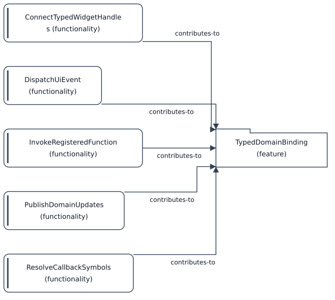

# Functionality-bidrag til Feature: TypedDomainBinding

[Viewpoint](index.md) · [Navigator](../../navigator.md)

Revisjon: `be0dfcfdca6e04f7b8c4594dc5e72d920724ef96e1f604e749432121aa83e862`.

## Functionality-bidrag til Feature: TypedDomainBinding

Kildegrunnlag: f0132, f0187, f0559, f0726, f0805.

