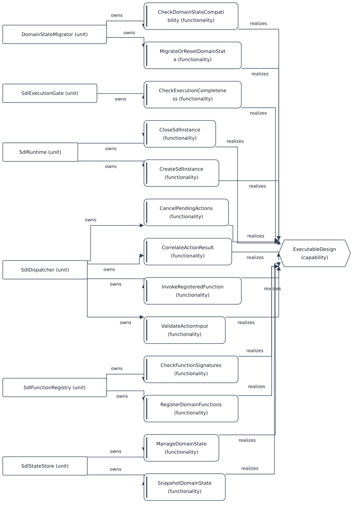

# Bidrag til kapabilitet: ExecutableDesign

[Viewpoint](index.md) · [Navigator](../../navigator.md)

Revisjon: `e946313a6ae4a80603a8f13d3467373c8fa1990eb9c42ed8f82b759ee12845e1`.

## Bidrag til kapabilitet: ExecutableDesign

Kildegrunnlag: f0081, f0084, f0085, f0086, f0087, f0140, f0142, f0214, f0215, f0560, f0589, f0603, f0743, f0848, f0849, f0850, f0851, f0859, f0872, f0873, f0903, f0904, f0907, f0908, f1077, f1242.

